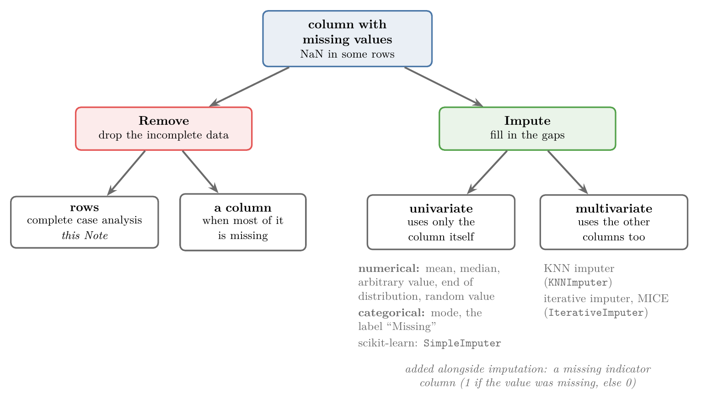
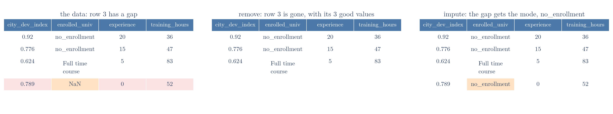
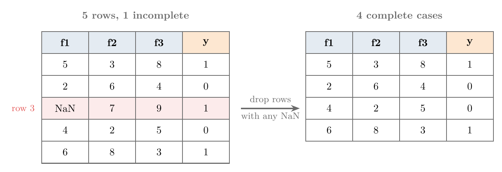
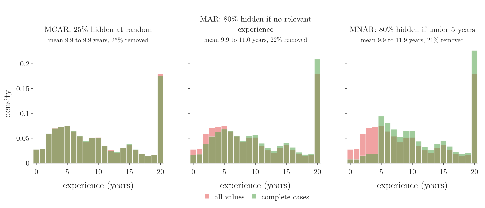
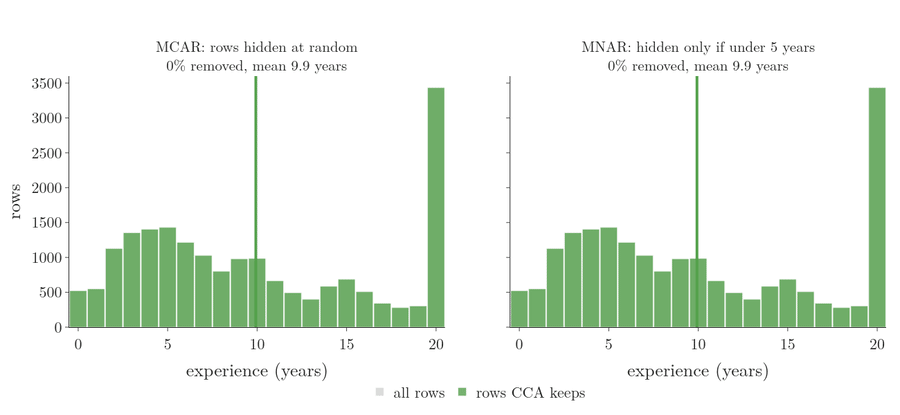
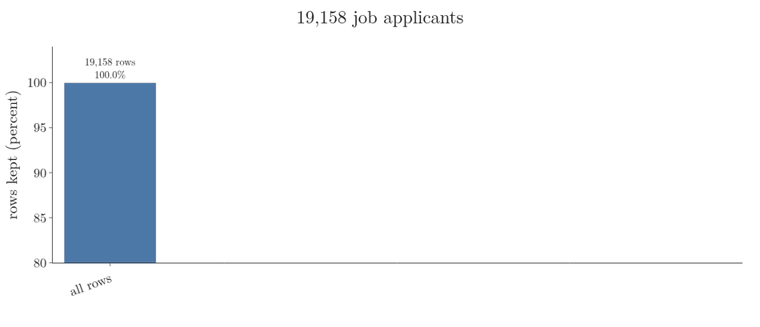
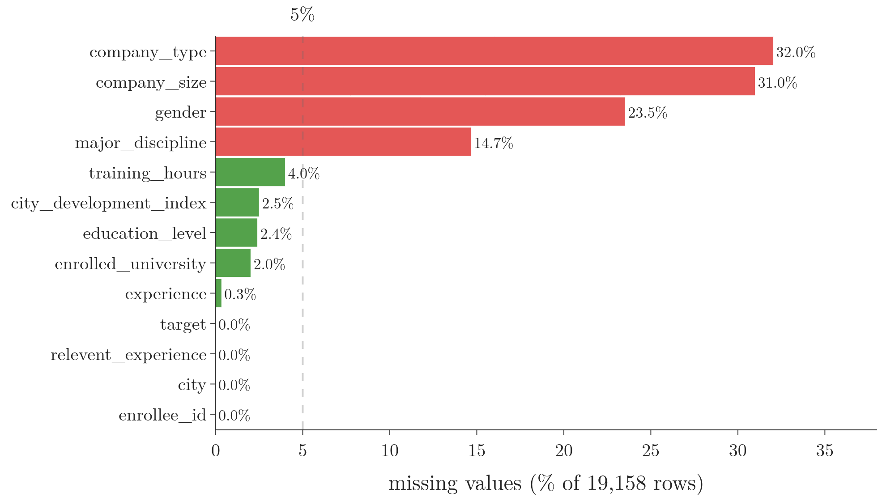
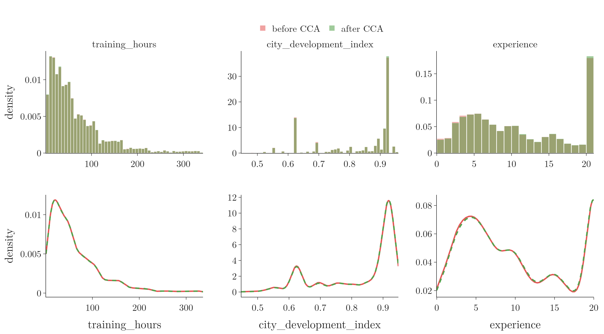
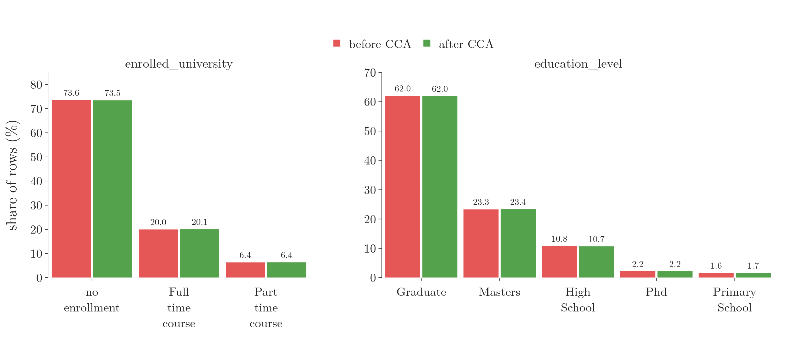

<!-- where-this-fits: generated by course_map/build_map.py; edit concepts.yaml, not this block -->
> **Where this fits:** Pipeline map step 4 (Clean). See the [Course map](../../../00-course-map/00-course-map.md).
>
> 
>
> - **Builds on:** [Poor-quality data](../../../ML/01-foundations/ML-007-challenges-in-ml/ML-007-challenges-in-ml.md#5-poor-quality-data); [Univariate analysis](../../../ML/02-getting-data/ML-019-univariate-analysis/ML-019-univariate-analysis.md#2-univariate-bivariate-and-multivariate-analysis).
> - **Leads to:** [Simple imputation (mean, median, mode, constant)](../../../ML/04-missing-data-and-outliers/ML-035-imputing-numerical-data/ML-035-imputing-numerical-data.md#2-mean-and-median-imputation); [Missing indicator](../../../ML/04-missing-data-and-outliers/ML-037-missing-indicator-random-sample/ML-037-missing-indicator-random-sample.md#6-missing-indicator); [Random sample imputation](../../../ML/04-missing-data-and-outliers/ML-037-missing-indicator-random-sample/ML-037-missing-indicator-random-sample.md#2-random-sample-imputation); [KNN imputer](../../../ML/04-missing-data-and-outliers/ML-038-knn-imputer/ML-038-knn-imputer.md#5-filling-the-gap-step-by-step); [Iterative imputation (MICE)](../../../ML/04-missing-data-and-outliers/ML-039-iterative-imputer-mice/ML-039-iterative-imputer-mice.md#6-iteration-1-one-feature-at-a-time); [XGBoost](../../../ML/08-trees-and-ensembles/ML-120-xgboost-maths/ML-120-xgboost-maths.md#6-why-xgboost-approximates-the-loss).
> - **Compare with:** [Simple imputation (mean, median, mode, constant)](../../../ML/04-missing-data-and-outliers/ML-035-imputing-numerical-data/ML-035-imputing-numerical-data.md#2-mean-and-median-imputation); [Outliers](../../../ML/04-missing-data-and-outliers/ML-040-what-are-outliers/ML-040-what-are-outliers.md#2-what-an-outlier-is).
<!-- /where-this-fits -->

## 1. Overview

> **Key point:** Missing values can be removed or filled in; complete case analysis is the simplest way of removing them: drop every row that has a gap.

Real data almost always has gaps, and most scikit-learn models refuse to train on data with gaps. This Note opens a group of Notes on handling them. [Handling missing values](../../03-feature-engineering/ML-022-what-is-feature-engineering/ML-022-what-is-feature-engineering.md#61-handling-missing-values) introduced the problem briefly; here we lay out all the techniques and then cover the first one in full.

Figure 1 is the map of the whole group. There are two options: **remove** the incomplete data, or **impute** it (fill in the gaps). Imputation itself comes in two kinds, univariate and multivariate.

{height=50%}

This Note covers the left-most box: removing rows, called complete case analysis. We also learn why data goes missing, because that decides whether removing rows is safe.

## 2. Why missing values must be handled

> **Key point:** Almost every scikit-learn algorithm fails on data with missing values, so we must deal with the gaps before training.

We use three words for the parts of a data table. A **feature** (G-772) is an input variable: one column of the table, such as `age`. The **target** (G-1949) is the output we predict. An **observation** (G-1374) is one record: one row of the table.

A **missing value** (G-1234) is a cell of the table with no value in it, shown in pandas as `NaN` ("not a number"). Most scikit-learn models refuse to train on such data, so we remove or fill the gaps first (see [handling missing values](../../03-feature-engineering/ML-022-what-is-feature-engineering/ML-022-what-is-feature-engineering.md#61-handling-missing-values)).

> **Extra:** A few scikit-learn models do accept `NaN`, for example `HistGradientBoostingClassifier`, decision trees and random forests. Most others, such as linear and logistic regression, KNN and SVMs, raise an error. Removing or filling the gaps works for all of them (scikit-learn docs, Estimators that handle NaN values).

## 3. The two options: remove or impute

> **Key point:** We can delete the incomplete data, or fill in each gap with a sensible value; filling in is used far more often.

### 3.1 Removing the incomplete data

> **Key point:** Removing is the easiest option, but it throws away good values along with the missing one.

Take a table with three features, one target and five observations. Suppose the third observation has no value in the first feature. The simplest fix is to delete that whole row and work with the four rows that remain.

Deleting the row also throws away its values in the second, third and fourth columns. Those values were fine and might have been useful. Think of a class register: crossing out a whole student because one test score is blank also throws away every score they did have. This waste is why removing rows is used less often than filling the gaps.

When a column is missing most of its values, we can instead remove the column itself. Section 6 says when.

### 3.2 Imputing: filling in the gaps

> **Key point:** Univariate imputation fills a feature using only that feature; multivariate imputation also uses the other features.

Imputation, met in [handling missing values](../../03-feature-engineering/ML-022-what-is-feature-engineering/ML-022-what-is-feature-engineering.md#61-handling-missing-values), fills each missing value with an estimate. There are two families:

- **Univariate imputation** (G-2051) looks at one feature at a time. To fill a gap in `age`, it uses only the other values of `age`.
- **Multivariate imputation** (G-1282) looks at several features together. To fill a gap in `age`, it also uses features such as `income` or `education`.

Univariate techniques depend on the type of the feature:

| Feature type | Fill each gap with |
|---|---|
| Numerical | the mean or median; an arbitrary value; a value from the end of the distribution; a random value from the column |
| Categorical | the mode (most frequent category); a new category called "Missing" |

scikit-learn's `SimpleImputer` class does all of these. Multivariate imputation has two main techniques, each with its own class:

- **KNN imputer** (G-108) (`KNNImputer`): fills a gap from the most similar observations, using the k-nearest-neighbours algorithm.
- **Iterative imputer** (G-98) (`IterativeImputer`): predicts each feature with an ML model trained on the other features, and repeats. Its algorithm is called **MICE** (G-1216).

Figure 2 compares the two options on four real rows of the job data used in Section 8, where row 3 has no `enrolled_university` value. Removing the row loses its three good values; imputing keeps them and fills the gap with the most frequent category.

{height=26%}

A last technique, the **missing indicator** (G-1233), adds a column that records whether the value was missing (1) or not (0). The indicator is used together with imputation.

### 3.3 Where each technique is covered

> **Key point:** The next five Notes cover the techniques in the order of Figure 1.

| Note | Technique |
|---|---|
| This Note | Removing rows: complete case analysis |
| [Imputing numerical data](../ML-035-imputing-numerical-data/ML-035-imputing-numerical-data.md#1-overview) | Univariate imputation of numerical columns with `SimpleImputer` |
| [Missing categorical data](../ML-036-missing-categorical-data/ML-036-missing-categorical-data.md#1-overview) | Univariate imputation of categorical columns: mode and "Missing" |
| [Missing indicator and random sample](../ML-037-missing-indicator-random-sample/ML-037-missing-indicator-random-sample.md#1-overview) | Missing indicator and random sample imputation |
| [KNN imputer](../ML-038-knn-imputer/ML-038-knn-imputer.md#1-overview) | KNN imputer (multivariate) |
| [Iterative imputer, MICE](../ML-039-iterative-imputer-mice/ML-039-iterative-imputer-mice.md#1-overview) | Iterative imputer, MICE (multivariate) |

## 4. Complete case analysis

> **Key point:** Complete case analysis keeps only the observations that have a value in every feature we use.

**Complete case analysis (CCA)** (G-425), also called **listwise deletion**, discards every observation that is missing a value in any of the features we use. Only the **complete cases** remain: observations with a value in every feature used.

Figure 3 applies it to the table of Section 3.1. Row 3 has a `NaN` in column `f1`, so the whole row goes, and four complete cases are left.



The name says what we analyse: only the complete cases. The number of columns stays the same; only the number of rows shrinks.

> **Python:** Complete case analysis is one pandas method.
>
> ```python
> df.dropna()                   # drop rows with a gap anywhere
> df.dropna(subset=["age"])     # only gaps in "age" count
> ```
>
> **`dropna`** (G-637) returns a new DataFrame without the incomplete rows. `subset` lists the columns to check; gaps in other columns are then ignored.

## 5. Why data goes missing: MCAR, MAR and MNAR

> **Key point:** CCA is safe only when the values are missing completely at random, so that the rows we drop look just like the rows we keep.

### 5.1 Missing completely at random (MCAR)

> **Key point:** Data is MCAR when the chance of a value being missing has nothing to do with any value in the data.

Suppose a table has 1,000 rows and 4 columns, and one column has 50 missing values. CCA drops those 50 rows and leaves 950. The columns stay the same.

Whether this is safe depends on *which* 50 rows are missing. If they are scattered randomly through the table, deleting them is like deleting 50 random rows. The remaining 950 rows still look like the full table.

If instead the gaps sit in a pattern, for example all in the first 50 rows or all in the last 50, there is a reason behind them. Deleting those rows then removes a particular kind of row, and the data that remains is different.

Data where the gaps are spread purely at random is called **missing completely at random (MCAR)** (G-1192). MCAR is the first condition for using CCA.

### 5.2 The other two kinds: MAR and MNAR

Statisticians name three ways in which data goes missing. MCAR is the first; the other two have a reason behind the gaps.

- **MCAR (missing completely at random):** the gaps have no reason at all. *Example:* a survey sheet gets coffee spilled on it, and a few answers become unreadable.
- **MAR (missing at random)** (G-1158): the gaps depend on *another feature that we can see*. *Example:* job applicants with no relevant experience leave the "years of experience" field empty more often. Whether `experience` is missing depends on `relevent_experience`, which is recorded.
- **MNAR (missing not at random)** (G-1248): the gaps depend on *the missing value itself*. *Example:* applicants with very little experience leave the field empty because they do not want to show it. The reason is hidden in the very value we lost.

Rubin gave the three kinds these names (Rubin 1976). The name MAR is confusing: the data is *not* missing at random overall, only at random once we know the other feature.

Figure 4 makes each kind happen on purpose, using the `experience` column of the job-applicant data from Section 8. Red is the full column; green is what CCA keeps; where the two overlap, the bars look olive. The vertical axis is **density** (bar heights scaled so each histogram's total area is 1), so a column with fewer rows can still be compared bar by bar with the full one. A green bar taller than its red bar means CCA made that value more common; a red bar sticking out means CCA lost those values.

{width=100%}

| How values were hidden | Rows removed | Mean experience kept |
|---|---|---|
| Nothing hidden | 0% | 9.9 years |
| MCAR: 25% of all rows, at random | 25% | 9.9 years |
| MAR: 80% of rows with no relevant experience | 22% | 11.0 years |
| MNAR: 80% of rows with under 5 years | 21% | 11.9 years |

Figure 5 shows two of these cases as a process. The grey bars are all the rows; the green bars are the rows CCA keeps as more and more values are hidden. On the left (MCAR) every bar shrinks by the same share, so the shape holds and the green mean line stays on the dotted one. On the right (MNAR) only the bars under 5 years shrink, and the mean line slides to the right, from 9.9 to 11.9 years.



Under MCAR, CCA removed the most rows but left the mean unchanged. Under MAR and MNAR it removed fewer rows, yet the mean rose by one to two years: the people who remained had more experience than the people who left.

> **Extra:** No check on the data we have can prove that it is MCAR. A test can only find evidence *against* MCAR (Little 1988). What we can do is check that dropping the rows changes nothing visible. Section 8 does exactly this.

## 6. When to use complete case analysis

> **Key point:** Use CCA only when the data is MCAR and each column is missing less than about 5% of its values.

There is no strict law, but a common rule of thumb has two conditions:

1. **The data is MCAR.** The gaps are spread at random (Section 5).
2. **Each feature used is missing less than 5% of its values.** Then CCA loses only a small part of the data.

The share of missing values in a column, step by step:

1. **In words:** count the missing cells in the column and divide by the number of rows.
2. **Formula:**
   $$\text{missing share} = \frac{\text{missing values}}{\text{rows}} \times 100$$
3. **Example:** the `training_hours` column of Section 8 has 766 missing values in 19,158 rows:
   $$\frac{766}{19{,}158} \times 100\ \text{percent} = 4.0\ \text{percent},$$
   which is under 5%, so it qualifies.

### 6.1 When a column is mostly missing

> **Key point:** If a column is missing almost all of its values, remove the column instead of the rows.

Suppose a column of 1,000 rows has 950 missing values. CCA on it would keep only 50 rows, which is nearly all the data gone.

The column itself carries almost no information: only 50 of its values exist. Removing the column is the better choice, and every row survives.

## 7. Advantages and disadvantages

> **Key point:** CCA is trivial to do and keeps the distributions when the data is MCAR, but it can lose much data, distort the data when not MCAR, and leaves the model unable to handle gaps later.

**Advantages:**

1. **Easy to apply.** One call to `dropna`, with no other change to the data.
2. **Keeps the distribution, if the data is MCAR.** Dropping random rows leaves every column's distribution as it was. After CCA we should always check this, by comparing each column before and after.

**Disadvantages:**

1. **It can throw away a large part of the data.** Each row is dropped if *any* of the chosen columns has a gap, so the losses add up across columns (Figure 6).
2. **It distorts the data when the gaps are not random.** If the data is MAR or MNAR, the dropped rows carry information the model never sees, as Figure 4 showed.
3. **The deployed model cannot handle missing values.** The model was trained only on complete rows. Once deployed, a new row may arrive with a gap, and the model has no way to deal with it.



The third point is the biggest. Because of it, CCA is used less often than imputation, which the next five Notes cover.

## 8. Complete case analysis on real data

> **Key point:** On 19,158 job applicants, CCA on the five columns with under 5% missing keeps 89.7% of the rows and leaves every distribution unchanged.

### 8.1 The data

> **Key point:** Each observation is a candidate who applied for a data science job; four features are missing far more than 5%.

The data describes applicants for a data science job: 19,158 rows and 13 columns. Its features include the candidate's ID, city, the **city development index** of that city (a score from 0 to 1), gender, relevant experience, university enrolment, education level, major subject, years of experience, company size and type, and hours of data science training. The target is 1 if the candidate was hired and 0 if not.

Figure 7 shows the share of missing values in every column.



- **No gaps:** `enrollee_id`, `city`, `relevent_experience`, `target`.
- **Under 5% (green):** `training_hours` 4.0%, `city_development_index` 2.5%, `education_level` 2.4%, `enrolled_university` 2.0%, `experience` 0.3%.
- **Far above 5% (red):** `company_type` 32.0%, `company_size` 31.0%, `gender` 23.5%, `major_discipline` 14.7%.

CCA on `gender` alone would delete 23.5% of the rows, and on `company_type` 32%. So only the five green columns qualify.

> **Python:** Share of missing values per column.
>
> ```python
> df = pd.read_csv("data/data_science_job.csv.gz")
> df.isnull().mean() * 100
> ```
>
> **`isnull()`** (G-974) marks each missing cell `True`. The mean of a column of `True`/`False` values is the share of `True`, since `True` counts as 1.

The file here is a gzip-compressed copy of the full data, which pandas reads directly. The data comes from the Kaggle dataset *HR Analytics: Job Change of Data Scientists*, with small changes.

### 8.2 Choosing the columns and dropping the rows

> **Key point:** We pick the columns with between 0% and 5% missing in code, then drop the rows with a gap in any of them.

With dozens of columns, reading the shares by eye is slow. A list comprehension picks the columns automatically.

> **Python:** Columns with some, but under 5%, missing.
>
> ```python
> cols = [c for c in df.columns
>         if 0 < df[c].isnull().mean() < 0.05]
> # ['city_development_index', 'enrolled_university',
> #  'education_level', 'experience', 'training_hours']
> ```

Of the five columns, three are numerical (`city_development_index`, `experience`, `training_hours`) and two are categorical (`enrolled_university`, `education_level`).

Before dropping, we check how much data we would keep. The share of rows kept, step by step:

1. **In words:** count the rows with no gap in the chosen columns, and divide by all rows.
2. **Formula:**
   $$\text{rows kept} = \frac{\text{complete cases}}{\text{all rows}}$$
3. **Example:**
   $$\frac{17{,}182}{19{,}158} = 0.897,$$
   so 89.7% of the rows remain, and 1,976 rows are dropped.

> **Python:** Checking the loss, then applying CCA.
>
> ```python
> len(df.dropna(subset=cols)) / len(df)   # 0.897
> cca = df.dropna(subset=cols)
> df.shape, cca.shape  # (19158, 13), (17182, 13)
> ```

The five columns are each missing at most 4%, yet together they cost 10.3% of the rows. The loss is disadvantage 1 of Section 7: a row goes if *any* of the columns has a gap.

> **Extra:** Calling `df.dropna()` with no `subset` would also count gaps in `gender`, `company_size` and the other red columns. The call keeps only 8,434 rows, 44% of the data.

### 8.3 Numerical columns: comparing distributions

> **Key point:** For a numerical column, plot its histogram or density before and after CCA; if the shapes match, CCA did no harm.

For each numerical column, we draw the histogram of the full column and of the CCA column on the same axes. Both use **density** on the vertical axis, so that bars from 19,158 rows and from 17,182 rows have comparable heights.

Figure 8 shows the result. In the top row, red is before and green is after; where they overlap, the bars look olive. The bottom row shows the same columns as smooth density curves (**KDE** (G-1005), a smooth curve fitted to the data; see [density plot](../../02-getting-data/ML-019-univariate-analysis/ML-019-univariate-analysis.md#7-density-plot)), red solid before and green dashed after.

{width=100%}

Only a few thin slivers of red or green stick out of the bars, and the density curves lie on top of each other. The numbers agree:

| Column | Mean before | Mean after | Median before | Median after |
|---|---|---|---|---|
| `training_hours` | 65.19 | 65.06 | 47 | 47 |
| `city_development_index` | 0.829 | 0.831 | 0.903 | 0.910 |
| `experience` | 9.93 | 10.04 | 9 | 9 |

The distributions did not change, which supports the view that these gaps are MCAR. CCA is safe for these three columns.

> **Python:** Overlaying the two histograms with Plotly.
>
> ```python
> fig = go.Figure()
> fig.add_trace(go.Histogram(x=df["training_hours"],
>     histnorm="probability density", opacity=0.55))
> fig.add_trace(go.Histogram(x=cca["training_hours"],
>     histnorm="probability density", opacity=0.55))
> fig.update_layout(barmode="overlay")
> ```
>
> `barmode="overlay"` draws the two histograms on top of each other, and `opacity` makes them see-through. The Notebook also draws the density curves.

In this file, `experience` runs from 0 to 20. The last bar is so tall because the value 20 alone holds 3,434 rows, against 304 for 19.

### 8.4 Categorical columns: comparing category shares

> **Key point:** For a categorical column, compare each category's share before and after CCA; the shares should stay the same.

A categorical column has no histogram of numbers, so we compare the share of each category instead. If Graduates are 62% of the data before CCA, they should still be about 62% after.

Figure 9 and the tables below show the shares for the two categorical columns.

{width=100%}

| `enrolled_university` | Before | After |
|---|---|---|
| no enrolment | 73.6% | 73.5% |
| full-time course | 20.0% | 20.1% |
| part-time course | 6.4% | 6.4% |

| `education_level` | Before | After |
|---|---|---|
| Graduate | 62.0% | 62.0% |
| Masters | 23.3% | 23.4% |
| High School | 10.8% | 10.7% |
| PhD | 2.2% | 2.2% |
| Primary School | 1.6% | 1.7% |

Every share moved by at most 0.1 percentage points. A large change, for example a category dropping from 19% to 12%, would warn us that the gaps are not random. Here CCA is safe for all five columns.

> **Python:** Category shares before and after.
>
> ```python
> pd.concat([df["education_level"].value_counts(normalize=True),
>            cca["education_level"].value_counts(normalize=True)],
>           axis=1)
> ```
>
> `value_counts(normalize=True)` gives each category's share of the non-missing values, so the shares add up to 1.

> **Extra:** A common slip is to compute the "before" shares as `value_counts() / len(df)`. The `len(df)` version divides by all rows, including the rows where the column is missing, so the shares add up to less than 1. For `enrolled_university` this gives 72.1% for no enrolment, against 73.5% after CCA, which looks like a shift. With `normalize=True` both sides count only real values, and the shift disappears: 73.6% against 73.5%.

## 9. Summary

| Option | What it does | Use when |
|---|---|---|
| Complete case analysis | drops every row with a gap in the chosen columns | data is MCAR and each column is missing under about 5% |
| Remove the column | drops a column that is mostly missing | almost all of the column is missing |
| Univariate imputation | fills a gap from the same column (mean, median, mode, ...) | [numerical](../ML-035-imputing-numerical-data/ML-035-imputing-numerical-data.md#1-overview), [categorical](../ML-036-missing-categorical-data/ML-036-missing-categorical-data.md#1-overview) and [indicator and random sample](../ML-037-missing-indicator-random-sample/ML-037-missing-indicator-random-sample.md#1-overview) imputation |
| Multivariate imputation | fills a gap using other columns (KNN, MICE) | [KNN imputer](../ML-038-knn-imputer/ML-038-knn-imputer.md#1-overview) and [MICE](../ML-039-iterative-imputer-mice/ML-039-iterative-imputer-mice.md#1-overview) |

- Most scikit-learn models cannot train on missing values, so we remove or impute them first.
- Complete case analysis (listwise deletion) keeps only rows with a value in every chosen column: `df.dropna(subset=cols)`. It is the easiest fix, but it also throws away the good values in every dropped row, and the losses add up across columns (five columns missing at most 4% each cost 10.3% of the rows).
- Data is MCAR when the gaps have no reason; MAR when they depend on another column; MNAR when they depend on the missing value itself. CCA is safe only for MCAR, because only then do the dropped rows look like the kept ones: under MAR and MNAR the mean experience rose from 9.9 to 11.0 and 11.9 years.
- After CCA, compare each numerical column's histogram or density, and each categorical column's category shares, before and after. They should match, because no test on the data can prove MCAR; a visible shift warns that the gaps are not random.
- On the job-applicant data, CCA on five columns kept 89.7% of the rows and changed no distribution, so CCA was safe for those five columns.
- The main drawback: a model trained only on complete rows cannot handle gaps in new data, so imputation is used more often.
- So dropping the incomplete rows is the simplest way to deal with gaps, and it is safe only when the gaps are random and few.

## 10. Sources

**Built from**

- CampusX, "Handling Missing Data | Part 1 | Complete Case Analysis", YouTube, https://www.youtube.com/watch?v=aUnNWZorGmk

**Other references**

- Rubin, D. B. (1976). Inference and Missing Data. *Biometrika* 63(3), 581–592.
- Little, R. J. A. (1988). A Test of Missing Completely at Random for Multivariate Data with Missing Values. *Journal of the American Statistical Association* 83(404), 1198–1202.
- scikit-learn User Guide, *Imputation of missing values*, section "Estimators that handle NaN values".

## 11. Key terms

Terms taught in this Note come first; linked terms are recaps, taught in the Note the link opens.

| Term | Meaning |
|---|---|
| Univariate imputation (G-2051) | Filling the gaps in a column (imputation) using only that column's other values. |
| Multivariate imputation (G-1282) | Filling the gaps in one column using the values of the other columns too (as the KNN and iterative imputers do), so each fill fits the rest of its row. |
| Complete case analysis (CCA) (G-425) | Dropping every row that has a missing value in any chosen column; also called listwise deletion. |
| dropna (G-637) | The pandas method that drops rows (or columns) with missing values. |
| MCAR (G-1192) | Missing completely at random: the gaps have no relation to any value in the data. |
| MAR (G-1158) | Missing at random: the gaps depend on another, recorded column. |
| MNAR (G-1248) | Missing not at random: the gaps depend on the missing value itself. |
| isnull (G-974) | The pandas method that marks each missing cell `True`. |
| 5% rule of thumb (G-52) | Drop the incomplete rows (complete case analysis) only for columns missing less than about 5% of their values, so only a small part of the data is lost. |
| Complete case (G-426) | A row with a value in every column used. |
| [Feature](../../../ML/01-foundations/ML-002-ai-vs-ml-vs-dl/ML-002-ai-vs-ml-vs-dl.md#52-features-chosen-by-us-or-learned) (G-772) | One piece of information about each example that a model uses (e.g. a student's CGPA). |
| [Target](../../../ML/01-foundations/ML-003-types-of-ml/ML-003-types-of-ml.md#21-learning-from-inputs-and-outputs) (G-1949) | The output column we predict, such as the class; also called the label. |
| [Observation](../../../ML/01-foundations/ML-003-types-of-ml/ML-003-types-of-ml.md#21-learning-from-inputs-and-outputs) (G-1374) | One record of a dataset: one row of the data table. |
| [Missing value](../../../ML/02-getting-data/ML-014-working-with-csv/ML-014-working-with-csv.md#9-loading-only-some-columns-usecols) (G-1234) | An empty entry, shown by pandas as `NaN`. |
| [`KNNImputer`](../../../ML/04-missing-data-and-outliers/ML-038-knn-imputer/ML-038-knn-imputer.md#7-knn-imputation-with-scikit-learn) (G-108) | scikit-learn's class for KNN imputation: it fills each gap from the most similar observations (the nearest neighbours), using their values of that feature. |
| [`IterativeImputer`](../../../ML/04-missing-data-and-outliers/ML-039-iterative-imputer-mice/ML-039-iterative-imputer-mice.md#8-the-iterative-imputer-in-scikit-learn) (G-98) | scikit-learn's class that fills missing values by predicting each feature with gaps from the other features, repeating until the fills settle (MICE). Still experimental, so it needs an extra import. |
| [MICE](../../../ML/04-missing-data-and-outliers/ML-039-iterative-imputer-mice/ML-039-iterative-imputer-mice.md#1-overview) (G-1216) | A way to fill gaps: each column's missing values are predicted by a model trained on the other columns, and the rounds repeat until the filled values settle (Multivariate Imputation by Chained Equations, the algorithm behind the iterative imputer). |
| [Missing indicator](../../../ML/04-missing-data-and-outliers/ML-037-missing-indicator-random-sample/ML-037-missing-indicator-random-sample.md#6-missing-indicator) (G-1233) | A 0/1 (True/False) column recording whether a value was missing, added next to the imputed column so the model can learn whether being missing itself matters. |
| [Kernel density estimate (KDE)](../../../ML/02-getting-data/ML-019-univariate-analysis/ML-019-univariate-analysis.md#7-density-plot) (G-1005) | A smooth curve that estimates a column's PDF from its values, built by adding a kernel centred on every data point; a KDE plot draws it. |
| [SimpleImputer](../../../ML/03-feature-engineering/ML-027-column-transformer/ML-027-column-transformer.md#41-fever-fill-the-missing-values) (G-1809) | scikit-learn's class that fills missing values, by default with the column's mean. |
