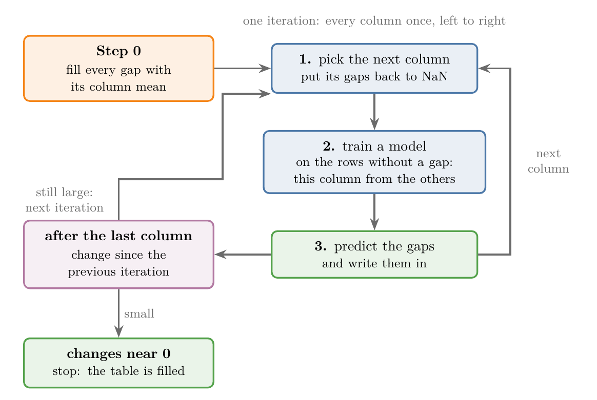
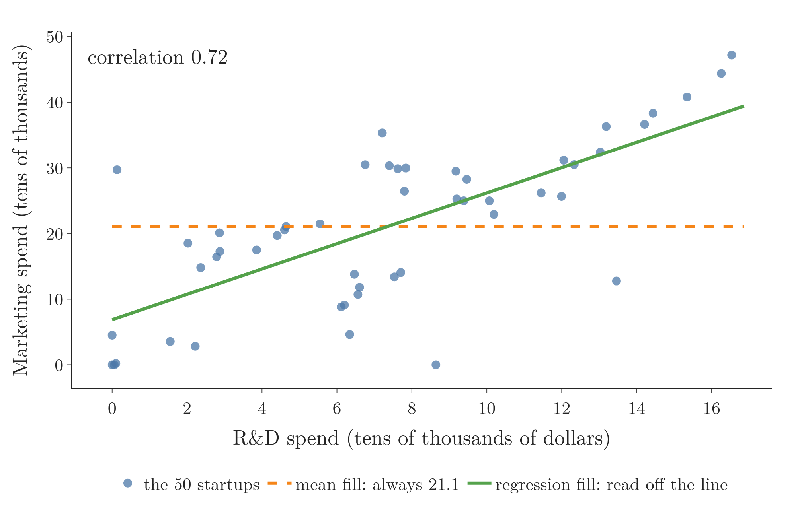
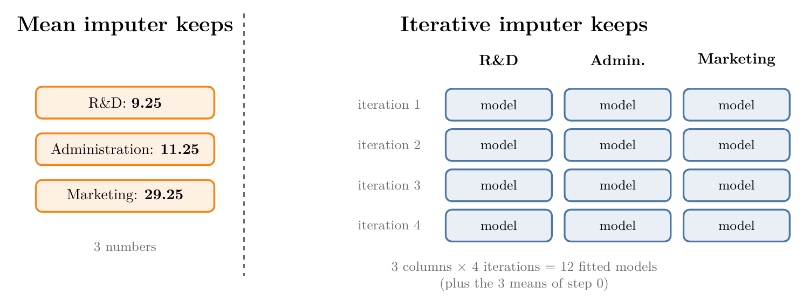
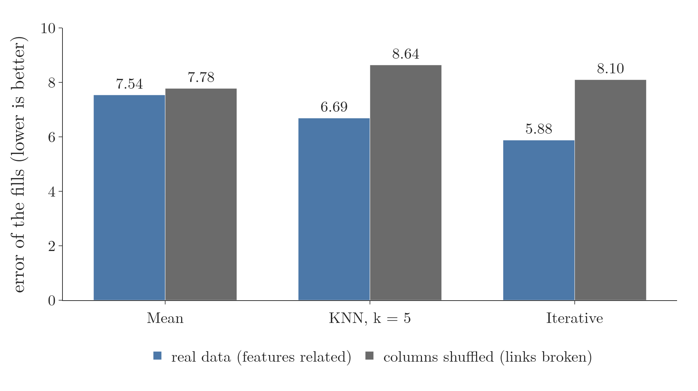

<!-- where-this-fits: generated by course_map/build_map.py; edit concepts.yaml, not this block -->
> **Where this fits:** Pipeline map step 4 (Clean). See the [Course map](../../../00-course-map/00-course-map.md).
>
> 
>
> - **Builds on:** [Missing values](../../../ML/01-foundations/ML-007-challenges-in-ml/ML-007-challenges-in-ml.md#5-poor-quality-data); [Simple imputation (mean, median, mode, constant)](../../../ML/03-feature-engineering/ML-022-what-is-feature-engineering/ML-022-what-is-feature-engineering.md#1-overview).
> - **Leads to:** [Simple linear regression](../../../ML/06-regression/ML-049-simple-linear-regression/ML-049-simple-linear-regression.md#1-overview).
> - **Compare with:** [KNN imputer](../../../ML/04-missing-data-and-outliers/ML-038-knn-imputer/ML-038-knn-imputer.md#2-univariate-and-multivariate-imputation).
<!-- /where-this-fits -->

## 1. Overview

> **Key point:** MICE fills every gap with its feature's mean first, then improves the fills one feature at a time with a model trained on the other features, and repeats until the fills stop changing.

A **feature** (G-772) is an input variable (one column of the data table), and an **observation** (G-1374) is one record (one row). The **target** (G-1949) is the output we predict.

A method that fills a gap using the other features too is called **multivariate imputation** (G-1282). The **KNN imputer** (G-1017; see [the nearest-neighbour idea](../ML-038-knn-imputer/ML-038-knn-imputer.md#3-the-nearest-neighbour-idea)) was the first such technique: it fills a gap from the observations most similar to the one with the gap. This Note covers the second one, the **iterative imputer** (G-978). The iterative imputer turns each feature with gaps into a small prediction problem: that feature is the output, the other features are the inputs. Think of a crossword: each answer you write in gives letters that help with the crossing answers, so you go round the grid several times, fixing earlier guesses as the crossings fill in.

The algorithm behind it is **MICE** (G-1216), short for **Multivariate Imputation by Chained Equations**. The same letters are also read as **Multiple** Imputation by Chained Equations, after the several filled copies of the data that statisticians make with it (Section 8.5). Figure 1 shows the whole loop:

- **Step 0:** fill every gap with the mean of its feature.
- **One iteration:** for each feature in turn, put its gaps back to NaN ("not a number", how pandas marks a gap), train a model on the observations without a gap, and predict the gaps.
- **Stop** when the fills hardly change from one iteration to the next.

{width=100%}

Each model is one "equation" that predicts one feature. The equations are "chained" because each one uses the latest fills of the others. One model per feature, each fed by the others' latest fills, is what **chained equations** (G-373) means.

## 2. When to use MICE

> **Key point:** MICE suits data that is missing at random (MAR): the gaps can be predicted from the other features.

Data goes missing in [three ways](../ML-034-complete-case-analysis/ML-034-complete-case-analysis.md#5-why-data-goes-missing-mcar-mar-and-mnar):

- **MCAR (missing completely at random)** (G-1192): the value was never collected, for no reason related to the data.
- **MAR (missing at random)** (G-1158): whether a value is missing depends on other features we can see. For example, older people skip an income question more often, and age is recorded. The other features carry information about the missing value.
- **MNAR (missing not at random)** (G-1248): whether a value is missing depends on the value itself, for example high earners hiding their income. The other features cannot fully account for the gaps.

MICE predicts a missing value from the other features, so it needs those features to be related to it. Imputation methods such as MICE commonly assume MAR, and checking that MAR is plausible is the first step of a MICE analysis (van Buuren and Groothuis-Oudshoorn 2011, §3.1 and §6.2). We can run MICE on any data, but it gives its best results under MAR.

Figure 2 shows what "related" looks like in the 50 Startups data of Section 4. Watch the two lines: the mean fill gives every missing Marketing value the same 21.1, while a regression fill follows the points up as R&D grows.

{width=100%}

## 3. Advantages and disadvantages

> **Key point:** MICE is usually more accurate than simpler imputers, but it is slow and its fitted models must be kept for production.

**Advantage:**

- **Accurate.** The fills come from a model that uses every other feature, so they are usually closer to the truth than mean or median fills. Section 8.4 measures the gap on real data.

**Disadvantages:**

1. **Slow.** Every iteration trains one model per feature with gaps, and we run several iterations. On large data this takes time.
2. **More to keep in production.** A new observation with a gap must be filled the same way, so the fitted models are kept on the server: one model per feature and iteration, in the attribute `imputation_sequence_` (scikit-learn docs, IterativeImputer). Filling a new observation means running those models again. Mean imputation keeps only one number per feature.

Figure 3 counts both on the 5-row table of Section 4. Watch the right side: one model per feature for every iteration the imputer ran.



## 4. The example table

> **Key point:** Five startups, three spend features, one gap in each.

The data is the "50 Startups" dataset: for 50 companies, the money spent on R&D, administration and marketing, and the profit. We keep only the three spend features, because imputation is done on the inputs, not on the target `Profit`.

To follow every step by hand, we:

1. Divide all amounts by 10,000 dollars and round to whole numbers.
2. Keep 5 random observations.
3. Hide one value in each feature.

| Row | R&D | Administration | Marketing |
|---|---|---|---|
| 1 | 8 | 15 | 30 |
| 2 | **NaN** (4) | 5 | 20 |
| 3 | 15 | 10 | 41 |
| 4 | 12 | **NaN** (16) | 26 |
| 5 | 2 | 15 | **NaN** (3) |

The numbers in brackets are the hidden true values. The algorithm never sees them; we use them at the end to judge the fills.

## 5. Step 0: fill with the column means

> **Key point:** The first guess for every gap is the mean of its feature: 9.25, 11.25 and 29.25.

MICE needs a complete table to train its first models, so it starts with the simplest fill (see [mean and median imputation](../ML-035-imputing-numerical-data/ML-035-imputing-numerical-data.md#2-mean-and-median-imputation)):

- **R&D:**

  $$(8 + 15 + 12 + 2) / 4 = 9.25$$

- **Administration:**

  $$(15 + 5 + 10 + 15) / 4 = 11.25$$

- **Marketing:**

  $$(30 + 20 + 41 + 26) / 4 = 29.25$$


The mean-filled table is **iteration 0** (G-977). The mean ignores the other features, so these fills are rough starting points that the next steps improve.

## 6. Iteration 1: one feature at a time

> **Key point:** For each feature, left to right: put its gap back to NaN, train a linear regression on the other four observations, predict the gap.

Figure 4 runs the whole process on the table. Iteration 1 goes through the three features in order. In each frame, orange cells hold the mean fills, the red cell is the gap being predicted, green cells are the training outputs (the known values of the feature being predicted) and blue cells are the training inputs (the other features).


Any regression model can do the predicting: linear regression, a decision tree, a random forest. Here we use **linear regression** (G-1094; see [a line through the data](../../06-regression/ML-049-simple-linear-regression/ML-049-simple-linear-regression.md#3-a-line-through-the-data)), which fits the straight line (with two inputs, the flat plane) closest to the training points. Values are kept to two decimals, as in a hand calculation.

### 6.1 The R&D column

> **Key point:** R&D of row 2 is predicted from its Administration (5) and Marketing (20): 23.14.

1. Put the R&D gap of row 2 back to NaN. The mean fills in the other features (11.25, 29.25) stay.
2. The four observations with an R&D value become training data. Inputs: Administration and Marketing. Output: R&D.

| Row | Administration (input) | Marketing (input) | R&D (output) |
|---|---|---|---|
| 1 | 15 | 30 | 8 |
| 3 | 10 | 41 | 15 |
| 4 | 11.25 | 26 | 12 |
| 5 | 15 | 29.25 | 2 |

3. Train a linear regression on these four observations and predict R&D for row 2.

**Where the coefficients come from.** In words: we look for the plane

$$\text{R and D} = \text{start} + w_A \times \text{Admin} + w_M \times \text{Marketing}$$

that misses the four training values by the least total squared **residual** (G-705), the gap between an actual and a predicted value. The weights $w_A$ and $w_M$ are the **coefficients** (G-407) of the model, and "start", the starting value, is the **intercept** (G-960). This is the [least-squares idea](../../06-regression/ML-050-linear-regression-maths/ML-050-linear-regression-maths.md#4-finding-the-minimum) with two inputs instead of one: set the slope of the total squared error to zero for each weight. Working with deviations from the means keeps it to two equations.

*Step 1: means.* Write $A$ for Administration, $M$ for Marketing and $R$ for R&D.

$$\bar A = \frac{15 + 10 + 11.25 + 15}{4} = 12.81$$

$$\bar M = \frac{30 + 41 + 26 + 29.25}{4} = 31.56$$

$$\bar R = \frac{8 + 15 + 12 + 2}{4} = 9.25$$

*Step 2: deviations from the means, and their products.* $a$, $m$ and $r$ below are the deviations $A - \bar A$, $M - \bar M$ and $R - \bar R$.

| Row | $a$ | $m$ | $r$ | $a^2$ | $a m$ | $m^2$ | $a r$ | $m r$ |
|---|---|---|---|---|---|---|---|---|
| 1 | 2.19 | -1.56 | -1.25 | 4.79 | -3.42 | 2.44 | -2.73 | 1.95 |
| 3 | -2.81 | 9.44 | 5.75 | 7.91 | -26.54 | 89.07 | -16.17 | 54.27 |
| 4 | -1.56 | -5.56 | 2.75 | 2.44 | 8.69 | 30.94 | -4.30 | -15.30 |
| 5 | 2.19 | -2.31 | -7.25 | 4.79 | -5.06 | 5.35 | -15.86 | 16.77 |
| Sum | | | | 19.92 | -26.33 | 127.80 | -39.06 | 57.69 |

*Step 3: the two equations.* Setting the slope of the total squared residual to zero for each weight gives one equation per weight, the **normal equations** (G-1345; derived in [the gradient, then zero](../../06-regression/ML-053-multiple-lr-maths/ML-053-multiple-lr-maths.md#52-the-gradient-then-zero)). Written with the deviation sums of the table, they are:

$$\textstyle\sum a^2\thinspace w_A + \sum a m\thinspace w_M = \sum a r$$

$$\textstyle\sum a m\thinspace w_A + \sum m^2\thinspace w_M = \sum m r$$

With the numbers of the Sum row:

$$19.92\thinspace w_A - 26.33\thinspace w_M = -39.06$$

$$-26.33\thinspace w_A + 127.80\thinspace w_M = 57.69$$

*Step 4: solve.* Two equations with two unknowns have a ready-made solution, **Cramer's rule**. Write the equations as

$$b_{11}\thinspace w_A + b_{12}\thinspace w_M = c_1$$

$$b_{12}\thinspace w_A + b_{22}\thinspace w_M = c_2$$

so here $b_{11} = 19.92$, $b_{12} = -26.33$, $b_{22} = 127.80$, $c_1 = -39.06$ and $c_2 = 57.69$. The **determinant** of the left side is the number

$$\det = b_{11}\thinspace b_{22} - b_{12}^2$$

and Cramer's rule gives each weight:

$$w_A = \frac{c_1\thinspace b_{22} - b_{12}\thinspace c_2}{\det}$$

$$w_M = \frac{b_{11}\thinspace c_2 - b_{12}\thinspace c_1}{\det}$$

With our numbers, the determinant is

$$19.92 \times 127.80 - (-26.33)^2$$

$$= 2545.8 - 693.2 = 1852.6$$

For $w_A$, the two products are

$$c_1\thinspace b_{22} = (-39.06)(127.80) = -4992.0$$

$$b_{12}\thinspace c_2 = (-26.33)(57.69) = -1519.0$$

Subtracting a negative number adds it:

$$w_A = \frac{-4992.0 - (-1519.0)}{1852.6}$$

$$= \frac{-4992.0 + 1519.0}{1852.6}$$

$$= \frac{-3473.0}{1852.6} = -1.875$$

For $w_M$, the two products are

$$b_{11}\thinspace c_2 = (19.92)(57.69) = 1149.2$$

$$b_{12}\thinspace c_1 = (-26.33)(-39.06) = 1028.4$$

$$w_M = \frac{1149.2 - 1028.4}{1852.6}$$

$$= \frac{120.8}{1852.6} = 0.065$$

*Step 5: the starting value.* The plane passes through the point of means:

$$\text{start} = \bar R - w_A \bar A - w_M \bar M$$

$$\text{start} = 9.25 + 1.875 \times 12.81 - 0.065 \times 31.56$$

$$\text{start} = 9.25 + 24.02 - 2.06 = 31.21$$

The prediction follows the usual three steps:

1. **In words:** R&D is a starting value plus a weight times Administration plus a weight times Marketing, with the weights just found.
2. **Formula:** the trained model is
   $$\text{R and D} = 31.21 - 1.875 \times \text{Admin} + 0.065 \times \text{Marketing}$$
3. **Example:** row 2 has Administration 5 and Marketing 20:
   $$31.21 - 1.875 \times 5 + 0.065 \times 20$$

   $$= 31.21 - 9.37 + 1.30 = 23.14$$


The gap now holds 23.14 instead of the mean 9.25.

### 6.2 The Administration column

> **Key point:** Administration of row 4 is predicted from R&D and Marketing, using the new 23.14: 11.06.

Put the Administration gap of row 4 back to NaN. The training rows are rows 1, 2, 3 and 5, with R&D and Marketing as inputs:

| Row | R&D (input) | Marketing (input) | Administration (output) |
|---|---|---|---|
| 1 | 8 | 30 | 15 |
| 2 | 23.14 | 20 | 5 |
| 3 | 15 | 41 | 10 |
| 5 | 2 | 29.25 | 15 |

Row 2 already uses its new R&D fill, 23.14. The coefficients come from the same five steps as in Section 6.1, with Administration as the output. Steps 1 and 2 (means, deviations and their products) repeat Section 6.1 row by row; the Notebook adds them up. The sums of squared and crossed deviations:

| Sum | $\sum a^2$ (R&D) | $\sum a m$ | $\sum m^2$ (Marketing) | $\sum a r$ | $\sum m r$ |
|---|---|---|---|---|---|
| Value | 249.09 | -70.91 | 221.55 | -125.88 | 45.94 |

Here $a$, $m$ and $r$ are the deviations of R&D, Marketing and Administration from their means (12.04, 30.06 and 11.25).

$$249.09\thinspace w_{R} - 70.91\thinspace w_M = -125.88$$

$$-70.91\thinspace w_{R} + 221.55\thinspace w_M = 45.94$$

Cramer's rule of Section 6.1, step by step:

$$\det = 249.09 \times 221.55 - (-70.91)^2$$

$$= 55{,}185.9 - 5{,}028.2 = 50{,}158$$

For $w_R$:

$$(-125.88)(221.55) = -27{,}888.7$$

$$(-70.91)(45.94) = -3{,}257.6$$

$$w_R = \frac{-27{,}888.7 + 3{,}257.6}{50{,}158}$$

$$= \frac{-24{,}631}{50{,}158} = -0.491$$

For $w_M$:

$$(249.09)(45.94) = 11{,}443.2$$

$$(-70.91)(-125.88) = 8{,}926.2$$

$$w_M = \frac{11{,}443.2 - 8{,}926.2}{50{,}158}$$

$$= \frac{2{,}517}{50{,}158} = 0.050$$

The starting value, as in step 5, with the weights to four decimals ($-0.4910$ and $0.0502$):

$$\text{start} = 11.25 + 0.4910 \times 12.04$$

$$\qquad - 0.0502 \times 30.06$$

The two products:

$$0.4910 \times 12.04 = 5.91$$

$$0.0502 \times 30.06 = 1.51$$

$$\text{start} = 11.25 + 5.91 - 1.51 = 15.65$$

The model is:

$$\text{Admin} = 15.65 - 0.491 \times \text{R and D} + 0.050 \times \text{Marketing}$$

Row 4 has R&D 12 and Marketing 26:

$$15.65 - 0.491 \times 12 + 0.050 \times 26$$

$$= 15.65 - 5.89 + 1.30 = 11.06$$

### 6.3 The Marketing column

> **Key point:** Marketing of row 5 is predicted from R&D and Administration: 31.56.

Put the Marketing gap of row 5 back to NaN. The training rows are rows 1 to 4, which now include both new fills, 23.14 and 11.06.

The inputs are R&D and Administration. The five steps of Section 6.1 again; as in Section 6.2, the Notebook adds up the deviation products (means 14.54 for R&D, 10.27 for Administration, 29.25 for Marketing):

| Sum | $\sum a^2$ (R&D) | $\sum a d$ | $\sum d^2$ (Admin) | $\sum a m$ | $\sum d m$ |
|---|---|---|---|---|---|
| Value | 123.39 | -78.39 | 50.84 | -70.80 | 46.55 |

Here $a$, $d$ and $m$ are the deviations of R&D, Administration and Marketing.

$$123.39\thinspace w_R - 78.39\thinspace w_A = -70.80$$

$$-78.39\thinspace w_R + 50.84\thinspace w_A = 46.55$$

$$\text{determinant} = 123.39 \times 50.84 - (-78.39)^2$$

$$\text{determinant} = 129.2$$

The determinant is small, so rounding the sums to two decimals changes it noticeably (these rounded entries give 128.2); the values here use the full-precision sums.

Cramer's rule, with the products computed from the full-precision sums. For $w_R$:

$$c_1\thinspace b_{22} = -3{,}599.41$$

$$b_{12}\thinspace c_2 = -3{,}649.31$$

$$w_R = \frac{-3{,}599.41 + 3{,}649.31}{129.2}$$

$$= \frac{49.9}{129.2} = 0.386$$

For $w_A$:

$$b_{11}\thinspace c_2 = 5{,}744.64$$

$$b_{12}\thinspace c_1 = 5{,}549.41$$

$$w_A = \frac{5{,}744.64 - 5{,}549.41}{129.2}$$

$$= \frac{195.2}{129.2} = 1.511$$

The starting value:

$$\text{start} = 29.25 - 0.386 \times 14.54 - 1.511 \times 10.27$$

$$= 29.25 - 5.61 - 15.52 = 8.12$$

The model is:

$$\text{Marketing} = 8.12 + 0.386 \times \text{R and D} + 1.511 \times \text{Admin}$$

Row 5 has R&D 2 and Administration 15:

$$8.12 + 0.386 \times 2 + 1.511 \times 15$$

$$= 8.12 + 0.77 + 22.67 = 31.56$$

One pass that re-predicts the gaps of every feature once, in order, is one **iteration** (G-976). After the last feature, iteration 1 is complete and the table has no gaps:

| Gap | Iteration 0 (mean) | Iteration 1 |
|---|---|---|
| R&D, row 2 | 9.25 | 23.14 |
| Administration, row 4 | 11.25 | 11.06 |
| Marketing, row 5 | 29.25 | 31.56 |

## 7. Repeating until the fills settle

> **Key point:** We subtract each iteration's table from the previous one and repeat until every change is close to 0.

### 7.1 The change between iterations

> **Key point:** After iteration 1, the changes are +13.89, -0.19 and +2.31: still large, so we continue.

Subtracting the iteration-0 table from the iteration-1 table gives 0 for every known value, since those never change. Only the three gaps show a change:

- R&D:

  $$23.14 - 9.25 = 13.89$$

- Administration:

  $$11.06 - 11.25 = -0.19$$

- Marketing:

  $$31.56 - 29.25 = 2.31$$


These differences measure how far the regression fills moved away from the mean fills. While they are large, the fills are still moving.

### 7.2 Why one iteration is not enough

> **Key point:** The first models were trained on mean fills, which may be wrong; each new iteration trains on better fills and gets closer to a stable answer.

In iteration 1, the R&D model was trained with Administration 11.25 and Marketing 29.25 in its rows: the rough mean fills. Its prediction inherits that error.

Iteration 2 starts from the iteration-1 table and repeats the same three steps: R&D, then Administration, then Marketing. Every model now trains on better fills than before.

| Gap | Iteration 1 | Iteration 2 | Change |
|---|---|---|---|
| R&D, row 2 | 23.14 | 23.78 | +0.64 |
| Administration, row 4 | 11.06 | 11.22 | +0.16 |
| Marketing, row 5 | 31.56 | 38.87 | +7.31 |

The R&D and Administration changes shrank. The Marketing change grew: the fills can swing up and down for a few iterations before they settle.

### 7.3 When to stop

> **Key point:** Stop when all changes are close to 0, or after a fixed number of iterations such as 10.

Two stopping rules are common:

1. **Changes below a threshold:** stop when every fill moves by less than a small amount between two iterations.
2. **A fixed number of iterations:** for example 5, 10 or 20.

Figure 5 continues the example for 10 iterations at full precision. With linear regression (blue), the fills settle after about 5 iterations at 26.72, 13.02 and 70.69. The point where the fills hardly change between two iterations is called **convergence** (G-472).

{width=100%}

> **Extra:** Rounding to two decimals at each step makes the hand numbers differ slightly from the full-precision ones (31.56 against 31.60 for Marketing in iteration 1, and 38.87 against 39.39 in iteration 2); the settled values are the same.

> **Extra:** Settled is not the same as correct. The true values are 4, 16 and 3, and the linear-regression fills end far from them. Each model learns from only four observations and two inputs. At the settled values, all three linear models fit their four training observations exactly: every **residual** (G-705), the actual value minus the predicted one, is 0.00. Two of the gaps are also predicted from inputs outside the training range: the R&D gap uses Administration 5, below the training values 10 to 15, and the Marketing gap uses R&D 2, below the training values 8 to 26.72. Predicting outside the training range is **extrapolation** (G-738): a linear model then simply extends its plane, far beyond any value it was trained on (70.69 for a feature whose known values run from 20 to 41). With scikit-learn's default model, **`BayesianRidge`** (G-65, orange), a linear regression that pulls its coefficients a little towards 0, the fills settle at 10.71, 6.33 and 12.99: closer for R&D and Marketing. On real data with more observations, the fills come much closer to the truth (Section 8.4).

## 8. The iterative imputer in scikit-learn

> **Key point:** **`IterativeImputer`** (G-98) runs the whole MICE loop; it is still experimental, so it needs an extra import first.

> **Extra:** The rest of this section goes beyond the hand calculation: it covers the scikit-learn class, its settings, and a test on the full 50-row data.

### 8.1 Switching on the experimental class

> **Key point:** `from sklearn.experimental import enable_iterative_imputer` must run before `IterativeImputer` can be imported.

scikit-learn marks `IterativeImputer` as **experimental**: its settings may still change without a deprecation cycle between versions. As of scikit-learn 1.9, importing it directly raises an error (scikit-learn docs, IterativeImputer).

> **Python:** The extra import switches the class on.
>
> ```python
> # must come first: switches on the experimental class
> from sklearn.experimental import enable_iterative_imputer
> from sklearn.impute import IterativeImputer
> ```
>
> The first line looks unused, but importing it is what makes the second line work.

### 8.2 The main parameters

> **Key point:** The defaults are a `BayesianRidge` model, a mean fill to start, up to 10 iterations, and a stop when the changes are tiny.

| Parameter | Meaning | Default |
|---|---|---|
| `estimator` | the regression model trained for each feature | `BayesianRidge()` |
| `initial_strategy` | the step-0 fill: `"mean"`, `"median"`, `"most_frequent"` or `"constant"` | `"mean"` |
| `max_iter` (G-112) | the largest number of iterations | 10 |
| `tol` (G-152) | stop when the changes between two iterations fall below `tol` times the largest value in the data | 0.001 |
| `imputation_order` | the order of the features; `"ascending"` starts with the feature with the fewest gaps | `"ascending"` |
| `n_nearest_features` | use only this many other features as inputs (faster on wide data) | `None` (all) |
| `sample_posterior` (G-141) | draw each fill at random from the model's spread instead of its best guess | `False` |
| `add_indicator` | also add a 0/1 column marking each gap (see [missing indicator](../ML-037-missing-indicator-random-sample/ML-037-missing-indicator-random-sample.md#6-missing-indicator)) | `False` |
| `random_state` | seed for the random parts | `None` |

After fitting, `n_iter_` holds the number of iterations actually run. On the toy table, the default imputer stops after 4.

### 8.3 Reproducing the hand calculation

> **Key point:** With `estimator=LinearRegression()`, `IterativeImputer` gives exactly the full-precision numbers of Section 7.

> **Python:** One iteration, then ten.
>
> ```python
> from sklearn.linear_model import LinearRegression
> imp = IterativeImputer(estimator=LinearRegression(),
>                        max_iter=1, tol=0)
> imp.fit_transform(df)
> # gaps: 23.14, 11.06, 31.60
> ```
>
> `df` is the 5-row table with `np.nan` in the gaps. `tol=0` turns off the early stop, so exactly `max_iter` iterations run. With `max_iter=10` the gaps become 26.72, 13.02 and 70.69. scikit-learn warns that the stopping rule was not reached; here that is on purpose.

### 8.4 Fitting on the training set only

> **Key point:** Fit the imputer on the training set, then use it to fill both the training and the test set.

As with every imputer, the models must learn only from training observations. If test observations took part in `fit`, information about the test set would leak into training.

> **Python:** Fit on training observations, fill test observations.
>
> ```python
> imp = IterativeImputer(random_state=0)
> X_train_filled = imp.fit_transform(X_train)
> X_test_filled = imp.transform(X_test)
> ```

On the full 50-row data, we:

1. split the rows 70/30 into training and test parts;
2. hid 20% of the values in both parts at random;
3. fitted each imputer on the training part and filled the test part.

The error is the **root mean squared error** (G-1705): square each difference from the true value, average the squares, and take the square root. The unit is 10,000 dollars, and the number is the average over 100 random splits:

| Imputer | Error |
|---|---|
| Mean (`SimpleImputer`) | 7.54 |
| KNN (`KNNImputer`, k = 5) | 6.69 |
| Iterative (`IterativeImputer`) | 5.88 |

The iterative imputer comes closest to the hidden values, because the features are related: R&D and Marketing have a **correlation** ([G-490](../../../MA/01-descriptive-stats/MA-009-covariance-and-correlation/MA-009-covariance-and-correlation.md#4-correlation); how closely two features rise and fall together) of 0.72 on a scale from $-1$ to $+1$, so each helps to predict the other. Gaps that can be predicted from other features are the MAR case of Section 2. The Extra below tests this reason directly.

Figure 6 puts the two experiments side by side. Watch the iterative imputer: lowest error on the real data, but no longer the best once the links between the features are broken.

{width=100%}

> **Extra:** The test behind this (the last cell of the Notebook). We shuffle each column on its own, which keeps every feature's values but breaks the links between features (all correlations fall below 0.2), and rerun the same 100 splits.
>
> | Imputer | Error, real data | Error, shuffled columns |
> |---|---|---|
> | Mean | 7.54 | 7.78 |
> | KNN, k = 5 | 6.69 | 8.64 |
> | Iterative | 5.88 | 8.10 |
>
> Without the links between features, the iterative imputer loses its lead and does worse than the plain mean. The lead on real data therefore comes from those links.

### 8.5 Several imputations

> **Key point:** With `sample_posterior=True`, each seed gives a different, equally plausible filled table; these copies are the "multiple" when MICE is read as Multiple Imputation by Chained Equations.

> **Extra:** In statistics, MICE is mainly used for **multiple imputation** (G-1278): making several filled copies of the data, analysing each one, and combining the results (Rubin 1987; van Buuren and Groothuis-Oudshoorn 2011). The spread between the copies shows how unsure the fills are. With `sample_posterior=True` and a different `random_state` each time, `IterativeImputer` produces such copies. With the default `False`, it gives one best-guess table, which is what a machine learning pipeline usually needs.

## 9. Summary

| | Mean imputation | KNN imputer | Iterative imputer (MICE) |
|---|---|---|---|
| Kind | univariate (uses only the feature itself) | multivariate (uses the other features) | multivariate |
| Fill value | feature mean | mean of the k nearest observations | prediction of a model trained on the other features |
| Runs | once | once | repeated until the fills settle |
| Best for | MCAR, few gaps | similar observations exist | MAR: gaps predictable from other features |
| Speed | instant | a distance to every training observation | one model per feature per iteration |
| Error on 50 Startups | 7.54 | 6.69 | 5.88 |
| scikit-learn | `SimpleImputer` | `KNNImputer` | `IterativeImputer` (experimental import) |

- MICE starts with a mean fill (iteration 0), because it needs a complete table to train its first models.
- In each iteration, every feature in turn gets its gaps back to NaN, a model trained on the observations without a gap, and new predictions for its gaps, so each fill comes from a model that uses every other feature.
- Each model uses the latest fills of the other features: the equations are chained, so every model trains on better fills than the one before it.
- After each iteration, we subtract the previous table; when the changes are near 0, or after a fixed number of iterations, we stop. One iteration is not enough, because the first models were trained on the rough mean fills.
- MICE works best when data is MAR, because it predicts a gap from the other features and needs them to be related to it: with the links between features broken, it did worse than the plain mean (8.10 against 7.78). MICE is accurate but slow, and needs its fitted models in production, because a new observation with a gap must be filled the same way.
- `IterativeImputer` needs `from sklearn.experimental import enable_iterative_imputer`, because the class is still experimental and a direct import raises an error; defaults are `BayesianRidge`, mean start, `max_iter=10`, `tol=0.001`.
- Fit on the training set only, then transform both sets, so no information about the test set leaks into training.
- So MICE turns each feature with gaps into a small prediction problem from the other features, and repeats the predictions until the fills stop changing.

## 10. Sources

**Built from**

- CampusX, "Multivariate Imputation by Chained Equations for Missing Value | MICE Algorithm | Iterative Imputer", YouTube, https://www.youtube.com/watch?v=a38ehxv3kyk

**Other references**

- Rubin, D. B. (1987). *Multiple Imputation for Nonresponse in Surveys*. Wiley.
- van Buuren, S. and Groothuis-Oudshoorn, K. (2011). mice: Multivariate Imputation by Chained Equations in R. *Journal of Statistical Software* 45(3), 1–67.
- scikit-learn API reference, `IterativeImputer`; User Guide, *Iterative imputation* and *Multiple vs. Single Imputation*.

## 11. Key terms

| Term | Meaning |
|---|---|
| Feature | An input variable: one column of the data table |
| Observation | One record: one row of the data table |
| Target | The output we predict |
| Multivariate imputation | Imputation that also uses the other features |
| Iterative imputer | A multivariate imputer that predicts each feature's gaps from the other features, repeating until the fills settle |
| MICE | A way to fill gaps: each column's missing values are predicted by a model trained on the other columns, and the rounds repeat until the filled values settle (Multivariate Imputation by Chained Equations, the algorithm behind the iterative imputer). |
| Chained equations | One prediction model per feature, each using the latest fills of the others |
| Iteration (MICE) | One pass that re-predicts the gaps of every feature once, in order |
| Iteration 0 | The starting table, with every gap filled by its feature's mean |
| Convergence (G-472) | The point where the fills hardly change between two iterations |
| `IterativeImputer` | scikit-learn's class that fills missing values by predicting each feature with gaps from the other features, repeating until the fills settle (MICE). Still experimental, so it needs an extra import. |
| `enable_iterative_imputer` | The import that switches on the experimental `IterativeImputer` |
| `BayesianRidge` | A linear regression that pulls its weights toward 0 a little; the default model of `IterativeImputer` |
| `max_iter` (G-112) | The largest number of iterations `IterativeImputer` runs; default 10 |
| `tol` | The size of change below which `IterativeImputer` stops early; default 0.001 |
| `sample_posterior` | The `IterativeImputer` setting that draws each fill at random from the model's spread instead of using its single best prediction, so different seeds give several plausible filled tables. |
| Multiple imputation | Making several filled copies of the data to see how unsure the fills are |
