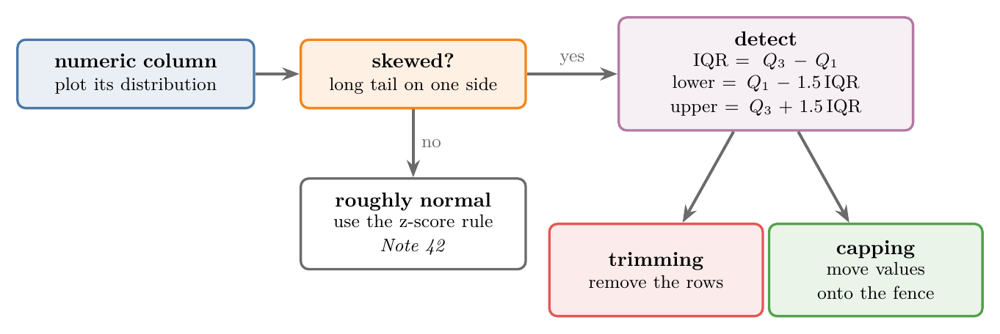
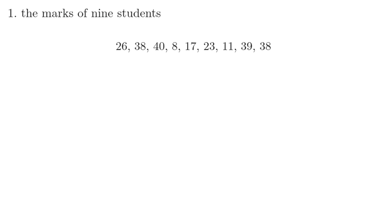
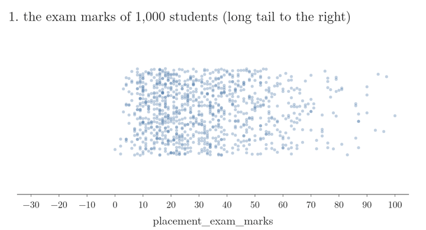
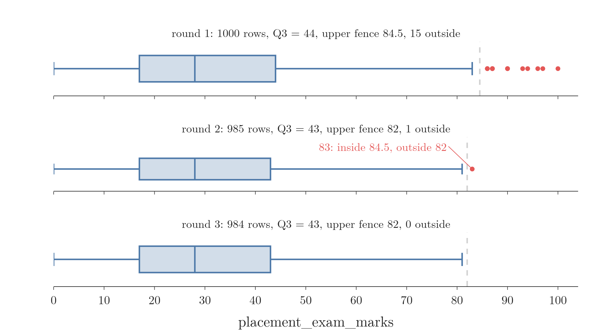
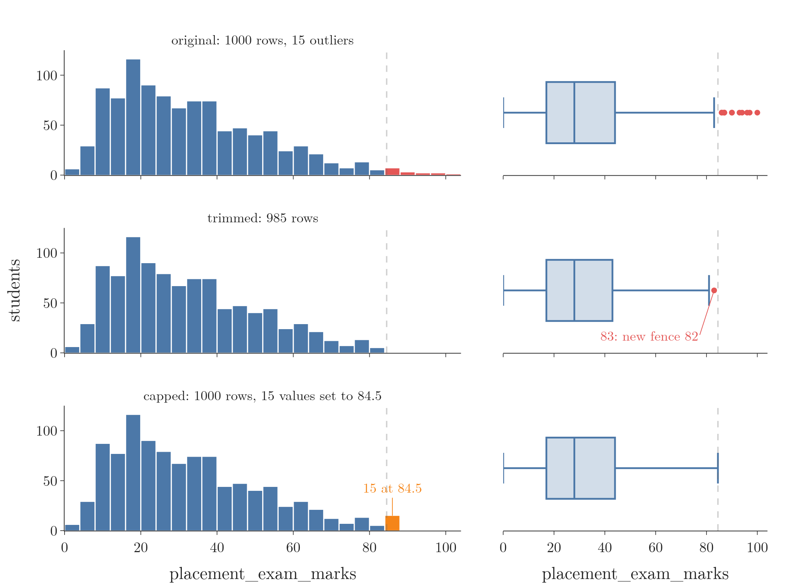
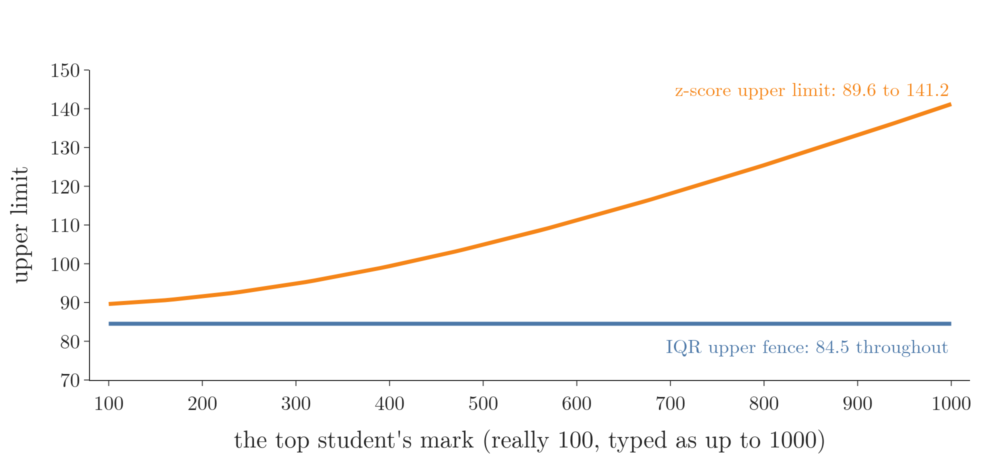

<!-- where-this-fits: generated by course_map/build_map.py; edit concepts.yaml, not this block -->
> **Where this fits:** Pipeline map step 4 (Clean). See the [Course map](../../../00-course-map/00-course-map.md).
>
> 
>
> - **Builds on:** [Descriptive statistics](../../../MA/01-descriptive-stats/MA-004-what-is-statistics/MA-004-what-is-statistics.md#3-descriptive-and-inferential-statistics); [Univariate analysis](../../../ML/02-getting-data/ML-019-univariate-analysis/ML-019-univariate-analysis.md#2-univariate-bivariate-and-multivariate-analysis); [Outliers](../../../ML/04-missing-data-and-outliers/ML-040-what-are-outliers/ML-040-what-are-outliers.md#2-what-an-outlier-is).
> - **Compare with:** [Z-score outlier method](../../../ML/04-missing-data-and-outliers/ML-041-outliers-zscore/ML-041-outliers-zscore.md#3-the-68-95-997-rule); [Percentile outlier method](../../../ML/04-missing-data-and-outliers/ML-043-outliers-percentile/ML-043-outliers-percentile.md#2-the-percentile-rule).
<!-- /where-this-fits -->

## 1. Overview

> **Key point:** For a skewed feature, every value beyond the box-plot fences ($Q_1 - 1.5\thinspace\text{IQR}$ and $Q_3 + 1.5\thinspace\text{IQR}$) is an outlier; we then trim those rows or cap the values at the fences.

The [three rules for detecting outliers](../ML-040-what-are-outliers/ML-040-what-are-outliers.md#8-ways-to-detect-outliers) were listed earlier, and the [z-score method](../ML-041-outliers-zscore/ML-041-outliers-zscore.md#3-the-68-95-997-rule) put the first one to work on a normal feature. This Note covers the second rule: the **IQR method** (G-972), also called the **IQR proximity rule**. The IQR method is the rule to use when a **feature** (G-772) (an input variable, one column of the data table) is skewed. Each **observation** (G-1374) is one record (one row), here one student.

Figure 1 shows the whole method, in three steps:

1. check that the feature is skewed;
2. compute the two fences from the quartiles;
3. treat the values outside them by trimming or capping (both defined in [ways to treat outliers](../ML-040-what-are-outliers/ML-040-what-are-outliers.md#7-ways-to-treat-outliers)).

{width=100%}

## 2. The condition: a skewed feature

> **Key point:** The IQR method is meant for a feature that is skewed, not normal.

A feature is **skewed** (G-1817) when its values have a long tail on one side (see [skewness](../../02-getting-data/ML-019-univariate-analysis/ML-019-univariate-analysis.md#10-skewness)). The [z-score method](../ML-041-outliers-zscore/ML-041-outliers-zscore.md#2-the-condition-a-normal-feature) does not fit such a feature, because it assumes a bell shape.

The IQR method makes no such assumption. The IQR method is built only on **percentiles** (G-1483), which do not care about the shape of the feature: the $p$-th percentile is the value below which $p$ percent of the sorted data lies. Think of the middle half of a queue sorted by height: a single giant joining the end of the queue does not change who stands in the middle half. To use the IQR method we need two ideas from the [univariate analysis](../../02-getting-data/ML-019-univariate-analysis/ML-019-univariate-analysis.md#8-box-plot): the **box plot** (G-329), a picture of a box from $Q_1$ to $Q_3$ with a line at the median and dots for the outliers, and the IQR.

## 3. The fences

> **Key point:** The lower fence is $Q_1 - 1.5 \times \text{IQR}$ and the upper fence is $Q_3 + 1.5 \times \text{IQR}$; values outside them are outliers.

### 3.1 Quartiles and the IQR, by hand

> **Key point:** Sort the values; the median splits them into two halves; $Q_1$ and $Q_3$ are the middles of the halves, and the IQR is the distance between them.

Sort the values and cut the sorted list into four equal parts. The three cut points are the **quartiles** (G-1602): $Q_1$ (the 25th percentile), the **median** (G-1209, the 50th percentile) and $Q_3$ (the 75th percentile). They are taught in the [understanding your data](../../02-getting-data/ML-018-understanding-your-data/ML-018-understanding-your-data.md#72-percentiles) (section 7.2). The distance from $Q_1$ to $Q_3$ is the **interquartile range** (G-966), $\text{IQR} = Q_3 - Q_1$: the width of the middle half of the data ([univariate analysis](../../02-getting-data/ML-019-univariate-analysis/ML-019-univariate-analysis.md#8-box-plot), section 8).

Figure 2 finds them by hand for the exam marks of the first nine students of Section 5. Watch each step add one line:

1. **Sort:** 8, 11, 17, 23, 26, 38, 38, 39, 40.
2. **Median:** nine values, so the fifth one, 26, has four values on each side.
3. **$Q_1$:** the middle of the lower half (8, 11, 17, 23). Four values have two in the middle, so we average them:

   $$(11 + 17)/2 = 14$$

4. **$Q_3$:** the middle of the upper half (38, 38, 39, 40):

   $$(38 + 39)/2 = 38.5$$

5. **IQR:**

   $$38.5 - 14 = 24.5$$


The last frame draws the box from $Q_1$ to $Q_3$ with the median inside it. Its two arms reach to the smallest and the largest mark, 8 and 40, because no mark lies beyond the fences of Section 3.2.



> **Extra:** pandas' `quantile` places a percentile between two neighbouring sorted values, in proportion to its position (**linear interpolation**, G-1092; [ML-043](../ML-043-outliers-percentile/ML-043-outliers-percentile.md#2-the-percentile-rule)). On these nine values it gives $Q_1 = 17$ and $Q_3 = 38$; on the 1,000 marks both ways give $Q_1 = 17$ and $Q_3 = 44$, the numbers used in the rest of this Note.

### 3.2 From the IQR to the fences

> **Key point:** Step 1.5 IQR out from each side of the box; a value beyond either point is an outlier.

The two box-plot **fences** (G-776) come from the [univariate analysis](../../02-getting-data/ML-019-univariate-analysis/ML-019-univariate-analysis.md#81-whiskers-and-outliers) (section 8.1). The IQR method uses exactly those fences as its lower and upper limits. Step by step:

1. **In words:** measure the width of the box, the IQR. Go one and a half box-widths below $Q_1$ for the lower fence, and one and a half above $Q_3$ for the upper fence.
2. **Formula:**
   $$\text{lower} = Q_1 - 1.5 \times \text{IQR}$$

   $$\text{upper} = Q_3 + 1.5 \times \text{IQR}$$

3. **Example:** for the 1,000 placement exam marks of Section 5, $Q_1 = 17$ and $Q_3 = 44$:

   $$\text{IQR} = 44 - 17 = 27$$

   $$1.5 \times 27 = 40.5$$

   $$\text{lower} = 17 - 40.5 = -23.5$$

   $$\text{upper} = 44 + 40.5 = 84.5$$

A mark below $-23.5$ or above 84.5 is an **outlier** (G-1420). Figure 3 builds the fences on the real marks; watch the orange arms grow 40.5 marks out of each side of the box, and only the far right tail turn red.



The plan for any skewed feature is therefore short:

1. compute $Q_1$, $Q_3$ and the IQR;
2. compute the two fences;
3. trim or cap every value outside them.

> **Extra:** The fences are robust: they hardly move when a few values are extreme. $Q_1$ and $Q_3$ depend only on the order of the middle values, so a few extreme values cannot drag them out, unlike the mean and standard deviation of the [z-score method](../ML-041-outliers-zscore/ML-041-outliers-zscore.md#3-the-68-95-997-rule). The factor 1.5 comes from John Tukey, who introduced the box plot (Tukey 1977). Some people also use 3: a point beyond $Q_3 + 3\thinspace\text{IQR}$ (or below $Q_1 - 3\thinspace\text{IQR}$) is called an "extreme" outlier, and one only beyond the 1.5 fences a "mild" one (NIST 7.1.6).

## 4. Treating the outliers: trimming or capping

> **Key point:** Trimming deletes the outlier rows; capping replaces each outlier with the fence it crossed.

Both treatments are explained in [ways to treat outliers](../ML-040-what-are-outliers/ML-040-what-are-outliers.md#7-ways-to-treat-outliers): **trimming** (G-2019) deletes the rows outside the limits, and **capping** (G-345) moves each value beyond a limit onto the limit. Here the fences are the limits.

## 5. The placement data

> **Key point:** The data has 1,000 students; their placement exam marks are right-skewed (skewness 0.84), so the marks feature is the one for the IQR method.

The data is the [placement data](../ML-041-outliers-zscore/ML-041-outliers-zscore.md#6-the-placement-data) of the z-score method: one observation per student of a college, 1,000 students, three columns.

| cgpa | placement_exam_marks | placed |
|---|---|---|
| 7.19 | 26 | 1 |
| 7.46 | 38 | 1 |
| 7.54 | 40 | 1 |
| 6.42 | 8 | 1 |

- `cgpa`: the student's CGPA (out of 10).
- `placement_exam_marks`: marks out of 100 in the aptitude test held before placement.
- `placed`: 1 if the student got a job offer, 0 if not; the **target** (G-1949), the output a model would predict.

The [histograms of the placement data](../ML-041-outliers-zscore/ML-041-outliers-zscore.md#6-the-placement-data) showed the shapes: `cgpa` is a bell (skewness $-0.01$), while `placement_exam_marks` has a long tail to the right (skewness 0.84). So `placement_exam_marks` is the candidate for the IQR method.

The summary numbers of the marks feature tell the same story:

| Count | Mean | Std | Min | 25% | 50% | 75% | Max |
|---|---|---|---|---|---|---|---|
| 1,000 | 32.23 | 19.13 | 0 | 17 | 28 | 44 | 100 |

A quarter of the students scored below 17, half below 28 and three quarters below 44. One student scored 0 and one scored the full 100.

> **Python:** Loading the data and checking the marks feature.
>
> ```python
> import pandas as pd
>
> df = pd.read_csv("data/placement.csv")
> df.shape     # (1000, 3)
>
> df["placement_exam_marks"].skew()       # 0.84
> df["placement_exam_marks"].describe()   # the table above
> ```

## 6. Finding the fences and the outliers

> **Key point:** $Q_1 = 17$ and $Q_3 = 44$ give an IQR of 27 and fences of $-23.5$ and 84.5; 15 students lie above the upper fence and none below the lower one.

Figure 4 shows the box plot of the marks above their histogram. The box runs from $Q_1 = 17$ to $Q_3 = 44$, so the IQR is 27, and the fences sit at $-23.5$ and 84.5 (Section 3).

{width=100%}

- **Upper fence, 84.5:** 15 students scored above it, with marks from 86 to 100. In the box plot they are the red dots on the right.
- **Lower fence, $-23.5$:** marks cannot be negative, so no student lies below it. With a right-skewed feature, all the outliers sit on the long-tail side.

The 15 outliers:

| Mark | Students | Rows |
|---|---|---|
| 86 | 3 | 40, 61, 771 |
| 87 | 4 | 283, 290, 311, 685 |
| 90 | 3 | 162, 324, 730 |
| 93, 94, 96, 97, 100 | 1 each | 134, 9, 630, 846, 917 |

> **Python:** The quartiles, the IQR and the fences.
>
> ```python
> marks = df["placement_exam_marks"]
>
> percentile25 = marks.quantile(0.25)   # 17.0
> percentile75 = marks.quantile(0.75)   # 44.0
> iqr = percentile75 - percentile25     # 27.0
>
> upper_limit = percentile75 + 1.5 * iqr   # 84.5
> lower_limit = percentile25 - 1.5 * iqr   # -23.5
>
> df[marks > upper_limit]   # 15 rows
> df[marks < lower_limit]   # 0 rows
> ```
>
> **`quantile(0.25)`** (G-127) returns the 25th percentile; `quantile` takes the fraction (0.25), not the percent (25).

## 7. Trimming in code

> **Key point:** Keeping only the rows inside the fences removes the 15 outliers and leaves 985 rows.

Trimming is a filter: keep the rows whose mark lies between the two fences. Since no mark is below the lower fence, keeping the marks below 84.5 is enough here.

> **Python:** Trimming.
>
> ```python
> # keep the rows with lower <= mark <= upper
> new_df = df[marks.between(lower_limit, upper_limit)]
> new_df.shape    # (985, 3)
> ```

Figure 6 (middle row) shows the result. The histogram barely changes: only its thin right tail is gone. The box plot loses its row of red dots.

The mean drops from 32.23 to 31.34 and the skewness from 0.84 to 0.65.

### 7.1 Why a new outlier appears after trimming

> **Key point:** The box plot of the trimmed data computes new fences from the 985 remaining rows, so a value that was inside before can now be outside.

The trimmed box plot in Figure 6 still shows one red dot, at a mark of 83. The dot is not a mistake. A box plot always computes its fences from the data it is given.

For the 985 trimmed rows, $Q_3$ drops from 44 to 43, so the new upper fence is:

$$43 + 1.5 \times (43 - 17) = 82$$

The mark 83, safely inside the old fence of 84.5, is now just outside the new one.

In this Note we detect once, with the fences of the original data, and treat once. (Trimming again here would remove the 83 and then stop: a third round finds nothing. The last cell of the Notebook shows this.)



In Figure 5, watch the dashed fence step left between rounds 1 and 2 and then stop moving.

## 8. Capping in code

> **Key point:** Each mark above 84.5 becomes 84.5 (and each mark below $-23.5$ would become $-23.5$); all 1,000 rows stay.

Capping goes through the column value by value, exactly as in [capping with the z-score](../ML-041-outliers-zscore/ML-041-outliers-zscore.md#10-capping-in-code):

- above the upper fence: replace it with the upper fence;
- below the lower fence: replace it with the lower fence;
- otherwise: leave it as it is.

NumPy's **`np.where`** (G-124), called as `np.where(condition, value if true, value if false)`, does this for the whole column; two conditions need two calls, one inside the other.

> **Python:** Capping with `np.where`.
>
> ```python
> import numpy as np
>
> new_df_cap = df.copy()
> col = new_df_cap["placement_exam_marks"]
> new_df_cap["placement_exam_marks"] = np.where(
>     col > upper_limit,
>     upper_limit,
>     np.where(col < lower_limit, lower_limit, col))
>
> new_df_cap.shape    # (1000, 3): no row lost
> ```
>
> `df.copy()` makes an independent copy, so the original `df` keeps its values for the comparison below.

The result, compared with the original and the trimmed column:

| | Original | Trimmed | Capped |
|---|---|---|---|
| Rows | 1,000 | 985 | 1,000 |
| Mean | 32.23 | 31.34 | 32.14 |
| Standard deviation | 19.13 | 17.86 | 18.87 |
| Maximum | 100 | 83 | 84.5 |
| Skewness | 0.84 | 0.65 | 0.76 |

Figure 6 (bottom row) shows the capped column. The 15 outliers now all sit at 84.5, so the histogram rises in that one spot (the orange bar). The box plot has no dots: its whisker ends exactly at the fence.

{width=100%}

> **Extra:** pandas has a one-line shortcut for capping, **`clip`** (G-70). `clip` gives exactly the same column as the two nested `np.where` calls.
>
> ```python
> marks.clip(lower_limit, upper_limit)
> ```

## 9. Learning the fences on the training set

> **Key point:** The fences are learned from the data, so they should be learned on the training set only and then applied to the test set.

The fences follow the same train-only rule as the z-score limits: [learn the limits on the training set](../ML-041-outliers-zscore/ML-041-outliers-zscore.md#11-learning-the-limits-on-the-training-set), then apply the same limits to the test set, so no information from the test set leaks into the model.

> **Extra:** With an 80/20 split (`random_state=42`), the 800 training rows have the same $Q_1 = 17$ and $Q_3 = 44$, so the fences stay at $-23.5$ and 84.5:
>
> | | Rows | Outliers (training fences) |
> |---|---|---|
> | Training set | 800 | 14: marks 86 to 97 |
> | Test set | 200 | 1: mark 100 |
>
> Quartiles move very little between 800 and 1,000 rows, so here the result is the same. Trimming the training set leaves 786 rows; the Notebook shows both steps.

## 10. Strengths and limits of the IQR method

> **Key point:** The method is simple, works on skewed features and is not pulled by the outliers it looks for; it is only a rule of thumb.

- **Simple:** two percentiles give both fences.
- **Shape-free:** it needs no bell shape, so it fits skewed features.
- **Robust:** the quartiles are not pulled by extreme values (Section 3.2, Extra).

To see the robustness, we replace the top mark, 100, by a typo that grows up to 1,000 and recompute both upper limits (Figure 7). Watch the two lines: the z-score limit chases the typo from 89.6 up to 141.2, while the IQR fence never leaves 84.5.



> **Extra:** Two things to keep in mind.
>
> - **On a long tail, real values get flagged.** In a strongly skewed feature the far tail can be perfectly genuine (a few very high incomes, a few toppers; here, 15 real exam marks between 86 and 100). The fences flag it all the same. So we still decide, as in [when to remove and when to keep outliers](../ML-040-what-are-outliers/ML-040-what-are-outliers.md#4-when-to-remove-and-when-to-keep-outliers), whether those values are errors or real.
> - **One side may never be used.** For a right-skewed feature with a natural lower bound, such as marks starting at 0, the lower fence can lie below every possible value, as it does here ($-23.5$). An unused fence is expected, not a bug.

## 11. Summary

| Step | What we do | On the placement marks | Why it matters |
|---|---|---|---|
| Check the shape | plot the feature; the method is for skewed features | right-skewed, skewness 0.84 | a skewed feature breaks the bell-shape limits of the z-score method |
| Quartiles | $Q_1$ = 25th, $Q_3$ = 75th percentile, IQR $= Q_3 - Q_1$ | $Q_1 = 17$, $Q_3 = 44$, IQR $= 27$ | percentiles do not depend on the shape of the feature |
| Detect | fences $Q_1 - 1.5\thinspace\text{IQR}$ and $Q_3 + 1.5\thinspace\text{IQR}$ | $-23.5$ and 84.5; 15 outliers, all above | on a right-skewed feature the outliers sit on the long-tail side |
| Trim | keep the rows inside the fences | 985 rows left | removes the outliers when losing a few rows is fine |
| Cap | move values beyond a fence onto it | 1,000 rows; maximum 84.5 | keeps every row |
| Better practice | learn the fences on the training set | same fences; 14 outliers in train, 1 in test | test rows must not shape the fences (data leakage) |

| | Z-score method | IQR method |
|---|---|---|
| Feature shape | roughly normal | skewed |
| Built on | mean and standard deviation | $Q_1$ and $Q_3$ |
| Limits | $\mu \pm 3\sigma$ | $Q_1 - 1.5\thinspace\text{IQR}$, $Q_3 + 1.5\thinspace\text{IQR}$ |
| Pulled by outliers | yes | hardly |

- Pick the method by the shape of the feature: the IQR fences hardly move when one value is extreme (84.5 stays put while the z-score limit climbs), because the quartiles depend only on the middle values.
- The IQR method is for skewed features; the z-score method is for normal ones, because the z-score limits assume a bell shape and the IQR fences do not.
- The IQR is $Q_3 - Q_1$, the width of a box plot's box, so it measures the spread of the middle half, which a few extreme values cannot drag out.
- The fences are $Q_1 - 1.5\thinspace\text{IQR}$ and $Q_3 + 1.5\thinspace\text{IQR}$: the same limits a box plot uses for its dots, so the red dots of a box plot are exactly the outliers this method flags.
- Values outside the fences are outliers; we trim them (drop the rows) or cap them (set them to the fence, so no row is lost).
- A box plot of trimmed data computes new fences, so a new dot can appear; we do not trim again, because the new dot comes from the fence moving, not from a new extreme value.
- The fences should be learned on the training set only, so no information from the test set leaks into the model.
- Together these steps answer the opening question: on a skewed feature, flag every value beyond the box-plot fences, then trim or cap it.


## 12. Sources

**Built from**

- CampusX, "Outlier Detection and Removal using the IQR Method | Handing Outliers Part 3", YouTube, https://www.youtube.com/watch?v=Ccv1-W5ilak
- Khan Academy, "How to calculate interquartile range IQR", YouTube, https://www.youtube.com/watch?v=qLYYHWYr8xI

**Other references**

- Tukey, J. W. (1977). *Exploratory Data Analysis*. Addison-Wesley.
- NIST/SEMATECH. *e-Handbook of Statistical Methods*, Section 7.1.6, "What are outliers in the data?". https://www.itl.nist.gov/div898/handbook/

## 13. Key terms

Terms taught in this Note come first; linked terms are recaps, taught in the Note the link opens.

| Term | Meaning |
|---|---|
| `quantile` (G-127) | pandas method that returns a percentile, given as a fraction (0.25 for the 25th). |
| [IQR method (IQR rule, IQR proximity rule)](../../../ML/02-getting-data/ML-019-univariate-analysis/ML-019-univariate-analysis.md#81-whiskers-and-outliers) (G-972) | Outlier detection that flags values beyond 1.5 IQR outside the box ($Q_1$ to $Q_3$); for skewed columns. |
| [Feature](../../../ML/01-foundations/ML-002-ai-vs-ml-vs-dl/ML-002-ai-vs-ml-vs-dl.md#52-features-chosen-by-us-or-learned) (G-772) | One piece of information about each example that a model uses (e.g. a student's CGPA). |
| [Observation](../../../ML/01-foundations/ML-003-types-of-ml/ML-003-types-of-ml.md#21-learning-from-inputs-and-outputs) (G-1374) | One record of a dataset: one row of the data table. |
| [Skewness](../../../ML/02-getting-data/ML-019-univariate-analysis/ML-019-univariate-analysis.md#10-skewness) (G-1817) | A number for how lopsided a distribution is: 0 symmetric, positive right tail, negative left tail. |
| [Percentile](../../../ML/02-getting-data/ML-018-understanding-your-data/ML-018-understanding-your-data.md#72-percentiles) (G-1483) | The value below which a given share of the data lies. |
| [Box plot](../../../ML/02-getting-data/ML-019-univariate-analysis/ML-019-univariate-analysis.md#8-box-plot) (G-329) | A graph of a column's five-number summary, a box with whiskers and outliers drawn as dots; it shows the centre, spread and outliers at a glance. |
| [Quartiles](../../../ML/02-getting-data/ML-018-understanding-your-data/ML-018-understanding-your-data.md#72-percentiles) (G-1602) | The 25%, 50% and 75% percentiles, which cut the data into four equal groups. |
| [Median](../../../MA/01-descriptive-stats/MA-005-measures-of-central-tendency/MA-005-measures-of-central-tendency.md#4-median) (G-1209) | The middle value of sorted data; the 50% percentile. |
| [Interquartile range (IQR)](../../../ML/02-getting-data/ML-019-univariate-analysis/ML-019-univariate-analysis.md#8-box-plot) (G-966) | The width of the middle half of the data: Q3 - Q1. |
| [Linear interpolation](../../../ML/04-missing-data-and-outliers/ML-043-outliers-percentile/ML-043-outliers-percentile.md#22-from-percentiles-to-limits) (G-1092) | Placing a percentile between two neighbouring sorted values, in proportion to its position; the pandas default. |
| [Fence (fences)](../../../ML/02-getting-data/ML-019-univariate-analysis/ML-019-univariate-analysis.md#81-whiskers-and-outliers) (G-776) | A cut-off for spotting outliers in a box plot: 1.5 times the IQR (the width of the middle half of the data) beyond the box, $Q_1 - 1.5\thinspace\text{IQR}$ or $Q_3 + 1.5\thinspace\text{IQR}$; values past it are possible outliers. |
| [Outlier](../../../ML/02-getting-data/ML-019-univariate-analysis/ML-019-univariate-analysis.md#81-whiskers-and-outliers) (G-1420) | A value far from the rest of the data. |
| [Trimming](../../../ML/04-missing-data-and-outliers/ML-040-what-are-outliers/ML-040-what-are-outliers.md#71-trimming) (G-2019) | Removing the rows that hold outliers. |
| [Capping](../../../ML/04-missing-data-and-outliers/ML-040-what-are-outliers/ML-040-what-are-outliers.md#72-capping) (G-345) | Replacing every value beyond a limit with the limit itself. |
| [Target](../../../ML/01-foundations/ML-003-types-of-ml/ML-003-types-of-ml.md#21-learning-from-inputs-and-outputs) (G-1949) | The output column we predict, such as the class; also called the label. |
| [`np.where`](../../../ML/04-missing-data-and-outliers/ML-041-outliers-zscore/ML-041-outliers-zscore.md#10-capping-in-code) (G-124) | NumPy function that picks one value where a condition is true and another where it is false. |
| [`clip`](../../../ML/04-missing-data-and-outliers/ML-043-outliers-percentile/ML-043-outliers-percentile.md#7-capping-in-code-winsorization) (G-70) | pandas method that moves every value below a lower bound up to it and every value above an upper bound down to it. |
