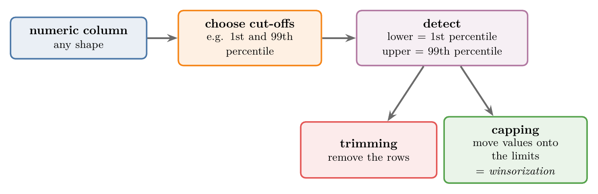
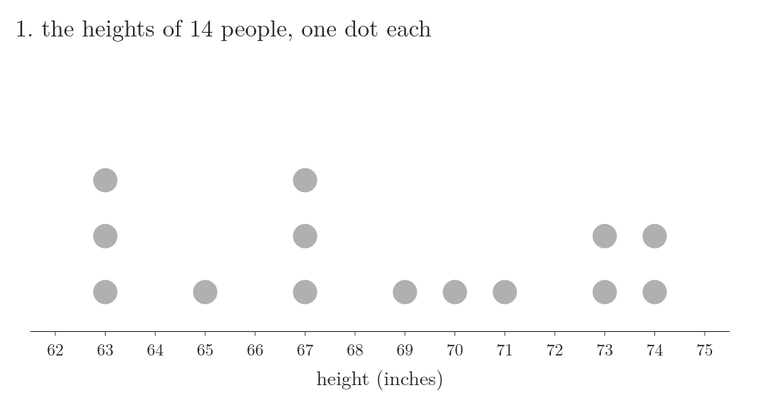
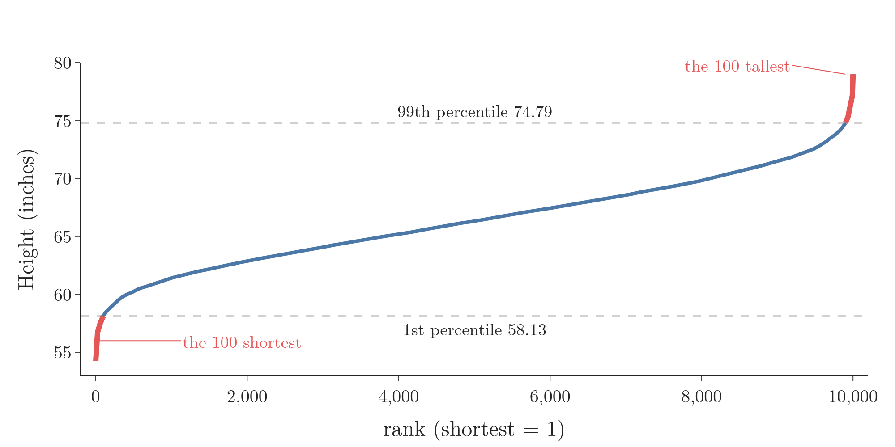
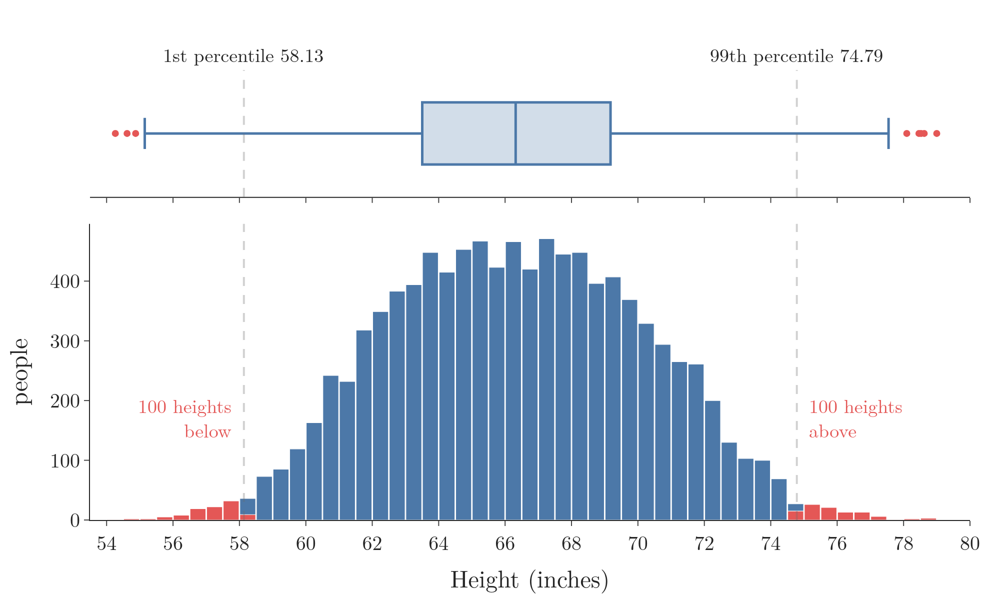
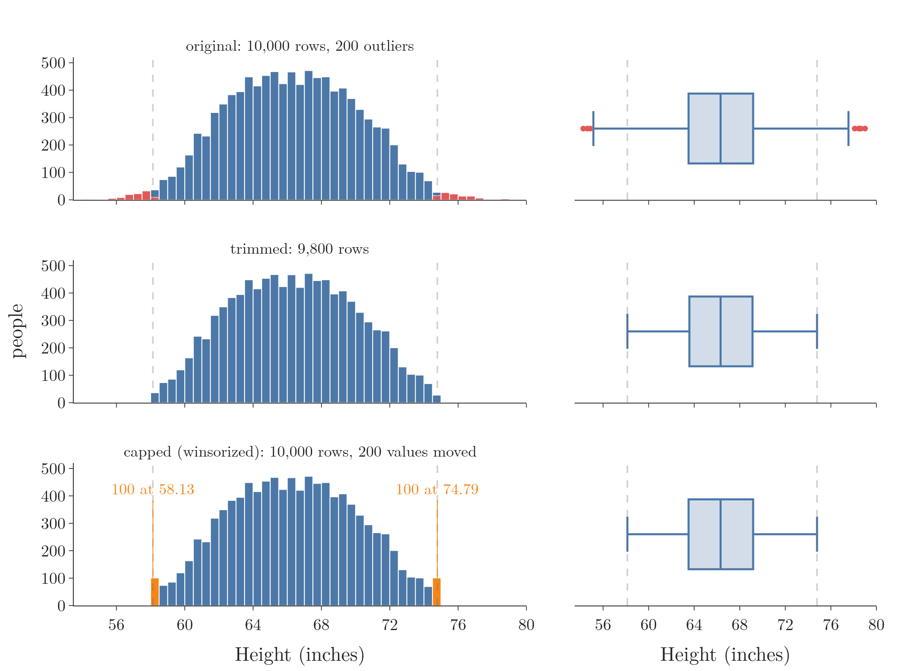
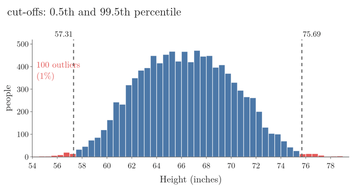
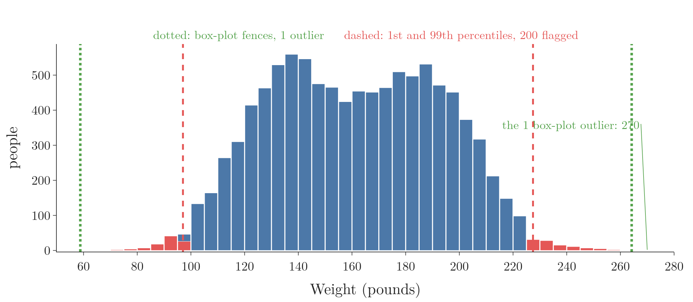
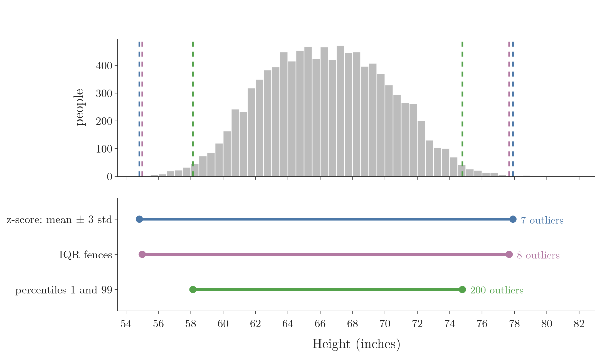

<!-- where-this-fits: generated by course_map/build_map.py; edit concepts.yaml, not this block -->
> **Where this fits:** Pipeline map step 4 (Clean). See the [Course map](../../../00-course-map/00-course-map.md).
>
> 
>
> - **Builds on:** [Percentiles, quartiles and box plots](../../../MA/01-descriptive-stats/MA-008-percentiles-and-box-plots/MA-008-percentiles-and-box-plots.md#5-building-a-box-plot-by-hand); [Outliers](../../../ML/04-missing-data-and-outliers/ML-040-what-are-outliers/ML-040-what-are-outliers.md#2-what-an-outlier-is).
> - **Compare with:** [Z-score outlier method](../../../ML/04-missing-data-and-outliers/ML-041-outliers-zscore/ML-041-outliers-zscore.md#3-the-68-95-997-rule); [IQR outlier method](../../../ML/04-missing-data-and-outliers/ML-042-outliers-iqr/ML-042-outliers-iqr.md#3-the-fences).
<!-- /where-this-fits -->

## 1. Overview

> **Key point:** We pick a low and a high percentile, such as the 1st and the 99th; every value below the first or above the second is an outlier, and we trim those rows or cap the values at the limits.

[Ways to detect outliers](../ML-040-what-are-outliers/ML-040-what-are-outliers.md#8-ways-to-detect-outliers) listed three rules. [The z-score rule](../ML-041-outliers-zscore/ML-041-outliers-zscore.md#3-the-68-95-997-rule) covers normal features and [the IQR rule](../ML-042-outliers-iqr/ML-042-outliers-iqr.md#3-the-fences) covers skewed ones. This Note covers the third and simplest rule: the **percentile method** (G-1481), which works on a **feature** (G-772) (an input variable, one column of the data table) of any shape. Each **observation** (G-1374) is one record (one row), here one person.

Figure 1 shows the whole method, in three steps:

1. choose two cut-offs;
2. turn them into a lower and an upper limit;
3. treat the values outside them by trimming or capping.

Capping with percentile limits has its own name: **winsorization** (G-2123).

{width=100%}

## 2. The percentile rule

> **Key point:** Everything below the 1st percentile or above the 99th percentile is an outlier; the two cut-offs are our choice.

### 2.1 What a percentile says

> **Key point:** The $p$-th percentile is a value: $p$ percent of the values lie below it. Going the other way, the share of values below a given value is that value's percentile rank.

A percentile tells where a value stands among all the others. A student whose exam score is at the 50th percentile has half the class behind them; a student at the 99th percentile has 99 percent of the class behind them. The highest score sits at the top, the 100th percentile, and the lowest at the bottom, the 0th.

The $p$-th **percentile** (G-1483) is the value that $p$% of the feature's values lie below, as [percentiles in the data summary](../../02-getting-data/ML-018-understanding-your-data/ML-018-understanding-your-data.md#72-percentiles) explains. A percentile uses only the order of the values, never their shape. The question can also be asked the other way round: the percentile at which a given value falls is that value's **percentile rank** (G-1482).

Figure 2 finds a percentile rank by counting, on the heights of 14 people from the data of Section 4 (every 700th person, rounded to whole inches). Watch the dots light up in two steps:

1. **In words:** count the values below the one we ask about, and divide by the number of values.
2. **Formula:**
   $$\text{percentile rank} = \frac{\text{values below}}{\text{all values}} \times 100$$
3. **Example:** the sorted heights are 63, 63, 63, 65, 67, 67, 67, 69, 70, 71, 73, 73, 74, 74. Seven of the 14 are below 69:
   $$\frac{7}{14} \times 100 = 50$$
   A height of 69 inches is at the 50th percentile.
4. **The other rule:** some textbooks count the values *at or below*. Then the person at 69 counts too:
   $$\frac{8}{14} \times 100 = 57$$
   This is the 57th percentile.



Both rules are in use. This Note uses the first one, "below".

### 2.2 From percentiles to limits

> **Key point:** Choose a low and a high percentile; the values there are the two limits.

The idea is simple: cut off a small slice at each end of the feature, like trimming the crusts off both ends of a loaf. Everything beyond the cut is an **outlier** (G-1420). The rule treats both ends at once.

The usual **cut-offs** (G-526) are the 1st and the 99th percentile. Other common pairs are:

- 5th and 95th: cuts more, 5% at each end;
- 0.5th and 99.5th: cuts less, 0.5% at each end.

The cut-offs are always symmetric: whatever share we cut off at the top, we cut off the same share at the bottom.

The limits, step by step:

1. **In words:** the lower limit is the value that 1% of the values lie below; the upper limit is the value that 99% lies below.
2. **Formula:** with $P_p$ the $p$-th percentile,
   $$\text{lower} = P_1$$
   $$\text{upper} = P_{99}$$
3. **Example:** the 10,000 heights of Section 4, sorted from small to large. 1% of 10,000 is 100, so the lower limit sits between the 100th smallest height (58.126) and the 101st (58.134). pandas places it at 58.134; in the same way the upper limit sits between the 100th and 101st largest heights, at 74.786.

Figure 3 lines up all 10,000 heights from shortest to tallest. Watch where the two dashed limits cross the curve: exactly at rank 100 and rank 9,900, so the red stretches at each end hold 100 people each.



> **Extra:** "Between" needs a rule, because 1% of the values rarely ends exactly on one value. pandas uses **linear interpolation** (G-1092) by default: it computes the position in the sorted column (counting from 0):
>
> $$(n - 1) \times p = 9{,}999 \times 0.01 = 99.99$$
>
> It then goes 99% of the way from the value at position 99 to the value at position 100 (pandas docs, `Series.quantile`).

## 3. Trimming and capping (winsorization)

> **Key point:** Trimming removes the observations beyond the percentile limits; capping replaces each such value with the limit, and capping with percentile limits is called winsorization.

**Trimming** (G-2019), which removes the rows, and **capping** (G-345), which moves each value onto the limit it crossed, work as in [ways to treat outliers](../ML-040-what-are-outliers/ML-040-what-are-outliers.md#7-ways-to-treat-outliers), with the percentile limits as the limits.

When the capping limits are percentiles, the technique is called **winsorization**, after the statistician Charles P. Winsor (Hastings et al. 1947). Trimming with percentiles has no special name; it is simply trimming.

### 3.1 Variants of capping

> **Key point:** Some people cap at the limit plus or minus a small step instead of the limit itself; neither choice is fixed, so we try both and keep what works.

A few implementations do not replace an outlier with the limit itself:

- the upper outliers become **upper limit + 1**;
- the lower outliers become **lower limit - 1**.

The idea is to keep the capped values slightly apart from the normal ones. There is no fixed rule here. Outlier handling is practical and experimental: we try the options and keep the one that gives the best model.

## 4. The height and weight data

> **Key point:** The data has 10,000 people with their gender, height and weight; height is close to normal and its box plot shows outliers on both sides.

The data is a table of 10,000 people, 5,000 men and 5,000 women, published on Kaggle.

| Gender | Height | Weight |
|---|---|---|
| Male | 73.85 | 241.89 |
| Male | 68.78 | 162.31 |
| Male | 74.11 | 212.74 |
| Male | 71.73 | 220.04 |

- `Gender`: male or female. We do not use it here.
- `Height`: in inches.
- `Weight`: in pounds.

We work on `Height`. `Weight` has almost no outliers by the box-plot rule (1 value beyond the fences), so it shows little; the same steps work on it. `Gender` and `Weight` are not used, so there is no **target** (G-1949) (an output to predict) here: outlier handling is a cleaning step done before any model.

The summary numbers of `Height`:

| Count | Mean | Std | Min | 25% | 50% | 75% | Max |
|---|---|---|---|---|---|---|---|
| 10,000 | 66.37 | 3.85 | 54.26 | 63.51 | 66.32 | 69.17 | 79.00 |

Figure 4 (in Section 5, where the limits are added to it) shows the histogram: almost a bell (skewness 0.05). The box plot above it shows a few dots on both sides, so the feature does hold extreme values.

> **Extra:** One inch is 2.54 cm. The heights run from 54.26 inches (138 cm) to 79.00 inches (201 cm), with a mean of 66.37 inches (169 cm).

> **Python:** Loading the data and looking at `Height`.
>
> ```python
> import pandas as pd
>
> df = pd.read_csv("data/weight-height.csv")
> df.shape                   # (10000, 3)
> df["Height"].describe()    # the table above
> ```
>
> The Notebook draws the histogram and box plot with Plotly.

## 5. Finding the limits and the outliers

> **Key point:** The 1st percentile of height is 58.13 and the 99th is 74.79; 100 heights lie below and 100 above, so 200 people are outliers.

The two limits of Section 2:

- **lower limit:** 58.13 inches (1st percentile);
- **upper limit:** 74.79 inches (99th percentile).

Figure 4 marks them as dashed lines. Exactly 100 heights lie below the lower limit (54.26 to 58.13) and 100 above the upper limit (74.79 to 79.00), in red.

{height=45%}

The percentile limits sit well inside the box-plot whiskers. The box plot flags only the 8 most extreme dots; the percentile rule flags 200 values. Section 10 comes back to this difference.

> **Python:** The limits and the outliers.
>
> ```python
> # quantile takes a fraction: 0.99 = 99th percentile
> upper_limit = df["Height"].quantile(0.99)   # 74.7858
> lower_limit = df["Height"].quantile(0.01)   # 58.1344
>
> (df["Height"] > upper_limit).sum()   # 100
> (df["Height"] < lower_limit).sum()   # 100
> ```

## 6. Trimming in code

> **Key point:** Keeping only the observations between 58.13 and 74.79 removes 200 and leaves 9,800.

Trimming is a filter: keep the rows whose height lies between the two limits.

> **Python:** Trimming.
>
> ```python
> # keep lower <= height <= upper
> new_df = df[df["Height"].between(lower_limit, upper_limit)]
> new_df.shape    # (9800, 3)
> ```

> **Extra:** Use the variables `upper_limit` and `lower_limit`, not rounded numbers typed by hand. Filtering with 74.78 and 58.13 keeps only 9,799 rows. One person is 74.7857 inches tall: inside the true limit of 74.7858, but above the rounded 74.78, so that row is wrongly removed.

The summary numbers before and after:

| | Original | Trimmed |
|---|---|---|
| Rows | 10,000 | 9,800 |
| Mean | 66.37 | 66.36 |
| Standard deviation | 3.85 | 3.65 |
| Minimum | 54.26 | 58.13 |
| Median | 66.32 | 66.32 |
| Maximum | 79.00 | 74.79 |

The mean and median stay almost the same. The standard deviation drops a little, the minimum rises and the maximum falls. Figure 5 (middle row) shows the same bell with its two thin tails cut off, and a box plot with no dots left.

## 7. Capping in code (winsorization)

> **Key point:** Each height above 74.79 becomes 74.79 and each height below 58.13 becomes 58.13; all 10,000 rows stay.

Capping goes through the feature value by value, as in [capping with the z-score](../ML-041-outliers-zscore/ML-041-outliers-zscore.md#10-capping-in-code) and [capping with the IQR fences](../ML-042-outliers-iqr/ML-042-outliers-iqr.md#8-capping-in-code):

- above the upper limit: replace it with the upper limit;
- below the lower limit: replace it with the lower limit;
- otherwise: leave it as it is.

NumPy's **`np.where`** (G-124), called as `np.where(condition, value if true, value if false)`, does this for the whole column; two conditions need two calls, one inside the other.

> **Python:** Winsorization with `np.where`.
>
> ```python
> import numpy as np
>
> capped = df.copy()
> h = capped["Height"]
> capped["Height"] = np.where(
>     h > upper_limit,
>     upper_limit,
>     np.where(h < lower_limit, lower_limit, h))
>
> capped.shape    # (10000, 3): no row lost
> ```
>
> `df.copy()` keeps the original `df` unchanged for the comparison below.

The result, next to the original and the trimmed column:

| | Original | Trimmed | Capped |
|---|---|---|---|
| Rows | 10,000 | 9,800 | 10,000 |
| Mean | 66.37 | 66.36 | 66.37 |
| Standard deviation | 3.85 | 3.65 | 3.80 |
| Minimum | 54.26 | 58.13 | 58.13 |
| Maximum | 79.00 | 74.79 | 74.79 |

Only the minimum and maximum change much: they are now exactly the limits. Figure 5 (bottom row) shows the 100 low values piled onto 58.13 and the 100 high values onto 74.79, in orange. The histogram rises a little at both ends, and the box plot has no dots.

{height=62%}

> **Extra:** Two shortcuts give the same kind of result.
>
> - pandas: **`clip`** (G-70), as in `df["Height"].clip(lower_limit, upper_limit)`, gives exactly the same column as the two `np.where` calls.
> - SciPy has a ready-made function, `scipy.stats.mstats.winsorize(values, limits=(0.01, 0.01))`. The `np.where` code is short enough that the extra library is not needed.

## 8. Choosing the cut-offs

> **Key point:** Wider cut-offs, such as 0.5 and 99.5, remove less data; narrower ones, such as 5 and 95, remove more; we try a few and keep the one that gives the best results.

The percentiles decide how much data counts as an outlier, and the share is fixed by the choice itself:

| Cut-offs | Lower limit | Upper limit | Outliers |
|---|---|---|---|
| 0.5 and 99.5 | 57.31 | 75.69 | 100 (1%) |
| 1 and 99 | 58.13 | 74.79 | 200 (2%) |
| 2.5 and 97.5 | 59.26 | 73.70 | 500 (5%) |
| 5 and 95 | 60.25 | 72.62 | 1,000 (10%) |

Figure 6 slides the cut-offs from 0.5/99.5 to 5/95 on `Height`. Watch the red tails: the limits close in and the red share grows from 1% to 10%, whatever the shape of the bell.



The further out the cut-offs, the less data we trim or cap. A good habit is to start with wide cut-offs and only move them in if the model does better.

## 9. Learning the limits on the training set

> **Key point:** Percentiles are learned from the data, so they should be learned on the training set only and then applied to the test set.

The limits follow the same train-only rule as the z-score limits ([learning the limits on the training set](../ML-041-outliers-zscore/ML-041-outliers-zscore.md#11-learning-the-limits-on-the-training-set)).

> **Extra:** With an 80/20 split (`random_state=42`), the 8,000 training rows give limits of **58.16** and **74.83**:
>
> - **Training set**, 8,000 rows: 80 below the lower limit, 80 above the upper limit.
> - **Test set**, 2,000 rows: 23 below, 16 above.
>
> On the training set the counts are exactly 1% at each end, by construction. On the test set they are only close to 1%, as expected from random sampling. Trimming the training set leaves 7,840 rows; the Notebook shows both steps.

## 10. Strengths and limits of the percentile method

> **Key point:** The method is simple and works on any shape, but it always flags the chosen share of values, even when the feature has no real outliers.

- **Simple:** two percentiles give both limits; one line of code each.
- **Shape-free:** the percentile method needs no bell shape and works on skewed features too.
- **Robust:** percentiles depend only on the order of the values, so extreme values cannot drag the limits out.

> **Extra:** The catch is the fixed share. With the 1st and 99th percentiles, exactly 2% of the rows are flagged, whatever the data looks like. `Height` is almost normal: the z-score rule finds only 7 outliers in it and the IQR rule only 8, yet the percentile rule flags 200. `Weight`, with only 1 value beyond its box-plot fences, would also lose 200 values (last cell of the Notebook). So the percentile method decides *how many* values to treat, not *whether* a value is truly unusual.
>
> 
>
> In Figure 7, watch the gap between the red and the green lines: everything between them is a normal weight that the percentile rule still treats.
>
> The intuition: winsorization calms the tails a little; it does not hunt for errors.

## 11. Comparing the three detection rules

> **Key point:** Use the z-score rule for a normal feature, the IQR rule for a skewed one, and the percentile rule when we want to treat a fixed share of each tail in any feature.

This Note closes the outlier group. In the table below, $\mu$ is the mean, $\sigma$ the standard deviation, $Q_1$ and $Q_3$ the first and third quartile (the 25th and 75th percentiles) and $\text{IQR} = Q_3 - Q_1$. Figure 8 applies all three rules to the same `Height` feature. The z-score and IQR limits lie close together near the far ends; the percentile limits sit well inside them.

{height=48%}

| | [Z-score](../ML-041-outliers-zscore/ML-041-outliers-zscore.md#3-the-68-95-997-rule) | [IQR](../ML-042-outliers-iqr/ML-042-outliers-iqr.md#3-the-fences) | Percentile (this Note) |
|---|---|---|---|
| Fits | roughly normal feature | skewed feature | any feature |
| Built on | mean and standard deviation | $Q_1$ and $Q_3$ | two chosen percentiles |
| Limits | $\mu \pm 3\sigma$ | $Q_1 - 1.5\thinspace\text{IQR}$, $Q_3 + 1.5\thinspace\text{IQR}$ | $P_1$, $P_{99}$ |
| Pulled by outliers | yes | hardly | hardly |
| Share flagged | depends on the data | depends on the data | fixed by the cut-offs |
| Limits on `Height` | 54.82 and 77.91 | 55.00 and 77.68 | 58.13 and 74.79 |
| Outliers in `Height` | 7 | 8 | 200 |

## 12. Summary

| Step | What we do | On `Height` | Why it matters |
|---|---|---|---|
| Choose cut-offs | usually the 1st and 99th percentiles | 1 and 99 | the cut-offs fix how much data gets treated |
| Detect | lower = $P_1$, upper = $P_{99}$ | 58.13 and 74.79; 100 below, 100 above | percentiles use only the order of the values, so any shape works |
| Trim | keep the rows inside the limits | 9,800 rows left | removes the tails when losing rows is fine |
| Cap (winsorize) | move values beyond a limit onto it | 10,000 rows; min 58.13, max 74.79 | keeps every row; the mean stays at 66.37 |
| Better practice | learn the limits on the training set | 58.16 and 74.83; 39 test values outside | test rows must not shape the limits (data leakage) |

- The percentile rule flags every value below a low percentile or above a high one; the cut-offs are our choice, so start wide and move them in only if the model does better.
- Capping with percentile limits is called winsorization, so "winsorize" in code or papers means this capping step.
- The rule works on any shape, but always flags the same share of observations (2% with 1 and 99), because the cut-offs fix the share; so on `Height` it flags 200 values where the z-score and IQR rules flag 7 and 8.
- Use the variables for the limits, never rounded numbers typed by hand, because rounding moved one row of 74.7857 outside the limit and removed it by mistake.
- The limits should be learned on the training set only, so the test rows do not leak into them.
- Together these steps answer the opening question: pick a low and a high percentile, then trim or cap every value outside them; use it to treat a fixed share of each tail, not to find truly unusual values.


## 13. Sources

**Built from**

- CampusX, "Outlier Detection using the Percentile Method | Winsorization Technique", YouTube, https://www.youtube.com/watch?v=bcXA4CqRXvM
- Khan Academy, "Calculating percentile", YouTube, https://www.youtube.com/watch?v=Ngyt8Q5tWkU

**Other references**

- pandas documentation, API reference, `pandas.Series.quantile`. pandas.pydata.org.
- Hastings, C., Mosteller, F., Tukey, J. W. and Winsor, C. P. (1947). Low moments for small samples: a comparative study of order statistics. *Annals of Mathematical Statistics*, 18(3), 413–426.

## 14. Key terms

Terms taught in this Note come first; linked terms are recaps, taught in the Note the link opens.

| Term | Meaning |
|---|---|
| Percentile method (percentile rule) (G-1481) | A way to find outliers: flag values below a low percentile or above a high one (e.g. 1st and 99th); it works for any column. |
| Winsorization (G-2123) | Handling outliers by capping them at percentile limits: values beyond a chosen low or high percentile are replaced by that percentile's value. |
| Cut-offs (G-526) | The low and high percentiles chosen as outlier limits, such as the 1st and the 99th: values below the first or above the second are treated as outliers and trimmed or capped. |
| Linear interpolation (G-1092) | Placing a percentile between two neighbouring sorted values, in proportion to its position; the pandas default. |
| `clip` (G-70) | pandas method that moves every value below a lower bound up to it and every value above an upper bound down to it. |
| [Feature](../../../ML/01-foundations/ML-002-ai-vs-ml-vs-dl/ML-002-ai-vs-ml-vs-dl.md#52-features-chosen-by-us-or-learned) (G-772) | One piece of information about each example that a model uses (e.g. a student's CGPA). |
| [Observation](../../../ML/01-foundations/ML-003-types-of-ml/ML-003-types-of-ml.md#21-learning-from-inputs-and-outputs) (G-1374) | One record of a dataset: one row of the data table. |
| [Percentile](../../../ML/02-getting-data/ML-018-understanding-your-data/ML-018-understanding-your-data.md#72-percentiles) (G-1483) | The value below which a given share of the data lies. |
| [Percentile rank](../../../MA/01-descriptive-stats/MA-008-percentiles-and-box-plots/MA-008-percentiles-and-box-plots.md#32-the-percentile-of-a-given-value) (G-1482) | The percentile a given value falls at: the values below it plus half of those equal to it, as a share of all values, $(X + 0.5Y)/n \times 100$. |
| [Outlier](../../../ML/02-getting-data/ML-019-univariate-analysis/ML-019-univariate-analysis.md#81-whiskers-and-outliers) (G-1420) | A value far from the rest of the data. |
| [Trimming](../../../ML/04-missing-data-and-outliers/ML-040-what-are-outliers/ML-040-what-are-outliers.md#71-trimming) (G-2019) | Removing the rows that hold outliers. |
| [Capping](../../../ML/04-missing-data-and-outliers/ML-040-what-are-outliers/ML-040-what-are-outliers.md#72-capping) (G-345) | Replacing every value beyond a limit with the limit itself. |
| [Target](../../../ML/01-foundations/ML-003-types-of-ml/ML-003-types-of-ml.md#21-learning-from-inputs-and-outputs) (G-1949) | The output column we predict, such as the class; also called the label. |
| [`np.where`](../../../ML/04-missing-data-and-outliers/ML-041-outliers-zscore/ML-041-outliers-zscore.md#10-capping-in-code) (G-124) | NumPy function that picks one value where a condition is true and another where it is false. |
