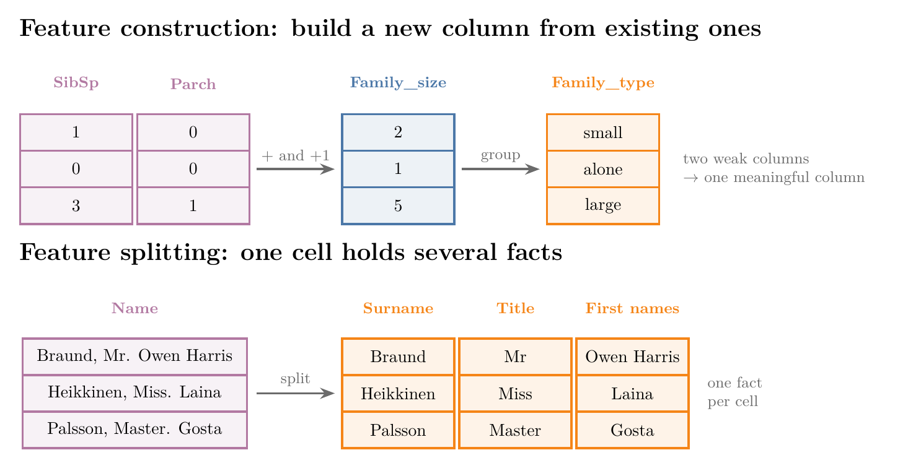
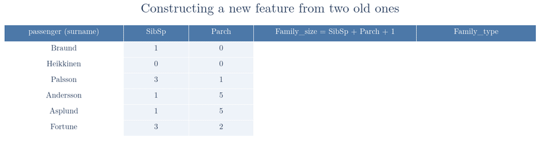
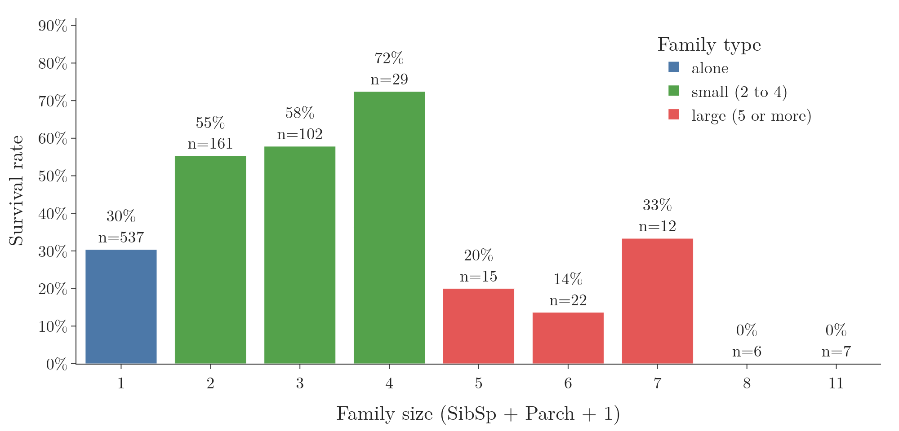
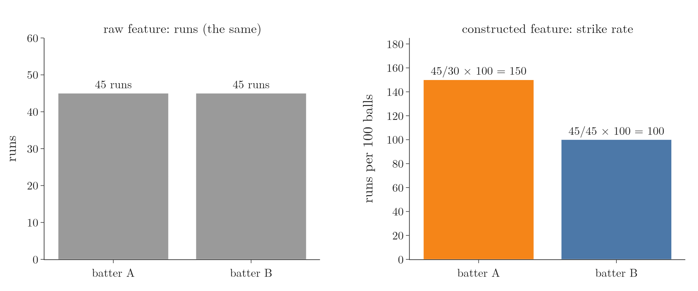
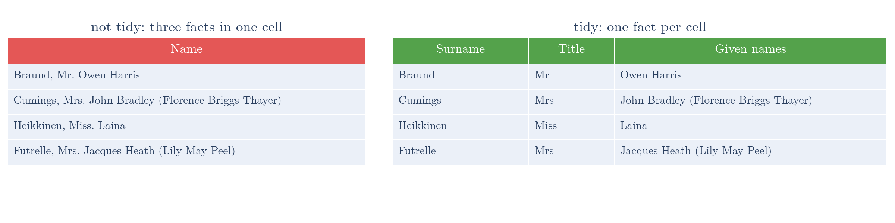
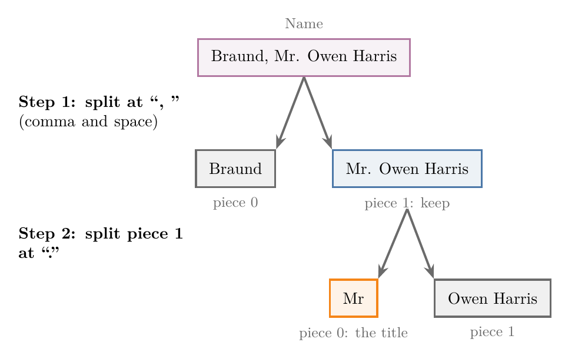
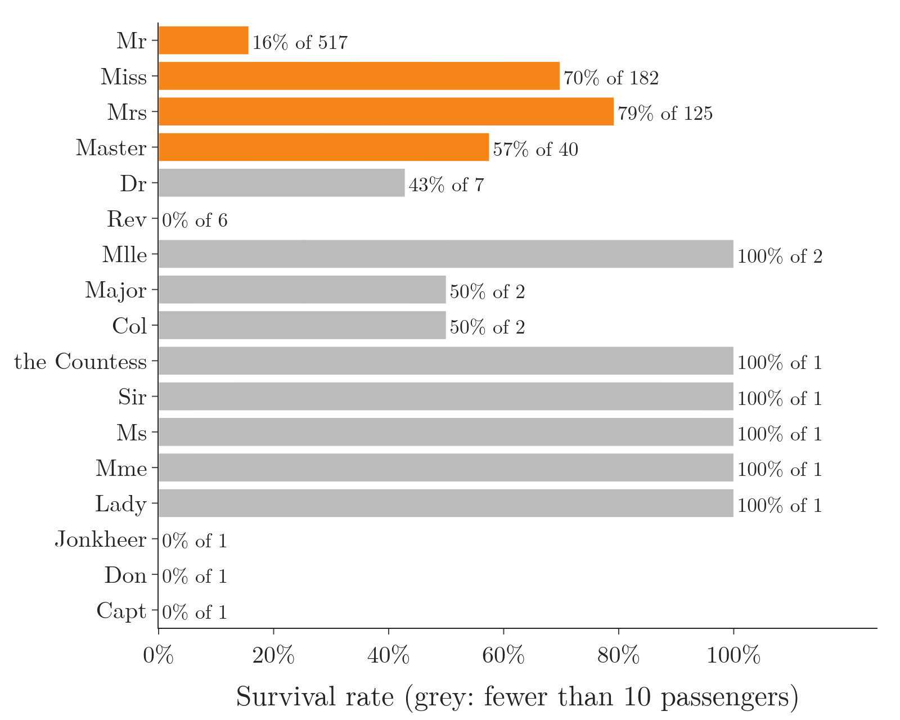
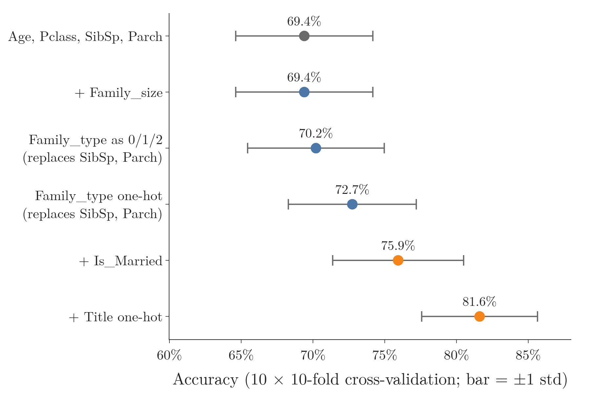

<!-- where-this-fits: generated by course_map/build_map.py; edit concepts.yaml, not this block -->
> **Where this fits:** Pipeline map step 5 (Engineer features). See the [Course map](../../../00-course-map/00-course-map.md).
>
> 
>
> - **Builds on:** Feature engineering ([Note ML-007](../../../ML/01-foundations/ML-007-challenges-in-ml/ML-007-challenges-in-ml.md)); Binning and binarization ([Note ML-022](../../../ML/03-feature-engineering/ML-022-what-is-feature-engineering/ML-022-what-is-feature-engineering.md)); Cross-validation ([Note ML-028](../../../ML/03-feature-engineering/ML-028-pipelines/ML-028-pipelines.md)).
> - **Compare with:** Feature extraction ([Note ML-022](../../../ML/03-feature-engineering/ML-022-what-is-feature-engineering/ML-022-what-is-feature-engineering.md)).
<!-- /where-this-fits -->

## 1. Overview

> **Key point:** Feature construction builds a new feature from existing ones by hand; feature splitting breaks one feature that holds several facts into several features.

A **feature** (G-772) is an input variable (one column of the data table), an **observation** (G-1374) is one record (one row, here one passenger), and the **target** (G-1949) is the output we predict (here `Survived`).

Every technique in the Notes so far changed a feature that was already there: filling gaps, encoding, scaling, removing outliers. Those are all feature transformation. This Note covers the second part of feature engineering: making new features. A cook does the same: from flour and water already on the shelf, a cook makes dough, an ingredient the shelf did not have.

Figure 1 shows the two ideas on the Titanic data. Construction combines `SibSp` and `Parch` into a family type. Splitting pulls the title (Mr, Miss, Master) out of each passenger's name.

{width=100%}

## 2. Feature construction

> **Key point:** There is no formula for feature construction: the new feature comes from our own intuition, domain knowledge and experience.

Every earlier technique had a fixed procedure. Standardization, for example, always subtracts the mean and divides by the standard deviation. Feature construction has no such procedure.

**Feature construction** (G-760) means creating a new feature by hand, from existing features, because we believe it will help the model (see the [feature engineering Note](../../03-feature-engineering/ML-022-what-is-feature-engineering/ML-022-what-is-feature-engineering.md), section 7). Three things decide which feature we build:

- **intuition:** a sense of what could matter for the target;
- **domain knowledge** (G-631): knowing the field the data comes from;
- **experience:** after working on many datasets, useful features become easier to spot.

At first feature construction feels hard, because it is not obvious which features could be built from which. The habit to build is simple: for every new dataset, ask "can I construct a new feature that helps the model?"

## 3. Family type on the Titanic

> **Key point:** `SibSp` and `Parch` add up to a family size, and the family size groups into three family types: alone, small and large.

### 3.1 The data and a baseline score

> **Key point:** Before building anything, we score a model on the original features, so that we have a number to compare against.

We use four features of the Titanic training data and the target:

| Column | Meaning |
|---|---|
| `Age` | age in years |
| `Pclass` | ticket class: 1, 2 or 3 |
| `SibSp` | number of siblings and spouses on board |
| `Parch` | number of parents and children on board |
| `Survived` | 1 if the passenger survived, 0 if not (target) |

`Age` is missing for 177 of the 891 passengers. To keep the example simple we drop those observations, which leaves 714.

The baseline is logistic regression scored with 20-fold cross-validation (Notes ML-028 and ML-029). The baseline gets a mean accuracy of 69.3%.

> **Python:** The baseline score.
>
> ```python
> import pandas as pd
> from sklearn.linear_model import LogisticRegression
> from sklearn.model_selection import cross_val_score
>
> cols = ["Age", "Pclass", "SibSp", "Parch", "Survived"]
> df = pd.read_csv("data/titanic.csv")[cols].dropna()
> X = df.drop(columns="Survived")
> y = df["Survived"]
>
> lr = LogisticRegression(max_iter=1000)
> cross_val_score(lr, X, y, cv=20).mean()   # 0.693
> ```

### 3.2 Building the family size

> **Key point:** Family size = `SibSp` + `Parch` + 1, where the 1 counts the passenger.

`SibSp` and `Parch` both count relatives on board. Added together, they give the number of relatives. Adding 1 for the passenger gives the **family size** (G-750): the number of people travelling together as a family.

1. **In words:** siblings and spouses, plus parents and children, plus the passenger.
2. **Formula:**
   $$F = \text{SibSp} + \text{Parch} + 1$$
   where $F$ is the new `Family_size` feature.
3. **Example:** Mr. Owen Harris Braund travelled with one sibling or spouse and no parents or children, so
   $$F = 1 + 0 + 1 = 2.$$

> **Python:** One new feature from two old ones.
>
> ```python
> X["Family_size"] = X["SibSp"] + X["Parch"] + 1
> ```
>
> Adding two columns adds them row by row, so every passenger gets their own family size.

Figure 2 does the addition row by row for six passengers. Its last column then sorts each size into a family type, the grouping of Section 3.3.

{height=30%}

### 3.3 Grouping the size into a family type

> **Key point:** Family size 1 means alone (0), 2 to 4 means a small family (1), and 5 or more means a large family (2).

Instead of the exact size, we keep only the kind of group the passenger was in. This new feature is the **family type** (G-751):

| Family size | Family type | Code |
|---|---|---|
| 1 | alone | 0 |
| 2 to 4 | small family | 1 |
| 5 or more | large family | 2 |

The last column of Figure 2 applies this table to the six passengers: Heikkinen (size 1) is alone, Braund (size 2) is in a small family, and the other four (sizes 5 to 7) are in large families.

Figure 3 shows why these groups make sense. Passengers alone survived 30% of the time, small families 55% to 72%, and large families 0% to 33%.

{width=100%}

The pattern is not a straight line. Survival rises from alone to small families, then falls sharply for large families. A single feature that says which of the three groups a passenger belongs to can capture this rise-and-fall better than the two raw counts.

> **Python:** Grouping with `np.select`.
>
> ```python
> import numpy as np
>
> size = X["Family_size"]
> # first matching condition wins; otherwise 2
> X["Family_type"] = np.select(
>     [size == 1, size <= 4], [0, 1], 2)
> ```
>
> `np.select(conditions, values, default)` gives each row the value of the first condition it meets. A size of 3 fails `size == 1`, meets `size <= 4`, and gets 1. Writing a small function and calling `.apply` on the column gives the same result, one row at a time.

### 3.4 Dropping the old features and scoring again

> **Key point:** Family type replaces `SibSp`, `Parch` and `Family_size` and lifts accuracy from 69.4% to 72.7% once each family type gets its own weight (one-hot encoded).

`Family_type` now carries what `SibSp`, `Parch` and `Family_size` said, so we drop those three. The model is left with `Age`, `Pclass` and `Family_type`: three features instead of four.

| Features | Accuracy |
|---|---|
| `Age`, `Pclass`, `SibSp`, `Parch` (baseline) | 69.4% |
| `Age`, `Pclass`, `Family_type` one-hot | 72.7% |

The one-hot version beats the baseline in 78 of 100 cross-validation folds and loses in 12. Conditions: logistic regression, 10-fold cross-validation repeated 10 times (Section 8). One-hot encoding (Note ML-026) matters here because survival rises and then falls across the three groups (Figure 3), and only a separate weight per group can follow that shape (Section 8 explains why).

Fed in as one number 0, 1, 2, as in the code below, the same feature moves 20-fold accuracy only from 69.3% to 70.0%.

> **Python:** Dropping the old features and scoring again (family type as 0/1/2).
>
> ```python
> X = X.drop(columns=["SibSp", "Parch", "Family_size"])
> cross_val_score(lr, X, y, cv=20).mean()   # 0.700
> ```

> **Extra:** How big is a 0.7-point gain? On 714 passengers it means about 5 more passengers predicted correctly. Each of the 20 folds holds only about 36 passengers, and the score of a single fold moves by about 9 points from fold to fold, so a 0.7-point gain is too small to trust. The one-hot version above is the one to keep.

## 4. Constructing features in other data

> **Key point:** Domain knowledge suggests the feature: in cricket data, strike rate for batters and economy for bowlers.

The same habit works on any dataset. In IPL ball-by-ball data, anyone who follows cricket knows two numbers that rate players better than raw totals.

**Strike rate** (G-1902), for a batter:

1. **In words:** runs scored for every 100 balls faced.
2. **Formula:**
   $$\text{strike rate} = \frac{\text{runs}}{\text{balls faced}} \times 100$$
3. **Example:** 45 runs off 30 balls give
   $$\frac{45}{30} \times 100 = 150.$$

**Economy rate** (G-658), for a bowler:

1. **In words:** runs given away per over bowled.
2. **Formula:**
   $$\text{economy} = \frac{\text{runs conceded}}{\text{overs bowled}}$$
3. **Example:** 32 runs in 4 overs give
   $$\frac{32}{4} = 8.$$

Neither feature exists in raw ball-by-ball data. Both are built from features that do, using knowledge of the game. Figure 4 shows why the constructed feature helps, on illustrative numbers: two batters with the same 45 runs look equal on the raw feature, but the strike rate separates the one who needed 30 balls from the one who needed 45.

{height=30%}

> **Extra:** Strike rate and economy are ratios, and ratios are a natural kind of constructed feature in other data too: price per square foot, debt per unit of income, clicks per visit. The intuition: a ratio removes the effect of size, so a big flat and a small flat can be compared by their price per square foot. Taking the ratio of two features is one of the first new features worth trying, and the model then tells us whether it helps (Kuhn and Johnson, §1.1).

## 5. Feature splitting

> **Key point:** In tidy data every cell holds one value; when a cell packs several facts together, we split it into several features.

### 5.1 Tidy data

> **Key point:** Tidy data has one observation per row and one atomic value per cell.

Data is **tidy** (G-1972) when:

- each row is one observation (here, one passenger);
- each cell holds an **atomic value** (G-222): one single piece of information, not several pushed into one place.

Sometimes a dataset is not tidy: one cell holds two or three facts at once. The Titanic `Name` column is an example (Figure 5): each cell holds a surname, a title and given names. Such a feature is hard to plot, group or give to a model, because the facts inside it cannot be used separately.



> **Extra:** The usual definition of tidy data, from the statistician Hadley Wickham, has three rules (Wickham and Grolemund, §12.2): each variable is a column, each observation is a row, and each cell holds one value. A name column that holds a title and a first name breaks the first and third rules: two variables share one column and one cell.

### 5.2 Splitting a feature

> **Key point:** A name like "Mr. Ankit" holds a title and a first name; splitting gives one feature for each.

Take a name feature whose value is "Mr. Ankit". The value holds two facts: the **title** (G-1979) Mr (the word before the name that shows sex, and often marital status or rank) and the first name Ankit.

**Feature splitting** (G-769) breaks such a feature into one feature per fact: here, a `Title` feature with Mr and a `First_name` feature with Ankit. The new features can affect the model in ways the combined feature could not. Splitting is useful in many situations, and Note ML-032 already split two Titanic columns, `Cabin` and `Ticket`, in the same way.

## 6. Splitting the title out of the Titanic names

> **Key point:** Split each name at ", " and keep the second piece, then split that at "." and keep the first piece: the result is the title.

Every name in the Titanic data has the same shape: surname, a comma, the title with a full stop, then the other names. For example, "Braund, Mr. Owen Harris".

Figure 6 shows how two splits isolate the title:

1. Split at ", " (comma and space). Piece 0 is the surname, Braund; piece 1 is "Mr. Owen Harris".
2. Split piece 1 at ".". Piece 0 is the title, Mr.



> **Python:** Splitting the title out of `Name`.
>
> ```python
> df = pd.read_csv("data/titanic.csv")
> after_comma = df["Name"].str.split(", ").str[1]
> df["Title"] = after_comma.str.split(".").str[0]
> ```
>
> `.str.split(", ")` turns each name into a list of pieces, and `.str[1]` takes piece 1 of every list. The second line does the same at the full stop and keeps piece 0.

| Name | Title |
|---|---|
| Braund, Mr. Owen Harris | Mr |
| Cumings, Mrs. John Bradley (Florence Briggs Thayer) | Mrs |
| Heikkinen, Miss. Laina | Miss |
| Futrelle, Mrs. Jacques Heath (Lily May Peel) | Mrs |
| Allen, Mr. William Henry | Mr |

The 891 names give 17 different titles. One unusual name, "Rothes, the Countess. of (Lucy Noel Martha Dyer-Edwards)", gives the title "the Countess".

## 7. What the title tells us

> **Key point:** Survival rate differs strongly by title: 79% for Mrs, 70% for Miss, 57% for Master, but only 16% for Mr.

Grouping passengers by title and averaging `Survived` gives each title's survival rate (Figure 7):

- **Mrs** (married women): 79% of 125 survived, the highest of the common titles.
- **Miss** (unmarried women and girls): 70% of 182.
- **Master** (boys): 57% of 40.
- **Mr** (men): only 16% of 517.

{height=55%}

The title carries a lot of information about survival that the raw name hid, and Section 8 measures how much the model gains from it.

> **Python:** Survival rate by title.
>
> ```python
> rate = df.groupby("Title")["Survived"].agg(["mean", "size"])
> rate.sort_values("size", ascending=False)
> ```
>
> `agg(["mean", "size"])` gives each title's survival rate and its number of passengers. Select the `Survived` column before averaging: `df.groupby("Title").mean()` fails in pandas 3, because it tries to average text columns such as `Name`.

> **Extra:** Treat the grey bars in Figure 7 with care. Lady, Sir, Ms and the Countess show 100% survival, but each is a single passenger. One person cannot give a reliable rate. So before using the title in a model, we group rare titles into one category. scikit-learn's `OneHotEncoder` can do this for us (Section 8).

### 7.1 A married feature from the title

> **Key point:** The title also gives a new 0/1 feature: `Is_Married` is 1 when the title is Mrs.

Splitting and construction often work together. From the split-out title we can construct another feature, **`Is_Married`**: 1 for passengers with the title Mrs, 0 for everyone else.

> **Python:** Building `Is_Married`.
>
> ```python
> df["Is_Married"] = (df["Title"] == "Mrs").astype(int)
> df["Is_Married"].sum()   # 125
> ```
>
> `df["Title"] == "Mrs"` gives True or False for every row, and `.astype(int)` turns these into 1 and 0.

> **Extra:** Older code builds the column in two steps: `df["Is_Married"] = 0`, then `df["Is_Married"].loc[df["Title"] == "Mrs"] = 1`. The second line first selects the column and then changes the selection, which is called **chained assignment** (G-372). In pandas 3 the selection is always a separate copy, so the line prints a `ChainedAssignmentError` warning and changes nothing: every row stays 0.
>
> The one-step version above avoids the problem.

> **Extra:** `Is_Married` only marks married women. Married men are all "Mr", like unmarried men, so the title cannot tell them apart.

## 8. Measuring whether each new feature helps

> **Key point:** Of all the new features, the split-out title helps most (69.4% to 81.6%); family size alone adds nothing to a linear model.

> **Extra:** This whole section goes beyond the original example, which scored only the family type. A new feature is only worth keeping if the model scores better with it across many folds, not on one lucky split.
>
> We test every feature the same way:
>
> - the same 714 passengers with a known age;
> - logistic regression;
> - 10-fold cross-validation repeated 10 times with different shuffles, so each score is the mean of 100 folds;
> - every new feature built inside a pipeline (Note ML-028), so each fold builds it from its own rows.

{height=50%}

> **Extra:** Figure 8 shows the results:
>
> | Features | Accuracy | Change |
> |---|---|---|
> | `Age`, `Pclass`, `SibSp`, `Parch` (baseline) | 69.4% | |
> | baseline + `Family_size` | 69.4% | 0.0 |
> | `Age`, `Pclass`, `Family_type` as 0/1/2 | 70.2% | +0.8 |
> | `Age`, `Pclass`, `Family_type` one-hot | 72.7% | +3.3 |
> | baseline + `Is_Married` | 75.9% | +6.5 |
> | baseline + `Title` one-hot | 81.6% | +12.2 |
>
> The grey bars in Figure 8 show the spread of single-fold scores: about 4 to 5 points either way.

> **Extra:** Why `Family_size` adds exactly nothing. Logistic regression gives each feature a weight and adds them up, so it can already use $w \cdot (\text{SibSp} + \text{Parch})$ by giving both raw features the same weight. A new feature that is a plain sum of existing ones gives a linear model no new information. Grouping is different: alone, small and large is a bend that no weighted sum of the raw counts can draw.

> **Extra:** Why the family type helps more when one-hot encoded. As one number 0, 1, 2 with a single weight $w$, the feature adds $0$, $w$ and $2w$ to the model's score for alone, small and large. These three always go in one direction: if small is above alone ($w > 0$), large must be above small too. But survival goes up and then down (Figure 3). One-hot encoding (Note ML-026) gives each group its own weight, so the model can follow the up-and-down shape. The 0/1/2 version beats the baseline in only 51 of the 100 folds (29 worse, 20 tied), so its 0.8-point gain is within the fold-to-fold spread; the one-hot version beats it in 78.

> **Extra:** The title is clearly worth keeping: it beats the baseline in 99 of the 100 folds and ties in the last one.
>
> Much of its power is sex: the original features contain no sex feature, and Mr, Mrs and Miss reveal it. Adding the `Sex` feature instead gives 80.5%. The rest of the title's edge comes from "Master", which also marks young boys: adding a 0/1 `Master` feature to baseline + `Sex` gives 82.9%, even above the title's 81.6% (Notebook, cell after the score table). In the one-hot encoder, titles with fewer than 10 passengers are grouped into one "infrequent" category with `min_frequency=10`, as suggested in Section 7 (scikit-learn User Guide, "Infrequent categories").

> **Extra:** Is building features before the split data leakage? Family size, family type and title are each computed from one observation alone, with a fixed rule, so no information passes from test rows to training rows. Anything that learns from the data, such as the list of common titles in the encoder or a mean used to fill gaps, must be learned inside the pipeline, from training observations only.

## 9. Summary

| | Feature construction | Feature splitting |
|---|---|---|
| What it does | builds a new feature from existing ones | breaks one feature into several |
| When to use it | domain knowledge suggests a more meaningful feature | one cell holds several facts (not tidy) |
| Titanic example | `SibSp` + `Parch` + 1 $\rightarrow$ family size $\rightarrow$ family type | `Name` $\rightarrow$ `Title` |
| Other examples | strike rate, economy rate, price per square foot | `Cabin` $\rightarrow$ deck and number (Note ML-032) |
| Measured gain (logistic regression) | +0.8 points as 0/1/2, +3.3 one-hot | +12.2 points one-hot |
| pandas tools | column arithmetic, `np.select` | `.str.split`, `.str[i]` |

- Feature construction has no formula; it comes from intuition, domain knowledge and experience.
- For every dataset, ask whether a new feature could be built that helps the model.
- Tidy data has one observation per row and one atomic value per cell; splitting restores this.
- A split-out feature can feed further construction, as with `Is_Married` from `Title`.
- Always score the model before and after a new feature, with cross-validation; trust a gain only when it holds across most folds.
- A plain sum of existing features adds nothing to a linear model; groups (one-hot encoded), ratios and split-out facts can.


## 10. Sources

**Built from**

- CampusX, "Feature Construction | Feature Splitting", YouTube, https://www.youtube.com/watch?v=ma-h30PoFms

**Other references**

- Kuhn, M. and Johnson, K. (2019). *Feature Engineering and Selection: A Practical Approach for Predictive Models*, Section 1.1 (trying the ratio of two predictors). CRC Press. feat.engineering.
- Wickham, H. and Grolemund, G. (2017). *R for Data Science*, Section 12.2, "Tidy data". O'Reilly.
- scikit-learn User Guide, Preprocessing data, Encoding categorical features, "Infrequent categories". scikit-learn.org.

## 11. Key terms

| Term | Meaning |
|---|---|
| Feature | An input variable: one column of the data table |
| Observation | One record: one row of the data table |
| Target | The output we predict |
| Family size | `SibSp` + `Parch` + 1: the number of people in a passenger's travelling family |
| Family type | Family size grouped into alone, small family (2 to 4) and large family (5 or more) |
| Strike rate | A batter's runs per 100 balls faced |
| Economy rate | A bowler's runs conceded per over |
| Tidy data | Data with one observation per row and one atomic value per cell |
| Atomic value | A single piece of information in a cell, not several combined |
| Feature splitting | Breaking a feature that holds several facts into one feature per fact |
| Title | The word before a name, such as Mr, Mrs, Miss or Master |
| Chained assignment | Selecting part of a DataFrame and then changing that selection in a second step; does nothing in pandas 3 |
