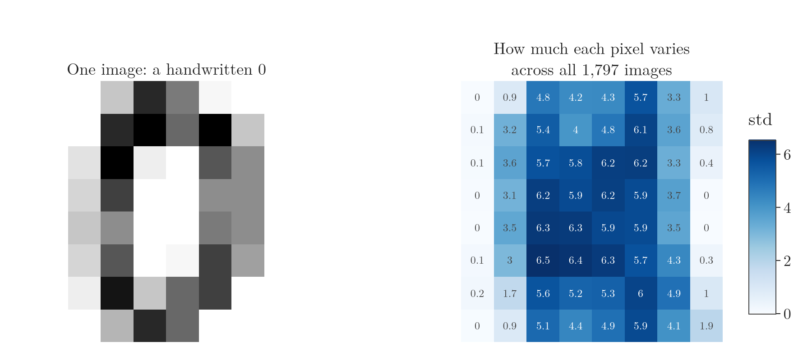
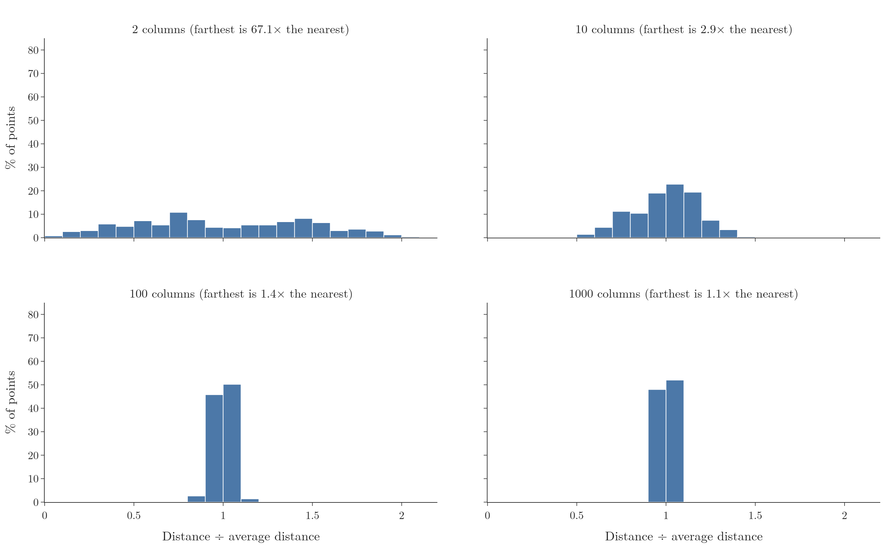
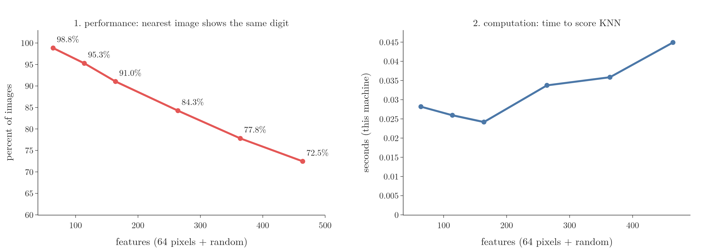
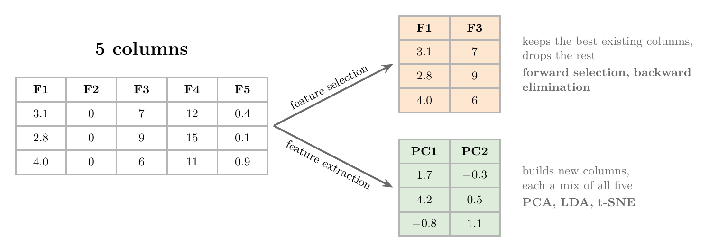

<!-- where-this-fits: generated by course_map/build_map.py; edit concepts.yaml, not this block -->
> **Where this fits:** Pipeline map steps 5 (Engineer features), 6 (Reduce dimensions). See the [Course map](../../../00-course-map/00-course-map.md).
>
> 
>
> - **Builds on:** Unsupervised learning ([Note ML-003](../../../ML/01-foundations/ML-003-types-of-ml/ML-003-types-of-ml.md)); Feature engineering ([Note ML-007](../../../ML/01-foundations/ML-007-challenges-in-ml/ML-007-challenges-in-ml.md)); Correlation ([Note ML-018](../../../ML/02-getting-data/ML-018-understanding-your-data/ML-018-understanding-your-data.md)); Kernel density estimation (KDE) ([Note ML-019](../../../ML/02-getting-data/ML-019-univariate-analysis/ML-019-univariate-analysis.md)); Lasso regression ([Note ML-066](../../../ML/06-regression/ML-066-lasso-regression/ML-066-lasso-regression.md)); Feature importance ([Note ML-093](../../../ML/08-trees-and-ensembles/ML-093-regression-trees/ML-093-regression-trees.md)).
> - **Leads to:** PCA ([Note ML-046](../../../ML/05-dimensionality/ML-046-pca-geometric-intuition/ML-046-pca-geometric-intuition.md)); K-nearest neighbours ([Note ML-085](../../../ML/07-classification/ML-085-knn/ML-085-knn.md)).
> - **Compare with:** Feature construction and splitting ([Note ML-044](../../../ML/05-dimensionality/ML-044-feature-construction-splitting/ML-044-feature-construction-splitting.md)); Superposition and nearly perpendicular directions ([Note DL-090](../../../DL/06-transformers/DL-090-superposition/DL-090-superposition.md)).
<!-- /where-this-fits -->

## 1. Where we are in feature engineering

> **Key point:** Two parts of feature engineering are left: feature selection and feature extraction. Both exist to fight the curse of dimensionality.

Of the four parts of feature engineering (see Figure 1 of the [feature engineering Note](../../03-feature-engineering/ML-022-what-is-feature-engineering/ML-022-what-is-feature-engineering.md)), feature transformation (missing values, encoding, scaling, outliers) and feature construction and splitting are done.

Two parts remain:

- **Feature selection** (G-768): keep only the useful features. Feature selection is usually done after a model is built, to check whether removing features helps the model.
- **Feature extraction** (G-762): build a few new features from the old ones. Its most important technique, PCA, comes next.

Both rest on one idea: the curse of dimensionality. This Note explains that idea, why it matters, and how we deal with it.

## 2. What the curse of dimensionality is

> **Key point:** Every dataset has an optimal number of features. Past it, extra features do not help, and often make the model worse and slower.

In ML, each **feature** (G-772) (an input variable, one column of the data table) is called a dimension. Each **observation** (G-1374) is one record (one row), here one image, and the **target** (G-1949) is the output we predict, here the digit (see the [types of ML Note](../../01-foundations/ML-003-types-of-ml/ML-003-types-of-ml.md), section 3.3). A dataset with 10 features is 10-dimensional, and one with 1,000 features is **high-dimensional** (G-897). Here "dimension" has the "dimensions of a vector" sense, not the number of axes of a tensor; the [tensors Note](../../01-foundations/ML-010-tensors/ML-010-tensors.md), section 5, separates the two.

More features seem as if they should always help, since the model gets more information. In practice more features do not always help. Think of a detective handed a thousand pages of witness statements, most of them about the weather: the few useful clues get harder to find, not easier.

Every dataset has an **optimal number of features** (G-1397). Up to that number, each new feature improves the model. Beyond it:

- performance stops improving, and often gets worse;
- the model needs more computation and becomes more complex.

High-dimensional data is common. Two everyday sources are images, where every pixel is a feature, and text, where every word is a feature: an email spam classifier can easily work on 3,000 features.

These problems together are the **curse of dimensionality** (G-520): the problems that appear when data has too many dimensions (a name from Bellman; ESL §2.5).

## 3. An example: images of digits

> **Key point:** In images, every pixel is a feature. Many pixels, such as the ones at the edges, carry almost no information.

Image data shows the curse clearly: every pixel is one feature, and the blank edge pixels of MNIST carry almost nothing (see the [feature engineering Note](../../03-feature-engineering/ML-022-what-is-feature-engineering/ML-022-what-is-feature-engineering.md), section 8.1). Here we measure this on a smaller version, scikit-learn's digits dataset: 1,797 images of 8 × 8 pixels, so 64 features. Figure 1 shows one image and how much each pixel changes across all the images.



The digit is always drawn in the middle. The pixels at the left and right edges are almost always blank: 3 pixels never change at all, and 16 have a standard deviation below 1.

A pixel that is the same in every image cannot help tell one digit from another. Such a pixel is a feature the model has to process, with nothing to learn from.

### 3.1 Measuring the effect

> **Key point:** Accuracy rose to 96% with the useful pixels, then fell to 80% as we added useless features.

Figure 2 shows a real experiment with KNN, a classifier that labels a point by looking at its nearest neighbours.


1. **Blue line:** we add the 64 pixels one group at a time, most useful first. Accuracy rises fast, from 21% with 1 pixel to 90% with 16 pixels. Accuracy levels off at 96% from about 40 pixels on.
2. **Red line:** we keep all 64 pixels and add features of random numbers. Accuracy drops steadily, to 80% with 400 extra features.

The blue line shows the optimal number of features: after about 40 pixels, adding more brings nothing. The red line shows that useless features actively hurt.

> **Python:** Accuracy for different numbers of features (full code in the Notebook).
>
> ```python
> from sklearn.model_selection import cross_val_score
> from sklearn.neighbors import KNeighborsClassifier
>
> def score(Z):
>     # average accuracy over 5 train/test splits
>     return cross_val_score(KNeighborsClassifier(), Z, y, cv=5).mean()
>
> score(X[:, order[:16]])               # best 16 pixels: 90%
> score(np.hstack([X, noise[:, :400]])) # 64 pixels + 400 random: 80%
> ```

> **Extra:** **Cross-validation** (G-510), used in `cross_val_score`, splits the data into 5 parts and tests on each part in turn. Cross-validation gives a more reliable accuracy than a single train/test split. It is covered in detail later.

## 4. Why more dimensions cause trouble

> **Key point:** As dimensions grow, the same data gets spread thinner and thinner, so points end up far from each other.

### 4.1 Finding a lost wallet

> **Key point:** Each extra dimension makes the space to search much larger.

Suppose we lose our wallet. Where is it easiest to find?

1. **On a road** from the college gate to the building. The road is one-dimensional: we walk along it once and see everything.
2. **On the campus.** Now it can be anywhere on a two-dimensional area. The search takes much longer.
3. **In a multi-storey building.** Now it can be on any floor, in any room. Three dimensions make the search harder still.

The wallet is the same in each case. Only the number of dimensions changed, and with it the size of the space. Figure 3 in the next section draws the road, the campus and the building as grids of cells.

### 4.2 The same data spreads thin

> **Key point:** With 5 bins per feature, each new feature multiplies the number of cells by 5, while the number of points stays the same.

Figure 3 applies the wallet idea to data. We take the same 20 points and split each feature into 5 bins.


Count the cells first. One feature in 5 bins gives 5 cells. A second feature splits each of them into 5 again, so 2 features give $5 \times 5 = 25$ cells, and 3 features give $5 \times 5 \times 5 = 125$ cells. Meanwhile there are still only 20 points.

| Features | Like | Cells | Empty cells |
|---|---|---|---|
| 1 | a road in 5 stretches | 5 | 0 (0%) |
| 2 | a campus of 5 × 5 blocks | 25 | 11 (44%) |
| 3 | a building of 5 floors, 5 × 5 rooms each | 125 | 107 (86%) |

The number of cells grows as $5^d$, where $d$ is the number of features. Twenty points are enough to fill a road, but they leave a building almost empty.

Data where most of the space is empty is called **sparse**. In sparse data, every point is far from the others.

This "sparse" has a different meaning from the sparse data of the [normalization Note](../../03-feature-engineering/ML-024-normalization/ML-024-normalization.md) (section 8), where sparse means a table whose values are mostly zeros. Here it means a space that is mostly empty.

### 4.3 Why this hurts models

> **Key point:** Many algorithms rely on distances between points. When every point is far from every other, distances stop being useful.

Many algorithms, such as KNN, make a prediction by finding the points closest to a new point. Finding the closest points only works if "close" means something.

In high dimensions, every point is far from every other point. The nearest neighbour is not really near, so the prediction is based on points that are not similar. These dissimilar neighbours are why the KNN accuracy in Figure 2 fell as we added useless features.

> **Extra:** We checked this on the red line of Figure 2. For every image we found its nearest other image and asked whether it shows the same digit (Notebook, after the accuracy table):
>
> | Features | Nearest neighbour shows the same digit | Nearest distance / average distance |
> |---|---|---|
> | 64 | 98.8% | 0.34 |
> | 164 | 91.0% | 0.76 |
> | 464 | 72.5% | 0.89 |
>
> With more useless features, the nearest image is almost as far away as an average one, and more and more often it shows a different digit. KNN votes with these neighbours, so its accuracy falls with them.

> **Extra:** In very high dimensions, distances also become almost all the same: the farthest point is hardly farther than the nearest (Beyer et al. 1999). Figure 4 measures the distance from one random point to 500 others. With 2 features, the farthest point is 67 times farther than the nearest; with 1,000 features, only 1.1 times. When everything is about equally far, "nearest" carries almost no information.



## 5. The two problems

> **Key point:** Too many dimensions cause two problems: lower performance and more computation.

1. **Performance decreases.** Useless features spread the data thin and push the truly similar points apart (Section 4.3). In Figure 2, accuracy fell from 96% to 80%.
2. **Computation increases.** Every extra feature is more data to store and more numbers to process in every step. In the same experiment, scoring the model with 464 features took about 1.6 to 2.4 times as long as with 64, depending on the run.

Figure 5 draws both problems on the red-line experiment of Figure 2. As random features are added, the share of images whose nearest other image shows the same digit falls from 98.8 to 72.5 percent, and the time to score the model keeps climbing.



The fix for both is to bring the number of features down to the optimal number.

## 6. The solution: dimensionality reduction

> **Key point:** Dimensionality reduction lowers the number of features. Dimensionality reduction comes in two kinds: feature selection keeps the best features; feature extraction builds new ones.

**Dimensionality reduction** (G-611) means reducing the number of features in the data while keeping as much of the useful information as possible. Its two kinds are the last two parts of feature engineering, taught in the [feature engineering Note](../../03-feature-engineering/ML-022-what-is-feature-engineering/ML-022-what-is-feature-engineering.md), sections 8 and 9:

- **Feature selection** keeps a subset of the existing features unchanged, for example with forward selection or backward elimination.
- **Feature extraction** builds new features, each a mix of all the old ones, so that a few new features hold most of the information.

Figure 6 shows both on five features, F1 to F5: selection keeps F1 and F3, while extraction builds two new features, PC1 and PC2, neither equal to any original feature. The main extraction techniques:

- **PCA** (principal component analysis, G-1469), covered next;
- **LDA** (linear discriminant analysis, G-1059);
- **t-SNE** (t-distributed stochastic neighbour embedding).



> **Extra:** The F2 feature in Figure 6 is 0 in every observation, like the edge pixels in Figure 1. Removing such a constant feature is the simplest feature selection there is. In scikit-learn it is done by `VarianceThreshold`.

## 7. Summary

| | Feature selection | Feature extraction |
|---|---|---|
| What it does | keeps the best existing features | builds new features from all the old ones |
| Output features | a subset of the originals | new, mixed features |
| Techniques | forward selection, backward elimination | PCA, LDA, t-SNE |
| When | usually after a first model is built | next Notes (PCA) |

- Each feature of the data is a dimension.
- Every dataset has an optimal number of features; past it, extra features hurt.
- More dimensions spread the same data thinner: cells grow as $5^d$, points stay the same.
- Sparse data makes distances less useful, which hurts distance-based algorithms like KNN.
- Two problems: lower performance and more computation.
- The fix is dimensionality reduction: feature selection or feature extraction.


## 8. Sources

**Built from**

- CampusX, "Curse of Dimensionality", YouTube, https://www.youtube.com/watch?v=ToGuhynu-No

**Other references**

- ESL: Hastie, T., Tibshirani, R. and Friedman, J. (2009). *The Elements of Statistical Learning*, 2nd ed. Springer. §2.5, Local Methods in High Dimensions.
- Beyer, K., Goldstein, J., Ramakrishnan, R. and Shaft, U. (1999). When is "nearest neighbor" meaningful? *Proceedings of the International Conference on Database Theory (ICDT)*, 217–235.

## 9. Key terms

| Term | Meaning |
|---|---|
| Feature | An input variable: one column of the data table; also called a dimension |
| Observation | One record: one row of the data table |
| High-dimensional data | Data with a very large number of features |
| Optimal number of features | The number of features at which a model performs best |
| Curse of dimensionality | The problems that appear when data has too many dimensions: lower performance and more computation |
| Sparse data | Data where most of the space holds no points |
| Dimensionality reduction | Reducing the number of features while keeping the useful information |
