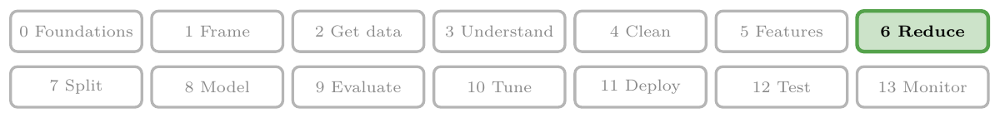
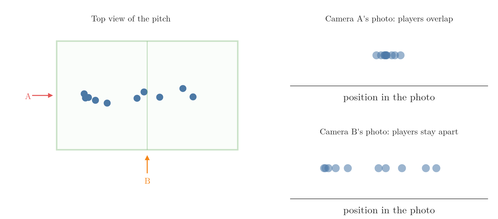
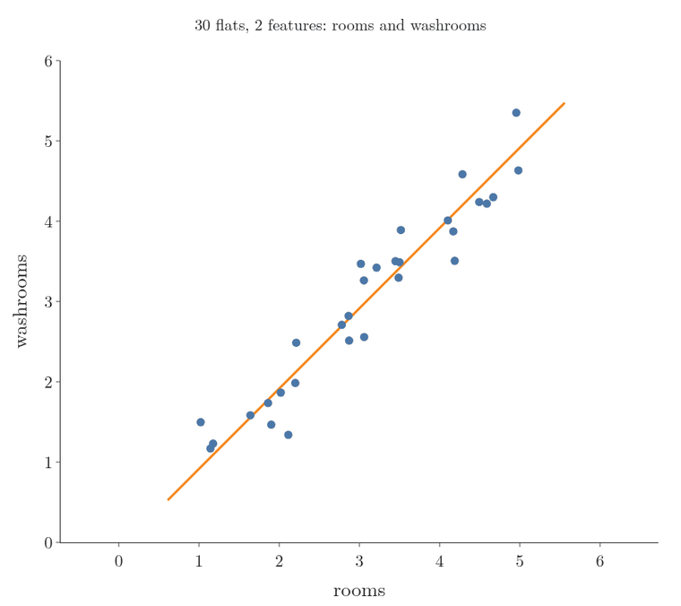
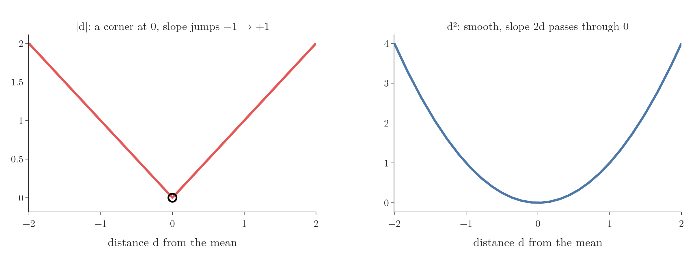

<!-- where-this-fits: generated by course_map/build_map.py; edit concepts.yaml, not this block -->
> **Where this fits:** Pipeline map step 6 (Reduce dimensions). See the [Course map](../../../00-course-map/00-course-map.md).
>
> 
>
> - **Builds on:** [Unsupervised learning](../../../ML/01-foundations/ML-003-types-of-ml/ML-003-types-of-ml.md#3-unsupervised-learning); [Variance](../../../MA/01-descriptive-stats/MA-006-measures-of-dispersion/MA-006-measures-of-dispersion.md#4-variance); [Covariance and covariance matrix](../../../MA/01-descriptive-stats/MA-009-covariance-and-correlation/MA-009-covariance-and-correlation.md#3-covariance); [Feature extraction](../../../ML/03-feature-engineering/ML-022-what-is-feature-engineering/ML-022-what-is-feature-engineering.md#9-feature-extraction); [Feature scaling](../../../ML/03-feature-engineering/ML-023-standardization/ML-023-standardization.md#2-feature-scaling-in-brief); [Standardization](../../../ML/03-feature-engineering/ML-023-standardization/ML-023-standardization.md#4-the-standardization-formula); [Curse of dimensionality](../../../ML/05-dimensionality/ML-045-curse-of-dimensionality/ML-045-curse-of-dimensionality.md#2-what-the-curse-of-dimensionality-is); [Linear transformations and matrices](../../../MA/05-linear-algebra/MA-053-linear-transformations-and-matrices/MA-053-linear-transformations-and-matrices.md#3-what-makes-a-transformation-linear); [Eigenvectors and eigenvalues](../../../MA/05-linear-algebra/MA-056-eigenvectors-and-eigenvalues/MA-056-eigenvectors-and-eigenvalues.md#2-eigenvectors-stay-on-their-own-span); [Singular value decomposition](../../../MA/05-linear-algebra/MA-057-svd-geometry/MA-057-svd-geometry.md#4-rotate-stretch-rotate-a--usigma-vmathsf-t).
> - **Compare with:** [Low-rank approximation (truncated SVD)](../../../MA/05-linear-algebra/MA-059-low-rank-approximation/MA-059-low-rank-approximation.md#3-the-rank-k-approximation).
<!-- /where-this-fits -->

## 1. What PCA is

> **Key point:** PCA is an unsupervised feature extraction technique. PCA turns many features into a few new ones while keeping the essence of the data.

A **feature** (G-772) is an input variable (one column of the data table), an **observation** (G-1374) is one record (one row), and the **target** (G-1949) is the output we predict.

**Principal component analysis (PCA)** (G-1469) is the best-known **feature extraction** technique (building a few new features out of the old ones; [feature extraction](../../03-feature-engineering/ML-022-what-is-feature-engineering/ML-022-what-is-feature-engineering.md#9-feature-extraction)). PCA reduces the number of features in a dataset, which fights the [curse of dimensionality](../ML-045-curse-of-dimensionality/ML-045-curse-of-dimensionality.md#2-what-the-curse-of-dimensionality-is) (the trouble that too many features cause).

Three facts to keep in mind:

- PCA is **unsupervised** (G-2058; it learns from the features alone, [learning from inputs only](../../01-foundations/ML-003-types-of-ml/ML-003-types-of-ml.md#31-learning-from-inputs-only)): it never uses the target.
- PCA is old and widely used.
- The full mathematics of PCA is involved. This Note builds the geometric intuition; the step-by-step mathematics is in [PCA in five steps](../ML-047-pca-step-by-step/ML-047-pca-step-by-step.md#5-pca-in-five-steps).

### 1.1 The photographer

> **Key point:** A photo turns a 3D scene into 2D. A good photographer picks the angle that keeps the most information, and PCA does the same with data.

A photographer at a football match has a 3D scene in front of them: players spread over a pitch. A newspaper photo is 2D, so every photo loses one dimension.

From some angles the photo is useless: the players stand in a line, one behind the other. From other angles every player is clearly visible. Figure 1 shows both cases.



- **Camera A** looks along the length of the pitch. In its photo, the players overlap.
- **Camera B** looks across the pitch. In its photo, the players stay apart.

PCA works like a photographer who walks around the stadium to find the best angle. PCA moves data from a high dimension to a lower one, and picks the direction that keeps the most information.

### 1.2 Why use PCA

> **Key point:** Fewer features make algorithms faster. Going down to 2 or 3 features lets us plot the data.

1. **Faster algorithms.** With fewer features, there is less data to process, both in training and in prediction. Performance can stay close to what it was on the full data; [PCA on images of digits](../ML-048-pca-mnist/ML-048-pca-mnist.md#3-knn-on-all-784-features) measures this.
2. **Visualisation.** We cannot plot more than 3 dimensions. PCA can bring a dataset with many features down to 3 or 2, and then we can plot it. [PCA on images of digits](../ML-048-pca-mnist/ML-048-pca-mnist.md#51-in-2d) does this with images of digits that have 784 features.

## 2. Feature selection by spread

> **Key point:** To choose between two features, project the points onto each axis and keep the feature whose points are more spread out.

PCA is a feature extraction technique, but it is easiest to understand by first looking at **feature selection**: keeping some existing features and dropping the rest (see [feature selection](../../03-feature-engineering/ML-022-what-is-feature-engineering/ML-022-what-is-feature-engineering.md#8-feature-selection) and [feature extraction](../../03-feature-engineering/ML-022-what-is-feature-engineering/ML-022-what-is-feature-engineering.md#9-feature-extraction) for the two ideas).

Take made-up data about 30 flats with three features (one observation per flat): the number of rooms, the number of grocery shops nearby, and the price. The made-up counts are drawn as decimals, such as 2.4 rooms, so that the points do not stack on top of each other. Suppose we must drop one of the two input features.

Anyone who knows a little about property would keep rooms: the price depends much more on rooms than on nearby grocery shops. But often we work with data we know nothing about. We need a rule that does not depend on knowing the subject.

### 2.1 The rule: keep the bigger spread

> **Key point:** The shadow of the points on an axis shows how much that feature varies. The longer the shadow, the more information.

Figure 2 (left) plots the flats with rooms on the x-axis and grocery shops on the y-axis.


Imagine shining a light so each point casts a shadow on the x-axis. Dropping each point straight down onto an axis like this is called **projecting** (G-1583) it.

- On the rooms axis (orange), the shadows stretch from 1 to 5.
- On the grocery shops axis (green), they cover only a short stretch.

The data is spread out along rooms and bunched up along grocery shops. So we keep rooms. The size of this spread is measured by the **variance** (G-2074) of the shadows, the average squared distance of the shadows from their mean ([section 5](#5-variance) computes it step by step): 1.33 for rooms and 0.10 for grocery shops.

Feature selection by spread therefore keeps the features with the largest variance.

### 2.2 Where feature selection fails

> **Key point:** When two features have about the same spread, feature selection cannot tell which one to drop.

Now replace grocery shops with the number of washrooms. Rooms and washrooms rise together: a flat with more rooms usually has more washrooms.

Figure 2 (right) shows this data. Projected onto either axis, the spread is the same: variance 1.33 for both. Both features matter for the price, and the rule from Section 2.1 cannot choose.

Feature selection is stuck. Feature extraction solves this.

## 3. Feature extraction: a new feature

> **Key point:** Instead of dropping one of two equal features, build one new feature that carries the information of both.

[Dimensionality reduction](../../01-foundations/ML-003-types-of-ml/ML-003-types-of-ml.md#33-dimensionality-reduction) already did this by hand: rooms and washrooms were replaced by one new feature, the flat's area. The data went from 2 input features to 1, and the price can still be predicted.

PCA does the same with no knowledge of the subject. PCA ignores the original features as they are, builds a new set of features from the data alone, and keeps the new features that matter most.

Figure 3 shows the result on the rooms and washrooms data. Every flat slides onto one line, PC1 (section 4 explains how PCA chooses it), and is then described by a single number: its position along that line, from $-2.7$ to $+3.0$. That one number keeps 98 percent of the spread of the two original features.



## 4. How PCA finds the new features

> **Key point:** PCA rotates the axes until one axis points along the direction of greatest spread. That axis is the first principal component.

Feature selection could only look along the two existing axes, rooms and washrooms. PCA is allowed to turn the axes to any angle.

Figure 4 shows the idea on the rooms and washrooms data. We draw a line through the centre of the data, project every point onto it, and measure the variance of the shadows. Then we turn the line and measure again.


1. **Along rooms (0°):** variance 1.33.
2. **Along washrooms (90°):** variance 1.33, the same.
3. **At 45°:** variance 2.61, the largest of any angle. This line is the first principal component.
4. **At right angles to it:** variance only 0.05. This line is the second principal component.

The new axes are called **principal components** (G-1563), written **PC1** and **PC2**. PC1 is the direction with the most variance; PC2 is at right angles to it and holds what is left. Why right angles: PC2 is chosen to carry new information, so its values must be uncorrelated with PC1's, and being uncorrelated with PC1 turns out to be the same as pointing at right angles to it (ISLR §12.2.1). With two features, that leaves only one possible direction for PC2.

Here PC1 holds almost all the spread, 2.61 against 0.05. So we keep PC1, drop PC2, and describe each flat by one number: its position along PC1. Two features have become one, just like the flat's area.

### 4.1 Largest spread and closest line are the same line

> **Key point:** The line with the largest spread of shadows is also the line closest to the points. Pythagoras' theorem ties the two together.

"Find the line the shadows spread most along" and "find the line that passes closest to the points" sound like two different jobs. Figure 5 shows they are one job. It has two steps.

1. **Centre the data.** Subtract the mean of each feature, so the centre of the cloud sits on the origin. The data is now **centred** (G-365). The shape of the cloud does not change: the highest flat is still the highest.
2. **Turn a line through the origin** and project every flat onto it, as in Figure 4.


Watch the black flat in Figure 5. Three lengths form a right-angled triangle:

- $a$: from the origin to the flat. The flat does not move, so $a$ never changes;
- $c$: from the origin to the flat's shadow on the line;
- $b$: from the flat to the line.

By Pythagoras' theorem,

$$a^2 = b^2 + c^2 .$$

For the black flat, $a^2 = 6.52$ at every angle. At 0° it splits into $c^2 = 4.26$ and $b^2 = 2.26$. At 45° it splits into $c^2 = 6.36$ and $b^2 = 0.16$. Because $a^2$ is fixed, whenever $c^2$ grows, $b^2$ must shrink by the same amount.

The same holds for every flat, so it holds for the averages, which are the two bars in Figure 5. The orange bar is the variance of the shadows; the red bar is the average squared distance to the line. Together they always make 2.66. At 45° the orange bar is at its largest, 2.61, so the red bar is at its smallest, 0.05.

Maximum variance along the line and minimum distance to the line are therefore the same answer. PCA uses the first description because the variance of the shadows is easier to compute.

### 4.2 How many principal components

> **Key point:** Data with n features has at most n principal components. We keep the first few.

Rotating the axes does not create extra axes. Data with 2 features gives 2 principal components; data with 10 features gives up to 10. The same idea works in 3, 4 or any number of dimensions.

The components come in order: PC1 holds the most variance, PC2 the next most, and so on. Reducing dimensions means keeping the first few and dropping the rest.

The order also tells us how to read a plot drawn on PC1 and PC2: a gap between two groups along PC1 matters more than a gap of the same size along PC2.

> **Python:** PCA in scikit-learn (full code in the Notebook).
>
> ```python
> from sklearn.decomposition import PCA
>
> pca = PCA(n_components=2).fit(P)   # P: rooms and washrooms
> pca.components_[0]                 # PC1 direction: [0.707, 0.707], i.e. 45 degrees
> pca.explained_variance_ratio_      # [0.981, 0.019]: PC1 holds 98% of the variance
>
> # keep only PC1: two features become one
> PCA(n_components=1).fit_transform(P).shape   # (30, 1)
> ```

PCA finds PC1 without trying every angle, using the [eigenvectors of the covariance matrix](../ML-047-pca-step-by-step/ML-047-pca-step-by-step.md#43-the-eigenvectors-of-the-covariance-matrix).

## 5. Variance

> **Key point:** The mean says where the data is centred. Variance says how spread out it is.

PCA is built on variance, so it is worth being precise about what variance means.

### 5.1 Mean is not enough

> **Key point:** Two datasets can have the same mean and very different spreads.

The mean (the average; [count, mean, standard deviation](../../02-getting-data/ML-018-understanding-your-data/ML-018-understanding-your-data.md#71-count-mean-standard-deviation-minimum-and-maximum)) gives the centre of the data, but not its spread. Take two small datasets (Figure 6):

- Data A: $-5, 0, 5$
- Data B: $-10, 0, 10$


Both have mean 0, yet Data B is clearly more spread out. To measure that we need variance.

### 5.2 The variance formula

> **Key point:** Variance is the average squared distance of the points from their mean.

In words: for every point, find how far it is from the mean, square that distance, and average the squares.

$$\sigma^2 = \frac{1}{n}\sum_{i=1}^{n} (x_i - \bar{x})^2$$

Here $x_i$ is the $i$-th point, $\bar{x}$ is the mean and $n$ is the number of points. The sum sign $\sum_{i=1}^{n}$ means "add the term for $i = 1$, then $i = 2$, up to $i = n$"; for three points it adds three terms.

For Data A, with mean 0:

$$\sigma^2 = \frac{(-5)^2 + 0^2 + 5^2}{3} = \frac{50}{3} \approx 16.7$$

For Data B:

$$\sigma^2 = \frac{(-10)^2 + 0^2 + 10^2}{3} = \frac{200}{3} \approx 66.7$$

Data B's variance is 4 times Data A's. Variance tells the two datasets apart where the mean could not.

> **Extra:** Here we divide by $n$, which gives the **population variance**. Dividing by $n - 1$ instead gives the **sample variance**, a slightly larger value. A sample tends to look a little less spread out than the population it came from; dividing by $n - 1$ corrects this exactly on average (Casella and Berger, Thm 5.2.6). NumPy divides by $n$ by default (`ddof=0`); pandas divides by $n - 1$ (`ddof=1`), which is why the standard deviation in `describe` uses $n - 1$.

### 5.3 Variance and spread

> **Key point:** Variance grows with spread but is not the spread itself. The square root of variance, the standard deviation, is in the same units as the data.

Data B is twice as spread out as Data A, but its variance is 4 times larger, because the distances are squared. The square root of the variance, the standard deviation ([see the summary numbers](../../02-getting-data/ML-018-understanding-your-data/ML-018-understanding-your-data.md#71-count-mean-standard-deviation-minimum-and-maximum)), is back in the units of the data: about 4.1 for Data A and 8.2 for Data B, exactly twice.

### 5.4 Why squares, not absolute distances

> **Key point:** Squared distances give a smooth formula that the optimisation inside PCA can work with; absolute distances do not.

We could measure spread without squares: take the absolute distance $|x_i - \bar{x}|$ of each point from the mean and average them. That average is the **mean absolute deviation** (G-1193).

PCA does not use it. Finding the best direction is an optimisation problem, and solving it needs a formula we can differentiate. To differentiate means to find the slope of a curve at a point. For $|d|$ the slope is $-1$ to the left of zero and $+1$ to the right, so exactly at zero there is no single slope: the curve has a sharp corner. For $d^2$ the slope is $2d$: it is 6 at $d = 3$, $-6$ at $d = -3$ and 0 at $d = 0$, a smooth change with no jump. The square is smooth everywhere, so variance is used (Figure 7).

Some measure with no sign is needed in the first place because the plain distances $x_i - \bar{x}$ are positive on one side of the mean and negative on the other, and they cancel. For Data A:

$$-5 + 0 + 5 = 0$$

Squaring makes every distance positive, so nothing cancels.

{height=30%}

## 6. Why PCA maximises variance

> **Key point:** Keeping the direction of greatest variance keeps the points as far apart as they really are. A low-variance direction squeezes different points together.

Figure 8 picks out two flats from the rooms and grocery shops data. They are 3.15 apart: one has about 1.0 room and the other about 4.2 (the made-up counts are not whole numbers), with almost the same number of grocery shops.


- **Projected on rooms** (the high-variance axis), they are still 3.15 apart.
- **Projected on grocery shops** (the low-variance axis), they are only 0.05 apart. They look almost identical.

Many algorithms, such as [KNN](../../07-classification/ML-085-knn/ML-085-knn.md#2-how-knn-predicts) (which predicts from the closest points), work with distances between points. After a projection onto the grocery shops axis, such an algorithm could never tell these two flats apart.

PCA therefore looks for the direction of maximum variance. That direction keeps the distances between points, and so the relationships in the data, as close as possible to the original: the photographer choosing the angle where the players stay apart.

Section 4.1 showed the same choice from the other side: the direction of maximum variance is also the line closest to the points.

## 7. Summary

| Idea | What it means | Why it matters |
|---|---|---|
| PCA | Unsupervised feature extraction: few new features from many old ones | it fights the curse of dimensionality without using the target |
| Projection | Dropping each point onto an axis, like a shadow | the spread of the shadows measures how much an axis keeps |
| Variance | How spread out the points are; average squared distance from the mean | it tells apart datasets that the mean cannot (Data A and B) |
| Feature selection by spread | Keep the existing feature with the largest variance | a rule that needs no knowledge of the subject |
| Its weakness | Fails when features have similar variance (rooms and washrooms) | both features then look equal, so selection cannot choose |
| Principal components | New, rotated axes; PC1 has the most variance, PC2 the next | one new axis can carry two features (PC1 keeps 98% of rooms and washrooms) |
| Why maximise variance | Points that are far apart stay far apart | distance-based models such as KNN can still tell the points apart |

- PCA makes algorithms faster and lets us plot high-dimensional data, because fewer features mean less to process and 2 or 3 features can be drawn.
- Feature selection can only keep or drop existing features; PCA builds new ones, so PCA still works when two features have the same spread.
- PCA rotates the axes so that PC1 points along the greatest spread, so one number per point (its position on PC1) keeps most of the information.
- The line of greatest spread is also the line closest to the points (Pythagoras: $a^2 = b^2 + c^2$ with $a$ fixed), because $c^2$ can grow only by as much as $b^2$ shrinks.
- Data with n features has at most n principal components; we keep the first few, because they come in order of variance and the first few hold the most.
- Variance, not mean absolute deviation, because it is smooth enough to optimise.
- Together these answer the opening question: PCA turns many features into a few new ones by keeping the directions of greatest spread, like the photographer choosing the angle where the players stay apart.


## 8. Sources

**Built from**

- CampusX, "Principle Component Analysis (PCA) | Part 1 | Geometric Intuition", YouTube, https://www.youtube.com/watch?v=iRbsBi5W0-c
- StatQuest with Josh Starmer, "StatQuest: Principal Component Analysis (PCA), Step-by-Step", YouTube, https://www.youtube.com/watch?v=FgakZw6K1QQ (centring, the turning line and the Pythagoras triangle of section 4.1)
- StatQuest with Josh Starmer, "StatQuest: PCA main ideas in only 5 minutes!!!", YouTube, https://www.youtube.com/watch?v=HMOI_lkzW08 (reading a PCA plot: PC1 gaps matter more than PC2 gaps)

**Other references**

- **ISLR:** James, G., Witten, D., Hastie, T. and Tibshirani, R. *An Introduction to Statistical Learning*, 2nd edition. Springer, 2021. §12.2.1 "What Are Principal Components?" (PC2 has the most variance among directions uncorrelated with PC1, which is the same as being orthogonal to PC1).
- Casella, G. and Berger, R. L. (2002). *Statistical Inference*, 2nd edition, Theorem 5.2.6. Duxbury.

## 9. Key terms

| Term | Meaning |
|---|---|
| Feature | An input variable: one column of the data table |
| Observation | One record: one row of the data table |
| Principal component analysis (PCA) (G-1469) | An unsupervised feature extraction technique that builds new features along the directions of greatest variance |
| Projection | Dropping each point onto an axis or line, like casting a shadow |
| Centred data | Data whose mean is 0: the mean of each feature has been subtracted |
| Variance (G-2074) | The average squared distance of the points from their mean |
| Mean absolute deviation | The average absolute distance of the points from their mean |
| Principal component | A new axis found by PCA, a direction through the data: PC1 holds the most variance, PC2 the next most at right angles to it; keeping only the first few cuts the number of features. |
