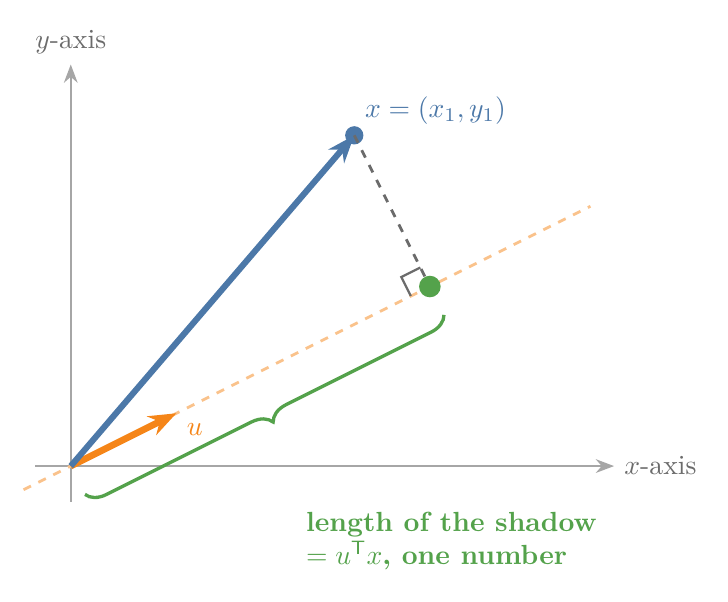
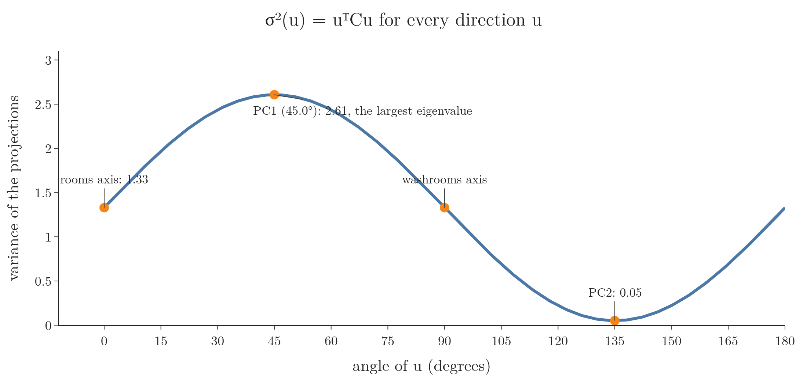
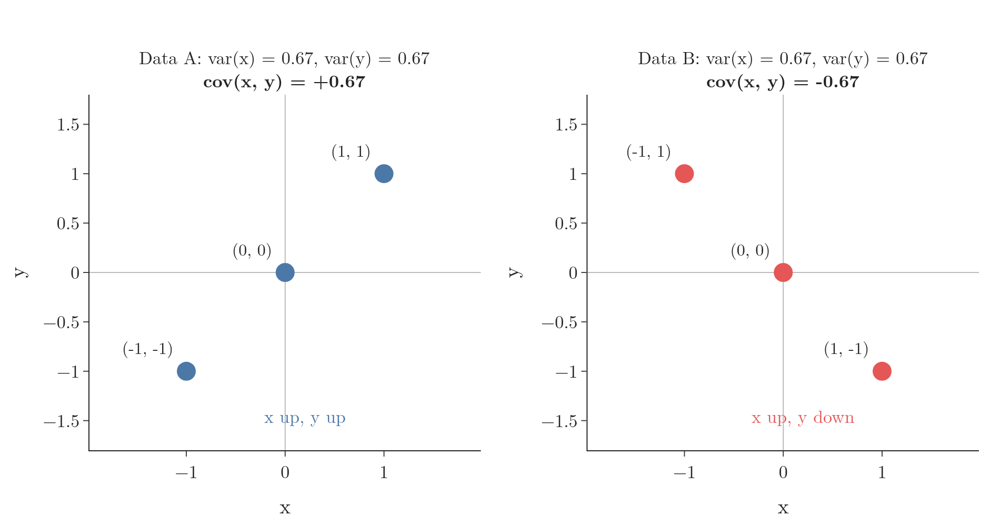
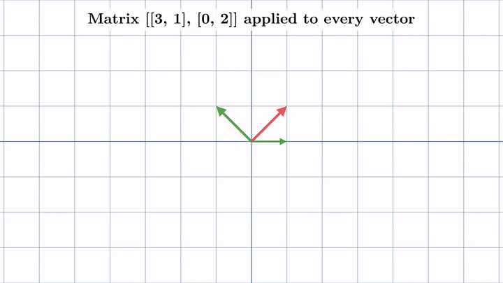
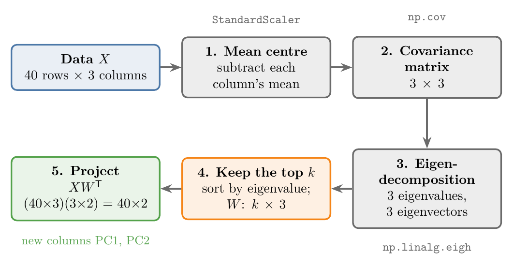
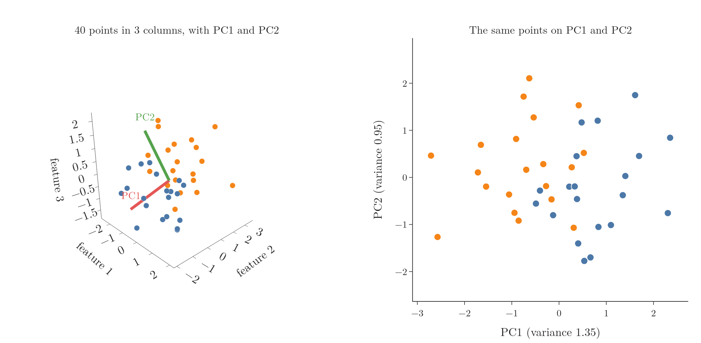
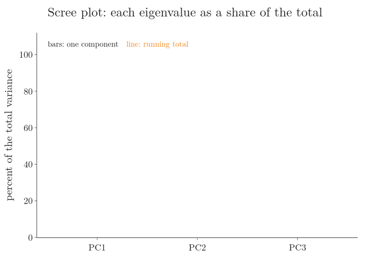

<!-- where-this-fits: generated by course_map/build_map.py; edit concepts.yaml, not this block -->
> **Where this fits:** Pipeline map steps 0 (Foundations), 3 (Understand data), 6 (Reduce dimensions). See the [Course map](../../../00-course-map/00-course-map.md).
>
> 
>
> - **Builds on:** Unsupervised learning ([Note ML-003](../../../ML/01-foundations/ML-003-types-of-ml/ML-003-types-of-ml.md)); Feature scaling ([Note ML-006](../../../ML/01-foundations/ML-006-instance-vs-model-based/ML-006-instance-vs-model-based.md)); Standardization ([Note ML-009](../../../ML/01-foundations/ML-009-mldlc/ML-009-mldlc.md)); Variance ([Note ML-018](../../../ML/02-getting-data/ML-018-understanding-your-data/ML-018-understanding-your-data.md)); Feature extraction ([Note ML-022](../../../ML/03-feature-engineering/ML-022-what-is-feature-engineering/ML-022-what-is-feature-engineering.md)); Curse of dimensionality ([Note ML-045](../../../ML/05-dimensionality/ML-045-curse-of-dimensionality/ML-045-curse-of-dimensionality.md)).
> - **Leads to:** Ordinary least squares (closed form) ([Note ML-050](../../../ML/06-regression/ML-050-linear-regression-maths/ML-050-linear-regression-maths.md)); Equation of a hyperplane ([Note ML-052](../../../ML/06-regression/ML-052-multiple-linear-regression/ML-052-multiple-linear-regression.md)); Support vector machines ([Note ML-086](../../../ML/07-classification/ML-086-svm-intuition/ML-086-svm-intuition.md)); Hessian and multivariate Taylor ([Note ML-120](../../../ML/08-trees-and-ensembles/ML-120-xgboost-maths/ML-120-xgboost-maths.md)); Cosine similarity ([Note MA-050](../../../MA/05-linear-algebra/MA-050-dot-product-and-cosine-similarity/MA-050-dot-product-and-cosine-similarity.md)); Matrix multiplication as composition ([Note MA-054](../../../MA/05-linear-algebra/MA-054-matrix-multiplication-as-composition/MA-054-matrix-multiplication-as-composition.md)).
> - **Compare with:** Correlation ([Note ML-020](../../../ML/02-getting-data/ML-020-bivariate-multivariate-analysis/ML-020-bivariate-multivariate-analysis.md)); Singular value decomposition ([Note MA-057](../../../MA/05-linear-algebra/MA-057-svd-geometry/MA-057-svd-geometry.md)); Low-rank approximation (truncated SVD) ([Note MA-059](../../../MA/05-linear-algebra/MA-059-low-rank-approximation/MA-059-low-rank-approximation.md)).
<!-- /where-this-fits -->

## 1. Overview

> **Key point:** PCA looks for the unit vector along which the projected data has the largest variance. The answer is the top eigenvector of the data's covariance matrix.

The previous Note built the idea of PCA geometrically: turn a line through the data, and keep the direction where the shadows spread the most. This Note turns that idea into mathematics and then into five concrete steps.

Many ML algorithms are, underneath, a mathematical problem with a goal to optimise, called the **objective function** (G-1372). This Note:

1. writes PCA's objective function (section 2);
2. learns the two tools its solution uses: the covariance matrix (section 3) and eigenvectors (section 4);
3. runs the five steps on real numbers (sections 5 and 6).

## 2. The problem PCA solves

> **Key point:** Project every point onto a unit vector $u$; PCA wants the $u$ that makes the variance of those projections as large as possible.

### 2.1 Projecting one point

> **Key point:** The projection of a point $x$ onto a unit vector $u$ is a single number, $u^{\mathsf T}x$.

Take data with two **features** (G-772) (input variables, the columns of the data table); each data point is one **observation** (G-1374) (one row). Each point has an $x$ and a $y$ value, so we can treat it as a **vector** (G-2081), an arrow from the origin to the point.

We want to project the point onto some line through the origin. Only the line's direction matters, not its length, so we describe it by a **unit vector** (G-2048) $u$: a vector of length 1 pointing along the line. Figure 1 shows a point $x$, a unit vector $u$, and the shadow of $x$ on the line.



In words: the length of the shadow is the **dot product** (G-634) of $u$ and $x$ (multiply matching components and add), divided by the length of $u$. Since $u$ has length 1, the division disappears.

$$\text{shadow length} = \frac{u \cdot x}{\lVert u \rVert} = u^{\mathsf T}x$$

With numbers: for $u = (0.894, 0.447)$, a unit vector, and the point $x = (2.4, 2.8)$:

$$u^{\mathsf T}x = 0.894 \times 2.4 + 0.447 \times 2.8 = 2.146 + 1.252 = 3.40$$

The point is now described by one number, 3.40, its position along the line. Two features have become one.

> **Extra:** $u^{\mathsf T}$ is $u$ written as a row instead of a column (its **transpose** (G-2012)). A row times a column is the dot product, so $u^{\mathsf T}x$ is just a compact way to write $u \cdot x$.

### 2.2 The variance of all the projections

> **Key point:** Projecting all $n$ points gives $n$ numbers; their variance tells us how much of the spread the direction $u$ keeps.

We project every point $x_1, x_2, \dots, x_n$ the same way and get $n$ numbers, $u^{\mathsf T}x_1, \dots, u^{\mathsf T}x_n$. Their mean is the projection of the mean point, $u^{\mathsf T}\bar{x}$.

In words: the variance of the projections is the average squared distance of each projection from the projected mean.

$$\sigma^2(u) = \frac{1}{n}\sum_{i=1}^{n}\left(u^{\mathsf T}x_i - u^{\mathsf T}\bar{x}\right)^2$$

With numbers: for the flats data of the previous Note (rooms and washrooms), this was 1.33 for $u$ along the rooms axis and 2.61 for $u$ at 45°.

### 2.3 The objective

> **Key point:** PCA's objective: among all unit vectors, find the $u$ with the largest $\sigma^2(u)$.

Any unit vector could be the answer, and each one gives a different variance. PCA wants the one with the most:

$$\text{find } u \text{ with } \lVert u \rVert = 1 \text{ that makes } \sigma^2(u) \text{ as large as possible}$$

Figure 2 draws $\sigma^2(u)$ for every direction on the flats data. The curve is highest, 2.61, at 45 degrees, and lowest, 0.05, at right angles to it: the two principal components of the previous Note. Section 4 shows that the peak sits at the top eigenvector of the covariance matrix, and its height is the largest eigenvalue.

{height=34%}

This maximisation is PCA's objective function. Solving the maximisation needs optimisation methods covered later; here we jump to the answer. To understand the answer, we need two ideas first: covariance and eigenvectors.

> **Extra:** The standard derivation rewrites $\sigma^2(u)$ as $u^{\mathsf T} C u$, where $C$ is the covariance matrix of Section 3. Maximising $u^{\mathsf T} C u$ under the condition $u^{\mathsf T}u = 1$ (with a method called Lagrange multipliers) gives exactly $C u = \lambda u$: the eigenvector equation of Section 4 (Bishop, §12.1.1).

## 3. Covariance and the covariance matrix

> **Key point:** Variance describes the spread along one feature. Covariance describes how two features move together. The covariance matrix holds both for every feature and every pair.

### 3.1 What variance cannot see

> **Key point:** Two datasets can have identical variances in every feature and still point in opposite directions.

Variance is computed one feature at a time. Variance says how spread out $x$ is and how spread out $y$ is, but nothing about how $x$ and $y$ relate. Figure 3 shows two tiny datasets.



- **Data A:** $(-1, -1), (0, 0), (1, 1)$.
- **Data B:** $(-1, 1), (0, 0), (1, -1)$.

In both, $x$ has variance 0.67 and $y$ has variance 0.67. Yet in A the points rise from left to right, and in B they fall. Variance alone cannot tell them apart.

### 3.2 Covariance

> **Key point:** Covariance is positive when two features rise together and negative when one rises as the other falls.

In words: for each point, multiply its distance from the mean in $x$ by its distance from the mean in $y$, then average these products.

$$\mathrm{cov}(x, y) = \frac{1}{n}\sum_{i=1}^{n}(x_i - \bar{x})(y_i - \bar{y})$$

With numbers: in both datasets the means are 0.

$$\text{Data A: } \frac{(-1)(-1) + (0)(0) + (1)(1)}{3} = \frac{2}{3} \approx +0.67$$

$$\text{Data B: } \frac{(-1)(1) + (0)(0) + (1)(-1)}{3} = -\frac{2}{3} \approx -0.67$$

The sign tells the direction of the relationship: positive in A, where $x$ and $y$ go up together, negative in B, where one goes up as the other goes down.

> **Extra:** Correlation (from the Note on understanding data) is covariance divided by the two standard deviations. Dividing squeezes correlation into the range $-1$ to $+1$. Covariance has no fixed range: its size depends on the units of the columns.

### 3.3 The covariance matrix

> **Key point:** The covariance matrix puts each feature's variance on the diagonal and each pair's covariance off the diagonal. The matrix describes both the spread and the orientation of the data.

For data with features $x$, $y$ and $z$, the **covariance matrix** (G-495) is the $3 \times 3$ table in Figure 4. With $d$ features, it is $d \times d$.


- **The diagonal** holds the variance of each feature. The covariance of a feature with itself is its variance: $\mathrm{cov}(x, x) = \mathrm{var}(x)$.
- **Off the diagonal** sit the covariances of each pair of features.
- **It is symmetric:** $\mathrm{cov}(x, y) = \mathrm{cov}(y, x)$, so the part above the diagonal mirrors the part below.

Variances plus covariances make the covariance matrix a complete summary for PCA. The diagonal gives the spread along each axis; the off-diagonal entries give the orientation of the cloud.

For the flats data (rooms and washrooms):

$$C = \begin{pmatrix} 1.33 & 1.28 \cr1.28 & 1.33 \end{pmatrix}$$

Both features have variance 1.33, and their large positive covariance, 1.28, says they rise together.

## 4. Eigenvectors and eigenvalues

> **Key point:** A matrix moves vectors around. Its eigenvectors are the special vectors it only stretches or shrinks, without turning them.

### 4.1 A matrix is a transformation

> **Key point:** Multiplying by a matrix moves every point of the plane: it can rotate, stretch, squash or shear the whole grid.

Think of a matrix as an action on the whole plane. Every point, seen as a vector, is multiplied by the matrix and lands somewhere new. Straight grid lines stay straight and evenly spaced, but the grid can be turned, stretched or slanted. Such a change is called a **linear transformation** (G-1097).

The **identity matrix** (G-915) $\begin{pmatrix} 1 & 0 \cr0 & 1 \end{pmatrix}$ leaves every vector where it was. Any other matrix moves vectors.

### 4.2 The vectors that do not turn

> **Key point:** An eigenvector keeps its direction under the transformation; its eigenvalue is how much it is stretched.

Figure 5 applies the matrix $A = \begin{pmatrix} 3 & 1 \cr0 & 2 \end{pmatrix}$ to the whole plane and follows three vectors.



1. $(1, 1)$ (red) becomes $(4, 2)$: its direction changes.
2. $(1, 0)$ (green) becomes $(3, 0)$: same line, 3 times longer.
3. $(-1, 1)$ (green) becomes $(-2, 2)$: same line, 2 times longer.

Think of pulling a rubber sheet sideways: arrows drawn on it mostly tilt, but an arrow drawn exactly along the pull just gets longer. Vectors that stay on their own line are the **eigenvectors** (G-666) of the matrix. The factor by which each one is stretched is its **eigenvalue** (G-665): 3 for $(1, 0)$ and 2 for $(-1, 1)$. A $2 \times 2$ matrix has at most two eigenvector directions, a $3 \times 3$ matrix at most three, and so on. Some have fewer (a rotation turns every vector, so it has none), but a covariance matrix always has the full number (Section 4.3, Extra).

In words: applying the matrix to an eigenvector is the same as multiplying it by a plain number, its eigenvalue.

$$A v = \lambda v$$

With numbers, for $v = (-1, 1)$:

$$\begin{pmatrix} 3 & 1 \cr0 & 2 \end{pmatrix}\begin{pmatrix} -1 \cr1 \end{pmatrix} = \begin{pmatrix} 3 \times (-1) + 1 \times 1 \cr0 \times (-1) + 2 \times 1 \end{pmatrix} = \begin{pmatrix} -2 \cr2 \end{pmatrix} = 2 \begin{pmatrix} -1 \cr1 \end{pmatrix}$$

so $\lambda = 2$. An eigenvalue can also be negative (the vector flips to point the other way) or between 0 and 1 (it shrinks).

NumPy finds the eigenvectors for us (Section 6). The [eigenvectors Note](../../../MA/05-linear-algebra/MA-056-eigenvectors-and-eigenvalues/MA-056-eigenvectors-and-eigenvalues.md) shows how to find them by hand.

### 4.3 The eigenvectors of the covariance matrix

> **Key point:** The eigenvector of the covariance matrix with the largest eigenvalue points along the greatest spread of the data. That eigenvector is PC1, and its eigenvalue is the variance along it.

The top eigenvector of the covariance matrix solves PCA's objective from Section 2 (Bishop, §12.1.1). Use the covariance matrix as the transformation and find its eigenvectors:

- The eigenvector with the **largest eigenvalue** points in the direction of greatest variance. That eigenvector is the first principal component.
- Its **eigenvalue** equals the variance of the data projected onto it.
- The next eigenvector (next largest eigenvalue) is PC2, at right angles to PC1, and so on.

Figure 6 checks this on the flats data.


The covariance matrix $\begin{pmatrix} 1.33 & 1.28 \cr1.28 & 1.33 \end{pmatrix}$ has eigenvectors $(0.707, 0.707)$ and $(-0.707, 0.707)$, with eigenvalues 2.61 and 0.05.

The first eigenvector points at 45°, exactly the direction the previous Note found by turning a line and measuring. Its eigenvalue, 2.61, is the variance we measured there. The second has eigenvalue 0.05, the small spread left at right angles.

So instead of trying every angle, PCA computes the eigenvectors of one matrix. The eigenvector method works the same way with 3, 10 or 1,000 features.

> **Extra:** A covariance matrix is symmetric, and a symmetric $d \times d$ matrix always has $d$ eigenvectors at right angles to each other (Strang, §6.4). Its eigenvalues are never negative, because each one is a variance: for an eigenvector $u$, $\lambda = u^{\mathsf T} C u$, the variance of the projections onto $u$ (Section 2.3, Extra). These two facts make the principal components a proper new set of axes.

## 5. PCA in five steps

> **Key point:** Centre the data, build the covariance matrix, find its eigenvectors, keep the top $k$, and project the data onto them.

Figure 7 summarises the whole method, with the shapes for data of 40 observations and 3 features reduced to 2.



1. **Mean centring** (G-1195). Subtract each feature's mean, so the data is centred on the origin.
2. **Covariance matrix.** Compute it from the centred data: $3 \times 3$ for 3 features.
3. **Eigen-decomposition** (G-663). Find the eigenvalues and eigenvectors of the covariance matrix: 3 of each for 3 features.
4. **Keep the top $k$.** Sort the eigenvectors by eigenvalue, largest first. Keep the first $k$ as the rows of a matrix $W$ ($k \times 3$). Choosing $k = 2$ goes from 3D to 2D; $k = 1$ goes to 1D.
5. **Project.** Multiply the data by $W^{\mathsf T}$.

### 5.1 The projection step

> **Key point:** Projecting all points at once is one matrix multiplication: $X W^{\mathsf T}$.

In words: each point's new coordinates are its dot products with each kept eigenvector, as in Section 2.1. Doing this for all points at once is a matrix product.

$$Z = X W^{\mathsf T}$$

With shapes: $X$ has 40 rows and 3 columns; $W^{\mathsf T}$ has 3 rows and 2 columns. The inner sizes (3 and 3) match, and the result $Z$ has 40 rows and 2 columns: the new features PC1 and PC2.

For 1D instead, $W$ has one row, $W^{\mathsf T}$ is $3 \times 1$ and $Z$ is $40 \times 1$. The **target** (G-1949) (the output we predict), if there is one, is copied across unchanged: PCA only transforms the inputs.

> **Extra:** Mean centring matters for the projection, not for the components. `np.cov` centres the data internally, so the covariance matrix and the principal components are the same either way. The projection $XW^{\mathsf T}$, though, only gives centred coordinates if $X$ itself was centred. scikit-learn's `PCA` always centres for us.

## 6. PCA by hand in Python

> **Key point:** The five steps take a few lines of NumPy, and the result matches scikit-learn's PCA.

The example data has 40 points with 3 features, in two classes of 20. Each class is a cloud of points drawn at random around its own centre: $(0, 0, 0)$ for one class and $(1, 1, 1)$ for the other.

> **Python:** Steps 1 to 3.
>
> ```python
> from sklearn.preprocessing import StandardScaler
>
> # step 1: centre (StandardScaler also scales each column)
> X = StandardScaler().fit_transform(df[cols])
> # step 2: covariance matrix; np.cov wants columns as rows
> C = np.cov(X.T)
> # step 3: eigh is made for symmetric matrices
> values, vectors = np.linalg.eigh(C)
> ```

The covariance matrix is

$$C = \begin{pmatrix} 1.026 & 0.205 & 0.080 \cr0.205 & 1.026 & 0.198 \cr0.080 & 0.198 & 1.026 \end{pmatrix}$$

All three features have about the same variance, and the covariances are small and positive. The eigenvalues are 1.354, 0.946 and 0.778.

> **Python:** Steps 4 and 5.
>
> ```python
> # sort largest eigenvalue first
> order = np.argsort(values)[::-1]
> values, vectors = values[order], vectors[:, order]
> # eigenvectors are the COLUMNS: take the first 2 columns
> W = vectors[:, :2].T          # shape (2, 3)
> Z = X @ W.T                   # (40, 3) @ (3, 2) = (40, 2)
> ```



Figure 8 shows the result. On the left, the 3D data with the two principal components drawn through it. On the right, the same 40 points described by just PC1 and PC2.

PC1 holds 44% of the total variance and PC2 31%, so the 2D picture keeps 75% of the spread. The two classes stay mostly apart along PC1.

### 6.1 Reading the result: the recipe and the scree plot

> **Key point:** An eigenvector is a recipe: how much of each original feature goes into the new one. An eigenvalue divided by the sum of all eigenvalues is the share of the variance that component keeps.

**The recipe.** Each new feature is a weighted sum of the old ones, a **linear combination** (G-1091), and the weights are the entries of the eigenvector. These weights are called **loadings** (G-2204) (or loading scores).

1. **Flats.** PC1 is $(0.707, 0.707)$, so the position of a flat along PC1 is $0.707 \times \text{rooms} + 0.707 \times \text{washrooms}$ (after centring). The recipe uses equal parts of both features: PC1 is a "size of the flat" feature.
2. **The 3-feature example.** PC1 is $(0.54, 0.66, 0.53)$ (NumPy prints it with every sign flipped, which is the same line), so all three features go in with about the same weight. PC2 is $(-0.69, -0.01, 0.72)$: feature 3 minus feature 1, with almost nothing of feature 2.

A feature with a loading near 0 hardly matters for that component; a feature with a large loading (positive or negative) matters a lot.

**The scree plot.** Each eigenvalue is the variance along its component (Section 4.3), and together the eigenvalues add up to the total variance. So the share kept by one component is its eigenvalue divided by the sum:

$$\text{share of PC1} = \frac{1.354}{1.354 + 0.946 + 0.778} = \frac{1.354}{3.077} = 0.44$$

A bar chart of these shares, one bar per component, is called a **scree plot** (G-2205). Figure 9 builds it for the example: 44, 31 and 25 percent. The orange line adds the bars up: PC1 and PC2 together keep 75 percent, which is the number quoted under Figure 8.

{height=38%}

The [PCA on MNIST Note](../ML-048-pca-mnist/ML-048-pca-mnist.md) uses the same shares, there called the explained variance ratio, to choose how many components to keep.

> **Extra:** A frequent bug: `np.linalg.eig` and `np.linalg.eigh` return the eigenvectors as the **columns** of the result, not its rows. Writing `vectors[0:2]` takes two rows, which are not principal components; along them the data's variance is 1.01 and 1.11 instead of 1.35 and 0.95. `eig` also does not sort its output by eigenvalue. Always sort, and take `vectors[:, :k]`.

> **Python:** The same result from scikit-learn.
>
> ```python
> from sklearn.decomposition import PCA
>
> pca = PCA(n_components=2)
> Z_sk = pca.fit_transform(X)
> pca.explained_variance_        # [1.354, 0.946]: the eigenvalues
> pca.explained_variance_ratio_  # [0.44, 0.307]: share of the variance
> ```
>
> The columns of `Z_sk` equal those of `Z`, possibly with the sign flipped: an eigenvector and its negative lie on the same line.

> **Extra:** `np.cov` and scikit-learn divide by $n - 1$, not by $n$ as in the formulas above, which is why the diagonal of $C$ is 1.026 and not 1. Dividing by $n - 1$ only scales every eigenvalue by $n/(n-1)$; the eigenvectors stay the same.

## 7. Summary

| Step | What it does | Tool |
|---|---|---|
| 1. Mean centre | moves the data's centre to the origin | `StandardScaler` (or subtract the mean) |
| 2. Covariance matrix | spread (diagonal) and orientation (off-diagonal) | `np.cov` |
| 3. Eigen-decomposition | directions that only stretch, and by how much | `np.linalg.eigh` |
| 4. Keep the top $k$ | sort by eigenvalue; the first $k$ are kept | `np.argsort` |
| 5. Project | new coordinates $Z = XW^{\mathsf T}$ | `@` (matrix product) |

- PCA's objective: the unit vector $u$ that maximises the variance of the projections $u^{\mathsf T}x_i$.
- Covariance shows how two features move together; its sign gives the direction.
- The covariance matrix: variances on the diagonal, covariances off it, symmetric.
- Eigenvectors keep their direction under a matrix; eigenvalues are their stretch, $Av = \lambda v$.
- The covariance matrix's top eigenvector is PC1; its eigenvalue is the variance along PC1.
- Eigenvectors are the columns of NumPy's output: sort them and take `vectors[:, :k]`.
- An eigenvector's entries (loadings) are the recipe of the new feature; eigenvalue ÷ sum of eigenvalues is the share of variance it keeps (scree plot).


## 8. Sources

**Built from**

- CampusX, "Principle Component Analysis (PCA) | Part 2 | Problem Formulation and Step by Step Solution", YouTube, https://www.youtube.com/watch?v=tXXnxjj2wM4

- Sanderson, G. (3Blue1Brown), "Eigenvectors and eigenvalues | Chapter 14, Essence of linear algebra", YouTube, https://www.youtube.com/watch?v=PFDu9oVAE-g (the matrix and picture of section 4.2)
- StatQuest with Josh Starmer, "StatQuest: Principal Component Analysis (PCA), Step-by-Step", YouTube, https://www.youtube.com/watch?v=FgakZw6K1QQ (the recipe reading of an eigenvector, loading scores and the scree plot of section 6.1)

**Other references**

- Bishop, C. M. (2006). *Pattern Recognition and Machine Learning*, Section 12.1.1, "Maximum variance formulation". Springer.
- Strang, G. (2016). *Introduction to Linear Algebra*, 5th edition, Section 6.4, "Symmetric matrices". Wellesley-Cambridge Press.

## 9. Key terms

| Term | Meaning |
|---|---|
| Objective function | The quantity an algorithm tries to make as large or as small as possible |
| Vector | A point seen as an arrow from the origin, with a direction and a length |
| Unit vector | A vector of length 1, used to describe a direction |
| Dot product | Multiply matching components of two vectors and add; $u^{\mathsf T}x$ |
| Transpose | A matrix or vector with rows and columns swapped |
| Covariance | How two features move together: positive if they rise together, negative if not |
| Covariance matrix | A square table of all variances (diagonal) and covariances (off-diagonal) of the features |
| Linear transformation | A change of the whole plane by a matrix that keeps grid lines straight and evenly spaced |
| Identity matrix | The matrix that leaves every vector unchanged |
| Eigenvector | A vector that a matrix only stretches or shrinks, without turning it |
| Eigenvalue | The factor by which a matrix stretches its eigenvector |
| Eigen-decomposition | Finding all the eigenvalues and eigenvectors of a matrix |
| Explained variance | The variance along a principal component; its eigenvalue |
| Loading (loading score) (G-2204) | One entry of an eigenvector: the weight of one original feature in a principal component |
| Scree plot (G-2205) | A bar chart of each component's share of the total variance (eigenvalue ÷ sum of eigenvalues) |
