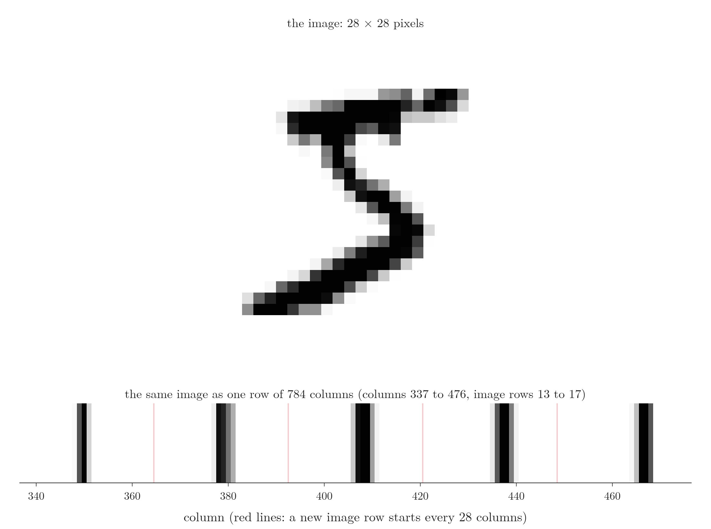
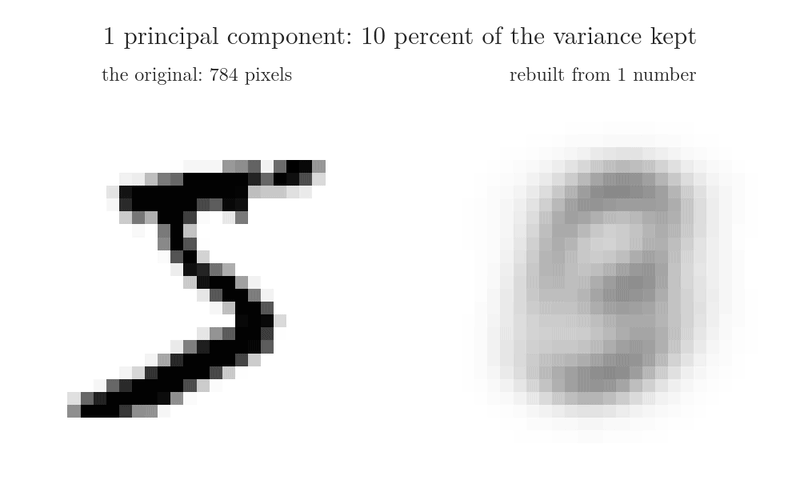
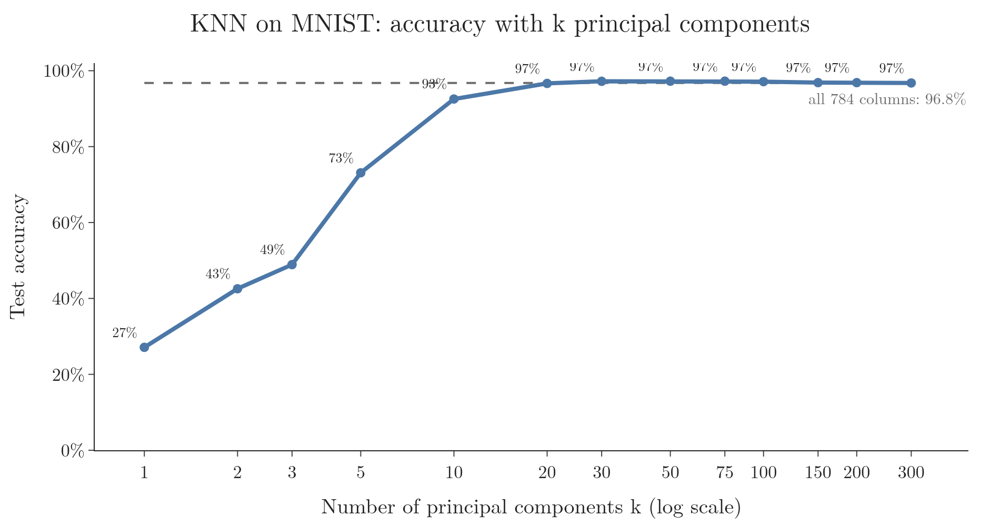
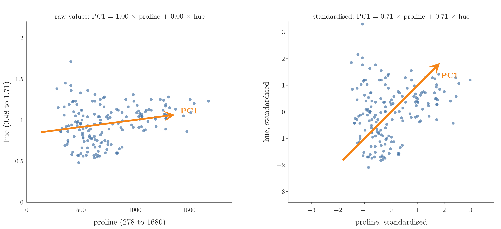
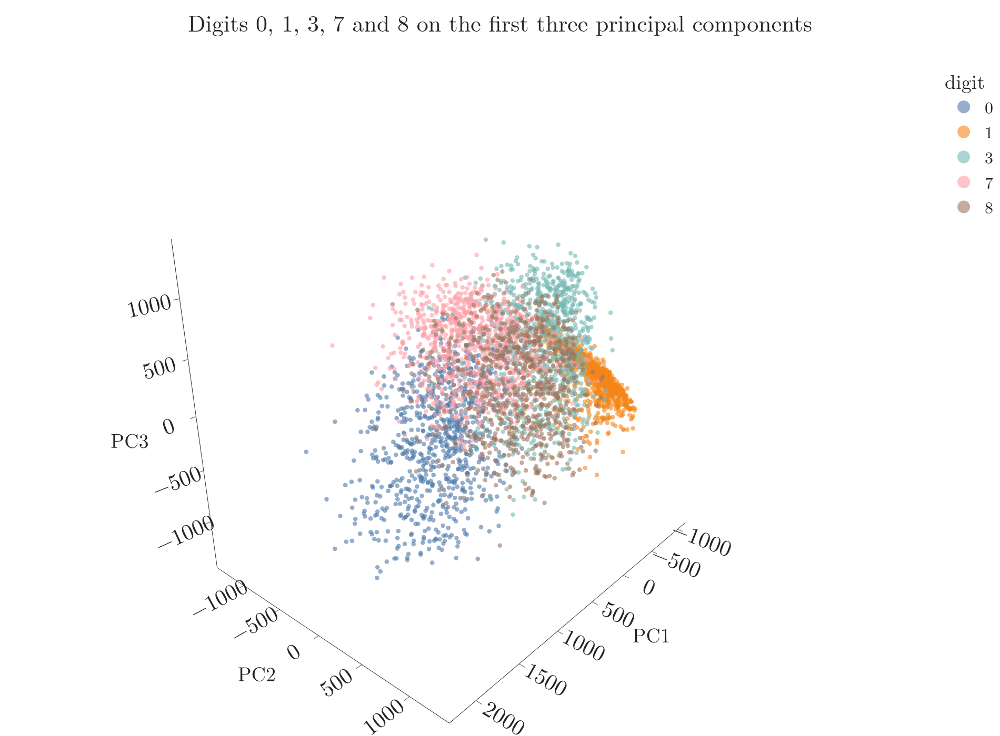
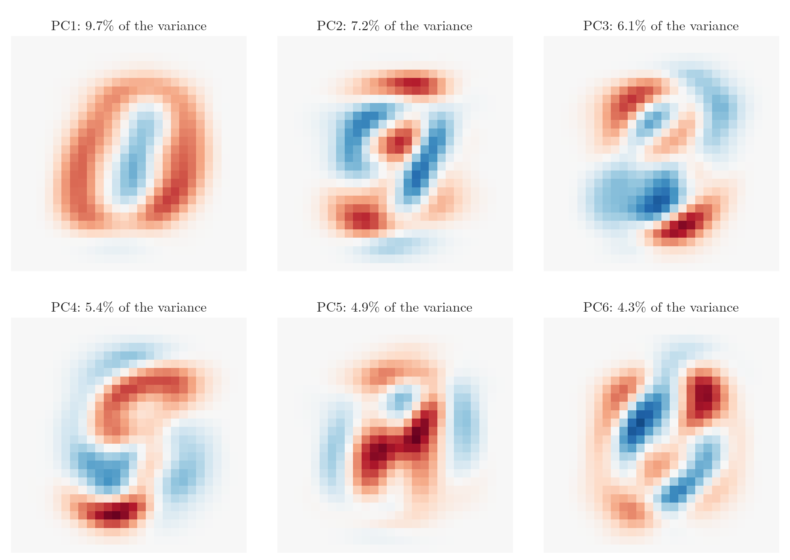
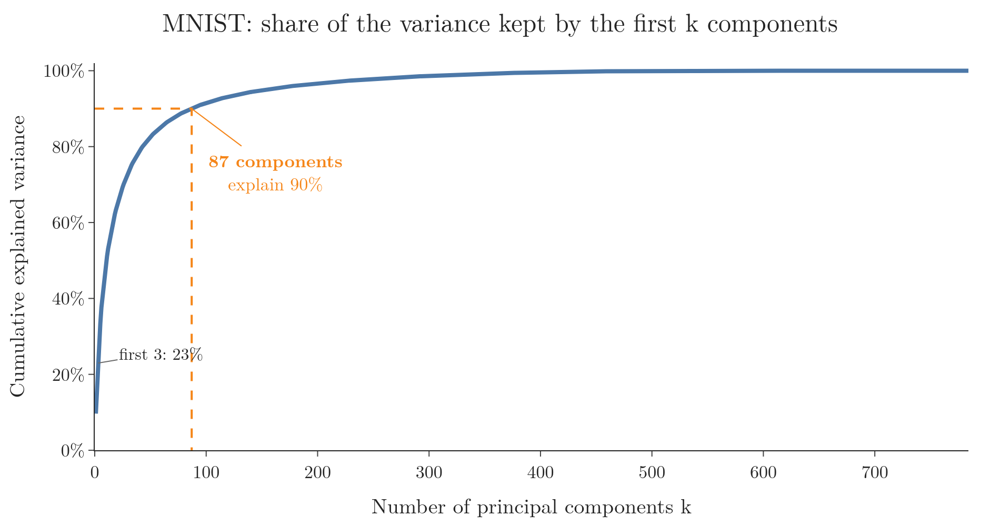
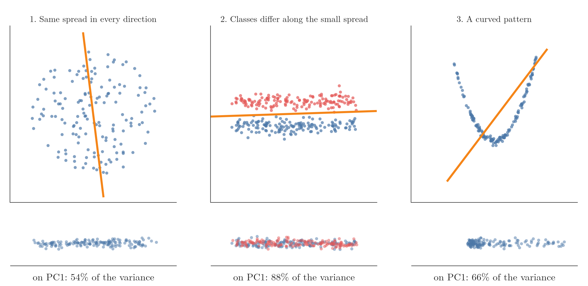

<!-- where-this-fits: generated by course_map/build_map.py; edit concepts.yaml, not this block -->
> **Where this fits:** Pipeline map step 6 (Reduce dimensions). See the [Course map](../../../00-course-map/00-course-map.md).
>
> 
>
> - **Builds on:** Unsupervised learning ([Note ML-003](../../../ML/01-foundations/ML-003-types-of-ml/ML-003-types-of-ml.md)); Feature scaling ([Note ML-006](../../../ML/01-foundations/ML-006-instance-vs-model-based/ML-006-instance-vs-model-based.md)); Standardization ([Note ML-009](../../../ML/01-foundations/ML-009-mldlc/ML-009-mldlc.md)); Variance ([Note ML-018](../../../ML/02-getting-data/ML-018-understanding-your-data/ML-018-understanding-your-data.md)); Feature extraction ([Note ML-022](../../../ML/03-feature-engineering/ML-022-what-is-feature-engineering/ML-022-what-is-feature-engineering.md)); Curse of dimensionality ([Note ML-045](../../../ML/05-dimensionality/ML-045-curse-of-dimensionality/ML-045-curse-of-dimensionality.md)).
> - **Compare with:** Low-rank approximation (truncated SVD) ([Note MA-059](../../../MA/05-linear-algebra/MA-059-low-rank-approximation/MA-059-low-rank-approximation.md)).
<!-- /where-this-fits -->

## 1. Overview

> **Key point:** On real image data, PCA cuts 784 features to 50 and KNN gets slightly *more* accurate and much faster. PCA also lets us see the data in 2D and 3D.

A **feature** (G-772) is an input variable (one column of the data table), an **observation** (G-1374) is one record (one row), and the **target** (G-1949) is the output we predict. Here each observation is one image, each feature one pixel, and the target the digit.

The previous two Notes built PCA from the geometry and the mathematics. This Note uses scikit-learn's `PCA` on a real dataset of handwritten digits, for PCA's two main jobs:

1. **Fewer features:** train a model on a few principal components instead of every pixel, and compare accuracy and speed (Sections 3 and 4).
2. **Visualisation:** squeeze the data into 2 or 3 features and plot it (Section 5).

Then we answer two practical questions. How many components should we keep (Section 7)? And when does PCA not help at all (Section 8)?

## 2. The MNIST data

> **Key point:** Each image is 28 × 28 pixels, stored as one row of 784 columns plus a label from 0 to 9.

**MNIST** (G-1249) is a well-known set of images of handwritten digits, 0 to 9. Each image is 28 × 28 = 784 grey pixels, and each pixel's brightness runs from 0 (white) to 255 (black).

To put images in a table, each image becomes one row with one column per pixel: the first 28 columns are the top row of the image, the next 28 the second row, and so on. One more column holds the label, the digit the image shows. Reshaping a row back into 28 × 28 shows the picture again (Figure 1).

{height=42%}

We use 42,000 images and split them 80/20: 33,600 for training and 8,400 for testing. The task is **classification** (G-395): from the 784 pixel values, predict the digit.

> **Extra:** The images here come from the full MNIST set on OpenML (70,000 images), loaded with `fetch_openml("mnist_784")`. We take a random 42,000, the same size as the Digit Recognizer competition file on Kaggle, which is also drawn from MNIST and needs a Kaggle account to download.

> **Python:** Loading the data and splitting it.
>
> ```python
> from sklearn.datasets import fetch_openml
> from sklearn.model_selection import train_test_split
>
> X, y = fetch_openml("mnist_784", version=1,
>                     return_X_y=True, as_frame=False)
> # (a random 42,000 rows are kept; see the Notebook)
> X_train, X_test, y_train, y_test = train_test_split(
>     X, y, test_size=0.2, random_state=2)
> ```

## 3. KNN on all 784 features

> **Key point:** KNN reaches 96.8% on the raw pixels, but each prediction compares the image with 33,600 others across 784 features, which is slow.

We first train **KNN** (G-998) (K-nearest neighbours) with its default of 5 neighbours on all 784 features. To classify a test image, KNN computes its distance to every one of the 33,600 training images and takes the most common label among the 5 nearest.

The result: **96.8% accuracy**, but each of the 8,400 test images needs 33,600 distances in 784 dimensions. On an idle machine the run took about 19 seconds. The heavy arithmetic is the computation problem of the curse of dimensionality (Note ML-045).

## 4. KNN on principal components

> **Key point:** Fit PCA on the training set, transform both sets, then train the same KNN on the new features.

### 4.1 The steps

> **Key point:** PCA learns its components from the training set only, like a scaler, and then transforms both sets.

PCA in scikit-learn follows the same fit and transform pattern as scalers and encoders:

1. **Fit** `PCA` on the training set: it centres the pixels, computes the covariance matrix and its eigenvectors.
2. **Transform** both sets: project every image onto the kept components.
3. **Train KNN** on the transformed training set and test it on the transformed test set.

We do not standardise the pixels first. All 784 pixels share one unit, brightness from 0 to 255, and when features are measured in the same units there is no need to scale them before PCA (ISL §12.2.4). Section 4.3 shows what standardising would cost here.

The parameter `n_components` sets how many components to keep. Left as `None`, it keeps all of them, 784 here. The number of components can never exceed the number of features or the number of observations, whichever is smaller (scikit-learn `PCA` docs).

> **Python:** KNN on 50 principal components.
>
> ```python
> from sklearn.decomposition import PCA
> from sklearn.neighbors import KNeighborsClassifier
>
> pca = PCA(n_components=50).fit(X_train)   # train only
> Z_train = pca.transform(X_train)          # (33600, 50)
> Z_test = pca.transform(X_test)            # (8400, 50)
>
> knn = KNeighborsClassifier(n_neighbors=5).fit(Z_train, y_train)
> knn.score(Z_test, y_test)                 # 0.973
> ```

With 50 components the accuracy is **97.3%**, slightly above the 96.8% on all 784 pixels. Each distance now uses 50 numbers instead of 784, about 16 times less arithmetic; on an idle machine the run took about 1 second. We dropped 734 of the 784 features and lost nothing. Like a summary of a long report, the 50 components keep what matters and leave out the repetition: neighbouring pixels mostly move together, so a few combinations describe them well.

Figure 2 shows what "keep what matters" looks like. It rebuilds one image, the 5 of Figure 1, from only its first $k$ component values. With 1 component the result is a grey blur; with 20 the 5 is recognisable; with 50 it is clear, and the remaining 734 numbers add only small details.



### 4.2 Accuracy as k grows

> **Key point:** Accuracy climbs steeply over the first 20 components, peaks around 30 to 75, and then slowly drifts back to the all-pixel level.

How many components do we need? Figure 3 repeats the experiment for k from 1 to 300 components.



| k | 1 | 2 | 3 | 5 | 10 | 20 | 50 | 100 | 300 |
|---|---|---|---|---|---|---|---|---|---|
| Accuracy | 27% | 43% | 49% | 73% | 93% | 96.7% | 97.3% | 97.1% | 96.8% |

- **1 to 20 components:** each one adds a lot; the first components carry the most information.
- **30 to 75:** the best range, 97.2% to 97.3%, above the 96.8% of all 784 pixels.
- **Above 100:** accuracy drifts back down towards 96.8%. The later components add small differences between images that do not help KNN find the right neighbours (see the Extra below).

So 50 components, 6% of the original features, give the best result in this run.

> **Extra:** Are the later components useful? Components 51 to 784 alone give 54%, so they hold a little information. Next to the first 50, though, they act like noise for KNN: shuffling each of them across images (same spread, no link to the label) leaves accuracy unchanged, 96.8% real against 97.0% shuffled. Components 101 to 300 behave the same way (97.1% with shuffled ones). Dropping them removes small, unhelpful differences, which is why 50 components beat all 784 pixels.

### 4.3 What standardising would do

> **Key point:** Standardising every pixel first lowers accuracy, to 94.0% on all pixels and 95.4% with 50 components.

Standardising (Note ML-023) gives every pixel mean 0 and standard deviation 1. For images that is harmful. A pixel near the edge is blank in almost every image; standardising stretches its rare small changes to the same size as the busy centre pixels, so they disturb the distances KNN measures.

| Setup | Accuracy |
|---|---|
| Raw pixels, all 784 | 96.8% |
| Raw pixels, PCA 50 | **97.3%** |
| Standardised, all 784 | 94.0% |
| Standardised, PCA 50 | 95.4% |

Standardising is still the right step when the features are on different scales. Figure 4 shows why, on two features of scikit-learn's wine data (178 wines): proline, which runs from 278 to 1,680, and hue, which runs from 0.48 to 1.71.



- **Raw values (left):** PC1 is made of proline alone (weights 1.00 for proline and 0.00 for hue). PCA looks for variance, and proline's standard deviation is 314 against 0.23 for hue. PC1 is simply the feature with the biggest numbers; hue is ignored.
- **Standardised (right):** both features now have standard deviation 1, and PC1 takes 0.71 of proline and 0.71 of hue: equal parts of each.

The rule: standardise before PCA when the features are on different scales or in different units; do not when they already share one scale, as pixels do.

> **Extra:** The rarely used pixels are the main culprit. Dropping the pixels that are non-zero in fewer than 5% of the training images, then standardising the rest, gives 95.9%, so most of the loss comes back (Notebook, last cell). Standardising remains the right step when features are in different units, such as age in years and income in rupees.

## 5. Visualising the digits

> **Key point:** With 2 or 3 components we can draw all 784-dimensional images as points and see which digits sit apart and which overlap.

PCA's second job is visualisation. We cannot plot 784 dimensions, but we can plot the first 2 or 3 principal components.

### 5.1 In 2D

> **Key point:** In 2D the digits overlap heavily, but some groups are already visible: 1s on one side, 0s on the other.

Figure 5 shows the 8,400 test images on PC1 and PC2, coloured by their label.

{height=55%}

The colours overlap a lot. Still, a pattern shows. The 1s (orange) form a tight group on the left and the 0s (blue) spread out on the right. PC1 roughly measures how much ink a digit uses. A 1 is a single thin stroke (85 inked pixels on average); a 0 is a big loop (191). In the Notebook, PC1 and the number of inked pixels have a correlation of 0.86.

### 5.2 In 3D

> **Key point:** A third component separates more digits. Similar-looking digits stay mixed.

Figure 6 adds PC3 and shows five digits only, to keep the picture readable.

{height=60%}

- **0 and 1** sit at opposite ends of PC1: a big loop against a thin stroke.
- **3** rises along PC3, away from the others.
- **8** sits in the middle, mixed with 3 and 7.

In the Notebook this plot is interactive: we can turn it, zoom, and click digits in the legend to hide or show them. Turning it shows other close groups: 4, 7 and 9 share the same low PC2 values (average about $-570$ each).

## 6. What a fitted PCA stores

> **Key point:** `explained_variance_` holds the eigenvalues, `components_` holds the eigenvectors, and `explained_variance_ratio_` holds each component's share of the variance.

After `fit`, a `PCA` object keeps the results of its eigen-decomposition (from the previous Note):

| Attribute | What it holds | For 3 components on MNIST |
|---|---|---|
| `explained_variance_` (G-729) | the **eigenvalues** (G-665), largest first | 331,121, 245,937, 211,045 |
| `components_` (G-430) | the **eigenvectors** (G-666), one per row | shape (3, 784) |
| `explained_variance_ratio_` | each eigenvalue divided by the sum of all | 9.7%, 7.2%, 6.2% |

The eigenvalues are large because the pixels run from 0 to 255, so their variances are in the thousands. In words, an eigenvalue is the variance of the data along its component's direction: the first component spreads the images by a variance of 331,121, the second by 245,937. Each eigenvector has 784 numbers, one per pixel, because it is a direction in the 784-dimensional pixel space; the number for a pixel is the weight that pixel gets in the component, and the 784 squared weights add up to 1 (the direction has length 1). So one row of `components_` has shape (784,), and the three rows together have shape (3, 784). Reshaped to 28 × 28, each one is itself a picture: it shows which pixels that component combines. Figure 7 draws the first six, fitted on all 70,000 MNIST images. PC1 looks like a 0: its red ring and blue centre add up the ink of a round digit and subtract the ink of a thin, central one such as a 1, so a 0 scores high and a 1 scores low on PC1. Measured on all 70,000 images, the average PC1 score is about 1,000 for the 0s and about −840 for the 1s, the two extremes of the ten digits.

{height=48%}

The first three components together hold only 23% of the variance. So little variance explains why the 2D and 3D pictures overlap so much: they show only a small part of what makes the images different.

## 7. How many components to keep

> **Key point:** Add up the explained variance ratios from the largest down, and keep enough components to reach about 90% of the variance.

### 7.1 Explained variance

> **Key point:** Each eigenvalue, divided by the sum of all eigenvalues, is the share of the data's variance that its component explains.

Each eigenvalue $\lambda_i$ is the variance along component $i$. The total variance of the data is the sum of all of them.

In words: the share of variance a component explains is its eigenvalue divided by the sum of all eigenvalues.

$$r_i = \frac{\lambda_i}{\lambda_1 + \lambda_2 + \dots + \lambda_d}$$

Here $r_i$ is the explained variance ratio of component $i$.

Here $\lambda_i$ is the eigenvalue of component $i$ (its variance) and $d$ is the number of components (784 for all of them).

With numbers: on MNIST the 784 eigenvalues add up to about 3,429,600. PC1's eigenvalue is 331,121, so

$$\frac{331{,}121}{3{,}429{,}600} \approx 0.097 = 9.7\ \text{percent}$$

### 7.2 The cumulative curve and the 90% rule

> **Key point:** On MNIST, 87 components explain 90% of the variance.

Adding up the ratios in order gives the **cumulative explained variance** (G-516): the share kept by the first $k$ components. Figure 8 plots it for every $k$.



The curve rises fast and then flattens towards 100%. A common rule of thumb is to keep enough components to explain about **90%** of the variance: on MNIST, **87 components**. For 95% it takes 153.

> **Python:** Finding k for 90%.
>
> ```python
> import numpy as np
>
> full = PCA().fit(X_train)         # keep all 784 components
> cum = np.cumsum(full.explained_variance_ratio_)
> np.searchsorted(cum, 0.90) + 1    # 87
>
> # or let scikit-learn choose: a number between 0 and 1
> # means "keep this share of the variance"
> PCA(n_components=0.90).fit(X_train).n_components_  # 87
> ```
>
> `np.cumsum` gives the running total. `np.searchsorted` finds the first position where it reaches 0.90; positions start at 0, so we add 1.

> **Extra:** The 90% rule is a safe starting point, not a law. In Figure 3, KNN was already at its best with 50 components, which explain about 83% of the variance. When there is a model to evaluate, the most direct way to pick $k$ is to try several values and compare the test or cross-validation scores, as Section 4.2 did.

## 8. When PCA does not help

> **Key point:** PCA only finds straight directions of large spread. It fails when there is no such direction, when the useful difference lies along a small-spread direction, or when the pattern is curved.

PCA is powerful, but it can only rotate the axes and drop some. Figure 9 shows three kinds of data where rotating and dropping is not enough. In each, the orange line is PC1, and the strip below shows the points projected onto it.



1. **The same spread in every direction.** The points form a round cloud. Every direction has about the same variance, so PC1 holds only about half of it (54%). Whichever axis we drop, we lose as much as we keep.
2. **The classes differ along the small spread.** Two long, thin groups lie side by side. PC1 runs along their length, which has the most variance, and holds 88% of it. But the two classes differ across their width. Projected onto PC1, they fall on top of each other.
3. **A curved pattern.** The points follow a U shape. PCA can only project onto a straight line, so the U is flattened, and points from the two arms of the U land in the same place.

In all three cases, the picture in fewer dimensions mixes up points that were clearly apart, and a model trained on it does worse.

> **Extra:** Case 2 shows that PCA is unsupervised: `fit` takes only `X`, never the labels, so it keeps spread, not class differences. A supervised method, **LDA** (linear discriminant analysis, also called Fisher's linear discriminant), looks for the direction that separates the classes instead (PRML §4.1.4). For curved patterns (case 3), non-linear methods exist, such as kernel PCA (PRML §12.3) and t-SNE (van der Maaten and Hinton 2008).

## 9. Summary

| Question | Answer on MNIST |
|---|---|
| Accuracy with all 784 raw pixels | 96.8%, about 19 seconds (idle machine) |
| Accuracy with 50 components | 97.3%, about 1 second |
| Standardising the pixels first | lowers accuracy (94.0% all pixels, 95.4% with 50 components) |
| Components for 90% of the variance | 87 |
| Variance in the first 3 components | 23% |
| Digits at opposite ends of PC1 | 0 and 1 |
| Digits that overlap | 8 with 3 and 7; 4, 7 and 9 |

- Use PCA like a scaler: fit on the training set, transform both sets.
- Pixels share one unit, so PCA runs on them unscaled; standardising them hurts KNN here. Features on different scales must be standardised first, or PC1 is just the feature with the biggest numbers.
- A few principal components can keep, or even improve, the accuracy at a fraction of the computation.
- 2 or 3 components let us look at high-dimensional data, but they hold only part of its information.
- `explained_variance_ratio_` and its running total tell how much of the data each $k$ keeps; about 90% is a common target.
- PCA fails when spread is equal in all directions, when classes differ along a small-spread direction, or when the pattern is curved.

## 10. Sources

**Built from**

- CampusX, "Principle Component Analysis(PCA) | Part 3 | Code Example and Visualization", YouTube, https://www.youtube.com/watch?v=tofVCUDrg4M

- StatQuest with Josh Starmer, "StatQuest: PCA - Practical Tips", YouTube, https://www.youtube.com/watch?v=oRvgq966yZg (scale features that are on different scales; the limit on the number of components)

**Other references**

- Bishop, C. M. (2006). *Pattern Recognition and Machine Learning* (PRML). Springer. §4.1.4 Fisher's linear discriminant; §12.3 Kernel PCA.
- ISL: James, G., Witten, D., Hastie, T. and Tibshirani, R. (2021). *An Introduction to Statistical Learning*, 2nd ed. Springer. §12.2.4, More on PCA: scaling the variables.
- scikit-learn documentation, `sklearn.decomposition.PCA` (`n_components` is at most the smaller of the number of observations and features). scikit-learn.org.
- van der Maaten, L. and Hinton, G. (2008). Visualizing Data using t-SNE. *Journal of Machine Learning Research* 9: 2579–2605.

## 11. Key terms

| Term | Meaning |
|---|---|
| Feature | An input variable: one column of the data table; here one pixel |
| Observation | One record: one row of the data table; here one image |
| Target | The output we predict; here the digit |
| MNIST | A dataset of 70,000 images of handwritten digits, 28 × 28 pixels each |
| n_components | The number of principal components PCA keeps; a number between 0 and 1 means a share of the variance |
| explained_variance_ | The eigenvalues of the fitted PCA, largest first |
| components_ | The eigenvectors of the fitted PCA, one per row |
| Explained variance ratio | One component's share of the total variance: its eigenvalue divided by the sum of all |
| Cumulative explained variance | The share of the variance kept by the first k components together |
| LDA | Linear discriminant analysis: a supervised method that finds the directions that best separate the classes |
