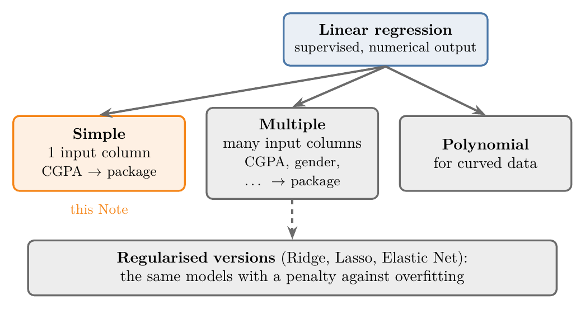
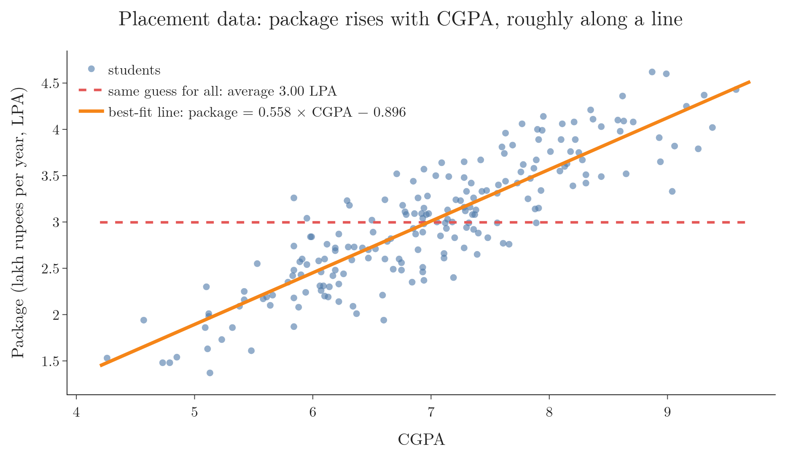
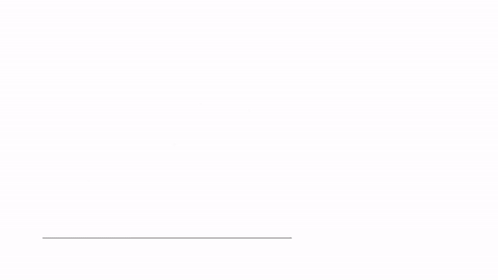
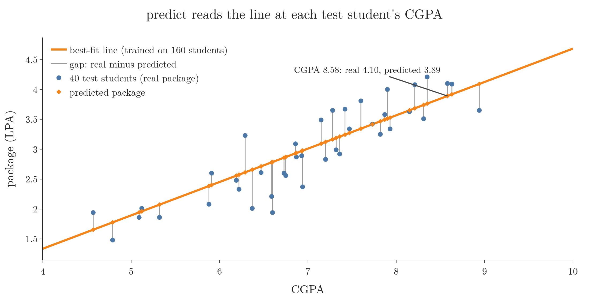
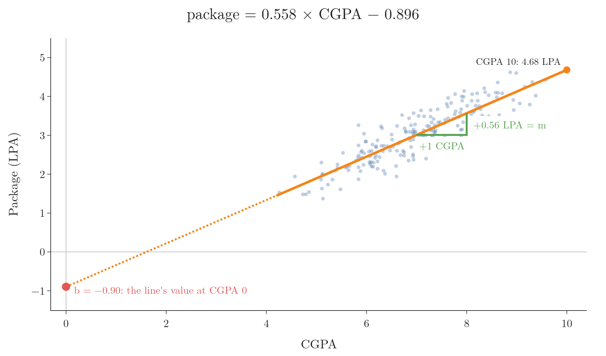

<!-- where-this-fits: generated by course_map/build_map.py; edit concepts.yaml, not this block -->
> **Where this fits:** Pipeline map step 8 (Model). See the [Course map](../../../00-course-map/00-course-map.md).
>
> 
>
> - **Builds on:** [Regression problems](../../../ML/01-foundations/ML-003-types-of-ml/ML-003-types-of-ml.md#1-overview); [Supervised learning](../../../ML/01-foundations/ML-003-types-of-ml/ML-003-types-of-ml.md#2-supervised-learning); [Model-based learning](../../../ML/01-foundations/ML-006-instance-vs-model-based/ML-006-instance-vs-model-based.md#4-model-based-learning); [Multicollinearity](../../../ML/03-feature-engineering/ML-026-one-hot-encoding/ML-026-one-hot-encoding.md#32-multicollinearity-inputs-must-not-depend-on-each-other); [Ordinary least squares (closed form)](../../../ML/06-regression/ML-050-linear-regression-maths/ML-050-linear-regression-maths.md#2-two-ways-to-find-m-and-b); [Regression metrics](../../../ML/06-regression/ML-051-regression-metrics/ML-051-regression-metrics.md#1-overview).
> - **Leads to:** [Regression metrics](../../../ML/06-regression/ML-051-regression-metrics/ML-051-regression-metrics.md#1-overview); [Multiple linear regression](../../../ML/06-regression/ML-052-multiple-linear-regression/ML-052-multiple-linear-regression.md#4-multiple-linear-regression-in-scikit-learn); [Gradient descent](../../../ML/06-regression/ML-056-gradient-descent/ML-056-gradient-descent.md#7-gradient-descent-as-a-class).
> - **Compare with:** [Regression trees](../../../ML/08-trees-and-ensembles/ML-093-regression-trees/ML-093-regression-trees.md#3-how-a-regression-tree-predicts).
<!-- /where-this-fits -->

## 1. Overview

> **Key point:** Linear regression fits a straight line through the data and uses that line to predict a number. Simple linear regression uses one feature.

**Linear regression** (G-1094) is usually the first ML algorithm people learn, for good reason. Linear regression is simple, easy to explain, and many later algorithms build on its ideas.

Three words first. A **feature** (G-772) is an input variable (one column of the data table). The **target** (G-1949) is the output we predict (another column). An **observation** (G-1374) is one record (one row), here one student.

Linear regression is a **supervised** (G-1919; it learns from examples with known answers) algorithm for **regression** (G-1655) problems, where the target is a number, such as a price or a salary (see [regression and classification](../../01-foundations/ML-003-types-of-ml/ML-003-types-of-ml.md#23-regression-and-classification)). Figure 1 shows its family.



- **Simple linear regression** (G-1808): one feature and one target. This Note.
- **Multiple linear regression** (G-1279): several features, for example CGPA, gender and 12th-grade marks to predict a package.
- **Polynomial regression** (G-1515): for data that follows a curve rather than a line.
- **Regularised versions** of these models, which add a [penalty against large coefficients](../ML-062-ridge-regression-intuition/ML-062-ridge-regression-intuition.md#3-the-idea-penalise-large-coefficients) to fight overfitting (fitting the noise in the training data so closely that new data is predicted badly).

This Note builds the intuition and runs the scikit-learn code. The mathematics, [the two formulas for m and b](../ML-050-linear-regression-maths/ML-050-linear-regression-maths.md#45-the-two-formulas), is derived separately.

## 2. The problem

> **Key point:** From a student's CGPA, predict the salary package they will be offered.

Our data describes 200 students from one college who were placed in campus recruitment. The data has two columns:

| cgpa | package |
|---|---|
| 6.89 | 3.26 |
| 5.12 | 1.98 |
| 7.82 | 3.25 |

- `cgpa`: the student's grade point average, out of 10. This is the feature, the **input**.
- `package`: the salary offered, in **LPA** (G-1135) (lakh rupees per year). This is the target, the **output**: it depends on the CGPA.

The goal is a model that takes a new student's CGPA and predicts their package. Such a model could sit behind a small website where a student types in their CGPA.

### 2.1 Without the data: guess the average

> **Key point:** With no model, the best single guess is the average package, 3.00 LPA. The average is the same answer for every student, which is clearly poor.

Suppose someone asks what package a student from this college gets. Without looking at CGPA, the most reasonable answer is the average of all packages: **3.00 LPA**.

The average ignores everything that makes one student different from another. A student with CGPA 9 and a student with CGPA 5 would get the same prediction. The red dashed line in Figure 2 (in the next section) is this "same guess for everyone".

## 3. A line through the data

> **Key point:** The points rise roughly along a straight line. Linear regression finds the line that fits them best.

### 3.1 Plotting the data

> **Key point:** Higher CGPA goes with a higher package, roughly along a straight line, with scatter around it.

The first step with a new dataset is to plot it. Figure 2 shows every student as one point.



The pattern is clear: students with a higher CGPA tend to get a higher package, and the points lie roughly along a straight line. Data like this is called **sort of linear**: linear in its trend, but not exactly on a line.

### 3.2 If the data were perfectly linear

> **Key point:** If every point lay on one line, we would find that line's equation and use it to predict.

Imagine every student's package lay exactly on a straight line. A straight line has the equation

$$y = mx + b$$

where $x$ is the input (CGPA), $y$ is the output (package), $m$ is the **slope** (G-1823) and $b$ is the **intercept** (G-960). Knowing $m$ and $b$, we could put any new CGPA into the equation and read off the package exactly. For example, with $m = 0.5$ and $b = 1$, an input $x = 4$ gives

$$y = 0.5 \times 4 + 1 = 3$$

### 3.3 Why real data is not on a line

> **Key point:** Real data is scattered around the trend because of factors we cannot measure.

Real data is almost never perfectly linear. Two students with the same CGPA may get quite different packages:

- one may have interviewed very well, the other badly;
- one may have joined a company that pays more;
- one may have had a bad day in the test.

None of these can be captured as a feature in the data. Such hard-to-measure, random influences are called **stochastic errors** (G-1891), and they scatter the points around the trend.

### 3.4 The best-fit line

> **Key point:** We still draw one line: the one whose total error over all points is the smallest.

Since no line can pass through every point, linear regression draws the line that is wrong by the least overall: the **best-fit line** (G-280). A tailor making one ready-made shirt size for a group does the same: no one gets a perfect fit, but the size is chosen so that the total misfit is as small as possible.

For each student, the error is the vertical gap between their real package and the line's prediction. The standard name for this gap is the **residual** (G-705):

$$\text{residual} = \text{actual} - \text{predicted}$$

Two students show how the sign works (both appear in the table of Section 4.2):

- CGPA 8.58: actual 4.10 LPA, predicted 3.89.

  $$\text{residual} = 4.10 - 3.89 = +0.21$$

  The point is **above** the line, so the residual is positive.

- CGPA 5.88: actual 2.08 LPA, predicted 2.38.

  $$\text{residual} = 2.08 - 2.38 = -0.30$$

  The point is **below** the line, so the residual is negative.

**By hand on three students.** Take CGPA 6, 7 and 8 with packages 1, 3 and 2 LPA. The average package is:

$$(1 + 3 + 2)/3 = 2$$

The average CGPA is 7. We try lines through the centre $(7, 2)$ with four different slopes. A line through the centre with slope $m$ predicts:

$$2 + m \times (\text{CGPA} - 7)$$

Each row of the table is one student; the residual is actual minus predicted, then squared.

| Slope | Student | Predicted | Residual | Squared |
|---|---|---|---|---|
| 0 (the average) | CGPA 6 | 2 | $1 - 2 = -1$ | 1 |
| | CGPA 7 | 2 | $3 - 2 = 1$ | 1 |
| | CGPA 8 | 2 | $2 - 2 = 0$ | 0 |
| 0.25 | CGPA 6 | 1.75 | $1 - 1.75 = -0.75$ | 0.5625 |
| | CGPA 7 | 2 | $3 - 2 = 1$ | 1 |
| | CGPA 8 | 2.25 | $2 - 2.25 = -0.25$ | 0.0625 |
| 0.5 | CGPA 6 | 1.5 | $1 - 1.5 = -0.5$ | 0.25 |
| | CGPA 7 | 2 | $3 - 2 = 1$ | 1 |
| | CGPA 8 | 2.5 | $2 - 2.5 = -0.5$ | 0.25 |
| 1 | CGPA 6 | 1 | $1 - 1 = 0$ | 0 |
| | CGPA 7 | 2 | $3 - 2 = 1$ | 1 |
| | CGPA 8 | 3 | $2 - 3 = -1$ | 1 |

Adding the squared residuals of each line:

$$\text{slope } 0: \quad 1 + 1 + 0 = 2$$

$$\text{slope } 0.25: \quad 0.5625 + 1 + 0.0625 = 1.625$$

$$\text{slope } 0.5: \quad 0.25 + 1 + 0.25 = 1.5$$

$$\text{slope } 1: \quad 0 + 1 + 1 = 2$$

The sum falls from 2 to 1.5 as the slope turns from 0 to 0.5, then rises again to 2 at slope 1. The lowest of these is slope 0.5, the best-fit line of the three students. This is the valley of Section 3.5 in miniature. The sums for the 160 real students below are added the same way, by the computer.

A good line keeps all the residuals small. Figure 3 compares three lines on the 160 training students; the thin red segments are the residuals.



With 160 students, adding one squared residual per student gives the totals below (the computer does the adding; input: the 160 CGPAs and packages and the line; output: the total).

1. **The average for everyone** (a flat line at 3.00): total squared error 73.0.
2. **A steeper line**: 52.0. Better, but it overshoots at high CGPA.
3. **The best-fit line**: 16.6, the smallest possible total.

The total used is the **sum of squared errors** (G-1684), also called the sum of squared residuals. The squares are needed because plain residuals cancel: a $+0.21$ and a $-0.30$ add up to only $-0.09$, although both predictions are off by much more. Squaring makes every residual positive, so that gaps above and below the line both count, and then all are added. Fitting a line by making this sum as small as possible is called the method of **least squares** (ordinary least squares, G-1406).

### 3.5 Turning the line to find the lowest total

> **Key point:** As the line turns, the sum of squared residuals first falls and then rises. The best-fit line is at the bottom of this valley.

Figure 4 looks for the best line step by step.

1. Start with the flat line at the average package, 3.00. Its sum of squared residuals is 73.0.
2. Turn the line a little about the centre of the data (the black cross). The residuals shrink: the sum falls to 54.6, then 39.8, then 28.6.
3. Keep turning. At slope 0.558 the sum reaches 16.6, its lowest value.
4. Turn further and the line becomes too steep. The residuals grow again: at slope 1.05 the sum is back up at 60.5.


The right panel of Figure 4 plots the sum against the slope. The points form a valley with one lowest point, and the best-fit line is the line at that point. At the bottom of the valley the curve is flat: its own slope is 0. Setting that slope to 0 gives [the two formulas](../ML-050-linear-regression-maths/ML-050-linear-regression-maths.md#45-the-two-formulas) that compute the best $m$ and $b$ directly, without trying slopes one by one.

Figure 4 changes only the slope. A line has two numbers to choose, $m$ and $b$, and over both of them the sum of squared residuals forms a bowl instead of a valley: [the shape of E](../ML-050-linear-regression-maths/ML-050-linear-regression-maths.md#41-the-shape-of-e).

## 4. Linear regression in scikit-learn

> **Key point:** Split the data, create a LinearRegression object, fit it on the training set, and predict.

### 4.1 Inputs, output and split

> **Key point:** X holds the CGPA feature, y the package (the target); 80% of students train the model and 20% test it (a **train-test split**, G-1998: part of the data is held back to check the model on students it has never seen).

> **Python:** Separating the columns and splitting.
>
> ```python
> import pandas as pd
> from sklearn.model_selection import train_test_split
>
> df = pd.read_csv("data/placement.csv")
> X = df.iloc[:, 0:1]   # the cgpa column, kept as a table
> y = df.iloc[:, -1]    # the package column
>
> X_train, X_test, y_train, y_test = train_test_split(
>     X, y, test_size=0.2, random_state=2)
> # 160 training students, 40 test students
> ```
>
> `iloc[:, 0:1]` keeps a DataFrame with one column, not a single column: scikit-learn expects its inputs as a 2-D table, even when there is only one input.

### 4.2 Training and predicting

> **Key point:** `fit` finds the best-fit line from the training set; `predict` reads the line at a new CGPA.

> **Python:** Training and predicting.
>
> ```python
> from sklearn.linear_model import LinearRegression
>
> lr = LinearRegression()
> lr.fit(X_train, y_train)          # find the best-fit line
>
> lr.predict(X_test.iloc[[0]])      # the first test student
> # array([3.89])
> ```
>
> `X_test.iloc[[0]]` (double brackets) keeps the student as a one-row table. A single row with single brackets would be 1-D, and scikit-learn would refuse it.

The first test student has a CGPA of 8.58 and was offered 4.10 LPA. The model predicts 3.89 LPA. A few more test students:

| CGPA | Actual (LPA) | Predicted (LPA) |
|---|---|---|
| 8.58 | 4.10 | 3.89 |
| 7.15 | 3.49 | 3.09 |
| 5.88 | 2.08 | 2.38 |
| 6.22 | 2.33 | 2.57 |
| 4.57 | 1.94 | 1.65 |

The predictions are close, but not exact: the stochastic errors of Section 3.3 cannot be predicted from CGPA. Figure 5 shows all 40 test students: every prediction (orange diamond) sits on the line at the student's CGPA, and the grey segment is the gap to the real package.



How to measure a regression model's accuracy properly is covered by the regression metrics, starting with the [mean absolute error](../ML-051-regression-metrics/ML-051-regression-metrics.md#2-mean-absolute-error-mae).

## 5. What the model learned: m and b

> **Key point:** The trained model is just two numbers: the slope $m = 0.558$ and the intercept $b = -0.896$.

### 5.1 Reading m and b

> **Key point:** `coef_` holds the slope and `intercept_` holds the intercept.

The best-fit line is fully described by its slope and intercept. scikit-learn stores them after `fit`.

> **Python:** The line's two numbers.
>
> ```python
> m = lr.coef_[0]        # 0.558
> b = lr.intercept_      # -0.896
> ```

So the model is the equation

$$\text{package} = 0.558 \times \text{CGPA} - 0.896$$

With numbers, for the student with CGPA 8.58:

$$0.558 \times 8.58 = 4.788$$

$$4.788 - 0.896 = 3.89$$

The result is exactly the prediction from `lr.predict`. All `predict` does is put the CGPA into this equation.

### 5.2 The slope m: how much the output depends on the input

> **Key point:** Each extra CGPA point adds 0.56 LPA to the predicted package.



The slope is the change in the output for one unit of change in the input (the green triangle in Figure 6). Here, every extra CGPA point adds 0.56 LPA to the predicted package.

So $m$ acts like a **weight**: it says how strongly the output depends on the input.

- A slope near 0 would mean the package hardly depends on CGPA.
- A large slope would mean a small change in CGPA moves the package a lot.

### 5.3 The intercept b: the starting value

> **Key point:** The intercept is the line's value when the input is 0. Sometimes it has a real meaning, sometimes it does not.

The intercept is where the line crosses the vertical axis: the prediction for an input of 0. Here, $b = -0.90$ LPA at CGPA 0 (the red point in Figure 6).

An intercept of $-0.90$ has no real meaning: no student has a CGPA of 0, and a negative salary is impossible. The intercept is just where the line has to start so that it fits the students we do have, between CGPA 4 and 10.

In other data, the intercept can mean something real.

Take years of experience and salary: a fresher has 0 years of experience but still earns a salary. There, the intercept is the starting salary, and it should not be 0. The intercept is what lets the line start at the right height.

> **Extra:** The line does not know where the real data ends. For CGPA 10 it predicts 4.68 LPA, which is reasonable. For CGPA 100, which cannot exist, it calmly predicts 54.9 LPA. Predicting outside the range of the training data is called **extrapolation** (G-738). A straight line keeps rising forever, but nothing tells us the real data does; past CGPA 10 we have no students to check it against. So predictions far outside the training range are risky, for any model (NIST Handbook §4.1.4.1).

## 6. Summary

| Idea | On the placement data | Why it matters |
|---|---|---|
| Input $x$ and output $y$ | CGPA; package in LPA | the package is a number, so this is regression |
| Guess without a model | the average, 3.00 LPA for everyone | the baseline the line must beat |
| Best-fit line | package = 0.558 × CGPA $-$ 0.896 | `predict` just puts a CGPA into this equation |
| Slope $m$ | +0.56 LPA per CGPA point | it says how strongly the package depends on CGPA |
| Intercept $b$ | $-0.90$, meaningless here (no CGPA of 0) | it sets the line's height so it fits the CGPAs we have |
| Total squared error, training set | 73.0 for the average; 16.6 for the best-fit line | the line cuts the error of the average guess to less than a quarter |

- Linear regression is supervised and predicts a number; simple linear regression uses one input, so it is the starting point for the multiple, polynomial and regularised versions.
- Real data is "sort of linear": a linear trend plus scatter from stochastic errors, so no line passes through every point and some error always remains.
- A residual is actual minus predicted: positive above the line, negative below, so the residuals must be squared before adding, or they cancel.
- The best-fit line is the line with the smallest sum of squared errors (least squares): the bottom of the valley in Figure 4, so "best" has one exact meaning that a computer can find.
- In scikit-learn: `LinearRegression().fit(X_train, y_train)`, then `predict`; the test students, held back from `fit`, check the model on data it has not seen.
- The trained model is two numbers: `coef_` (slope, the input's weight) and `intercept_` (the starting value), so the whole model can be written down and read.
- The line keeps going beyond the data; predictions far outside the training range are unreliable, because there are no students there to check the line against.
- Together these answer the opening question: linear regression fits the straight line with the smallest squared error through the data and reads predictions off it.


## 7. Sources

**Built from**

- CampusX, "Simple Linear Regression | Code + Intuition | Simplest Explanation in Hindi", YouTube, https://www.youtube.com/watch?v=UZPfbG0jNec

- StatQuest with Josh Starmer, "The Main Ideas of Fitting a Line to Data (The Main Ideas of Least Squares and Linear Regression.)", YouTube, https://www.youtube.com/watch?v=PaFPbb66DxQ (turning the line and the valley of section 3.5)
- Khan Academy, "Introduction to residuals and least squares regression", YouTube, https://www.youtube.com/watch?v=yMgFHbjbAW8 (residual = actual − predicted and its sign)

**Other references**

- NIST/SEMATECH *e-Handbook of Statistical Methods*, §4.1.4.1 Linear Least Squares Regression (Disadvantages). itl.nist.gov/div898/handbook.

## 8. Key terms

| Term | Meaning |
|---|---|
| Feature | An input variable: one column of the data table |
| Target | The output we predict |
| Observation | One record: one row of the data table |
| Linear regression | A supervised algorithm that predicts a number with a straight line (or flat surface) through the data |
| Simple linear regression | Linear regression with one feature |
| Multiple linear regression | Linear regression with several features |
| LPA | Lakh rupees per annum: a salary in hundreds of thousands of rupees per year |
| Slope | How much the output changes for one unit of change in the input; $m$ in $y = mx + b$ |
| Intercept | The line's value when the input is 0; $b$ in $y = mx + b$ |
| Stochastic error | A random, unmeasurable influence that scatters data around its trend |
| Best-fit line | The line with the smallest total error over all the training points |
| Error (residual) | The gap between an actual value and the model's prediction: actual minus predicted |
| Sum of squared errors (G-1684) | The squares of all the errors (residuals) added up; the quantity the best-fit line makes smallest |
| Least squares (ordinary least squares) (G-1406) | Fitting a line by making the sum of squared errors as small as possible |
| coef_ | The fitted slope (one per feature) in scikit-learn |
| intercept_ | The fitted intercept in scikit-learn |
| Extrapolation | Predicting for inputs outside the range of the training data |
