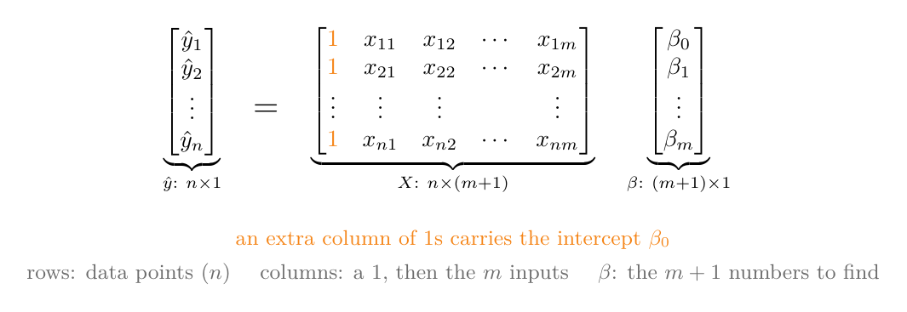
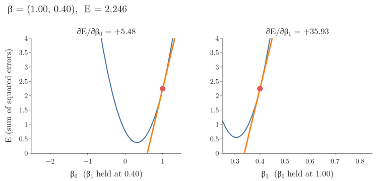
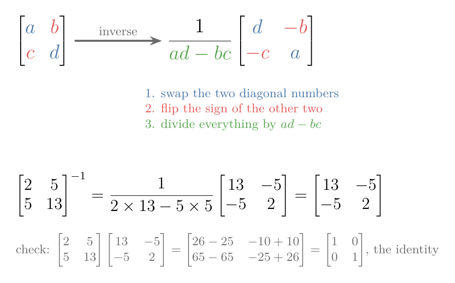
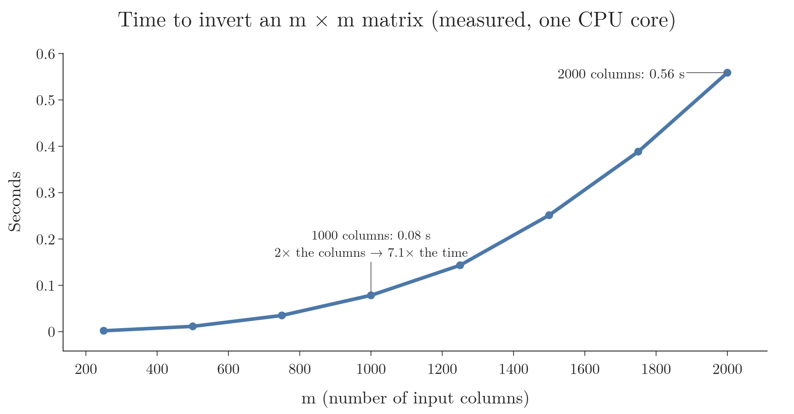

<!-- where-this-fits: generated by course_map/build_map.py; edit concepts.yaml, not this block -->
> **Where this fits:** Pipeline map step 8 (Model). See the [Course map](../../../00-course-map/00-course-map.md).
>
> 
>
> - **Builds on:** [Linear combinations, span and basis](../../../MA/05-linear-algebra/MA-052-linear-combinations-span-and-basis/MA-052-linear-combinations-span-and-basis.md#5-linear-combinations); [Ordinary least squares (closed form)](../../../ML/06-regression/ML-050-linear-regression-maths/ML-050-linear-regression-maths.md#4-finding-the-minimum); [Multiple linear regression](../../../ML/06-regression/ML-052-multiple-linear-regression/ML-052-multiple-linear-regression.md#2-from-a-line-to-a-hyperplane); [Jacobian and matrix gradients](../../../MA/06-calculus/MA-063-jacobian-and-matrix-gradients/MA-063-jacobian-and-matrix-gradients.md#4-the-jacobian).
> - **Leads to:** [Ridge regression](../../../ML/06-regression/ML-062-ridge-regression-intuition/ML-062-ridge-regression-intuition.md#3-the-idea-penalise-large-coefficients).
> - **Compare with:** [Gradient descent](../../../ML/06-regression/ML-056-gradient-descent/ML-056-gradient-descent.md#2-the-idea); [Moore-Penrose pseudo-inverse](../../../MA/05-linear-algebra/MA-060-svd-in-machine-learning/MA-060-svd-in-machine-learning.md#5-the-pseudo-inverse-and-least-squares).
<!-- /where-this-fits -->

## 1. Overview

> **Key point:** With several features we still find the best coefficients the same way as with one: measure the total squared error, and find where its slope is zero in every direction. Matrices let us do that for every coefficient at once, and the answer is one formula, the normal equation.

A **feature** (G-772) is an input variable (one column of the data table), the **target** (G-1949) is the output we predict, and an **observation** (G-1374) is one record (one row). Our running example predicts a student's package (the target) from CGPA (a feature).

For **simple linear regression** (G-1808), with one feature, we found two formulas, one for the slope and one for the intercept (see [the two formulas](../ML-050-linear-regression-maths/ML-050-linear-regression-maths.md#45-the-two-formulas)). **Multiple linear regression** (G-1279) has several features (see [the equation](../ML-052-multiple-linear-regression/ML-052-multiple-linear-regression.md#3-the-equation)). Each feature gets its own weight, and there is one intercept on top. These numbers are the **coefficients** (G-407). Writing a separate formula for each coefficient is hopeless when there are ten or a hundred features.

Matrices solve the problem. Like a spreadsheet formula dragged down a whole column instead of typed into every cell, a matrix lets us write one equation for all observations at once. We write all the data, all the predictions and all the coefficients as matrices. Then the same three steps as before give one formula for every coefficient at once:

1. write the error (Sections 2 and 3);
2. multiply it out and differentiate it (Sections 4 and 5);
3. set the derivative to zero and solve (Section 6).

The result, at the end of Section 6, is the **normal equation**. Section 6.1 runs it by hand on four students, with every sum and the inverse worked out on paper. [Our own class](../ML-054-multiple-lr-code/ML-054-multiple-lr-code.md#4-our-own-class) then codes it from scratch. Each rule about matrices is checked on small numbers before it is used.

**A note on letters.** In this Note the letter m counts the features (for example m = 3 for CGPA, IQ and gender). In [the error function of simple linear regression](../ML-050-linear-regression-maths/ML-050-linear-regression-maths.md#3-the-error-function), m was the slope. Here every slope is a coefficient, written $\beta$ (the Greek letter beta).

## 2. The model in matrix form

> **Key point:** Put the data in one table with an extra first column of 1s, and the coefficients in one column. One multiplication of the two then gives every prediction at once.

### 2.1 One equation per student

> **Key point:** Every student gets the same equation with the same coefficients; only the feature values change.

Suppose we predict a student's package from three features: CGPA, IQ and gender. The model multiplies each feature by its coefficient and adds the intercept:

$$\hat y = \beta_0 + \beta_1 \cdot \text{cgpa} + \beta_2 \cdot \text{iq} + \beta_3 \cdot \text{gender}$$

Once the four numbers $\beta_0$ to $\beta_3$ are known, we can predict the package of any new student. Training means finding them.

With 100 students there are 100 such equations. To tell the values apart we give each value two labels, the student and the feature:

$$x_{ij} = \text{the value of feature } j \text{ for student } i$$

$$x_{21} = \text{the CGPA (feature 1) of student 2}$$

$$\hat y_1 = \beta_0 + \beta_1 x_{11} + \beta_2 x_{12} + \beta_3 x_{13}$$
$$\hat y_2 = \beta_0 + \beta_1 x_{21} + \beta_2 x_{22} + \beta_3 x_{23}$$

and so on, down to $\hat y_{100}$. The coefficients are the same in every line.

In general, with n observations and m features (for example n = 100 students and m = 3 features), observation i has the prediction

$$\hat y_i = \beta_0 + \beta_1 x_{i1} + \beta_2 x_{i2} + \dots + \beta_m x_{im}$$

and there are $n$ such equations.

### 2.2 Stacking the equations

> **Key point:** The $n$ equations split into a table of numbers, $X$, times a column of coefficients, $\beta$.

A **matrix** (G-1180) is a table of numbers, and a **vector** (G-2081) is a single column of numbers. They let us write the $n$ equations as one.

Figure 1 does it for four students with one feature, CGPA (the students of Section 6.1). Watch three things move:

1. the four left sides stack into one vector, $\hat y$;
2. the numbers stack into one matrix, $X$: a column of 1s and a column of CGPAs;
3. the coefficients, which were repeated in every line, are written once, as the vector $\beta$.

Figure 2 shows the same split for $n$ observations and $m$ features.

- **$X$**, the **design matrix** (G-597), holds the data: one row per observation, one column per feature, plus a first column of 1s. The 1s multiply $\beta_0$, so the intercept is treated like any other coefficient.
- **$\beta$**, the **coefficient vector** (G-410), holds the $m + 1$ coefficients, $\beta_0$ to $\beta_m$.
- **$\hat{y}$** holds the $n$ predictions.

Multiplying one row of $X$ by $\beta$ means: multiply each entry of the row by the matching coefficient, then add. Row i gives

$$\beta_0 \cdot 1 + \beta_1 x_{i1} + \dots + \beta_m x_{im}$$

which is exactly the prediction for observation i. So all predictions together are

$$\hat{y} = X\beta$$

With numbers: the first student of Figure 1 has the row [1, 6.89]. Section 6.1 finds the coefficients

$$\beta_0 = -0.811$$

$$\beta_1 = 0.565$$

The row times $\beta$, one product per line:

$$1 \times (-0.811) = -0.811$$

$$6.89 \times 0.565 = 3.893$$

$$-0.811 + 3.893 = 3.08$$

So 3.08 is the predicted package of that student.

> **Extra:** The shapes must fit: $X$ is $n \times (m+1)$ and $\beta$ is $(m+1) \times 1$. The inner sizes match, and the product is $n \times 1$, one prediction per row.

## 3. The error in matrix form

> **Key point:** Subtract each prediction from the real value to get one error per student. Square the errors and add them up: that one number measures how bad the coefficients are.

For each student, the error is the real package minus the predicted one. This error on one observation is called a **residual** (G-705). The residuals of all observations form a vector:

$$e = y - \hat{y} = y - X\beta$$

The **sum of squared errors** (G-1684) E adds up the squares of the residuals:

$$E = e_1^2 + e_2^2 + \dots + e_n^2$$

That sum is a row times a column. The **transpose** (G-2012) of e, written $e^{\mathsf T}$, is the same numbers written as a row (Figure 4 in Section 4 draws it). A row times a column multiplies matching entries and adds them, which is exactly the sum of squares:

$$E = e^{\mathsf T}e = (y - X\beta)^{\mathsf T}(y - X\beta)$$

With numbers, take three errors:

$$e = (0.2, -0.1, 0.3)$$

$$0.2 \times 0.2 = 0.04$$

$$(-0.1) \times (-0.1) = 0.01$$

$$0.3 \times 0.3 = 0.09$$

$$e^{\mathsf T}e = 0.04 + 0.01 + 0.09 = 0.14$$

Figure 3 draws the same idea on the four students of Section 6.1 and their best line. Each red segment is one entry of $e$, and the orange square on it has area $e_i^2$. Watch the biggest square: the student with CGPA 7.82 and error $-0.36$ supplies half of $E = 0.253$, because squaring makes large errors count much more than small ones.

## 4. Expanding the error

> **Key point:** Multiplying out the brackets turns the error into three parts, exactly like (a − b)² = a² − 2ab + b² in ordinary algebra. Only two rules about flipping rows and columns are needed.

In ordinary algebra a square multiplies out into three parts:

$$(a - b)^2 = a^2 - 2ab + b^2$$

The error E is the matrix version of a square, and it multiplies out to the same three-part shape. To see every step on numbers, we use a tiny made-up example with two observations and one feature:

$$X = \begin{bmatrix} 1 & 2 \cr1 & 3 \end{bmatrix}$$

$$y = \begin{bmatrix} 4 \cr5 \end{bmatrix}$$

$$\beta = \begin{bmatrix} 1 \cr1 \end{bmatrix}$$

The first column of X is the column of 1s; the feature values are 2 and 3; the targets are 4 and 5; and we try the coefficients 1 and 1. The predictions and errors are

$$X\beta = \begin{bmatrix} 1 \times 1 + 2 \times 1 \cr1 \times 1 + 3 \times 1 \end{bmatrix}$$

$$X\beta = \begin{bmatrix} 3 \cr4 \end{bmatrix}$$

$$e = y - X\beta = \begin{bmatrix} 4 - 3 \cr5 - 4 \end{bmatrix}$$

$$e = \begin{bmatrix} 1 \cr1 \end{bmatrix}$$

$$E = e^{\mathsf T}e = 1 \times 1 + 1 \times 1 = 2$$

### 4.1 Two rules about transposes

> **Key point:** Transposing a product reverses its order, and a single number is its own transpose.

Figure 4 shows both rules on the tiny example.

![Top: the transpose turns the column Xβ = (3, 4) into the row [3, 4]. Bottom: multiplying the transposes in reverse order, βᵀXᵀ, gives the same row](images/transpose.png){height=30%}

**Rule 1: the transpose of a product reverses the order.**

$$(AB)^{\mathsf T} = B^{\mathsf T}A^{\mathsf T}$$

Here A and B stand for any two matrices that can be multiplied. For our product, A is X and B is $\beta$, so the rule says

$$(X\beta)^{\mathsf T} = \beta^{\mathsf T}X^{\mathsf T}$$

Check on the tiny example. The left side flips the column (3, 4) into a row:

$$(X\beta)^{\mathsf T} = \begin{bmatrix} 3 & 4 \end{bmatrix}$$

The right side, with the transpose of X (its rows become columns):

$$X^{\mathsf T} = \begin{bmatrix} 1 & 1 \cr2 & 3 \end{bmatrix}$$

$$\beta^{\mathsf T}X^{\mathsf T} = \begin{bmatrix} 1 \times 1 + 1 \times 2 & 1 \times 1 + 1 \times 3 \end{bmatrix}$$

$$\beta^{\mathsf T}X^{\mathsf T} = \begin{bmatrix} 3 & 4 \end{bmatrix}$$

The two sides match.

**Rule 2: a single number is its own transpose.** A 1 × 1 matrix has nothing to flip. The two terms below are each a single number, and each is the transpose of the other (by Rule 1), so they are equal:

$$y^{\mathsf T}X\beta = \beta^{\mathsf T}X^{\mathsf T}y$$

Check on the tiny example. The left side is the row of targets times the column of predictions:

$$y^{\mathsf T}X\beta = 4 \times 3 + 5 \times 4 = 12 + 20 = 32$$

For the right side, first multiply the transpose of X by y:

$$X^{\mathsf T}y = \begin{bmatrix} 1 \times 4 + 1 \times 5 \cr2 \times 4 + 3 \times 5 \end{bmatrix}$$

$$X^{\mathsf T}y = \begin{bmatrix} 9 \cr23 \end{bmatrix}$$

$$\beta^{\mathsf T}X^{\mathsf T}y = 1 \times 9 + 1 \times 23 = 32$$

Both are 32.

### 4.2 Multiplying out

> **Key point:** Four products come out, and the two middle ones are equal, so the error has three parts.

Multiply the two brackets of E term by term, as with (a − b)(a − b). Rule 1 turns the transpose of y − Xβ into the transpose of y minus the row from Figure 4:

$$(y - X\beta)^{\mathsf T} = y^{\mathsf T} - \beta^{\mathsf T}X^{\mathsf T}$$

The four products, one per line:

$$y^{\mathsf T} \cdot y = y^{\mathsf T}y$$

$$y^{\mathsf T} \cdot (-X\beta) = -y^{\mathsf T}X\beta$$

$$(-\beta^{\mathsf T}X^{\mathsf T}) \cdot y = -\beta^{\mathsf T}X^{\mathsf T}y$$

$$(-\beta^{\mathsf T}X^{\mathsf T}) \cdot (-X\beta) = +\beta^{\mathsf T}X^{\mathsf T}X\beta$$

Adding them:

$$E = y^{\mathsf T}y - y^{\mathsf T}X\beta$$

$$\phantom{E =} - \beta^{\mathsf T}X^{\mathsf T}y + \beta^{\mathsf T}X^{\mathsf T}X\beta$$

By Rule 2 the two middle terms are equal, so they combine:

$$E = y^{\mathsf T}y - 2y^{\mathsf T}X\beta + \beta^{\mathsf T}X^{\mathsf T}X\beta$$

Check on the tiny example, one part per line. The first part:

$$y^{\mathsf T}y = 4 \times 4 + 5 \times 5 = 41$$

The middle part, using the 32 of Rule 2:

$$2y^{\mathsf T}X\beta = 2 \times 32 = 64$$

The last part is the column Xβ = (3, 4) times its own transpose:

$$\beta^{\mathsf T}X^{\mathsf T}X\beta = (X\beta)^{\mathsf T}(X\beta)$$

$$= 3 \times 3 + 4 \times 4 = 25$$

Together:

$$E = 41 - 64 + 25 = 2$$

the same 2 as the direct sum of squared errors above.

## 5. Setting the derivative to zero

> **Key point:** At the best coefficients the error bowl is flat in every direction: its slope along each coefficient is zero. Two small rules turn that into one matrix equation.

As in simple linear regression, the best coefficients sit at the bottom of the error bowl, where the slope is zero. Now there is one slope per coefficient. Figure 5 shows the two slopes on the four students of Section 6.1. Each panel cuts the error bowl along one coefficient while the other is held fixed, and the orange tangent shows the slope there. Watch both slopes shrink as $\beta$ walks to (−0.81, 0.57): there both tangents lie flat at the same moment.

The slope along one coefficient, with the others held fixed, is a **partial derivative** (G-1457). Stacking all of them into one column gives the **gradient** (G-863). With two coefficients:

$$\frac{\partial E}{\partial \beta} = \begin{bmatrix} \partial E / \partial \beta_0 \cr\partial E / \partial \beta_1 \end{bmatrix}$$

"Both tangents flat" in Figure 5 means every entry of this column is 0.

### 5.1 Three rules of matrix calculus, each checked on numbers

> **Key point:** The matrix rules are the old rules "the derivative of a constant is 0", "of aβ is a" and "of aβ² is 2aβ", applied to every coefficient at once.

Rules for differentiating with vectors and matrices are called **matrix calculus** (G-1176). E has three parts, and each needs one rule. We check each rule by writing the part out for two coefficients, $\beta_0$ and $\beta_1$, taking the two ordinary partial derivatives, and comparing.

**Rule A: a part without β has derivative 0.** The first part, $y^{\mathsf T}y$, is 41 in the tiny example whatever β is. A constant does not change when β changes, so

$$\frac{\partial}{\partial \beta}\left(y^{\mathsf T}y\right) = \begin{bmatrix} 0 \cr0 \end{bmatrix}$$

**Rule B: a weighted sum of the coefficients has the weights as its derivative.** The matrix version of "the derivative of aβ is a". Section 4.1 showed that the middle part is $\beta^{\mathsf T}X^{\mathsf T}y$, and that $X^{\mathsf T}y = (9, 23)$ in the tiny example. So, written out,

$$\beta^{\mathsf T}X^{\mathsf T}y = 9\beta_0 + 23\beta_1$$

The two partial derivatives, one per line:

$$\frac{\partial}{\partial \beta_0}(9\beta_0 + 23\beta_1) = 9$$

$$\frac{\partial}{\partial \beta_1}(9\beta_0 + 23\beta_1) = 23$$

Stacked, they are (9, 23), which is $X^{\mathsf T}y$ itself. In general:

$$\frac{\partial}{\partial \beta}\left(\beta^{\mathsf T}X^{\mathsf T}y\right) = X^{\mathsf T}y$$

and so, since the middle part is twice this (Rule 2):

$$\frac{\partial}{\partial \beta}\left(2y^{\mathsf T}X\beta\right) = 2X^{\mathsf T}y$$

**Rule C: a "squared" part gives two times the matrix times β.** The matrix version of "the derivative of aβ² is 2aβ". The last part has the square matrix $X^{\mathsf T}X$ in the middle. In the tiny example:

$$X^{\mathsf T}X = \begin{bmatrix} 1 \times 1 + 1 \times 1 & 1 \times 2 + 1 \times 3 \cr2 \times 1 + 3 \times 1 & 2 \times 2 + 3 \times 3 \end{bmatrix}$$

$$X^{\mathsf T}X = \begin{bmatrix} 2 & 5 \cr5 & 13 \end{bmatrix}$$

Written out, $\beta^{\mathsf T}X^{\mathsf T}X\beta$ has one term per entry of the matrix:

$$\beta^{\mathsf T}X^{\mathsf T}X\beta = 2\beta_0\beta_0 + 5\beta_0\beta_1$$

$$\phantom{=} + 5\beta_1\beta_0 + 13\beta_1\beta_1$$

Collecting the two middle terms, and calling this part $P$:

$$P = 2\beta_0^2 + 10\beta_0\beta_1 + 13\beta_1^2$$

Its two partial derivatives:

$$\frac{\partial P}{\partial \beta_0} = 4\beta_0 + 10\beta_1$$

$$\frac{\partial P}{\partial \beta_1} = 10\beta_0 + 26\beta_1$$

Now the matrix rule's answer, two times the matrix times β:

$$2X^{\mathsf T}X\beta = 2\begin{bmatrix} 2\beta_0 + 5\beta_1 \cr5\beta_0 + 13\beta_1 \end{bmatrix}$$

$$2X^{\mathsf T}X\beta = \begin{bmatrix} 4\beta_0 + 10\beta_1 \cr10\beta_0 + 26\beta_1 \end{bmatrix}$$

The same two lines. In general:

$$\frac{\partial}{\partial \beta}\left(\beta^{\mathsf T}X^{\mathsf T}X\beta\right) = 2X^{\mathsf T}X\beta$$

The rule works because $X^{\mathsf T}X$ is a **symmetric matrix** (G-1932): it equals its own transpose, so the two 5s above are equal and add up to the 10 (MML §5.5).

> **Extra:** For any square matrix $B$ the general rule is (MML eq. 5.107, which writes the gradient as a row):
>
> $$\frac{\partial(x^{\mathsf T}Bx)}{\partial x} = x^{\mathsf T}(B + B^{\mathsf T})$$
>
> With $B = X^{\mathsf T}X$, which equals its own transpose:
>
> $$B + B^{\mathsf T} = 2X^{\mathsf T}X$$

### 5.2 The gradient, then zero

> **Key point:** Adding the three derivatives gives the gradient; setting it to zero gives the normal equations.

Apply Rules A, B and C to the three parts of E, one per line:

$$\frac{\partial}{\partial \beta}\left(y^{\mathsf T}y\right) = 0$$

$$\frac{\partial}{\partial \beta}\left(-2y^{\mathsf T}X\beta\right) = -2X^{\mathsf T}y$$

$$\frac{\partial}{\partial \beta}\left(\beta^{\mathsf T}X^{\mathsf T}X\beta\right) = 2X^{\mathsf T}X\beta$$

Adding them:

$$\frac{\partial E}{\partial \beta} = -2X^{\mathsf T}y + 2X^{\mathsf T}X\beta$$

Check on the tiny example at β = (1, 1), where both errors were 1:

$$-2X^{\mathsf T}y = \begin{bmatrix} -18 \cr-46 \end{bmatrix}$$

$$2X^{\mathsf T}X\beta = \begin{bmatrix} 4 + 10 \cr10 + 26 \end{bmatrix}$$

$$2X^{\mathsf T}X\beta = \begin{bmatrix} 14 \cr36 \end{bmatrix}$$

$$\frac{\partial E}{\partial \beta} = \begin{bmatrix} -18 + 14 \cr-46 + 36 \end{bmatrix}$$

$$\frac{\partial E}{\partial \beta} = \begin{bmatrix} -4 \cr-10 \end{bmatrix}$$

The same slopes come from the simple-regression derivatives of [the error function](../ML-050-linear-regression-maths/ML-050-linear-regression-maths.md#4-finding-the-minimum), minus two times the sum of the errors, and minus two times the sum of error times feature:

$$-2(1 + 1) = -4$$

$$-2(1 \times 2 + 1 \times 3) = -10$$

At the best coefficients the gradient is zero:

$$-2X^{\mathsf T}y + 2X^{\mathsf T}X\beta = 0$$

Dividing by 2 and moving one term across:

$$X^{\mathsf T}X\beta = X^{\mathsf T}y$$

These are the **normal equations** (G-1345): m + 1 equations, one for each coefficient.

## 6. The normal equation

> **Key point:** To get the coefficients alone, we "divide" both sides by the matrix XᵀX. For matrices, dividing means multiplying by the inverse.

With ordinary numbers, "2 times a number is 6" is solved by dividing by 2, which is the same as multiplying by one half, the number that undoes 2. Matrices have no division; instead we multiply by the **inverse** (G-968), the matrix that undoes $X^{\mathsf T}X$. A matrix times its inverse gives the **identity matrix** (G-915), the matrix with 1s on the diagonal and 0s elsewhere, which changes nothing it multiplies.

For a 2 × 2 matrix the inverse has a three-step recipe (MML §2.2.2), shown in Figure 6:

1. swap the two numbers on the diagonal;
2. flip the sign of the other two;
3. divide everything by the diagonal product minus the off-diagonal product.

{height=40%}

The number in step 3 is the **determinant** (G-598). For bigger matrices the computer does the work; the idea is the same.

On the tiny example (bottom of Figure 6), the determinant of the transpose of X times X is

$$2 \times 13 - 5 \times 5 = 26 - 25 = 1$$

so the inverse is the swapped matrix itself:

$$\begin{bmatrix} 2 & 5 \cr5 & 13 \end{bmatrix}^{-1}$$

$$= \begin{bmatrix} 13 & -5 \cr-5 & 2 \end{bmatrix}$$

Multiply it by the column (9, 23) from Rule B:

$$\beta_0 = 13 \times 9 + (-5) \times 23 = 117 - 115 = 2$$

$$\beta_1 = (-5) \times 9 + 2 \times 23 = -45 + 46 = 1$$

The line "prediction = 2 + 1 × feature" passes through both points:

$$2 + 1 \times 2 = 4$$

$$2 + 1 \times 3 = 5$$

In general, multiplying both sides of the normal equations by the inverse leaves β alone:

$$\beta = (X^{\mathsf T}X)^{-1}X^{\mathsf T}y$$

The formula is the **normal equation** (G-1344). A formula that gives the answer directly is a **closed-form solution** (G-398); this one gives all coefficients of multiple linear regression at once, and the method is called **ordinary least squares**, OLS (G-1406). scikit-learn's `LinearRegression` reaches the same solution with a numerically safer method than a literal inverse (scikit-learn docs, LinearRegression; LAPACK, DGELSD).

### 6.1 A worked example

> **Key point:** On four students with one feature, the normal equation gives the same slope and intercept as the simple formulas.

Take the first four students of the placement data, with CGPA 6.89, 5.12, 7.82, 7.42 and packages 3.26, 1.98, 3.25, 3.67.

1. **Build X:** a column of four 1s next to the four CGPAs.

   $$X = \begin{bmatrix} 1 & 6.89 \cr1 & 5.12 \cr1 & 7.82 \cr1 & 7.42 \end{bmatrix}$$

   $$y = \begin{bmatrix} 3.26 \cr1.98 \cr3.25 \cr3.67 \end{bmatrix}$$

2. **Compute the transpose of X times X.** Each entry is a column of X times a column of X. The column of 1s times itself counts the students:

   $$1 + 1 + 1 + 1 = 4$$

   The column of 1s times the CGPAs adds the CGPAs:

   $$6.89 + 5.12 + 7.82 + 7.42 = 27.25$$

   The CGPAs times themselves add their squares:

   $$47.4721 + 26.2144 + 61.1524 + 55.0564$$

   $$= 189.8953$$

   $$X^{\mathsf T}X = \begin{bmatrix} 4 & 27.25 \cr27.25 & 189.8953 \end{bmatrix}$$

3. **Compute the transpose of X times y.** The column of 1s times y adds the packages:

   $$3.26 + 1.98 + 3.25 + 3.67 = 12.16$$

   The CGPAs times the packages, one product per student:

   $$6.89 \times 3.26 = 22.4614$$

   $$5.12 \times 1.98 = 10.1376$$

   $$7.82 \times 3.25 = 25.4150$$

   $$7.42 \times 3.67 = 27.2314$$

   $$22.4614 + 10.1376 + 25.4150 + 27.2314$$

   $$= 85.2454$$

   $$X^{\mathsf T}y = \begin{bmatrix} 12.16 \cr85.2454 \end{bmatrix}$$

4. **Invert with the recipe of Figure 6.** The determinant:

   $$4 \times 189.8953 - 27.25 \times 27.25$$

   $$= 759.5812 - 742.5625 = 17.0187$$

   Swap the diagonal, flip the signs of the other two, divide by 17.0187:

   $$(X^{\mathsf T}X)^{-1} = \frac{1}{17.0187} M$$

   $$M = \begin{bmatrix} 189.8953 & -27.25 \cr-27.25 & 4 \end{bmatrix}$$

   $$= \begin{bmatrix} 11.158 & -1.601 \cr-1.601 & 0.235 \end{bmatrix}$$

   Check the top-left entry of the inverse times the matrix, which should be 1:

   $$\frac{189.8953 \times 4 - 27.25 \times 27.25}{17.0187}$$

   $$= \frac{17.0187}{17.0187} = 1$$

5. **Multiply.** To keep rounding out, we multiply by the swapped matrix first and divide by 17.0187 last:

   $$189.8953 \times 12.16 - 27.25 \times 85.2454$$

   $$= 2309.127 - 2322.937 = -13.810$$

   $$-27.25 \times 12.16 + 4 \times 85.2454$$

   $$= -331.360 + 340.982 = 9.622$$

   $$\beta_0 = -13.810 / 17.0187 = -0.811$$

   $$\beta_1 = 9.622 / 17.0187 = 0.565$$

So $\beta_0 = -0.81$, the **intercept** (G-960), and $\beta_1 = 0.57$, the **slope** (G-1823): exactly what the simple linear regression formulas give for these four points. The simple formulas are the normal equation with a single feature.

### 6.2 The picture: a projection

> **Extra:** This section goes beyond the derivation: a second, geometric way to see the same equation.

> **Key point:** Every possible set of predictions lies on one flat plane, and the real targets stick out of it. The best predictions are the point of the plane closest to the targets, where the error meets the plane at a right angle; that right angle gives the normal equation.

The normal equation also has a geometric meaning (ESL §3.2, Figure 3.2; MML §3.8). Treat the $n$ targets as one vector $y$ with $n$ entries, and each column of $X$ the same way. A prediction $X\beta$ is a weighted sum of the columns, so all possible predictions fill the flat space the columns span, called the **column space** (G-414) of $X$. Unless the data lie exactly on a line, $y$ is not in it. The point of the plane straight below $y$ is the **projection** (G-1583) of $y$ onto the plane.

With three observations every vector has three entries, so we can draw it. Figure 7 uses the first three students of the worked example: $X$ has the columns $\mathbf 1 = [1, 1, 1]$ and cgpa $= [6.89, 5.12, 7.82]$, and $y = [3.26, 1.98, 3.25]$. Watch the error length as the green point moves through the plane, and the angle at the point where it stops.

- **Closest point:** the error $\lVert y - X\beta\rVert$ is the length of the dashed line, and its square is $E$ of Section 3. It is smallest, 0.36 (its square, 0.13, is $E$ for these three students), at $\hat y = X\hat\beta = [2.97, 2.08, 3.44]$, with $\hat\beta = [-0.50, 0.50]$.
- **Right angle:** there the residual [0.29, −0.10, −0.19] is perpendicular to both columns: its **dot product** (G-634) with each column is 0.

The two dot products, one per line:

With the column of 1s:

$$0.29 - 0.10 - 0.19 = 0.00$$

With the cgpa column, one product per line:

$$0.29 \times 6.89 = 1.998$$

$$(-0.10) \times 5.12 = -0.512$$

$$(-0.19) \times 7.82 = -1.486$$

$$1.998 - 0.512 - 1.486 = 0.00$$

Stacked as one equation (the transpose of X holds the two columns as rows):

$$X^{\mathsf T}(y - X\hat\beta) = 0$$

Multiplying out the bracket and moving one term across gives the normal equations of Section 5:

$$X^{\mathsf T}X\hat\beta = X^{\mathsf T}y$$

So the calculus of Section 5 and the right angle of Figure 7 give the same equations. The figure draws the $\mathbf 1$ direction four times shorter so that the small residual is visible; shrinking a direction inside the plane does not change the right angle or which point is closest.

## 7. The cost of the inverse

> **Key point:** Inverting $X^{\mathsf T}X$ takes time that grows roughly with the cube of the number of features. With very many features, gradient descent is used instead.

The normal equation has one expensive step: the inverse. The more features, the bigger the matrix to invert. $X^{\mathsf T}X$ is a square matrix with one row and one column per coefficient, $(m+1) \times (m+1)$. Inverting an $m \times m$ matrix takes on the order of $m^3$ operations: doubling the features makes the work about 8 times larger.

Figure 8 measures it on this computer.

From 1,000 to 2,000 features, the time grows about 7 times, from 0.08 to 0.56 seconds (Figure 8). With tens of thousands of features, as with text or image data, the inverse becomes very slow and memory-hungry. With numbers, for 20,000 features:

$$20{,}000 / 1{,}000 = 20 \text{ times the features}$$

$$20^3 = 8{,}000 \text{ times the work}$$

$$8{,}000 \times 0.08 \text{ s} = 640 \text{ s} \approx 11 \text{ minutes}$$

The matrix alone would hold one number per entry, 8 bytes each:

$$20{,}000 \times 20{,}000 \times 8 \text{ bytes} = 3.2 \text{ GB}$$

The cost of the inverse is why there is a second method, **gradient descent** (G-862): it does not compute any inverse, but approaches the best coefficients step by step. Its answer is very close to the normal equation's. In scikit-learn:

- `LinearRegression` uses the closed-form (OLS) solution;
- **`SGDRegressor`** (G-1783) uses gradient descent.

For most tabular data the number of features is small, and `LinearRegression` is the usual choice. [Gradient descent](../ML-056-gradient-descent/ML-056-gradient-descent.md#2-the-idea) is taught next.

> **Extra:** $X^{\mathsf T}X$ has no inverse when one feature can be built exactly from others (**multicollinearity**, G-1273, as in [the dummy variable trap](../../03-feature-engineering/ML-026-one-hot-encoding/ML-026-one-hot-encoding.md#3-the-dummy-variable-trap)). Then the normal equation has no unique answer. Libraries handle this with a "pseudo-inverse" or with regularisation ([penalising large coefficients](../ML-062-ridge-regression-intuition/ML-062-ridge-regression-intuition.md#3-the-idea-penalise-large-coefficients)). scikit-learn's `LinearRegression` takes the first route (LAPACK, DGELSD).

## 8. Summary

| Step | Formula | Why it matters |
|---|---|---|
| Predictions | $\hat{y} = X\beta$ ($X$ has a first column of 1s) | one product gives every prediction at once |
| Errors | $e = y - X\beta$ | one residual per observation, all in one vector |
| Sum of squared errors | $E = e^{\mathsf T}e$ | a row times a column adds up the squares in one step |
| Expanded | $E = y^{\mathsf T}y - 2y^{\mathsf T}X\beta + \beta^{\mathsf T}X^{\mathsf T}X\beta$ | each of the three parts has a simple derivative rule |
| Derivative set to zero | $X^{\mathsf T}X\beta = X^{\mathsf T}y$ | the error bowl is flat in every direction only at its bottom |
| Normal equation | $\beta = (X^{\mathsf T}X)^{-1}X^{\mathsf T}y$ | multiplying by the inverse is the matrix version of dividing |

- A column of 1s in $X$ lets the intercept be treated like any other coefficient, so one formula covers the intercept too.
- One formula gives all $m + 1$ coefficients at once; with one feature it reduces to the simple formulas, so nothing from simple linear regression is lost (four students gave the same $-0.81$ and $0.57$ both ways).
- The inverse costs about $m^3$ operations, so very wide data uses gradient descent instead (20,000 features would take about 11 minutes and 3.2 GB for the inverse alone).
- Together these answer the opening question: with matrices, setting the slope of the total squared error to zero in every direction gives one formula for every coefficient, the normal equation.

## 9. Sources

**Built from**

- CampusX, "Multiple Linear Regression | Part 2 | Mathematical Formulation From Scratch", YouTube, https://www.youtube.com/watch?v=NU37mF5q8VE

**Other references**

- Deisenroth, M. P., Faisal, A. A. and Ong, C. S. (2020). *Mathematics for Machine Learning* (MML). Cambridge University Press. §2.2.2 Inverse and Transpose (the 2 × 2 inverse), §3.8 Orthogonal Projections and §5.5 Useful Identities for Computing Gradients.
- Hastie, T., Tibshirani, R. and Friedman, J. (2009). *The Elements of Statistical Learning*, 2nd ed. (ESL). Springer. §3.2 and Figure 3.2 (the geometry of least squares: $y$ projected onto the column space of $X$).
- scikit-learn documentation, `sklearn.linear_model.LinearRegression`, Notes section (uses `scipy.linalg.lstsq`).
- LAPACK documentation, DGELSD: minimum-norm least-squares solution using the SVD, for a matrix that may be rank-deficient. netlib.org/lapack.

## 10. Key terms

Terms taught in this Note come first; linked terms are recaps, taught in the Note the link opens.

| Term | Meaning |
|---|---|
| Design matrix ($X$) (G-597) | The data as a matrix, one row per observation and one column per feature, plus a first column of 1s; the 1s multiply the intercept, so it is treated like any other coefficient. |
| Coefficient vector ($\beta$) (G-410) | All the coefficients of the model, $\beta_0$ to $\beta_m$, as one column. |
| Transpose (G-2012) | A matrix or vector with rows and columns swapped; it turns a column vector $u$ into a row $u^{\mathsf T}$, so $u^{\mathsf T}x$ is the dot product. |
| Matrix calculus (G-1176) | Rules for differentiating expressions that contain vectors and matrices, such as a loss written in matrix form, so all the partial derivatives come out in one formula. |
| Normal equations (G-1345) | A set of equations, one per coefficient, whose solution is the best-fit (least-squares) coefficients: $X^{\mathsf T}X\beta = X^{\mathsf T}y$. |
| Inverse matrix (G-968) | The matrix that undoes another: their product is the identity matrix. |
| Normal equation (G-1344) | A formula that gives all linear-regression coefficients in one step, with no iterations (a closed-form solution): $\beta = (X^{\mathsf T}X)^{-1}X^{\mathsf T}y$. |
| [Feature](../../../ML/01-foundations/ML-002-ai-vs-ml-vs-dl/ML-002-ai-vs-ml-vs-dl.md#52-features-chosen-by-us-or-learned) (G-772) | One piece of information about each example that a model uses (e.g. a student's CGPA). |
| [Target](../../../ML/01-foundations/ML-003-types-of-ml/ML-003-types-of-ml.md#21-learning-from-inputs-and-outputs) (G-1949) | The output column we predict, such as the class; also called the label. |
| [Observation](../../../ML/01-foundations/ML-003-types-of-ml/ML-003-types-of-ml.md#21-learning-from-inputs-and-outputs) (G-1374) | One record of a dataset: one row of the data table. |
| [Simple linear regression](../../../ML/06-regression/ML-049-simple-linear-regression/ML-049-simple-linear-regression.md#1-overview) (G-1808) | Linear regression with one input column: it fits a straight line $y = mx + b$ to predict the output from that one feature. |
| [Multiple linear regression](../../../ML/06-regression/ML-052-multiple-linear-regression/ML-052-multiple-linear-regression.md#1-overview) (G-1279) | Linear regression with several input columns. |
| [Coefficient ($\beta_i$)](../../../ML/06-regression/ML-052-multiple-linear-regression/ML-052-multiple-linear-regression.md#3-the-equation) (G-407) | The weight of one input column: the change in the output per unit of that input, others fixed. |
| [Matrix](../../../ML/01-foundations/ML-010-tensors/ML-010-tensors.md#2-what-a-tensor-is) (G-1180) | A table of numbers in rows and columns (a 2D tensor); it can hold a dataset (one row per observation), and multiplying a vector by it transforms the vector. |
| [Vector](../../../ML/01-foundations/ML-010-tensors/ML-010-tensors.md#2-what-a-tensor-is) (G-2081) | A list of numbers: a 1D tensor. |
| [Error (residual)](../../../ML/06-regression/ML-049-simple-linear-regression/ML-049-simple-linear-regression.md#34-the-best-fit-line) (G-705) | The gap between an actual value and the model's prediction on one data point: actual minus predicted. |
| [Residual sum of squares (sum of squared errors, SSE)](../../../ML/06-regression/ML-051-regression-metrics/ML-051-regression-metrics.md#62-the-formula) (G-1684) | The squares of all the errors (residuals) added up; the quantity the best-fit line makes smallest, and a regression tree splits where the SSE of the two sides is smallest. |
| [Partial derivative](../../../ML/06-regression/ML-050-linear-regression-maths/ML-050-linear-regression-maths.md#41-the-shape-of-e) (G-1457) | The slope of a function of several variables in one variable, holding the others fixed. |
| [Gradient (of the loss)](../../../DL/01-basics/DL-015-backpropagation-what/DL-015-backpropagation-what.md#1-overview) (G-863) | How fast the loss changes with each weight and bias, collected in one vector (the partial derivatives of the loss); it points in the direction in which the loss rises fastest. |
| [Symmetric matrix](../../../MA/05-linear-algebra/MA-057-svd-geometry/MA-057-svd-geometry.md#7-svd-and-eigen-decomposition-compared) (G-1932) | A square matrix equal to its own transpose, such as $X^{\mathsf T}X$ or a covariance matrix; it always has a full set of perpendicular eigenvectors. |
| [Identity matrix](../../../ML/05-dimensionality/ML-047-pca-step-by-step/ML-047-pca-step-by-step.md#41-a-matrix-is-a-transformation) (G-915) | The matrix that leaves every vector unchanged. |
| [Determinant](../../../MA/05-linear-algebra/MA-056-eigenvectors-and-eigenvalues/MA-056-eigenvectors-and-eigenvalues.md#32-when-can-a-matrix-send-a-non-zero-vector-to-zero) (G-598) | The factor by which a matrix scales areas (volumes in 3D); 0 when it squishes space into a lower dimension. |
| [Closed-form solution](../../../ML/06-regression/ML-050-linear-regression-maths/ML-050-linear-regression-maths.md#2-two-ways-to-find-m-and-b) (G-398) | An answer given directly by a formula of ordinary operations. |
| [Ordinary least squares (OLS, least squares)](../../../ML/06-regression/ML-050-linear-regression-maths/ML-050-linear-regression-maths.md#2-two-ways-to-find-m-and-b) (G-1406) | The way linear regression finds its line with one formula (a closed-form method): the line with the smallest sum of squared errors. |
| [Intercept](../../../ML/06-regression/ML-049-simple-linear-regression/ML-049-simple-linear-regression.md#32-if-the-data-were-perfectly-linear) (G-960) | The line's value when the input is 0; $b$ in $y = mx + b$. |
| [Slope](../../../ML/06-regression/ML-049-simple-linear-regression/ML-049-simple-linear-regression.md#32-if-the-data-were-perfectly-linear) (G-1823) | How much the output changes for one unit of change in the input; $m$ in $y = mx + b$. |
| [Column space](../../../MA/05-linear-algebra/MA-053-linear-transformations-and-matrices/MA-053-linear-transformations-and-matrices.md#6-reading-a-matrix-as-a-picture) (G-414) | Every output a matrix can produce: all the vectors made by scaling and adding its columns (the span of its columns). |
| [Projection](../../../ML/05-dimensionality/ML-046-pca-geometric-intuition/ML-046-pca-geometric-intuition.md#21-the-rule-keep-the-bigger-spread) (G-1583) | Dropping a point or vector straight onto an axis, a line or another vector's direction, like casting a shadow. |
| [Dot product](../../../MA/05-linear-algebra/MA-050-dot-product-and-cosine-similarity/MA-050-dot-product-and-cosine-similarity.md#3-computing-the-dot-product) (G-634) | Multiplying two vectors entry by entry and adding the products, $u^{\mathsf T}x$, which gives one number. It is large when the vectors point the same way, so it measures similarity and gives projections. |
| [Gradient descent](../../../ML/06-regression/ML-056-gradient-descent/ML-056-gradient-descent.md#1-overview) (G-862) | Finding the lowest point of a function by repeated small steps downhill. |
| [SGDRegressor](../../../ML/01-foundations/ML-005-online-learning/ML-005-online-learning.md#41-scikit-learns-partial_fit) (G-1783) | A scikit-learn model that does linear regression with stochastic gradient descent, step by step, so it can also learn from data arriving in small pieces. |
| [Multicollinearity](../../../ML/03-feature-engineering/ML-026-one-hot-encoding/ML-026-one-hot-encoding.md#32-multicollinearity-inputs-must-not-depend-on-each-other) (G-1273) | A relationship between input columns, so that one can be calculated (or largely predicted) from the others; it makes a linear model's coefficients unstable and hard to interpret. |
