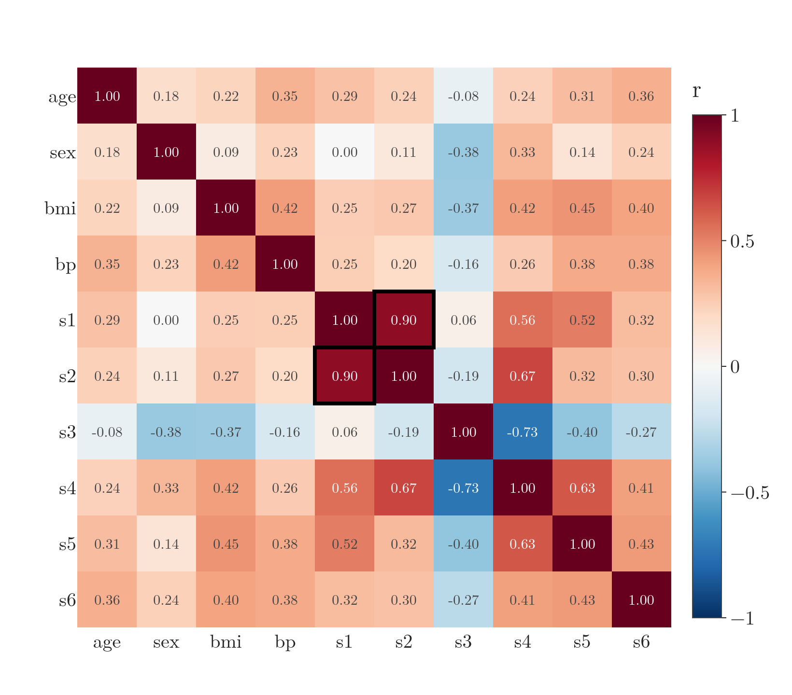
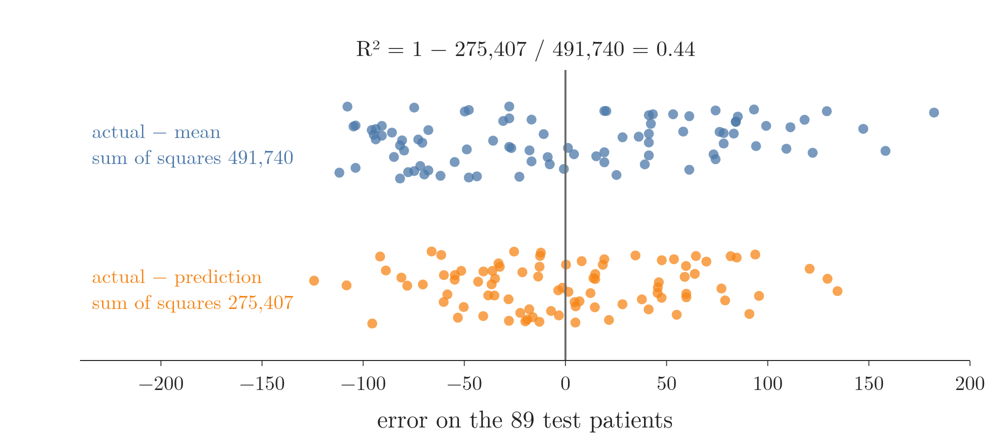
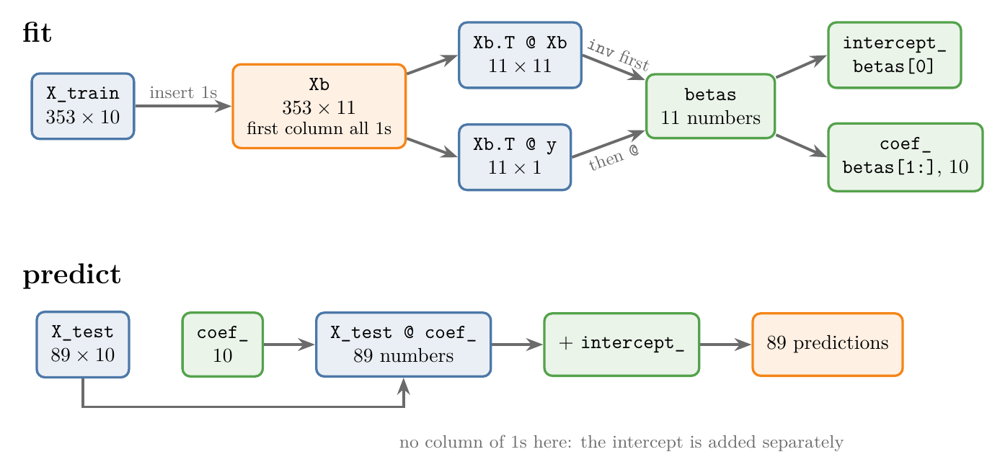
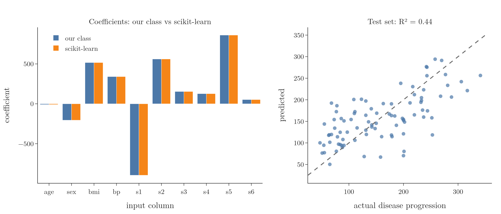
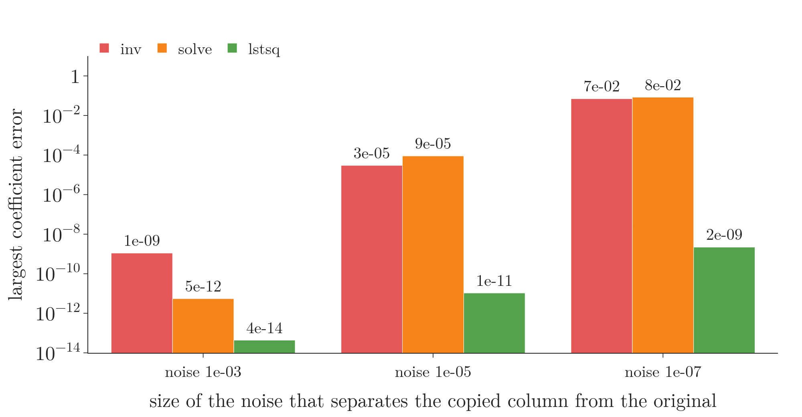

<!-- where-this-fits: generated by course_map/build_map.py; edit concepts.yaml, not this block -->
> **Where this fits:** Pipeline map step 8 (Model). See the [Course map](../../../00-course-map/00-course-map.md).
>
> 
>
> - **Builds on:** [Regression problems](../../../ML/01-foundations/ML-003-types-of-ml/ML-003-types-of-ml.md#1-overview); [Simple linear regression](../../../ML/06-regression/ML-049-simple-linear-regression/ML-049-simple-linear-regression.md#1-overview); [Ordinary least squares (closed form)](../../../ML/06-regression/ML-050-linear-regression-maths/ML-050-linear-regression-maths.md#2-two-ways-to-find-m-and-b); [Batch gradient descent](../../../ML/06-regression/ML-057-batch-gradient-descent/ML-057-batch-gradient-descent.md#4-batch-gradient-descent-in-code); [Linear combinations, span and basis](../../../MA/05-linear-algebra/MA-052-linear-combinations-span-and-basis/MA-052-linear-combinations-span-and-basis.md#4-coordinates-are-scalars-basis-vectors); [Jacobian and matrix gradients](../../../MA/06-calculus/MA-063-jacobian-and-matrix-gradients/MA-063-jacobian-and-matrix-gradients.md#4-the-jacobian).
> - **Leads to:** [Polynomial regression](../../../ML/06-regression/ML-060-polynomial-regression/ML-060-polynomial-regression.md#1-overview); [Ridge regression](../../../ML/06-regression/ML-062-ridge-regression-intuition/ML-062-ridge-regression-intuition.md#1-overview).
> - **Compare with:** [Gradient descent](../../../ML/06-regression/ML-056-gradient-descent/ML-056-gradient-descent.md#7-gradient-descent-as-a-class); [Moore-Penrose pseudo-inverse](../../../MA/05-linear-algebra/MA-060-svd-in-machine-learning/MA-060-svd-in-machine-learning.md#1-overview); [ANN for regression](../../../DL/01-basics/DL-013-graduate-admission-ann/DL-013-graduate-admission-ann.md#1-overview).
<!-- /where-this-fits -->

## 1. Overview

> **Key point:** The normal equation fits in three lines of NumPy. Our own class gives the same coefficients and the same R² (0.44) as scikit-learn on the diabetes data.

In plain words: one calculation takes the table of patients (the features) and the list of their targets and returns every number the model needs, in a single go, with no repeated training. [The derivation](../ML-053-multiple-lr-maths/ML-053-multiple-lr-maths.md#6-the-normal-equation) gives this calculation, the **normal equation** (G-1344), which gives every **coefficient** (G-407) of multiple linear regression at once. Written as a formula, with $X$ the table of features and $y$ the targets:

$$\beta = (X^{\mathsf T}X)^{-1}X^{\mathsf T}y$$

Here $\beta$ (beta) is the list of coefficients. $X^{\mathsf T}$ is the **transpose** (G-2012) of $X$: its rows and columns swapped, so the matrix with rows $(1, 2)$ and $(3, 4)$ becomes the matrix with rows $(1, 3)$ and $(2, 4)$. The exponent $-1$ marks the **inverse** (G-968), the matrix that undoes a matrix when they are multiplied. The rules are shown with numbers in [two rules about transposes](../ML-053-multiple-lr-maths/ML-053-multiple-lr-maths.md#41-two-rules-about-transposes).

This Note turns it into a class with `fit` (learn the coefficients from training data) and `predict` (use them on new rows), like scikit-learn's `LinearRegression`, and checks that both give the same answer.

## 2. The data

> **Key point:** 442 diabetes patients, 10 features, and a number to predict: how far the disease progressed one year later.

The example is scikit-learn's built-in **diabetes dataset** (G-600). Each **observation** (G-1374) (one record, one row of the data table) is a patient. The 10 **features** (G-772) (input variables, one column each) are:

- age and sex;
- body mass index (bmi);
- average blood pressure (bp);
- six blood measurements (s1 to s6).

The **target** (G-1949), the output we predict, is a number measuring disease progression one year later.

> **Extra:** The features come already scaled: each column is centred on 0 and shrunk so that its squares add up to 1 (scikit-learn docs, Diabetes dataset). The scaling explains why the values are small numbers such as 0.038. The target keeps its original scale, from 25 to 346.

Figure 1 shows how strongly each pair of features moves together on the training patients, measured by the **correlation** (G-490) $r$ (see [reading a correlation](../../../MA/01-descriptive-stats/MA-009-covariance-and-correlation/MA-009-covariance-and-correlation.md#41-reading-a-correlation)): 1 means two features rise and fall together exactly, 0 means no straight-line link. Figure 1 is a **heat map**: the square in row s1 and column s2 holds the r of that pair, printed as a number and coloured from dark blue ($-1$) through white (0) to dark red ($+1$). The diagonal is 1 because each feature matches itself. Watch the outlined pair: s1 (total cholesterol) and s2 (LDL cholesterol) have $r = 0.90$, close to copies of each other. Section 5 shows what this pair does to the coefficients.



We split the data 80/20, a **train-test split** (G-1998): 353 patients to train, 89 to test.

> **Python:** Loading and splitting.
>
> ```python
> from sklearn.datasets import load_diabetes
> from sklearn.model_selection import train_test_split
>
> X, y = load_diabetes(return_X_y=True)    # (442, 10), (442,)
> X_train, X_test, y_train, y_test = train_test_split(
>     X, y, test_size=0.2, random_state=2)
> ```

## 3. scikit-learn first

> **Key point:** scikit-learn's LinearRegression gives R² = 0.44 on the test patients, with 10 coefficients and an intercept of 151.88.

> **Python:** The reference result.
>
> ```python
> from sklearn.linear_model import LinearRegression
> from sklearn.metrics import r2_score
>
> reg = LinearRegression().fit(X_train, y_train)
> r2_score(y_test, reg.predict(X_test))   # 0.440
> reg.intercept_                          # 151.88
> ```

An **R² score** (G-1717) of 0.44 means the 10 measurements explain less than half the variation in disease progression: a useful but far from perfect model.

Figure 2 shows where the number comes from. R² compares two sums of squares on the 89 test patients:

- **total:** each actual value minus the mean of the actual values (blue), squared and added up: 491,740;
- **residual** (G-705): each actual value minus its prediction (orange), squared and added up: 275,407.

Then:

$$R^2 = 1 - 275{,}407 / 491{,}740$$
$$R^2 = 0.44$$

Watch the two rows: the model's errors (orange) spread less widely than the plain distances from the mean (blue), but not by much.



## 4. Our own class

> **Key point:** fit adds a column of 1s and applies the normal equation; predict multiplies the inputs by the coefficients and adds the intercept.

The class has two methods. `fit` learns the coefficients from the training data, and `predict` uses them on new data. Figure 3 follows the shapes of the arrays through both methods. Watch the column of 1s: `fit` adds it (10 columns become 11), and `predict` leaves it out and adds the intercept at the end instead.



### 4.1 fit

> **Key point:** Three steps: add the 1s, compute $\beta$, split it into intercept and coefficients.

1. **Add a column of 1s** at the front of $X$, so the **intercept** (G-960) is learned like any other coefficient. **`np.insert`** (G-1356), called as `np.insert(X, 0, 1, axis=1)`, inserts the value 1 at position 0 along the columns. The training data goes from 353 × 10 to 353 × 11.
2. **Apply the normal equation.** In NumPy, **`@`** (G-55) is matrix multiplication, `.T` is the **transpose** (G-2012) and **`np.linalg.inv`** (G-1357) the **inverse** (G-968). The result has 11 numbers.
3. **Split the result:** the first number is the intercept $\beta_0$, the other 10 are the coefficients.

[The worked example](../ML-053-multiple-lr-maths/ML-053-multiple-lr-maths.md#61-a-worked-example) does the same three steps by hand, with every number shown.

### 4.2 predict

> **Key point:** A prediction is the inputs times the 10 coefficients, plus the intercept $\beta_0$ added separately.

For new data we do not need the column of 1s: we multiply the inputs by the 10 coefficients and add the intercept separately. For the test set the product is an 89 × 10 matrix times a vector of 10, giving 89 predictions.

> **Python:** Multiple linear regression from scratch.
>
> ```python
> import numpy as np
>
> class MyMLR:
>     def fit(self, X, y):
>         # column of 1s at position 0, for the intercept
>         Xb = np.insert(X, 0, 1, axis=1)
>         # normal equation
>         betas = np.linalg.inv(Xb.T @ Xb) @ Xb.T @ y
>         self.intercept_ = betas[0]
>         self.coef_ = betas[1:]
>         return self
>
>     def predict(self, X):
>         return X @ self.coef_ + self.intercept_
>
> mine = MyMLR().fit(X_train, y_train)
> r2_score(y_test, mine.predict(X_test))   # 0.440
> ```

## 5. Comparing the two

> **Key point:** All 11 numbers agree with scikit-learn to within about 0.000000000003.

Figure 4 (left) puts the 10 coefficients side by side: the two models are indistinguishable. The largest difference is about $3 \times 10^{-12}$, a rounding effect.



The right panel plots the 89 test predictions against the true values. If the model were perfect, all points would lie on the dashed diagonal; the wide scatter is what an R² of 0.44 looks like.

The largest coefficients belong to s5 (+861), s1 ($-896$), s2 (+561) and bmi (+517). Because the features are standardised, these coefficients can be compared with each other.

> **Extra:** The large opposite coefficients of s1 and s2 are a typical sign of **multicollinearity** (G-1273): s1 (total cholesterol) and s2 (LDL cholesterol) are strongly related, so the model can trade weight between them almost freely, like two people carrying one box who can shift the load between them without the box moving. Collinearity makes the individual coefficients very uncertain (ISLR §3.3.3), so their sizes should not be over-interpreted. Regularisation, later, tames this effect. The Notebook checks all three points:
>
> - **Strongly related:** correlation 0.895; variance inflation factors 56 and 37, against under 2 for age, sex, bmi and bp.
> - **Trading weight:** over 200 bootstrap refits, the s1 and s2 coefficients swing far more than bmi's (standard deviation 464 and 369 against 77), in opposite directions (correlation $-0.97$).
> - **Regularisation:** ridge regression with a small penalty (`alpha=0.1`) gives s1 $-73$ and s2 $-81$.

## 6. Solving without an explicit inverse

> **Key point:** In practice, libraries solve the least-squares problem from $X$ itself instead of computing an inverse; the result is the same, and more accurate when features are nearly copies of each other.

The class above follows the formula word for word, inverse included. Libraries get the same coefficients by a safer route. Computing $(X^{\mathsf T}X)^{-1}$ explicitly is fine for a small example, but it can lose accuracy when the matrix is close to having no inverse. Two other NumPy functions give the same coefficients:

- `np.linalg.solve(Xb.T @ Xb, Xb.T @ y)` solves $X^{\mathsf T}X\beta = X^{\mathsf T}y$ directly.
- **`np.linalg.lstsq`** (G-1358), called as `np.linalg.lstsq(Xb, y)`, finds the least-squares solution from $X$ itself, without forming $X^{\mathsf T}X$.

Both agree with scikit-learn to within $10^{-11}$ here (see the Notebook). The safer one is `lstsq`: when one column is almost a copy of another, `inv` and `solve` both lose accuracy, while `lstsq`, which never forms $X^{\mathsf T}X$, stays accurate. scikit-learn's `LinearRegression` uses a least-squares solver of this second kind (scikit-learn docs, LinearRegression).

> **Extra:** The Notebook's test uses a made-up design with known coefficients, where one column is a copy of another plus tiny noise. With noise of size $10^{-5}$, the largest coefficient error is about $3 \times 10^{-5}$ with `inv`, $9 \times 10^{-5}$ with `solve` and $10^{-11}$ with `lstsq`. With noise of size $10^{-7}$, `inv` and `solve` are off by about 0.07 and 0.08, `lstsq` by only $2 \times 10^{-9}$.

Figure 5 plots these errors on a log scale, where each step up the axis means 100 times worse. Watch the green bars: `lstsq` stays at $2 \times 10^{-9}$ or better at every noise size, while `inv` and `solve` climb from $10^{-9}$ or less to about $10^{-1}$ as the copied column gets closer to the original.



## 7. Summary

| Step | Code | Why it matters |
|---|---|---|
| Add the intercept column | `np.insert(X, 0, 1, axis=1)` | the intercept is then learned like any other coefficient |
| Normal equation | `np.linalg.inv(Xb.T @ Xb) @ Xb.T @ y` | one calculation gives all 11 numbers, with no repeated training |
| Intercept and coefficients | `betas[0]`, `betas[1:]` | `predict` uses them separately, so new data needs no column of 1s |
| Predict | `X @ coef_ + intercept_` | one product gives every prediction |
| Result on diabetes data | R² = 0.44, same as scikit-learn | the match proves the class is right |

- The normal equation needs only matrix products, a transpose and an inverse, so it fits in three lines of NumPy.
- Our class reproduces `LinearRegression` to about twelve decimal places, because both solve the same least-squares problem.
- Real libraries avoid the explicit inverse; `lstsq`, which never forms $X^{\mathsf T}X$, stays accurate when features are nearly copies of each other, so prefer it on real data (with a near-copied column, `inv` was off by about 0.07 and `lstsq` by $2 \times 10^{-9}$).
- Together these answer the opening question: three lines of NumPy turn the normal equation into a class that matches scikit-learn's coefficients and R².


## 8. Sources

**Built from**

- CampusX, "Multiple Linear Regression | Part 3 | Code From Scratch", YouTube, https://www.youtube.com/watch?v=VmZWXzxmNrE

**Other references**

- ISLR: James, G., Witten, D., Hastie, T. and Tibshirani, R. (2021). *An Introduction to Statistical Learning*, 2nd ed. Springer. §3.3.3, Potential Problems: Collinearity.
- scikit-learn documentation, Toy datasets, *Diabetes dataset* (scikit-learn.org, datasets/toy_dataset).
- scikit-learn documentation, `sklearn.linear_model.LinearRegression`, Notes section (uses `scipy.linalg.lstsq`).

## 9. Key terms

| Term | Meaning |
|---|---|
| Feature | An input variable: one column of the data table |
| Observation | One record: one row of the data table |
| Target | The output we predict |
| Diabetes dataset | scikit-learn's built-in data of 442 patients, 10 standardised features, and disease progression one year later |
| Normal equation | $\beta = (X^{\mathsf T}X)^{-1}X^{\mathsf T}y$: the closed-form solution of linear regression |
| R² score (G-1717) | 1 minus the model's squared error divided by the squared error of always predicting the mean |
| Multicollinearity | A relationship between features, so that one can be calculated from the others |
| np.insert | NumPy function that inserts values into an array at a given position |
| @ (matrix multiplication) | Python's operator for multiplying matrices and vectors |
| np.linalg.inv | NumPy function that computes the inverse of a square matrix |
| np.linalg.lstsq | NumPy function that finds the least-squares solution of a linear system |
