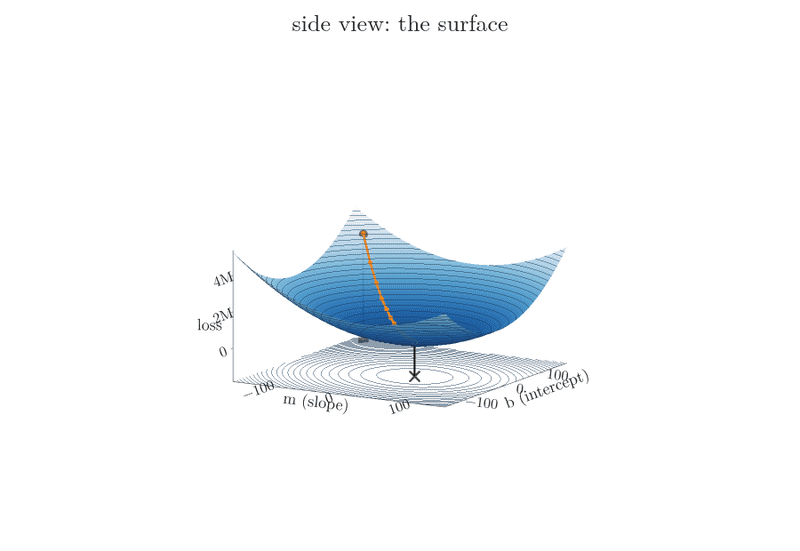

<!-- where-this-fits: generated by course_map/build_map.py; edit concepts.yaml, not this block -->
> **Where this fits:** Pipeline map step 8 (Model). See the [Course map](../../../00-course-map/00-course-map.md).
>
> 
>
> - **Builds on:** [Learning rate](../../../ML/01-foundations/ML-005-online-learning/ML-005-online-learning.md#5-the-learning-rate); [Feature scaling](../../../ML/03-feature-engineering/ML-023-standardization/ML-023-standardization.md#2-feature-scaling-in-brief); [Best-fit line and squared error](../../../ML/06-regression/ML-049-simple-linear-regression/ML-049-simple-linear-regression.md#34-the-best-fit-line); [Simple linear regression](../../../ML/06-regression/ML-049-simple-linear-regression/ML-049-simple-linear-regression.md#3-a-line-through-the-data); [Derivatives of one variable](../../../MA/06-calculus/MA-061-derivatives-of-one-variable/MA-061-derivatives-of-one-variable.md#4-the-derivative-shrinking-the-step-to-zero); [Partial derivatives and gradients](../../../MA/06-calculus/MA-062-partial-derivatives-and-gradients/MA-062-partial-derivatives-and-gradients.md#4-the-gradient); [Convex and non-convex loss](../../../MA/07-optimisation/MA-065-convex-and-non-convex-cost-functions/MA-065-convex-and-non-convex-cost-functions.md#3-the-chord-test).
> - **Leads to:** [Batch gradient descent](../../../ML/06-regression/ML-057-batch-gradient-descent/ML-057-batch-gradient-descent.md#2-gradient-descent-with-many-features); [Stochastic gradient descent](../../../ML/06-regression/ML-058-stochastic-gradient-descent/ML-058-stochastic-gradient-descent.md#3-how-stochastic-gradient-descent-works); [Mini-batch gradient descent](../../../ML/06-regression/ML-059-mini-batch-gradient-descent/ML-059-mini-batch-gradient-descent.md#3-how-it-works); [Ridge regression](../../../ML/06-regression/ML-062-ridge-regression-intuition/ML-062-ridge-regression-intuition.md#3-the-idea-penalise-large-coefficients); [Logistic regression](../../../ML/07-classification/ML-071-sigmoid-function/ML-071-sigmoid-function.md#5-sigmoid-as-a-probability); [Gradient boosting](../../../ML/08-trees-and-ensembles/ML-114-gradient-boosting-intuition/ML-114-gradient-boosting-intuition.md#2-boosting-passes-mistakes-forward); [Backpropagation](../../../DL/01-basics/DL-017-backpropagation-why/DL-017-backpropagation-why.md#1-overview); [Scaling inputs for neural networks](../../../DL/02-training/DL-023-data-scaling-in-ann/DL-023-data-scaling-in-ann.md#5-the-fix-scale-the-inputs); [L1 and L2 regularisation in neural networks](../../../DL/02-training/DL-026-regularization-in-dl/DL-026-regularization-in-dl.md#5-the-penalty-term); [Optimizers in deep learning](../../../DL/03-optimizers/DL-032-optimizers-in-deep-learning/DL-032-optimizers-in-deep-learning.md#3-what-an-optimizer-does).
> - **Compare with:** [Ordinary least squares (closed form)](../../../ML/06-regression/ML-050-linear-regression-maths/ML-050-linear-regression-maths.md#4-finding-the-minimum); [Normal equation](../../../ML/06-regression/ML-053-multiple-lr-maths/ML-053-multiple-lr-maths.md#6-the-normal-equation).
<!-- /where-this-fits -->

## 1. Overview

> **Key point:** Gradient descent finds the minimum of a function by starting anywhere and repeatedly taking a small step downhill, against the slope.

**Gradient descent** (G-862) is, in plain words, a method that finds the lowest point of a curve by taking small steps downhill, like walking down a hill with your eyes closed and feeling the ground under your feet. The textbook definition is: a first-order iterative optimisation algorithm for finding a local minimum of a differentiable function. Unpacked:

- **optimisation algorithm** (G-1398): it finds the values of parameters that make some function as small as possible;
- **iterative:** it does this in many small steps instead of with one formula;
- **first-order:** each step uses only the first derivative (the slope);
- **differentiable function:** the function must have a slope everywhere.

In ML, the function is the **loss function** (G-706; for linear regression, the sum of squared errors) and the parameters are the model's coefficients. Nearly all of deep learning is trained with a version of gradient descent (Goodfellow Ch. 8).

Throughout, a **feature** (G-772) is an input variable (one column of the data table), an **observation** (G-1374) is one record (one row, here one data point), and the **target** (G-1949) is the output we predict. We learn gradient descent on linear regression because we can check the answer against [ordinary least squares (OLS)](../ML-050-linear-regression-maths/ML-050-linear-regression-maths.md#2-two-ways-to-find-m-and-b), whose [normal equation](../ML-053-multiple-lr-maths/ML-053-multiple-lr-maths.md#7-the-cost-of-the-inverse) becomes slow with many features; most models have no direct formula at all.

## 2. The idea

> **Key point:** Standing on a curve with our eyes closed, the slope under our feet tells us which way is down. Step that way, and repeat.

### 2.1 Which way to move

> **Key point:** If the slope is positive, the minimum is to the left, so decrease the parameter. If the slope is negative, increase it.

Start with a single parameter, the intercept $b$, and keep the slope of the line fixed for now. The loss $L(b)$, as $b$ changes, is a U-shaped curve with its minimum at the best $b$.

Imagine standing somewhere on that curve, blindfolded. We cannot see where the bottom is. But we can feel the slope under our feet:

- **Slope positive** (the curve rises to the right): the bottom is to the left. Decrease $b$.
- **Slope negative** (the curve falls to the right): the bottom is to the right. Increase $b$.

In both cases, moving **against the sign of the slope** goes downhill. Moving against the slope is the whole idea.

Figure 1 shows the rule at four places on the loss curve of the example in Section 4. The two orange points sit where the curve rises to the right (slope positive), and their arrows point left. The two red points sit where it falls (slope negative), and their arrows point right. Every arrow points towards the bottom.


### 2.2 How far to move

> **Key point:** The step is the slope times a small number, the learning rate: $b_{\text{new}} = b_{\text{old}} - \eta \cdot \text{slope}$.

In words: subtract from the current value the slope multiplied by a small constant $\eta$ (eta), the **learning rate** (G-1068).

$$b_{\text{new}} = b_{\text{old}} - \eta \thinspace\frac{\partial L}{\partial b}$$

The symbol $\dfrac{\partial L}{\partial b}$ is the slope of the loss $L$ when only $b$ is changed (a **partial derivative**; Section 6 names it fully). It is the "slope" of the Key point above.

Two things happen automatically:

- The minus sign handles the direction (Section 2.1).
- Far from the bottom the slope is steep, so the steps are big; near the bottom the slope flattens, so the steps shrink. In Figure 1, the slope at $b = 100$ is 591 and the step is 59.1; at $b = 60$, closer to the bottom, the slope is 271 and the step only 27.1.

The learning rate keeps the steps from being too large. Without it, a slope of 590 would throw $b$ 590 units away in one jump.

### 2.3 When to stop

> **Key point:** Stop after a fixed number of steps (epochs), or when the steps become tiny.

Two common stopping rules:

1. **A fixed number of iterations**, called **epochs** (G-696): for example, 100 updates.
2. **The step size becomes negligible**: for example, when $b_{\text{new}} - b_{\text{old}}$ is below 0.0001, the algorithm has reached (almost) the bottom.

A plot of the loss after each epoch shows the same thing: once the curve goes flat, more epochs change nothing, so that is where to stop (the right panels of Figures 7 and 8).

## 3. The slope of the loss with respect to b

> **Key point:** For the sum of squared errors, $\dfrac{\partial L}{\partial b} = -2\sum (y_i - m x_i - b)$.

Gradient descent needs the slope of the loss at the current $b$. For linear regression the loss is

$$L(m, b) = \sum_{i=1}^{n} (y_i - m x_i - b)^2$$

In words: differentiate each squared term with respect to $b$. The **chain rule** (G-371) brings down a factor 2, and the inner derivative of $-b$ is $-1$.

$$\frac{\partial L}{\partial b} = -2\sum_{i=1}^{n} (y_i - m x_i - b)$$

The OLS derivation used the same derivative. There we set it to zero and solved; here we only evaluate it at the current point and take a step.

The sum inside is just the residuals added up. Figure 2 evaluates it on the 4-point example of the next section, at $m = 78.35$ and $b = 100$. The line sits above all four points, so all four residuals are negative: $-37.0$, $-124.4$, $-119.4$ and $-14.7$. They add up to $-295.4$. Multiplying by $-2$ gives the slope:

$$-2 \times (-295.4) = 590.7$$

The slope is positive, so the next step lowers $b$.


## 4. A worked example: four points, b only

> **Key point:** Starting from b = 100 with learning rate 0.1, three steps give 40.93, 29.11 and 26.75, closing in on the OLS value 26.16.

The example data has 4 points. OLS gives slope $m = 78.35$ and intercept $b = 26.16$. To see gradient descent alone, we fix $m = 78.35$ and start $b$ deliberately far away, at $b = 100$, with learning rate $\eta = 0.1$.

{height=55%}

Figure 3 shows the loss curve $L(b)$ and the steps.

1. **Step 1:** at $b = 100$ the slope is $590.7$.
   $$\text{step} = 0.1 \times 590.7 = 59.07$$
   $$b = 100 - 59.07 = 40.93$$
2. **Step 2:** at $b = 40.93$ the slope is $118.1$.
   $$\text{step} = 0.1 \times 118.1 = 11.81$$
   $$b = 40.93 - 11.81 \approx 29.11$$
   (the slopes and steps shown are rounded, so the last digit can differ).
3. **Step 3:** at $b = 29.11$ the slope is $23.6$.
   $$\text{step} = 0.1 \times 23.6 = 2.36$$
   $$b = 29.11 - 2.36 = 26.75$$
4. **Steps 4 and 5:** $b = 26.28$, then $26.18$, almost exactly the OLS value 26.16.

| Step | $b$ before | Slope | Step $= 0.1 \times$ slope | $b$ after |
|---|---|---|---|---|
| 1 | 100.00 | 590.7 | 59.07 | 40.93 |
| 2 | 40.93 | 118.1 | 11.81 | 29.11 |
| 3 | 29.11 | 23.6 | 2.36 | 26.75 |
| 4 | 26.75 | 4.7 | 0.47 | 26.28 |
| 5 | 26.28 | 0.9 | 0.09 | 26.18 |

Figure 4 shows the same five steps from both sides at once. On the left, the line slides down towards the four points and its residuals (red) shrink. On the right, the point slides down the loss curve; the black tangent is the slope at the current $b$, and the green arrow is the step. Watch the arrow: 59.07, then 11.81, then 2.36. As the tangent flattens, the arrow shrinks.


Each slope is about one fifth of the previous one, so each step shrinks too. Nothing in the rule tells the algorithm to slow down: the flattening curve does it. Here the distance to the bottom shrinks to exactly one fifth at every step (the Extra below shows why).

> **Extra:** Why exactly one fifth? With $m$ fixed, call $b^\ast$ the best intercept, where the slope is zero: $\sum (y_i - m x_i - b^\ast) = 0$. Then
>
> $$\frac{\partial L}{\partial b} = -2\sum_{i=1}^{n} (y_i - m x_i - b) = 2n\thinspace(b - b^\ast)$$
>
> so the update becomes
>
> $$b_{\text{new}} - b^\ast= (1 - 2n\eta)\thinspace(b_{\text{old}} - b^\ast)$$
>
> With $n = 4$ points and $\eta = 0.1$, the distance to $b^\ast$ is multiplied at every step by the factor
>
> $$1 - 2n\eta = 1 - 0.8 = 0.2$$
>
> so it goes $73.84$, then $14.77$, then $2.95$. With $\eta = 0.26$ (next section) the factor is
>
> $$1 - 2.08 = -1.08$$
>
> The minus sign flips $b$ to the other side, and the distance grows by 8% each step. Any $\eta$ above $0.25$ diverges on this data.

## 5. The learning rate

> **Key point:** Too small and gradient descent crawls; too large and it overshoots and can run away. The right value is found by trying.

The learning rate is a **hyperparameter** (G-910): a setting we choose, not a value the algorithm learns. Figure 5 starts from the same $b = 100$ with three learning rates.


- **0.01, too small:** after 10 steps $b$ has only moved from 100 to 58. $b$ would reach the bottom eventually, but slowly.
- **0.1, good:** the bottom is reached within about 5 steps.
- **0.26, too large:** each step jumps over the bottom to the other side, landing higher than before: $100 \to -53.6 \to 112.3 \to -66.9 \to \dots$. The loss grows with every step, and the algorithm never **converges** (G-469): it **diverges** (G-628). (The Extra in Section 4 shows why: above 0.25, every step overshoots by more than it gains.)

A common approach is to try a few values on a logarithmic scale, such as 0.1, 0.01 and 0.001 (Goodfellow §11.4.3), and keep the one where the loss falls fastest without jumping around.

## 6. Both parameters: m and b together

> **Key point:** With two parameters, compute both slopes and update both at the same step. The point walks downhill across the loss bowl.

In practice both $m$ and $b$ are unknown. The loss is then a function of two inputs, the sum of the squared residuals of the 100 points:

$$L(m, b) = \sum_{i=1}^{100} (y_i - m x_i - b)^2$$

For example, the line $m = -127.8$, $b = 150$ has $L = 4.2$ million, and the line $m = 27.2$, $b = -1.9$ has $L = 28{,}400$. Gradient descent needs one slope per parameter.

The slope with respect to $b$ is as before. With respect to $m$, the inner derivative of $-m x_i$ is $-x_i$:

$$\frac{\partial L}{\partial m} = -2\sum_{i=1}^{n} (y_i - m x_i - b)\thinspace x_i$$

Each epoch updates both at once, using the current values of both:

$$m_{\text{new}} = m_{\text{old}} - \eta \frac{\partial L}{\partial m}$$

$$b_{\text{new}} = b_{\text{old}} - \eta \frac{\partial L}{\partial b}$$

The vector of these **partial derivatives** (G-1457) is called the **gradient** (G-863); it points uphill, in the direction where the loss rises fastest, so stepping against it goes downhill. Stepping down against the gradient gives the method its name.

The gradient can be read one number at a time. At the starting point of Figure 7 it is $(-25{,}362,\ 28{,}641)$:

- **The sign** of each number gives the direction for that parameter: negative for $m$, so $m$ must increase; positive for $b$, so $b$ must decrease.
- **The size** says how much the loss reacts to that parameter right now. A number three times larger would mean a small change to that parameter moves the loss three times as much. Here the two sizes are similar, so the first step moves both by a similar amount: $m$ by $+25.4$ and $b$ by $-28.6$.

Figure 6 runs this on 100 points, starting far away at $m = -127.8$, $b = 150$, with learning rate 0.001 for 30 epochs. Think of $(m, b)$ as a point on the floor and $L$ as the height above it: the loss is a surface, a smooth bowl with one lowest point. The same idea was drawn for [the placement data](../ML-050-linear-regression-maths/ML-050-linear-regression-maths.md#41-the-shape-of-e) (its Figure 1); here is the surface of this Note's 100 points. The orange path is the descent, the grey square its start and the black cross the lowest point it reaches. Thin lines on the surface join points of equal loss and are dropped onto the floor; at the end the camera looks straight down. A [contour map](../../../MA/06-calculus/MA-062-partial-derivatives-and-gradients/MA-062-partial-derivatives-and-gradients.md#11-reading-a-contour-map) is this view from above: each line joins points at the same height.



Lines close together mean a steep slope; the centre of the rings is the lowest point. Figure 7 shows that map with the path and the loss after each epoch.


The left panel is a **contour plot** (G-468): a map of the bowl seen from above, with each ring joining points of equal loss and the darkest region at the bottom. The path heads straight down the bowl and arrives at $m = 27.2$, $b = -1.9$. The right panel shows the loss falling from about 4.2 million to 28,400, quickly at first and then levelling off. Its vertical axis is a log scale: each labelled gridline (100k, 1M) is ten times the one below, so the early fall is much bigger than it looks.

## 7. Gradient descent as a class

> **Key point:** A small class with fit (the update loop) and predict reproduces LinearRegression's answer to within a few hundredths.

> **Python:** Gradient descent for simple linear regression.
>
> ```python
> class GDRegressor:
>     def __init__(self, learning_rate, epochs):
>         self.m, self.b = 100.0, -120.0      # any start
>         self.lr, self.epochs = learning_rate, epochs
>
>     def fit(self, X, y):
>         x = X.ravel()
>         for _ in range(self.epochs):
>             slope_b = -2 * np.sum(y - self.m * x - self.b)
>             slope_m = -2 * np.sum((y - self.m * x - self.b) * x)
>             self.b -= self.lr * slope_b
>             self.m -= self.lr * slope_m
>         return self
>
>     def predict(self, X):
>         return self.m * X.ravel() + self.b
> ```

On 80 training points with learning rate 0.001 and 50 epochs:

| | Slope $m$ | Intercept $b$ | Test R² ([share of variation explained](../ML-051-regression-metrics/ML-051-regression-metrics.md#6-r²-score)) |
|---|---|---|---|
| OLS (`LinearRegression`) | 28.126 | $-2.271$ | 0.6345 |
| Gradient descent | 28.159 | $-2.300$ | 0.6344 |

Gradient descent gets within 0.03 of the exact answer: an approximation, but a very close one. Figure 8 shows the run. The line starts steep ($m = 100$, $b = -120$) and swings onto the OLS line within about 20 epochs; the loss falls from about 1.5 million to about 24,000 and then levels off.


## 8. The shape of the loss function matters

> **Key point:** Linear regression's loss is convex: one bowl with no false dips, and gradient descent with a small enough learning rate finds its bottom. Other losses can trap it in a local minimum or slow it on a flat stretch.

Gradient descent only follows the local slope, so the shape of the loss function decides how well it works (Figure 9).


- **Convex:** a function is **convex** (G-476) when a straight line between any two points on its curve never goes below the curve. Such a function has no false dips: any local minimum is also the global one (Boyd and Vandenberghe §4.2.2). The sum of squared errors of linear regression is convex, so gradient descent with a small enough learning rate reaches the best answer (Section 5 shows what a too-large one does).
- **Non-convex, with a local minimum:** a straight line between two points can cut through the curve. Then there can be several dips: a **local minimum** (G-1110; lowest only in its neighbourhood) and a **global minimum** (G-848; lowest of all). Started near the local one, gradient descent settles there and stops, unaware that a better answer exists.
- **A plateau** (G-1503): a nearly flat stretch has a tiny slope, so the steps become tiny and progress almost stops. With too few epochs, the algorithm halts before leaving the plateau. In more dimensions, a related trouble spot is a **saddle point** (G-1718), flat in one direction and curved in another.

Figure 10 runs gradient descent on the middle curve of Figure 9 from two starting points, with the same learning rate. Picture each run as a ball rolling downhill. Start A rolls into the global minimum (loss 0.23). Start B rolls into the local minimum (loss 1.44) and stays there: the slope is zero, so the steps are zero. Where gradient descent ends depends on where it starts.

{height=40%}

> **Extra:** Neural networks have non-convex losses (Goodfellow §8.2). One remedy is to start from several different points and keep the best result. Others, such as **momentum** (Goodfellow §8.3.2) and adaptive learning rates (Goodfellow §8.5), come with neural networks.

## 9. The effect of feature scaling

> **Key point:** When features are on very different scales, the loss bowl becomes a long, narrow valley: gradient descent drops quickly to the valley floor, then crawls along it. Scaling the features makes the bowl round and the descent fast.

With two features, the shape of the loss depends on their scales. Picture walking down a steep, narrow gorge whose floor slopes gently: the walls are so steep that a big step would throw you against the opposite wall, so you must take tiny steps, and tiny steps make little progress along the gentle floor. Figure 11 compares the same made-up data, with feature 2 eight times larger in scale than feature 1, before and after standardising. The loss of each case is a surface (top row, height $\log L$), and the contour map below it is that surface seen from above (see Figure 6 for the tilt): lines close together mean steep walls, and the centre ring, marked with the green cross, is the lowest point.


- **Unscaled:** the contours are long, narrow ellipses. The learning rate must be small enough to avoid overshooting in the steep direction, and that is usually too small to make real progress in the flat direction (Goodfellow §4.3.1). After 40 steps the weights are still 2.8 away from the best values.
- **Standardised:** the contours are nearly circles, the slope points straight at the minimum, and 40 steps reach it.

Features should therefore be scaled (**standardisation** (G-1874; [rescaling each feature to mean 0 and spread 1](../../03-feature-engineering/ML-023-standardization/ML-023-standardization.md#4-the-standardization-formula)) or normalisation) before using gradient descent.

## 10. Summary

| Idea | In one line | Why it matters |
|---|---|---|
| Update rule | parameter $\leftarrow$ parameter $- \eta \times$ slope | the minus sign always steps downhill |
| Slope for $b$ | $-2\sum (y_i - m x_i - b)$ | it is just the residuals added up, times $-2$ |
| Slope for $m$ | $-2\sum (y_i - m x_i - b)\thinspace x_i$ | each residual is weighted by its $x$ |
| Learning rate $\eta$ | too small: slow; too large: overshoots and diverges | it is chosen by trying, such as 0.1, 0.01, 0.001 |
| Stopping | fixed number of epochs, or tiny steps | once the loss curve goes flat, more epochs change nothing |
| Convex loss | every local minimum is the global one (linear regression) | gradient descent then reaches the best answer |
| Non-convex loss | local minima, plateaus, saddle points can trap it | where it ends depends on where it starts |
| Feature scaling | round contours, faster convergence | unscaled, 40 steps still left the weights 2.8 away |

- Gradient descent works for any differentiable loss, which is why it powers most of ML.
- On linear regression it reproduces OLS closely: slope 28.16 against 28.13 here, so it can replace the normal equation when that becomes too slow.
- The steps shrink by themselves near the minimum, because the slope shrinks.
- Together these answer the opening question: start anywhere, step against the slope by a learning-rate-sized amount, and repeat until the steps are tiny.


## 11. Sources

**Built from**

- CampusX, "Gradient Descent From Scratch | End to End Gradient Descent | Gradient Descent Animation", YouTube, https://www.youtube.com/watch?v=ORyfPJypKuU
- StatQuest with Josh Starmer, "Gradient Descent, Step-by-Step", YouTube, https://www.youtube.com/watch?v=sDv4f4s2SB8 (the data and the loss curve side by side, with each step's slope and step size, Figure 4)
- Sanderson, G. (3Blue1Brown), "Gradient descent, how neural networks learn | Deep Learning Chapter 2", YouTube, https://www.youtube.com/watch?v=IHZwWFHWa-w (the ball rolling into different valleys, Figure 10; reading the sizes of the gradient's components, section 6)

**Other references**

- **Goodfellow**: I. Goodfellow, Y. Bengio, A. Courville, *Deep Learning*, MIT Press, 2016 (deeplearningbook.org). §4.3.1 (poor conditioning), Ch. 8 (training deep models; §8.2 non-convexity, §8.3.2 momentum, §8.5 adaptive learning rates), §11.4.3 (grid search on a log scale).
- **Boyd and Vandenberghe**: S. Boyd and L. Vandenberghe, *Convex Optimization*, Cambridge University Press, 2004. §4.2.2 (local optima of convex problems are global).

## 12. Key terms

Terms taught in this Note come first; linked terms are recaps, taught in the Note the link opens.

| Term | Meaning |
|---|---|
| Gradient descent (G-862) | Finding the lowest point of a function by repeated small steps downhill. |
| Optimisation algorithm (G-1398) | A method for finding the parameter values that make a function as small (or large) as possible. |
| Diverge (divergence) (G-628) | To move further away with each step: the updates overshoot more and more, so the loss grows instead of shrinking. |
| Convex function (G-476) | A function where a straight line between any two points of its curve never goes below the curve; it has a single minimum. |
| Local minimum (G-1110) | A point lower than everything around it, but not the lowest overall. |
| Global minimum (G-848) | The lowest point of the whole function. |
| Plateau (G-1503) | A nearly flat region of the loss, where steps become very small. |
| [Loss function (error function)](../../../ML/06-regression/ML-050-linear-regression-maths/ML-050-linear-regression-maths.md#32-adding-the-errors-up) (G-706) | A formula that measures how wrong a model's predictions are; in deep learning, the error on one training row. |
| [Feature](../../../ML/01-foundations/ML-002-ai-vs-ml-vs-dl/ML-002-ai-vs-ml-vs-dl.md#52-features-chosen-by-us-or-learned) (G-772) | One piece of information about each example that a model uses (e.g. a student's CGPA). |
| [Observation](../../../ML/01-foundations/ML-003-types-of-ml/ML-003-types-of-ml.md#21-learning-from-inputs-and-outputs) (G-1374) | One record of a dataset: one row of the data table. |
| [Target](../../../ML/01-foundations/ML-003-types-of-ml/ML-003-types-of-ml.md#21-learning-from-inputs-and-outputs) (G-1949) | The output column we predict, such as the class; also called the label. |
| [Learning rate ($\eta$)](../../../ML/01-foundations/ML-005-online-learning/ML-005-online-learning.md#5-the-learning-rate) (G-1068) | How strongly each update changes the model; in gradient descent, the number the slope is multiplied by to get the step size. |
| [Epoch](../../../DL/01-basics/DL-005-perceptron-trick/DL-005-perceptron-trick.md#7-loops-and-epochs) (G-696) | One full update of the parameters using the whole training set. |
| [Chain rule](../../../ML/07-classification/ML-073-sigmoid-derivative/ML-073-sigmoid-derivative.md#2-two-rules-we-need) (G-371) | To differentiate a function of a function, multiply the outer derivative by the inner derivative. |
| [Hyperparameter](../../../ML/03-feature-engineering/ML-028-pipelines/ML-028-pipelines.md#9-hyperparameter-tuning-with-a-pipeline) (G-910) | A setting of an algorithm chosen before training, such as a tree's `max_depth`. |
| [Converge](../../../DL/01-basics/DL-017-backpropagation-why/DL-017-backpropagation-why.md#9-when-to-stop-convergence) (G-469) | To settle at a minimum, with steps becoming negligible. |
| [Partial derivative](../../../ML/06-regression/ML-050-linear-regression-maths/ML-050-linear-regression-maths.md#41-the-shape-of-e) (G-1457) | The slope of a function of several variables in one variable, holding the others fixed. |
| [Gradient (of the loss)](../../../DL/01-basics/DL-015-backpropagation-what/DL-015-backpropagation-what.md#1-overview) (G-863) | How fast the loss changes with each weight and bias, collected in one vector (the partial derivatives of the loss); it points in the direction in which the loss rises fastest. |
| [Contour plot](../../../MA/06-calculus/MA-062-partial-derivatives-and-gradients/MA-062-partial-derivatives-and-gradients.md#11-reading-a-contour-map) (G-468) | A map of a surface seen from above, with lines joining points of equal height, so a 3D shape such as a loss bowl can be drawn and read on flat paper. |
| [Saddle point](../../../DL/03-optimizers/DL-032-optimizers-in-deep-learning/DL-032-optimizers-in-deep-learning.md#55-saddle-points) (G-1718) | A flat point that curves up in one direction and down in another. |
| [Standardization](../../../ML/03-feature-engineering/ML-023-standardization/ML-023-standardization.md#41-the-idea-how-many-standard-deviations-from-the-mean) (G-1874) | Scaling a column to mean 0 and standard deviation 1 (subtract the mean, divide by the standard deviation), so features measured on different scales become comparable. |
