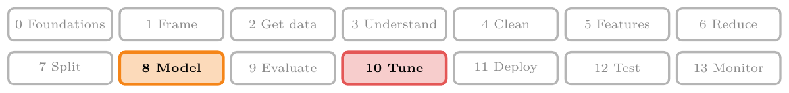
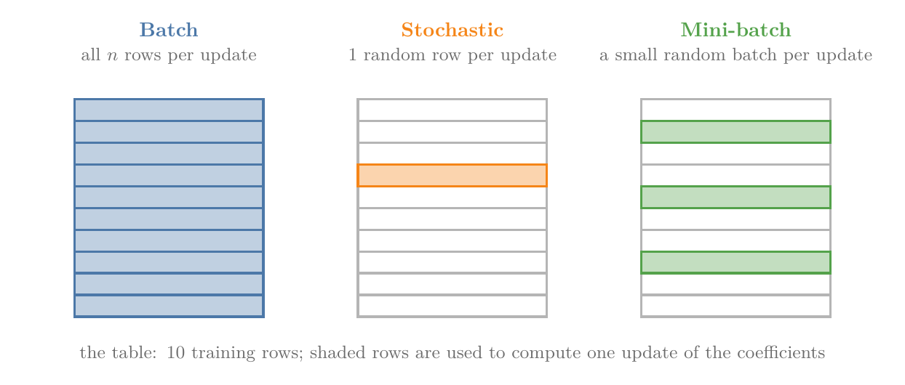
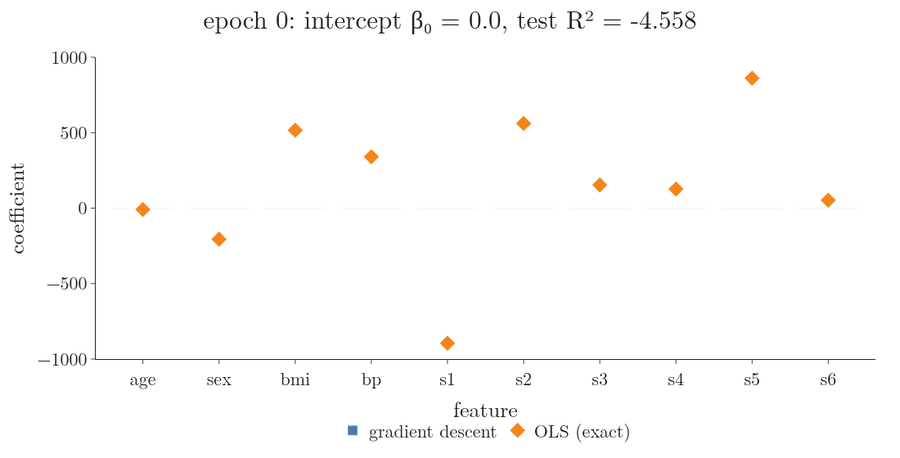
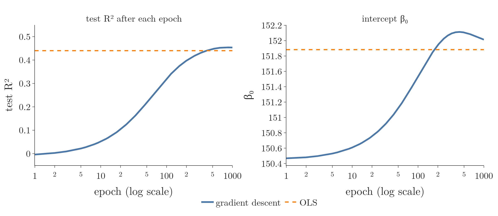
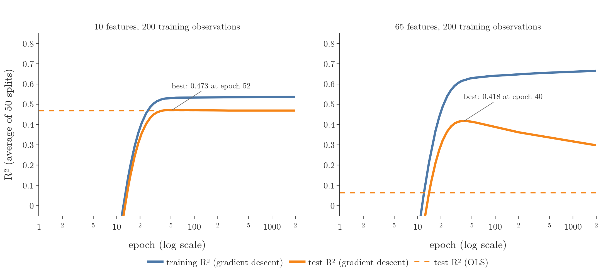

<!-- where-this-fits: generated by course_map/build_map.py; edit concepts.yaml, not this block -->
> **Where this fits:** Pipeline map steps 8 (Model), 10 (Tune). See the [Course map](../../../00-course-map/00-course-map.md).
>
> 
>
> - **Builds on:** [Overfitting](../../../ML/01-foundations/ML-007-challenges-in-ml/ML-007-challenges-in-ml.md#71-overfitting); [Gradient descent](../../../ML/06-regression/ML-056-gradient-descent/ML-056-gradient-descent.md#2-the-idea).
> - **Used here, taught in full later:** [Training curves (History)](../../../DL/01-basics/DL-011-customer-churn-ann/DL-011-customer-churn-ann.md#8-training-curves).
> - **Leads to:** [Batch size in Keras](../../../DL/02-training/DL-020-gradient-descent-in-neural-networks/DL-020-gradient-descent-in-neural-networks.md#6-choosing-the-variant-in-keras-batch_size); [Improving a neural network](../../../DL/02-training/DL-021-improving-a-neural-network/DL-021-improving-a-neural-network.md#3-tuning-the-hyperparameters).
> - **Compare with:** [Stochastic gradient descent](../../../ML/06-regression/ML-058-stochastic-gradient-descent/ML-058-stochastic-gradient-descent.md#3-how-stochastic-gradient-descent-works).
<!-- /where-this-fits -->

## 1. Overview

> **Key point:** The three kinds of gradient descent differ only in how many observations they use for each update: all of them (batch), one (stochastic), or a small group (mini-batch).

A **feature** (G-772) is an input variable (one column of the data table), an **observation** (G-1374) is one record (one row), and the **target** (G-1949) is the output we predict.

Gradient descent comes in three main types. The update rule is the same in all three; they differ in how many training observations are used to compute each update (Figure 1).



| Type | Observations per update | Updates per epoch ($n$ observations) |
|---|---|---|
| **Batch gradient descent** (G-264) | all $n$ | 1 |
| **Stochastic gradient descent (SGD)** (G-1892) | 1, chosen at random | $n$ |
| **Mini-batch gradient descent** (G-1222) | a small random group, for example 32 | $n$ / batch size |

[Gradient descent on one feature](../ML-056-gradient-descent/ML-056-gradient-descent.md#2-the-idea) already used batch gradient descent. This Note extends it to any number of features, writes it with matrices, and codes it. [Stochastic gradient descent](../ML-058-stochastic-gradient-descent/ML-058-stochastic-gradient-descent.md#3-how-stochastic-gradient-descent-works) and [mini-batch gradient descent](../ML-059-mini-batch-gradient-descent/ML-059-mini-batch-gradient-descent.md#3-how-it-works) are taught next.

## 2. Gradient descent with many features

> **Key point:** With m features there are m + 1 coefficients, each with its own derivative; all are updated at the same step.

For multiple linear regression with $m$ features, the model is

$$\hat y_i = \beta_0 + \beta_1 x_{i1} + \beta_2 x_{i2} + \dots + \beta_m x_{im}$$

and there are $m + 1$ coefficients to find. Batch gradient descent:

1. **Start** with any values, for example $\beta_0 = 0$ and every other $\beta_j = 1$.
2. **Each epoch** (one pass over all the observations): compute the predictions for all observations, then the derivative of the loss with respect to every coefficient, then update all of them at once:

   $$\beta_j \leftarrow \beta_j - \eta \frac{\partial L}{\partial \beta_j} \quad \text{for } j = 0, 1, \dots, m$$

   Here $\eta$ (eta) is the learning rate, the size of each step, and $\partial L/\partial \beta_j$ is how much the loss $L$ changes for a small change of $\beta_j$ alone.

3. **Repeat** for a fixed number of epochs.

The loss used here is the **mean squared error loss** (G-1201):

$$L = \frac{1}{n}\sum (y_i - \hat y_i)^2$$

Dividing by $n$ keeps the size of the derivatives independent of how many observations there are, so the same **learning rate** (G-1068) works for small and large datasets. The division does not change the answer: the coefficients that make the total squared error smallest also make the mean squared error smallest, because the two differ only by the constant factor $n$.

Figure 2 shows step 2 on real data: the run of Section 4 on the diabetes data, with 10 features. All 10 coefficients start at 1 and the intercept at 0. At every epoch each one moves by its own derivative, at the same time. The intercept jumps to 150.5 in the first epoch, because its derivative is just the average error; the 10 coefficients grow slowly towards the OLS values (diamonds), the large ones such as bmi and s5 first.



## 3. The derivatives

> **Key point:** The derivative for coefficient j is the errors multiplied by column j of the data, averaged, times $-2$. The intercept uses a column of 1s.

### 3.1 With two features

> **Key point:** Writing out the loss for two features shows the pattern: each coefficient's derivative weights the errors by its own feature.

With two features, the prediction is:

$$\hat y_i = \beta_0 + \beta_1 x_{i1} + \beta_2 x_{i2}$$

Differentiating the mean squared error with the **chain rule** (G-371), as in [the slope of the loss](../ML-056-gradient-descent/ML-056-gradient-descent.md#3-the-slope-of-the-loss-with-respect-to-b):

$$\frac{\partial L}{\partial \beta_0} = -\frac{2}{n}\sum_{i=1}^{n}(y_i - \hat y_i)$$

$$\frac{\partial L}{\partial \beta_1} = -\frac{2}{n}\sum_{i=1}^{n}(y_i - \hat y_i)\thinspace x_{i1}$$

$$\frac{\partial L}{\partial \beta_2} = -\frac{2}{n}\sum_{i=1}^{n}(y_i - \hat y_i)\thinspace x_{i2}$$

### 3.2 Any number of features

> **Key point:** The general rule: for coefficient j, multiply each observation's error by that observation's value of feature j.

In words: for coefficient $\beta_j$, take each observation's error, multiply it by that observation's value of feature $j$, add these up, and multiply by $-2/n$.

$$\frac{\partial L}{\partial \beta_j} = -\frac{2}{n}\sum_{i=1}^{n}(y_i - \hat y_i)\thinspace x_{ij}$$

The intercept fits the same rule if we imagine a column of 1s for it (as in [the normal equation](../ML-054-multiple-lr-code/ML-054-multiple-lr-code.md#4-our-own-class)): multiplying by 1 changes nothing.

With numbers, for a tiny case of $n = 2$ observations with errors $(3, -1)$ and feature $j$ values $(2, 4)$:

$$3 \times 2 = 6$$

$$(-1) \times 4 = -4$$

$$\frac{\partial L}{\partial \beta_j} = -\frac{2}{2}(6 - 4)$$

$$= -2$$

The derivative is negative, so this coefficient will increase.

### 3.3 All derivatives at once

> **Key point:** All m derivatives together are one matrix product: $-\frac{2}{n} X^{\mathsf T}(y - \hat{y})$.

Computing each derivative in a loop over rows and columns works but is slow in Python. The sum "errors times column $j$" for every $j$ at once is exactly a matrix product (Figure 3).


$$\frac{\partial L}{\partial \beta} = -\frac{2}{n} X^{\mathsf T}(y - \hat{y})$$

$X^{\mathsf T}$ has one row per feature; multiplying it by the vector of $n$ errors gives one number per column. A full epoch by hand, on two observations. The data are $(x, y) = (1, 2)$ and $(3, 3)$, the start is $\beta_0 = 0$ and $\beta_1 = 1$, and $\eta = 0.1$. The matrix $X$ has a column of 1s (for the intercept) and a column of the $x$ values:

$$X = \begin{pmatrix} 1 & 1 \cr1 & 3 \end{pmatrix}$$

The predictions:

$$\hat y = \begin{pmatrix} 0 + 1 \times 1 \cr0 + 1 \times 3 \end{pmatrix}$$

$$\hat y = \begin{pmatrix} 1 \cr3 \end{pmatrix}$$

The errors:

$$y - \hat y = \begin{pmatrix} 2 - 1 \cr3 - 3 \end{pmatrix}$$

$$y - \hat y = \begin{pmatrix} 1 \cr0 \end{pmatrix}$$

The product with $X^{\mathsf T}$, which has the same entries as $X$ here:

$$X^{\mathsf T}(y - \hat y)$$

$$= \begin{pmatrix} 1 & 1 \cr1 & 3 \end{pmatrix}\begin{pmatrix} 1 \cr0 \end{pmatrix}$$

$$X^{\mathsf T}(y - \hat y) = \begin{pmatrix} 1 \times 1 + 1 \times 0 \cr1 \times 1 + 3 \times 0 \end{pmatrix}$$

$$X^{\mathsf T}(y - \hat y) = \begin{pmatrix} 1 \cr1 \end{pmatrix}$$

$$\frac{\partial L}{\partial \beta} = -\frac{2}{2}\begin{pmatrix} 1 \cr1 \end{pmatrix} = \begin{pmatrix} -1 \cr-1 \end{pmatrix}$$

$$\beta_0 \leftarrow 0 - 0.1 \times (-1) = 0.1$$

$$\beta_1 \leftarrow 1 - 0.1 \times (-1) = 1.1$$

The loss before the epoch:

$$\frac{1^2 + 0^2}{2} = 0.5$$

After it, the predictions are:

$$0.1 + 1.1 \times 1 = 1.2$$

$$0.1 + 1.1 \times 3 = 3.4$$

The errors are 0.8 and $-0.4$, so the loss is:

$$\frac{0.64 + 0.16}{2} = 0.4$$

This is smaller, as it should be.

Writing a computation as matrix operations instead of Python loops is called **vectorisation** (G-2083). In the Notebook the vectorised derivative is more than 10 times faster than the loop, even on this small dataset.

## 4. Batch gradient descent in code

> **Key point:** Each epoch: predict all observations, compute the errors, compute the intercept's and the coefficients' derivatives, update both.

> **Python:** Batch gradient descent for multiple linear regression.
>
> ```python
> class GDRegressor:
>     def __init__(self, learning_rate=0.01, epochs=100):
>         self.lr, self.epochs = learning_rate, epochs
>
>     def fit(self, X, y):
>         n = X.shape[0]
>         self.intercept_ = 0.0
>         self.coef_ = np.ones(X.shape[1])
>         for _ in range(self.epochs):
>             err = y - (X @ self.coef_ + self.intercept_)
>             intercept_der = -2 * err.mean()
>             coef_der = -2 * (X.T @ err) / n
>             self.intercept_ -= self.lr * intercept_der
>             self.coef_ -= self.lr * coef_der
>         return self
>
>     def predict(self, X):
>         return X @ self.coef_ + self.intercept_
> ```

On the diabetes data (10 features, 353 training patients), with learning rate 0.5 and 1,000 epochs, training takes a few hundredths of a second, and the result is close to the exact OLS answer:

| | Intercept | Test R² |
|---|---|---|
| OLS (`LinearRegression`) | 151.88 | 0.440 |
| Batch gradient descent, 1,000 epochs | 152.01 | 0.453 |

Figure 4 draws what this code does over its 1,000 epochs. The test R² climbs slowly at first, passes the OLS value 0.440 at epoch 407 and ends at 0.453.

Ending above OLS can look wrong, since OLS is the exact answer. After 1,000 epochs gradient descent has not finished: some coefficients, above all that of s1, are still far from their OLS values (the second Extra of Section 5 shows why). This not-yet-fitted line happens to predict the 89 test patients a little better, the same effect that early stopping (Section 5) uses on purpose. On the training data OLS still has the lower error. The intercept is close to its final value after one epoch and then settles near 152.



## 5. Early stopping

> **Key point:** Stopping gradient descent early keeps the coefficients small. When a model has many features for few observations, those small coefficients predict new data much better than the fully fitted OLS line.

**The idea.** Think of a student who memorises past exam papers word for word: stopping their revision a little early, while they still know only the main ideas, serves them better on a new paper. In this experiment we start every coefficient at zero (not at 1 as in Section 4). Each epoch moves the coefficients a little further from zero, towards the OLS answer. If we stop early, the coefficients stay small. Small coefficients cannot chase the noise in the training data, so stopping early acts like a brake on overfitting. For linear regression, stopping early does almost the same job as L2 (ridge) regularisation (see [penalising large coefficients](../ML-062-ridge-regression-intuition/ML-062-ridge-regression-intuition.md#3-the-idea-penalise-large-coefficients)), which pulls the coefficients towards zero (Goodfellow §7.8). Stopping on purpose when the score on held-out data is best is called **early stopping** (G-656).

**When the brake matters.** A brake only helps when the model would otherwise overfit. OLS overfits when there are many features for each observation and the target is noisy: the coefficients become badly determined and jump around from sample to sample (ESL §3.4.1).

**The picture.** Figure 5 changes one thing only: the number of features. Both panels use 200 diabetes patients for training and the rest for testing.

- **Left, 10 features:** the original 10 measurements. Test R² rises and then levels off at the OLS value. With 20 observations for every feature, OLS does not overfit, so there is nothing for the brake to fix.
- **Right, 65 features:** the same 10 measurements plus the square of each one and the product of every pair (the idea behind polynomial regression; see [adding powers as new features](../ML-060-polynomial-regression/ML-060-polynomial-regression.md#3-adding-powers-as-new-features)). The target is noisy and there are now only about 3 observations per feature. Training R² keeps rising, but test R² peaks after about 40 epochs and then falls towards the poor OLS value.



**The number.** With 65 features, early stopping gives a test R² of 0.40 on average, against 0.06 for OLS. With the original 10 features, the two are equal (0.47).

> **Extra:** How we measured this fairly (notebook, "Early stopping"). For each of 50 random train/test splits, we choose the stopping epoch on a validation part of the training data only, retrain on the whole training set for that many epochs, and then score once on the test set. The learning rate is 0.04 and the features are standardised.
>
> | Features | OLS test R² | Early stopping test R² | Early stopping better |
> |---|---|---|---|
> | 10 | 0.468 | 0.467 | 26 of 50 splits |
> | 65 | 0.063 | 0.401 | 50 of 50 splits |
> | 65, with 350 training observations | 0.332 | 0.432 | 48 of 50 splits |
>
> Early stopping keeps the coefficients short: with 65 features their length (the square root of the sum of their squares) is about 49 at the stopping epoch, against about 2,968 for OLS. More observations shrink the gain (last row), as expected: with more data OLS overfits less. Figure 5's peak of 0.418 is a little higher than 0.401 because the curve picks its best epoch with the test data itself; 0.401 is the honest figure.

> **Extra:** Back to the 10-feature fit of section 4. Even after 50,000 epochs its coefficients are still far from OLS's (the largest gap is 319), although R² is almost identical. The largest gap is in the coefficient of s1, a blood measurement strongly related to another one, s2 (**correlation** (G-490) 0.895; **multicollinearity** (G-1273), see [no multicollinearity](../ML-055-linear-regression-assumptions/ML-055-linear-regression-assumptions.md#3-assumption-2-no-multicollinearity)). With related features, the loss has a long, narrow valley along which many pairs of coefficients give almost the same loss (ISL §3.3.3, Figure 3.15). The notebook confirms the valley here: the flattest direction of the loss points mostly along s1, s2 and s3 (weights 0.71, $-0.56$, $-0.32$), and the loss curves 447 times more steeply in its steepest direction than in this flattest one. A step size small enough for the steep direction makes slow progress in the flat one (Goodfellow §4.3.1), the same effect as with [unscaled features](../ML-056-gradient-descent/ML-056-gradient-descent.md#9-the-effect-of-feature-scaling).

## 6. Advantages and disadvantages

> **Key point:** Batch gradient descent is smooth and stable, but each update needs every observation, which is slow and memory-hungry on large data.

**Advantages:**

- **Stable:** every update uses the exact gradient of the whole training loss, so the loss goes down smoothly.
- **Vectorised:** the whole update is a few matrix products, which libraries compute very fast.

**Disadvantages:**

- **Slow on large data:** one update needs a pass over all $n$ observations. With millions of observations, each step is expensive, and many steps are needed.
- **Memory:** the whole dataset must fit in memory at once for the matrix product.

Figure 6 shows the cost of waiting for every observation. Three methods read the same data, 10 observations per frame, on a small example with one feature (100 observations, coefficients $m$ and $b$). Watch the red batch path: it moves only once every 10 frames, after reading all 100 observations, while stochastic gradient descent is already near the minimum.


Stochastic and mini-batch gradient descent, in the next two Notes, solve these two problems. In practice batch gradient descent is the rarest of the three: it suits a **convex** loss such as linear regression's, where the smooth path leads straight to the one minimum, and data small enough to fit in memory. Stochastic and mini-batch gradient descent are what libraries use by default.

## 7. Summary

| Item | Batch gradient descent | Why it matters |
|---|---|---|
| Observations per update | all $n$ | every step uses the exact gradient, so the loss falls smoothly |
| Derivative of intercept | $-\frac{2}{n}\sum (y_i - \hat y_i)$ | it is just the average error, so the intercept settles in about one epoch |
| Derivative of coefficient $j$ | $-\frac{2}{n}\sum (y_i - \hat y_i)\thinspace x_{ij}$ | one rule covers any number of features |
| All at once | $-\frac{2}{n} X^{\mathsf T}(y - \hat{y})$ | one matrix product, more than 10 times faster than a loop |
| Early stopping, 65 features | test R² 0.40 (OLS 0.06), average of 50 splits | small coefficients cannot chase the noise |

- The three types of gradient descent differ only in how many observations feed each update, so the choice trades a smooth path against cheap steps.
- Each coefficient's derivative weights the errors by its own feature, so a feature with large values where the errors are large gets a large push.
- Vectorised code computes every derivative with one matrix product, so there is no loop over rows or columns.
- Stopping early keeps the coefficients small; with many features per observation, it predicts new data far better than OLS, because it acts like a brake on overfitting, much like ridge regularisation.
- Batch gradient descent is stable but needs the whole dataset for every step, so it is slow and memory-hungry on large data, which is why stochastic and mini-batch versions exist.
- Together these answer the opening question: batch gradient descent uses all the observations for every update, which makes it the smooth but slow end of the three types.


## 8. Sources

**Built from**

- CampusX, "Batch Gradient Descent with Code Demo | Simple Explanation in Hindi", YouTube, https://www.youtube.com/watch?v=Jyo53pAyVAM

**Other references**

- **Goodfellow**: I. Goodfellow, Y. Bengio, A. Courville, *Deep Learning*, MIT Press, 2016 (deeplearningbook.org). §4.3.1 (poor conditioning), §7.8 (early stopping as L2 regularisation).
- **ESL**: Hastie, Tibshirani, Friedman, *The Elements of Statistical Learning*, 2nd ed., Springer, 2009. §3.4.1 (ridge regression; poorly determined coefficients with many correlated variables).
- **ISL**: James, Witten, Hastie, Tibshirani, *An Introduction to Statistical Learning*, 2nd ed., Springer, 2021. §3.3.3 and Figure 3.15 (collinearity).

## 9. Key terms

| Term | Meaning |
|---|---|
| Feature | An input variable: one column of the data table |
| Observation | One record: one row of the data table |
| Target | The output we predict |
| Batch gradient descent | Gradient descent that uses all training observations for every update |
| Stochastic gradient descent (SGD) | Gradient descent that uses one random observation for every update |
| Mini-batch gradient descent | Gradient descent that uses a small random group of observations for every update |
| Mean squared error loss (G-1201) | The average squared error; its derivatives do not grow with the number of observations |
| Vectorisation (G-2083) | Writing a computation as operations on whole arrays instead of Python loops |
| Early stopping | Stopping training when the score on held-out data is best, before full convergence |
