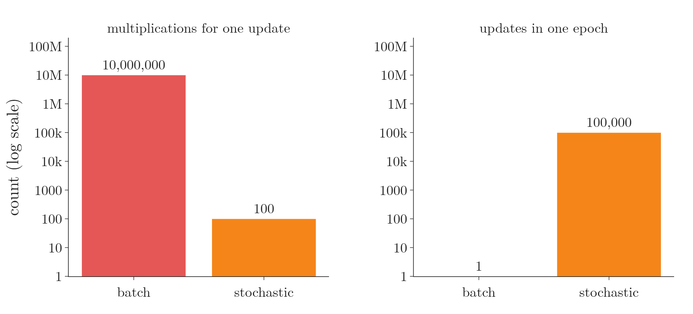
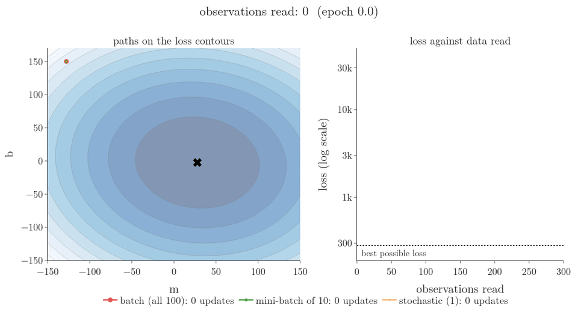
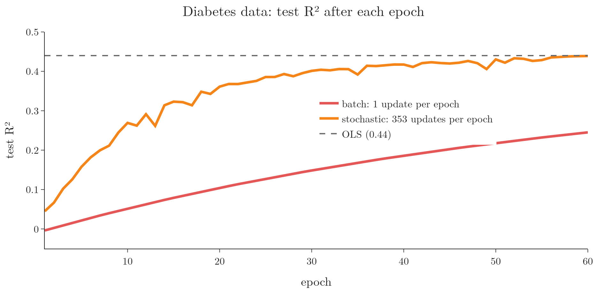
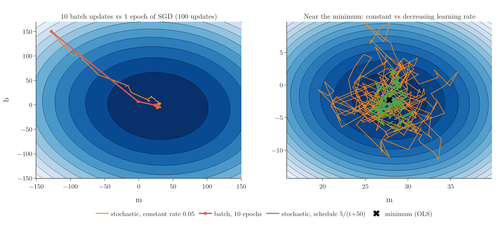
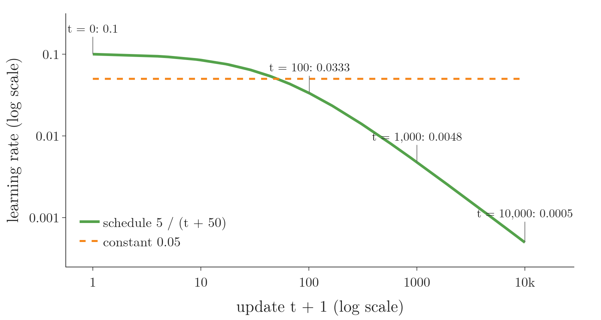
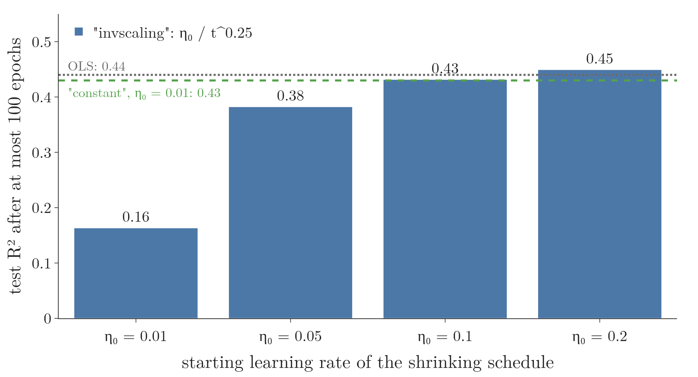

<!-- where-this-fits: generated by course_map/build_map.py; edit concepts.yaml, not this block -->
> **Where this fits:** Pipeline map step 8 (Model). See the [Course map](../../../00-course-map/00-course-map.md).
>
> 
>
> - **Builds on:** Gradient descent ([Note ML-056](../../../ML/06-regression/ML-056-gradient-descent/ML-056-gradient-descent.md)).
> - **Leads to:** Perceptron loss ([Note DL-006](../../../DL/01-basics/DL-006-perceptron-loss/DL-006-perceptron-loss.md)); Batch size in Keras ([Note DL-020](../../../DL/02-training/DL-020-gradient-descent-in-neural-networks/DL-020-gradient-descent-in-neural-networks.md)).
> - **Compare with:** Batch gradient descent ([Note ML-057](../../../ML/06-regression/ML-057-batch-gradient-descent/ML-057-batch-gradient-descent.md)); Mini-batch gradient descent ([Note ML-059](../../../ML/06-regression/ML-059-mini-batch-gradient-descent/ML-059-mini-batch-gradient-descent.md)); SGD with momentum ([Note DL-034](../../../DL/03-optimizers/DL-034-sgd-with-momentum/DL-034-sgd-with-momentum.md)).
<!-- /where-this-fits -->

## 1. Overview

> **Key point:** Stochastic gradient descent updates the coefficients after every single random observation. Each step is cheap and noisy, so it gets close to the answer in far fewer epochs than batch gradient descent, but it jitters around the minimum.

A **feature** (G-772) is an input variable (one column of the data table), an **observation** (G-1374) is one record (one row), and the **target** (G-1949) is the output we predict.

**Batch gradient descent** (G-264), from the previous Note, uses every observation of the training data for each update. **Stochastic gradient descent (SGD)** (G-1892) uses just one observation, picked at random, for each update. SGD and its variants are probably the most used **optimisation algorithms** (G-1398) in machine learning, and nearly all of deep learning is trained with it (Goodfellow §8.3.1, §5.9).

This Note explains:

- the problem with batch gradient descent (section 2);
- how SGD works (section 3) and why it progresses faster per epoch (section 4);
- its noisy path (section 5) and how a learning schedule calms it (section 6);
- how to use it in scikit-learn (section 7), and when to choose which (section 8).

## 2. The problem with batch gradient descent

> **Key point:** Every batch update touches every observation and every feature. With big data, every step is a huge amount of work, and the whole dataset must sit in memory.

To update once, batch gradient descent computes the derivative for every coefficient, and each derivative sums over all $n$ observations. So one epoch costs about $n \times m$ multiplications, and the whole run costs about $n \times m \times \text{epochs}$.

With numbers: a dataset of 100,000 observations and 100 features, trained for 1,000 epochs, needs about

$$100{,}000 \times 100 \times 1{,}000 = 10^{10}$$

multiplications, ten billion, just for the derivatives.

Figure 1 compares the cost of one update. Batch gradient descent needs 10 million multiplications for every single step. SGD needs only 100, the features of one observation, so it can take 100,000 steps in the time batch takes one. Both read the whole table once per **epoch** (G-696); SGD spends that work on many small steps instead of one big one.



So each step is slow and needs the whole dataset in memory: the two disadvantages listed in the [batch gradient descent Note](../ML-057-batch-gradient-descent/ML-057-batch-gradient-descent.md) (section six).

## 3. How stochastic gradient descent works

> **Key point:** In each epoch, repeat n times: pick one random observation, compute the derivatives from that observation alone, and update.

The word **stochastic** (G-1893) means random. The algorithm:

1. Start with any coefficients, for example $\beta_0 = 0$ and every $\beta_j = 1$.
2. For each epoch, repeat $n$ times:
   - pick one observation $i$ at random;
   - compute its prediction $\hat y_i$ and error $y_i - \hat y_i$;
   - update every coefficient using the derivatives from that one observation.
3. Stop after the chosen number of epochs.

The derivatives are the batch ones with the sum over observations removed: only observation $i$ remains. Where they come from, for one observation: its loss is the squared error $(y_i - \hat y_i)^2$. By the chain rule, the derivative is 2 times the error times the derivative of the error with respect to the coefficient:

$$\frac{\partial (y_i - \hat y_i)^2}{\partial \beta_j} = 2\thinspace(y_i - \hat y_i) \times \left(-\frac{\partial \hat y_i}{\partial \beta_j}\right)$$

Since $\hat y_i = \beta_0 + \beta_1 x_{i1} + \dots$, the derivative of $\hat y_i$ with respect to $\beta_j$ is $x_{ij}$ (and 1 for $\beta_0$), which gives the two results below:

$$\frac{\partial L}{\partial \beta_0} = -2(y_i - \hat y_i) \qquad \frac{\partial L}{\partial \beta_j} = -2(y_i - \hat y_i)\thinspace x_{ij}$$

With numbers: if observation $i$ has error $y_i - \hat y_i = 5$ and $x_{ij} = 0.04$, then $\partial L / \partial \beta_j = -2 \times 5 \times 0.04 = -0.4$, and with **learning rate** (G-1068) 0.01 the coefficient rises by $0.004$.

So an epoch of SGD makes $n$ small updates instead of one big one. On the diabetes data an epoch is 353 updates.

**Why one observation is enough.** Real data repeats itself: many observations look alike and say almost the same thing about the coefficients. Take 12 points that sit in three tight clusters. The gradient from one point of a cluster is close to the gradient from its neighbours, so summing all 12 before every step mostly repeats work. One random point already points roughly downhill, and the next random point corrects it. SGD gains the most when the data has such redundancy (StatQuest, "Stochastic Gradient Descent, Clearly Explained!!!").

Figure 2 makes the race fair: every frame, each method reads the same 10 observations of the 100-point example (one feature, so only the slope $m$ and intercept $b$ to learn). Watch the orange SGD path: 10 small jumps per frame, so it reaches the bottom of the bowl within half an epoch, then keeps zigzagging there. Batch gradient descent (red) has to read all 100 observations before its first step.



> **Python:** Stochastic gradient descent from scratch.
>
> ```python
> class MySGDRegressor:
>     def __init__(self, learning_rate=0.01, epochs=100, seed=0):
>         self.lr, self.epochs = learning_rate, epochs
>         self.rng = np.random.default_rng(seed)
>
>     def fit(self, X, y):
>         n = X.shape[0]
>         self.intercept_, self.coef_ = 0.0, np.ones(X.shape[1])
>         for _ in range(self.epochs):
>             for _ in range(n):
>                 i = self.rng.integers(n)          # one random row
>                 err = y[i] - (X[i] @ self.coef_ + self.intercept_)
>                 self.intercept_ -= self.lr * (-2 * err)
>                 self.coef_ -= self.lr * (-2 * err * X[i])
>         return self
> ```
>
> The fixed seed makes the random choice of observations the same on every run, so the results repeat.

> **Extra:** Picking observations at random can choose some observations twice in an epoch and others not at all. An alternative is to shuffle the observations once per epoch and walk through them in that order, so each observation is used exactly once. scikit-learn's `SGDRegressor` does this by default: its `shuffle` parameter, `True` unless changed, shuffles the training data after each epoch (scikit-learn docs).

## 4. Faster progress per epoch

> **Key point:** In 40 epochs, SGD reaches test R² 0.42 on the diabetes data; batch gradient descent only reaches 0.19.

Figure 3 compares the two on the diabetes data, epoch by epoch.



| After | Batch (learning rate 0.5) | Stochastic (learning rate 0.01) |
|---|---|---|
| 10 epochs | 0.05 | 0.27 |
| 40 epochs | 0.19 | 0.42 |
| OLS | 0.44 | 0.44 |

SGD updates 353 times per epoch, batch only once. So per epoch, SGD makes far more progress, even though each of its steps is based on a single observation.

> **Extra:** A common trap: for the *same number of epochs*, batch gradient descent is faster, not SGD. In 100 epochs batch makes 100 updates, SGD makes $100 \times n$. SGD wins on time only because it needs far fewer epochs, which shows on large data. Here the Python loop above is also slower per epoch than batch (under a second for 40 epochs against a few milliseconds), because a Python loop over observations is slow and batch uses one fast matrix product. scikit-learn's SGD runs the same loop in compiled code, so it is fast. The real advantage of SGD is elsewhere: one update costs the same however many observations the data has, so SGD is the main way to train linear models on very large datasets (Goodfellow §5.9).

## 5. A noisy path

> **Key point:** One observation gives a rough estimate of the whole gradient, so SGD's path zigzags. The noise makes SGD fast and able to escape local minima, but it never settles exactly at the minimum.

### 5.1 The zigzag

> **Key point:** Each step points roughly, not exactly, downhill.

The gradient from one observation is a noisy estimate of the gradient from all observations. Figure 4 (left) shows the consequence on the 100-point example: batch gradient descent (red) walks straight down the bowl, while SGD (orange) wanders but reaches the bottom area within one epoch.

{height=50%}

### 5.2 Advantages of the noise

> **Key point:** The noise speeds SGD up on large data and can shake it out of a local minimum.

- **Large data:** SGD needs only one observation at a time in memory, and it gets close to the answer in few passes.
- **Non-convex losses:** with a loss that has local minima (the gradient descent Note), batch gradient descent settles in whichever dip it reaches first. SGD's random jumps can carry it out of a sharp, shallow local minimum (Kleinberg et al. 2018), like shaking a tray so a marble hops out of a small dent.

Figure 5 shows the escape on a made-up loss with one coefficient $w$, because linear regression's own loss has no **local minimum** (G-1110). The average loss has a narrow, shallow dip at $w = -1.49$ and a wide, deep minimum at $w = 1.92$. Each of the 100 observations sees the same curve tilted a little to the left or right, so a step from one observation is the true step plus some noise. Both methods start at $w = -3$ with learning rate 0.05. Watch the red batch marker: it rolls slowly into the shallow dip and stays there. The orange SGD marker is knocked across the dip by its noisy steps and settles in the deep minimum by epoch 7.


The escape needs enough noise. Over 200 random runs, SGD ended in the deep minimum every time; with the noise halved, only 6 of 200 runs escaped (script `local_minimum.py`).

### 5.3 Disadvantage: jitter at the bottom

> **Key point:** With a constant learning rate, SGD keeps jumping around the minimum instead of stopping at it.

Near the minimum, every new observation still pushes the coefficients in its own direction. So SGD keeps bouncing around the best values (Figure 4, right, orange) and never stops exactly there. Running it twice with different random observations also gives slightly different answers.

## 6. Learning schedules

> **Key point:** Making the learning rate shrink over time lets SGD move fast at first and settle down near the end.

The fix for the jitter is a **learning schedule** (G-1070): a learning rate that decreases as training goes on. Big steps early on cover distance quickly; small steps later let SGD settle close to the minimum.

A common schedule is

$$\eta_t = \frac{t_0}{t + t_1}$$

where $t$ counts the updates done so far, and $t_0$ and $t_1$ are constants that we choose. The constant $t_0$ sets the size of the start: at $t = 0$ the rate is $t_0 / t_1$. The constant $t_1$ sets how long the rate stays near the start: at $t = t_1$ the rate has fallen to half of its start value, $t_0 / (2 t_1)$. With $t_0 = 5$ and $t_1 = 50$ the start is $5/50 = 0.1$, half of it (0.05) is reached at $t = 50$, and:

| Update $t$ | 0 | 100 | 1,000 | 10,000 |
|---|---|---|---|---|
| Learning rate | 0.1 | 0.033 | 0.0048 | 0.0005 |

Figure 6 plots the same schedule over 10,000 updates. Watch where the green curve crosses the constant rate 0.05: before update 50 the schedule takes bigger steps, and after it the steps keep shrinking.



In Figure 4 (right), the scheduled run (green) stays much closer to the minimum than the constant-rate run (orange): over the last 200 updates its average distance from the best values is 2.1, against 4.7.

> **Extra:** The idea resembles **simulated annealing** (G-1810), an optimisation method named after annealing metal: cooled slowly, a metal settles into a stable, low-energy state. Simulated annealing likewise lowers a "temperature" step by step (Kirkpatrick et al.).

## 7. SGD in scikit-learn

> **Key point:** `SGDRegressor` (G-1783) trains linear regression with stochastic gradient descent; learning_rate and eta0 set the schedule.

> **Python:** scikit-learn's SGDRegressor.
>
> ```python
> from sklearn.linear_model import SGDRegressor
>
> reg = SGDRegressor(max_iter=100, learning_rate="constant",
>                    eta0=0.01, random_state=0)
> reg.fit(X_train, y_train)
> reg.score(X_test, y_test)      # R² 0.43
> ```

The main parameters:

| Parameter | Meaning |
|---|---|
| `max_iter` (G-115) | the maximum number of epochs |
| `eta0` (G-713) | the starting learning rate |
| `learning_rate` | the schedule: `"constant"`, `"invscaling"` (the default, $\eta_0 / t^{0.25}$), `"optimal"` or `"adaptive"` |
| `tol` | stop early when the loss stops improving by at least this much |
| `random_state` | fixes the random order of observations |
| `loss` | the loss to minimise: `"squared_error"` gives linear regression; other losses (such as `"huber"`) turn the same class into other models |
| `penalty`, `alpha` | regularisation, from [Note ML-062](../ML-062-ridge-regression-intuition/ML-062-ridge-regression-intuition.md) onwards |

`SGDRegressor` is a general class: gradient descent only minimises whatever loss it is given, so one class trains several linear models.

On the diabetes data, `"constant"` with `eta0=0.01` reaches test R² 0.43 in 97 epochs. The default `"invscaling"` schedule shrinks the rate as $\eta_0 / t^{0.25}$, so it needs a larger start: with `eta0=0.2` it reaches 0.45 in 75 epochs, the best of these runs and above OLS's 0.44. A shrinking schedule is like a car braking as it nears a parking spot: it must start fast enough to arrive at all.

Figure 7 puts these runs side by side. With the shrinking schedule, a start of 0.01 leaves the model far from the answer (0.16); raising the start to 0.05, 0.1 and 0.2 brings it to the constant-rate result (green) and then just past OLS (grey).



> **Extra:** With the same small start, `eta0=0.01`, the shrinking schedule stops at test R² 0.16 after 100 epochs: the steps shrink before the coefficients get near the answer. The same schedule reaches 0.39 after 1,000 epochs and 0.45 after 5,000; switching the shrinking off (`power_t=0`) gives 0.43 in 100 epochs. Starting rates between: 0.05 gives 0.38, 0.1 gives 0.43 (notebook). Schedules need tuning like any other hyperparameter (Goodfellow §8.3.1).

> **Extra:** scikit-learn may print a `ConvergenceWarning` when `max_iter` runs out before its stopping rule (`tol`) is met. The warning is not an error; its own message suggests increasing `max_iter`.

## 8. When to use which

> **Key point:** Batch for small data and smooth convex losses; SGD for very large data, data that does not fit in memory, and non-convex losses.

| | Batch | Stochastic |
|---|---|---|
| Observations per update | all | one |
| Path | smooth, exact gradient | noisy, zigzags |
| Progress per epoch | slow | fast |
| Memory | whole dataset | one observation |
| Final answer | settles at the minimum | jitters around it (use a schedule) |
| Local minima | can get stuck | can escape |

> **Extra:** SGD also suits data that keeps arriving. When a new observation comes in, SGD takes one more step from the current coefficients; it does not start again from the beginning (StatQuest). Learning from data as it arrives is **online learning** (G-1391), and scikit-learn's `partial_fit` (G-1458) does it ([Note ML-005](../../01-foundations/ML-005-online-learning/ML-005-online-learning.md)).

Mini-batch gradient descent, the next Note, sits between the two and is what most practice uses.

## 9. Summary

- Batch gradient descent needs about $n \times m$ operations per update: too slow and too memory-hungry for big data.
- SGD updates after each random observation: $n$ updates per epoch, each using one observation's derivatives.
- On the diabetes data, 40 epochs of SGD reach test R² 0.42, against 0.19 for batch.
- The noise makes SGD fast and able to escape local minima, but it jitters at the bottom.
- A learning schedule (shrinking rate) lets SGD settle, if its starting rate is large enough; `SGDRegressor` offers several.

## 10. Sources

**Built from**

- CampusX, "Stochastic Gradient Descent", YouTube, https://www.youtube.com/watch?v=V7KBAa_gh4c
- StatQuest with Josh Starmer, "Stochastic Gradient Descent, Clearly Explained!!!", YouTube, https://www.youtube.com/watch?v=vMh0zPT0tLI. The intuition of one random observation per step behind Figure 2 (redrawn with our own data), the redundancy argument of Section 3, and the link to online learning.

**Other references**

- **Goodfellow**: I. Goodfellow, Y. Bengio, A. Courville, *Deep Learning*, MIT Press, 2016 (deeplearningbook.org). §5.9 (SGD for large datasets), §8.3.1 (SGD and decaying learning rates).
- **scikit-learn docs**: scikit-learn documentation, `sklearn.linear_model.SGDRegressor` (version 1.9).
- **Kirkpatrick et al.**: S. Kirkpatrick, C. D. Gelatt, M. P. Vecchi, "Optimization by Simulated Annealing", *Science* 220(4598), 671–680, 1983.
- **Kleinberg et al. 2018**: R. Kleinberg, Y. Li, Y. Yuan, "An Alternative View: When Does SGD Escape Local Minima?", *Proceedings of the 35th International Conference on Machine Learning (ICML)*, PMLR 80, 2018.

## 11. Key terms

| Term | Meaning |
|---|---|
| Feature | An input variable: one column of the data table |
| Observation | One record: one row of the data table |
| Target | The output we predict |
| Stochastic | Involving randomness |
| Stochastic gradient descent (SGD) | Gradient descent that updates the coefficients after each single random observation |
| Local minimum | A point lower than everything around it, but not the lowest overall |
| Online learning | Training step by step on data as it arrives |
| Learning schedule (G-1070) | A rule that changes the learning rate during training, usually shrinking it |
| SGDRegressor | scikit-learn's linear regression trained with stochastic gradient descent |
| eta0 | The starting learning rate in SGDRegressor |
| max_iter (G-115) | The maximum number of epochs in SGDRegressor |
| Simulated annealing | An optimisation method that lowers a "temperature" step by step so the search settles into a low state; the idea behind shrinking learning rates |
