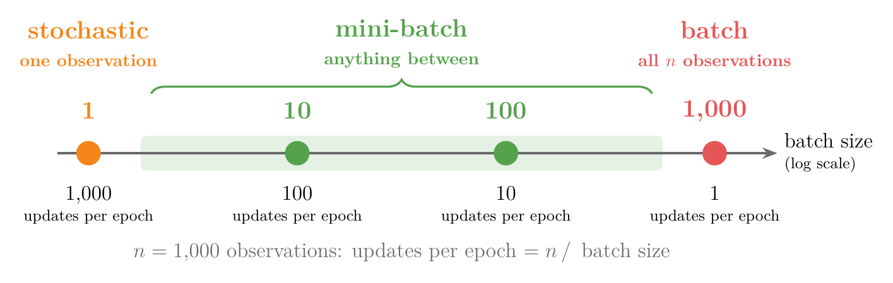
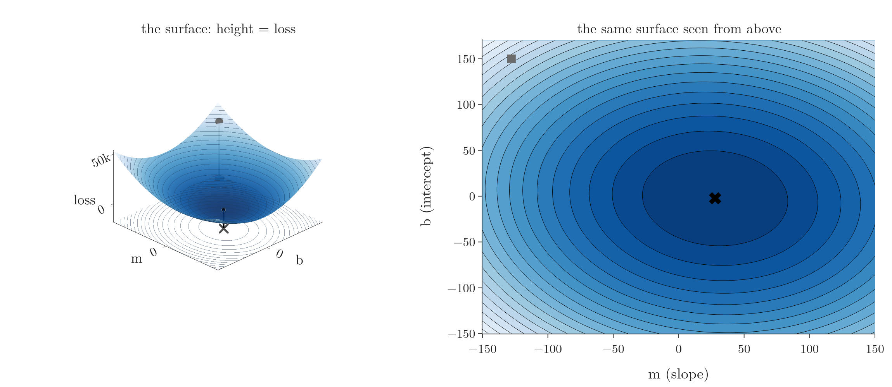

<!-- where-this-fits: generated by course_map/build_map.py; edit concepts.yaml, not this block -->
> **Where this fits:** Pipeline map step 8 (Model). See the [Course map](../../../00-course-map/00-course-map.md).
>
> 
>
> - **Builds on:** [Online learning](../../../ML/01-foundations/ML-005-online-learning/ML-005-online-learning.md#2-what-online-learning-is); [Gradient descent](../../../ML/06-regression/ML-056-gradient-descent/ML-056-gradient-descent.md#2-the-idea).
> - **Leads to:** [Batch size in Keras](../../../DL/02-training/DL-020-gradient-descent-in-neural-networks/DL-020-gradient-descent-in-neural-networks.md#6-choosing-the-variant-in-keras-batch_size); [Batch normalisation](../../../DL/02-training/DL-031-batch-normalization/DL-031-batch-normalization.md#4-how-batch-normalisation-works-during-training); [Optimizers in deep learning](../../../DL/03-optimizers/DL-032-optimizers-in-deep-learning/DL-032-optimizers-in-deep-learning.md#3-what-an-optimizer-does).
> - **Compare with:** [Stochastic gradient descent](../../../ML/06-regression/ML-058-stochastic-gradient-descent/ML-058-stochastic-gradient-descent.md#3-how-stochastic-gradient-descent-works).
<!-- /where-this-fits -->

## 1. Overview

> **Key point:** Mini-batch gradient descent updates the coefficients after each small group of observations. Mini-batch sits between batch (stable, slow) and stochastic (fast, noisy) gradient descent, and is the version most used in practice.

A **feature** (G-772) is an input variable (one column of the data table), an **observation** (G-1374) is one record (one row), and the **target** (G-1949) is the output we predict.

**Gradient descent** (G-862) finds the best **coefficients** (G-407) by repeated small steps downhill on the loss (see [the idea of gradient descent](../ML-056-gradient-descent/ML-056-gradient-descent.md#2-the-idea)). The two types so far sit at opposite ends. Batch gradient descent reads every observation before each step: steady, but slow. Stochastic gradient descent steps after every single observation: fast, but noisy. The in-between option reads a small group of observations per step.

**Mini-batch gradient descent** (G-1222) is this third type. The three types differ only in how often they update the coefficients in one **epoch** (G-696), one full pass over the training data:

- **Batch:** once per epoch, after looking at all $n$ observations.
- **Stochastic:** $n$ times per epoch, after each single observation.
- **Mini-batch:** once after each **batch** (G-263): a small group of observations, typically 32 to 256, sometimes 16. Most deep-learning training works this way (Goodfellow §8.1.3).

With 1,000 observations and a batch size of 100, the data splits into 10 batches, so there are 10 updates per epoch. A batch size of 10 would give 100 updates per epoch.

## 2. A family that contains the other two

> **Key point:** Batch size n is batch gradient descent; batch size 1 is stochastic gradient descent; anything between is mini-batch.

The **batch size** (G-267) is a **hyperparameter** (G-910): a setting we choose before training, not one the model learns. Read the three types of [batch gradient descent](../ML-057-batch-gradient-descent/ML-057-batch-gradient-descent.md#1-overview) and [stochastic gradient descent](../ML-058-stochastic-gradient-descent/ML-058-stochastic-gradient-descent.md#1-overview) by batch size:

- **batch gradient descent** (G-264) is batch size $n$;
- **stochastic gradient descent** (G-1892) is batch size 1;
- **mini-batch** is everything between.

Mini-batch is therefore the general form, and the batch size tunes how it behaves between the two extremes. Figure 1 puts the three names on one batch-size axis for the 1,000 observations of section 1. Watch the updates per epoch fall as the batch size grows.



## 3. How it works

> **Key point:** Each epoch: shuffle the observations, cut them into batches, and for each batch compute the derivatives from its observations only and update.

In words: instead of asking every observation which way is downhill, or just one, we ask a small group, average their answers, and take one step. With 100 observations and a batch size of 10, an epoch has 10 such steps.

1. Start with any coefficients, for example $\beta_0 = 0$ and every $\beta_j = 1$.
2. For each epoch:
   - put the observations in a new random order, called **shuffling** (G-1797);
   - cut them into consecutive batches of the chosen size (the last batch may be smaller);
   - for each batch, compute the predictions, the errors and the derivatives using only its observations, and update.

The shuffle is there because data files are often stored in an order where neighbouring rows are alike, for example all the blood tests of one patient, then all those of the next. Batches cut from such an order would each describe mostly one patient, so each step would point the wrong way for the data as a whole. A random order makes every batch a fair sample of all the observations (Goodfellow §8.1.3).

The **derivatives** (G-595) of the loss $L$ are the batch ones, averaged over the observations $B$ of the current batch instead of all $n$ observations:

$$\frac{\partial L}{\partial \beta_j} = -\frac{2}{|B|}\sum_{i \in B}(y_i - \hat y_i)\thinspace x_{ij}$$

where $\sum_{i \in B}$ adds over every observation $i$ in the batch $B$, $|B|$ is the number of observations in the batch, $y_i$ is the target of observation $i$, $\hat y_i$ its prediction and $x_{ij}$ its value of feature $j$. Each coefficient then moves against its derivative, by the derivative times the **learning rate** (G-1068).

Figure 2 runs these steps on the 100-point example of section 4, with batch size 10 and learning rate 0.05, for 3 epochs. Each epoch opens with a new shuffle, which colours every point by the batch it falls into; then one batch at a time lights up green and the line makes one update. Watch the colours change between epochs, and the line move only once per batch.


> **Python:** Mini-batch gradient descent from scratch.
>
> ```python
> class MBGDRegressor:
>     def __init__(self, batch_size, learning_rate=0.01,
>                  epochs=100, seed=0):
>         self.bs, self.lr, self.epochs = (batch_size,
>             learning_rate, epochs)
>         self.rng = np.random.default_rng(seed)
>
>     def fit(self, X, y):
>         n = X.shape[0]
>         self.intercept_ = 0.0
>         self.coef_ = np.ones(X.shape[1])
>         for _ in range(self.epochs):
>             order = self.rng.permutation(n)        # shuffle
>             for start in range(0, n, self.bs):
>                 j = order[start:start + self.bs]   # one batch
>                 err = y[j] - (X[j] @ self.coef_ + self.intercept_)
>                 self.intercept_ -= self.lr * (-2 * err.mean())
>                 self.coef_ -= self.lr * (-2 * X[j].T @ err / len(j))
>         return self
> ```
>
> The derivative code is the same vectorised code as batch gradient descent, applied to the observations `X[j]` of one batch.

> **Extra:** Some implementations draw each batch at random from all observations, so observations can repeat within an epoch. Shuffling and slicing, as above, uses every observation exactly once per epoch. For very large datasets it is usually enough to shuffle the order once and keep it, while never shuffling at all can seriously hurt the result (Goodfellow §8.1.3).

## 4. Comparing the three paths

> **Key point:** In three epochs, batch barely moves, stochastic arrives but zigzags, and mini-batch arrives on a smoother path.

The next figure draws paths on a [contour map](../../../MA/06-calculus/MA-062-partial-derivatives-and-gradients/MA-062-partial-derivatives-and-gradients.md#11-reading-a-contour-map), so first the surface it comes from. Every pair $(m, b)$ is one line, and its loss is the mean squared error of the 100-point example: for the start line $m = -127.8$, $b = 150$ the loss is about 41,800, and at the best line $m = 27.8$, $b = -2.3$ it is about 283. The loss is a smooth bowl over the $(m, b)$ floor; the [shape of the loss function](../ML-056-gradient-descent/ML-056-gradient-descent.md#8-the-shape-of-the-loss-function-matters) shows the same kind of bowl. Figure 3 puts the bowl beside its map: the map is the bowl seen from above, and each line joins points at the same height. Lines close together mean a steep slope; the centre ring, with the black cross, is the lowest point. The grey square is the start used in the races below.



In the right panel of Figure 4, across is how many observations each method has read so far and up is its loss on a log scale (each gridline roughly three times the one below), so a lower curve is a better line; in the left panel the paths start at the grey square of Figure 3 and the black cross is the best line. Figure 4 runs all three for 3 epochs on the 100-point example, with the same learning rate of 0.05. The race is fair: in every frame, each method reads the same 10 observations. Watch the green mini-batch path: one step per frame, straighter than the orange stochastic path, and far ahead of the red batch path.


- **Batch** (3 updates in total) has only just started.
- **Stochastic** (300 updates) reaches the minimum, then jumps around it.
- **Mini-batch of 10** (30 updates) follows a much smoother path and is almost there. In its last epoch its path is about as long as the distance it covers (ratio 1.05), while the stochastic path is 27 times longer than its net move.

Near the minimum, mini-batch still wanders a little, like stochastic gradient descent but less. The same fix applies: a **learning schedule** (G-1070) that shrinks the learning rate as training goes on (see [the learning schedule](../ML-058-stochastic-gradient-descent/ML-058-stochastic-gradient-descent.md#6-learning-schedules)).

Each observation's derivative points in a slightly different direction, because each observation carries its own random error. Averaging 10 of them lets these random parts partly cancel, while still updating 10 times as often as batch. The noise of an average of $B$ values is $1/\sqrt{B}$ of the noise of one value (Goodfellow §8.1.3), so with $B = 10$ each step carries about a third ($0.32$) of a single observation's noise. Why: independent random errors add up less than their count. Take $B = 4$ values, each with a noise spread of 1 (a variance, the spread squared, of 1). The variance of their sum is the sum of the variances:

$$1 + 1 + 1 + 1 = 4$$

so the spread of the sum is

$$\sqrt{4} = 2$$

Dividing by 4 for the average gives

$$\frac{2}{4} = 0.5 = \frac{1}{\sqrt{4}}$$

In the same way:

| Batch size $B$ | 1 | 4 | 10 | 100 |
|---|---|---|---|---|
| Noise of the average, as a share of one observation's | 1 | 0.5 | 0.32 | 0.1 |

## 5. Choosing the batch size

> **Key point:** Smaller batches mean more updates per epoch but noisier ones; larger batches mean smoother but fewer updates. A small batch in between, here 8, gets both.

Think of asking for directions: asking one passer-by is quick but may mislead you, polling the whole town is reliable but takes all day, and asking a handful of people is quick and mostly right. Figure 5 trains on the diabetes data with learning rate 0.1 for 100 epochs and four batch sizes, on one train/test split. The score is the **R² score** (G-1717; the share of the target's spread that the model explains, 1 is perfect; see [reading $R^2$](../ML-051-regression-metrics/ML-051-regression-metrics.md#63-reading-r²)) on the test set; ordinary least squares, **OLS** (G-1406; the closed-form solution of [the normal equation](../ML-053-multiple-lr-maths/ML-053-multiple-lr-maths.md#6-the-normal-equation)), reaches 0.44.


The table averages 20 random splits; the last column is how much test R² jumps from epoch to epoch near the end (standard deviation over the last 20 epochs).

| Batch size | Updates per epoch | Test R² after 100 epochs | Epoch-to-epoch jumps |
|---|---|---|---|
| 1 (stochastic) | 353 | 0.43 | 0.076 |
| 8 | 45 | 0.45 | 0.031 |
| 32 | 12 | 0.40 | 0.031 |
| 353 (batch) | 1 | 0.11 | 0.006 |

- With batch size 1, test R² climbs fastest at first but then jumps from epoch to epoch, more than twice as much as with 8.
- With batch size 8, test R² gets close to OLS (0.44) early and stays there more steadily.
- With batch size 32, the curve in Figure 5 is smooth but slower, with fewer updates per epoch.
- Full batch has made only 100 updates in total and is far from done.

Averaged over the 20 splits, batch sizes 8 and 32 jump by the same amount (0.031 each), so the smoother curve of 32 in Figure 5 holds for that one split only. The clear gain in steadiness in the table is from batch size 1 to 8.

Like the learning rate, the batch size is tuned by trying values, and the two settings interact. A very small batch gives a noisy derivative, so it may need a small learning rate to stay stable (Goodfellow §8.1.3).

> **Extra:** In deep learning, too, small batches often do well: one study got its best results with batch sizes between 2 and 32 (Masters and Luschi). Going the other way, one well-known large-batch method grows the learning rate with the batch size: twice the batch, twice the rate (Goyal et al.).

> **Extra:** Batch sizes are often powers of two (16, 32, 64, 128) because some hardware, especially GPUs, runs faster with arrays of these sizes. The memory needed grows with the batch size, not with the size of the dataset, so models can be trained on datasets far larger than memory (Goodfellow §8.1.3).

## 6. Mini-batch in scikit-learn

> **Key point:** SGDRegressor has no batch size option, but its partial_fit method trains on one batch at a time, so a short loop gives mini-batch training.

**`SGDRegressor`** (G-1783, from [SGD in scikit-learn](../ML-058-stochastic-gradient-descent/ML-058-stochastic-gradient-descent.md#7-sgd-in-scikit-learn)) always updates one observation at a time inside `fit`. Its `partial_fit` method (G-1458), however, does one pass over whatever observations it is given, keeping the coefficients learned so far. Feeding it one batch at a time gives mini-batch-style training:

> **Python:** Mini-batch training with partial_fit.
>
> ```python
> from sklearn.linear_model import SGDRegressor
>
> sgd = SGDRegressor(learning_rate="constant", eta0=0.2,
>                    random_state=0)
> rng = np.random.default_rng(0)
> for epoch in range(100):
>     order = rng.permutation(n)
>     for start in range(0, n, 35):
>         j = order[start:start + 35]
>         sgd.partial_fit(X_train[j], y_train[j])
> sgd.score(X_test, y_test)      # R² 0.45
> ```
>
> `partial_fit` is also how scikit-learn models learn from data that arrives over time, the **online learning** (G-1391) of [the online learning workflow](../../01-foundations/ML-005-online-learning/ML-005-online-learning.md#22-the-online-learning-workflow).

> **Extra:** Inside `partial_fit`, `SGDRegressor` still updates once per observation of the batch rather than once per batch. True mini-batch updates (one update from the batch's average derivative) are standard in deep-learning libraries, where the batch size is a basic setting. Those libraries, and many texts, still call the method "SGD" even when each step uses a mini-batch, so "SGD" often means mini-batch gradient descent.

## 7. Summary

| | Batch | Mini-batch | Stochastic |
|---|---|---|---|
| Observations per update | $n$ | a small batch | 1 |
| Updates per epoch | 1 | $n$ / batch size | $n$ |
| Path | smooth, slow | fairly smooth, fast | noisy, fast |
| Memory | whole dataset | one batch | one observation |
| Typical use | small data | most practice, deep learning | very large or streaming data |

- Mini-batch is the usual choice because averaging a small batch cuts the noise of each step (to about a third with 10 observations) while still updating many times per epoch.

- Mini-batch gradient descent includes the other two as batch sizes $n$ and 1, so one setting, the batch size, moves it between smooth-but-slow and fast-but-noisy.
- Each epoch: shuffle, cut into batches, update once per batch with the batch's average derivative; the shuffle uses every observation once per epoch, while never shuffling can seriously hurt the result.
- Batch size and learning rate are tuned together; batch size 8 worked best here (test R² 0.45, against 0.43 for 1 and 0.40 for 32, averaged over 20 splits), because a very small batch gives a noisy derivative that may need a smaller learning rate.
- In scikit-learn, `partial_fit` on successive batches gives mini-batch-style training, because `SGDRegressor` has no batch size option.
- Together these answer the opening question: updating after each small group of observations sits between batch and stochastic gradient descent and gets the speed of one with most of the steadiness of the other.

## 8. Sources

**Built from**

- CampusX, "Mini-Batch Gradient Descent", YouTube, https://www.youtube.com/watch?v=_scscQ4HVTY
- StatQuest with Josh Starmer, "Stochastic Gradient Descent, Clearly Explained!!!", YouTube, https://www.youtube.com/watch?v=vMh0zPT0tLI

**Other references**

- **Goodfellow**: I. Goodfellow, Y. Bengio, A. Courville, *Deep Learning*, MIT Press, 2016 (deeplearningbook.org). §8.1.3 (batch and minibatch algorithms).
- **Masters and Luschi**: D. Masters and C. Luschi, "Revisiting Small Batch Training for Deep Neural Networks", arXiv:1804.07612, 2018.
- **Goyal et al.**: P. Goyal et al., "Accurate, Large Minibatch SGD: Training ImageNet in 1 Hour", arXiv:1706.02677, 2017.

## 9. Key terms

Terms taught in this Note come first; linked terms are recaps, taught in the Note the link opens.

| Term | Meaning |
|---|---|
| Mini-batch gradient descent (G-1222) | Gradient descent that uses a small random group of rows for every update. |
| Batch (mini-batch) (G-263) | A small group of training observations used for one update; Keras uses 32 by default. |
| Batch size (G-267) | The number of rows in each batch; a hyperparameter. |
| Shuffling (G-1797) | Putting the rows in a new random order before each epoch, so the mini-batches differ from one epoch to the next. |
| [Feature](../../../ML/01-foundations/ML-002-ai-vs-ml-vs-dl/ML-002-ai-vs-ml-vs-dl.md#52-features-chosen-by-us-or-learned) (G-772) | One piece of information about each example that a model uses (e.g. a student's CGPA). |
| [Observation](../../../ML/01-foundations/ML-003-types-of-ml/ML-003-types-of-ml.md#21-learning-from-inputs-and-outputs) (G-1374) | One record of a dataset: one row of the data table. |
| [Target](../../../ML/01-foundations/ML-003-types-of-ml/ML-003-types-of-ml.md#21-learning-from-inputs-and-outputs) (G-1949) | The output column we predict, such as the class; also called the label. |
| [Gradient descent](../../../ML/06-regression/ML-056-gradient-descent/ML-056-gradient-descent.md#1-overview) (G-862) | Finding the lowest point of a function by repeated small steps downhill. |
| [Coefficient ($\beta_i$)](../../../ML/06-regression/ML-052-multiple-linear-regression/ML-052-multiple-linear-regression.md#3-the-equation) (G-407) | The weight of one input column: the change in the output per unit of that input, others fixed. |
| [Epoch](../../../DL/01-basics/DL-005-perceptron-trick/DL-005-perceptron-trick.md#7-loops-and-epochs) (G-696) | One full update of the parameters using the whole training set. |
| [Hyperparameter](../../../ML/03-feature-engineering/ML-028-pipelines/ML-028-pipelines.md#9-hyperparameter-tuning-with-a-pipeline) (G-910) | A setting of an algorithm chosen before training, such as a tree's `max_depth`. |
| [Batch gradient descent](../../../ML/06-regression/ML-057-batch-gradient-descent/ML-057-batch-gradient-descent.md#1-overview) (G-264) | Gradient descent that uses all training rows for every update. |
| [Stochastic gradient descent (SGD)](../../../ML/06-regression/ML-058-stochastic-gradient-descent/ML-058-stochastic-gradient-descent.md#3-how-stochastic-gradient-descent-works) (G-1892) | Gradient descent that uses one random row for every update, so each update is cheap and many updates happen per epoch, at the cost of a noisier path. |
| [Derivative](../../../MA/06-calculus/MA-061-derivatives-of-one-variable/MA-061-derivatives-of-one-variable.md#41-from-secant-to-tangent) (G-595) | The slope of a function at a point: how fast the output changes as the input changes there. It is zero at the lowest point of a smooth curve, which is how training finds a minimum. |
| [Learning rate ($\eta$)](../../../ML/01-foundations/ML-005-online-learning/ML-005-online-learning.md#5-the-learning-rate) (G-1068) | How strongly each update changes the model; in gradient descent, the number the slope is multiplied by to get the step size. |
| [Learning rate scheduler (learning schedule)](../../../DL/02-training/DL-021-improving-a-neural-network/DL-021-improving-a-neural-network.md#34-batch-size) (G-1070) | A rule that changes the learning rate as training goes on, usually lowering it. |
| [R² score (coefficient of determination)](../../../ML/06-regression/ML-051-regression-metrics/ML-051-regression-metrics.md#6-r²-score) (G-1717) | 1 minus the model's squared error divided by the squared error of always predicting the mean: 1 is perfect, 0 is no better than the average. |
| [Ordinary least squares (OLS, least squares)](../../../ML/06-regression/ML-050-linear-regression-maths/ML-050-linear-regression-maths.md#2-two-ways-to-find-m-and-b) (G-1406) | The way linear regression finds its line with one formula (a closed-form method): the line with the smallest sum of squared errors. |
| [SGDRegressor](../../../ML/01-foundations/ML-005-online-learning/ML-005-online-learning.md#41-scikit-learns-partial_fit) (G-1783) | A scikit-learn model that does linear regression with stochastic gradient descent, step by step, so it can also learn from data arriving in small pieces. |
| [partial_fit](../../../ML/01-foundations/ML-005-online-learning/ML-005-online-learning.md#41-scikit-learns-partial_fit) (G-1458) | A scikit-learn method that continues training from where the model left off. |
| [Online learning](../../../ML/01-foundations/ML-005-online-learning/ML-005-online-learning.md#21-learning-in-small-steps) (G-1391) | Training incrementally on mini-batches while the model is live in production. |
