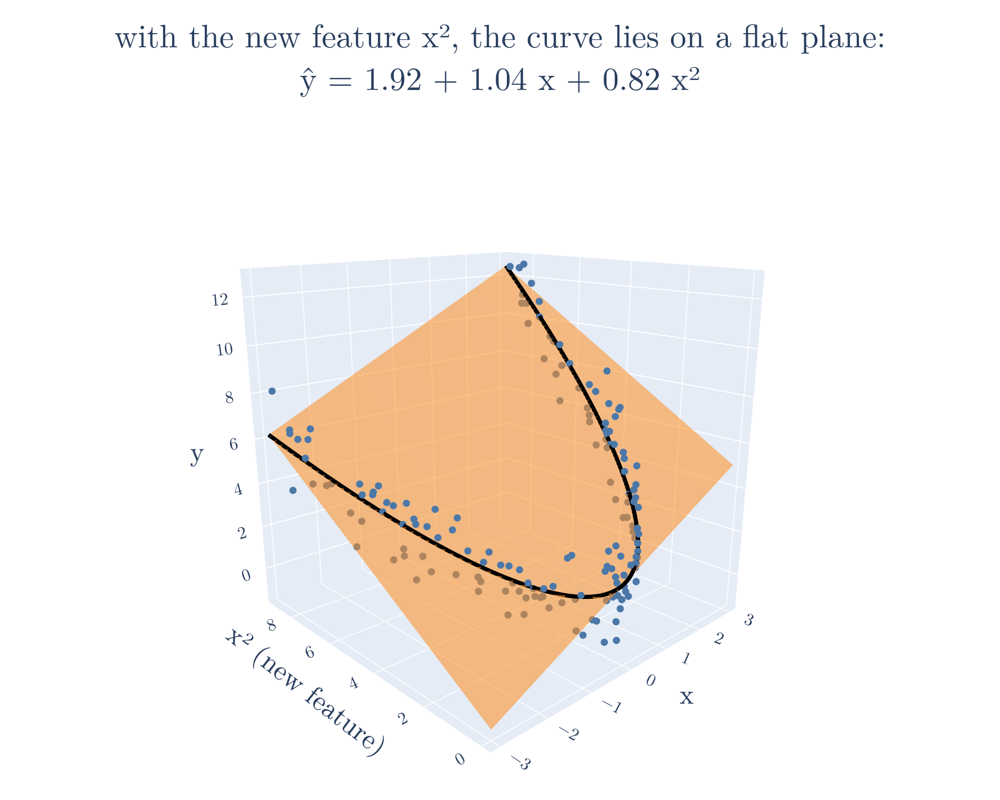
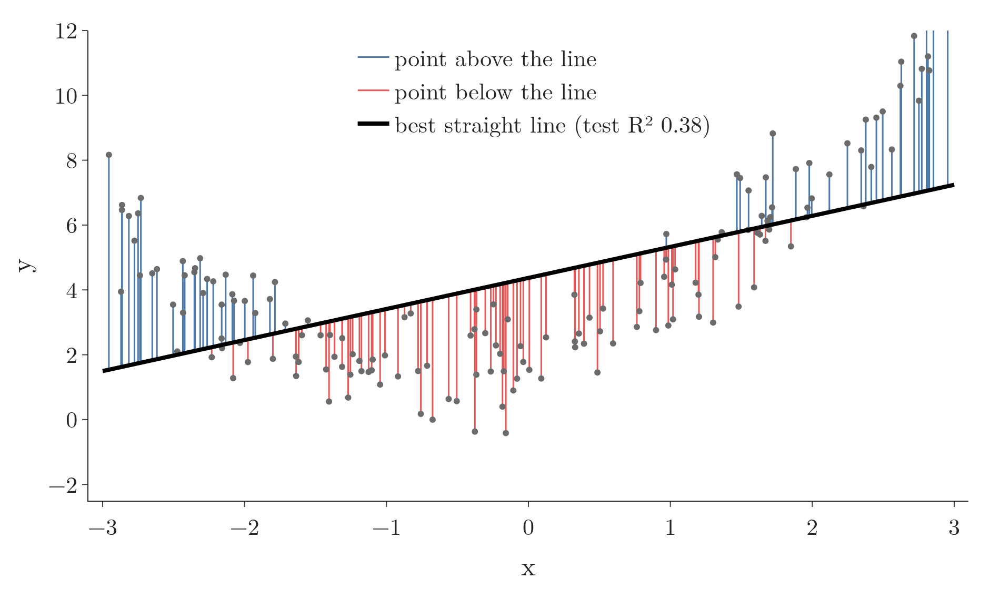
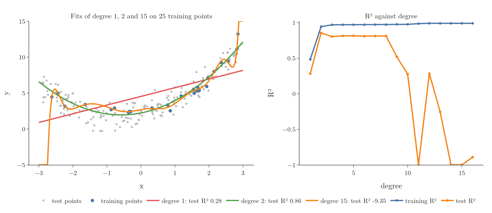
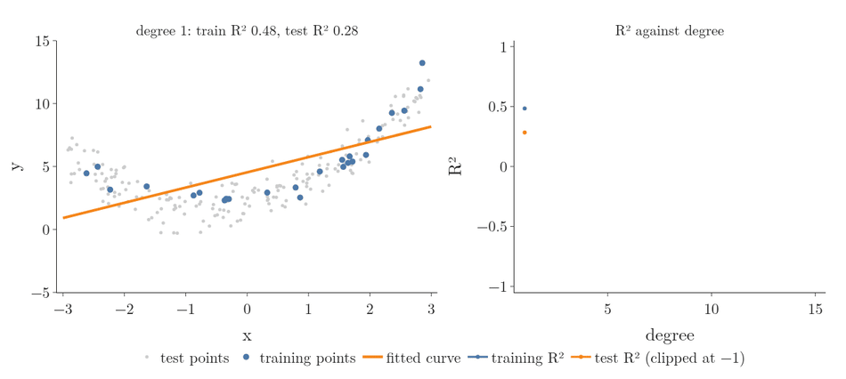

<!-- where-this-fits: generated by course_map/build_map.py; edit concepts.yaml, not this block -->
> **Where this fits:** Pipeline map steps 8 (Model), 9 (Evaluate). See the [Course map](../../../00-course-map/00-course-map.md).
>
> 
>
> - **Builds on:** Train-test split ([Note ML-012](../../../ML/01-foundations/ML-012-toy-project/ML-012-toy-project.md)); Multiple linear regression ([Note ML-052](../../../ML/06-regression/ML-052-multiple-linear-regression/ML-052-multiple-linear-regression.md)).
> - **Leads to:** Bias-variance trade-off ([Note ML-061](../../../ML/06-regression/ML-061-bias-variance/ML-061-bias-variance.md)); Regularisation ([Note ML-062](../../../ML/06-regression/ML-062-ridge-regression-intuition/ML-062-ridge-regression-intuition.md)); Logistic regression ([Note ML-069](../../../ML/07-classification/ML-069-perceptron-trick/ML-069-perceptron-trick.md)); Hyperparameter tuning ([Note ML-080](../../../ML/07-classification/ML-080-logistic-hyperparameters/ML-080-logistic-hyperparameters.md)); Boosting ([Note ML-095](../../../ML/08-trees-and-ensembles/ML-095-ensemble-learning/ML-095-ensemble-learning.md)); Bagging ([Note ML-099](../../../ML/08-trees-and-ensembles/ML-099-bagging-intuition/ML-099-bagging-intuition.md)).
> - **Compare with:** Decision surface and boundary ([Note ML-085](../../../ML/07-classification/ML-085-knn/ML-085-knn.md)); Kernel trick ([Note ML-089](../../../ML/07-classification/ML-089-kernel-trick-intuition/ML-089-kernel-trick-intuition.md)).
<!-- /where-this-fits -->

## 1. Overview

> **Key point:** Polynomial regression fits curves by adding powers of the feature ($x^2$, $x^3$, ...) as new features and then running ordinary linear regression on them.

Linear regression fits a straight line (or flat plane). Real relationships are often curved: the output may first fall and then rise, or grow faster and faster. A straight line misses such patterns.

A **feature** (G-772) is an input variable (one column of the data table), an **observation** (G-1374) is one record (one row), and the **target** (G-1949) is the output we predict.

**Polynomial regression** (G-1515) handles curves without a new algorithm. Polynomial regression creates new features from powers of the existing ones and gives them to plain **linear regression** (G-1094), the way a straight ruler can trace a curve if we feed it bent graph paper. The **degree** (G-577) is the highest power used.

Figure 1 shows the trick on this Note's data. Each point is drawn against $x$ and against a new feature, $x^2$. In that space the points lie close to a flat plane, and fitting a flat plane is exactly what linear regression does. The black curve is where the data can sit on the plane: seen from the side, it is the U-shaped fit.



## 2. A curved pattern

> **Key point:** On data that follows a parabola, a straight line reaches only R² 0.38.

The example data has 200 points that follow

$$y = 0.8x^2 + 0.9x + 2 + \text{noise}$$

for $x$ between $-3$ and 3: a U-shaped curve with some random scatter. Fitted with ordinary linear regression, the best straight line scores only $R^2 = 0.38$ on the test points. The line cannot bend, so it misses the low middle and both high ends (Figure 2). The misses form a pattern: the points sit above the line at both ends and below it in the middle. A residual pattern like this is the sign of a curved relationship (assumption 1 of the [linear regression assumptions Note](../ML-055-linear-regression-assumptions/ML-055-linear-regression-assumptions.md)).



## 3. Adding powers as new features

> **Key point:** For degree 2, each observation gets a new feature holding $x^2$. Linear regression then finds one coefficient per feature.

The trick: for each observation, compute $x^2$ and add it as a new column of the table (Figure 3).


With the features $x$ and $x^2$, linear regression fits

$$\hat{y} = \beta_0 + \beta_1 x + \beta_2 x^2$$

The fitted model is a curve in $x$, but it is still a straight-line combination of its coefficients: each coefficient just multiplies a feature. So the usual linear regression machinery (OLS or gradient descent) finds $\beta_0$, $\beta_1$ and $\beta_2$ unchanged.

Linearity in the coefficients is why polynomial regression is called "linear": **linear** refers to the coefficients, not to the shape of the curve in $x$.

> **Python:** Degree-2 polynomial regression.
>
> ```python
> from sklearn.preprocessing import PolynomialFeatures
> from sklearn.linear_model import LinearRegression
>
> poly = PolynomialFeatures(degree=2, include_bias=True)
> X_train_p = poly.fit_transform(X_train)   # [x] -> [1, x, x^2]
> X_test_p = poly.transform(X_test)
>
> lr = LinearRegression().fit(X_train_p, y_train)
> lr.score(X_test_p, y_test)     # R² 0.83
> lr.coef_, lr.intercept_        # [0, 1.04, 0.82], 1.92
> ```
>
> `include_bias=True` (G-929) adds the column of 1s; `LinearRegression` fits its own intercept anyway, so that column gets coefficient 0 and either setting works.
>
> Two things to get right: the powers are made from the features only, never from the target; and `fit_transform` goes on the training features while the test features get the same `transform`, as with any preprocessing step.

With the $x^2$ feature, the test R² jumps from 0.38 to 0.83. The learned equation, $\hat{y} = 1.92 + 1.04x + 0.82x^2$, is close to the true $2 + 0.9x + 0.8x^2$. The remaining difference comes from the noise: refitting on the same training observations with the noise removed gives exactly $2 + 0.9x + 0.8x^2$ (notebook).

## 4. Choosing the degree

> **Key point:** Too low a degree underfits; too high a degree bends to fit the noise and overfits. Training R² keeps rising with the degree, but test R² falls.

Higher degrees add more features, $x^3$, $x^4$ and so on, and the curve can bend more. Figure 4 fits three degrees to only 25 training points, then scores them on 200 new test points.

{height=48%}

| Degree | Training R² | Test R² | |
|---|---|---|---|
| 1 | 0.48 | 0.28 | **underfits** (G-2035): too simple to follow the curve |
| 2 | 0.94 | 0.86 | right shape: matches how the data was made |
| 6 | 0.97 | 0.81 | starting to fit noise |
| 10 | 0.98 | 0.28 | overfits |
| 15 | 0.99 | $-9.35$ | overfits badly: wild swings between and beyond the points |

The right panel shows the pattern. **Training R²** rises with every extra degree. The maths guarantees it: a degree $(d+1)$ model contains every degree $d$ curve (set the new coefficient to 0), so its best training error can only be equal or smaller. **Test R²** peaks at degree 2 and then collapses: the high-degree curve has learned the noise of these 25 points, not the pattern (the challenges and fitting Notes called this **overfitting**, G-1429).

Figure 5 runs through all fifteen degrees one at a time. Watch the curve on the left: up to degree 8 it stays close to the U-shape, then it starts to wiggle between the training points and shoot off at the edges, and the orange test R² on the right falls away while the blue training R² stays near the top.



The degree is a **hyperparameter** (G-910), chosen by comparing scores on data not used for training, as here, or with cross-validation (a later Note).

> **Extra:** A degree-15 polynomial has terms up to $x^{15}$; with $x = 3$ that is about 14 million. Columns on such different scales make the fit sensitive to rounding errors. The **condition number** (G-441) measures that sensitivity: the larger it is, the more small rounding errors can change the answer (Goodfellow §4.2). For the 25 training points it is $4.5 \times 10^8$ for the raw columns and $1.1 \times 10^6$ after `StandardScaler`, so Figure 4 uses a pipeline of `PolynomialFeatures`, `StandardScaler` and `LinearRegression`.

## 5. More than one feature

> **Key point:** With several features, PolynomialFeatures also adds products of features, such as xy. The number of features grows very fast with the degree.

With two features $x$ and $y$, degree 2 creates all terms of total power up to 2:

$$1,\ x,\ y,\ x^2,\ xy,\ y^2$$

The product $xy$ is an **interaction term** (G-959): it lets the effect of $x$ depend on the value of $y$. In maths: if $\hat{z} = \dots + \beta_x x + \beta_{xy}\thinspace xy$, a rise of 1 in $x$ changes $\hat{z}$ by $\beta_x + \beta_{xy}\thinspace y$, which depends on $y$. The fitted model is a curved surface instead of a flat plane.

Figure 6 shows data made from $z = x^2 + y^2 + 0.2x + 0.2y + 0.1xy + 2$ plus noise. A plane reaches $R^2 = 0.61$; a degree-2 surface reaches 0.98.

{height=45%}

The number of new features grows quickly. With 2 features, degree 2 gives 6; degree 30 gives 496. With many features and a high degree, the new features quickly outnumber the observations. Once there are as many features as observations, least squares passes exactly through every training point, whatever the true relationship, and such a model does very poorly on new data (ISL §6.4.2).

> **Extra:** To put two 1-D arrays side by side as columns, use `np.c_[x, y]` or `np.column_stack([x, y])`. A shortcut sometimes seen, `np.array([x, y]).reshape(100, 2)`, does not do this: it fills the rows with 100 values of `x` first and then of `y`, so most rows pair unrelated numbers. The model still runs, but on scrambled data. Checking `X[:3]` against `x[:3]` and `y[:3]` catches it.

## 6. Summary

| Degree | Features from one original feature | Behaviour on the example |
|---|---|---|
| 1 | $x$ | straight line, underfits (test R² 0.28) |
| 2 | $x$, $x^2$ | follows the curve (test R² 0.86) |
| 15 | $x$ to $x^{15}$ | overfits (test R² $-9.35$) |

- Polynomial regression = new power features + ordinary linear regression.
- Polynomial regression is "linear" in the coefficients, so OLS and gradient descent work unchanged.
- `PolynomialFeatures(degree=d)` creates the new features; with several features it adds interaction terms too.
- The degree controls flexibility: too low underfits, too high overfits. Choose it on held-out data.

## 7. Sources

**Built from**

- CampusX, "Polynomial Regression | Machine Learning", YouTube, https://www.youtube.com/watch?v=BNWLf3cKdbQ

**Other references**

- **Goodfellow**: I. Goodfellow, Y. Bengio, A. Courville, *Deep Learning*, MIT Press, 2016 (deeplearningbook.org). §4.2 (poor conditioning, condition number).
- **ISL**: James, Witten, Hastie, Tibshirani, *An Introduction to Statistical Learning*, 2nd ed., Springer, 2021. §6.4.2 (what goes wrong in high dimensions).

## 8. Key terms

| Term | Meaning |
|---|---|
| Feature | An input variable: one column of the data table |
| Observation | One record: one row of the data table |
| Target | The output we predict |
| Polynomial regression | Linear regression on powers (and products) of the features, to fit curves |
| Degree | The highest power used in the polynomial |
| PolynomialFeatures | scikit-learn transformer that creates the power and product columns |
| include_bias | PolynomialFeatures setting that adds a column of 1s |
| Interaction term | A product of two features, such as $xy$, that lets one feature's effect depend on another |
| Underfitting | A model too simple to capture the pattern; poor on training and test data |
| Overfitting | A model so flexible that it learns the noise; good on training data, poor on test data |
