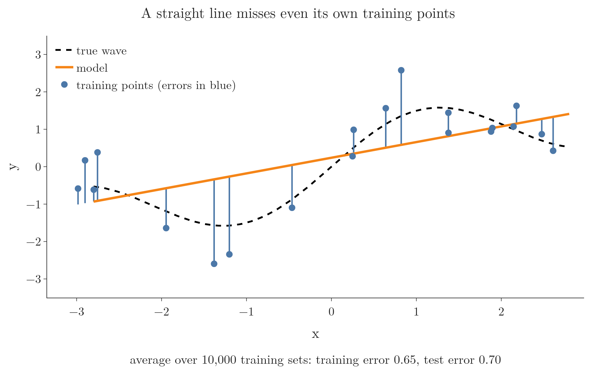
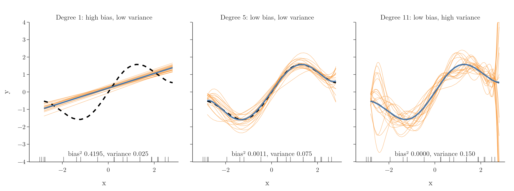
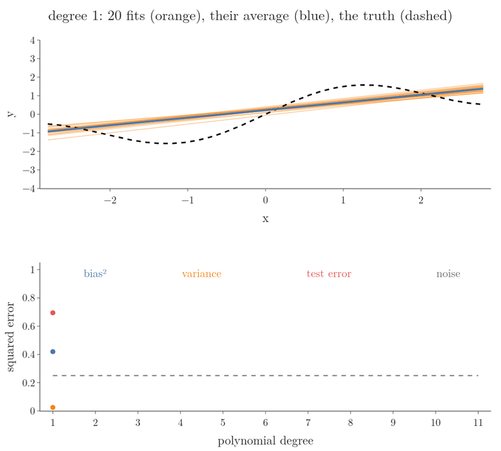

<!-- where-this-fits: generated by course_map/build_map.py; edit concepts.yaml, not this block -->
> **Where this fits:** Pipeline map step 9 (Evaluate). See the [Course map](../../../00-course-map/00-course-map.md).
>
> 
>
> - **Builds on:** [Overfitting](../../../ML/01-foundations/ML-007-challenges-in-ml/ML-007-challenges-in-ml.md#71-overfitting); [Underfitting](../../../ML/01-foundations/ML-007-challenges-in-ml/ML-007-challenges-in-ml.md#72-underfitting); [Polynomial regression](../../../ML/06-regression/ML-060-polynomial-regression/ML-060-polynomial-regression.md#3-adding-powers-as-new-features).
> - **Leads to:** [Ridge regression](../../../ML/06-regression/ML-065-ridge-key-points/ML-065-ridge-key-points.md#1-overview); [Ensemble learning](../../../ML/08-trees-and-ensembles/ML-095-ensemble-learning/ML-095-ensemble-learning.md#3-how-an-ensemble-predicts); [Bagging](../../../ML/08-trees-and-ensembles/ML-101-bagging-regressor/ML-101-bagging-regressor.md#4-baggingregressor-on-the-boston-housing-data); [Boosting](../../../ML/08-trees-and-ensembles/ML-113-bagging-vs-boosting/ML-113-bagging-vs-boosting.md#21-boosting-high-bias-low-variance-models).
> - **Compare with:** [K-nearest neighbours](../../../ML/07-classification/ML-085-knn/ML-085-knn.md#2-how-knn-predicts).
<!-- /where-this-fits -->

## 1. Overview

> **Key point:** A model's error on new data comes from two sources: bias (it is too simple to capture the pattern) and variance (it changes too much with the training data). Making one smaller usually makes the other larger (ISL §2.2.2).

[Polynomial regression](../ML-060-polynomial-regression/ML-060-polynomial-regression.md#1-overview) (G-1515; fitting a curve whose highest power of $x$ is its **degree**; degree 1 is a straight line) showed that a degree too low underfits (misses the pattern) and a degree too high overfits (follows the noise). This Note gives the two problems their standard names, **bias** (G-287) and **variance** (G-2073), and explains why reducing one tends to increase the other. The tension between them is the **bias-variance trade-off** (G-288), one of the central ideas of ML.

Throughout, a **feature** (G-772) is an input variable (one column of the data table), the **target** (G-1949) is the output we predict, and an **observation** (G-1374) is one record (one row).

## 2. Bias

> **Key point:** Bias is a model's inability to capture the true relationship. A high-bias model makes the same kind of mistake whatever data it is trained on.

Suppose the true relationship between a feature and the target is a curve, and we fit a straight line. However the line is placed, it cannot bend to follow the curve. The error that comes from the model's shape being too simple is its **bias**.

A high-bias model:

- has a large error on the **training set** (G-2002; [the data the model learns from](../../01-foundations/ML-012-toy-project/ML-012-toy-project.md#6-training-and-test-sets)) itself, because it cannot even fit the points it learns from;
- also has a large error on new data;
- is **underfitting** (G-2035; too simple for the pattern, [see the challenges of ML](../../01-foundations/ML-007-challenges-in-ml/ML-007-challenges-in-ml.md#72-underfitting)).

Figure 1 fits a straight line to one training set of 20 observations from the wave used in section 4. Watch the blue error bars: they stay long even though these are the very points the line was trained on.

## 3. Variance

> **Key point:** Variance is how much a model changes when trained on a different sample of data. A high-variance model fits the noise of whichever sample it saw.

Now fit a very flexible model, such as a high-degree polynomial. The polynomial can bend through almost every training point, so its training error is tiny. But train it again on a different random sample from the same source, and it bends differently, because it followed the noise of each sample.

How much the model's predictions change from one training set to another is its **variance**. A high-variance model:

- has a small error on the training data;
- has a large error on new data, because it learned noise that does not repeat;
- shows a big gap between training and test performance;
- is **overfitting** (G-1429; fitting the noise as well as the pattern, [see the challenges of ML](../../01-foundations/ML-007-challenges-in-ml/ML-007-challenges-in-ml.md#71-overfitting)).

Figure 2 fits a degree-11 polynomial to the same training set, then shows new points at the same inputs, with fresh noise. Watch the blue bars almost vanish while the red bars to the new points stay long.

A quick way to spot high variance is to compare the two errors. For the degree-11 polynomial the training error is 0.10 and the test error is 0.40: a gap of 0.30. For the straight line of Section 2 the errors are 0.65 and 0.70: a gap of only 0.05. A large gap between training error and test error is the usual sign of high variance, and variance is often described loosely as that gap. The gap is a symptom; the cause is that the fitted model changes from one training set to the next, which Section 4 measures directly.

### 3.1 Another way to see it: three students before an exam

> **Key point:** The student who learns nothing underfits; the student who memorises last year's answers overfits; the student who understands the subject does well on new questions.

| Student | Prepares by | Questions seen before | New questions in the exam | Like a model with |
|---|---|---|---|---|
| Takes it lightly | not studying | wrong | wrong | high bias: underfitting |
| Memoriser | learning old answers by heart, without the logic | right | wrong | low bias, high variance: overfitting |
| Understands | learning the logic | mostly right | mostly right | low bias, low variance |

The questions seen before play the role of the training set, and the exam plays the role of the **test set** (G-1962; the new data used to check the model, [training and test sets](../../01-foundations/ML-012-toy-project/ML-012-toy-project.md#6-training-and-test-sets)). The memoriser's marks depend entirely on which old questions happened to come up, just as a high-variance model depends on which training set it happened to see. The goal is the third student: not perfect on the old questions, but good on both.

Model variance has a different meaning from the variance of a feature, the average squared distance of its values from their mean (see [the standard deviation of a column](../../02-getting-data/ML-018-understanding-your-data/ML-018-understanding-your-data.md#71-count-mean-standard-deviation-minimum-and-maximum) and [variance as spread](../../05-dimensionality/ML-046-pca-geometric-intuition/ML-046-pca-geometric-intuition.md#5-variance)). Model variance is the spread of the model's predictions across training sets, not the spread of the data.

## 4. Seeing bias and variance

> **Key point:** Train the same model on many training sets. The spread of the resulting curves is the variance; how far their average is from the truth is the bias.

We use one feature $x$ and the target $y$; each observation is one $(x, y)$ pair. The true relationship is a wave (dashed black).

We build many training sets of 20 observations, as in Figure 3 and Figure 4. Every set uses the same 20 values of $x$ (the grey ticks); only the random noise in $y$ is new each time, the standard setting for measuring bias and variance (ESL §7.3). We train a model on each set and draw 20 of the curves (orange) and their average (blue). The numbers are averaged over 10,000 training sets.

Figure 3 shows the experiment as it happens, for two of the models. Each frame draws a new training set and refits both; the earlier fits stay behind as faint ghosts. Watch the lines stay together but miss the wave, while the degree-11 curves scatter more with every new set.

Figure 4 collects the result for three models, with a middle model added.

| Model | Curves | Bias² | Variance |
|---|---|---|---|
| Degree 1 | all similar, all wrong | 0.4195 | 0.025 |
| Degree 5 | similar and close to the truth | 0.0011 | 0.075 |
| Degree 11 | right on average, very different from each other | 0.0000 | 0.150 |

- **Degree 1** (a straight line) gives nearly the same line every time: low variance. But that line can never follow the wave: high bias.
- **Degree 11** follows the wave on average (its average curve sits on the truth) but every curve swings differently, wildly so between the inputs near the edges: high variance.
- **Degree 5** has both low: the target.

The dartboard in Figure 5 is a common way to picture the four combinations: bias is how far the throws land from the centre on average, variance is how scattered they are.

{height=42%}

## 5. The trade-off

> **Key point:** As a model becomes more complex, bias falls and variance rises. The best model is at the complexity where their sum is smallest.

The expected squared error of a model on new data splits into three parts (ISL §2.2.2, equation 2.7):

$$\text{expected error} = \text{bias}^2 + \text{variance} + \text{noise}$$

- **Bias²:** error from the model being too simple.
- **Variance:** error from the model depending too much on the particular training set.
- **Noise:** randomness in the data itself, the **irreducible error** (G-1327). No model can remove it.

With numbers, the three parts add up to the total error. For degree 5:

$$0.0011 + 0.075 + 0.25 = 0.326$$

For degree 1:

$$0.4195 + 0.025 + 0.25 = 0.695$$

Figure 6 measures all three for degrees 1 to 11. The test error here is the error on a new noisy target at the same 20 inputs.

{height=48%}

- On the left, simple models have high bias and low variance: **underfitting**.
- On the right, complex models have low bias and high variance: **overfitting**.
- Bias² falls as the degree grows and never rises again: 0.42 at degree 1, 0.001 at degree 5, 0.0000 from degree 7 on.
- Variance rises steadily, from 0.025 at degree 1 to 0.150 at degree 11. The rise follows a simple rule, shown in the Extra below: the variance is $\sigma^2 p / N$, with noise $\sigma^2 = 0.25$, $p$ coefficients (degree + 1) and $N = 20$ observations.

  Degree 1 has $p = 2$:

  $$\frac{0.25 \times 2}{20} = 0.025$$

  Degree 11 has $p = 12$:

  $$\frac{0.25 \times 12}{20} = 0.150$$

- The total error is smallest in between, here at degree 5 (0.326), close to the noise floor of 0.25.

Figure 7 draws the same three curves one degree at a time, with the fits that produce each point above them. Watch the top panel: at degree 1 the orange fits lie together but far from the dashed wave; from degree 5 on they follow the wave but fan out more with every step. In the bottom panel the blue bias² curve drops, the orange variance curve climbs, and the red test error turns upward after degree 5.

{width=100%}

Making a model more flexible buys lower bias at the price of higher variance, and the reverse: like a tailor choosing between one standard size that fits nobody well and a suit cut so tight to one fitting that it fails the next day. This exchange of one error for the other is the trade-off. The goal is not zero bias or zero variance, but the lowest total error.

> **Extra:** The shapes in Figure 6 are exactly what the theory predicts for a least-squares fit with fixed inputs (ESL §7.3, equations 7.11 and 7.12):
>
> - **Bias² never rises with the degree.** Every polynomial of degree 5 is also a polynomial of degree 6 (with a zero last coefficient), so a larger family can always fit the true curve at least as well as a smaller one.
> - **Variance grows in a straight line:** it equals $\sigma^2 p / N$, where $\sigma^2 = 0.25$ is the noise, $p$ is the number of coefficients (degree + 1) and $N = 20$ is the number of observations. For degree 11, this is the value we measured:
>
>   $$\frac{0.25 \times 12}{20} = 0.150$$
>
> The notebook checks both formulas against the 10,000 fits; they agree to three decimals. We use so many training sets because averaging $K$ curves keeps $1/K$ of their variance; with few sets, that leftover variance would look like bias.

## 6. What to do about it

> **Key point:** Underfitting: make the model more flexible or add better features. Overfitting: get more data, simplify the model, or use regularisation or bagging. Boosting works from the other side: it lowers the bias of simple models.

| Problem | Signs | Remedies |
|---|---|---|
| High bias (underfitting) | high training error, test error about the same | a more complex model, more or better features (feature engineering) |
| High variance (overfitting) | low training error, much higher test error | more training data, a simpler model, regularisation, bagging |

Two of the variance fixes follow from the rule of Section 5, variance $= \sigma^2 p / N$: more training data makes $N$ larger, and a simpler model makes $p$ smaller, so both shrink the variance. For degree 11 with twice as many observations, $N = 40$:

$$\frac{0.25 \times 12}{40} = 0.075$$

half of the 0.150 measured with 20.

Finding the model between too simple and too complex is the practical goal: we accept a little more bias when it buys a larger drop in variance. Three standard techniques, all covered later, target this trade-off directly:

- **Regularisation** (G-1659) (Ridge, Lasso and Elastic Net, starting with [Ridge](../ML-062-ridge-regression-intuition/ML-062-ridge-regression-intuition.md#1-overview)): keeps a flexible model but penalises large coefficients. As the penalty grows, variance falls and bias rises (ISL §6.2.1).
- **Bagging** (G-251) (for example [random forests](../../08-trees-and-ensembles/ML-102-random-forest-intro/ML-102-random-forest-intro.md#1-overview)): averages many high-variance models trained on different bootstrap samples; averaging many results reduces variance (ISL §8.2.1). The Extra in Section 5 uses the same fact.
- **Boosting** (G-318; [the four types of ensemble](../../08-trees-and-ensembles/ML-095-ensemble-learning/ML-095-ensemble-learning.md#44-boosting)): builds a model in sequence from many small, simple models, each fitted to the errors left by the ones before, so the fit improves step by step where it was poor (ISL §8.2.3). Each small model alone is too simple (high bias); adding them up step by step lowers the bias, so boosting attacks underfitting, where bagging attacks overfitting.

> **Extra:** The terms come from statistics, where the bias of an estimate is the difference between its average value and the true value, which is exactly what Section 4 measured with the average curve. The "bias" here is different from the bias (intercept) term of a model and from social bias in data; it means systematic error of the model's predictions.

## 7. Summary

| | High bias | High variance |
|---|---|---|
| Model | too simple | too flexible |
| Training error | high | low |
| Test error | high | high |
| Name | underfitting | overfitting |
| Fixes | more complex model, better features | more data, simpler model, regularisation, bagging |

- Reading the training and test errors side by side tells which problem a model has, and so which fix to reach for: both high means bias, a large gap means variance.

- Expected error = bias² + variance + noise; the noise cannot be removed, so even the best model keeps an error of at least the noise (0.25 here).
- More complexity lowers bias and raises variance; the best model balances them, because the goal is the lowest total error, not zero bias or zero variance.
- On the wave example, degree 5 gives the lowest total error (0.33), against 0.70 for a line and 0.40 for degree 11, because degree 5 is flexible enough to follow the wave but not so flexible that it follows the noise.
- Together these answer the opening question: error on new data comes from bias and variance, and making a model more complex trades one for the other.

## 8. Sources

**Built from**

- CampusX, "Bias Variance Trade-off | Overfitting and Underfitting in Machine Learning", YouTube, https://www.youtube.com/watch?v=74DU02Fyrhk
- StatQuest with Josh Starmer, "Machine Learning Fundamentals: Bias and Variance", YouTube, https://www.youtube.com/watch?v=EuBBz3bI-aA

**Other references**

- **ISL**: James, Witten, Hastie, Tibshirani, *An Introduction to Statistical Learning*, 2nd ed., Springer, 2021. §2.2.2 (the bias-variance trade-off, equation 2.7), §6.2.1 (ridge regression), §8.2.1 (bagging), §8.2.3 (boosting).
- **ESL**: Hastie, Tibshirani, Friedman, *The Elements of Statistical Learning*, 2nd ed., Springer, 2009. Section 7.3, "The Bias-Variance Decomposition".

## 9. Key terms

Terms taught in this Note come first; linked terms are recaps, taught in the Note the link opens.

| Term | Meaning |
|---|---|
| Bias (of a model) (G-287) | Error from a model being too simple to capture the true relationship. |
| Variance (of a model) (G-2073) | How much a model's predictions change when it is trained on a different sample of the data; a different meaning from the variance of a column. |
| Bias-variance trade-off (G-288) | Lowering bias by adding complexity tends to raise variance, and the reverse. |
| Noise (irreducible error) (G-1327) | Randomness in the data that no model can predict. |
| [Polynomial regression](../../../ML/06-regression/ML-060-polynomial-regression/ML-060-polynomial-regression.md#1-overview) (G-1515) | Linear regression on powers (and products) of the inputs, to fit curves. |
| [Feature](../../../ML/01-foundations/ML-002-ai-vs-ml-vs-dl/ML-002-ai-vs-ml-vs-dl.md#52-features-chosen-by-us-or-learned) (G-772) | One piece of information about each example that a model uses (e.g. a student's CGPA). |
| [Target](../../../ML/01-foundations/ML-003-types-of-ml/ML-003-types-of-ml.md#21-learning-from-inputs-and-outputs) (G-1949) | The output column we predict, such as the class; also called the label. |
| [Observation](../../../ML/01-foundations/ML-003-types-of-ml/ML-003-types-of-ml.md#21-learning-from-inputs-and-outputs) (G-1374) | One record of a dataset: one row of the data table. |
| [Training set](../../../ML/01-foundations/ML-012-toy-project/ML-012-toy-project.md#6-training-and-test-sets) (G-2002) | The part of the data the model learns from. |
| [Underfitting](../../../ML/01-foundations/ML-007-challenges-in-ml/ML-007-challenges-in-ml.md#72-underfitting) (G-2035) | Being too simple to capture the pattern; fails on all data. |
| [Overfitting](../../../ML/01-foundations/ML-007-challenges-in-ml/ML-007-challenges-in-ml.md#71-overfitting) (G-1429) | Learning the training data too closely, noise included; fails on new data. |
| [Test set](../../../ML/01-foundations/ML-012-toy-project/ML-012-toy-project.md#6-training-and-test-sets) (G-1962) | The part hidden during training, used to check the model. |
| [Regularisation](../../../ML/06-regression/ML-062-ridge-regression-intuition/ML-062-ridge-regression-intuition.md#1-overview) (G-1659) | Adding a penalty for large coefficients to the loss, so the model overfits less (lower variance). |
| [Bagging (bootstrap aggregation)](../../../ML/08-trees-and-ensembles/ML-095-ensemble-learning/ML-095-ensemble-learning.md#43-bagging) (G-251) | Training many models on different random samples of the data and averaging them, so the result depends less on the particular sample (lower variance). |
| [Boosting](../../../ML/08-trees-and-ensembles/ML-095-ensemble-learning/ML-095-ensemble-learning.md#44-boosting) (G-318) | Combining many simple models one after another to reduce bias, the error of a model that is too simple. |
