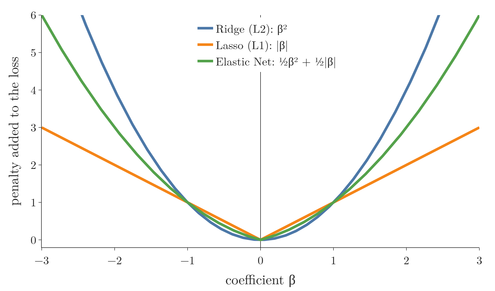
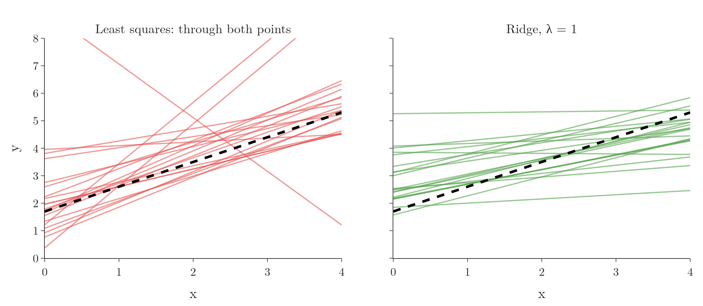
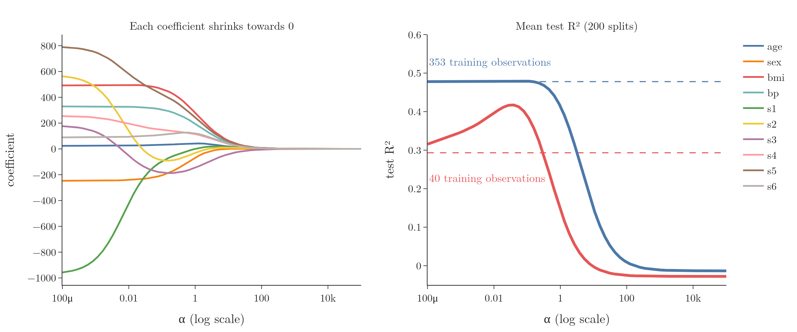

<!-- where-this-fits: generated by course_map/build_map.py; edit concepts.yaml, not this block -->
> **Where this fits:** Pipeline map step 8 (Model). See the [Course map](../../../00-course-map/00-course-map.md).
>
> 
>
> - **Builds on:** [Overfitting](../../../ML/01-foundations/ML-007-challenges-in-ml/ML-007-challenges-in-ml.md#71-overfitting); [Vector magnitude, distance and scalar operations](../../../MA/05-linear-algebra/MA-049-magnitude-distance-and-scalar-operations/MA-049-magnitude-distance-and-scalar-operations.md#2-magnitude-the-distance-from-the-origin); [Standardization](../../../ML/03-feature-engineering/ML-023-standardization/ML-023-standardization.md#4-the-standardization-formula); [Multiple linear regression](../../../ML/06-regression/ML-052-multiple-linear-regression/ML-052-multiple-linear-regression.md#2-from-a-line-to-a-hyperplane); [Normal equation](../../../ML/06-regression/ML-053-multiple-lr-maths/ML-053-multiple-lr-maths.md#6-the-normal-equation); [Gradient descent](../../../ML/06-regression/ML-056-gradient-descent/ML-056-gradient-descent.md#2-the-idea); [Bias-variance trade-off](../../../ML/06-regression/ML-061-bias-variance/ML-061-bias-variance.md#5-the-trade-off); [Lagrange multipliers, KKT and duality](../../../MA/07-optimisation/MA-066-lagrange-multipliers/MA-066-lagrange-multipliers.md#4-the-lagrangian); [MAP estimation](../../../MA/08-likelihood/MA-072-mle-in-machine-learning/MA-072-mle-in-machine-learning.md#7-map-estimation-maximum-likelihood-plus-a-prior).
> - **Leads to:** [Lasso regression](../../../ML/06-regression/ML-066-lasso-regression/ML-066-lasso-regression.md#2-one-feature-the-slope-reaches-exactly-0); [Elastic Net](../../../ML/06-regression/ML-068-elastic-net/ML-068-elastic-net.md#2-the-loss-function); [Support vector machines](../../../ML/07-classification/ML-086-svm-intuition/ML-086-svm-intuition.md#33-the-core-idea-of-svm); [XGBoost](../../../ML/08-trees-and-ensembles/ML-117-xgboost-intro/ML-117-xgboost-intro.md#3-what-xgboost-is); [Dropout](../../../DL/02-training/DL-024-dropout/DL-024-dropout.md#4-how-dropout-works); [L1 and L2 regularisation in neural networks](../../../DL/02-training/DL-026-regularization-in-dl/DL-026-regularization-in-dl.md#5-the-penalty-term); [Data augmentation](../../../DL/04-cnn/DL-050-data-augmentation/DL-050-data-augmentation.md#4-the-transformations).
> - **Compare with:** [Lasso regression](../../../ML/06-regression/ML-066-lasso-regression/ML-066-lasso-regression.md#2-one-feature-the-slope-reaches-exactly-0); [L1 and L2 regularisation in neural networks](../../../DL/02-training/DL-026-regularization-in-dl/DL-026-regularization-in-dl.md#5-the-penalty-term).
<!-- /where-this-fits -->

## 1. Overview

> **Key point:** Regularisation adds a penalty to the loss so the model cannot overfit as easily. Ridge regression penalises the squares of the coefficients, which keeps them small.

Every linear model multiplies each input by a number, its **coefficient** (G-407; see [the equation](../ML-052-multiple-linear-regression/ML-052-multiple-linear-regression.md#3-the-equation)); in $y = mx + b$ the coefficient is the slope $m$. Training chooses the coefficients to make the **loss** (G-706; see [adding the errors up](../ML-050-linear-regression-maths/ML-050-linear-regression-maths.md#32-adding-the-errors-up)) small, where the loss is the total of the model's errors.

**Regularisation** (G-1659) is a technique that adds extra information to a model to reduce overfitting. Regularisation sits next to bagging and boosting as one of the main tools against high variance, and it is especially important for linear models: linear regression, logistic regression and others.

There are three standard regularised versions of linear regression:

| Name | Penalty | Also called |
|---|---|---|
| **Ridge regression** (G-1691) | sum of squared coefficients (for coefficients 3 and −2: $9 + 4 = 13$) | **L2 regularisation** (G-1029) |
| **Lasso regression** (G-1047) | sum of absolute coefficients | L1 regularisation |
| **Elastic Net** (G-667) | a mix of both | |

Figure 1 draws the three penalties for a single coefficient $\beta$. All three are 0 when the coefficient is 0 and grow with its size, so all three push coefficients towards 0. They differ in how: the square is gentle on small coefficients ($0.5^2 = 0.25$) and harsh on large ones ($2^2 = 4$), while the absolute value charges the same rate everywhere and has a sharp corner at 0. That corner is why Lasso can set coefficients exactly to 0 (see [a corner in the loss curve](../ML-067-lasso-sparsity/ML-067-lasso-sparsity.md#2-the-picture-a-corner-in-the-loss-curve)).



This Note covers the idea of regularisation and of Ridge. What comes next:

- [the Ridge loss and its solution](../ML-063-ridge-regression-maths/ML-063-ridge-regression-maths.md#2-one-feature), derived;
- [Ridge trained by gradient descent](../ML-064-ridge-gradient-descent/ML-064-ridge-gradient-descent.md#2-the-gradient);
- [five key properties of Ridge](../ML-065-ridge-key-points/ML-065-ridge-key-points.md#2-point-1-coefficients-shrink-but-never-reach-0);
- [Lasso](../ML-066-lasso-regression/ML-066-lasso-regression.md#2-one-feature-the-slope-reaches-exactly-0) and [Elastic Net](../ML-068-elastic-net/ML-068-elastic-net.md#2-the-loss-function).

## 2. The problem: overfitting in linear models

> **Key point:** An overfitting linear model has extreme coefficients: a very steep line that chases the training points.

**Overfitting** (G-1429) means a model performs very well on the training data but poorly on new data, and gives very different results when trained on different samples (the high [variance](../ML-061-bias-variance/ML-061-bias-variance.md#3-variance): the fitted model changes a lot from one training sample to the next).

For linear regression, overfitting shows up in the coefficients. Each **feature** (G-772; an input variable, one column of the data table) gets one coefficient, and each **observation** (G-1374; one record, one row of the table) is one training point. The **target** (G-1949) is the value we predict. Take the extreme case of only two training points. The least-squares line passes exactly through both, with zero training error. Its slope is whatever those two points dictate, which may be much steeper than the real pattern. On new points the line can be far off.

Figure 2 (left) draws 20 such samples of two points, all from the same gentle pattern (the dashed line). Watch how far the least-squares lines swing: from one sample to the next the slope ranges from $-2.0$ to $2.3$, while the true slope is 0.9. The right panel previews the fix of Section 3: the Ridge slopes stay between about 0 and 0.7 (the lowest is $-0.02$).

{height=40%}

So the warning sign of an overfitting linear model is **large coefficients**: the line or plane tilts sharply to fit the training points exactly.

## 3. The idea: penalise large coefficients

> **Key point:** Ridge minimises the usual squared error plus λ times the squared slope. A steep line now costs something, so the model prefers a flatter one unless the data strongly supports the steep one.

Ridge regression changes the loss function. In words: the loss is the usual sum of squared errors, plus a penalty equal to $\lambda$ times the square of the slope.

$$L = \sum_{i=1}^{n} (y_i - \hat y_i)^2 + \lambda m^2$$

The symbols: $y_i$ is the actual target of observation $i$, $\hat y_i$ ("y hat") the model's prediction for it, $n$ the number of observations, $m$ the slope, and $\sum_{i=1}^{n}$ means "add up the term for every observation $i$ from 1 to $n$". The first part, $\sum (y_i - \hat y_i)^2$, is the sum of squared errors, the loss of Section 1. $\lambda$ (lambda; G-2150) is a **hyperparameter** (G-910; a setting we choose before training), at least 0, that sets how strong the penalty is. With several features, each coefficient $\beta_j$ gets its own square in the penalty, for example with three coefficients:

$$\lambda(\beta_1^2 + \beta_2^2 + \beta_3^2) = \lambda \sum_{j} \beta_j^2$$

The intercept $b$ is not penalised: it only measures the average level of $y$, and shrinking it would not make the line flatter (ISL §6.2.1).

With numbers, Figure 3 has two training points, $(1, 2)$ and $(3, 5)$, and $\lambda = 1$.

{height=45%}

- **The least-squares line** passes through both points: slope 1.5, errors 0. With the penalty, its loss is:

  $$0 + 1 \times 1.5^2 = 2.25$$

- **A flatter line** with slope 0.9 misses both points slightly: the squared errors add to 0.72. Its loss is:

  $$0.72 + 1 \times 0.9^2 = 1.53$$


With the penalty, the flatter line has the lower loss, so Ridge prefers it. Figure 3 is a made-up example: its grey test points were drawn from a flatter pattern, to picture the case Ridge is built for. Section 4.3 tests the idea on real data.

Figure 4 lets λ grow on the same two points. Watch the line pivot about the middle point $(2, 3.5)$ and flatten, while the bars trade off: the errors grow, and the penalty first grows and then shrinks as the slope nears 0. At λ = 1 the best line has slope 1.0 and this loss:

$$0.50 + 1.00 = 1.50$$

That is a little below the 1.53 of the slope-0.9 line.


Ridge gives up a little accuracy on the training data (some bias) in exchange for a model that changes less from sample to sample (less variance): the **bias-variance trade-off** (G-288; see [the trade-off](../ML-061-bias-variance/ML-061-bias-variance.md#5-the-trade-off)). As $\lambda$ grows, variance falls and bias rises (ISL §6.2.1).

Think of a tailor who fits a suit to one photo of a customer. A suit that follows every fold of that one photo fits badly on the real day. A tailor who keeps the cut a little plain, trusting the photo less, does better on average. Ridge keeps the coefficients plain in the same way.

**Why a smaller slope predicts better.** The slope says how much the prediction changes when the feature changes by 1. In Figure 3, the least-squares slope 1.5 moves the prediction by 1.5 for each unit of $x$; the flatter slope 0.9 moves it by only 0.9. A steep line is very sensitive to small changes in the feature, so a little noise in the two training points turns into a large change in the predictions. A flatter line reacts less, so its predictions change less from sample to sample (StatQuest, "Regularization Part 1").

## 4. The effect of λ

> **Key point:** λ = 0 is ordinary linear regression. As λ grows, the coefficients shrink towards 0. Too large a λ flattens the model into **underfitting** (G-2035).

### 4.1 One feature

> **Key point:** With one feature, a larger penalty gives a flatter line.

Figure 5 (left) fits 100 observations with one feature. In scikit-learn the penalty strength is called `alpha` instead of $\lambda$.

{height=45%}

| alpha | Slope |
|---|---|
| 0 (linear regression) | 27.8 |
| 10 | 25.0 |
| 100 | 12.9 |

The slope shrinks as alpha grows, while the intercept changes little.

### 4.2 A flexible model

> **Key point:** On a degree-16 polynomial, α = 0 overfits, α = 20 follows the pattern, α = 200 is too stiff.

Regularisation matters most for flexible models. Figure 5 (right) fits a degree-16 polynomial (a curve with terms up to $x^{16}$, so it can bend many times) to curved data:

- **alpha = 0:** the curve bends to chase individual points and swings at the edges: overfitting.
- **alpha = 20:** the penalty keeps the many coefficients small, and the curve follows the overall pattern.
- **alpha = 200:** the coefficients are squeezed so hard that the curve is too flat in places: underfitting.

The best alpha is somewhere in between and is found by trying values on held-out data, like any hyperparameter.

### 4.3 Many features: the diabetes data

> **Key point:** As alpha grows, every coefficient is pulled towards 0 (**shrinkage**, G-1796). With few training observations, a small alpha raises test R² (the share of the target's variation the model explains: 1 is perfect, 0 is no better than the average; see [R² score](../ML-051-regression-metrics/ML-051-regression-metrics.md#6-r²-score)) a lot; a huge alpha destroys the model.

Figure 6 trains Ridge on the diabetes data (10 features, 442 observations; the target is disease progression one year later) with alpha from 0.0001 to 100,000.

{height=45%}

- **Left** (one split, 353 training observations): at a large alpha every coefficient ends near 0, though not always in a straight line (age and s6 first grow, s3 changes sign). The biggest one, s1 ($-971$), shrinks fastest. Why was it so big? s1 and s2 are strongly correlated ($r = 0.90$). Plain linear regression gives such a pair large opposite coefficients ($-971$ and $+574$) that partly cancel each other, and Ridge's limit on coefficient size stops this (ESL §3.4.1). At alpha 0.01 the pair is already down to $-421$ and $+138$. The penalty limits the coefficients as a whole, not each one: their overall size (the square root of the sum of their squares) falls at every step, from 1,540 at alpha 0.0001 to 482 at alpha 1 (Notebook). Inside that shrinking total a single coefficient can still grow for a while: age goes from 23.5 to 43.0 over the same range before it too shrinks towards 0.
- **Right** (mean test R² over 200 random splits; dashed lines are plain linear regression):
  - **40 training observations:** plain linear regression scores 0.29. Ridge at alpha 0.04 scores 0.42, a large gain.
  - **353 training observations:** 0.478 against 0.480, almost no gain.
  - **Huge alpha:** with alpha 100,000 every coefficient is about 0 and $R^2 \approx 0$: the model just predicts the average.

Why the difference? With 40 observations and 10 features, the least-squares coefficients swing a lot from sample to sample (high variance), so taming them pays off. With 353 observations the least-squares fit is already stable, so there is little variance to remove. Ridge works best where least squares has high variance (ISL §6.2.1).

> **Python:** Ridge in scikit-learn.
>
> ```python
> from sklearn.linear_model import Ridge
>
> ridge = Ridge(alpha=0.1)        # alpha is the λ of the formula
> ridge.fit(X_train, y_train)
> ridge.coef_                      # smaller than LinearRegression's
> ridge.score(X_test, y_test)
> ```

> **Extra:** Ridge also works when there are more coefficients than observations. Least squares needs at least as many observations as coefficients: with 10,001 coefficients and only 500 observations, many different sets of coefficients fit the training data exactly, and least squares cannot choose between them. The Ridge penalty picks the one answer with the smallest coefficients, so Ridge still gives a single model (StatQuest, "Regularization Part 1"; ISL §6.2.1). The last Extra of [not penalising the intercept](../ML-063-ridge-regression-maths/ML-063-ridge-regression-maths.md#34-not-penalising-the-intercept) shows why in one line of matrix algebra.

> **Extra:** The penalty depends on the size of each coefficient, and coefficients depend on the scale of their features. A feature measured in grams gets a much smaller coefficient than the same feature in kilograms, so it would be penalised less. For this reason features are **standardised** (G-1874; rescaled to mean 0 and spread 1, see [the standardization formula](../../03-feature-engineering/ML-023-standardization/ML-023-standardization.md#4-the-standardization-formula)) before Ridge (ISL §6.2.1; ESL §3.4.1). The diabetes features already come scaled (scikit-learn docs, `load_diabetes`). In a pipeline: `make_pipeline(StandardScaler(), Ridge(alpha=1))`.

## 5. Summary

| alpha (λ) | Effect | Why |
|---|---|---|
| 0 | ordinary linear regression | the penalty term is 0 |
| small | smaller coefficients; better test R² when training data is small | it tames coefficients that swing from sample to sample (0.29 to 0.42 with 40 observations) |
| large | coefficients near 0, the model underfits | the penalty outweighs the errors, so the model just predicts the average |

- Overfitting linear models have extreme coefficients, because a steep line or plane tilts sharply to pass through the training points.
- Ridge adds $\lambda \sum \beta_j^2$ to the loss; the intercept is not penalised, because it only sets the average level of $y$, and shrinking it would not make the line flatter.
- Ridge trades a little bias for less variance, and helps most where least squares has high variance, so it gains a lot with few observations and almost nothing with many.
- alpha is tuned on held-out data; features should be standardised first, because the penalty depends on each coefficient's size, and that size depends on its feature's units.
- Together these answer the opening question: adding a penalty on the squared coefficients keeps them small, so the model chases the training points less and overfits less.


## 6. Sources

**Built from**

- CampusX, "Ridge Regression Part 1 | Geometric Intuition and Code | Regularized Linear Models", YouTube, https://www.youtube.com/watch?v=aEow1QoTLo0
- StatQuest with Josh Starmer, "Regularization Part 1: Ridge (L2) Regression", YouTube, https://www.youtube.com/watch?v=Q81RR3yKn30. The idea of animating the line as λ grows (Figure 4), the slope as sensitivity (Section 3), and Ridge with more coefficients than observations (Section 4.3).

**Other references**

- **ISL:** James, G., Witten, D., Hastie, T. and Tibshirani, R. *An Introduction to Statistical Learning*, 2nd ed. Springer, 2021. Section 6.2.1, pp. 237–241.
- **ESL:** Hastie, T., Tibshirani, R. and Friedman, J. *The Elements of Statistical Learning*, 2nd ed. Springer, 2009. Section 3.4.1, pp. 63–64.
- **scikit-learn docs:** `sklearn.datasets.load_diabetes`, scikit-learn 1.9 documentation.

## 7. Key terms

Terms taught in this Note come first; linked terms are recaps, taught in the Note the link opens.

| Term | Meaning |
|---|---|
| Regularisation (G-1659) | Adding a penalty for large coefficients to the loss, so the model overfits less (lower variance). |
| Ridge regression (G-1691) | Linear regression with a penalty on the sum of squared coefficients added to the loss; the penalty keeps the coefficients small, which reduces overfitting (L2 regularisation). |
| L2 regularisation (G-1029) | Another name for the squared-coefficient penalty used by Ridge. |
| λ (lambda), alpha (G-2150) | The strength of the regularisation penalty; alpha in scikit-learn. |
| Shrinkage (G-1796) | The pulling of a model's coefficients towards 0 by a penalty, as when Ridge's alpha grows; it makes the model rely less on any one feature and can reduce overfitting. |
| [Coefficient ($\beta_i$)](../../../ML/06-regression/ML-052-multiple-linear-regression/ML-052-multiple-linear-regression.md#3-the-equation) (G-407) | The weight of one input column: the change in the output per unit of that input, others fixed. |
| [Loss function (error function)](../../../ML/06-regression/ML-050-linear-regression-maths/ML-050-linear-regression-maths.md#32-adding-the-errors-up) (G-706) | A formula that measures how wrong a model's predictions are; in deep learning, the error on one training row. |
| [Lasso regression](../../../ML/06-regression/ML-066-lasso-regression/ML-066-lasso-regression.md#1-overview) (G-1047) | Linear regression with a penalty on the sum of absolute coefficients (L1); it shrinks coefficients and can set some exactly to 0, which removes those features. |
| [Elastic Net regression (Elastic Net)](../../../ML/06-regression/ML-068-elastic-net/ML-068-elastic-net.md#1-overview) (G-667) | Linear regression whose loss gets both the L2 (ridge) and the L1 (lasso) penalty, each with its own strength. It shrinks the coefficients and can set some to 0, so we need not choose between ridge and lasso in advance. |
| [Overfitting](../../../ML/01-foundations/ML-007-challenges-in-ml/ML-007-challenges-in-ml.md#71-overfitting) (G-1429) | Learning the training data too closely, noise included; fails on new data. |
| [Feature](../../../ML/01-foundations/ML-002-ai-vs-ml-vs-dl/ML-002-ai-vs-ml-vs-dl.md#52-features-chosen-by-us-or-learned) (G-772) | One piece of information about each example that a model uses (e.g. a student's CGPA). |
| [Observation](../../../ML/01-foundations/ML-003-types-of-ml/ML-003-types-of-ml.md#21-learning-from-inputs-and-outputs) (G-1374) | One record of a dataset: one row of the data table. |
| [Target](../../../ML/01-foundations/ML-003-types-of-ml/ML-003-types-of-ml.md#21-learning-from-inputs-and-outputs) (G-1949) | The output column we predict, such as the class; also called the label. |
| [Hyperparameter](../../../ML/03-feature-engineering/ML-028-pipelines/ML-028-pipelines.md#9-hyperparameter-tuning-with-a-pipeline) (G-910) | A setting of an algorithm chosen before training, such as a tree's `max_depth`. |
| [Bias-variance trade-off](../../../ML/06-regression/ML-061-bias-variance/ML-061-bias-variance.md#5-the-trade-off) (G-288) | Lowering bias by adding complexity tends to raise variance, and the reverse. |
| [Underfitting](../../../ML/01-foundations/ML-007-challenges-in-ml/ML-007-challenges-in-ml.md#72-underfitting) (G-2035) | Being too simple to capture the pattern; fails on all data. |
| [Standardization](../../../ML/03-feature-engineering/ML-023-standardization/ML-023-standardization.md#41-the-idea-how-many-standard-deviations-from-the-mean) (G-1874) | Scaling a column to mean 0 and standard deviation 1 (subtract the mean, divide by the standard deviation), so features measured on different scales become comparable. |
