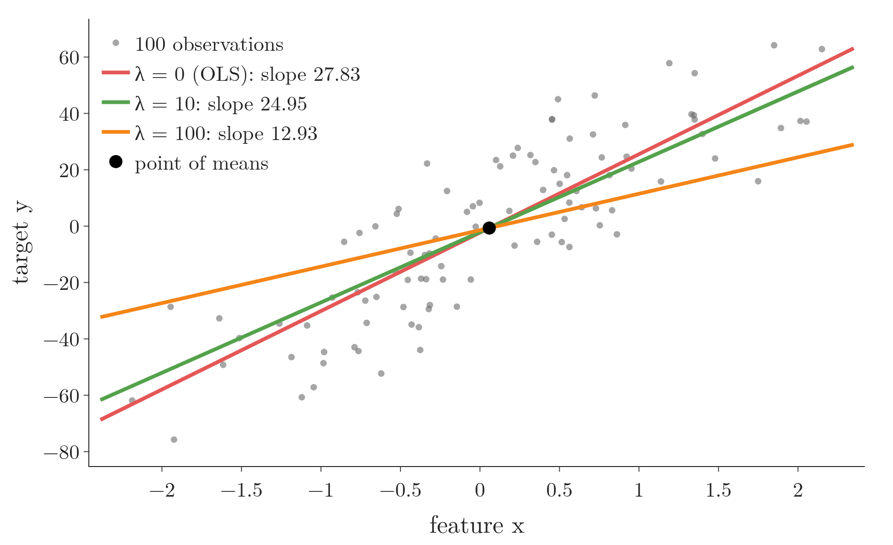
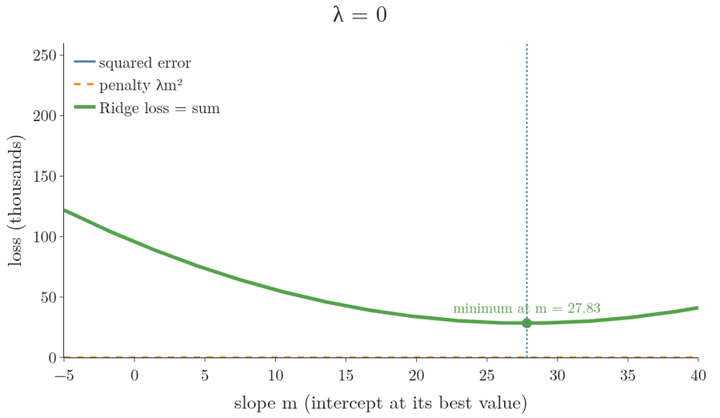
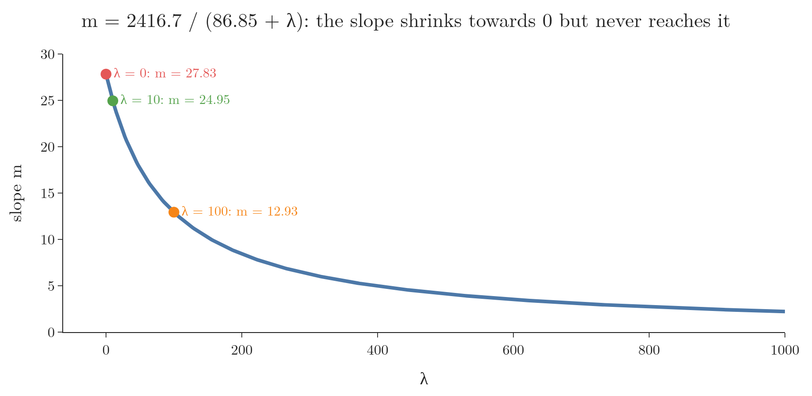
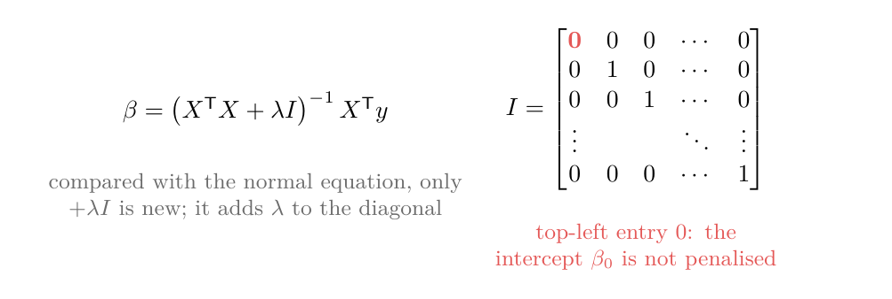
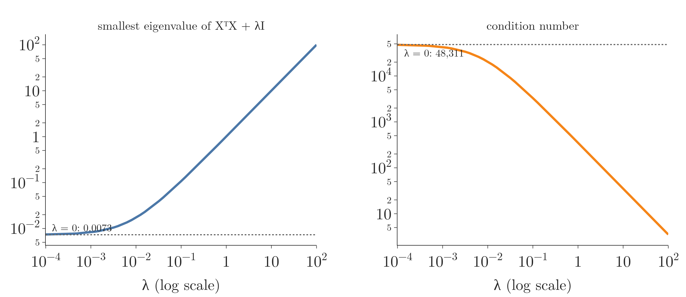

<!-- where-this-fits: generated by course_map/build_map.py; edit concepts.yaml, not this block -->
> **Where this fits:** Pipeline map step 8 (Model). See the [Course map](../../../00-course-map/00-course-map.md).
>
> 
>
> - **Builds on:** [Standardization](../../../ML/03-feature-engineering/ML-023-standardization/ML-023-standardization.md#4-the-standardization-formula); [Multiple linear regression](../../../ML/06-regression/ML-052-multiple-linear-regression/ML-052-multiple-linear-regression.md#2-from-a-line-to-a-hyperplane); [Normal equation](../../../ML/06-regression/ML-053-multiple-lr-maths/ML-053-multiple-lr-maths.md#6-the-normal-equation); [Gradient descent](../../../ML/06-regression/ML-056-gradient-descent/ML-056-gradient-descent.md#2-the-idea); [Bias-variance trade-off](../../../ML/06-regression/ML-061-bias-variance/ML-061-bias-variance.md#5-the-trade-off); [Lagrange multipliers, KKT and duality](../../../MA/07-optimisation/MA-066-lagrange-multipliers/MA-066-lagrange-multipliers.md#4-the-lagrangian); [MAP estimation](../../../MA/08-likelihood/MA-072-mle-in-machine-learning/MA-072-mle-in-machine-learning.md#7-map-estimation-maximum-likelihood-plus-a-prior); [Regularisation](../../../ML/06-regression/ML-062-ridge-regression-intuition/ML-062-ridge-regression-intuition.md#3-the-idea-penalise-large-coefficients).
> - **Compare with:** [Lasso regression](../../../ML/06-regression/ML-066-lasso-regression/ML-066-lasso-regression.md#2-one-feature-the-slope-reaches-exactly-0); [L1 and L2 regularisation in neural networks](../../../DL/02-training/DL-026-regularization-in-dl/DL-026-regularization-in-dl.md#5-the-penalty-term).
<!-- /where-this-fits -->

## 1. Overview

> **Key point:** Ridge finds its coefficients the same way plain least squares does: write the loss, find where its slope is zero, solve. The penalty changes the answer in one place only. With one feature, it adds λ to the bottom of the slope fraction; with many features, it adds λ to the diagonal of a matrix. A bigger bottom means a smaller slope.

Ridge, as [explained before](../ML-062-ridge-regression-intuition/ML-062-ridge-regression-intuition.md#3-the-idea-penalise-large-coefficients), adds λ times the squared coefficients to the loss, which keeps them small. Here λ (lambda) is the penalty strength, a number we choose, for example λ = 10. This Note derives the formulas that find the Ridge coefficients, the same way [ordinary least squares (OLS)](../ML-050-linear-regression-maths/ML-050-linear-regression-maths.md#2-two-ways-to-find-m-and-b) and [the normal equation](../ML-053-multiple-lr-maths/ML-053-multiple-lr-maths.md#6-the-normal-equation) did for plain linear regression.

Here a **feature** (G-772) is an input variable (one column of the data table), an **observation** (G-1374) is one record (one row), and the **target** (G-1949) y is the value we predict. There are two cases:

- **One feature:** a formula for the slope m and the intercept b (Section 2).
- **Many features:** a matrix formula for all coefficients at once (Section 3).

Both are worked by hand on two points, then coded from scratch and checked against scikit-learn's `Ridge`.

Figure 1 shows what the formulas will produce on the 100-observation example of [the λ sweep](../ML-062-ridge-regression-intuition/ML-062-ridge-regression-intuition.md#41-one-feature). The ordinary least-squares line has slope 27.83. With λ = 10 the **Ridge regression** (G-1691) line tilts down to 24.95, and with λ = 100 to 12.93. All three lines pass through the same point, the point of means; Section 2 shows why.



## 2. One feature

> **Key point:** The penalty pulls the slope towards 0 like a weight on one side of a seesaw. In the formula, that weight is λ added to the bottom of the OLS slope fraction. The intercept formula does not change.

Figure 2 shows the mechanism before any algebra. With the intercept at its best value for each slope, the loss is a curve in the slope m: the squared error (blue) plus the penalty λm² (orange). The penalty is a bowl centred on 0, so adding it pulls the bottom of the sum towards 0. As λ grows from 0 to 100, the bottom slides from 27.83 to 12.93, exactly the value of the formula we derive below.



Picture a seesaw: the data pulls the slope up, and λ is a weight added to the other side. The heavier the weight, the less the slope rises.

### 2.1 The loss

> **Key point:** The loss is the usual sum of squared errors plus λ times the slope squared.

With one feature, the prediction for observation i is the slope times its feature value plus the intercept:

$$\hat y_i = m x_i + b$$

Here m is the slope, as in [simple linear regression](../ML-049-simple-linear-regression/ML-049-simple-linear-regression.md#51-reading-m-and-b) (in [the normal equation](../ML-053-multiple-lr-maths/ML-053-multiple-lr-maths.md#2-the-model-in-matrix-form), m counted the features instead). The Ridge loss is

$$L = \sum_{i=1}^{n} (y_i - m x_i - b)^2 + \lambda m^2$$

The sum sign $\sum_{i=1}^{n}$ means "add the term for $i = 1$, then $i = 2$, up to $i = n$"; it runs over the n observations. For the two points below, $n = 2$. Only the slope m is penalised, not the intercept b.

We follow two points from [the previous example](../ML-062-ridge-regression-intuition/ML-062-ridge-regression-intuition.md#41-one-feature) by hand, (1, 2) and (3, 5), with λ = 1. Their means are

$$\bar x = (1 + 3) / 2 = 2$$

$$\bar y = (2 + 5) / 2 = 3.5$$

### 2.2 The intercept

> **Key point:** The penalty does not contain b, so the derivative with respect to b is the same as in OLS, and so is the answer.

Differentiate L with respect to b and set it to zero. The symbol $\frac{\partial L}{\partial b}$ is the **partial derivative** (G-1457): the slope of L as b alone changes a little, with m held fixed. The term λm² does not contain b, so it disappears:

$$\frac{\partial L}{\partial b} = -2\sum_{i=1}^{n}(y_i - m x_i - b) = 0$$

This derivative is exactly the OLS step, and it gives the same result:

$$b = \bar{y} - m\bar{x}$$

### 2.3 The slope

> **Key point:** Differentiating with respect to m adds a 2λm term, which ends up as +λ in the denominator.

Differentiate L with respect to m. The squared-error part gives the OLS terms; the penalty λm² adds 2λm:

$$\frac{\partial L}{\partial m} = -2\sum_{i=1}^{n}(y_i - m x_i - b)\thinspace x_i + 2\lambda m = 0$$

Now solve for m, one step per line, with the two points alongside.

**Step 1.** Divide by −2:

$$\sum_{i=1}^{n}(y_i - m x_i - b)\thinspace x_i - \lambda m = 0$$

**Step 2.** Replace b by its formula from Section 2.2:

$$\sum_{i=1}^{n}\left(y_i - \bar y - m(x_i - \bar x)\right) x_i - \lambda m = 0$$

**Step 3.** Split the sum into the part without m and the part with m:

$$\sum_{i=1}^{n}(y_i - \bar y)\thinspace x_i$$

$$- m\sum_{i=1}^{n}(x_i - \bar x)\thinspace x_i - \lambda m = 0$$

**Step 4.** Move both m terms to the right and take m out as a common factor:

$$\sum_{i=1}^{n}(y_i - \bar y)\thinspace x_i$$

$$= m\left(\sum_{i=1}^{n}(x_i - \bar x)\thinspace x_i + \lambda\right)$$

**Step 5.** Replace each lone $x_i$ by the deviation from the mean. The sums do not change, because deviations from a mean add up to 0 (the same trick as in the OLS derivation):

$$\sum_{i=1}^{n}(y_i - \bar y)\thinspace x_i = \sum_{i=1}^{n}(y_i - \bar y)(x_i - \bar x)$$

$$\sum_{i=1}^{n}(x_i - \bar x)\thinspace x_i = \sum_{i=1}^{n}(x_i - \bar x)^2$$

On the two points, the first pair of sums, one term per point:

$$(2 - 3.5) \times 1 + (5 - 3.5) \times 3$$

$$= -1.5 + 4.5 = 3$$

$$(2 - 3.5)(1 - 2) + (5 - 3.5)(3 - 2)$$

$$= 1.5 + 1.5 = 3$$

and the second pair:

$$(1 - 2) \times 1 + (3 - 2) \times 3$$

$$= -1 + 3 = 2$$

$$(1 - 2)^2 + (3 - 2)^2 = 1 + 1 = 2$$

**Step 6.** Divide by the bracket:

$$m = \frac{\sum_{i=1}^{n} (x_i - \bar{x})(y_i - \bar{y})}{\sum_{i=1}^{n} (x_i - \bar{x})^2 + \lambda}$$

The top of the fraction is the same as in OLS, and the bottom has λ added. With λ = 0 the formula is the OLS slope.

On the two points with λ = 1:

$$m = \frac{3}{2 + 1} = 1.0$$

$$b = 3.5 - 1.0 \times 2 = 1.5$$

Without the penalty (λ = 0) the slope would be the line through both points:

$$m = \frac{3}{2 + 0} = 1.5$$

The Ridge slope 1.0 is the one the [λ sweep](../ML-062-ridge-regression-intuition/ML-062-ridge-regression-intuition.md#41-one-feature) found at λ = 1.

> **Extra:** Step 5 in symbols. The two sides of the first line differ by one sum, which is 0:
>
> $$\sum_{i=1}^{n}(y_i - \bar y)\thinspace\bar x = \bar x\sum_{i=1}^{n}(y_i - \bar y)$$
>
> $$= \bar x \times 0 = 0$$
>
> The same holds for the second line with the deviations of x.

### 2.4 Why the slope shrinks

> **Key point:** A bigger λ makes the denominator bigger, so the slope gets smaller. The slope approaches 0 but never reaches it.

On the 100-observation example of [the λ sweep](../ML-062-ridge-regression-intuition/ML-062-ridge-regression-intuition.md#41-one-feature), each sum has 100 terms, so the computer adds them up (the notebook, two lines of NumPy). Input: the 100 pairs (x, y). Output:

$$\sum_{i=1}^{100} (x_i - \bar{x})(y_i - \bar{y}) = 2416.7$$

$$\sum_{i=1}^{100} (x_i - \bar{x})^2 = 86.85$$

So

$$m = \frac{2416.7}{86.85 + \lambda}$$

| λ | Slope $m$ | Intercept $b$ |
|---|---|---|
| 0 | $2416.7 / 86.85 = 27.83$ | $-2.295$ |
| 10 | $2416.7 / 96.85 = 24.95$ | $-2.127$ |
| 100 | $2416.7 / 186.85 = 12.93$ | $-1.425$ |

These slopes are exactly the ones scikit-learn gave in [the λ sweep](../ML-062-ridge-regression-intuition/ML-062-ridge-regression-intuition.md#41-one-feature). The intercept is not penalised, yet it moves too, because its formula from Section 2.2 contains the slope m:

$$b = \bar{y} - m\bar{x}$$

Figure 3 shows the whole curve.

{height=48%}

However large $\lambda$ gets, the fraction stays above 0. So Ridge makes coefficients small but never exactly zero. Lasso behaves differently: [its slope reaches exactly 0](../ML-066-lasso-regression/ML-066-lasso-regression.md#2-one-feature-the-slope-reaches-exactly-0).

> **Python:** Ridge with one feature, from scratch.
>
> ```python
> class MyRidge:
>     def __init__(self, alpha=0.1):
>         self.alpha = alpha                     # the λ of the formula
>
>     def fit(self, x, y):
>         num = np.sum((x - x.mean()) * (y - y.mean()))
>         den = np.sum((x - x.mean()) ** 2) + self.alpha
>         self.m = num / den
>         self.b = y.mean() - self.m * x.mean()
>         return self
>
> MyRidge(alpha=10).fit(x, y).m       # 24.955, same as Ridge(alpha=10)
> ```

## 3. Many features

> **Key point:** With many features the same recipe runs on matrices: the penalty adds λ to every number on the diagonal of the matrix that the normal equation inverts, except the intercept's.

Figure 4 shows the whole result before the steps. Compared with [the normal equation](../ML-053-multiple-lr-maths/ML-053-multiple-lr-maths.md#6-the-normal-equation), only one piece is new: λ times a matrix I that has 1s on its diagonal, with a 0 in the top-left corner so that the intercept is not penalised. Adding it puts λ on the diagonal, which makes the inverse smaller, just as λ on the bottom of the fraction made the slope smaller in Section 2.

{height=32%}

### 3.1 The loss in matrix form

> **Key point:** The penalty, λ times the sum of squared coefficients, is a row of coefficients times the same column.

With many features, the predictions are one matrix product, as in [the matrix form of linear regression](../ML-053-multiple-lr-maths/ML-053-multiple-lr-maths.md#22-stacking-the-equations):

$$\hat{y} = Xw$$

X has a first column of 1s, and w holds the intercept and all coefficients. The small raised T in $w^{\mathsf T}$ is the **transpose** (G-2012; [two rules about transposes](../ML-053-multiple-lr-maths/ML-053-multiple-lr-maths.md#41-two-rules-about-transposes)): it turns a column into a row, so a column $(1.5, 1.0)$ becomes the row $[1.5, 1.0]$. The vector w is the same coefficient vector that [the normal equation](../ML-053-multiple-lr-maths/ML-053-multiple-lr-maths.md#22-stacking-the-equations) calls β; w is the usual letter in Ridge and in the next Note. With two coefficients, for example

$$w = \begin{bmatrix} w_0 \cr w_1 \end{bmatrix}$$

$$w = \begin{bmatrix} 1.5 \cr1.0 \end{bmatrix}$$

The sum of squared coefficients is the row of coefficients times the column:

$$w^{\mathsf T}w = w_0^2 + w_1^2 = 1.5^2 + 1.0^2 = 3.25$$

So the Ridge loss is

$$L = (y - Xw)^{\mathsf T}(y - Xw) + \lambda\thinspace w^{\mathsf T}w$$

### 3.2 Expanding and differentiating

> **Key point:** The squared-error part gives the same derivative as before; the penalty adds 2λw.

The first part multiplies out exactly as in [expanding the error](../ML-053-multiple-lr-maths/ML-053-multiple-lr-maths.md#4-expanding-the-error):

$$L = y^{\mathsf T}y - 2w^{\mathsf T}X^{\mathsf T}y$$

$$+ w^{\mathsf T}X^{\mathsf T}Xw + \lambda\thinspace w^{\mathsf T}w$$

[Three rules of matrix calculus](../ML-053-multiple-lr-maths/ML-053-multiple-lr-maths.md#51-three-rules-of-matrix-calculus-each-checked-on-numbers) were checked on small numbers. Recap, one per part:

$$\frac{\partial}{\partial w}\left(y^{\mathsf T}y\right) = 0$$

$$\frac{\partial}{\partial w}\left(2w^{\mathsf T}X^{\mathsf T}y\right) = 2X^{\mathsf T}y$$

$$\frac{\partial}{\partial w}\left(w^{\mathsf T}X^{\mathsf T}Xw\right) = 2X^{\mathsf T}Xw$$

The penalty needs one more rule, the matrix version of "the derivative of w² is 2w". Check it with two coefficients. Written out,

$$w^{\mathsf T}w = w_0^2 + w_1^2$$

The two partial derivatives:

$$\frac{\partial}{\partial w_0}(w_0^2 + w_1^2) = 2w_0$$

$$\frac{\partial}{\partial w_1}(w_0^2 + w_1^2) = 2w_1$$

Stacked, they are 2 times w. So, with λ in front,

$$\frac{\partial}{\partial w}\left(\lambda\thinspace w^{\mathsf T}w\right) = 2\lambda w$$

At w = (1.5, 1.0) and λ = 1 that is (3, 2). Adding the four derivatives:

$$\frac{\partial L}{\partial w} = -2X^{\mathsf T}y + 2X^{\mathsf T}Xw + 2\lambda w = 0$$

### 3.3 Solving for w

> **Key point:** Collect the w terms, factor out w, and multiply by the inverse.

Divide by 2 and move the transpose of X times y to the right:

$$X^{\mathsf T}Xw + \lambda w = X^{\mathsf T}y$$

To factor out w, write λw as λIw, where I is the **identity matrix** (G-915), the square matrix with 1s on the diagonal and 0s elsewhere. Multiplying by I changes nothing, and a matrix cannot be added to a number, so we need the matrix form:

$$I = \begin{bmatrix} 1 & 0 \cr0 & 1 \end{bmatrix}$$

$$I w = \begin{bmatrix} 1 \times 1.5 + 0 \times 1.0 \cr0 \times 1.5 + 1 \times 1.0 \end{bmatrix}$$

$$I w = \begin{bmatrix} 1.5 \cr1.0 \end{bmatrix} = w$$

Now w can be taken out as a common factor:

$$(X^{\mathsf T}X + \lambda I)\thinspace w = X^{\mathsf T}y$$

Multiply both sides by the inverse of the bracket:

$$w = (X^{\mathsf T}X + \lambda I)^{-1}X^{\mathsf T}y$$

Back to Figure 4: compared with the normal equation, only $+\lambda I$ is new. It adds λ to every number on the diagonal of the transpose of X times X.

### 3.4 Not penalising the intercept

> **Key point:** The top-left entry of I is set to 0, so the intercept is left out of the penalty.

The first entry of w is the intercept. The intercept only shifts predictions up or down, so it should not be penalised ([as argued before](../ML-062-ridge-regression-intuition/ML-062-ridge-regression-intuition.md#3-the-idea-penalise-large-coefficients)). Setting the top-left entry of I to 0 removes it from the penalty, as in Figure 4. With two coefficients:

$$I_0 = \begin{bmatrix} 0 & 0 \cr0 & 1 \end{bmatrix}$$

$$\lambda I_0 w = \lambda\begin{bmatrix} 0 \cr w_1 \end{bmatrix}$$

The penalty now touches only the slope $w_1$, as in Section 2.

### 3.5 By hand on two points

> **Key point:** The matrix formula, run on the two points of Section 2, gives the same intercept 1.5 and slope 1.0.

Take the two points (1, 2) and (3, 5) again, with λ = 1.

**Step 1.** Build X with its column of 1s, and y:

$$X = \begin{bmatrix} 1 & 1 \cr1 & 3 \end{bmatrix}$$

$$y = \begin{bmatrix} 2 \cr5 \end{bmatrix}$$

**Step 2.** The transpose of X times X, one entry per pair of columns:

$$X^{\mathsf T}X = \begin{bmatrix} 1 + 1 & 1 + 3 \cr1 + 3 & 1 + 9 \end{bmatrix}$$

$$X^{\mathsf T}X = \begin{bmatrix} 2 & 4 \cr4 & 10 \end{bmatrix}$$

**Step 3.** The transpose of X times y:

$$X^{\mathsf T}y = \begin{bmatrix} 2 + 5 \cr1 \times 2 + 3 \times 5 \end{bmatrix}$$

$$X^{\mathsf T}y = \begin{bmatrix} 7 \cr17 \end{bmatrix}$$

**Step 4.** Add $\lambda I_0$, which puts λ = 1 on the slope's diagonal entry only:

$$X^{\mathsf T}X + \lambda I_0 = \begin{bmatrix} 2 & 4 \cr4 & 10 + 1 \end{bmatrix}$$

$$X^{\mathsf T}X + \lambda I_0 = \begin{bmatrix} 2 & 4 \cr4 & 11 \end{bmatrix}$$

**Step 5.** Invert with the [2 × 2 recipe](../ML-053-multiple-lr-maths/ML-053-multiple-lr-maths.md#61-a-worked-example) (swap the diagonal, flip the other signs, divide by the determinant). The determinant:

$$2 \times 11 - 4 \times 4 = 22 - 16 = 6$$

$$(X^{\mathsf T}X + \lambda I_0)^{-1} = \frac{1}{6}\begin{bmatrix} 11 & -4 \cr-4 & 2 \end{bmatrix}$$

**Step 6.** Multiply by the column (7, 17):

$$w_0 = \frac{11 \times 7 - 4 \times 17}{6} = \frac{77 - 68}{6} = 1.5$$

$$w_1 = \frac{-4 \times 7 + 2 \times 17}{6} = \frac{-28 + 34}{6} = 1.0$$

Intercept 1.5 and slope 1.0: the same as the one-feature formula of Section 2.3.

**Check that the slope of the loss is zero there.** Half the derivative of Section 3.2, with $I_0$ in the penalty, is the transpose of X times X times w, plus $\lambda I_0 w$, minus the transpose of X times y:

$$X^{\mathsf T}Xw = \begin{bmatrix} 2 \times 1.5 + 4 \times 1.0 \cr4 \times 1.5 + 10 \times 1.0 \end{bmatrix}$$

$$X^{\mathsf T}Xw = \begin{bmatrix} 7 \cr16 \end{bmatrix}$$

$$\lambda I_0 w = \begin{bmatrix} 0 \cr1.0 \end{bmatrix}$$

$$\begin{bmatrix} 7 + 0 - 7 \cr16 + 1.0 - 17 \end{bmatrix}$$

$$= \begin{bmatrix} 0 \cr0 \end{bmatrix}$$

Both entries are 0, so (1.5, 1.0) is the bottom of the Ridge loss.

> **Python:** Ridge with many features, from scratch.
>
> ```python
> class MyRidgeND:
>     def __init__(self, alpha=0.1):
>         self.alpha = alpha
>
>     def fit(self, X, y):
>         X = np.insert(X, 0, 1, axis=1)        # column of 1s
>         I = np.identity(X.shape[1])
>         I[0, 0] = 0                           # intercept not penalised
>         w = np.linalg.inv(X.T @ X + self.alpha * I) @ X.T @ y
>         self.intercept_, self.coef_ = w[0], w[1:]
>         return self
>
>     def predict(self, X):
>         return X @ self.coef_ + self.intercept_
> ```

On the diabetes data (test size 0.2, random state 4) with alpha 0.1:

| | Intercept | Test R² |
|---|---|---|
| MyRidgeND | 150.89 | 0.4693 |
| `Ridge(alpha=0.1, solver="cholesky")` | 150.89 | 0.4693 |

The test $R^2$ ([the share of the target's variation the model explains](../ML-051-regression-metrics/ML-051-regression-metrics.md#6-r²-score)) is the same for both. The coefficients agree to within $3 \times 10^{-12}$, rounding error.

The closed form has the same limit as the normal equation: inverting the matrix costs about the cube of its size in operations, and building $X^{\mathsf T}X$ needs the whole dataset in memory. On large data Ridge is trained with [gradient descent](../ML-064-ridge-gradient-descent/ML-064-ridge-gradient-descent.md#1-overview) instead (the next Note).

> **Extra:** scikit-learn reaches the same answer differently: it centres $X$ and $y$ (subtracts their means), solves for the coefficients without an intercept column, and then computes the intercept from the means. Centring is the matrix version of $b = \bar{y} - m\bar{x}$. The `"cholesky"` solver (the **Cholesky solver**, G-383) then solves the same equation $(X^{\mathsf T}X + \lambda I)w = X^{\mathsf T}y$ directly as a **closed-form solution** (G-398), which is why the two rows of the table above agree (scikit-learn docs, `Ridge`).

> **Extra:** A bonus of $+\lambda I$: when columns of $X$ are strongly correlated (**multicollinearity**, G-1273), $X^{\mathsf T}X$ can be impossible or unstable to invert (the **inverse matrix**, G-968, is the matrix that undoes it; [the normal equation](../ML-053-multiple-lr-maths/ML-053-multiple-lr-maths.md#6-the-normal-equation)). Adding a positive $\lambda$ to the diagonal always makes it invertible, so Ridge has an answer even when plain OLS does not. In fact this was the main reason Ridge was first introduced (ESL §3.4.1; Hoerl and Kennard 1970).
>
> A small case: two observations with the same feature value 2. The two columns of X are then copies of each other up to a factor, and the determinant is 0, so the 2 × 2 recipe would divide by 0:
>
> $$X = \begin{bmatrix} 1 & 2 \cr1 & 2 \end{bmatrix}$$
>
> $$X^{\mathsf T}X = \begin{bmatrix} 2 & 4 \cr4 & 8 \end{bmatrix}$$
>
> $$2 \times 8 - 4 \times 4 = 0$$
>
> Adding λ = 1 to the slope's diagonal entry:
>
> $$X^{\mathsf T}X + \lambda I_0 = \begin{bmatrix} 2 & 4 \cr4 & 9 \end{bmatrix}$$
>
> Its determinant:
>
> $$2 \times 9 - 4 \times 4 = 2$$
>
> Now the inverse exists. In general, for any non-zero vector v the bracket gives a positive number, so no v is sent to zero and the matrix has an inverse:
>
> $$v^{\mathsf T}(X^{\mathsf T}X + \lambda I)v = \lVert Xv \rVert^2 + \lambda \lVert v \rVert^2 > 0$$
>
> The same line covers data with more features than observations, where $X^{\mathsf T}X$ never has an inverse: Ridge still returns one answer (ISL §6.2.1).
>
> Figure 5 measures the effect on the diabetes training data. With $\lambda = 0$ the smallest **eigenvalue** (G-665; [a number saying how much a matrix stretches one special direction](../../../MA/05-linear-algebra/MA-056-eigenvectors-and-eigenvalues/MA-056-eigenvectors-and-eigenvalues.md#3-finding-eigenvalues)) of $X^{\mathsf T}X$ is only 0.0073, and the **condition number** (G-441), the largest eigenvalue divided by the smallest, is 48,311: the inverse exists but small rounding errors are blown up. Adding $\lambda$ lifts the smallest eigenvalue by $\lambda$, and at $\lambda = 0.1$ the condition number is already down to about 3,290.



In Figure 5 every axis is a log scale: each labelled gridline is 10 times the one before (0.01, 0.1, 1, 10, ...), and the small 2 and 5 marks between them are 2 and 5 times the gridline below. A straight falling line means the condition number shrinks by the same factor each time λ is multiplied by 10.

## 4. Summary

| | Linear regression (OLS) | Ridge |
|---|---|---|
| Loss | $\sum (y_i - \hat y_i)^2$ | $\sum (y_i - \hat y_i)^2 + \lambda \sum w_j^2$ |
| Slope, one feature | $\frac{\sum (x - \bar{x})(y - \bar{y})}{\sum (x - \bar{x})^2}$ | $\frac{\sum (x - \bar{x})(y - \bar{y})}{\sum (x - \bar{x})^2 + \lambda}$ |
| Intercept, one feature | $\bar{y} - m\bar{x}$ | $\bar{y} - m\bar{x}$ |
| Many features | $(X^{\mathsf T}X)^{-1}X^{\mathsf T}y$ | $(X^{\mathsf T}X + \lambda I)^{-1}X^{\mathsf T}y$ |

- The two columns differ only by the $\lambda$ terms, because Ridge is found with the same recipe as OLS: write the loss, set its slope to zero, solve. With $\lambda = 0$ each Ridge formula becomes the OLS one.

- Ridge adds $\lambda$ to the denominator of the slope (one feature) or to the diagonal of $X^{\mathsf T}X$ (many features), so the matrix always has an inverse, even when features are strongly correlated.
- A larger $\lambda$ gives smaller coefficients, but never exactly 0, because the bottom of the slope fraction grows with $\lambda$ while the top stays the same, so the fraction shrinks but stays above 0.
- The intercept is not penalised: the top-left entry of $I$ is 0, because the intercept only shifts predictions up or down.
- The from-scratch code matches scikit-learn's `Ridge` exactly, because both solve the same equation; on large data, gradient descent replaces the costly inverse.
- Together these answer the opening question: the penalty changes the least-squares answer in one place only, adding $\lambda$ to the bottom of the slope fraction or to the diagonal of the matrix, which makes the coefficients smaller.

## 5. Sources

**Built from**

- CampusX, "Ridge Regression Part 2 | Mathematical Formulation & Code from scratch | Regularized Linear Models", YouTube, https://www.youtube.com/watch?v=oDlZBQjk_3A

**Other references**

- **ESL:** Hastie, T., Tibshirani, R. and Friedman, J. *The Elements of Statistical Learning*, 2nd ed. Springer, 2009. Section 3.4.1, p. 64 (which credits Hoerl and Kennard, 1970).
- **Hoerl and Kennard (1970):** Hoerl, A. E. and Kennard, R. W. "Ridge regression: biased estimation for nonorthogonal problems." *Technometrics* 12(1), 55–67.
- **ISL:** James, G., Witten, D., Hastie, T. and Tibshirani, R. *An Introduction to Statistical Learning*, 2nd ed. Springer, 2021. Section 6.2.1 (Ridge when there are more features than observations).
- **scikit-learn docs:** `sklearn.linear_model.Ridge` (fit_intercept, solver="cholesky"), scikit-learn 1.9 documentation; centring step in `sklearn/linear_model/_base.py` (`_preprocess_data`).

## 6. Key terms

Terms taught in this Note come first; linked terms are recaps, taught in the Note the link opens.

| Term | Meaning |
|---|---|
| Cholesky solver (G-383) | A scikit-learn Ridge solver that computes the coefficients in one go from the formula (the closed-form solution) instead of by repeated steps. |
| [Feature](../../../ML/01-foundations/ML-002-ai-vs-ml-vs-dl/ML-002-ai-vs-ml-vs-dl.md#52-features-chosen-by-us-or-learned) (G-772) | One piece of information about each example that a model uses (e.g. a student's CGPA). |
| [Observation](../../../ML/01-foundations/ML-003-types-of-ml/ML-003-types-of-ml.md#21-learning-from-inputs-and-outputs) (G-1374) | One record of a dataset: one row of the data table. |
| [Target](../../../ML/01-foundations/ML-003-types-of-ml/ML-003-types-of-ml.md#21-learning-from-inputs-and-outputs) (G-1949) | The output column we predict, such as the class; also called the label. |
| [Ridge regression](../../../ML/06-regression/ML-062-ridge-regression-intuition/ML-062-ridge-regression-intuition.md#1-overview) (G-1691) | Linear regression with a penalty on the sum of squared coefficients added to the loss; the penalty keeps the coefficients small, which reduces overfitting (L2 regularisation). |
| [Partial derivative](../../../ML/06-regression/ML-050-linear-regression-maths/ML-050-linear-regression-maths.md#41-the-shape-of-e) (G-1457) | The slope of a function of several variables in one variable, holding the others fixed. |
| [Transpose](../../../ML/06-regression/ML-053-multiple-lr-maths/ML-053-multiple-lr-maths.md#41-two-rules-about-transposes) (G-2012) | A matrix or vector with rows and columns swapped; it turns a column vector $u$ into a row $u^{\mathsf T}$, so $u^{\mathsf T}x$ is the dot product. |
| [Identity matrix](../../../ML/05-dimensionality/ML-047-pca-step-by-step/ML-047-pca-step-by-step.md#41-a-matrix-is-a-transformation) (G-915) | The matrix that leaves every vector unchanged. |
| [Closed-form solution](../../../ML/06-regression/ML-050-linear-regression-maths/ML-050-linear-regression-maths.md#2-two-ways-to-find-m-and-b) (G-398) | An answer given directly by a formula of ordinary operations. |
| [Multicollinearity](../../../ML/03-feature-engineering/ML-026-one-hot-encoding/ML-026-one-hot-encoding.md#32-multicollinearity-inputs-must-not-depend-on-each-other) (G-1273) | A relationship between input columns, so that one can be calculated (or largely predicted) from the others; it makes a linear model's coefficients unstable and hard to interpret. |
| [Inverse matrix](../../../ML/06-regression/ML-053-multiple-lr-maths/ML-053-multiple-lr-maths.md#6-the-normal-equation) (G-968) | The matrix that undoes another: their product is the identity matrix. |
| [Eigenvalue](../../../ML/05-dimensionality/ML-047-pca-step-by-step/ML-047-pca-step-by-step.md#42-the-vectors-that-do-not-turn) (G-665) | The number by which a matrix stretches or shrinks one of its eigenvectors: $A\mathbf v = \lambda\mathbf v$. In PCA, the eigenvalues of the covariance matrix are the variances along the principal components. |
| [Condition number](../../../MA/05-linear-algebra/MA-058-computing-the-svd/MA-058-computing-the-svd.md#8-how-computers-compute-the-svd) (G-441) | A number that says how much a matrix can magnify small errors, such as rounding errors, when we solve with it; a large value means the answer is sensitive. It is the largest singular value over the smallest, $\sigma_1 / \sigma_n$. |
| [Determinant](../../../MA/05-linear-algebra/MA-056-eigenvectors-and-eigenvalues/MA-056-eigenvectors-and-eigenvalues.md#32-when-can-a-matrix-send-a-non-zero-vector-to-zero) (G-598) | The factor by which a matrix scales areas (volumes in 3D); 0 when it squishes space into a lower dimension. |
