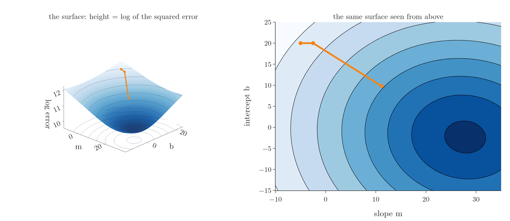
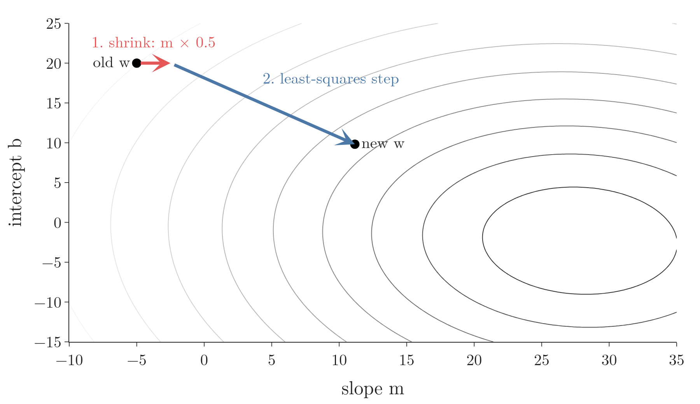
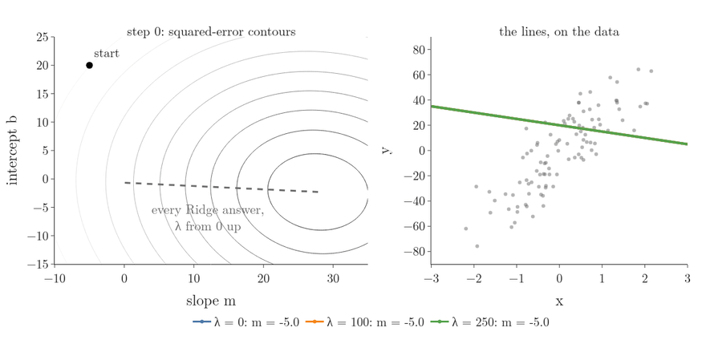
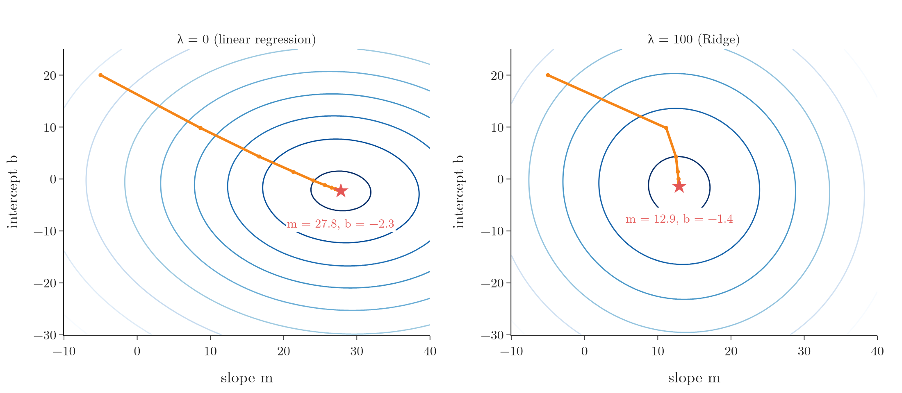
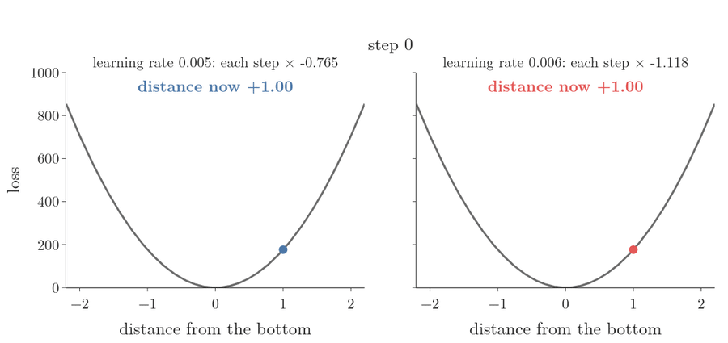
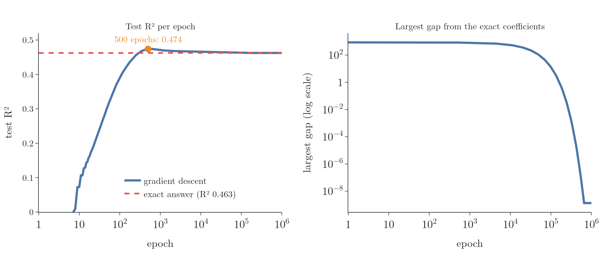
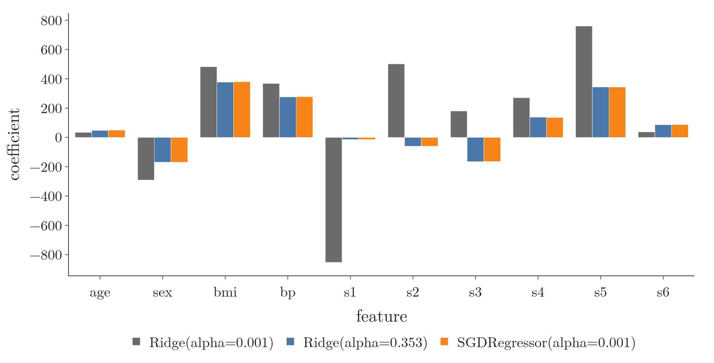

<!-- where-this-fits: generated by course_map/build_map.py; edit concepts.yaml, not this block -->
> **Where this fits:** Pipeline map step 8 (Model). See the [Course map](../../../00-course-map/00-course-map.md).
>
> 
>
> - **Builds on:** [Standardization](../../../ML/03-feature-engineering/ML-023-standardization/ML-023-standardization.md#4-the-standardization-formula); [Multiple linear regression](../../../ML/06-regression/ML-052-multiple-linear-regression/ML-052-multiple-linear-regression.md#2-from-a-line-to-a-hyperplane); [Normal equation](../../../ML/06-regression/ML-053-multiple-lr-maths/ML-053-multiple-lr-maths.md#6-the-normal-equation); [Gradient descent](../../../ML/06-regression/ML-056-gradient-descent/ML-056-gradient-descent.md#2-the-idea); [Bias-variance trade-off](../../../ML/06-regression/ML-061-bias-variance/ML-061-bias-variance.md#5-the-trade-off); [Lagrange multipliers, KKT and duality](../../../MA/07-optimisation/MA-066-lagrange-multipliers/MA-066-lagrange-multipliers.md#4-the-lagrangian); [MAP estimation](../../../MA/08-likelihood/MA-072-mle-in-machine-learning/MA-072-mle-in-machine-learning.md#7-map-estimation-maximum-likelihood-plus-a-prior); [Regularisation](../../../ML/06-regression/ML-062-ridge-regression-intuition/ML-062-ridge-regression-intuition.md#3-the-idea-penalise-large-coefficients).
> - **Compare with:** [Lasso regression](../../../ML/06-regression/ML-066-lasso-regression/ML-066-lasso-regression.md#2-one-feature-the-slope-reaches-exactly-0); [L1 and L2 regularisation in neural networks](../../../DL/02-training/DL-026-regularization-in-dl/DL-026-regularization-in-dl.md#5-the-penalty-term).
<!-- /where-this-fits -->

## 1. Overview

> **Key point:** Ridge can also be trained step by step, like plain linear regression. Each step does two things: it first pulls every coefficient a little towards 0, then takes the ordinary downhill step.

[The Ridge formula](../ML-063-ridge-regression-maths/ML-063-ridge-regression-maths.md#33-solving-for-w) finds the Ridge coefficients in one jump. Like plain linear regression, **Ridge regression** (G-1691; linear regression with a penalty on large coefficients, see [the idea of Ridge](../ML-062-ridge-regression-intuition/ML-062-ridge-regression-intuition.md#3-the-idea-penalise-large-coefficients)) can instead be trained with **gradient descent** (G-862; [the idea](../ML-056-gradient-descent/ML-056-gradient-descent.md#2-the-idea)): start somewhere, and repeatedly step downhill on the loss (the number that says how wrong the model is).

Here a **feature** (G-772) is an input variable (one column of the data table), an **observation** (G-1374) is one record (one row), and the **target** (G-1949) y is the value we predict. Gradient descent is useful when there are many features, because the formula needs the inverse of a large matrix (see [the cost of the inverse](../ML-053-multiple-lr-maths/ML-053-multiple-lr-maths.md#7-the-cost-of-the-inverse)).

The next figures use a [contour map](../../../MA/06-calculus/MA-062-partial-derivatives-and-gradients/MA-062-partial-derivatives-and-gradients.md#11-reading-a-contour-map) of the squared error, so first the surface it comes from. Take the one-feature example of [Ridge with one feature](../ML-063-ridge-regression-maths/ML-063-ridge-regression-maths.md#2-one-feature): every pair (slope $m$, intercept $b$) is one line, and its squared error (the sum of the squared gaps between the line and the 100 targets) is

$$E(m, b) = \sum_{i=1}^{100} (y_i - m x_i - b)^2$$

where $\sum_{i=1}^{100}$ means "add the term for observation 1, 2, up to 100". For the start line $m = -5$, $b = 20$ this is about 162,800 and for the best line $m = 27.8$, $b = -2.3$ about 28,300. $E$ is a smooth bowl over the $(m, b)$ floor (the same bowl as in [both parameters together](../ML-056-gradient-descent/ML-056-gradient-descent.md#6-both-parameters-m-and-b-together) and [how stochastic gradient descent works](../ML-058-stochastic-gradient-descent/ML-058-stochastic-gradient-descent.md#3-how-stochastic-gradient-descent-works)); here its height is drawn as $\log E$. Figure 1 shows the bowl and the same bowl seen from above. Each line of the map joins points at the same height; lines close together mean a steep slope, and the centre ring is the lowest point. The orange route is the Ridge step of Figure 2 (start, then shrink, then new $w$).



Figure 2 shows one Ridge step on the one-feature example (100 observations), starting from slope −5 and intercept 20. Watch the two arrows: the red one shrinks the slope to half its size, towards 0; the blue one is the ordinary least-squares step downhill. The intercept is never shrunk. Section 2.3 computes this exact step with numbers.

{height=38%}

This Note:

- derives the Ridge gradient step by step and runs one update on numbers (Section 2);
- watches the paths for three penalty strengths (Section 3);
- codes it from scratch and explains the learning-rate limit (Section 4);
- shows that stopping early is a regulariser too (Section 5);
- shows the scikit-learn options (Section 6).

## 2. The gradient

> **Key point:** The Ridge gradient is the plain linear regression gradient plus one extra piece, λ times the coefficients. That extra piece is what pulls them towards 0.

### 2.1 The loss with a factor of ½

> **Key point:** Multiplying the loss by ½ does not move its minimum; it only removes a 2 from the derivative.

The symbols, with the values of Figure 2:

- **w** is the column of coefficients, intercept first. [The normal equation](../ML-053-multiple-lr-maths/ML-053-multiple-lr-maths.md#6-the-normal-equation) called the same column β; Ridge texts and the code use w. In Figure 2 the start is

  $$w_{\text{old}} = \begin{bmatrix} b \cr m \end{bmatrix} = \begin{bmatrix} 20 \cr-5 \end{bmatrix}$$

- **X** is the data with a first column of 1s, one row per observation (100 rows here), and **y** the column of targets.
- **λ** is the penalty strength, here λ = 100.

The Ridge loss (see [the loss in matrix form](../ML-063-ridge-regression-maths/ML-063-ridge-regression-maths.md#31-the-loss-in-matrix-form)), multiplied by ½:

$$L = \frac{1}{2}(Xw - y)^{\mathsf T}(Xw - y) + \frac{1}{2}\lambda\thinspace w^{\mathsf T}w$$

Halving every value of the loss leaves the lowest point at the same w. The ½ just makes the derivative tidier, as the 2 from differentiating a square cancels the ½.

### 2.2 Expanding and differentiating

> **Key point:** The same expansion as the previous Note, then the same derivative rules, one term at a time.

Expanding the product as in [expanding the error](../ML-053-multiple-lr-maths/ML-053-multiple-lr-maths.md#4-expanding-the-error):

$$L = \frac{1}{2}w^{\mathsf T}X^{\mathsf T}Xw - w^{\mathsf T}X^{\mathsf T}y$$

$$+ \frac{1}{2}y^{\mathsf T}y + \frac{1}{2}\lambda\thinspace w^{\mathsf T}w$$

Differentiate one term per line with respect to w. The rules were checked on small numbers in [three rules of matrix calculus](../ML-053-multiple-lr-maths/ML-053-multiple-lr-maths.md#51-three-rules-of-matrix-calculus-each-checked-on-numbers) and [expanding and differentiating](../ML-063-ridge-regression-maths/ML-063-ridge-regression-maths.md#32-expanding-and-differentiating):

$$\frac{\partial}{\partial w}\left(\frac{1}{2}w^{\mathsf T}X^{\mathsf T}Xw\right) = \frac{1}{2} \times 2X^{\mathsf T}Xw$$

$$= X^{\mathsf T}Xw$$

$$\frac{\partial}{\partial w}\left(-w^{\mathsf T}X^{\mathsf T}y\right) = -X^{\mathsf T}y$$

$$\frac{\partial}{\partial w}\left(\frac{1}{2}y^{\mathsf T}y\right) = 0$$

$$\frac{\partial}{\partial w}\left(\frac{1}{2}\lambda\thinspace w^{\mathsf T}w\right) = \frac{1}{2}\lambda \times 2w$$

$$= \lambda w$$

Adding the four lines:

$$\frac{\partial L}{\partial w} = X^{\mathsf T}Xw - X^{\mathsf T}y + \lambda w$$

The first two terms are the linear regression gradient. The Ridge penalty adds only λw.

> **Extra:** Setting this gradient to zero gives $(X^{\mathsf T}X + \lambda I)w = X^{\mathsf T}y$, the formula of [solving for w](../ML-063-ridge-regression-maths/ML-063-ridge-regression-maths.md#33-solving-for-w). Gradient descent walks towards the same answer step by step instead of jumping to it.

### 2.3 The update rule, and one update on numbers

> **Key point:** New w = old w minus the learning rate times the gradient.

As in [gradient descent with many features](../ML-057-batch-gradient-descent/ML-057-batch-gradient-descent.md#2-gradient-descent-with-many-features), all coefficients are updated together:

$$w_{\text{new}} = w_{\text{old}} - \eta\left(X^{\mathsf T}Xw_{\text{old}} - X^{\mathsf T}y + \lambda w_{\text{old}}\right)$$

where η is the **learning rate** (G-1068; [the size of each step](../../01-foundations/ML-005-online-learning/ML-005-online-learning.md#5-the-learning-rate)); here η = 0.005. The first entry of w is the intercept, which is not penalised. So, as in [not penalising the intercept](../ML-063-ridge-regression-maths/ML-063-ridge-regression-maths.md#34-not-penalising-the-intercept), the λw term uses $\lambda I_0 w$, where $I_0$ is the identity matrix with its top-left entry set to 0:

$$I_0 = \begin{bmatrix} 0 & 0 \cr0 & 1 \end{bmatrix}$$

**One update, line by line.** The two matrix pieces add up 100 observations, so the computer builds them (the notebook). Input: the 100 pairs (x, y). Output:

$$X^{\mathsf T}X = \begin{bmatrix} 100 & 5.841 \cr5.841 & 87.186 \end{bmatrix}$$

$$X^{\mathsf T}y = \begin{bmatrix} -66.938 \cr2412.823 \end{bmatrix}$$

The 100 counts the observations, 5.841 is the sum of the feature values, 87.186 the sum of their squares, −66.938 the sum of the targets and 2412.823 the sum of feature times target. The rest is by hand, starting from w = (20, −5).

**Step 1.** The transpose of X ($X^{\mathsf T}$, X with rows and columns swapped) times X, times w, one row of the result per block:

$$100 \times 20 + 5.841 \times (-5)$$
$$= 2000 - 29.204$$
$$= 1970.796$$

$$5.841 \times 20 + 87.186 \times (-5)$$
$$= 116.815 - 435.931$$
$$= -319.116$$

**Step 2.** Subtract the transpose of X times y:

$$1970.796 - (-66.938) = 2037.734$$

$$-319.116 - 2412.823 = -2731.939$$

**Step 3.** Add the penalty $\lambda I_0 w$. It is 0 for the intercept, and for the slope:

$$100 \times (-5) = -500$$

So

$$\text{gradient} = \begin{bmatrix} 2037.734 + 0 \cr-2731.939 - 500 \end{bmatrix}$$

$$\text{gradient} = \begin{bmatrix} 2037.734 \cr-3231.939 \end{bmatrix}$$

**Step 4.** Multiply by the learning rate:

$$0.005 \times 2037.734 = 10.189$$

$$0.005 \times (-3231.939) = -16.160$$

**Step 5.** Subtract from the old w:

$$b_{\text{new}} = 20 - 10.189 = 9.811$$

$$m_{\text{new}} = -5 - (-16.160) = 11.160$$

The new point (slope 11.16, intercept 9.81) is the "new w" of Figure 2, and the first step of the λ = 100 path in Section 3.

**The same step in two parts.** Group the λw term with the old w instead:

$$w_{\text{new}} = (1 - \eta\lambda)\thinspace w_{\text{old}} - \eta\left(X^{\mathsf T}Xw_{\text{old}} - X^{\mathsf T}y\right)$$

For the slope, the two parts are the two arrows of Figure 2. The red shrink:

$$1 - \eta\lambda = 1 - 0.005 \times 100 = 0.5$$

$$0.5 \times (-5) = -2.5$$

The blue least-squares step, from Step 2:

$$-0.005 \times (-2731.939) = +13.660$$

$$-2.5 + 13.660 = 11.160$$

The same 11.160 as Step 5. The intercept has no shrink, only the least-squares step.

So every step first shrinks the coefficients by the factor 1 − ηλ, then takes the ordinary linear regression step. The per-step shrinking is why the L2 penalty is also called **weight decay** (G-2108), the name used for neural networks (ESL §3.4.1).

## 3. Seeing the paths

> **Key point:** Gradient descent finds the bottom of whichever loss it is given. With λ = 100, the bottom sits at a smaller slope.

Figure 3 runs gradient descent on the one-feature example of [Ridge with one feature](../ML-063-ridge-regression-maths/ML-063-ridge-regression-maths.md#2-one-feature) for three values of λ, from the same start point ($m = -5$, $b = 20$, learning rate 0.005). The contours belong to the plain squared error, so only λ = 0 heads for their centre. Watch where each path stops: the larger λ, the closer to $m = 0$, and the flatter its line on the data (right).



With λ = 250 the path zig-zags across the valley: the penalty makes the bowl so steep in the m direction that a step of 0.005 overshoots, and each overshoot is smaller than the last (Section 4.1 explains why, with numbers). Figure 4 draws the bowls themselves for λ = 0 (the surface of Figure 1) and λ = 100 (top row: surfaces; bottom row: the same surfaces seen from above, the contour maps) over 60 steps.

{height=70%}

- **λ = 0:** the path ends at slope 27.8 and intercept −2.3, the linear regression answer.
- **λ = 100:** the penalty moves the bottom of the bowl to slope 12.9 and intercept −1.4. These values are exactly the Ridge values from [the formula](../ML-063-ridge-regression-maths/ML-063-ridge-regression-maths.md#33-solving-for-w).

The penalty makes the bowl steeper in the m direction only. The steepness of a bowl along one direction is its **curvature** (G-521), the second derivative. Along the slope m it is the bottom-right entry of the transpose of X times X, plus λ:

$$\frac{\partial^2 L}{\partial m^2} = \sum_{i=1}^{100} x_i^2 + \lambda$$

$$\lambda = 0: \quad 87.19 + 0 = 87.19$$

$$\lambda = 100: \quad 87.19 + 100 = 187.19$$

Along the intercept b the curvature is the count of observations, 100, whatever λ is.

## 4. Code from scratch

> **Key point:** The loop computes the gradient with matrix products and updates all coefficients at once.

> **Python:** Ridge with batch gradient descent.
>
> ```python
> class MyRidgeGD:
>     def __init__(self, epochs, learning_rate, alpha):
>         self.epochs, self.lr, self.alpha = (epochs,
>             learning_rate, alpha)
>
>     def fit(self, X, y):
>         X = np.insert(X, 0, 1, axis=1)           # column of 1s
>         w = np.insert(np.ones(X.shape[1] - 1), 0, 0.0)
>         I = np.identity(X.shape[1])
>         I[0, 0] = 0                    # no penalty on intercept
>         for _ in range(self.epochs):
>             grad = X.T @ X @ w - X.T @ y + self.alpha * I @ w
>             w = w - self.lr * grad
>         self.intercept_, self.coef_ = w[0], w[1:]
>         return self
>
>     def predict(self, X):
>         return X @ self.coef_ + self.intercept_
> ```

On the diabetes data (test size 0.2, random state 4) with alpha 0.001, learning rate 0.005 and 500 epochs, test R² is 0.474 and the intercept 150.87.

### 4.1 Why the learning rate has a limit

> **Key point:** A step that is too big jumps across the valley and lands higher up the other side. Each jump is then bigger than the last, and the coefficients blow up. The steeper the bowl, the smaller the step must be.

This gradient adds up the errors of all observations instead of averaging them, so its size grows with the number of observations. The summed gradient is why the learning rate must be tiny here.

Figure 5 shows the idea along one direction of a bowl, with the curvature of the steepest direction of the diabetes data, 353. Both runs start at distance 1 from the bottom. Watch where each step lands. With learning rate 0.005 (left) every step jumps across the bottom but lands closer. With 0.006 (right) every step jumps across and lands farther away.



**Why each step multiplies the distance.** Along one direction, call s the distance from the bottom and h the curvature. Near the bottom the loss is a parabola, and its slope is the curvature times the distance:

$$L = \frac{1}{2}h\thinspace s^2$$

$$\frac{dL}{ds} = h\thinspace s$$

One gradient descent step, then the distance taken out as a common factor:

$$s_{\text{new}} = s - \eta\thinspace h\thinspace s$$

$$s_{\text{new}} = (1 - \eta h)\thinspace s$$

**On numbers,** with h = 353. Learning rate 0.005:

$$1 - 0.005 \times 353$$

$$= 1 - 1.765 = -0.765$$

$$s: \quad 1 \to -0.765 \to 0.585 \to -0.448 \to 0.342$$

The minus sign is the jump across the bottom; the size 0.765 below 1 makes each jump shorter. Learning rate 0.006:

$$1 - 0.006 \times 353$$

$$= 1 - 2.118 = -1.118$$

$$s: \quad 1 \to -1.118 \to 1.250 \to -1.397 \to 1.562$$

Now the size 1.118 is above 1, so each jump is longer than the last.

**The limit.** The distance shrinks only when the factor lies between −1 and 1:

$$-1 < 1 - \eta h < 1$$

The right-hand side holds for any positive η and h. The left-hand side, with η h moved across and the 1 subtracted:

$$\eta h < 2$$

$$\eta < \frac{2}{h}$$

With h = 353:

$$\eta < \frac{2}{353} = 0.0057$$

So 0.005 is just below the limit and 0.006 just above it.

**Many directions at once.** A bowl over many coefficients has a different curvature in each direction. The matrix of all its second derivatives is the **Hessian matrix** (G-888). For the Ridge loss it is

$$H = X^{\mathsf T}X + \lambda I$$

For the one-feature example of Section 3 with λ = 100 (and the intercept left out of the penalty), its diagonal holds the two curvatures of Section 3:

$$H = \begin{bmatrix} 100 & 5.84 \cr5.84 & 187.19 \end{bmatrix}$$

The steepest and the flattest directions of the bowl are the eigenvectors of H, and the curvatures along them are its **eigenvalues** (G-665). Eigenvalues are often written λ; here λ is already the penalty, so we write h. The computer finds them (the notebook). Input: the matrix H. Output for the three paths of Section 3, with the step factor 1 − 0.005 h for the steepest direction:

| λ | Eigenvalues h of H | Factor for the largest h |
|---|---|---|
| 0 | 84.9 and 102.3 | 0.49 |
| 100 | 99.6 and 187.6 | 0.06 |
| 250 | 99.9 and 337.3 | −0.69 |

With λ = 250 the factor is negative, so the path jumps across the valley each step, but its size 0.69 is below 1, so the jumps shrink: the zig-zag of Figure 3.

> **Extra:** The same result in matrix form. Write $w^\ast$ for the exact answer, where the gradient is zero:
>
> $$Hw^\ast= X^{\mathsf T}y$$
>
> The gradient at any w is then H times the gap from the answer:
>
> $$Hw - X^{\mathsf T}y = Hw - Hw^\ast$$
>
> $$= H(w - w^\ast)$$
>
> One update, with the exact answer subtracted from both sides:
>
> $$w_{\text{new}} - w^\ast$$
>
> $$= (w - w^\ast) - \eta H(w - w^\ast)$$
>
> $$= (I - \eta H)(w - w^\ast)$$
>
> Along each eigenvector of H with eigenvalue h, the matrix in front multiplies by 1 − ηh, as in the one-direction case. So the steps shrink only if η is below 2/h for the largest h.

On the diabetes training set (353 observations) the largest eigenvalue is 353, so the limit is 2/353 = 0.0057. With 0.006 the steps overshoot and grow: after 100 epochs the largest coefficient is about 15,000.

Figure 6 runs the code above at both learning rates. For about 50 epochs the two runs look alike; then the run with 0.006 bends upwards, because the overshoot along the steepest direction is multiplied every step by

$$\lvert 1 - 0.006 \times 353 \rvert = 1.12$$

and finally dominates.


## 5. Gradient descent stops early

> **Key point:** Stopping gradient descent early keeps the coefficients small, so **early stopping** (G-656) is a regulariser of its own, much like the ridge penalty.

Think of pouring water into an ice-cube tray: stop pouring early and every cube is only partly full. Gradient descent starts with small coefficients and fills them up step by step; stopping early leaves the slow ones small.

### 5.1 Early stopping rescues an overfitting model

> **Key point:** On data where linear regression overfits badly, stopping early helps about as much as the ridge penalty.

We give the model 65 features (the 10 diabetes measurements plus their squares and pairwise products) and train on 200 patients, as in [early stopping](../ML-057-batch-gradient-descent/ML-057-batch-gradient-descent.md#5-early-stopping). With so many features for so few observations, plain least squares has high variance, the case where shrinkage helps (ISL §6.2.1). Averaged over 50 random splits, test R² is:

| Model | Test R² |
|---|---|
| Linear regression (no regularisation) | 0.06 |
| Ridge, alpha chosen by cross-validation on the training data | 0.44 |
| Gradient descent without a penalty, stopped early | 0.40 |

Both regularisers rescue the badly overfitting linear regression, and by a similar amount. For a linear model, stopping early and adding the ridge penalty are close cousins (Goodfellow et al. §7.8).

> **Extra:** In the 65-feature experiment both models use standardised features. The stopping epoch is chosen on a validation part of the training data, and ridge's alpha by cross-validation on the training data, so the test data is used only once. Early stopping is one of the most common regularisers in deep learning (Goodfellow et al. §7.8).

### 5.2 Why the slow directions stay small

> **Key point:** Gradient descent creeps along flat directions of the loss bowl, so after a few hundred steps the coefficients in those directions are still small.

Back on the 10 diabetes features (353 training observations), the exact Ridge answer from [the formula](../ML-063-ridge-regression-maths/ML-063-ridge-regression-maths.md#33-solving-for-w) scores test R² 0.463 (R² is the share of the variation in the targets that the model explains: 1 is perfect, 0 is no better than the mean). Figure 7 tracks gradient descent for up to a million epochs.

{height=42%}

| Epochs | Test R² | Largest gap from the exact coefficients |
|---|---|---|
| 100 | 0.390 | 897 |
| 500 | 0.474 | 823 |
| 50,000 | 0.464 | 104 |
| 1,000,000 | 0.463 | 0.0 |

- **Left:** test R² rises, peaks around 500 epochs, then settles at the exact answer's 0.463.
- **Right:** the coefficients need about a million epochs to reach the exact values.

The slow direction comes from s1 and s2, which are strongly correlated (see [many features: the diabetes data](../ML-062-ridge-regression-intuition/ML-062-ridge-regression-intuition.md#43-many-features-the-diabetes-data)). The bowl is almost flat along "raise s2, lower s1", so gradient descent creeps along it, and stopping early leaves the coefficients in that direction smaller (Goodfellow et al. §7.8). With 353 observations least squares barely overfits (see [the diabetes data](../ML-062-ridge-regression-intuition/ML-062-ridge-regression-intuition.md#43-many-features-the-diabetes-data)), so on this data the size of the test-R² change says little; the 65-feature experiment above is the real test.

> **Extra:** The numbers behind this. Along an eigenvector of the Hessian H (Section 4.1) with eigenvalue h, the error is multiplied by 1 − ηh per step. When ηh is tiny, the error needs about 1/(ηh) steps to shrink to about a third. The smallest eigenvalue here is 0.0083, so, one line at a time:
>
> $$\eta h = 0.005 \times 0.0083 = 0.0000415$$
>
> $$1 - \eta h = 0.9999585 \text{ per step}$$
>
> $$\frac{1}{\eta h} = \frac{1}{0.0000415} \approx 24{,}000 \text{ steps}$$
>
> Its eigenvector is mostly s1 ($-0.71$) and s2 ($+0.55$). After 500 epochs the gap from the exact answer, as a vector, has length 1,153, and 1,146 of that lies along this one direction; and the coefficient vector is about half as long as the exact one (774 against 1,455).

## 6. Ridge with gradient descent in scikit-learn

> **Key point:** Use SGDRegressor with penalty="l2", or Ridge with an iterative solver.

> **Python:** Two scikit-learn options.
>
> ```python
> from sklearn.linear_model import SGDRegressor, Ridge
>
> sgd = SGDRegressor(penalty="l2", alpha=0.001, max_iter=500,
>                    eta0=0.1, learning_rate="constant",
>                    random_state=0)
> sgd.fit(X_train, y_train)
> sgd.score(X_test, y_test)          # R² 0.450
>
> ridge = Ridge(alpha=0.001, max_iter=500, solver="sparse_cg")
> ridge.fit(X_train, y_train)
> ridge.score(X_test, y_test)        # R² 0.463
> ```

- **SGDRegressor** (G-1783; [SGD in scikit-learn](../ML-058-stochastic-gradient-descent/ML-058-stochastic-gradient-descent.md#7-sgd-in-scikit-learn)) adds the Ridge penalty with `penalty="l2"` (G-1477). Its `alpha` is the penalty strength.
- **Ridge** has a `solver` (G-1836) setting. `"cholesky"` and `"svd"` use the formula directly. `"sparse_cg"`, `"lsqr"`, `"sag"` and `"saga"` reach the answer step by step, and `max_iter` limits the steps.

`Ridge` has no learning-rate setting at all, even with an iterative solver (scikit-learn docs, `Ridge`). Here `sparse_cg` reaches the exact answer, 0.463.

> **Extra:** `SGDRegressor` averages the loss over the observations, while `Ridge` adds it up. The `SGDRegressor` objective is (scikit-learn user guide §1.5.8)
>
> $$\frac{1}{n}\sum \frac{1}{2}(y_i - \hat y_i)^2 + \alpha \cdot \frac{1}{2}\lVert w \rVert^2$$
>
> Multiplying by 2n:
>
> $$\sum (y_i - \hat y_i)^2 + n\alpha \lVert w \rVert^2$$
>
> That is the `Ridge` loss with alpha equal to n times α. So the same `alpha` means a stronger penalty in `SGDRegressor`: its `alpha` equals `Ridge`'s `alpha` divided by the number of observations. With 353 training observations, `SGDRegressor(alpha=0.001)` matches `Ridge` with alpha
>
> $$353 \times 0.001 = 0.353$$
>
> Run long, its coefficients land within 3 of that model's, but up to 840 away from `Ridge(alpha=0.001)`.

Figure 8 shows the three sets of coefficients side by side. The orange bars of `SGDRegressor(alpha=0.001)` sit on the blue bars of `Ridge(alpha=0.353)`, not on the grey bars of `Ridge(alpha=0.001)`; the biggest gap is in s1.



## 7. Summary

| Method | How it finds w | Test R² here | Why it matters |
|---|---|---|---|
| Formula (`Ridge`, cholesky) | one step, $(X^{\mathsf T}X + \lambda I)^{-1}X^{\mathsf T}y$ | 0.463 | exact, but needs the inverse of a large matrix when there are many features |
| `Ridge`, sparse_cg | iterative solver | 0.463 | reaches the exact answer without the inverse |
| MyRidgeGD, 500 epochs | batch gradient descent, stopped early | 0.474 | stopping early left the slow s1-s2 direction small, a regulariser of its own |
| `SGDRegressor`, l2 | stochastic gradient descent | 0.450 | its `alpha` is `Ridge`'s divided by the number of observations, so the same number penalises harder |

- The Ridge gradient is $X^{\mathsf T}Xw - X^{\mathsf T}y + \lambda w$: the linear regression gradient plus $\lambda w$, so the plain gradient descent code needs only one extra term.
- Each update shrinks the coefficients by $1 - \eta\lambda$ first, hence the name weight decay.
- The intercept is left out of the penalty, because it only shifts predictions up or down.
- Stopping gradient descent early also regularises: with many features for few observations it rescues an overfitting fit about as well as ridge, because gradient descent creeps along flat directions and leaves those coefficients small.
- In scikit-learn: `SGDRegressor(penalty="l2")` or `Ridge` with an iterative solver, so Ridge can be trained step by step on data too large for the formula.
- Together these answer the opening question: Ridge trains step by step like plain linear regression, with each step first pulling the coefficients towards 0 and then stepping downhill.


## 8. Sources

**Built from**

- CampusX, "Ridge Regression Part 3 | Gradient Descent | Regularized Linear Models", YouTube, https://www.youtube.com/watch?v=Fci_wwMp8G8

**Other references**

- **ESL:** Hastie, T., Tibshirani, R. and Friedman, J. *The Elements of Statistical Learning*, 2nd ed. Springer, 2009. Section 3.4.1, p. 63.
- **Goodfellow et al.:** Goodfellow, I., Bengio, Y. and Courville, A. *Deep Learning*. MIT Press, 2016. Section 7.8, "Early Stopping".
- **scikit-learn docs:** `sklearn.linear_model.Ridge`; user guide Section 1.5.8, "Mathematical formulation" (SGD), scikit-learn 1.9.
- **ISL:** James, G., Witten, D., Hastie, T. and Tibshirani, R. *An Introduction to Statistical Learning*, 2nd ed. Springer, 2021. Section 6.2.1, p. 241.

## 9. Key terms

Terms taught in this Note come first; linked terms are recaps, taught in the Note the link opens.

| Term | Meaning |
|---|---|
| Weight decay (G-2108) | Another name for the L2 penalty: each gradient step shrinks the coefficients by a fixed factor. |
| penalty (G-1477) | The SGDRegressor setting that chooses how large weights are penalised (regularisation), such as "l2" for Ridge. |
| [Ridge regression](../../../ML/06-regression/ML-062-ridge-regression-intuition/ML-062-ridge-regression-intuition.md#1-overview) (G-1691) | Linear regression with a penalty on the sum of squared coefficients added to the loss; the penalty keeps the coefficients small, which reduces overfitting (L2 regularisation). |
| [Gradient descent](../../../ML/06-regression/ML-056-gradient-descent/ML-056-gradient-descent.md#1-overview) (G-862) | Finding the lowest point of a function by repeated small steps downhill. |
| [Feature](../../../ML/01-foundations/ML-002-ai-vs-ml-vs-dl/ML-002-ai-vs-ml-vs-dl.md#52-features-chosen-by-us-or-learned) (G-772) | One piece of information about each example that a model uses (e.g. a student's CGPA). |
| [Observation](../../../ML/01-foundations/ML-003-types-of-ml/ML-003-types-of-ml.md#21-learning-from-inputs-and-outputs) (G-1374) | One record of a dataset: one row of the data table. |
| [Target](../../../ML/01-foundations/ML-003-types-of-ml/ML-003-types-of-ml.md#21-learning-from-inputs-and-outputs) (G-1949) | The output column we predict, such as the class; also called the label. |
| [Learning rate ($\eta$)](../../../ML/01-foundations/ML-005-online-learning/ML-005-online-learning.md#5-the-learning-rate) (G-1068) | How strongly each update changes the model; in gradient descent, the number the slope is multiplied by to get the step size. |
| [Curvature](../../../MA/06-calculus/MA-064-hessian-and-multivariate-taylor/MA-064-hessian-and-multivariate-taylor.md#5-the-hessian) (G-521) | How fast the slope of a surface changes; given in each direction by the Hessian. |
| [Hessian matrix](../../../MA/06-calculus/MA-064-hessian-and-multivariate-taylor/MA-064-hessian-and-multivariate-taylor.md#51-the-hessian-matrix) (G-888) | The table of how a many-input function's slopes change, which measures its curvature: the symmetric $n \times n$ matrix of all second partial derivatives of $f: \mathbb{R}^n \to \mathbb{R}$. |
| [Eigenvalue](../../../ML/05-dimensionality/ML-047-pca-step-by-step/ML-047-pca-step-by-step.md#42-the-vectors-that-do-not-turn) (G-665) | The number by which a matrix stretches or shrinks one of its eigenvectors: $A\mathbf v = \lambda\mathbf v$. In PCA, the eigenvalues of the covariance matrix are the variances along the principal components. |
| [Early stopping](../../../ML/06-regression/ML-057-batch-gradient-descent/ML-057-batch-gradient-descent.md#5-early-stopping) (G-656) | Stopping training when the score on held-out data is best, before full convergence; this keeps coefficients small, so it also acts as regularisation. |
| [SGDRegressor](../../../ML/01-foundations/ML-005-online-learning/ML-005-online-learning.md#41-scikit-learns-partial_fit) (G-1783) | A scikit-learn model that does linear regression with stochastic gradient descent, step by step, so it can also learn from data arriving in small pieces. |
| [Solver](../../../ML/07-classification/ML-080-logistic-hyperparameters/ML-080-logistic-hyperparameters.md#3-the-solver) (G-1836) | The method a model uses to find its best settings during training. |
