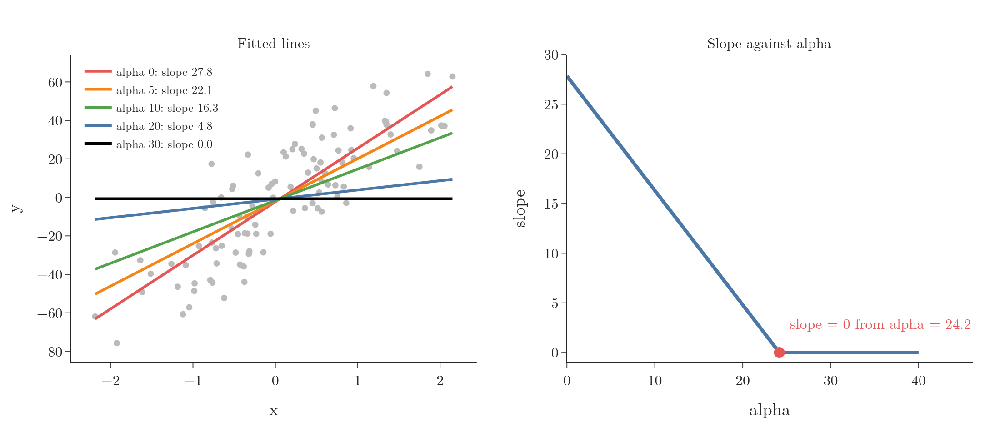
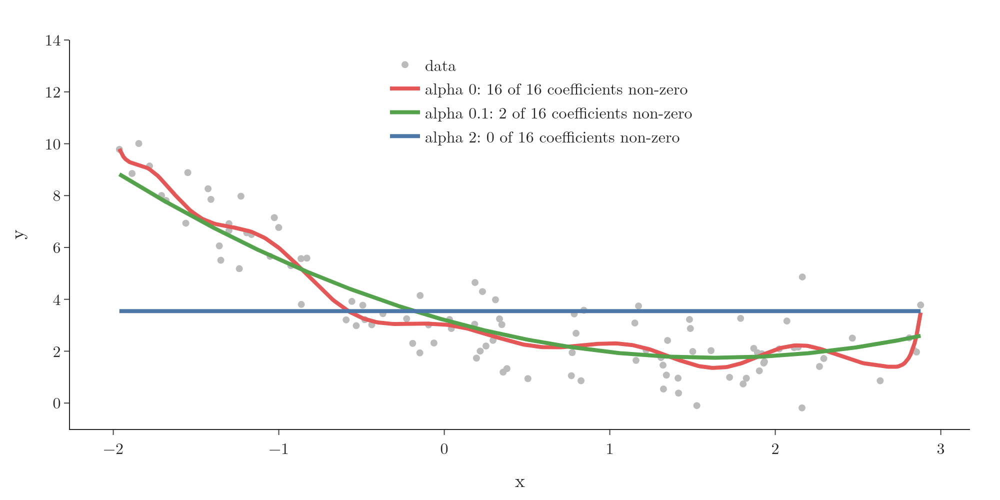
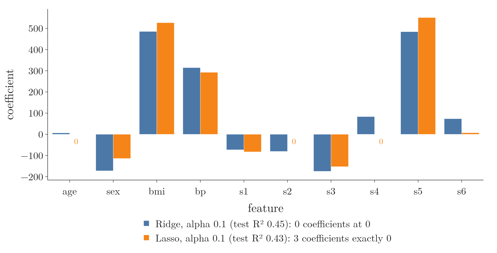

<!-- where-this-fits: generated by course_map/build_map.py; edit concepts.yaml, not this block -->
> **Where this fits:** Pipeline map step 8 (Model). See the [Course map](../../../00-course-map/00-course-map.md).
>
> 
>
> - **Builds on:** [Feature selection](../../../ML/03-feature-engineering/ML-022-what-is-feature-engineering/ML-022-what-is-feature-engineering.md#8-feature-selection); [Lagrange multipliers, KKT and duality](../../../MA/07-optimisation/MA-066-lagrange-multipliers/MA-066-lagrange-multipliers.md#4-the-lagrangian); [MAP estimation](../../../MA/08-likelihood/MA-072-mle-in-machine-learning/MA-072-mle-in-machine-learning.md#7-map-estimation-maximum-likelihood-plus-a-prior); [Regularisation](../../../ML/06-regression/ML-062-ridge-regression-intuition/ML-062-ridge-regression-intuition.md#3-the-idea-penalise-large-coefficients).
> - **Leads to:** [Elastic Net](../../../ML/06-regression/ML-068-elastic-net/ML-068-elastic-net.md#2-the-loss-function).
> - **Compare with:** [Ridge regression](../../../ML/06-regression/ML-062-ridge-regression-intuition/ML-062-ridge-regression-intuition.md#3-the-idea-penalise-large-coefficients); [L1 and L2 regularisation in neural networks](../../../DL/02-training/DL-026-regularization-in-dl/DL-026-regularization-in-dl.md#5-the-penalty-term).
<!-- /where-this-fits -->

## 1. Overview

> **Key point:** Lasso is Ridge with the squares in the penalty replaced by absolute values. That one change lets it push coefficients to exactly 0, so it also removes useless **features** (G-772; input variables, the columns of the data table): automatic feature selection.

**Lasso regression** (G-1047) is the second regularised version of linear regression, also called **L1 regularisation** (G-1026). Like Ridge ([the idea of penalising large coefficients](../ML-062-ridge-regression-intuition/ML-062-ridge-regression-intuition.md#3-the-idea-penalise-large-coefficients)), it adds a penalty to the usual squared error, but the penalty uses the absolute size of each coefficient. A **coefficient** is the number that multiplies a feature in the model, such as the slope $m$ in $y = mx + b$ (see [the equation](../ML-052-multiple-linear-regression/ML-052-multiple-linear-regression.md#3-the-equation)). In words: the loss is the usual sum of squared errors, plus $\lambda$ times the sum of the sizes of the coefficients. For two coefficients 3 and $-2$ the size-sum is:

$$|3| + |-2| = 3 + 2 = 5$$

Ridge's square-sum would be:

$$9 + 4 = 13$$

Written as a formula:

$$L = \sum_{i=1}^{n}(y_i - \hat y_i)^2 + \lambda\sum_{j=1}^{m}|\beta_j|$$

| | Ridge | Lasso |
|---|---|---|
| Penalty | $\lambda \sum \beta_j^2$ | $\lambda \sum |\beta_j|$ |
| Also called | L2 regularisation | L1 regularisation |
| Coefficients for large λ | close to 0, never exactly 0 | exactly 0 |

The symbols: $y_i$ is the actual target of observation $i$, $\hat y_i$ the prediction, $n$ the number of observations, $m$ the number of features, $\beta_j$ the coefficient of feature $j$ (for the diabetes data, $m = 10$), and $\lambda$ the penalty strength. LASSO stands for "least absolute shrinkage and selection operator" (Tibshirani 1996). As with Ridge, $\lambda \geq 0$: with $\lambda = 0$ Lasso is plain linear regression, a small $\lambda$ may overfit, and a large one underfits. The intercept is not penalised, because it only sets the average level of $y$, and shrinking it would not make the line flatter ([the idea of Ridge](../ML-062-ridge-regression-intuition/ML-062-ridge-regression-intuition.md#3-the-idea-penalise-large-coefficients)).

This Note shows what Lasso does with one feature, with a flexible polynomial, and with the 10-feature diabetes data (442 **observations** (G-1374), that is, records or rows; the **target** (G-1949) we predict is disease progression; the features are age, sex, bmi (body mass index), bp (blood pressure) and six blood measurements s1 to s6), and why its coefficients can reach exactly 0.

## 2. One feature: the slope reaches exactly 0

> **Key point:** As alpha grows, the Lasso slope falls in a straight line and stops at exactly 0.

Figure 1 fits Lasso to the 100-observation example of the Ridge Notes. scikit-learn calls the penalty strength `alpha`.

{height=45%}

| alpha | Slope | Intercept |
|---|---|---|
| 0 (linear regression) | 27.83 | $-2.29$ |
| 5 | 22.07 | $-1.96$ |
| 10 | 16.31 | $-1.62$ |
| 20 | 4.80 | $-0.95$ |
| 25 and above | 0 | $-0.67$ |

From alpha 24.17 on, the slope is exactly 0. The line is then flat at the average of $y$ ($-0.67$): the feature no longer plays any part. With Ridge, the slope only approached 0 (see [why the slope shrinks](../ML-063-ridge-regression-maths/ML-063-ridge-regression-maths.md#24-why-the-slope-shrinks)).

> **Extra:** scikit-learn's `Lasso` minimises $\frac{1}{2n}\sum(y_i - \hat y_i)^2 + \alpha\sum|\beta_j|$ (scikit-learn docs, `Lasso`): it averages the squared error and halves it. So its `alpha` is on a different scale from the $\lambda$ of the formula above, and from `Ridge`'s `alpha`. The values of alpha for Ridge and Lasso cannot be compared directly.

## 3. A flexible model: Lasso picks the right terms

> **Key point:** On a degree-16 polynomial, a moderate alpha set 14 of the 16 coefficients to 0 and kept exactly x and x², the true shape of the data.

Figure 2 fits a degree-16 polynomial to 100 points made from this curve plus noise:

$$y = 0.7x^2 - 2x + 3$$

The 16 power columns ($x$ to $x^{16}$) are standardised first (rescaled to mean 0 and spread 1; see [the standardization formula](../../03-feature-engineering/ML-023-standardization/ML-023-standardization.md#4-the-standardization-formula)).

{height=45%}

- **alpha 0** (red): all 16 coefficients are used, and the curve wiggles to follow the noise, swinging up at the right edge: overfitting.
- **alpha 0.1** (green): only 2 coefficients are non-zero, those of $x$ and $x^2$. The curve is a smooth parabola, the true shape.
- **alpha 2** (blue): every coefficient is 0, and the model predicts the average everywhere: underfitting.

| alpha | Non-zero coefficients |
|---|---|
| 0.01 | $x$, $x^2$, $x^3$, $x^{16}$ |
| 0.1 | $x$, $x^2$ |
| 1 | $x$ |

Lasso found which of the 16 power features matter without being told.

## 4. Feature selection

> **Key point:** Coefficients that reach 0 remove their features from the model. So Lasso selects features while it trains.

A coefficient of exactly 0 means that feature has no effect on the predictions, so its column can be dropped. A model in which many coefficients are exactly 0 is a **sparse model** (G-1844). Zero coefficients make Lasso a tool for **feature selection** (G-768; see the [feature engineering](../../03-feature-engineering/ML-022-what-is-feature-engineering/ML-022-what-is-feature-engineering.md#5-the-four-parts-of-feature-engineering)), useful when there are many features and some of them do not matter. Think of packing a suitcase with a strict weight limit: the items you barely need are left out entirely.

Figure 3 trains Lasso on the diabetes data (test size 0.2, random state 2). The last column of the table below is the test R², the share of the target's variation the model explains on the test data: 1 is perfect, 0 is no better than predicting the average (see [R² score](../ML-051-regression-metrics/ML-051-regression-metrics.md#6-r²-score)).

{height=50%}

| alpha | Coefficients at 0 | Features kept | Test R² |
|---|---|---|---|
| 0 | 0 | all 10 | 0.44 |
| 0.1 | 3 | 7 (age, s2, s4 dropped) | 0.43 |
| 1 | 7 | bmi, bp, s5 | 0.33 |
| 10 | 10 | none | $-0.01$ |

At alpha 0.1, Lasso drops three features and loses almost no accuracy (0.43 against 0.44). At alpha 1, Lasso keeps only bmi, bp and s5, the three most useful features here. At alpha 10, Lasso removes everything: underfitting.

Ridge cannot do this. Ridge shrinks an unhelpful coefficient to, say, 0.2, but the feature stays in the model.

**A test with useless features.** Suppose we predict a mouse's size from its weight, its diet, its astrological sign and the airspeed of a swallow. The last two are useless. Ridge would shrink their coefficients but keep them in the equation; Lasso can remove them (StatQuest, "Regularization Part 2"). Figure 4 runs this test on the diabetes data. We add 10 columns of pure random noise, on the same scale as the 10 real features, and fit both models.


- **Ridge** (alpha 0.1) gives all 10 noise columns a coefficient, some as large as $-131$.
- **Lasso** (alpha 0.3) sets all 10 to exactly 0 and keeps four real features: bmi, bp, s3 and s5.
- Both reach test R² 0.40, against 0.38 for plain linear regression on the 20 columns.

The result does not depend on one lucky draw of noise: over 100 different draws, Lasso zeroes 9.65 of the 10 noise columns on average, and Ridge none (script `useless.py`).

> **Extra:** Why call bmi, bp and s5 the most useful three? Among all 120 possible sets of three features, these three give plain linear regression the best cross-validated R² (0.485).

> **Extra:** Feature selection is why Lasso is often preferred when the data has many columns, some of which are probably irrelevant: Lasso tends to do best when only a few features really matter (ISL §6.2.2). Fewer features also means a simpler model that is easier to explain (ISL §6.2.2).

## 5. How the coefficients change

> **Key point:** The coefficients hit 0 one at a time. The size of a coefficient does not decide when it goes: the large s2 goes second, while bmi and s5 survive longest.

Figure 5 follows each coefficient as alpha grows on a log scale (each tick mark on the alpha axis is ten times the one before).

{height=45%}

| Feature | Coefficient at alpha 0 | Exactly 0 from alpha about |
|---|---|---|
| age | $-9$ | 0.012 |
| s2 | 561 | 0.015 |
| s4 | 127 | 0.026 |
| s1 | $-896$ | 0.20 |
| bp | 341 | 1.1 |
| bmi, s5 | 517, 861 | 2.2 |

- As with Ridge, the very large coefficients (s1, s2, s5) are cut back hard at first. The cut barely changes the test R² (0.440 at alpha 0, 0.441 at alpha 0.01, 0.433 at alpha 0.1).
- Then the coefficients drop to 0 one after another. bmi and s5 are the last to go.
- s1 and s2 had huge coefficients ($-896$ and $+561$) because they are strongly correlated with each other ($r = 0.90$): such a pair can get large opposite coefficients that partly cancel out (ESL §3.4.1). Lasso drops them early anyway: size alone does not protect a coefficient.

## 6. Bias and variance

> **Key point:** As with Ridge, a larger alpha raises bias and lowers variance. The best alpha is in between.

We use the same method as [the Ridge bias-variance method](../ML-065-ridge-key-points/ML-065-ridge-key-points.md#4-point-3-bias-rises-variance-falls): made-up data from the known curve plus noise (standard deviation 2), 20 fixed training observations, a degree-16 polynomial, and 200 fresh noise draws. Bias² (how far the average fit is from the true curve) and variance (how much the fits differ from draw to draw; see [bias and variance](../ML-061-bias-variance/ML-061-bias-variance.md#5-the-trade-off)) are measured against the true curve at 19 test points between the training ones.

| alpha | Bias² | Variance | Expected test error |
|---|---|---|---|
| 0.001 | 0.009 | 1.44 | 5.45 |
| 0.01 | 0.009 | 0.95 | 4.96 |
| 0.1 | 0.04 | 0.62 | 4.66 |
| 0.3 | 0.34 | 0.54 | 4.88 |
| 1 | 2.52 | 0.38 | 6.90 |
| 3 | 5.20 | 0.19 | 9.40 |

Figure 6 shows the experiment. At a tiny alpha the 200 fitted curves fan out, most of all at the edges: high variance. At alpha 3 every fit is a flat line at the average, the same for every draw: almost no variance, but far from the true curve. At alpha 0.1 the fits hug the true parabola.


Small alpha: high variance (**overfitting**, G-1429). Large alpha: high bias (**underfitting**, G-2035). Here alpha 0.1, the same value that kept only $x$ and $x^2$ in Section 3, has the lowest total error.

> **Extra:** Expected test error = bias² + variance + noise (ISL §2.2.2, eq. 2.7); the noise part is $2^2 = 4$, the floor no model can beat.

## 7. Why coefficients reach exactly 0

> **Key point:** The penalty λ|m| makes a sharp corner in the loss at m = 0. Once λ is large enough, that corner is the lowest point, and it stays there however large λ gets.

Take the one-feature example again and hold the intercept at $-2.29$, so the loss depends only on the slope:

$$L(m) = \sum_{i=1}^{n}(y_i - m x_i + 2.29)^2 + \lambda|m|$$

Figure 7 draws this curve while $\lambda$ grows from 0 to 8,000.

{height=50%}

| λ | Slope at the lowest point |
|---|---|
| 0 | 27.8 |
| 2,000 | 16.4 |
| 5,000 | 0 |
| 8,000 | 0 |

- The penalty $\lambda|m|$ is a V shape: it is 0 at $m = 0$ and grows at the same rate on both sides. Added to the smooth bowl, it gives the curve a sharp corner at $m = 0$.
- As $\lambda$ grows, the lowest point moves left towards 0, as with Ridge.
- Once $\lambda$ passes about 4,850 here, the corner itself is the lowest point. From then on the answer is exactly $m = 0$, and a larger $\lambda$ only makes the corner steeper.

The Ridge penalty $\lambda m^2$ is smooth and flat at $m = 0$, with no corner, so its lowest point only approaches 0 (see [Ridge coefficients shrink but never reach 0](../ML-065-ridge-key-points/ML-065-ridge-key-points.md#2-point-1-coefficients-shrink-but-never-reach-0)). The next Note derives this precisely.

Figure 8 puts the two loss curves next to each other, with the same $\lambda$ in both panels. Watch the red dots. On the left, the Ridge curve stays a smooth bowl; its lowest point glides towards 0 and is still at 0.30 when $\lambda = 8{,}000$. On the right, the Lasso curve grows a corner at $m = 0$, and from $\lambda = 5{,}000$ the lowest point sits exactly on that corner.


> **Extra:** Why do the two penalties behave so differently near 0? Look at how hard each penalty pushes, which is its slope. The slope of $\lambda m^2$ is $2\lambda m$: at $m = 0.1$ it is only $0.2\lambda$, at $m = 0.01$ only $0.02\lambda$, and it fades to 0 as $m$ approaches 0, so Ridge stops pushing. The slope of $\lambda|m|$ is $\lambda$ for every positive $m$: it pushes with the same force all the way to 0.

## 8. Ridge or Lasso?

> **Key point:** Many features, some probably useless: Lasso. Most features useful, especially correlated ones: Ridge.

| | Ridge | Lasso |
|---|---|---|
| Penalty | squares, $\lambda\sum\beta_j^2$ | absolute values, $\lambda\sum|\beta_j|$ |
| Coefficients | shrink, never exactly 0 | shrink, many become exactly 0 |
| Feature selection | no | yes |
| Best when | most features matter | only some features matter |
| Closed-form formula | yes | no (solved step by step) |

The "best when" row follows ISL §6.2.2: Lasso does a little better when many features are useless, Ridge when most are useful (also StatQuest, "Regularization Part 2"). Lasso has no closed-form formula because the absolute values make the answer non-linear in $y$ (ESL §3.4.2). With strongly correlated features, Lasso tends to keep only one of the group, and Ridge has been seen to predict better (Zou and Hastie 2005, §1).

Figure 9 puts the two side by side on the diabetes split, both with alpha 0.1. Ridge keeps all ten coefficients non-zero; Lasso sets age, s2 and s4 to exactly 0 and pays only 0.02 of test R² for it.



Both shrink the largest coefficients, raise bias, lower variance and are tuned through $\lambda$. The difference that matters in practice is that Lasso can remove features. **Elastic Net** (G-667; a later Note) combines both penalties.

> **Python:** Lasso in scikit-learn.
>
> ```python
> from sklearn.linear_model import Lasso
>
> lasso = Lasso(alpha=0.1)
> lasso.fit(X_train, y_train)
> lasso.coef_                     # several exactly 0
> lasso.score(X_test, y_test)     # R² 0.43 on the diabetes split
> ```
>
> As with Ridge, features should be on the same scale first, for example with `make_pipeline(StandardScaler(), Lasso(alpha=0.1))`, because the penalty depends on each coefficient's size, and that size depends on its feature's units ([why standardise before Ridge](../ML-062-ridge-regression-intuition/ML-062-ridge-regression-intuition.md#43-many-features-the-diabetes-data)).

## 9. Summary

- Lasso adds $\lambda\sum|\beta_j|$ to the squared error: L1 regularisation, so large coefficients are penalised by their size, as in Ridge, but without squaring.
- As λ grows, coefficients shrink and then become exactly 0, one by one; size alone does not protect a coefficient, because the large s2 goes second.
- Zero coefficients remove features: Lasso performs feature selection (diabetes: alpha 1 keeps bmi, bp and s5; the polynomial: alpha 0.1 keeps $x$ and $x^2$), so it suits data with many columns where only some matter.
- A larger λ means more bias and less variance; too large removes every feature, so pick λ in between (alpha 0.1 had the lowest test error on the polynomial).
- The absolute value makes a corner at 0 in the loss, which is why the answer can sit exactly at 0; Ridge's smooth penalty has no corner, so its slope only approaches 0.
- So Lasso is the regularised linear regression to choose when you also want it to drop useless features while it trains.

## 10. Sources

**Built from**

- CampusX, "Lasso Regression | Intuition and Code Sample | Regularized Linear Models", YouTube, https://www.youtube.com/watch?v=HLF4bFbBgwk
- StatQuest with Josh Starmer, "Regularization Part 2: Lasso (L1) Regression", YouTube, https://www.youtube.com/watch?v=NGf0voTMlcs. The useless-variables example (Section 4) and the Ridge-or-Lasso guidance (Section 8).
- StatQuest with Josh Starmer, "Ridge vs Lasso Regression, Visualized!!!", YouTube, https://www.youtube.com/watch?v=Xm2C_gTAl8c. The side-by-side loss curves (Figure 8), redrawn on our own data.

**Other references**

- **Tibshirani 1996:** Tibshirani, R. "Regression Shrinkage and Selection via the Lasso." *Journal of the Royal Statistical Society B* 58(1), 267–288, 1996. Section 1.
- **ISL:** James, G., Witten, D., Hastie, T. and Tibshirani, R. *An Introduction to Statistical Learning*, 2nd ed. Springer, 2021. Section 2.2.2, p. 34; Section 6.2.2, pp. 242, 246.
- **ESL:** Hastie, T., Tibshirani, R. and Friedman, J. *The Elements of Statistical Learning*, 2nd ed. Springer, 2009. Sections 3.4.1 (p. 63) and 3.4.2 (p. 68).
- **Zou and Hastie 2005:** Zou, H. and Hastie, T. "Regularization and Variable Selection via the Elastic Net." *Journal of the Royal Statistical Society B* 67(2), 301–320, 2005. Section 1.
- **scikit-learn docs:** `sklearn.linear_model.Lasso`, scikit-learn 1.9.

## 11. Key terms

Terms taught in this Note come first; linked terms are recaps, taught in the Note the link opens.

| Term | Meaning |
|---|---|
| Lasso regression (G-1047) | Linear regression with a penalty on the sum of absolute coefficients (L1); it shrinks coefficients and can set some exactly to 0, which removes those features. |
| L1 regularisation (G-1026) | Another name for the absolute-value penalty used by Lasso. |
| Sparse model (G-1844) | A model in which many coefficients are exactly 0; those features have no effect and can be dropped, so the model also does feature selection. |
| [Feature](../../../ML/01-foundations/ML-002-ai-vs-ml-vs-dl/ML-002-ai-vs-ml-vs-dl.md#52-features-chosen-by-us-or-learned) (G-772) | One piece of information about each example that a model uses (e.g. a student's CGPA). |
| [Observation](../../../ML/01-foundations/ML-003-types-of-ml/ML-003-types-of-ml.md#21-learning-from-inputs-and-outputs) (G-1374) | One record of a dataset: one row of the data table. |
| [Target](../../../ML/01-foundations/ML-003-types-of-ml/ML-003-types-of-ml.md#21-learning-from-inputs-and-outputs) (G-1949) | The output column we predict, such as the class; also called the label. |
| [Feature selection](../../../ML/03-feature-engineering/ML-022-what-is-feature-engineering/ML-022-what-is-feature-engineering.md#5-the-four-parts-of-feature-engineering) (G-768) | Keeping only the useful input columns and dropping the rest. |
| [Overfitting](../../../ML/01-foundations/ML-007-challenges-in-ml/ML-007-challenges-in-ml.md#71-overfitting) (G-1429) | Learning the training data too closely, noise included; fails on new data. |
| [Underfitting](../../../ML/01-foundations/ML-007-challenges-in-ml/ML-007-challenges-in-ml.md#72-underfitting) (G-2035) | Being too simple to capture the pattern; fails on all data. |
| [Elastic Net regression (Elastic Net)](../../../ML/06-regression/ML-068-elastic-net/ML-068-elastic-net.md#1-overview) (G-667) | Linear regression whose loss gets both the L2 (ridge) and the L1 (lasso) penalty, each with its own strength. It shrinks the coefficients and can set some to 0, so we need not choose between ridge and lasso in advance. |
