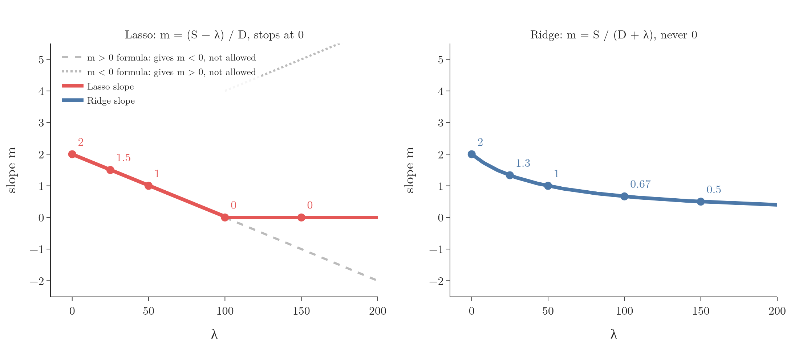
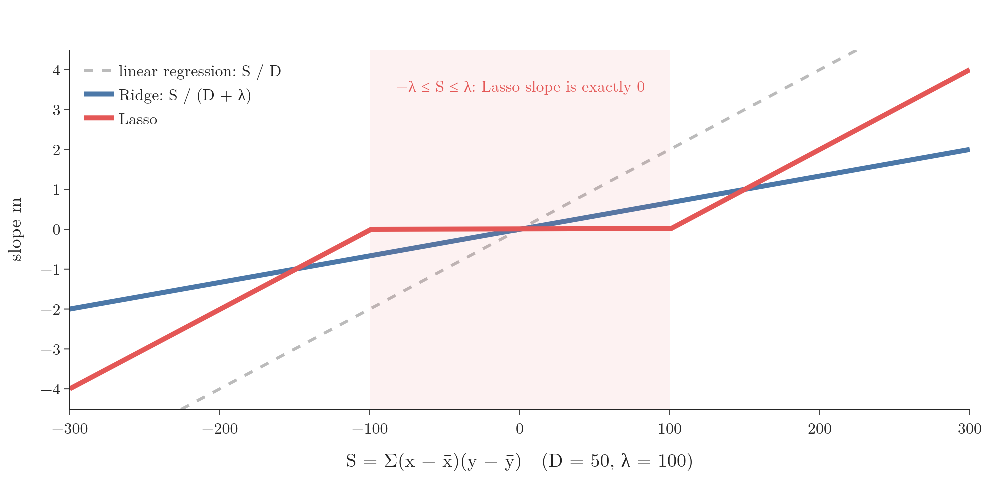
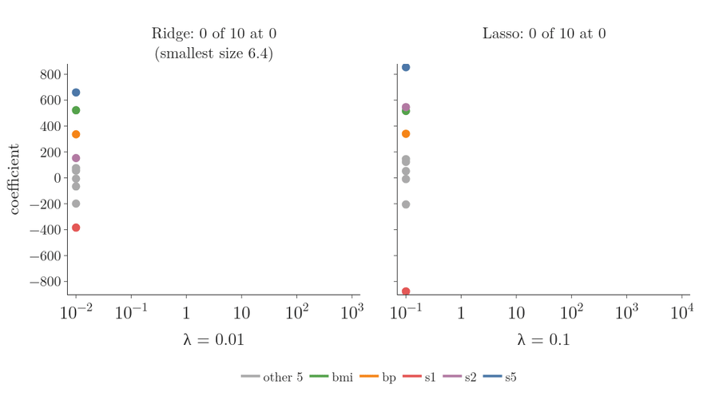
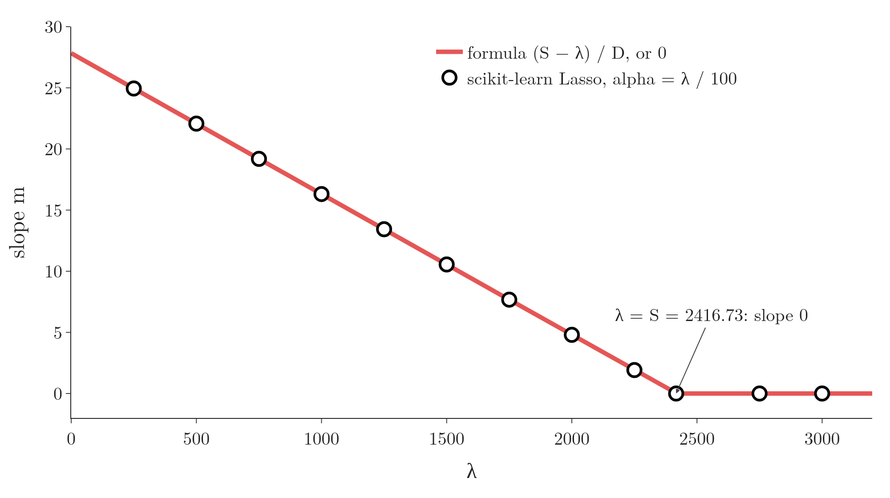

<!-- where-this-fits: generated by course_map/build_map.py; edit concepts.yaml, not this block -->
> **Where this fits:** Pipeline map step 8 (Model). See the [Course map](../../../00-course-map/00-course-map.md).
>
> 
>
> - **Builds on:** Regularisation ([Note ML-062](../../../ML/06-regression/ML-062-ridge-regression-intuition/ML-062-ridge-regression-intuition.md)); Lagrange multipliers, KKT and duality ([Note MA-066](../../../MA/07-optimisation/MA-066-lagrange-multipliers/MA-066-lagrange-multipliers.md)); MAP estimation ([Note MA-072](../../../MA/08-likelihood/MA-072-mle-in-machine-learning/MA-072-mle-in-machine-learning.md)).
> - **Leads to:** Elastic Net ([Note ML-068](../../../ML/06-regression/ML-068-elastic-net/ML-068-elastic-net.md)).
> - **Compare with:** Ridge regression ([Note ML-065](../../../ML/06-regression/ML-065-ridge-key-points/ML-065-ridge-key-points.md)); L1 and L2 regularisation in neural networks ([Note DL-026](../../../DL/02-training/DL-026-regularization-in-dl/DL-026-regularization-in-dl.md)).
<!-- /where-this-fits -->

## 1. Overview

> **Key point:** The Lasso penalty puts a sharp corner into the loss curve at slope 0, and a large enough λ makes that corner the lowest point. The Ridge penalty keeps the curve smooth, so its lowest point only moves towards 0.

The Lasso Note showed that **Lasso regression** (G-1047) sets coefficients to exactly 0, while **Ridge regression** (G-1691) only shrinks them. A model in which many coefficients are exactly 0 is called **sparse** (G-1846), so the effect is called **sparsity** (G-1849).

Sparsity matters when many **features** (G-772) (input variables, one column of the data table each) are useless for the prediction. Lasso removes those features from the equation, which leaves a simpler model that is easier to read. Ridge keeps every feature, so it suits data in which most features are useful.

"Why does Lasso create sparsity, and Ridge does not?" is one of the most common interview questions on **regularisation** (G-1659). This Note answers it for one feature, in this order:

- the picture: the loss curve and its corner (section 2);
- the formula for the Lasso slope, in cases (section 3);
- the numbers: the slope reaching 0 and staying there (section 4);
- the same effect for many features (section 5);
- a check against scikit-learn (section 6).

## 2. The picture: a corner in the loss curve

> **Key point:** The best slope is the lowest point of the loss curve. Lasso's penalty λ|m| bends the curve into a corner at m = 0; once λ is large enough, the corner is the lowest point.

### 2.1 The best slope is the lowest point of a curve

Take one feature $x$ and a **target** (G-1949) $y$ (the output we predict). Every **slope** (G-1823) $m$ gives a different line, and every line has a total squared error, the **residual sum of squares** (G-1684). Plotting that error against the slope gives a U-shaped curve, a parabola. The best slope is the bottom of the U.

To write the curve down, two sums are enough:

$$S = \sum_{i=1}^{n}(x_i - \bar{x})(y_i - \bar{y}) \qquad D = \sum_{i=1}^{n}(x_i - \bar{x})^2$$

- $S$ measures how strongly $x$ and $y$ move together. $S$ is positive when $y$ tends to rise with $x$, and negative when it tends to fall.
- $D$ measures how spread out $x$ is. $D$ is always positive.

With the best **intercept** (G-960) $b = \bar{y} - m\bar{x}$ put in, each error is $(y_i - \bar{y}) - m(x_i - \bar{x})$, and squaring and adding gives

$$\sum_{i=1}^{n}\left[(y_i - \bar{y}) - m(x_i - \bar{x})\right]^2 = D m^2 - 2 S m + \text{constant}$$

The constant, $\sum (y_i - \bar{y})^2$, does not depend on $m$, so it moves the curve up or down without moving its lowest point. This Note uses $S = 100$ and $D = 50$ throughout. The curve $50m^2 - 200m$ has its bottom at $m = S/D = 2$, the linear regression slope.

### 2.2 Adding a penalty moves the lowest point

A **penalty term** (G-1476) is an extra cost for a large slope, added to the squared error. Its strength is $\lambda$.

| | Penalty | Loss curve (constant left out) |
|---|---|---|
| Ridge | $\lambda m^2$ | $D m^2 - 2 S m + \lambda m^2$ |
| Lasso | $2\lambda\lvert m\rvert$ | $D m^2 - 2 S m + 2\lambda\lvert m\rvert$ |

(The 2 in the Lasso penalty only rescales $\lambda$; section 3.1 explains it.)

Figure 1 draws both curves while $\lambda$ grows from 0 to 150. Watch the black dot, the lowest point of each curve.


Step by step, in Figure 1:

1. **λ = 0.** Both curves are the same parabola, with the lowest point at $m = 2$.
2. **Ridge, any λ.** Adding $\lambda m^2$ to a parabola gives a narrower parabola. The curve is still smooth, and its bottom slides left: $m = 1$ at λ = 50, 0.67 at λ = 100, 0.5 at λ = 150. The bottom never lands on 0.
3. **Lasso, λ = 50.** The penalty $2\lambda\lvert m\rvert$ is a V with its point at $m = 0$. Adding a V to a parabola leaves a sharp corner in the curve at $m = 0$. The lowest point is still to the right of the corner, at $m = 1$.
4. **Lasso, λ = 100.** The corner has grown, and the lowest point has slid into it: $m = 0$.
5. **Lasso, λ = 150.** The curve now rises on both sides of the corner. The lowest point stays at $m = 0$.

A slope of exactly 0 means the feature is no longer used in the prediction. The rest of the Note explains the same result with a formula: where the corner comes from, why the lowest point reaches it at λ = 100, and why it stays.

## 3. The Lasso slope

> **Key point:** Because of the absolute value, the derivative is different for m > 0 and m < 0, so the formula comes in cases.

Without a penalty, setting the **derivative** (G-595) of the curve of section 2.1 to zero gives $2Dm - 2S = 0$, so **linear regression** has $m = S / D$ and $b = \bar{y} - m\bar{x}$ (OLS Note). The Lasso slope is found the same way.

### 3.1 The loss

> **Key point:** The loss is the squared error plus 2λ|m|; the 2 only keeps the result tidy.

With one feature, the Lasso loss is

$$L = \sum_{i=1}^{n}(y_i - m x_i - b)^2 + 2\lambda|m|$$

The factor 2 does not change the idea: it only rescales $\lambda$, and it makes the final formula simpler.

The penalty does not contain $b$, so differentiating with respect to $b$ gives the OLS result again: $b = \bar{y} - m\bar{x}$. Substituting it, each error becomes $(y_i - \bar{y}) - m(x_i - \bar{x})$, as in section 2.1.

### 3.2 Why cases are needed

> **Key point:** |m| has no derivative at m = 0, but on each side of 0 it is a simple line.

The **absolute value** (G-159) $|m|$ has a sharp corner at $m = 0$: the corner of the Lasso curve in Figure 1. A curve has no single slope at a corner, so $|m|$ is not **differentiable** (G-606) at $m = 0$. On either side, though, it is simple:

- if $m > 0$, then $|m| = m$;
- if $m < 0$, then $|m| = -m$.

So we solve the two cases separately.

### 3.3 Case m > 0

> **Key point:** For a positive slope, m = (S − λ) / D.

With $|m| = m$, setting the derivative to zero:

$$\frac{\partial L}{\partial m} = -2\sum_{i=1}^{n}(x_i - \bar{x})\left[(y_i - \bar{y}) - m(x_i - \bar{x})\right] + 2\lambda = -2S + 2mD + 2\lambda = 0$$

$$m = \frac{S - \lambda}{D}$$

### 3.4 Case m < 0

> **Key point:** For a negative slope, m = (S + λ) / D.

With $|m| = -m$, the penalty term's derivative is $-2\lambda$ instead of $+2\lambda$, so

$$m = \frac{S + \lambda}{D}$$

### 3.5 Case m = 0

> **Key point:** When neither formula gives an answer with the right sign, the slope is 0.

The result of case 3.3 is only valid if it really is positive, which needs $S > \lambda$. The result of case 3.4 is only valid if it really is negative, which needs $S < -\lambda$. When $S$ is between $-\lambda$ and $\lambda$, neither case applies, and the lowest point of the loss is the corner itself: $m = 0$.

| Condition | Lasso slope |
|---|---|
| $S > \lambda$ | $m = (S - \lambda) / D$ |
| $-\lambda \leq S \leq \lambda$ | $m = 0$ |
| $S < -\lambda$ | $m = (S + \lambda) / D$ |

Figure 2 draws the derivative of the loss, both cases, for $S = 100$, $D = 50$ and three values of $\lambda$. Watch the jump at the corner $m = 0$: once $\lambda$ reaches $S$, the jump spans zero and the lowest loss sits on the corner.


### 3.6 The Ridge slope, for comparison

> **Key point:** Ridge: m = S / (D + λ). λ sits in the denominator.

The Ridge penalty $\lambda m^2$ has no corner, so one derivative covers every $m$: $2Dm - 2S + 2\lambda m = 0$ (Ridge maths Note). Solving for $m$:

$$m = \frac{S}{D + \lambda}$$

with the same $b$ as before.

## 4. Watching the slope reach 0

> **Key point:** Subtracting λ from S brings the top of the fraction down to exactly 0. After that, the slope stays at 0.

Take the same numbers: $S = 100$ and $D = 50$, so the linear regression slope is $100 / 50 = 2$. Figure 3 follows both slopes as $\lambda$ grows; the values are the lowest points of Figure 1.

{height=52%}

| λ | Lasso: $(100 - \lambda) / 50$ | Ridge: $100 / (50 + \lambda)$ |
|---|---|---|
| 0 | 2 | 2 |
| 25 | 1.5 | 1.33 |
| 50 | 1 | 1 |
| 100 | **0** | 0.67 |
| 150 | **0** | 0.5 |
| 1000 | **0** | 0.095 |

### 4.1 Why Lasso reaches 0

> **Key point:** λ grows until it equals S; then the numerator is 0.

At $\lambda = 100$, the numerator $S - \lambda$ is 0, so the slope is exactly 0.

### 4.2 Why Lasso stops at 0

> **Key point:** Going past 0 would need the other case's formula, which pushes the slope back to the positive side.

Work through $\lambda = 150$ step by step:

1. The positive-case formula gives $(100 - 150)/50 = -1$.
2. The value $-1$ is negative, so the positive-case formula no longer applies (Figure 3, dashed).
3. The negative-case formula gives $(100 + 150)/50 = 5$.
4. The value 5 is positive, so the negative-case formula does not apply either (Figure 3, dotted).

Neither side has a valid answer, so the slope stays at $m = 0$. The same happens for every larger $\lambda$.

**The mirror case.** The same holds with a negative $S$. With $S = -100$ and $D = 50$, the negative-case formula $(S + \lambda)/D$ gives a slope of $-2$ at $\lambda = 0$, $-1$ at $\lambda = 50$ and 0 at $\lambda = 100$. At $\lambda = 150$:

1. The negative-case formula gives $(-100 + 150)/50 = 1$, which is positive, so it does not apply.
2. The positive-case formula gives $(-100 - 150)/50 = -5$, which is negative, so it does not apply either.

Again neither side has a valid answer, and the slope stays at 0.

### 4.3 Why Ridge never reaches 0

> **Key point:** With λ only in the denominator, the fraction gets smaller but its top never changes.

An everyday picture: take a bill of 100 rupees. Subtracting a discount of 100 rupees brings it to exactly 0. Splitting it among more and more people only makes each share smaller; no share ever becomes 0. Lasso subtracts λ; Ridge divides by something that grows with λ.

In Ridge's $S / (D + \lambda)$, the numerator stays at 100 however large $\lambda$ gets. Even with $\lambda = 10{,}000{,}000$, the slope is $100 / 10{,}000{,}050$, tiny but not 0.

In short:

- **Lasso:** $\lambda$ is in the **numerator**, so it can make the slope exactly 0.
- **Ridge:** $\lambda$ is in the **denominator**, so it can only make the slope small.

## 5. The dead zone

> **Key point:** For a fixed λ, every feature whose S lies between −λ and λ gets a slope of exactly 0.

Figure 4 turns the view around: $\lambda$ is fixed at 100, and the slope is drawn for every value of $S$.

{height=45%}

- **Linear regression** (grey dashed): the slope is proportional to $S$.
- **Ridge** (blue): also proportional to $S$, just flatter. The Ridge slope is 0 only when $S$ is exactly 0.
- **Lasso** (red): flat at 0 for every $S$ between $-100$ and 100, the shaded **dead zone** (G-552). Outside it, Lasso follows the linear regression line moved $\lambda / D = 2$ towards 0.

$S$ measures how strongly the feature and the target move together. So a feature with only a weak link to the target falls into the dead zone and is dropped. Dropping weak features in this way is the **feature selection** (G-768) of the Lasso Note: the model that is left uses fewer features, so it is simpler and easier to read.

Think of λ as an entry fee. A feature's link with the target, $|S|$, must be larger than the fee to get any slope at all, and above the fee the feature keeps only what is left over.

> **Extra:** Shrinking a value towards 0 by a fixed amount and setting it to 0 if it would cross 0 is called **soft thresholding** (G-1827). With several features, Lasso has no single formula, but scikit-learn's method, **coordinate descent** (G-485), applies this same soft-threshold step to one coefficient at a time, over and over (ESL §3.8.6; scikit-learn docs, `Lasso`). The repeated soft-threshold step is why many coefficients land exactly on 0.

### 5.1 Ten features at once

> **Key point:** On the 10-feature diabetes data, Lasso coefficients drop to exactly 0 one after another; Ridge coefficients only shrink.

Figure 5 grows λ for Ridge (left) and Lasso (right) on the diabetes data of the [Lasso Note](../ML-066-lasso-regression/ML-066-lasso-regression.md) (same split). Watch the dots: a Lasso dot that reaches 0 turns into an open circle and stays there, while every Ridge dot keeps sliding towards 0 without arriving.



- **Lasso:** the coefficients reach 0 one at a time, bmi and s5 last; from λ ≈ 825 all 10 are exactly 0.
- **Ridge:** at λ = 1000, all coefficients are tiny, but the smallest is still 0.069, not 0.

### 5.2 The picture: a diamond and a circle

> **Key point:** Lasso's feasible region is a diamond with corners on the axes; the loss rings around the least-squares answer usually touch it first at a corner, where one coefficient is exactly 0.

The same result has a geometric picture (ESL §3.4.3, Figure 3.11). Ridge and Lasso can each be written as "make the loss as small as possible while the coefficients stay inside a budget". The budget is a **constraint** (G-456), and the set of coefficients that meet it is the **feasible region** (G-759). With two coefficients and a budget $t$:

- **Lasso:** $\lvert b_1\rvert + \lvert b_2\rvert \le t$, a diamond with its corners on the axes.
- **Ridge:** $b_1^2 + b_2^2 \le t^2$, a circle.

The loss is a bowl over the $(b_1, b_2)$ plane. Its lowest point is the **ordinary least squares** (G-1406) answer, and points of equal loss form ellipses around it, the loss **contours** (G-468). Growing the ellipse until it first touches the feasible region gives the answer: the point of the region with the smallest loss.

Figure 6 does this on two features of the same diabetes training split, bmi and bp, each scaled to standard deviation 1, with the same budget $t = 15$ for both. Watch where each ring first meets its region.


- **Lasso:** the ring first touches the diamond exactly at its corner $(15, 0)$. The bp coefficient is exactly 0.
- **Ridge:** the circle has no corners, so the ring touches it at $(12.2, 8.8)$. Both coefficients are kept, just smaller than the least-squares $(37.9, 19.7)$.

The corners stick out towards the rings, so the rings often meet a corner first. With more features the diamond has many corners, edges and faces on which some coefficients are 0, so there are even more chances for exact zeros (ESL §3.4.3).

## 6. Checking with scikit-learn

> **Key point:** On the 100-observation example, the formula and scikit-learn's Lasso give the same slopes, including the exact 0.

For the example of the earlier Notes, with 100 **observations** (G-1374) (records, one row of the data table each), $S = 2416.73$ and $D = 86.85$. So the slope reaches 0 at $\lambda = 2416.73$.

| λ | Formula | scikit-learn `Lasso` |
|---|---|---|
| 500 | 22.071 | 22.071 |
| 1000 | 16.313 | 16.313 |
| 2000 | 4.799 | 4.799 |
| 2416.73 | 0 | 0 |
| 3000 | 0 | 0 |

Figure 7 checks many more values of $\lambda$. Watch the circles from scikit-learn sit on the formula's line, including the flat part after $\lambda = 2416.73$.



scikit-learn's `Lasso` divides the squared error by $2n$, so its `alpha` equals $\lambda / n$. With $n = 100$, the slope reaches 0 at alpha $= 24.17$: the value found in the Lasso Note.

> **Python:** The one-feature Lasso slope.
>
> ```python
> def lasso_slope(S, D, lam):
>     if S > lam:
>         return (S - lam) / D
>     if S < -lam:
>         return (S + lam) / D
>     return 0.0
>
> lasso_slope(100, 50, 25)       # 1.5
> lasso_slope(100, 50, 150)      # 0.0
> ```

## 7. Summary

| | Ridge | Lasso |
|---|---|---|
| Slope, one feature | $S / (D + \lambda)$ | $(S - \lambda)/D$, 0, or $(S + \lambda)/D$ |
| Where λ appears | denominator | numerator |
| Large λ | slope small, never 0 | slope exactly 0 |
| Weak features | kept with small coefficients | dropped (dead zone) |

- Sparsity means many coefficients exactly 0.
- The Lasso penalty puts a corner into the loss curve at slope 0; a large enough λ makes the corner the lowest point. The Ridge curve stays a smooth parabola.
- The absolute value forces the Lasso formula into cases, and λ ends up subtracted from the numerator.
- Once $\lambda \geq |S|$, the slope is 0 and stays there.
- In pictures: the loss ellipse usually first touches Lasso's diamond at a corner, where a coefficient is exactly 0; Ridge's circle has no corners.

## 8. Sources

**Built from**

- CampusX, "Why Lasso Regression creates sparsity?", YouTube, https://www.youtube.com/watch?v=FN4aZPIAfI4
- StatQuest with Josh Starmer, "Ridge vs Lasso Regression, Visualized!!!", YouTube, https://www.youtube.com/watch?v=Xm2C_gTAl8c
- StatQuest with Josh Starmer, "Regularization Part 2: Lasso (L1) Regression", YouTube, https://www.youtube.com/watch?v=NGf0voTMlcs

**Other references**

- **ESL:** Hastie, T., Tibshirani, R. and Friedman, J. *The Elements of Statistical Learning*, 2nd ed. Springer, 2009. Section 3.4.3 and Figure 3.11 (the diamond and the disk), and Section 3.8.6, p. 93.
- **scikit-learn docs:** `sklearn.linear_model.Lasso` (coordinate descent), scikit-learn 1.9.

## 9. Key terms

| Term | Meaning |
|---|---|
| Sparsity | Having many coefficients exactly equal to 0 |
| Soft thresholding | Moving a value towards 0 by a fixed amount, and setting it to 0 if it would cross 0 |
| Dead zone | The range of S for which the Lasso slope is exactly 0 |
| Coordinate descent | An optimisation method that updates one coefficient at a time; used by scikit-learn's Lasso |
