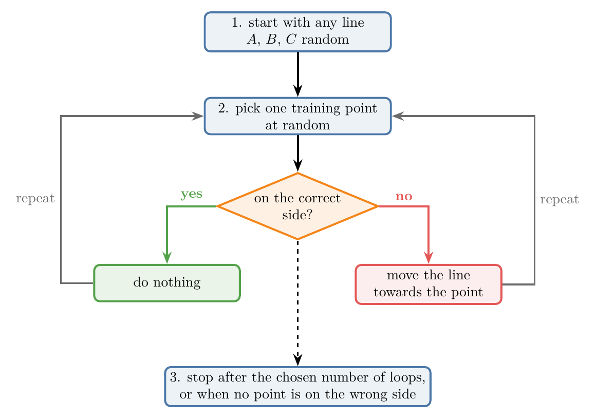
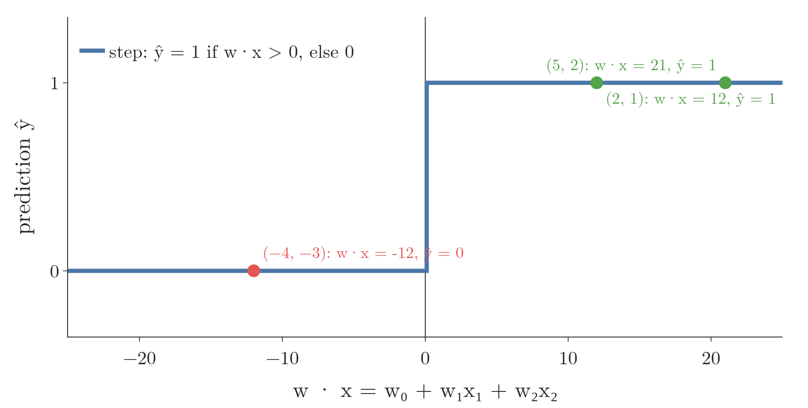

<!-- where-this-fits: generated by course_map/build_map.py; edit concepts.yaml, not this block -->
> **Where this fits:** Pipeline map steps 0 (Foundations), 8 (Model). See the [Course map](../../../00-course-map/00-course-map.md).
>
> 
>
> - **Builds on:** [Classification problems](../../../ML/01-foundations/ML-003-types-of-ml/ML-003-types-of-ml.md#1-overview); [Model-based learning](../../../ML/01-foundations/ML-006-instance-vs-model-based/ML-006-instance-vs-model-based.md#4-model-based-learning); [Gradient descent](../../../ML/06-regression/ML-056-gradient-descent/ML-056-gradient-descent.md#7-gradient-descent-as-a-class); [Polynomial features](../../../ML/06-regression/ML-060-polynomial-regression/ML-060-polynomial-regression.md#1-overview); [Dot product](../../../MA/05-linear-algebra/MA-050-dot-product-and-cosine-similarity/MA-050-dot-product-and-cosine-similarity.md#3-computing-the-dot-product); [Convex sets and convex optimisation](../../../MA/07-optimisation/MA-067-convex-sets-and-functions/MA-067-convex-sets-and-functions.md#2-convex-sets).
> - **Leads to:** [Sigmoid function](../../../ML/07-classification/ML-071-sigmoid-function/ML-071-sigmoid-function.md#4-the-sigmoid-function); [Log loss (binary cross entropy)](../../../ML/07-classification/ML-072-log-loss/ML-072-log-loss.md#62-the-loss-function); [Softmax regression](../../../ML/07-classification/ML-078-softmax-regression/ML-078-softmax-regression.md#1-overview); [Support vector machines](../../../ML/07-classification/ML-086-svm-intuition/ML-086-svm-intuition.md#9-sources); [Perceptron](../../../DL/01-basics/DL-004-perceptron/DL-004-perceptron.md#3-the-parts-of-a-perceptron); [Perceptron loss](../../../DL/01-basics/DL-006-perceptron-loss/DL-006-perceptron-loss.md#6-the-perceptron-loss).
> - **Compare with:** [Support vector machines](../../../ML/07-classification/ML-086-svm-intuition/ML-086-svm-intuition.md#9-sources).
<!-- /where-this-fits -->

## 1. Overview

> **Key point:** Logistic regression separates two classes with a straight line. The perceptron trick is a simple way to find such a line: pick a random point, and if it is on the wrong side, move the line towards it.

**Logistic regression** (G-1120) is one of the most widely used classification algorithms. Logistic regression is also the basic building block of neural networks: a single neuron (the **perceptron**, G-1486) is very close to it. Understanding it well is a good foundation for deep learning.

Logistic regression can be explained in two ways:

- **Geometric:** find a line that separates the classes.
- **Probabilistic:** predict the probability that a point belongs to a class.

These Notes build it step by step. This Note starts with the **perceptron trick** (G-1485), a very simple geometric method. The perceptron trick does not give the best possible line (Bishop §4.1.7), but it explains the idea that the later Notes improve on: the sigmoid function, the loss function and gradient descent.

## 2. When logistic regression works

> **Key point:** The two classes must be (almost) linearly separable: a straight line, plane or hyperplane can split them.

Take a dataset of students. Each student is one **observation** (G-1374; one record, one row of the data table). There are two **features** (G-772; input variables, one column each), CGPA and IQ, and one **target** (G-1949; the output we predict): placed or not placed. We want a model that takes a new student's CGPA and IQ and predicts whether they will be placed.

{height=42%}

In Figure 1 each dot is one observation. In the left panel the green dots (placed) and blue dots (not placed) sit in two groups, and the black line has one group on each side. In the right panel one class forms a ring around the other. Data is **linearly separable** (G-1103) when a straight line can split the two classes (Figure 1, left). With 3 features the divider is a plane, and with more features a **hyperplane** (G-911). The divider between the two classes is the model's **decision boundary** (G-555): points on one side are predicted placed, points on the other side not placed. A few points on the wrong side are fine: the data only needs to be almost separable.

Logistic regression draws a straight divider, just as linear regression fits a straight line. So on data like Figure 1 (right), where one class surrounds the other, it cannot do well.

## 3. The line and its two sides

> **Key point:** In classification, the line is written Ax + By + C = 0. Putting a point into Ax + By + C tells which side it is on.

### 3.1 The general form of a line

> **Key point:** Ax + By + C = 0, or with more features, w₀ + w₁x₁ + w₂x₂ + ... = 0.

Linear regression wrote a line as $y = mx + b$. In classification, both axes are features, so the line is written in its general form:

$$Ax + By + C = 0$$

With CGPA as $x_1$ and IQ as $x_2$, this becomes $A x_1 + B x_2 + C = 0$. A third feature adds one more term: $A x_1 + B x_2 + C x_3 + D = 0$, a plane. Finding the separating line means finding good values of $A$, $B$ and $C$.

### 3.2 Positive and negative sides

> **Key point:** Ax + By + C > 0 on one side, < 0 on the other, = 0 on the line.

Every line splits the plane into a **positive side** and a **negative side** (G-1529). To find which side a point $(p, q)$ is on, put it into the left-hand side:

- $A p + B q + C > 0$: positive side.
- $A p + B q + C < 0$: negative side.
- $A p + B q + C = 0$: on the line.

{height=48%}

With numbers, take the line $2x + 3y + 5 = 0$ (Figure 2). The point $(2, 1)$ gives:

$$2 \times 2 + 3 \times 1 + 5 = 12$$

It is positive, so the point is on the positive side. The point $(-4, -3)$ gives:

$$2 \times (-4) + 3 \times (-3) + 5 = -12$$

It is negative: negative side.

## 4. How A, B and C move the line

> **Key point:** Changing C shifts the line without turning it. Changing A or B turns it.

The perceptron trick moves the line by changing $A$, $B$ and $C$. Each one has its own effect (Figure 3):

{height=50%}

- **C:** the line moves parallel to itself. Increasing C moves $2x + 3y + C = 0$ down, decreasing it moves it up.
- **A:** the line turns about the point where it crosses the y-axis, here $(0, -5/3)$, because there $x = 0$ and $A$ has no effect.
- **B:** the line turns about the point where it crosses the x-axis, here $(-5/2, 0)$.

Changing all three at once combines these moves, so the line can reach any position.

## 5. The perceptron trick

> **Key point:** Start with any line. Repeatedly pick a random point. If it is on the correct side, do nothing; if not, move the line towards it.

The algorithm:

1. Start with random values of $A$, $B$ and $C$: any line.
2. Repeat many times (for example 1,000):
   - pick one training point at random;
   - if it is on the correct side of the line, do nothing;
   - if it is on the wrong side, change $A$, $B$ and $C$ so that the line moves towards it.
3. Stop after the chosen number of loops, or as soon as no point is misclassified (**convergence**, G-469).

Figure 4 draws the loop.



Each misclassified point "pulls" the line towards itself until it is on the correct side. After enough pulls, the line settles between the classes.

One way to picture the loop: the line asks each picked student, "are you on the right side?" A correctly classified student answers "yes, leave the line alone". A misclassified student answers "no, come towards me".

Figure 5 runs the loop on 24 students of Figure 1 (12 placed, 12 not placed, both features standardised). Crosses mark misclassified students, and the red ring marks the student picked in that frame. Watch the two kinds of frame. When the ringed student is on the correct side, the line stays. When the ringed student is a cross, the line turns a little towards it (the dashed line is the line before). The start line gets 14 students wrong; after 36 picks, 11 of which moved the line, no student is misclassified and the loop stops.


The frame titles also show $y - \hat y$, the quantity that Section 7.3 uses to write the whole loop as one rule.

An everyday picture: a farmer builds a fence between sheep and goats. Each time a goat is found on the sheep side, the farmer nudges the fence a little towards that goat; repeated nudges carry the fence past it. Animals already on the right side cause no change. After enough nudges, every animal is on its own side.

## 6. Moving the line towards a point

> **Key point:** Add a 1 to the point's coordinates. For a negative point on the positive side, subtract them from (A, B, C). For a positive point on the negative side, add them.

### 6.1 A negative point on the positive side

> **Key point:** Subtract (x, y, 1) from (A, B, C).

Take the line $2x + 3y + 5 = 0$ and the point $(5, 2)$, which belongs to the negative class. The point gives:

$$2 \times 5 + 3 \times 2 + 5 = 21$$

The value is above 0, so the point is on the positive side: misclassified.

Append a 1 to the point, $(5, 2, 1)$, and subtract it from the coefficients $(2, 3, 5)$:

$$(2 - 5,\ 3 - 2,\ 5 - 1) = (-3,\ 1,\ 4)$$

The new line is:

$$-3x + y + 4 = 0$$

Now the point gives:

$$-3 \times 5 + 1 \times 2 + 4 = -9$$

The value is below 0: it is on the negative side, as it should be (Figure 6, left).

### 6.2 A positive point on the negative side

> **Key point:** Add (x, y, 1) to (A, B, C).

The point $(-3, -2)$ belongs to the positive class, but gives a negative value:

$$2 \times (-3) + 3 \times (-2) + 5 = -7$$

Add $(-3, -2, 1)$ instead:

$$(2 - 3,\ 3 - 2,\ 5 + 1) = (-1,\ 1,\ 6)$$

The new line is:

$$-x + y + 6 = 0$$

Now the point gives:

$$-1 \times (-3) + 1 \times (-2) + 6 = 7$$

The value is above 0: positive side (Figure 6, right).

{height=55%}

### 6.3 Small steps: the learning rate

> **Key point:** Multiply the point by a learning rate such as 0.1 before adding or subtracting, so the line moves a little at a time.

The full update above jumps the line a long way, which can undo what other points taught it. As in [gradient descent](../../06-regression/ML-056-gradient-descent/ML-056-gradient-descent.md#22-how-far-to-move), the step is scaled by a small **learning rate** (G-1068) $\eta$, usually around 0.1 or 0.01:

$$\text{new coefficients} = \text{old coefficients} - \eta \times (x, y, 1)$$

With $\eta = 0.1$, the first example gives:

$$(2 - 0.5,\ 3 - 0.2,\ 5 - 0.1)$$

$$= (1.5,\ 2.8,\ 4.9)$$

The point's value drops from 21 to 18: the line has moved a little towards it. Repeated small steps get it to the correct side.

{width=100%}

In Figure 7, watch the line swing a little towards the ringed point at every step while the value at the point counts down to 0 and changes sign. Each step changes the value by the same amount. The numbers for the point $(5, 2)$, written as $p = (5, 2, 1)$ with the coefficients $w = (2, 3, 5)$:

$$w \cdot p = 2 \times 5 + 3 \times 2 + 5 \times 1 = 21$$
$$\eta\thinspace(p \cdot p) = 0.1 \times (5 \times 5 + 2 \times 2 + 1 \times 1)$$
$$\eta\thinspace(p \cdot p) = 0.1 \times 30 = 3$$
$$(w - \eta p) \cdot p = 21 - 3 = 18$$

Here $\cdot$ is the dot product: multiply matching entries and add (Section 7.1 spells it out). The new coefficients $(1.5, 2.8, 4.9)$ give the same 18:

$$1.5 \times 5 + 2.8 \times 2 + 4.9 \times 1 = 18$$

For $(-3, -2)$, with $p = (-3, -2, 1)$ and an add step, the change is:

$$0.1 \times (9 + 4 + 1) = 1.4$$

In symbols, the identity behind every step is:

$$(w - \eta p) \cdot p = w \cdot p - \eta(x^2 + y^2 + 1)$$

where $x^2 + y^2 + 1$ is the same $p \cdot p$.

## 7. Writing the algorithm compactly

> **Key point:** With a column of 1s and weights w, the line is Σ wᵢxᵢ = 0, and all four cases fit in one update rule.

### 7.1 Notation

> **Key point:** Rename C, A, B as w₀, w₁, w₂ and add a column x₀ = 1.

Write the line as $w_0 + w_1 x_1 + w_2 x_2 = 0$, so $w_0 = C$, $w_1 = A$ and $w_2 = B$. Then add an extra feature $x_0$ that is always 1 (a column of 1s in the data table), as in [multiple linear regression](../../06-regression/ML-052-multiple-linear-regression/ML-052-multiple-linear-regression.md#3-the-equation):

$$\sum_{i=0}^{2} w_i x_i = w_0 x_0 + w_1 x_1 + w_2 x_2 = 0$$

The symbol $\sum_{i=0}^{2}$ means "add up the terms for $i = 0, 1, 2$": $i$ is a counter that picks the $i$-th weight and the $i$-th feature. A worked instance: the line $2x + 3y + 5 = 0$ has $w = (w_0, w_1, w_2) = (5, 2, 3)$, and the point $(2, 1)$ has $x = (x_0, x_1, x_2) = (1, 2, 1)$:

$$i = 0: \quad w_0 x_0 = 5 \times 1 = 5$$
$$i = 1: \quad w_1 x_1 = 2 \times 2 = 4$$
$$i = 2: \quad w_2 x_2 = 3 \times 1 = 3$$
$$\sum_{i=0}^{2} w_i x_i = 5 + 4 + 3 = 12$$

The value 12 is the same as in Section 3.2. The same sum works for any number of features, just with more terms. Multiplying matching entries and adding them is called the **dot product** (G-634), written $w \cdot x$. Here the dot product is 12.

### 7.2 Predicting

> **Key point:** Compute w · x for the student. If it is positive, predict 1 (placed); otherwise predict 0.

For a student with CGPA 7.5 and IQ 110, the observation is $x = (1,\ 7.5,\ 110)$. Take illustrative weights $w = (-9,\ 0.5,\ 0.05)$. The model computes $w_0 \times 1 + w_1 \times 7.5 + w_2 \times 110$:

$$-9 \times 1 = -9$$
$$0.5 \times 7.5 = 3.75$$
$$0.05 \times 110 = 5.5$$
$$w \cdot x = -9 + 3.75 + 5.5 = 0.25$$

The result 0.25 is above 0, so the model predicts placed (1). In general, if the result is above 0 it predicts placed (1); otherwise not placed (0). The rule "1 if positive, else 0" is a **step function** (G-1889) of $w \cdot x$.

Figure 8 applies it to the three points of Sections 3 and 6 with the line $2x + 3y + 5 = 0$, that is $w = (5, 2, 3)$. The values 12 and 21 land on the step at 1, the value $-12$ at 0. The point $(5, 2)$ is predicted 1 but belongs to the negative class, so $y - \hat y = -1$ in the rule below, and the update subtracts, exactly as in Section 6.1.



### 7.3 One update rule

> **Key point:** w_new = w_old + η (y − ŷ) x. The factor (y − ŷ) is 0, +1 or −1 and picks the right action automatically.

The algorithm so far needs two checks: a negative point on the positive side, and a positive point on the negative side. Both fit into a single rule, where $y$ is the true class and $\hat{y}$ the predicted one:

$$w_{\text{new}} = w_{\text{old}} + \eta\thinspace(y - \hat{y})\thinspace x$$

| True $y$ | Predicted $\hat{y}$ | $y - \hat{y}$ | Update |
|---|---|---|---|
| 1 | 1 | 0 | none: correct |
| 0 | 0 | 0 | none: correct |
| 1 | 0 | $+1$ | $w + \eta x$: add (positive point on the negative side) |
| 0 | 1 | $-1$ | $w - \eta x$: subtract (negative point on the positive side) |

So the loop needs no if-statements: for each random point, compute $\hat{y}$ and apply the rule.

Figure 5 shows all four rows at work. Every frame where the line stays is one of the first two rows ($y - \hat y = 0$). Picks 1 to 3, where a not-placed student sits on the green side, are the last row ($-1$, subtract). Picks 4 and 7, where a placed student sits on the blue side, are the third row ($+1$, add).

> **Python:** The perceptron trick.
>
> ```python
> def step(z):
>     return 1 if z > 0 else 0
>
> def perceptron(X, y, lr=0.1, loops=1000):
>     X = np.insert(X, 0, 1, axis=1)      # column of 1s
>     w = np.ones(X.shape[1])
>     for _ in range(loops):
>         j = np.random.randint(0, X.shape[0])
>         y_hat = step(X[j] @ w)
>         w = w + lr * (y[j] - y_hat) * X[j]
>     return w
> ```
>
> Running this code on real data, we can [watch the decision boundary move](../ML-070-perceptron-code/ML-070-perceptron-code.md#5-watching-the-decision-boundary-move).

## 8. Summary

- Logistic regression needs (almost) linearly separable classes, because it draws a straight divider; data where one class surrounds the other defeats it.
- A line $Ax + By + C = 0$ has a positive and a negative side; plug a point in to find which, so the sign of the value is the model's prediction.
- Perceptron trick: pick random points; move the line towards each misclassified one, so each mistake pulls the line until that point is on its correct side.
- Update: $w \leftarrow w + \eta(y - \hat{y})x$, with a column of 1s in $x$; because $y - \hat{y}$ is 0, +1 or −1, one rule covers do nothing, add and subtract, and the small $\eta$ keeps one point from undoing what others taught.
- The perceptron trick finds a separating line, but not necessarily the best one; which line it finds depends on the starting line and the order of the points (Bishop §4.1.7). The next Notes fix this.

## 9. Sources

**Built from**

- CampusX, "Logistic Regression Part 1 | Perceptron Trick", YouTube, https://www.youtube.com/watch?v=XNXzVfItWGY

**Other references**

- **Bishop:** Bishop, C. M. *Pattern Recognition and Machine Learning*. Springer, 2006. Section 4.1.7, pp. 192–196 (the perceptron algorithm; p. 194 on many solutions).

## 10. Key terms

| Term | Meaning |
|---|---|
| Logistic regression | A classification algorithm that separates classes with a line, plane or hyperplane |
| Perceptron | A single artificial neuron: a weighted sum of the features followed by a step |
| Perceptron trick | Moving a line towards each misclassified point until the classes are separated |
| Linearly separable | Data whose classes a straight line, plane or hyperplane can split |
| Hyperplane | The flat divider in more than three dimensions |
| Decision boundary | The line, plane or hyperplane that separates the predicted classes |
| Feature | An input variable: one column of the data table |
| Target | The output we predict |
| Observation | One record: one row of the data table |
| Positive and negative side | The two halves of the plane on either side of a line $Ax + By + C = 0$: where $Ax + By + C$ is above 0 and where it is below 0; the perceptron predicts one class on each side. |
| Step function | A function that outputs 1 for positive inputs and 0 otherwise; the classic perceptron uses it to turn its score into a class. |
| Convergence (G-469) | The point where training stops changing, here when no point is misclassified |
