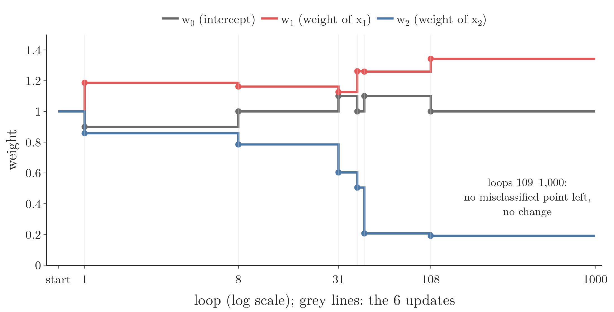
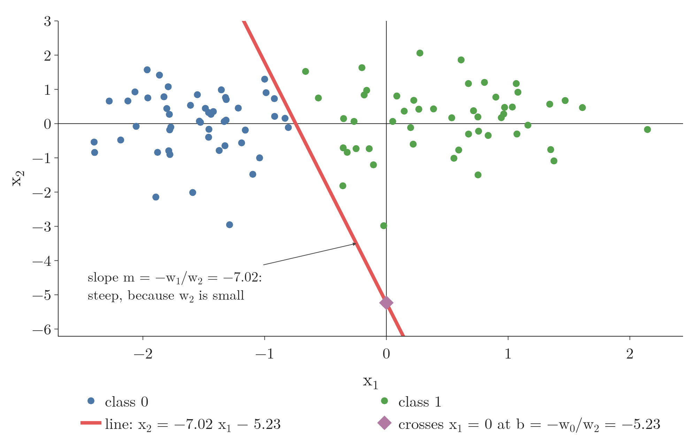
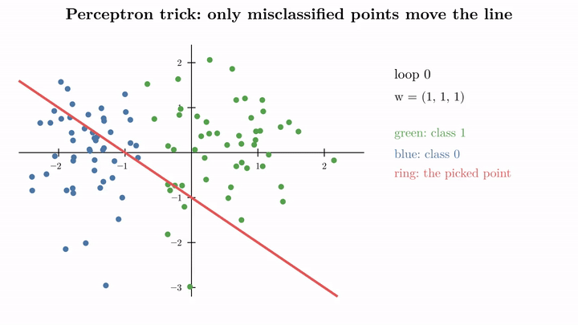
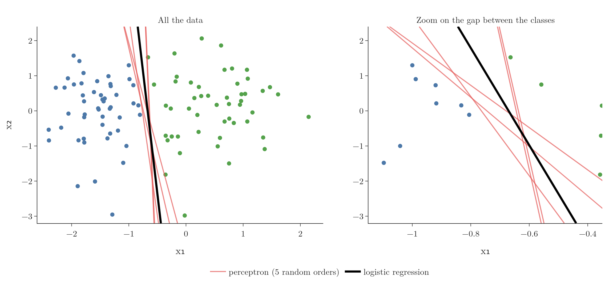

<!-- where-this-fits: generated by course_map/build_map.py; edit concepts.yaml, not this block -->
> **Where this fits:** Pipeline map step 8 (Model). See the [Course map](../../../00-course-map/00-course-map.md).
>
> 
>
> - **Builds on:** [Classification problems](../../../ML/01-foundations/ML-003-types-of-ml/ML-003-types-of-ml.md#1-overview); [Model-based learning](../../../ML/01-foundations/ML-006-instance-vs-model-based/ML-006-instance-vs-model-based.md#4-model-based-learning); [Gradient descent](../../../ML/06-regression/ML-056-gradient-descent/ML-056-gradient-descent.md#7-gradient-descent-as-a-class); [Polynomial features](../../../ML/06-regression/ML-060-polynomial-regression/ML-060-polynomial-regression.md#1-overview); [Sigmoid function](../../../ML/07-classification/ML-071-sigmoid-function/ML-071-sigmoid-function.md#4-the-sigmoid-function); [Log loss (binary cross entropy)](../../../ML/07-classification/ML-072-log-loss/ML-072-log-loss.md#62-the-loss-function).
> - **Leads to:** [Softmax regression](../../../ML/07-classification/ML-078-softmax-regression/ML-078-softmax-regression.md#1-overview); [Support vector machines](../../../ML/07-classification/ML-086-svm-intuition/ML-086-svm-intuition.md#9-sources); [Perceptron](../../../DL/01-basics/DL-004-perceptron/DL-004-perceptron.md#3-the-parts-of-a-perceptron); [Perceptron loss](../../../DL/01-basics/DL-006-perceptron-loss/DL-006-perceptron-loss.md#6-the-perceptron-loss).
> - **Compare with:** [Support vector machines](../../../ML/07-classification/ML-086-svm-intuition/ML-086-svm-intuition.md#9-sources).
<!-- /where-this-fits -->

## 1. Overview

> **Key point:** The perceptron trick takes about ten lines of Python. The trick finds a decision boundary (the line that separates the classes), but it stops as soon as no point is misclassified, so the boundary can end up very close to one class. Logistic regression keeps improving until the boundary sits well between them.

The [previous lesson on the perceptron trick](../ML-069-perceptron-trick/ML-069-perceptron-trick.md#5-the-perceptron-trick) described the **perceptron trick** (G-1485): start with any line, pick random points, and move the line towards each misclassified one. The line that separates the two classes is the model's **decision boundary** (G-555): points on one side are predicted as class 1, points on the other side as class 0. This Note:

- codes the trick (section 3) and draws its decision boundary (section 4);
- watches the decision boundary move (section 5);
- compares the result with scikit-learn's `LogisticRegression` (section 6).

The comparison shows the trick's weakness, which the following Notes fix.

## 2. The data

> **Key point:** 100 points with two features and two balanced classes, made with make_classification.

`make_classification` (G-1149) creates classification data, just as `make_regression` creates regression data.

> **Python:** Creating the data.
>
> ```python
> from sklearn.datasets import make_classification
>
> X, y = make_classification(n_samples=100, n_features=2,
>     n_informative=1, n_redundant=0, n_classes=2,
>     n_clusters_per_class=1, random_state=41,
>     hypercube=False, class_sep=10)
> ```

`X` has 100 rows and 2 columns. Each row is one **observation** (G-1374) (one record, here one point) and each column is one **feature** (G-772) (an input variable), $x_1$ or $x_2$. `y` holds the **target** (G-1949), the output we predict: the class of each observation, 50 zeros and 50 ones. `class_sep` sets how far apart the classes are. In the figures, class 1 is green and class 0 is blue.

## 3. The code

> **Key point:** Add a column of 1s, start with weights of 1, and repeat 1,000 times: pick a random row, predict it with the step function, and apply w = w + lr (y − ŷ) x.

In plain words, the code does three things. First it adds a column of 1s to the data, so the intercept can be handled like any other weight. Then it starts with all weights at 1. Then it repeats one small step 1,000 times: pick a random point, predict its class, and move the weights only if the prediction was wrong.

> **Python:** The perceptron trick.
>
> ```python
> def step(z):
>     return 1 if z > 0 else 0
>
> def perceptron(X, y, lr=0.1, loops=1000, seed=0):
>     rng = np.random.default_rng(seed)
>     X = np.insert(X, 0, 1, axis=1)     # column of 1s
>     weights = np.ones(X.shape[1])      # [w0, w1, w2]
>     for _ in range(loops):
>         j = rng.integers(0, X.shape[0])            # random row
>         y_hat = step(X[j] @ weights)               # predict it
>         weights = weights + lr * (y[j] - y_hat) * X[j]
>     return weights[0], weights[1:]
>
> intercept_, coef_ = perceptron(X, y)
> ```

Line by line:

- `np.insert(X, 0, 1, axis=1)` puts a 1 at the start of every row, so each row becomes $(1, x_1, x_2)$. The first weight then acts as the **intercept** (G-960), also called the **bias** of the perceptron (G-284).
- `weights` starts as $(1, 1, 1)$: the decision boundary $1 + x_1 + x_2 = 0$.
- In each loop, `X[j] @ weights` is the [dot product](../ML-069-perceptron-trick/ML-069-perceptron-trick.md#71-notation) (multiply matching entries and add) $w_0 + w_1 x_1 + w_2 x_2$ for row $j$, and `step` turns it into a prediction of 1 or 0. This 0-or-1 cut at zero is the **step function** (G-1889).
- The update changes the weights only when $y \neq \hat{y}$ (see [one update rule](../ML-069-perceptron-trick/ML-069-perceptron-trick.md#73-one-update-rule)).

With seed 0, the result is $w_0 = 1.00$, $w_1 = 1.34$, $w_2 = 0.19$, and no training point is misclassified.

Figure 1 tracks the three weights through all 1,000 loops. Watch them move only in 6 jumps and then stay flat from loop 108 to the end.



> **Extra:** The fixed **random seed** (G-1617) makes the random picks the same on every run, so the results repeat. Without it, every run gives a slightly different decision boundary.

## 4. Drawing the decision boundary

> **Key point:** To plot w₀ + w₁x₁ + w₂x₂ = 0, solve for x₂: slope m = −w₁/w₂, intercept b = −w₀/w₂.

With two features the decision boundary is a straight line. To draw it as $x_2 = m x_1 + b$, solve $w_0 + w_1 x_1 + w_2 x_2 = 0$ for $x_2$:

$$x_2 = -\frac{w_1}{w_2}x_1 - \frac{w_0}{w_2}$$

With the weights above, $w_0 = 1.00$, $w_1 = 1.34$ and $w_2 = 0.19$ (rounded; the unrounded values give the numbers below), one line per value:

$$m = -\frac{w_1}{w_2} = -\frac{1.34}{0.19} \approx -7.02$$

$$b = -\frac{w_0}{w_2} = -\frac{1.00}{0.19} \approx -5.23$$

The boundary is steep because $w_2$ is small: the classes are separated mainly by $x_1$.

Figure 2 draws this decision boundary over the data. Watch where it crosses $x_1 = 0$, at $b = -5.23$, and how steeply it climbs between the two classes.



## 5. Watching the decision boundary move

> **Key point:** The decision boundary moved only 6 times in 1,000 loops. After loop 108 every point was on its correct side, so nothing changed again.

Figure 3 animates the run. A red ring marks each picked point that was misclassified, and the decision boundary jumps towards it.

{height=55%}

| Update | Loop | Picked point's class | Weights $(w_0, w_1, w_2)$ after |
|---|---|---|---|
| start | 0 | | (1, 1, 1) |
| 1 | 1 | 0 | (0.90, 1.19, 0.86) |
| 2 | 8 | 1 | (1.00, 1.16, 0.79) |
| 3 | 31 | 1 | (1.10, 1.13, 0.60) |
| 4 | 40 | 0 | (1.00, 1.26, 0.50) |
| 5 | 44 | 1 | (1.10, 1.26, 0.21) |
| 6 | 108 | 0 | (1.00, 1.34, 0.19) |

Most loops pick a point that is already correctly classified: then $y - \hat{y} = 0$, the update adds nothing, and the boundary stays still. Only a misclassified point gives $y - \hat{y} = \pm 1$ and moves it. After update 6 there are no misclassified points left, so loops 109 to 1,000 change nothing.

## 6. The weakness: the decision boundary stops too early

> **Key point:** Five random orders give five different decision boundaries, some almost touching one class. Logistic regression places its boundary with a fair margin to both classes.

### 6.1 Comparing with logistic regression

> **Key point:** Fit scikit-learn's LogisticRegression on the same data and draw both decision boundaries.

We train scikit-learn's `LogisticRegression` on the same 100 points and turn its weights into a line with the formulas of section 4.

> **Python:** Logistic regression in scikit-learn.
>
> ```python
> from sklearn.linear_model import LogisticRegression
>
> lor = LogisticRegression(C=100)
> lor.fit(X, y)
> m = -lor.coef_[0][0] / lor.coef_[0][1]
> b = -lor.intercept_[0] / lor.coef_[0][1]
> ```

Figure 4 draws the perceptron's decision boundaries from five random orders (seeds 0 to 4) in red and the **logistic regression** (G-1120) boundary in black.

{height=48%}

All six boundaries separate the training data perfectly. The difference is where they sit in the gap between the classes. The distance from a boundary to the nearest point of a class is its **margin** (G-1159) on that side. The table gives both margins:

| Model | Gap to class 1 | Gap to class 0 |
|---|---|---|
| Perceptron, seed 0 | 0.127 | 0.065 |
| Perceptron, seed 1 | 0.234 | 0.052 |
| Perceptron, seed 2 | 0.021 | 0.164 |
| Perceptron, seed 3 | 0.020 | 0.104 |
| Perceptron, seed 4 | 0.015 | 0.171 |
| Logistic regression | 0.117 | 0.143 |

Three of the five perceptron boundaries pass within about 0.02 of a green point. The logistic regression boundary keeps a similar margin to both classes.

Figure 5 shows why the two end up in different places. Both models start from the same weights $(1, 1, 1)$. On the left is the perceptron run of section 5. On the right, logistic regression is trained step by step with gradient descent (the method of the [logistic gradient descent](../ML-074-logistic-gradient-descent/ML-074-logistic-gradient-descent.md#6-the-update-rule)). Watch the right panel after the left one has stopped.


1. **Perceptron:** after 6 updates no point is misclassified, so nothing can move the boundary again. The boundary stays where the last update left it, 0.13 from the nearest green point and 0.06 from the nearest blue point.
2. **Logistic regression:** the boundary also reaches zero misclassified points early, but it does not stop there. Every later step still moves it a little, until it settles at 0.12 and 0.14: the same boundary scikit-learn finds.

### 6.2 Why it matters

> **Key point:** A decision boundary that hugs one class misclassifies new points from that class easily. Zero training error is not the same as a good model.

The perceptron trick stops improving as soon as the training error is zero: its only goal is "no misclassified points". Where exactly the boundary ends up depends on the random order of picks (Bishop §4.1.7).

A new class-1 point that falls just next to the green cluster could easily land on the wrong side of a boundary that hugs it. A boundary in the middle of the gap leaves room for such points. Think of parking a car in a garage: parked tight against one wall, the smallest drift scrapes the paint; parked in the middle, there is room on both sides.

A test on real data confirms this. On the iris flowers, setosa against versicolor (two species a straight line can separate), the perceptron's boundaries misclassified 5.5% of new flowers on average, against 1.2% for logistic regression. How well a model does on new data is its **generalisation** (G-838). The same idea drives the maximal margin classifier, taught in the [support vector machine](../ML-086-svm-intuition/ML-086-svm-intuition.md#33-the-core-idea-of-svm): a boundary with a wide margin on the training data should also keep a wide margin on new data, and so classify it correctly (ISL §9.1.3).

> **Extra:** The test, in the notebook: sepal length and sepal width (standardised), 10 random training flowers per species, the other 80 flowers as the test set, averaged over 100 random draws.

Logistic regression keeps adjusting the boundary even when every training point is already correct, until the boundary is placed as well as possible. How it decides what "as well as possible" means is the subject of the next Notes: the sigmoid function, and then the loss function.

> **Extra:** `C=100` makes scikit-learn's regularisation weak: `C` is the inverse of the penalty strength, and the default penalty is a Ridge-like L2 penalty (scikit-learn docs, `LogisticRegression`). With the default `C=1` the penalty keeps the weights smaller, which on this data moves the boundary slightly: it then misclassifies one training point by a hair (0.009). The hyperparameters of logistic regression are covered in [the strength C](../ML-080-logistic-hyperparameters/ML-080-logistic-hyperparameters.md#22-the-strength-c).

## 7. Summary

- The perceptron trick in code: a column of 1s, weights of 1, and 1,000 loops of $w \leftarrow w + \eta(y - \hat{y})x$.
- The decision boundary is drawn with slope $-w_1/w_2$ and intercept $-w_0/w_2$.
- On the example, the boundary moved only 6 times; after that, no point was misclassified and it stopped.
- Its final position depends on the random order and can hug one class.
- Logistic regression places the boundary with a fair margin to both classes, which generalises better (iris test: 1.2% errors against 5.5% for the perceptron).

## 8. Sources

**Built from**

- CampusX, "Logistic Regression Part 2 | Perceptron Trick Code", YouTube, https://www.youtube.com/watch?v=tLezwPKvPK4

**Other references**

- **scikit-learn docs:** `sklearn.linear_model.LogisticRegression` (parameters C and penalty), scikit-learn 1.9.
- **Bishop:** Bishop, C. M. *Pattern Recognition and Machine Learning*. Springer, 2006. Section 4.1.7, p. 194 (the perceptron's solution depends on the starting weights and the order of the points).
- **ISL:** James, G., Witten, D., Hastie, T. and Tibshirani, R. *An Introduction to Statistical Learning*, 2nd ed. Springer, 2021. Section 9.1.3, p. 371.

## 9. Key terms

| Term | Meaning |
|---|---|
| make_classification | scikit-learn function that creates random classification data |
| class_sep | make_classification setting for how far apart the classes are |
| Generalisation (G-838) | How well a model performs on new data it was not trained on |
| Margin (gap) | The distance from a separating line to the nearest point of a class |
| Decision boundary | The line (in general, the surface) where a classifier's prediction switches from one class to the other |
