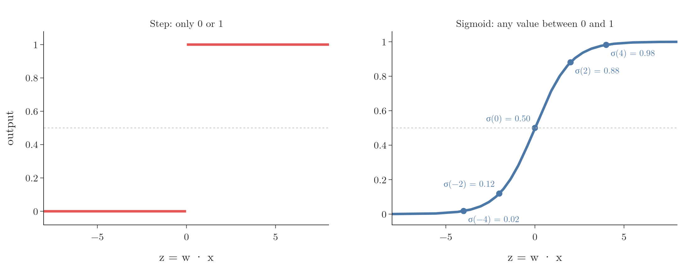
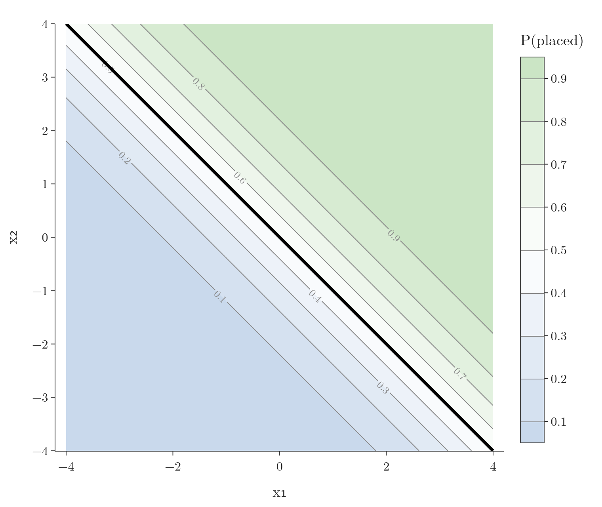
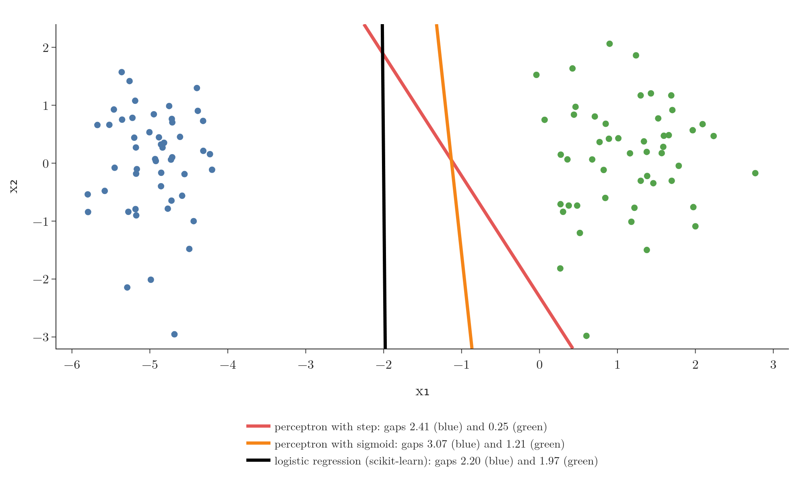

<!-- where-this-fits: generated by course_map/build_map.py; edit concepts.yaml, not this block -->
> **Where this fits:** Pipeline map step 8 (Model). See the [Course map](../../../00-course-map/00-course-map.md).
>
> 
>
> - **Builds on:** [Classification problems](../../../ML/01-foundations/ML-003-types-of-ml/ML-003-types-of-ml.md#1-overview); [Model-based learning](../../../ML/01-foundations/ML-006-instance-vs-model-based/ML-006-instance-vs-model-based.md#4-model-based-learning); [Gradient descent](../../../ML/06-regression/ML-056-gradient-descent/ML-056-gradient-descent.md#7-gradient-descent-as-a-class); [Polynomial features](../../../ML/06-regression/ML-060-polynomial-regression/ML-060-polynomial-regression.md#1-overview); [Perceptron trick](../../../ML/07-classification/ML-069-perceptron-trick/ML-069-perceptron-trick.md#5-the-perceptron-trick); [Log loss (binary cross entropy)](../../../ML/07-classification/ML-072-log-loss/ML-072-log-loss.md#62-the-loss-function).
> - **Leads to:** [Softmax regression](../../../ML/07-classification/ML-078-softmax-regression/ML-078-softmax-regression.md#1-overview); [Gradient boosting](../../../ML/08-trees-and-ensembles/ML-114-gradient-boosting-intuition/ML-114-gradient-boosting-intuition.md#13-gradient-boosting-compared-with-adaboost); [Multi-layer perceptron (MLP)](../../../DL/01-basics/DL-003-nn-types-history-applications/DL-003-nn-types-history-applications.md#21-multi-layer-perceptron-mlp); [Backpropagation](../../../DL/01-basics/DL-015-backpropagation-what/DL-015-backpropagation-what.md#4-the-steps-of-backpropagation); [Vanishing gradient](../../../DL/01-basics/DL-018-vanishing-exploding-gradients/DL-018-vanishing-exploding-gradients.md#3-the-vanishing-gradient-problem).
> - **Compare with:** [Support vector machines](../../../ML/07-classification/ML-086-svm-intuition/ML-086-svm-intuition.md#9-sources); [Tanh](../../../DL/02-training/DL-027-activation-functions/DL-027-activation-functions.md#7-tanh).
<!-- /where-this-fits -->

## 1. Overview

> **Key point:** The perceptron trick stops as soon as every point is correct. The fix: let every point act on the line, with strength depending on its distance. Replacing the step function with the sigmoid function does exactly this, and also turns the model's output into a probability.

The perceptron trick has a weakness, found when [the decision boundary stops too early](../ML-070-perceptron-code/ML-070-perceptron-code.md#6-the-weakness-the-decision-boundary-stops-too-early): once no point is misclassified, the line stops moving, wherever it happens to be. **Logistic regression** (G-1120) keeps improving the line after that.

This Note changes the perceptron's rule so that correctly classified points also take part. The change needs one new ingredient, the **sigmoid function** (G-1798), one of the most important functions in machine learning and deep learning.

## 2. The new idea: every point pushes or pulls

> **Key point:** Misclassified points pull the line towards themselves; correctly classified points push it away. The strength depends on how far the point is from the line.

### 2.1 Push and pull

> **Key point:** Old rule: only misclassified points act. New rule: all points act.

This is the **push and pull** (G-1592) idea. So far, only misclassified points acted: each one **pulled** the line towards itself. Correct points did nothing.

The new rule: correctly classified points **push** the line away from themselves. Then, even when every point is correct, the line keeps moving: points on both sides push it, and it keeps moving until the pushes balance. The aim is a line in the middle of the gap; Section 7 measures how close this rule gets.

### 2.2 How strongly

> **Key point:** Near correct points push hard, far ones gently. Near misclassified points pull gently, far ones hard.

The strength of each push or pull depends on the point's distance from the line:

| Point | Near the line | Far from the line |
|---|---|---|
| Correctly classified | strong push | weak push |
| Misclassified | weak pull | strong pull |

The table matches common sense. A correct point right next to the line is at risk, so it should push hard. A correct point far away is safe, so it hardly needs to act. A badly misclassified point, far on the wrong side, is a big error, so it should pull hard.

## 3. Why the step function cannot do this

> **Key point:** With the step function, ŷ is 0 or 1, so for every correct point y − ŷ = 0 and the update vanishes.

The [update rule](../ML-069-perceptron-trick/ML-069-perceptron-trick.md#73-one-update-rule) from the perceptron trick is

$$w_{\text{new}} = w_{\text{old}} + \eta\thinspace(y - \hat{y})\thinspace x$$

For a correctly classified point, $y$ and $\hat{y}$ are equal (both 0 or both 1), so $y - \hat{y} = 0$ and nothing changes. To let correct points act, $y - \hat{y}$ must not be 0.

$y$ is the true class from the data, so it cannot change. What can change is how the model produces $\hat{y}$. So far it computed $z = w \cdot x$, the weights multiplied by the features and added up. For weights $w = (-5, 0.5, 0.01)$ and a student $x = (1, 7.5, 110)$ (the leading 1 pairs with $w_0$):

$$z = (-5)(1) + (0.5)(7.5) + (0.01)(110)$$

$$z = -5 + 3.75 + 1.1 = -0.15$$

The model then passed it through a **step function** (G-1889): 1 if $z > 0$, otherwise 0. As long as $\hat{y}$ is only ever 0 or 1, the problem remains. We need a function whose output can be anything between 0 and 1.

Figure 1 shows the problem as a picture. With the step function, the update $y - \hat y$ is exactly 0 for every correctly placed point, near or far, and exactly $\pm 1$ for every misplaced one, however far it is from the line. The planned table of Section 2.2 needs a smooth curve instead.


## 4. The sigmoid function

> **Key point:** σ(z) = 1 / (1 + e^(−z)). The sigmoid squeezes any number into the range 0 to 1, with σ(0) = 0.5.

The **sigmoid function**, also called the **logistic function** (G-1119), is

$$\sigma(z) = \frac{1}{1 + e^{-z}}$$

{height=38%}

Its key properties (Figure 2, right):

- For a very large $z$, $e^{-z}$ is almost 0, so $\sigma(z)$ is almost 1.
- For a very negative $z$, $e^{-z}$ is huge, so $\sigma(z)$ is almost 0.
- At $z = 0$, $e^{0} = 1$, so

  $$\sigma(0) = \frac{1}{1 + 1} = 0.5$$


| $z$ | $-4$ | $-2$ | 0 | 2 | 4 |
|---|---|---|---|---|---|
| $\sigma(z)$ | 0.018 | 0.119 | 0.5 | 0.881 | 0.982 |

However large or small the input, the output always stays strictly between 0 and 1. The sigmoid never actually reaches 0 or 1. The S shape gives the function its name: "sigmoid" means S-shaped (Bishop §4.2).

## 5. Sigmoid as a probability

> **Key point:** σ(w · x) can be read as the probability that the point belongs to the positive class. The probability is 0.5 on the line and rises towards 1 further onto the positive side.

### 5.1 The new prediction

> **Key point:** Compute z = w · x as before, but pass it to the sigmoid instead of the step.

For a student with CGPA 7.5 and IQ 110, the model still computes the weighted sum

$$z = w_0 + w_1 \times 7.5 + w_2 \times 110$$

But now $\hat{y} = \sigma(z)$:

- $z > 0$ (positive side): $\hat{y} > 0.5$;
- $z < 0$ (negative side): $\hat{y} < 0.5$;
- $z = 0$ (on the line): $\hat{y} = 0.5$.

To make a yes-or-no prediction, we predict "placed" when $\hat{y} \geq 0.5$, which is the same decision as before.

### 5.2 One feature: an S-curve through the data

> **Key point:** With one feature, the model is the S-curve itself. $w_0$ shifts the curve left or right and $w_1$ sets how steep it is.

Start with one feature only. Figure 3 plots 100 students by CGPA: each dot sits at 1 if the student was placed and at 0 if not. Low CGPAs are almost all at 0, high CGPAs almost all at 1, and the two groups overlap around CGPA 6.

The model is the S-curve

$$\hat y = \sigma(w_0 + w_1 \times \text{CGPA})$$

drawn through these dots. Watch the two weights do different jobs:

- **$w_0$ shifts the curve.** The curve crosses 0.5 where the weighted sum is 0, that is at

  $$\text{CGPA} = -\frac{w_0}{w_1}$$

   With $w_1 = 1$, moving $w_0$ from $-4.5$ to $-6.01$ moves the crossing from CGPA 4.5 to 6.01.
- **$w_1$ sets the steepness.** A larger $w_1$ makes the probability climb from near 0 to near 1 over a narrower range of CGPA.

The last frame is the curve that logistic regression fits to this data: $w_0 = -39.26$, $w_1 = 6.53$. To predict, read the curve: a student with CGPA 6.5 has

$$z = -39.26 + 6.53 \times 6.5 = 3.19$$

$$\sigma(3.19) = 0.96$$

a 96% chance of being placed. The crossing at CGPA 6.01 is the **decision boundary** (G-555): above it the model predicts placed, below it not placed.


### 5.3 A map of probabilities

> **Key point:** Lines parallel to the decision boundary have equal probability; the probability changes gradually across the plane.

With two features the crossing point becomes the line on which $w \cdot x$ is 0, and the S-curve becomes a surface that rises across it. Figure 4 draws this surface for the line $x_1 + x_2 = 0$. The function is $P(x_1, x_2) = \sigma(x_1 + x_2)$, so $P(0, 0) = 0.5$ and $P(2, 1) = \sigma(3) = 0.95$. Its surface is a ramp with an S-shaped cross-section: flat and low (near 0) on one side of the line, flat and high (near 1) on the other, and steepest on the line, where the height is exactly 0.5 (left panel). Thin lines on the surface join points of the same height.

The right panel is the same surface seen from above, a [contour map](../../../MA/06-calculus/MA-062-partial-derivatives-and-gradients/MA-062-partial-derivatives-and-gradients.md#11-reading-a-contour-map): the plane coloured by $\sigma(x_1 + x_2)$, with each line joining points of equal probability. Lines close together mean a steep part of the ramp, and the thick black line, where $P = 0.5$, is the line $x_1 + x_2 = 0$ itself.

{height=40%}

- On the line itself, $\sigma = 0.5$: a 50% chance of being placed.
- Moving onto the positive side, the value rises through 0.6, 0.7, 0.8 and 0.9, along lines parallel to the boundary. Far away it approaches 1.
- On the negative side it falls towards 0.

So instead of a hard yes or no, every student now gets a **probability of being placed**: the further onto the positive side, the higher the chance. The probability of **not** being placed is $1 - \hat{y}$. A student with $\hat{y} = 0.7$ has a 70% chance of being placed and a 30% chance of not.

This **probabilistic interpretation** (G-1566) is the second view of logistic regression mentioned in the [perceptron trick](../ML-069-perceptron-trick/ML-069-perceptron-trick.md#1-overview), and [log loss](../ML-072-log-loss/ML-072-log-loss.md#1-overview) builds on it.

> **Extra:** What does the number $z = w \cdot x$ itself mean? The **odds** (G-1376) of an event are its probability divided by the probability of the opposite: $p / (1 - p)$. A 0.75 chance of being placed is odds of
> $$\frac{0.75}{0.25} = 3$$
> "3 to 1". The **log-odds** (G-1116) are the natural log of the odds. Solving $p = \sigma(z)$ for $z$ gives
>
> $$z = \ln\frac{p}{1 - p}$$
>
> so $z$ is exactly the log-odds of the positive class.
>
> | Probability $p$ | Odds $p / (1 - p)$ | Log-odds $z$ |
> |---|---|---|
> | 0.5 | 1 | 0 |
> | 0.731 | 2.72 | 1 |
> | 0.881 | 7.39 | 2 |
> | 0.953 | 20.1 | 3 |
>
> Figure 5 draws the fitted CGPA model both ways. As a probability it is an S-curve. As log-odds it is the straight line $w_0 + w_1 \times \text{CGPA}$. So logistic regression is a linear model for the log-odds: $w_1 = 6.53$ means each extra CGPA point adds 6.53 to the log-odds of being placed, and $w_0$ is the log-odds at CGPA 0. The decision boundary is where the log-odds are 0, that is where the odds are 1 to 1 (StatQuest, "Logistic Regression Details Pt1: Coefficients"). Log-odds return in [gradient boosting for classification](../../08-trees-and-ensembles/ML-116-gradient-boosting-classification/ML-116-gradient-boosting-classification.md#4-stage-1-the-log-odds-of-class-1).
>
> 

## 6. The new update in action

> **Key point:** With ŷ = σ(z), y − ŷ is never exactly 0, so every point moves the line, by an amount that depends on its distance.

### 6.1 Four points

> **Key point:** Correct points give small values of y − ŷ that push; misclassified points give large values that pull.

Take four points and suppose the model gives these probabilities:

| Point | True $y$ | Side of the line | $\hat{y} = \sigma(z)$ | $y - \hat{y}$ | Effect |
|---|---|---|---|---|---|
| A | 1 | positive (correct) | 0.80 | $+0.20$ | small push |
| B | 0 | negative (correct) | 0.30 | $-0.30$ | push |
| C | 1 | negative (wrong) | 0.30 | $+0.70$ | strong pull |
| D | 0 | positive (wrong) | 0.65 | $-0.65$ | strong pull |

None of the values is 0, so every point updates the weights.

- **A**: the update is $\eta\thinspace(y - \hat y)\thinspace x$ with

  $$y - \hat y = 1 - 0.80 = 0.20$$

  so $w$ grows by $0.20\thinspace\eta\thinspace x$. As in the [perceptron trick](../ML-069-perceptron-trick/ML-069-perceptron-trick.md#6-moving-the-line-towards-a-point), adding $x$ moves a positive point further onto the positive side: the line moves away from it, a push.
- **C**:

  $$y - \hat y = 1 - 0.30 = 0.70$$

  so $w$ grows by $0.70\thinspace\eta\thinspace x$: the same direction but much larger. C sits on the wrong side, so moving it towards the positive side means moving the line towards C, a pull.
- **B** and **D** work the same way with subtraction.

### 6.2 Strength and distance

> **Key point:** y − σ(z) is large for points deep on the wrong side and small for points deep on the correct side.

Figure 6 draws $y - \sigma(z)$ against $z$, the point's signed position relative to the line.

{height=42%}

For a positive point (green, $y = 1$):

- deep on the wrong side ($z = -4$, where $\sigma = 0.018$): $y - \sigma(z)$ is 0.98, a strong pull;
- on the line ($z = 0$, where $\sigma = 0.5$): $y - \sigma(z)$ is 0.5;
- deep on the correct side ($z = 4$, where $\sigma = 0.982$): $y - \sigma(z)$ is 0.018, a very weak push.

For a correct point, the push is strongest when it is just on the correct side, near the line, and fades as it gets further away. The negative points (blue) mirror this. The curve shows exactly the behaviour planned in the table of Section 2.2.

Figure 7 shows the pushes on data. It starts where the step perceptron of the [perceptron trick](../ML-069-perceptron-trick/ML-069-perceptron-trick.md#5-the-perceptron-trick) stopped on its 24 students: every student is correct, but the line is only 0.14 away from the nearest one. Now the sigmoid rule runs, with learning rate 0.5. Each frame picks one student (red ring) and the arrow shows the push on the line; its length is $|y - \hat y|$. Watch the arrow lengths: at pick 1 the student is 0.16 from the line and pushes with strength 0.45; at pick 6 the student is 1.98 away and pushes with only 0.03. Every pick moves the line a little, and after 40 picks the smallest distance to a student has grown from 0.14 to 0.54.


All 40 picks are pushes, because every student is already on the correct side. The pull on a misclassified student is the perceptron trick's own move, animated in [moving the line towards a point](../ML-069-perceptron-trick/ML-069-perceptron-trick.md#6-moving-the-line-towards-a-point).

## 7. Does it help?

> **Key point:** The sigmoid version places the line better than the step version, but still not as evenly as logistic regression.

> **Python:** The perceptron with a sigmoid.
>
> ```python
> def sigmoid(z):
>     return 1 / (1 + np.exp(-z))
>
> def perceptron(X, y, lr=0.1, loops=1000, seed=0):
>     rng = np.random.default_rng(seed)
>     X = np.insert(X, 0, 1, axis=1)
>     w = np.ones(X.shape[1])
>     for _ in range(loops):
>         j = rng.integers(0, X.shape[0])
>         y_hat = sigmoid(X[j] @ w)            # was: step(X[j] @ w)
>         w = w + lr * (y[j] - y_hat) * X[j]
>     return w
> ```

Figure 8 compares three lines on data with a wide gap between the classes (`make_classification` with `class_sep=30`):

{height=50%}

| Model | Gap to the blue class | Gap to the green class |
|---|---|---|
| Perceptron with step | 2.41 | 0.25 |
| Perceptron with sigmoid | 3.07 | 1.21 |
| Logistic regression (scikit-learn) | 2.20 | 1.97 |

Figure 9 trains both perceptrons side by side on the same random sequence of points. The step perceptron makes its last change at the 44th point; after that every point is correct and the line freezes close to the green class. The sigmoid line keeps moving, because every point still sends an update, and it drifts away from the green points.


The step version stops right next to the green class. The sigmoid version moves well away from it, a clear improvement. But it is still not centred, while scikit-learn's logistic regression keeps a nearly equal gap on both sides.

So the change was in the right direction. Why is the sigmoid line still off-centre? The line is not finished yet. Run longer, the sigmoid perceptron keeps moving towards the logistic regression line, and with the small penalty that scikit-learn adds by default it lands on that line (details in the Extra below). In fact the sigmoid update is already the gradient descent step of logistic regression (Bishop §4.3.2), as the [gradient descent](../ML-074-logistic-gradient-descent/ML-074-logistic-gradient-descent.md#6-the-update-rule) will show.

What we still lack is a way to say which line is best: a **loss function** (G-706), one number that measures how good a line is. With a loss function, we know what the updates are minimising and when to stop. The loss function for logistic regression is [log loss](../ML-072-log-loss/ML-072-log-loss.md#62-the-loss-function).

> **Extra:** The test, in the notebook. Gaps (blue, green) of the sigmoid perceptron:
>
> | Loops | No penalty | With scikit-learn's default penalty |
> |---|---|---|
> | 1,000 | 3.07, 1.21 | 2.64, 1.57 |
> | 100,000 | 2.61, 1.62 | 2.19, 1.93 |
> | 1,000,000 | 2.48, 1.76 | 2.18, 2.00 |
>
> scikit-learn's line has gaps 2.20 and 1.97. Without a penalty, the line keeps drifting slowly: on separable data such as this, the loss that logistic regression minimises ([log loss](../ML-072-log-loss/ML-072-log-loss.md#62-the-loss-function)) has no finite best line, and the weights grow for ever (Bishop §4.3.2). The penalty fixes that and gives one definite answer.

## 8. Summary

- Fix for the perceptron: every point acts; correct points push, misclassified points pull, with strength depending on distance, so the line keeps moving after every point is correct and drifts away from the nearest points.
- With the step function, $y - \hat{y} = 0$ for correct points, so they cannot act, because $\hat{y}$ is only ever 0 or 1.
- The sigmoid maps any $z$ into the range between 0 and 1 (not reaching either), with $\sigma(0) = 0.5$; its formula is in Section 4. So $y - \hat{y}$ is never exactly 0.
- $\sigma(w \cdot x)$ is the probability of the positive class: 0.5 on the line, near 1 deep on the positive side, so every student gets a chance of being placed instead of a hard yes or no.
- Using $\hat{y} = \sigma(z)$ in the update lets every point act and improves the line (gap to the green class 1.21 against 0.25), but not yet to logistic regression's quality, because nothing yet says which line is best; that needs a loss function, [log loss](../ML-072-log-loss/ML-072-log-loss.md#62-the-loss-function).

## 9. Sources

**Built from**

- CampusX, "Logistic Regression Part 3 | Sigmoid Function | 100 Days of ML", YouTube, https://www.youtube.com/watch?v=ehO0-6i9qD4
- StatQuest with Josh Starmer, "StatQuest: Logistic Regression", YouTube, https://www.youtube.com/watch?v=yIYKR4sgzI8. The one-feature S-curve through 0/1 data (Figure 3), redrawn on the placement data.
- StatQuest with Josh Starmer, "Logistic Regression Details Pt1: Coefficients", YouTube, https://www.youtube.com/watch?v=vN5cNN2-HWE. The log-odds view of the weights (Section 5.3, Extra).

**Other references**

- **Bishop:** Bishop, C. M. *Pattern Recognition and Machine Learning*. Springer, 2006. Section 4.2, p. 197 (the logistic sigmoid; "sigmoid" means S-shaped); Section 4.3.2, pp. 205–207 (logistic regression gradient; separable data).

## 10. Key terms

| Term | Meaning |
|---|---|
| Sigmoid function | An S-shaped function that squashes any number into the range 0 to 1, $\sigma(z) = 1/(1 + e^{-z})$; it turns a score into a probability, as in logistic regression. |
| Logistic function | Another name for the sigmoid, $1/(1 + e^{-z})$: the S-shaped function that squashes any number into a value between 0 and 1, read as a probability. |
| Probabilistic interpretation | Reading the model's output as the probability of the positive class |
| Decision boundary | Where the model's prediction switches class: here, where $w \cdot x = 0$ and the probability is 0.5 |
| Odds | The probability of an event divided by the probability of the opposite, $p / (1 - p)$ |
| Log-odds | The natural log of the odds; equal to $z = w \cdot x$ in logistic regression |
| Push and pull | Moving the line away from a correctly classified point, or towards a misclassified one |
