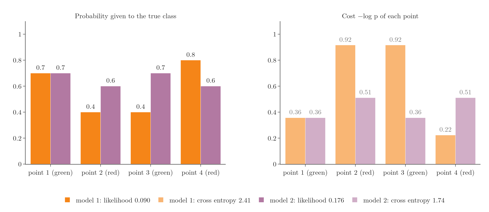
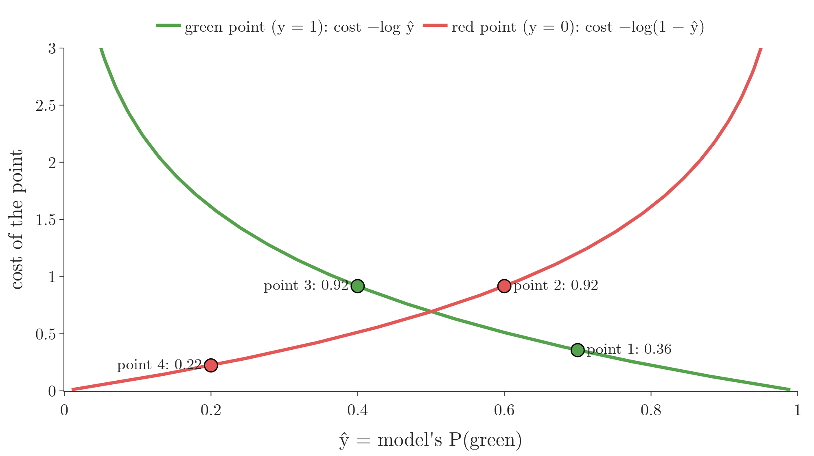

<!-- where-this-fits: generated by course_map/build_map.py; edit concepts.yaml, not this block -->
> **Where this fits:** Pipeline map step 8 (Model). See the [Course map](../../../00-course-map/00-course-map.md).
>
> 
>
> - **Builds on:** [Classification problems](../../../ML/01-foundations/ML-003-types-of-ml/ML-003-types-of-ml.md#1-overview); [Model-based learning](../../../ML/01-foundations/ML-006-instance-vs-model-based/ML-006-instance-vs-model-based.md#4-model-based-learning); [Gradient descent](../../../ML/06-regression/ML-056-gradient-descent/ML-056-gradient-descent.md#7-gradient-descent-as-a-class); [Polynomial features](../../../ML/06-regression/ML-060-polynomial-regression/ML-060-polynomial-regression.md#1-overview); [Perceptron trick](../../../ML/07-classification/ML-069-perceptron-trick/ML-069-perceptron-trick.md#5-the-perceptron-trick); [Sigmoid function](../../../ML/07-classification/ML-071-sigmoid-function/ML-071-sigmoid-function.md#4-the-sigmoid-function).
> - **Used here, taught in full later:** [Perceptron](../../../DL/01-basics/DL-004-perceptron/DL-004-perceptron.md#3-the-parts-of-a-perceptron); [Loss functions in deep learning](../../../DL/01-basics/DL-014-dl-loss-functions/DL-014-dl-loss-functions.md#1-overview).
> - **Leads to:** [Softmax regression](../../../ML/07-classification/ML-078-softmax-regression/ML-078-softmax-regression.md#1-overview); [Gradient boosting](../../../ML/08-trees-and-ensembles/ML-114-gradient-boosting-intuition/ML-114-gradient-boosting-intuition.md#13-gradient-boosting-compared-with-adaboost); [Cost-sensitive learning](../../../ML/09-clustering-and-more/ML-127-imbalanced-data/ML-127-imbalanced-data.md#9-cost-sensitive-learning); [ANN for classification](../../../DL/01-basics/DL-011-customer-churn-ann/DL-011-customer-churn-ann.md#1-overview).
> - **Compare with:** [Support vector machines](../../../ML/07-classification/ML-086-svm-intuition/ML-086-svm-intuition.md#1-overview); [Hinge loss and soft margin](../../../ML/07-classification/ML-088-svm-soft-margin/ML-088-svm-soft-margin.md#8-why-soft-margin); [Entropy, information gain and Gini](../../../ML/08-trees-and-ensembles/ML-091-decision-trees-intuition/ML-091-decision-trees-intuition.md#6-entropy).
<!-- /where-this-fits -->

## 1. Overview

> **Key point:** To find the best decision boundary, we need a loss function: one number that says how good a boundary is. For logistic regression it comes from maximum likelihood, and it is called binary cross entropy or log loss.

The sigmoid perceptron of the [previous lesson](../ML-071-sigmoid-function/ML-071-sigmoid-function.md#7-does-it-help) improved the **decision boundary** (G-555): the line where the model's probability is exactly 0.5, with one class predicted on each side. But we still had no way to say which decision boundary is **best**, or when to stop nudging. Both perceptron versions pick random points and nudge the decision boundary, without a number that measures how good the line is.

Machine learning normally works differently, as in linear regression:

1. Define a **loss function** (G-706): a formula that measures how wrong a model is.
2. Find the coefficients where the loss is smallest, with a formula or with gradient descent.

This Note builds the loss function for **logistic regression** (G-1120). The next lessons minimise it with [gradient descent](../ML-074-logistic-gradient-descent/ML-074-logistic-gradient-descent.md#6-the-update-rule).

## 2. Comparing two models

> **Key point:** When one model misclassifies points and the other does not, the better one is obvious. When both are perfect, or both make mistakes, we need a number.

Imagine four points, two green and two red, and two candidate decision boundaries. If model 1 misclassifies points and model 2 separates them perfectly, model 2 is clearly better.

But when two models both classify everything correctly, or both make one mistake, it is not obvious which is better. A loss function settles this: it gives each model a number, and the model with the better number wins.

{height=45%}

In Figure 1, watch the two crosses: model 1's decision boundary leaves points 2 and 3 on the wrong side, while model 2's separates all four.

## 3. Maximum likelihood

> **Key point:** For each point, take the probability the model gave to its true class. Multiply these over all points. The model with the larger product is better.

### 3.1 The probability of the true class

> **Key point:** For a green point use P(green) = ŷ; for a red point use P(red) = 1 − ŷ.

Each point is one **observation** (G-1374) (one record, a row of the data table). Its position is given by its **features** (G-772) (the input values, such as the two coordinates), and its colour is the **target** (G-1949) (the output we predict). The sigmoid turns every point's position into a probability: $\hat{y} = \sigma(w \cdot x)$ is the probability of green (the positive class), and $1 - \hat{y}$ is the probability of red.

For each point we take the probability the model gives to the colour the point **really** has. Suppose the two models give these values:

| Point | True colour | Model 1: P(true colour) | Model 2: P(true colour) |
|---|---|---|---|
| 1 | green | 0.7 | 0.7 |
| 2 | red | 0.4 | 0.6 |
| 3 | green | 0.4 | 0.7 |
| 4 | red | 0.8 | 0.6 |

A value above 0.5 means the point is on its correct side; below 0.5, on the wrong side. Model 1 misclassifies points 2 and 3.

### 3.2 Multiply

> **Key point:** The product is the likelihood: how probable the model finds the data we actually see.

Treating the points as independent, the probability that the model produces exactly these colours is the product of the four values. This product is the **likelihood** (G-1086):

- Model 1:

  $$0.7 \times 0.4 \times 0.4 \times 0.8 = 0.090$$

- Model 2:

  $$0.7 \times 0.6 \times 0.7 \times 0.6 = 0.176$$


Model 2 has the higher likelihood, so it is the better model. **Maximum likelihood estimation** (G-1191) means choosing the coefficients that make this product as large as possible.

{height=52%}

In Figure 2, the left bars are the four factors of each product: model 1 has two factors of 0.4 where model 2 has 0.6 and 0.7, so model 1's product is the smaller one.

## 4. From products to sums: the log

> **Key point:** Multiplying thousands of numbers below 1 gives a number too small for a computer. Taking logs turns the product into a sum, which is safe.

### 4.1 The problem with products

> **Key point:** 10,000 probabilities of 0.7 multiply to about 10⁻¹⁵⁴⁹.

With 4 points the product is already only 0.09. A real dataset may have 10,000 observations. If each point got probability 0.7, the product would be 0.7 multiplied by itself 10,000 times:

$$0.7^{10{,}000} = 10^{10{,}000 \times \log_{10} 0.7}$$

$$= 10^{10{,}000 \times (-0.1549)}$$

$$\approx 10^{-1549}$$

Such a number is far below the smallest number a standard float can store (about $10^{-308}$). The product **underflows** (G-2036): the computer stores the tiniest float it has ($5 \times 10^{-324}$) or 0 instead of the true value, whatever the model, and can no longer tell two models apart.

An everyday picture: halve a sheet of paper again and again. After a few dozen cuts the piece is too small to see, and every model's product ends up as the same invisible scrap.

### 4.2 Taking logs

> **Key point:** log(a × b) = log a + log b, so the log of the product is the sum of the logs.

The logarithm turns multiplication into addition:

$$\log(a \times b) = \log a + \log b$$

So instead of the likelihood, we compute its log, the **log-likelihood** (G-1113). The **log** of a number $a$ is the power to which a fixed base must be raised to give $a$ (see [why we take the log](../../../MA/08-likelihood/MA-070-maximum-likelihood-estimation/MA-070-maximum-likelihood-estimation.md#8-why-we-take-the-log)); for example $\log 1 = 0$, and the log of a number below 1 is negative. Every log in this Note is the natural log (base $e = 2.718$), which is what `np.log` computes; any other base gives different numbers but the same best model.

$$\log(0.7 \times 0.4 \times 0.4 \times 0.8)$$

$$= \log 0.7 + \log 0.4 + \log 0.4 + \log 0.8$$

$$= -0.357 - 0.916 - 0.916 - 0.223$$

$$= -2.41$$

For 10,000 points of 0.7 the sum is simply an ordinary number:

$$10{,}000 \times \log 0.7 = -3{,}567$$

Since log grows whenever its input grows, the model with the larger likelihood also has the larger log-likelihood: the comparison is unchanged.

### 4.3 Changing the sign

> **Key point:** Logs of numbers below 1 are negative. Putting a minus sign in front gives a positive number to minimise: the cross entropy.

Every probability is between 0 and 1, and the log of such a number is negative. So the log-likelihood is always negative. Putting a minus sign in front makes it positive:

| Model | Likelihood | Log-likelihood | Cross entropy |
|---|---|---|---|
| 1 | 0.090 | $-2.41$ | 2.41 |
| 2 | 0.176 | $-1.74$ | 1.74 |

This negative log-likelihood is the **cross entropy** (G-505). Because of the sign change, the direction flips too: we **maximise** the likelihood but **minimise** the cross entropy. The better model, model 2, has the smaller cross entropy.

{width=100%}

Figure 3 lays out the whole chain for model 1, with the number at each step.

## 5. The cost of one point

> **Key point:** Each point costs −log p. A confident correct prediction costs almost nothing; a confident wrong one costs a lot.

The cross entropy is a sum of one cost per point, $-\log p$, where $p$ is the probability given to the true class. Figure 4 shows how this cost behaves.

{height=40%}

- $p = 0.9$ (confident and correct): cost 0.11.
- $p = 0.7$: cost 0.36.
- $p = 0.4$ (on the wrong side): cost 0.92.
- $p = 0.1$ (confident and wrong): cost 2.30, and it grows without limit as $p$ approaches 0.

So the loss punishes confident mistakes very heavily, and keeps rewarding the model a little for making correct points even more certain. The second effect matters for points close to the decision boundary: a correct point with $p = 0.6$ still costs 0.51, so lowering the loss means moving the decision boundary further away from it.

### 5.1 Why not the squared error?

> **Key point:** For a badly wrong prediction, the log loss curve is far steeper than the squared error curve, so the model gets a much stronger push to correct itself.

Linear regression used the squared error, so a natural question is why logistic regression does not. For one point, the squared error would be $(1 - p)^2$: the gap between the probability given to the true class and 1, squared.

Figure 5 slides one point from a good prediction to a bad one and draws both costs. Watch the two black **tangent lines** (G-1945; a straight line that touches a curve at one point and has the curve's slope there): the steepness of each tangent is the slope of that cost.


| p | Log loss: cost | Log loss: slope $-1/p$ | Squared error: cost | Squared error: slope $-2(1 - p)$ |
|---|---|---|---|---|
| 0.9 | 0.11 | $-1.1$ | 0.01 | $-0.2$ |
| 0.5 | 0.69 | $-2.0$ | 0.25 | $-1.0$ |
| 0.1 | 2.30 | $-10.0$ | 0.81 | $-1.8$ |
| 0.03 | 3.51 | $-33.3$ | 0.94 | $-1.9$ |

Gradient descent (section 7) takes steps whose size depends on the slope of the loss. With the squared error, a terrible prediction ($p = 0.03$) gives almost the same slope as a mediocre one ($p = 0.1$). With log loss, the worse the prediction, the steeper the slope, so the worst mistakes are corrected with the largest steps.

> **Extra:** On perfectly separable data, gradient descent on this loss slowly turns the decision boundary towards the one with the widest gap (Soudry et al. 2018).

## 6. One formula for both classes

> **Key point:** L = −(1/n) Σ [ y log ŷ + (1 − y) log(1 − ŷ) ]. For each point, the y factors switch on the correct term.

### 6.1 Choosing the right probability automatically

> **Key point:** −[y log ŷ + (1 − y) log(1 − ŷ)] equals −log ŷ for green points and −log(1 − ŷ) for red points.

The cost of a point uses $\hat{y}$ if the point is green and $1 - \hat{y}$ if it is red. Writing it as $-\log \hat{y}$ for every point would be wrong for the red ones. One expression handles both cases:

$$\text{cost of point } i = -\left[y_i \log \hat y_i + (1 - y_i)\log(1 - \hat y_i)\right]$$

- **Green point** ($y_i = 1$): the second term is multiplied by 0 and vanishes, leaving $-\log \hat y_i$.
- **Red point** ($y_i = 0$): the first term vanishes, leaving $-\log(1 - \hat y_i)$.

{height=42%}

In Figure 6, watch where the curves rise: a green point is expensive when $\hat y$ is near 0, a red point when $\hat y$ is near 1, so each point is punished only for leaning towards the wrong colour.

With numbers, for model 1: point 2 is red with $\hat{y} = 0.6$, so its cost is:

$$-\log(1 - 0.6) = -\log 0.4 = 0.92$$

Point 3 is green with $\hat{y} = 0.4$, so its cost is:

$$-\log 0.4 = 0.92$$

### 6.2 The loss function

> **Key point:** Average the costs over all n points.

Summing over all points and dividing by $n$ to get an average gives the loss function of logistic regression. The symbol $\sum_{i=1}^{n}$ means: add the term for $i = 1$, then $i = 2$, and so on up to $i = n$. For model 1 ($n = 4$) the four terms are the costs of the four points:

$$0.357 + 0.916 + 0.916 + 0.223 = 2.41$$

The loss function is then:

$$L = -\frac{1}{n}\sum_{i=1}^{n}\left[y_i \log \hat y_i + (1 - y_i)\log(1 - \hat y_i)\right]$$

with the prediction

$$\hat y_i = \sigma(w \cdot x_i)$$

This loss is called **binary cross entropy** or **log loss** (G-303). For model 1 it is:

$$\frac{2.41}{4} = 0.603$$

> **Python:** Log loss by hand and in scikit-learn.
>
> ```python
> from sklearn.metrics import log_loss
>
> y = np.array([1, 0, 1, 0])                # green = 1, red = 0
> y_hat = np.array([0.7, 0.6, 0.4, 0.2])    # model 1's P(green)
>
> -np.mean(y * np.log(y_hat) + (1 - y) * np.log(1 - y_hat))   # 0.6031
> log_loss(y, y_hat)                                           # 0.6031
> ```

## 7. Minimising the loss

> **Key point:** There is no formula for the best w, so logistic regression is trained with gradient descent.

The task is now precise: find the coefficients $w$ that make $L$ as small as possible. For linear regression's squared error, setting the derivative to zero gave a formula (OLS). For log loss there is no such **closed-form solution** (G-398), a formula that gives the answer in one step, because $w$ sits inside the sigmoid and the logs (Bishop §4.3.3).

### 7.1 The search in a picture

> **Key point:** Try a curve, score it with the log loss, change the curve a little so that the score improves, and repeat until the score stops falling.

Without a formula, the best model has to be searched for. Figure 7 shows the search on one feature: the CGPA of 30 students and whether each was placed. A candidate model is an S-shaped sigmoid curve giving P(placed) for every CGPA.


Step by step, in Figure 7:

1. **Curve 1** slopes the wrong way: it gives high-CGPA students a low probability of being placed. The red bars are long, and the log loss is 1.190.
2. **Curve 5** slopes the right way but is nearly flat. Every student gets a probability near 0.5, so the bars are still long: log loss 0.444.
3. **Curve 11** is steeper. Most bars are short: log loss 0.218.
4. **Curve 28** is the last one. The only long bars belong to the four students between CGPA 6.0 and 6.1, where placed and not-placed students overlap, and no curve can make all four short. The log loss is 0.138 and no longer falls.

The curve with the smallest log loss is the maximum likelihood model of section 3.

### 7.2 Gradient descent

> **Key point:** Gradient descent decides how to change the curve at each try: it steps in the direction in which the loss falls fastest.

The method that chooses each next curve is **gradient descent** (G-862): compute the derivative of $L$ with respect to $w$ and step downhill repeatedly. Figure 8 runs it on the four points of section 2.

{height=80%}

In Figure 8, watch the loss pass model 2's value by step 3 and keep falling while the decision boundary turns to put all four points on their correct side. On these four perfectly separable points the loss keeps shrinking towards 0: every point's probability can still be pushed closer to 1 (where the decision boundary heads meanwhile is the Extra of section 5.1). The [next lesson](../ML-073-sigmoid-derivative/ML-073-sigmoid-derivative.md#1-overview) works out the derivative of the sigmoid, and the [one after](../ML-074-logistic-gradient-descent/ML-074-logistic-gradient-descent.md#5-the-gradient) derives the gradient and codes logistic regression from scratch.

## 8. Summary

| Step | Result for model 1 |
|---|---|
| Probability of each point's true class | 0.7, 0.4, 0.4, 0.8 |
| Multiply: likelihood (maximise) | 0.090 |
| Take logs: log-likelihood | $-2.41$ |
| Change sign: cross entropy (minimise) | 2.41 |
| Divide by n: log loss | 0.603 |

- The perceptron versions had no measure of "best"; a loss function provides one, so two boundaries that both classify every point correctly can still be compared and training knows what to minimise.
- Maximum likelihood: choose the model that gives the observed classes the highest probability, so the better model is the one with the larger product (0.176 against 0.090).
- Logs avoid tiny products, because a product of thousands of probabilities underflows and every model then looks the same; the minus sign gives a positive loss to minimise.
- Compared with the squared error, log loss has a much steeper slope for badly wrong predictions, so they are corrected with larger steps.
- Log loss is the average cost over the points; it has no closed-form minimum, because $w$ sits inside the sigmoid and the logs, so logistic regression is trained with gradient descent.
- So log loss is the one number that says which decision boundary is best, which the perceptron trick lacked.

## 9. Sources

**Built from**

- CampusX, "Logistic Regression Part 4 | Loss Function | Maximum Likelihood | Binary Cross Entropy", YouTube, https://www.youtube.com/watch?v=6bXOo0sxY5c
- StatQuest with Josh Starmer, "Logistic Regression Details Pt 2: Maximum Likelihood", YouTube, https://www.youtube.com/watch?v=BfKanl1aSG0
- StatQuest with Josh Starmer, "Neural Networks Part 6: Cross Entropy", YouTube, https://www.youtube.com/watch?v=6ArSys5qHAU

**Other references**

- **Bishop:** Bishop, C. M. *Pattern Recognition and Machine Learning*. Springer, 2006. Section 4.3.3, p. 207.
- **Soudry et al. 2018:** Soudry, D., Hoffer, E., Nacson, M. S., Gunasekar, S. and Srebro, N. "The Implicit Bias of Gradient Descent on Separable Data." *Journal of Machine Learning Research* 19(70), 1–57, 2018.

## 10. Key terms

| Term | Meaning |
|---|---|
| Decision boundary | The line (or surface) where the model's probability is exactly 0.5; one class is predicted on each side |
| Loss function (G-706) | A formula that measures how wrong a model's predictions are |
| Likelihood | The product, over all points, of the probabilities the model gives to their true classes |
| Maximum likelihood estimation (MLE) | Choosing the parameters that make the likelihood as large as possible |
| Log-likelihood | The logarithm of the likelihood, which turns the product of probabilities into a sum of log probabilities; it peaks at the same parameters as the likelihood and is easier to compute and maximise. |
| Cross entropy | A loss for classifiers that grows when the model gives a low probability to the true class. It is the negative log-likelihood, so minimising it maximises the likelihood; smaller is better. |
| Binary cross entropy (log loss) | The average cross entropy for two classes, the loss function of logistic regression |
| Underflow | A number too close to 0 for the computer to store, which then becomes 0 or loses precision |
