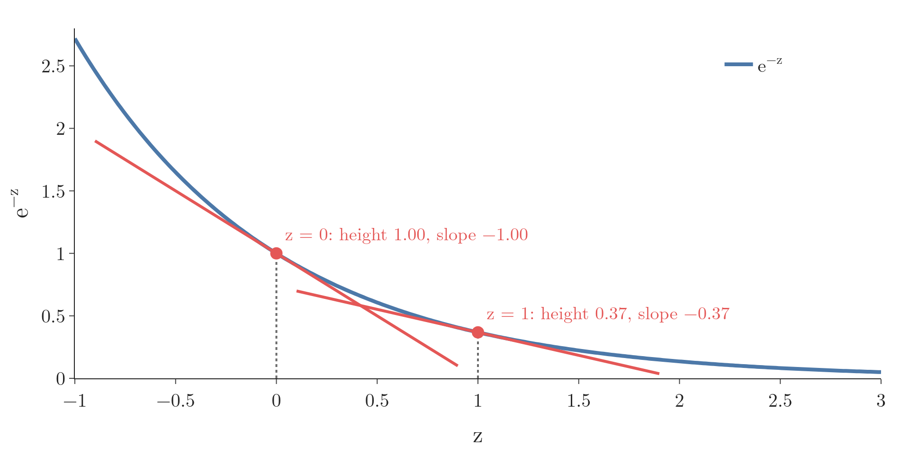
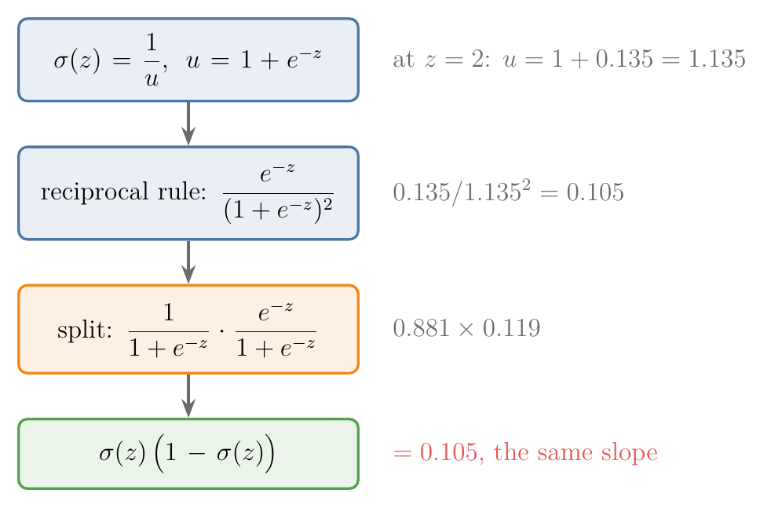
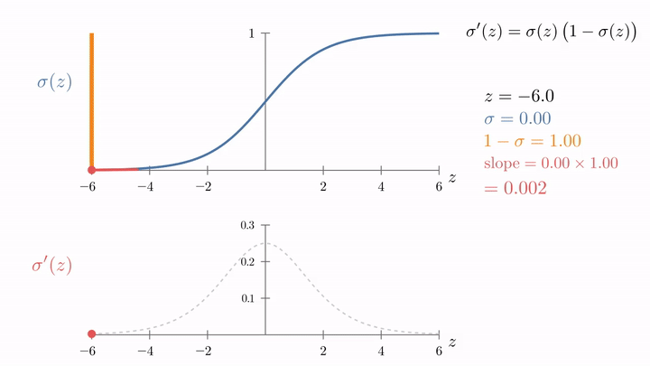

<!-- where-this-fits: generated by course_map/build_map.py; edit concepts.yaml, not this block -->
> **Where this fits:** Pipeline map step 8 (Model). See the [Course map](../../../00-course-map/00-course-map.md).
>
> 
>
> - **Builds on:** Activation functions ([Note DL-027](../../../DL/02-training/DL-027-activation-functions/DL-027-activation-functions.md)).
> - **Leads to:** Logistic regression ([Note ML-074](../../../ML/07-classification/ML-074-logistic-gradient-descent/ML-074-logistic-gradient-descent.md)); Gradient boosting ([Note ML-114](../../../ML/08-trees-and-ensembles/ML-114-gradient-boosting-intuition/ML-114-gradient-boosting-intuition.md)); Multi-layer perceptron (MLP) ([Note DL-003](../../../DL/01-basics/DL-003-nn-types-history-applications/DL-003-nn-types-history-applications.md)); Backpropagation ([Note DL-015](../../../DL/01-basics/DL-015-backpropagation-what/DL-015-backpropagation-what.md)); Vanishing gradient ([Note DL-018](../../../DL/01-basics/DL-018-vanishing-exploding-gradients/DL-018-vanishing-exploding-gradients.md)).
> - **Compare with:** Tanh ([Note DL-027](../../../DL/02-training/DL-027-activation-functions/DL-027-activation-functions.md)).
<!-- /where-this-fits -->

## 1. Overview

> **Key point:** The slope of the S-curve is steepest in the middle and nearly flat at both ends. Its exact value comes from the curve's own height: slope = height × (1 − height).

**Gradient descent** (G-862) on the **log loss** (G-303) (the next Note) needs the **derivative** (G-595) of the **sigmoid function** (G-1798). The derivative is the slope of the curve: how fast its output changes when its input $z$ changes a little. The same derivative appears again in neural networks, where a neuron can use the sigmoid to produce its output. This short Note derives it once.

In plain words, the answer is easy to picture. The sigmoid is an S-shaped curve: flat on the far left, steep in the middle, flat again on the far right. So its slope is close to 0 at both ends and largest in the middle (Figure 3 in section 4 rides a tangent line along the curve). The formula of this Note gives that slope exactly.

As a reminder, the sigmoid is

$$\sigma(z) = \frac{1}{1 + e^{-z}}$$

The sigmoid squeezes any number into the range 0 to 1 ([sigmoid Note](../ML-071-sigmoid-function/ML-071-sigmoid-function.md)).

## 2. Two rules we need

> **Key point:** The chain rule, and the derivative of e^(−z), which is −e^(−z).

**Notation.** $\frac{d}{dz}$ means "the slope with respect to $z$": how much the quantity after it changes when $z$ grows by a tiny amount. Take $u = 1 + e^{-z}$, a number that depends on $z$. At $z = 0$, $e^{0} = 1$, so $u = 2$. At $z = 1$, $e^{-1} = 0.368$, so $u = 1.368$. The symbol $\frac{du}{dz}$ is the slope of $u$ itself.

**Chain rule** (G-371): to differentiate a function of a function, differentiate the outer one, keep the inside, and multiply by the derivative of the inside. Here the outer function is the reciprocal $1/u$ and the inner function is $u$. Worked at $z = 0$:

| Step | Value |
|---|---|
| $u$ at $z = 0$ | $2$ |
| $\frac{du}{dz}$ at $z = 0$ (the slope of $1 + e^{-z}$ is $-e^{-z}$) | $-e^{0} = -1$ |
| Outer slope: $-\frac{1}{u^2}$ | $-\frac{1}{4} = -0.25$ |
| Multiply outer by inner | $-0.25 \times (-1) = 0.25$ |

The result 0.25 is the slope of $1/u$ with respect to $z$ at $z = 0$. In general form, for any $u$:

$$\frac{d}{dz}\left(\frac{1}{u}\right) = -\frac{1}{u^2}\cdot\frac{du}{dz}$$

Check: with $u = 2$ and $\frac{du}{dz} = -1$, the formula gives $-\frac{1}{4} \times (-1) = 0.25$, the same number.

**Exponential:** the slope of $e^{z}$ is $e^{z}$ itself. By the chain rule, the slope of $e^{-z}$ is $e^{-z}$ times the slope of the inside $-z$, which is $-1$. At $z = 1$:

$$e^{-1} = 0.368 \quad\Rightarrow\quad \text{slope} = 0.368 \times (-1) = -0.368$$

In general form:

$$\frac{d}{dz}e^{-z} = -e^{-z}$$

{height=38%}

Each red line in Figure 1 is a **tangent line** (G-1945): the straight line that touches the curve at one point and has the curve's slope there. Compare each red label's height and slope: they match except for the sign, which is the rule $\frac{d}{dz}e^{-z} = -e^{-z}$.

## 3. The derivation

> **Key point:** Differentiate, then split the fraction into σ(z) times (1 − σ(z)).

### 3.1 Differentiate

> **Key point:** Treat σ(z) as 1/u with u = 1 + e^(−z).

Write $u = 1 + e^{-z}$, so $\sigma(z) = 1/u$. The derivative of $u$ is $0 + (-e^{-z}) = -e^{-z}$. Using the reciprocal rule:

$$\sigma'(z) = -\frac{1}{(1 + e^{-z})^2}\cdot\left(-e^{-z}\right) = \frac{e^{-z}}{(1 + e^{-z})^2}$$

The two minus signs cancel. Check at $z = 0$ ($u = 2$, $e^{0} = 1$):

$$\sigma'(0) = \frac{e^{0}}{(1 + e^{0})^2} = \frac{1}{2^2} = 0.25$$

### 3.2 Split into two fractions

> **Key point:** One fraction is σ(z) itself; the other turns out to be 1 − σ(z).

Split the result into a product of two fractions:

$$\sigma'(z) = \frac{1}{1 + e^{-z}}\cdot\frac{e^{-z}}{1 + e^{-z}}$$

At $z = 0$ the two fractions are $\frac{1}{1 + 1} = 0.5$ and $\frac{1}{1 + 1} = 0.5$, and $0.5 \times 0.5 = 0.25$, the same slope. The first fraction is $\sigma(z)$. For the second, add and subtract 1 in the numerator:

$$\frac{e^{-z}}{1 + e^{-z}} = \frac{(1 + e^{-z}) - 1}{1 + e^{-z}} = 1 - \frac{1}{1 + e^{-z}} = 1 - \sigma(z)$$

### 3.3 The result

> **Key point:** σ′(z) = σ(z)(1 − σ(z)).

Putting the two pieces together:

$$\boxed{\sigma'(z) = \sigma(z)\thinspace\bigl(1 - \sigma(z)\bigr)}$$

With numbers: at $z = 2$, $\sigma(2) = 0.88$, so $\sigma'(2) = 0.88 \times 0.12 = 0.105$. Figure 3 (Section 4) draws the two factors as the blue and orange parts of a bar of height 1.

{height=40%}

In Figure 2, follow the numbers beside the boxes: the messy fraction and the neat product land on the same slope, 0.105.

The form $\sigma(1-\sigma)$ is very convenient. When a model has already computed $\sigma(z)$ for its prediction, the derivative costs just one subtraction and one multiplication.

## 4. The shape of the derivative

> **Key point:** The derivative is largest, 0.25, at z = 0 and falls towards 0 on both sides.



In Figure 3, watch the two coloured parts of the bar: the slope is large only when both parts are large, which happens at $z = 0$, where each is 0.5. Reading the derivative as the slope of a tangent line that moves along the curve follows Sanderson's *Essence of Calculus* (3Blue1Brown, "The paradox of the derivative").

| $z$ | $-4$ | $-2$ | 0 | 2 | 4 |
|---|---|---|---|---|---|
| $\sigma(z)$ | 0.018 | 0.119 | 0.5 | 0.881 | 0.982 |
| $\sigma'(z)$ | 0.018 | 0.105 | 0.25 | 0.105 | 0.018 |

- At $z = 0$ the sigmoid is steepest: $0.5 \times 0.5 = 0.25$. The value 0.25 is the largest value the derivative can take.
- Far from 0, the sigmoid is almost flat, near 0 or 1, so its slope is almost 0.
- The curve is symmetric: $\sigma'(-z) = \sigma'(z)$.

**What the shape means.** The slope says how much the output $\sigma(z)$ moves when $z$ is nudged. Near $z = 0$ the model is unsure (output near 0.5), and a small change in $z$ changes the output a lot. Far from 0 the output is already close to 0 or 1, and the same nudge changes it by almost nothing: at $z = 4$ the slope is 0.018, about 14 times smaller than at $z = 0$.

The derivative is used in two places later:

- the [logistic gradient descent Note](../ML-074-logistic-gradient-descent/ML-074-logistic-gradient-descent.md) puts it into the chain rule to get the gradient of the log loss;
- the [vanishing gradients Note](../../../DL/01-basics/DL-018-vanishing-exploding-gradients/DL-018-vanishing-exploding-gradients.md) shows what the small slopes do in a deep neural network (the Extra below gives the short version).

> **Python:** The derivative, checked numerically.
>
> ```python
> def sigmoid(z):
>     return 1 / (1 + np.exp(-z))
>
> def sigmoid_derivative(z):
>     return sigmoid(z) * (1 - sigmoid(z))
>
> h = 1e-5
> (sigmoid(2 + h) - sigmoid(2 - h)) / (2 * h)   # 0.104994
> sigmoid_derivative(2)                          # 0.104994
> ```
>
> The numerical slope (rise over a tiny run) matches the formula to six decimals.

> **Extra:** Because the derivative is at most 0.25, and almost 0 for large or small $z$, stacking many sigmoid layers in a deep neural network multiplies many small numbers together. The gradients become tiny and learning stalls: the **vanishing gradient** (G-2070) problem. Saturating sigmoids make gradient-based learning very difficult, so the sigmoid is now discouraged inside the hidden layers of a network, and ReLU is the default choice (Goodfellow et al. §6.1, §6.3.2).

## 5. Summary

- $\sigma(z) = 1/(1 + e^{-z})$.
- $\sigma'(z) = \sigma(z)(1 - \sigma(z))$, found with the chain rule and one algebra step.
- The derivative peaks at 0.25 when $z = 0$ and approaches 0 far from it.
- The next Note uses it to derive the gradient of the log loss.

## 6. Sources

**Built from**

- CampusX, "Derivative of Sigmoid Function", YouTube, https://www.youtube.com/watch?v=awjXaFR1jOM
- Sanderson, G. (3Blue1Brown), "The paradox of the derivative", *Essence of Calculus*, chapter 2. 3blue1brown.com/lessons/derivatives

**Other references**

- **Goodfellow et al.:** Goodfellow, I., Bengio, Y. and Courville, A. *Deep Learning*. MIT Press, 2016. Sections 6.1 and 6.3.2.

## 7. Key terms

| Term | Meaning |
|---|---|
| Derivative | The rate of change, or slope, of a function at a point |
| Tangent line | The straight line that touches a curve at one point and has the same slope there |
| Chain rule | To differentiate a function of a function, multiply the outer derivative by the inner derivative |
| Vanishing gradient | Gradients shrinking towards 0 as they pass through many layers, which slows learning |
