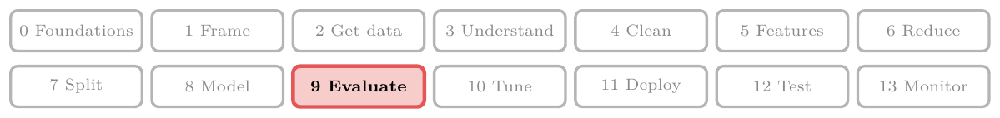
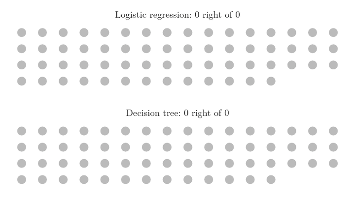
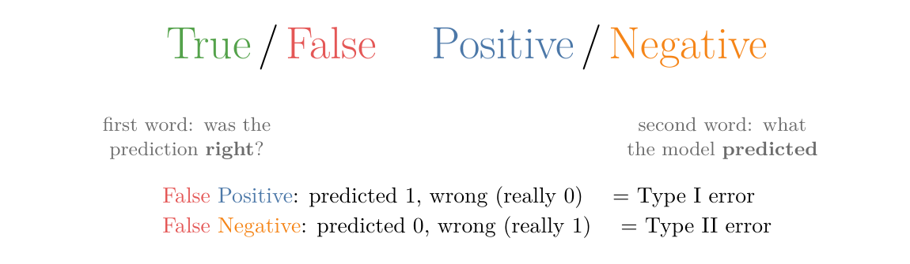
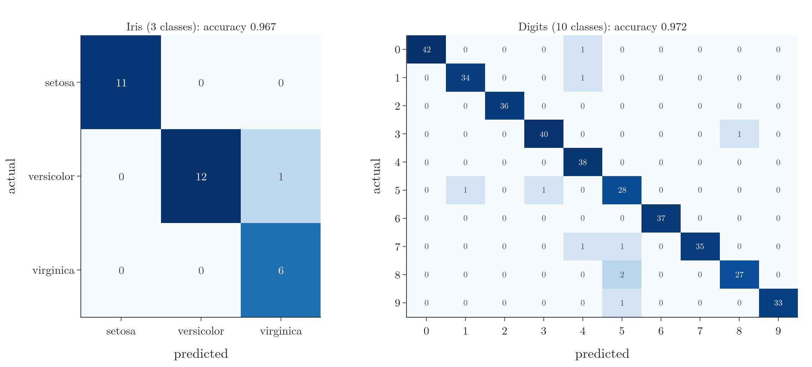
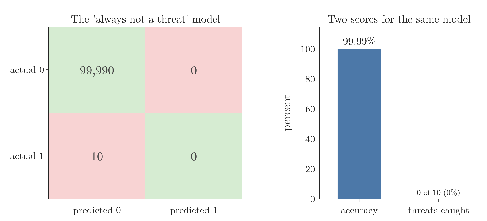

<!-- where-this-fits: generated by course_map/build_map.py; edit concepts.yaml, not this block -->
> **Where this fits:** Pipeline map step 9 (Evaluate). See the [Course map](../../../00-course-map/00-course-map.md).
>
> 
>
> - **Builds on:** [Classification problems](../../../ML/01-foundations/ML-003-types-of-ml/ML-003-types-of-ml.md#23-regression-and-classification); [Train-test split](../../../ML/01-foundations/ML-012-toy-project/ML-012-toy-project.md#6-training-and-test-sets).
> - **Leads to:** [Precision, recall and F1](../../../ML/07-classification/ML-076-precision-recall-f1/ML-076-precision-recall-f1.md#2-precision); [ROC curve and AUC](../../../ML/07-classification/ML-077-roc-auc/ML-077-roc-auc.md#4-the-roc-curve); [Imbalanced data](../../../ML/09-clustering-and-more/ML-127-imbalanced-data/ML-127-imbalanced-data.md#2-what-imbalanced-data-looks-like); [ANN for classification](../../../DL/01-basics/DL-011-customer-churn-ann/DL-011-customer-churn-ann.md#4-building-a-network-in-keras).
> - **Compare with:** [Type I and II errors, power, tails](../../../MA/04-inference/MA-040-errors-power-and-tails/MA-040-errors-power-and-tails.md#2-type-i-and-type-ii-errors).
<!-- /where-this-fits -->

## 1. Overview

> **Key point:** Accuracy is the fraction of correct predictions. The confusion matrix splits the predictions into four counts, which also show what kind of mistakes a model makes.

Regression models were judged with regression metrics such as R² (see [R² score](../../06-regression/ML-051-regression-metrics/ML-051-regression-metrics.md#6-r²-score)). Classification models need their own **classification metrics** (G-394): numbers that measure how well a model predicts classes. The main ones are:

- accuracy (Section 2);
- the confusion matrix (Section 4);
- precision, recall and the F1 score ([precision and recall](../ML-076-precision-recall-f1/ML-076-precision-recall-f1.md#1-overview));
- ROC-AUC ([ROC curve and AUC](../ML-077-roc-auc/ML-077-roc-auc.md#1-overview)).

This Note covers the first two. The following Notes build on the confusion matrix.

## 2. Accuracy

> **Key point:** Accuracy = number of correct predictions / total number of predictions.

### 2.1 The idea

> **Key point:** Compare each prediction with the true class and count how many match.

Suppose we train two models on the student placement data, for example logistic regression and a decision tree (a model that predicts by asking yes/no questions about the features; see [decision trees](../../08-trees-and-ensembles/ML-091-decision-trees-intuition/ML-091-decision-trees-intuition.md#1-overview)), and predict the students of the **test set** (G-1962), the observations held back from training. For each test student we know the true result, so we can tick each prediction as right or wrong. The share ticked right is the **accuracy** (G-162):

$$\text{accuracy} = \frac{\text{correct}}{\text{total}}$$

Here "correct" is the number of correct predictions and "total" is the number of all predictions. With numbers: if a model gets 8 of 10 test students right, its accuracy is:

$$8/10 = 0.8$$

That is 80%. A model with 9 of 10 right (90%) is better on this test set.

### 2.2 A real example

> **Key point:** On the heart-disease data, logistic regression reaches 0.869 and a decision tree 0.836.

The heart-disease dataset has 303 patients. Each patient is one **observation** (G-1374) (one record, a row of the data table). Each has 13 **features** (G-772) (input variables, one column each): medical measurements such as age, blood pressure and cholesterol. The **target** (G-1949) (the output we predict) is 1 if the patient has heart disease, 0 if not. We split off 20% as the test set (random state 2) and train both models.

> **Python:** Accuracy in scikit-learn.
>
> ```python
> from sklearn.metrics import accuracy_score
>
> lr = make_pipeline(StandardScaler(), LogisticRegression())
> lr.fit(X_train, y_train)
> accuracy_score(y_test, lr.predict(X_test))     # 0.869
> ```

| Model | Test accuracy |
|---|---|
| Logistic regression (features standardised) | 0.869 |
| Decision tree | 0.836 |

So, on this test set, logistic regression is the better model.

{height=60%}

In Figure 1, watch the two running counts: they stay close for most of the test set and end 53 against 51 right, so 0.869 against 0.836.

### 2.3 More than two classes

> **Key point:** Accuracy is computed the same way for any number of classes.

Nothing changes with more classes, for example the three iris species: count the correct predictions and divide by the total. Logistic regression on the iris test set (30 flowers) gets 29 right: accuracy 0.967.

## 3. How much accuracy is good enough?

> **Key point:** The answer depends on the problem. 99% can be far too low for cancer detection and plenty for predicting food orders.

A common interview question is "what accuracy should a model have?". There is no single number; it depends on the cost of a mistake.

- **Cancer detection from X-rays:** 99% accuracy means one patient in a hundred gets a wrong answer. Such an error rate is not acceptable.
- **Self-driving car decisions:** 99% means an error every hundred decisions. Also not acceptable.
- **Predicting whether a customer orders food this weekend:** 80% may be perfectly useful, because a wrong guess costs little.

## 4. The confusion matrix

> **Key point:** A table of actual classes against predicted classes. For two classes it has four counts: TN, FP, FN and TP.

### 4.1 What accuracy hides

> **Key point:** Accuracy says how many mistakes there are, not which kind.

A model with 90% accuracy makes mistakes 10% of the time. But in a two-class problem there are two kinds of mistake:

- a patient **has** heart disease, but the model says no;
- a patient does **not** have heart disease, but the model says yes.

These have very different consequences, and accuracy cannot tell them apart. The **confusion matrix** (G-449) can.

### 4.2 Reading it

> **Key point:** Rows are the actual classes, columns the predicted ones. The diagonal holds the correct predictions.

In plain words: draw a 2 × 2 grid. Each test patient goes into one cell, chosen by two questions: what is the patient's true class (the row), and what did the model predict (the column)? Figure 2 fills the grid one patient at a time for both models. Watch the green cells, where truth and prediction agree, and the red cells, where they differ.


Figure 3 shows the two finished confusion matrices.

{height=50%}

In scikit-learn's layout, each **row** is an actual class and each **column** a predicted class. For logistic regression (the names TN, FP, FN and TP are explained in section 4.3):

| | Predicted 0 (no disease) | Predicted 1 (disease) |
|---|---|---|
| **Actual 0 (no disease)** | 25: true negatives (TN) | 7: false positives (FP) |
| **Actual 1 (disease)** | 1: false negatives (FN) | 28: true positives (TP) |

- **True positives** (G-2021) **(28):** patients with heart disease that the model correctly flagged.
- **True negatives** (G-2020) **(25):** healthy patients correctly cleared.
- **False positives** (G-748) **(7):** healthy patients wrongly flagged as ill.
- **False negatives** (G-747) **(1):** an ill patient the model missed.

**Choosing between the models, cell by cell.** The matrices of Figure 3 let us compare the models one cell at a time:

| Cell | Logistic regression | Decision tree | Better |
|---|---|---|---|
| TP (ill, flagged) | 28 | 26 | logistic regression |
| TN (healthy, cleared) | 25 | 25 | tie |
| FP (healthy, flagged) | 7 | 7 | tie |
| FN (ill, missed) | 1 | 3 | logistic regression |

The decision tree makes the same 7 false positives but 3 false negatives. So its extra errors are of the more dangerous kind: missed patients. Logistic regression is at least as good in every cell, so it is the model to choose here. Accuracy alone (0.869 against 0.836) says which model is better; the matrix also says why.

> **Extra:** Some books and websites draw the matrix the other way round, with predictions as rows (for example Fawcett 2006, Fig. 1). Always check the axis labels before reading one.

### 4.3 The names

> **Key point:** The second word is what the model predicted; the first word says whether that was right.

{width=85%}

Figure 4 builds each name from two parts:

- **Positive / Negative** is the model's prediction: 1 or 0.
- **True / False** says whether that prediction was correct.

So a "false positive" is a prediction of 1 that was wrong (the truth was 0). A "true negative" is a prediction of 0 that was right.

### 4.4 Type I and Type II errors

> **Key point:** A false positive is a Type I error; a false negative is a Type II error.

These two error types also have names from statistics:

| Error | Meaning | Heart example |
|---|---|---|
| **Type I error** (G-2032) = false positive | predicted 1, truly 0 | a healthy patient told they have heart disease |
| **Type II error** (G-2033) = false negative | predicted 0, truly 1 | an ill patient told they are healthy |

### 4.5 Accuracy from the confusion matrix

> **Key point:** Accuracy = (TP + TN) / (TP + TN + FP + FN): the diagonal over the total.

The correct predictions are on the diagonal, so

$$\text{accuracy} = \frac{TP + TN}{TP + TN + FP + FN}$$

$$= \frac{28 + 25}{28 + 25 + 7 + 1}$$

$$= \frac{53}{61} = 0.869$$

The confusion matrix gives the accuracy, but the accuracy cannot give back the confusion matrix: it carries less information.

> **Python:** The confusion matrix in scikit-learn.
>
> ```python
> from sklearn.metrics import confusion_matrix
>
> confusion_matrix(y_test, lr.predict(X_test))
> # [[25  7]
> #  [ 1 28]]
> tn, fp, fn, tp = confusion_matrix(y_test, y_pred).ravel()
> ```

## 5. More than two classes

> **Key point:** With k classes the confusion matrix is k × k. The diagonal is still the correct predictions; every other cell is a specific confusion.

{height=45%}

In Figure 5, each row is an actual class and each column a predicted class, as before:

- **Iris** (left): 3 × 3. The one mistake is a versicolor flower predicted as virginica (row versicolor, column virginica).
- **Digits** (right): 10 × 10, from scikit-learn's 8 × 8 pixel images of handwritten digits. Logistic regression gets 97.2% right. The off-diagonal cells show exactly which digits get confused: for example, two 8s were read as 5s.

Accuracy is again the diagonal total divided by the grand total.

## 6. When accuracy misleads: imbalanced data

> **Key point:** If one class is very rare, a model that always predicts the common class gets very high accuracy while being useless.

Data is **imbalanced** (G-921) when one class is much rarer than the other.

Imagine a model that screens airline passengers for security threats. Out of 100,000 passengers, perhaps 10 are real threats. A "model" that simply says "not a threat" for everyone gets

| | Predicted 0 | Predicted 1 |
|---|---|---|
| **Actual 0** | 99,990 | 0 |
| **Actual 1** | 10 | 0 |

$$\text{accuracy} = \frac{99{,}990}{100{,}000} = 0.9999$$

{height=40%}

An accuracy of 99.99%, for a model that catches none of the 10 threats (Figure 6: a full bar beside an empty one). The confusion matrix shows the problem at once: all 10 positives are false negatives.

Figure 7 shows that the high accuracy comes from the imbalance, not from the model. The model stays the same ("not a threat" for everyone) while the share of threats grows. Watch the blue bar.


The model never changes and never catches a threat, yet its accuracy runs from 99.99% down to 50%. Its accuracy only measures how rare the positive class is.

So on imbalanced data, accuracy alone is the wrong metric. The next Note introduces **precision** (G-1547) and **recall** (G-1641), which focus on the rare class.

## 7. Summary

| Term | Meaning | Heart, logistic regression |
|---|---|---|
| TP | predicted 1, truly 1 | 28 |
| TN | predicted 0, truly 0 | 25 |
| FP (Type I) | predicted 1, truly 0 | 7 |
| FN (Type II) | predicted 0, truly 1 | 1 |
| Accuracy | $(TP + TN)$ / total | 0.869 |

- Accuracy is simple and works for any number of classes, but "good enough" depends on the problem, because the cost of a mistake differs: 99% is too low for cancer detection and plenty for food orders.
- The confusion matrix shows the kind of each mistake; rows are actual, columns predicted in scikit-learn. So two models can be compared cell by cell: the decision tree's extra errors are missed patients (FN 3 against 1), the dangerous kind.
- On imbalanced data, accuracy can be near 100% for a useless model, because it then mostly measures how rare the positive class is; so use precision and recall there.
- So accuracy answers "how many predictions are right", and the confusion matrix answers "which kind are wrong".

## 8. Sources

**Built from**

- CampusX, "Accuracy and Confusion Matrix | Type 1 and Type 2 Errors | Classification Metrics Part 1", YouTube, https://www.youtube.com/watch?v=c09drtuCS3c
- StatQuest with Josh Starmer, "Machine Learning Fundamentals: The Confusion Matrix", YouTube, https://www.youtube.com/watch?v=Kdsp6soqA7o

**Other references**

- **Fawcett 2006:** Fawcett, T. "An Introduction to ROC Analysis." *Pattern Recognition Letters* 27(8), 861–874, 2006. Figure 1.

## 9. Key terms

Terms taught in this Note come first; linked terms are recaps, taught in the Note the link opens.

| Term | Meaning |
|---|---|
| Classification metric (G-394) | A number that measures how well a classification model performs. |
| Confusion matrix (G-449) | A table counting a classifier's predictions for every pair of actual and predicted class, so we can see which kinds of mistake it makes, which accuracy alone hides. |
| True positive (TP) (G-2021) | A case the model predicts as positive that really is positive: a correct "yes". The count of these is one cell of the confusion matrix. |
| True negative (TN) (G-2020) | A case the model predicts as negative that really is negative: a correct "no". The count of these is one cell of the confusion matrix. |
| False positive (FP) (G-748) | Predicted positive, but actually negative; a Type I error. |
| False negative (FN) (G-747) | Predicted negative, but actually positive; a Type II error. |
| [Test set](../../../ML/01-foundations/ML-012-toy-project/ML-012-toy-project.md#6-training-and-test-sets) (G-1962) | The part hidden during training, used to check the model. |
| [Accuracy](../../../ML/01-foundations/ML-012-toy-project/ML-012-toy-project.md#9-evaluating-the-model) (G-162) | The fraction of predictions that are correct. |
| [Observation](../../../ML/01-foundations/ML-003-types-of-ml/ML-003-types-of-ml.md#21-learning-from-inputs-and-outputs) (G-1374) | One record of a dataset: one row of the data table. |
| [Feature](../../../ML/01-foundations/ML-002-ai-vs-ml-vs-dl/ML-002-ai-vs-ml-vs-dl.md#52-features-chosen-by-us-or-learned) (G-772) | One piece of information about each example that a model uses (e.g. a student's CGPA). |
| [Target](../../../ML/01-foundations/ML-003-types-of-ml/ML-003-types-of-ml.md#21-learning-from-inputs-and-outputs) (G-1949) | The output column we predict, such as the class; also called the label. |
| [Type I error (false positive)](../../../MA/04-inference/MA-040-errors-power-and-tails/MA-040-errors-power-and-tails.md#21-type-i-error) (G-2032) | A false alarm: the test declares an effect when there is none (rejecting $H_0$ when it is actually true); its probability is $\alpha$. |
| [Type II error (false negative)](../../../MA/04-inference/MA-040-errors-power-and-tails/MA-040-errors-power-and-tails.md#22-type-ii-error) (G-2033) | A miss: the test finds no effect when there really is one (failing to reject $H_0$ when it is actually false); its probability is $\beta$. |
| [Imbalanced data](../../../ML/01-foundations/ML-009-mldlc/ML-009-mldlc.md#62-what-we-do-during-eda) (G-921) | Data in which one class is much rarer than another. |
| [Precision](../../../ML/07-classification/ML-076-precision-recall-f1/ML-076-precision-recall-f1.md#2-precision) (G-1547) | Of all items predicted positive, the fraction that really are positive. |
| [Recall (sensitivity)](../../../ML/07-classification/ML-076-precision-recall-f1/ML-076-precision-recall-f1.md#3-recall) (G-1641) | Of all items that really are positive, the fraction the model found. |
