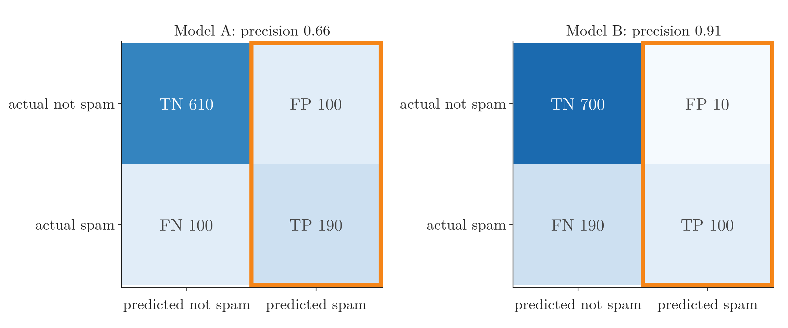
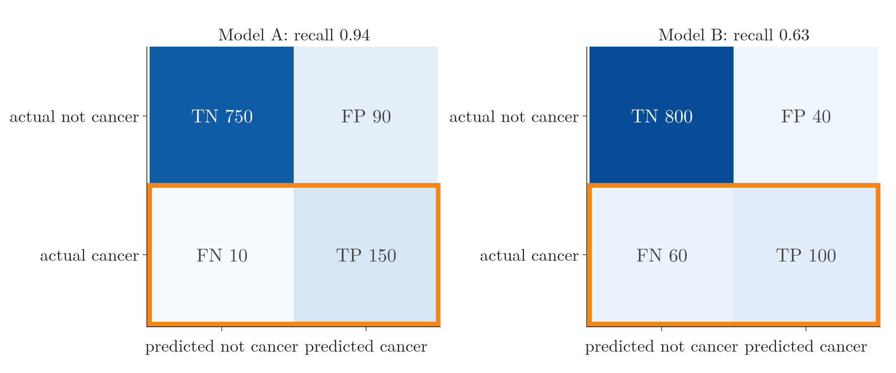

<!-- where-this-fits: generated by course_map/build_map.py; edit concepts.yaml, not this block -->
> **Where this fits:** Pipeline map step 9 (Evaluate). See the [Course map](../../../00-course-map/00-course-map.md).
>
> 
>
> - **Builds on:** [Confusion matrix](../../../ML/07-classification/ML-075-accuracy-confusion-matrix/ML-075-accuracy-confusion-matrix.md#4-the-confusion-matrix).
> - **Used here, taught in full later:** [Imbalanced data](../../../ML/09-clustering-and-more/ML-127-imbalanced-data/ML-127-imbalanced-data.md#2-what-imbalanced-data-looks-like).
> - **Leads to:** [ROC curve and AUC](../../../ML/07-classification/ML-077-roc-auc/ML-077-roc-auc.md#4-the-roc-curve).
<!-- /where-this-fits -->

## 1. Overview

> **Key point:** Precision asks "of everything predicted positive, how much really is?". Recall asks "of everything really positive, how much did we catch?". F1 combines them into one number.

[Accuracy can be misleading](../ML-075-accuracy-confusion-matrix/ML-075-accuracy-confusion-matrix.md#6-when-accuracy-misleads-imbalanced-data), especially on imbalanced data (one class is far rarer than the other), and it hides which kind of mistake a model makes. This Note introduces three metrics built from the **confusion matrix** (G-449; the table of counts of right and wrong predictions, see [reading it](../ML-075-accuracy-confusion-matrix/ML-075-accuracy-confusion-matrix.md#42-reading-it)) that fix this: **precision** (G-1547), **recall** (G-1641) and the **F1 score** (G-743).

The confusion matrix of a two-class problem has four counts. The **positive** class is the one we look for (spam, disease); the other is **negative**:

| | Predicted positive | Predicted negative |
|---|---|---|
| **Actually positive** | **TP** (true positive, G-2021): positive, and called positive | **FN** (false negative, G-747): positive, but called negative |
| **Actually negative** | **FP** (false positive, G-748): negative, but called positive | **TN** (true negative, G-2020): negative, and called negative |

Figure 1 shades the part of this table that each metric reads: precision reads one column, recall reads one row.

{height=42%}

## 2. Precision

> **Key point:** Precision = TP / (TP + FP). Use it when false positives are the expensive mistake.

### 2.1 A spam filter

> **Key point:** Two spam filters with the same accuracy can differ a lot in false positives.

Two team members each build a spam filter, tested on the same 1,000 emails: 290 spam and 710 normal. Spam is the positive class.

| | TP | FP | FN | TN | Accuracy |
|---|---|---|---|---|---|
| Model A | 190 | 100 | 100 | 610 | 0.80 |
| Model B | 100 | 10 | 190 | 700 | 0.80 |

Both have accuracy 0.80, so accuracy cannot choose between them. They differ in the kind of mistake:

- **False positive:** a normal email sent to the spam folder.
- **False negative:** a spam email left in the inbox.

A missed job offer in the spam folder is far worse than an extra advert in the inbox. So here false positives are the expensive mistake, and we want the model with fewer of them: model B.

### 2.2 The formula

> **Key point:** Of all the emails the model called spam, the fraction that really were spam.

$$\text{precision} = \frac{TP}{TP + FP}$$

In words: of everything the model **predicted** positive, how much really was positive? Precision uses the "predicted 1" column of the confusion matrix (Figure 1, left).

- Model A: about a third of what it calls spam is not spam.
  $$190 / (190 + 100) = 0.66$$
- Model B:
  $$100 / (100 + 10) = 0.91$$

Model B has the higher precision, matching the choice above. Figure 2 shows where the two numbers come from: precision reads only the outlined "predicted spam" column, and model B's column holds far fewer false positives.



> **Extra:** The precision formula has no TN in it. Suppose model A were tested on 100 times more normal email, with TN 61,000 instead of 610 and nothing else changed. Its precision would still be:
>
> $$190 / 290 = 0.66$$
>
> So when real positives are rare and negatives are plentiful, as with a rare disease, precision still reports honestly on the positive predictions (StatQuest, "ROC and AUC, Clearly Explained!").

## 3. Recall

> **Key point:** Recall = TP / (TP + FN). Use it when false negatives are the expensive mistake.

### 3.1 A cancer detector

> **Key point:** In medical screening, missing a sick patient is the expensive mistake.

Two models screen 1,000 chest X-rays for cancer (cancer is the positive class):

| | TP | FP | FN | TN | Accuracy |
|---|---|---|---|---|---|
| Model A | 150 | 90 | 10 | 750 | 0.90 |
| Model B | 100 | 40 | 60 | 800 | 0.90 |

Again the accuracies are equal. Now:

- **False positive:** a healthy patient is told they may have cancer. Further tests will clear them.
- **False negative:** a patient with cancer is told they are fine, and goes untreated.

The false negative is far more dangerous, so we want the model with fewer of them: model A.

### 3.2 The formula

> **Key point:** Of all the patients who really have cancer, the fraction the model found.

$$\text{recall} = \frac{TP}{TP + FN}$$

In words: of everything that **really** is positive, how much did the model catch? Recall uses the "actual 1" row of the confusion matrix (Figure 1, right).

- Model A:
  $$150 / (150 + 10) = 0.94$$
- Model B:
  $$100 / (100 + 60) = 0.63$$

Model A has the higher recall, matching the choice above. Figure 3 shows where the two numbers come from: recall reads only the outlined "actual cancer" row, and model B's row holds six times as many missed patients.



> **Extra:** Recall is also called **sensitivity** or the **true positive rate** (G-2022) (Fawcett 2006, §2). "Sensitivity" is the name used for medical diagnostic tests (Altman and Bland 1994). Its partner for the negatives is **specificity** (G-2209), $TN / (TN + FP)$: of everyone who really is negative, the fraction the model cleared. The two names return in [the true positive rate](../ML-077-roc-auc/ML-077-roc-auc.md#31-true-positive-rate).

### 3.3 Choosing between them

> **Key point:** Decide which mistake costs more. False positives worse: precision. False negatives worse: recall.

| Problem | Worse mistake | Metric to watch |
|---|---|---|
| Spam filter | FP: losing a real email | precision |
| Cancer screening | FN: missing a patient | recall |
| Fraud alerts that block cards | FP: blocking honest customers | precision |
| Airport threat screening | FN: missing a threat | recall |

Precision and recall usually pull against each other: making a model flag more cases catches more true positives (higher recall) but also more false alarms (lower precision). [How the threshold moves the two rates](../ML-077-roc-auc/ML-077-roc-auc.md#33-how-the-threshold-moves-them) looks at the same trade-off (scikit-learn docs, "Precision-Recall" example).

Figure 4 shows the pull on the heart-disease test set of section 5 (61 patients). The logistic regression (a model that gives a probability for a yes-or-no target, see [exploring the data](../../01-foundations/ML-012-toy-project/ML-012-toy-project.md#4-exploring-the-data)) gives every patient a probability of disease, and a patient is flagged when that probability passes the threshold; scikit-learn uses 0.5. Watch the threshold slide: moving it left catches every patient (recall 1.00) but turns healthy people into false alarms (precision 0.56 at 0.05); moving it right clears the false alarms (precision 1.00 at 0.95) but misses most patients (recall 0.38).


## 4. F1 score

> **Key point:** F1 is one number built from precision (P) and recall (R), their harmonic mean. F1 is high only if both are high.

### 4.1 When neither mistake clearly matters more

> **Key point:** Sometimes both errors matter equally, and one number is needed.

For a model that tells cats from dogs, calling a cat a dog is no worse than the reverse. Both precision and recall matter, and comparing two numbers for every model is awkward. The **F1 score** combines them.

### 4.2 Why the harmonic mean

> **Key point:** The harmonic mean is pulled towards the smaller value, so a model cannot hide a bad precision behind a good recall.

$$F_1 = \frac{2 \times \text{precision} \times \text{recall}}{\text{precision} + \text{recall}}$$

This formula is the **harmonic mean** (G-880) of the two, not the ordinary (arithmetic) average.

An everyday picture: a chain is only as strong as its weakest link. F1 behaves the same way: one weak score drags the whole number down, however good the other score is.

| Precision | Recall | Arithmetic mean | F1 |
|---|---|---|---|
| 0.8 | 0.8 | 0.80 | 0.80 |
| 0.6 | 1.0 | 0.80 | 0.75 |
| 0.0 | 1.0 | 0.50 | 0.00 |

- When both are equal, the two means agree.
- When they differ, F1 stays closer to the smaller one. The second model has the same average as the first but a weak precision, and F1 penalises it.
- A model that flags everything as positive has recall 1 but may have precision near 0. The average would still give it 0.5; F1 gives 0.

{height=50%}

In Figure 5, the horizontal axis is the precision and each colour keeps the recall fixed (blue 1.0, green 0.8). The dashed lines are the arithmetic mean and the solid lines are F1. As precision falls towards 0, the solid lines drop to 0, while the dashed lines stop at half the recall.

## 5. In scikit-learn

> **Key point:** precision_score, recall_score and f1_score; by default they report the positive class (1).

> **Python:** Precision, recall and F1.
>
> ```python
> from sklearn.metrics import precision_score, recall_score, f1_score
>
> precision_score(y_test, y_pred)   # 0.800
> recall_score(y_test, y_pred)      # 0.966
> f1_score(y_test, y_pred)          # 0.875
> ```

On the heart-disease test set of [the confusion matrix](../ML-075-accuracy-confusion-matrix/ML-075-accuracy-confusion-matrix.md#4-the-confusion-matrix) (61 patients):

| Model | Precision | Recall | F1 |
|---|---|---|---|
| Logistic regression (standardised) | 0.800 | 0.966 | 0.875 |
| Decision tree | 0.788 | 0.897 | 0.839 |

A decision tree is a chain of yes-or-no questions on the features (see [a decision tree is nested if-else](../../08-trees-and-ensembles/ML-091-decision-trees-intuition/ML-091-decision-trees-intuition.md#2-a-decision-tree-is-nested-if-else)). "Standardised" means each feature was rescaled to mean 0 and standard deviation 1 first.

Logistic regression misses fewer patients (higher recall), which matters most for a disease. Figure 6 draws the table: the two models are close on precision, and the gap in recall carries over into F1.


> **Extra:** In a two-class problem, scikit-learn reports the scores of class 1. With `average=None` it shows both classes: for logistic regression, precision is 0.962 for class 0 and 0.800 for class 1. The default comes from the setting `pos_label=1` (scikit-learn docs, `precision_score`).

## 6. More than two classes

> **Key point:** Compute precision, recall and F1 for each class, then combine them with a macro average (plain mean) or a weighted average (by class size).

### 6.1 Per class

> **Key point:** Each class in turn is treated as "positive" and all the others as "negative".

A model sorts 108 animals into dog, cat and rabbit (Figure 7).

{height=48%}

- **Precision of a class:** its diagonal count divided by its **column** total (everything predicted as that class). Many dogs and rabbits were called cats. For cat:
  $$30 / 51 = 0.588$$
- **Recall of a class:** its diagonal count divided by its **row** total (everything really in that class). For cat:
  $$30 / 34 = 0.882$$

| Class | Precision | Recall | F1 | Support |
|---|---|---|---|---|
| dog | 0.862 | 0.625 | 0.725 | 40 |
| cat | 0.588 | 0.882 | 0.706 | 34 |
| rabbit | 0.714 | 0.588 | 0.645 | 34 |

The **support** (G-1924) is the number of items really in each class.

### 6.2 Combining the classes

> **Key point:** Macro: the plain mean of the class scores. Weighted: each class counts in proportion to its support.

- **Macro average** (G-1143): every class counts equally. For precision, add the three class values, then divide by 3. With four decimals (25/29, 30/51 and 20/28), so that the rounding does not shift the last digit:

  $$
  0.8621 + 0.5882 + 0.7143 = 2.1646
  $$

  $$
  2.1646 / 3 = 0.7215
  $$

  To three decimals, the macro precision is 0.722.

- **Weighted average** (G-2113): bigger classes count more. Multiply each class value by its support (its number of observations), add, then divide by the total 108:

  | Class | Precision | Support | Product |
  |---|---|---|---|
  | dog | 0.862 | 40 | 34.48 |
  | cat | 0.588 | 34 | 19.99 |
  | rabbit | 0.714 | 34 | 24.28 |

  Then the sum of the products, over the total:

  $$
  34.48 + 19.99 + 24.28 = 78.75
  $$

  $$
  78.75 / 108 = 0.729
  $$

When the classes are about the same size, the two agree closely. When they are very imbalanced, the choice matters: macro gives rare classes a full say, while weighted reflects performance on a typical item.

> **Python:** Everything at once.
>
> ```python
> from sklearn.metrics import classification_report
>
> precision_score(y_test, y_pred, average=None)        # per class
> precision_score(y_test, y_pred, average="macro")     # 0.722
> precision_score(y_test, y_pred, average="weighted")  # 0.729
> print(classification_report(y_test, y_pred))
> ```
>
> `classification_report` (G-396) prints precision, recall, F1 and support for every class, plus the accuracy and both averages.

On scikit-learn's handwritten digits (10 classes), logistic regression reaches a macro F1 of 0.971; its weakest class is the digit 5, with precision 0.875.

## 7. Summary

| Metric | Formula | Question it answers | Use when |
|---|---|---|---|
| Precision | $TP / (TP + FP)$ | of the predicted positives, how many are right? | false positives are costly |
| Recall | $TP / (TP + FN)$ | of the real positives, how many were found? | false negatives are costly |
| F1 | $2PR / (P + R)$ | one number that needs both to be high | both mistakes matter |

- Equal accuracy can hide very different mistakes; precision and recall separate them, so you can pick the model whose mistakes are the cheap kind (the spam filters and the cancer detectors both tie on accuracy).
- Precision and recall usually pull against each other, because flagging more cases catches more positives and also raises more false alarms.
- F1 is the harmonic mean, so it stays near the weaker of the two, and a model cannot hide a bad precision behind a good recall.
- With several classes, compute per class and combine with a macro or weighted average; on imbalanced classes macro gives rare classes a full say, while weighted reflects a typical item.
- So these three metrics answer what accuracy cannot: which kind of mistake a model makes, and how well it handles the class we look for.

## 8. Sources

**Built from**

- CampusX, "Precision, Recall and F1 Score | Classification Metrics Part 2", YouTube, https://www.youtube.com/watch?v=iK-kdhJ-7yI
- StatQuest with Josh Starmer, "Machine Learning Fundamentals: Sensitivity and Specificity", YouTube, https://www.youtube.com/watch?v=vP06aMoz4v8. Sensitivity and specificity as the medical names (Section 3.2).
- StatQuest with Josh Starmer, "ROC and AUC, Clearly Explained!", YouTube, https://www.youtube.com/watch?v=4jRBRDbJemM. Precision does not use the true negatives (Section 2.2, Extra).

**Other references**

- **Altman and Bland 1994:** Altman, D. G. and Bland, J. M. "Diagnostic tests 1: sensitivity and specificity." *BMJ* 308(6943), 1552, 1994.
- **Fawcett 2006:** Fawcett, T. "An Introduction to ROC Analysis." *Pattern Recognition Letters* 27(8), 861–874, 2006. Section 2 and Figure 1.
- **scikit-learn docs:** `sklearn.metrics.precision_score` (pos_label); example "Precision-Recall", scikit-learn 1.9.

## 9. Key terms

Terms taught in this Note come first; linked terms are recaps, taught in the Note the link opens.

| Term | Meaning |
|---|---|
| Precision (G-1547) | Of all items predicted positive, the fraction that really are positive. |
| Recall (sensitivity) (G-1641) | Of all items that really are positive, the fraction the model found. |
| F1 score (G-743) | One number that combines precision and recall as their harmonic mean, $2PR/(P + R)$; it is high only when both are high, so it is used when both kinds of mistake matter. |
| Specificity (G-2209) | Of all items that really are negative, the fraction the model cleared: TN / (TN + FP). |
| Harmonic mean (G-880) | An average that stays close to the smaller of the values, so one low value pulls it down; F1 uses it to combine precision and recall. For two values: $2ab/(a + b)$. |
| Support (G-1924) | The number of items that really belong to a class. |
| Macro average (G-1143) | The plain mean of a metric (such as precision) over all classes, so every class counts equally however many rows it has. |
| Weighted average (G-2113) | One number for a per-class score: the mean of the score over classes, each class counted by how many items really belong to it (its support). |
| classification_report (G-396) | scikit-learn function that prints precision, recall, F1 and support for every class. |
| [Confusion matrix](../../../ML/07-classification/ML-075-accuracy-confusion-matrix/ML-075-accuracy-confusion-matrix.md#4-the-confusion-matrix) (G-449) | A table counting a classifier's predictions for every pair of actual and predicted class, so we can see which kinds of mistake it makes, which accuracy alone hides. |
| [True positive (TP)](../../../ML/07-classification/ML-075-accuracy-confusion-matrix/ML-075-accuracy-confusion-matrix.md#42-reading-it) (G-2021) | A case the model predicts as positive that really is positive: a correct "yes". The count of these is one cell of the confusion matrix. |
| [False negative (FN)](../../../ML/07-classification/ML-075-accuracy-confusion-matrix/ML-075-accuracy-confusion-matrix.md#42-reading-it) (G-747) | Predicted negative, but actually positive; a Type II error. |
| [False positive (FP)](../../../ML/07-classification/ML-075-accuracy-confusion-matrix/ML-075-accuracy-confusion-matrix.md#42-reading-it) (G-748) | Predicted positive, but actually negative; a Type I error. |
| [True negative (TN)](../../../ML/07-classification/ML-075-accuracy-confusion-matrix/ML-075-accuracy-confusion-matrix.md#42-reading-it) (G-2020) | A case the model predicts as negative that really is negative: a correct "no". The count of these is one cell of the confusion matrix. |
| [True positive rate (TPR)](../../../ML/07-classification/ML-077-roc-auc/ML-077-roc-auc.md#31-true-positive-rate) (G-2022) | The fraction of real positives the model flags; the same as recall. |
