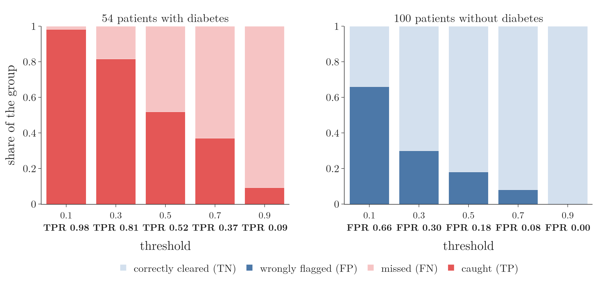
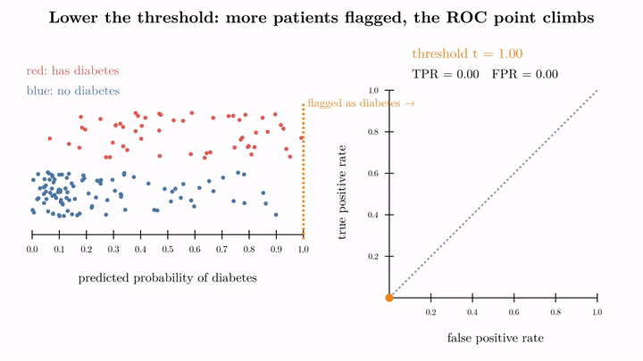
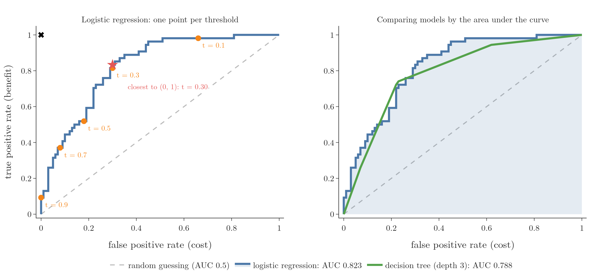
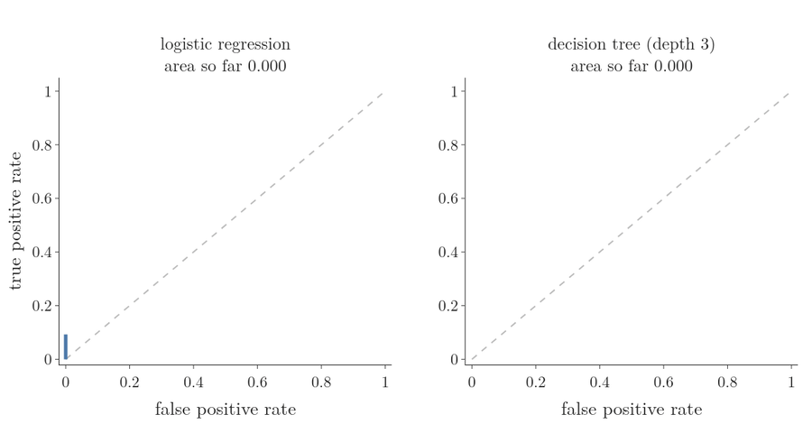
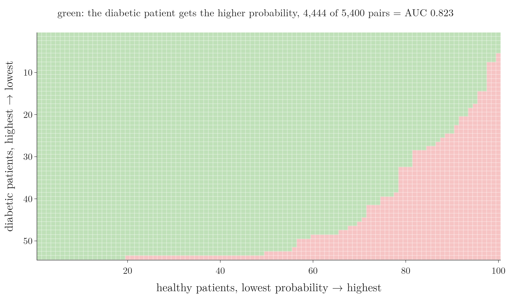

<!-- where-this-fits: generated by course_map/build_map.py; edit concepts.yaml, not this block -->
> **Where this fits:** Pipeline map step 9 (Evaluate). See the [Course map](../../../00-course-map/00-course-map.md).
>
> 
>
> - **Builds on:** [Confusion matrix](../../../ML/07-classification/ML-075-accuracy-confusion-matrix/ML-075-accuracy-confusion-matrix.md#4-the-confusion-matrix); [Precision, recall and F1](../../../ML/07-classification/ML-076-precision-recall-f1/ML-076-precision-recall-f1.md#2-precision).
> - **Leads to:** [Imbalanced data](../../../ML/09-clustering-and-more/ML-127-imbalanced-data/ML-127-imbalanced-data.md#2-what-imbalanced-data-looks-like).
<!-- /where-this-fits -->

## 1. Overview

> **Key point:** A classifier outputs a probability, and a threshold turns it into 0 or 1. The ROC curve shows the true positive rate (the share of real positives caught) against the false positive rate (the share of real negatives wrongly flagged) for every threshold. The curve helps pick the threshold, and the area under it (AUC) compares models.

The **ROC curve** (G-1702) (receiver operating characteristic curve) is a standard tool for judging **binary** classifiers (classifiers with two classes, such as diabetes yes or no) (Fawcett 2006, §1). The ROC curve has two uses:

1. **Choosing a threshold**: the cut-off that turns probabilities into yes or no.
2. **Comparing models**: through the area under the curve, AUC.

## 2. Probabilities and thresholds

> **Key point:** Models such as logistic regression predict a probability. A threshold, 0.5 by default, decides which probabilities count as "yes".

### 2.1 From probability to prediction

> **Key point:** Probability at or above the threshold: predict 1. Below: predict 0.

Logistic regression (a model for yes-or-no targets) and most classifiers, such as decision trees or neural networks, do not directly output 0 or 1. The model outputs a probability, for example "this patient has a 45% chance of diabetes" (see [sigmoid as a probability](../ML-071-sigmoid-function/ML-071-sigmoid-function.md#5-sigmoid-as-a-probability)).

A **threshold** (G-1970) turns this into a decision. With the usual threshold of 0.5, a probability of 0.45 becomes 0 (no diabetes) and 0.62 becomes 1.

### 2.2 Why change it

> **Key point:** Raising or lowering the threshold trades one kind of mistake for the other.

A spam filter that wrongly binned a job offer is worse than one that lets an advert through (see [a spam filter](../ML-076-precision-recall-f1/ML-076-precision-recall-f1.md#21-a-spam-filter)). Raising its threshold to 0.75 means an email is called spam only when the model is quite sure. The higher threshold cuts the dangerous mistakes, the **false positives** (emails flagged as spam that are not spam; section 3.1 defines them), at the cost of more spam getting through.

The dial also turns the other way. When missing a positive is the worse mistake, as in screening for a dangerous infectious disease, the threshold is lowered, to 0.1 for example: nearly every infected person is caught, at the price of more healthy people flagged.

So the threshold is a dial between the two kinds of mistake. The difficulty is knowing where to set it: 0.3? 0.5? 0.75? The ROC curve shows the consequences of every setting at once.

{height=40%}

Figure 1 is a histogram: the horizontal axis is the predicted probability of diabetes, the height is the number of test patients, blue bars are patients without diabetes and red bars patients with it, and the dashed vertical lines mark the thresholds 0.3, 0.5 and 0.7. It shows the example used in this Note: logistic regression on the Pima diabetes data. The data has 768 women; each woman is one **observation** (G-1374) (one record, a row of the data table). Each has 8 **features** (G-772) (input variables, one column each), medical measurements such as glucose and blood pressure. The **target** (G-1949) (the output we predict) is diabetes: yes for 268 of them. The model is trained on 80% and tested on 154 patients. Patients with diabetes (red) tend to get higher probabilities, but the two groups overlap. Each threshold line cuts the overlap in a different place.

## 3. Two rates: benefit and cost

> **Key point:** True positive rate (benefit): the share of real positives caught. False positive rate (cost): the share of real negatives wrongly flagged.

### 3.1 True positive rate

> **Key point:** TPR = TP / (TP + FN). TPR is the same as recall.

The four counts come from the confusion matrix ([reading it](../ML-075-accuracy-confusion-matrix/ML-075-accuracy-confusion-matrix.md#42-reading-it)). The positive class is the one we look for (here, diabetes). **TP** is a positive patient flagged, **FN** a positive patient missed, **FP** a negative patient flagged, **TN** a negative patient cleared.

$$\text{TPR} = \frac{TP}{TP + FN}$$

Of all the patients who really have diabetes, the fraction the model flags: the **true positive rate** (G-2022). TPR is exactly **recall** (G-1641; see [the recall formula](../ML-076-precision-recall-f1/ML-076-precision-recall-f1.md#32-the-formula)), and in medicine and statistics the same number is called **sensitivity**. Think of it as the **benefit**: the model exists to find these patients. Higher is better; 1 means every one was found.

### 3.2 False positive rate

> **Key point:** FPR = FP / (FP + TN): the share of healthy patients wrongly flagged.

$$\text{FPR} = \frac{FP}{FP + TN}$$

Of all the patients who really do **not** have diabetes, the fraction the model wrongly flags: the **false positive rate** (G-749). Think of it as the **cost**: each one means needless worry and extra tests. Lower is better; 0 means no healthy patient was flagged.

The share of real negatives that are correctly cleared is called **specificity**:

$$\text{specificity} = \frac{TN}{TN + FP}$$

FPR and specificity always add up to 1:

$$\text{FPR} = 1 - \text{specificity}$$

An ROC curve is therefore often described as sensitivity against 1 − specificity: the same two axes under other names.

**The cost in rupees.** A telecom company predicts which customers are about to leave and sends each flagged customer a discount of 100 rupees. Every false positive is a customer who was never going to leave: 10 false positives mean 1,000 rupees given away for nothing. The FPR measures how often that happens.

### 3.3 How the threshold moves them

> **Key point:** A low threshold flags almost everyone: both rates high. A high threshold flags almost no one: both rates low.

| Threshold | TP | FN | FP | TN | TPR (benefit) | FPR (cost) |
|---|---|---|---|---|---|---|
| 0.1 | 53 | 1 | 66 | 34 | 0.981 | 0.660 |
| 0.3 | 44 | 10 | 30 | 70 | 0.815 | 0.300 |
| 0.5 | 28 | 26 | 18 | 82 | 0.519 | 0.180 |
| 0.7 | 20 | 34 | 8 | 92 | 0.370 | 0.080 |
| 0.9 | 5 | 49 | 0 | 100 | 0.093 | 0.000 |

- **Threshold 0.1:** almost everyone is flagged. Nearly all diabetic patients are caught (TPR 0.98), but two thirds of the healthy ones are flagged too (FPR 0.66).
- **Threshold 0.9:** almost no one is flagged. No false alarms, but 49 of the 54 diabetic patients are missed.

The ideal would be TPR 1 and FPR 0: every patient caught and no false alarms.

{height=45%}

In Figure 2, watch both dark bars shrink together as the threshold rises: the benefit and the cost cannot be moved one at a time.

## 4. The ROC curve

> **Key point:** Plot FPR on the x-axis and TPR on the y-axis for every threshold. The curve runs from (0, 0) to (1, 1); the closer it bends towards the top-left corner, the better.

### 4.1 Building it

> **Key point:** Sweep the threshold from 1 down to 0 and mark (FPR, TPR) each time.

For each threshold:

1. compute the confusion matrix;
2. compute the two rates from it;
3. plot the point (FPR, TPR).

Figure 3 does this by hand on eight test patients, four diabetic and four healthy, so every count can be checked. The threshold starts above the highest probability and drops past one patient at a time.


| Threshold | Flagged (probabilities) | TP | FP | TPR | FPR | The point moves |
|---|---|---|---|---|---|---|
| above 0.92 | nobody | 0 | 0 | 0 | 0 | start at (0, 0) |
| 0.92 | 0.92 | 1 | 0 | 0.25 | 0 | up |
| 0.64 | 0.92, 0.64 | 2 | 0 | 0.5 | 0 | up |
| 0.62 | 0.92, 0.64, 0.62 | 2 | 1 | 0.5 | 0.25 | right (a healthy patient) |
| 0.47 | + 0.47 | 3 | 1 | 0.75 | 0.25 | up |
| 0.29 | + 0.29 | 4 | 1 | 1 | 0.25 | up |
| 0.27 | + 0.27 | 4 | 2 | 1 | 0.5 | right |
| 0.11 | + 0.11 | 4 | 3 | 1 | 0.75 | right |
| 0.00 | everybody | 4 | 4 | 1 | 1 | right, to (1, 1) |

The rule is simple: each newly flagged diabetic patient moves the point **up** by 1/4, and each newly flagged healthy patient moves it **right** by 1/4. The dashed diagonal is where TPR equals FPR; a point above it flags a larger share of the diabetic patients than of the healthy ones.

Figure 4 runs the same sweep on all 154 test patients.

{height=55%}

In Figure 4, the left panel places each of the 154 test patients at its predicted probability (red: diabetic, blue: healthy; the up-down spread only keeps the dots apart). Everyone in the shaded area right of the dotted threshold line is flagged. The right panel plots that threshold's point (FPR, TPR) and the curve traced so far.

- At threshold 1, nothing is flagged: the point is (0, 0).
- As the threshold falls, more patients are flagged and the point moves up and to the right.
- At threshold 0, everyone is flagged: the point is (1, 1).

### 4.2 Its shape

> **Key point:** The curve rises steeply at first, because the first patients flagged are mostly real positives.

The curve is not a straight line (Figure 5, left). The reason follows from the up-and-right rule of Section 4.1. Follow the threshold line in Figure 4 as it moves left:

1. **High thresholds (right end of the strip).** The patients flagged first are those with very high probabilities. In the Section 3.3 table, the 28 patients at or above 0.7 are 20 diabetic and 8 healthy. Mostly diabetic patients means mostly "up" moves: TPR jumps while FPR barely moves, so the curve climbs steeply.
2. **Middle thresholds.** The two groups overlap here, so "up" and "right" moves mix and the curve bends.
3. **Low thresholds (left end of the strip).** The patients still unflagged have low probabilities and are mostly healthy. Mostly "right" moves: FPR rises quickly while TPR hardly changes, so the curve flattens along the top.

A good model gives high probabilities to the positives, so its "up" moves come first, and its curve bulges towards the top-left corner. A model that guesses at random mixes "up" and "right" moves evenly all the way, which gives the diagonal.

### 4.3 Choosing the threshold

> **Key point:** A common choice is the point closest to the ideal corner (0, 1). Here that is threshold 0.297.

{height=58%}

The ideal point is (0, 1): all benefit, no cost (the cross in Figure 5, left). A simple rule is to pick the threshold whose point lies closest to it (the red star). Here that is threshold 0.297, with TPR 0.83 and FPR 0.30: most diabetic patients are found while 70% of healthy ones are correctly cleared.

The star sits just above the orange dot of the 0.3 row in the Section 3.3 table (TPR 0.815). One diabetic test patient has probability 0.2974, between 0.297 and 0.3, so threshold 0.297 flags one more diabetic patient:

$$\text{TPR} = 45/54 = 0.833$$

The default 0.5 would find only 52% of the diabetic patients. For a screening test, where missing a patient is the worse mistake, the lower threshold is the better choice. If false alarms were the expensive mistake instead, a point further down-left would be chosen.

> **Python:** The ROC curve in scikit-learn.
>
> ```python
> from sklearn.metrics import roc_curve
>
> p = lr.predict_proba(X_test)[:, 1]          # probabilities of class 1
> fpr, tpr, thresholds = roc_curve(y_test, p)
> best = np.argmin(np.hypot(fpr, 1 - tpr))    # closest to (0, 1)
> thresholds[best]                             # 0.297
> ```
>
> `predict_proba` (G-1549) returns the predicted probabilities instead of classes. `roc_curve` tries every distinct probability as a threshold (154 here). By default it then drops the thresholds that add nothing to the shape of the curve (`drop_intermediate=True`), so it returns 54 here (scikit-learn docs, `roc_curve`).

> **Extra:** Another common rule picks the threshold with the largest **Youden's J** (Youden 1950):
>
> $$J = \text{sensitivity} + \text{specificity} - 1$$
>
> $$J = \text{TPR} + (1 - \text{FPR}) - 1$$
>
> $$J = \text{TPR} - \text{FPR}$$
>
> Here it gives a similar threshold, 0.29.

## 5. AUC: the area under the curve

> **Key point:** AUC measures the whole curve with one number: 1 is perfect, 0.5 is random guessing. The model with the higher AUC separates the classes better.

The **area under the ROC curve (AUC)** (G-229) summarises performance over all thresholds at once.

| AUC | Meaning |
|---|---|
| 1 | perfect: some threshold separates the classes with no mistakes |
| above 0.5 | better than chance; closer to 1 is better |
| 0.5 | no better than random guessing (the diagonal line) |
| below 0.5 | worse than random: the model has the classes the wrong way round |

Random guessing gives the diagonal from (0, 0) to (1, 1), whose area is 0.5, and a curve below the diagonal can be flipped above it by swapping the model's answers (Fawcett 2006, §3 and §7).

On the diabetes test set (Figure 5, right):

| Model | AUC |
|---|---|
| Logistic regression | 0.823 |
| Decision tree (depth 3) | 0.788 |

Logistic regression's curve lies above the tree's for most false positive rates (the tree's curve is higher only between FPR of about 0.15 and 0.29), so it separates diabetic from healthy patients better overall.

The tree's curve is a few straight segments rather than a staircase. A depth-3 tree has at most 8 leaves, and every patient in a leaf gets the same probability, so the tree gives only 5 distinct probabilities on this test set. Each threshold between two of them gives one point, and `roc_curve` joins those few points with straight lines.

Figure 6 draws both curves from left to right and fills in the area under each. Watch the two running totals: they end at the two AUC values.



> **Extra:** AUC has a neat second interpretation: it is the probability that a randomly chosen positive patient gets a higher predicted probability than a randomly chosen negative one. An AUC of 0.823 means that happens 82.3% of the time (Fawcett 2006, §7). A direct count over all 54 × 100 pairs of a diabetic and a healthy test patient gives the same 0.823.

{height=45%}

In Figure 7, the green share of the grid is the AUC, 4,444 of 5,400 pairs; the pink corner holds the pairs where low-scored diabetic patients meet high-scored healthy ones, and its staircase edge is the ROC curve turned half a turn (upside down and mirrored left to right). The reason: in Figure 7 the healthy patients run from the lowest probability to the highest, left to right, while the ROC curve's FPR grows as the highest-scored healthy patients are flagged first; and the diabetic patients run from highest to lowest downwards, while the ROC curve's TPR grows upwards.

> **Python:** AUC in scikit-learn.
>
> ```python
> from sklearn.metrics import roc_auc_score
>
> roc_auc_score(y_test, p)    # 0.823
> ```
>
> Pass probabilities, not 0/1 predictions: with hard predictions, the curve has only one point.

## 6. Summary

| Term | Formula | Meaning |
|---|---|---|
| Threshold | | probability above which the model predicts 1 |
| TPR (recall, sensitivity) | $TP / (TP + FN)$ | benefit: share of real positives caught |
| FPR (1 − specificity) | $FP / (FP + TN)$ | cost: share of real negatives wrongly flagged |
| ROC curve | TPR against FPR | one point per threshold |
| AUC | area under the curve | 1 perfect, 0.5 random |

- Lowering the threshold raises both TPR and FPR; raising it lowers both.
- Choose the threshold from the ROC curve, for example the point closest to (0, 1), or according to which mistake costs more.
- Compare models by AUC: higher is better.

## 7. Sources

**Built from**

- CampusX, "ROC Curve in Machine Learning | ROC-AUC in Machine Learning Simplified | CampusX", YouTube, https://www.youtube.com/watch?v=gdW6hj9IXaA
- StatQuest with Josh Starmer, "ROC and AUC, Clearly Explained!", YouTube, https://www.youtube.com/watch?v=4jRBRDbJemM

**Other references**

- **Fawcett 2006:** Fawcett, T. "An Introduction to ROC Analysis." *Pattern Recognition Letters* 27(8), 861–874, 2006. Sections 3 and 7.
- **Youden 1950:** Youden, W. J. "Index for Rating Diagnostic Tests." *Cancer* 3(1), 32–35, 1950.
- **scikit-learn docs:** `sklearn.metrics.roc_curve` (drop_intermediate), scikit-learn 1.9.

## 8. Key terms

| Term | Meaning |
|---|---|
| Threshold (G-1970) | The probability cut-off that turns a predicted probability into a class |
| True positive rate (TPR) | The fraction of real positives the model flags; the same as recall |
| False positive rate (FPR) | The fraction of real negatives the model wrongly flags |
| Sensitivity (G-1641) | Another name for the true positive rate (recall) |
| Specificity | The fraction of real negatives the model correctly clears, TN / (TN + FP); equal to 1 − FPR |
| ROC curve | A plot of TPR against FPR for every threshold |
| AUC | The area under the ROC curve; a single score from 0.5 (random) to 1 (perfect) |
| predict_proba | scikit-learn method that returns predicted probabilities instead of classes |
