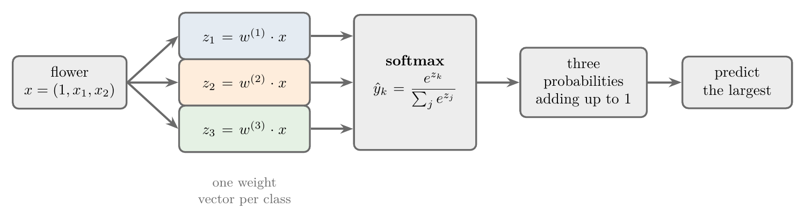
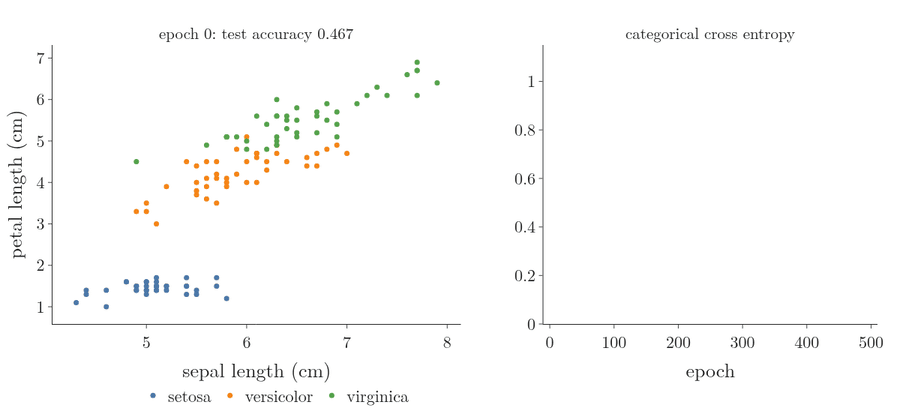
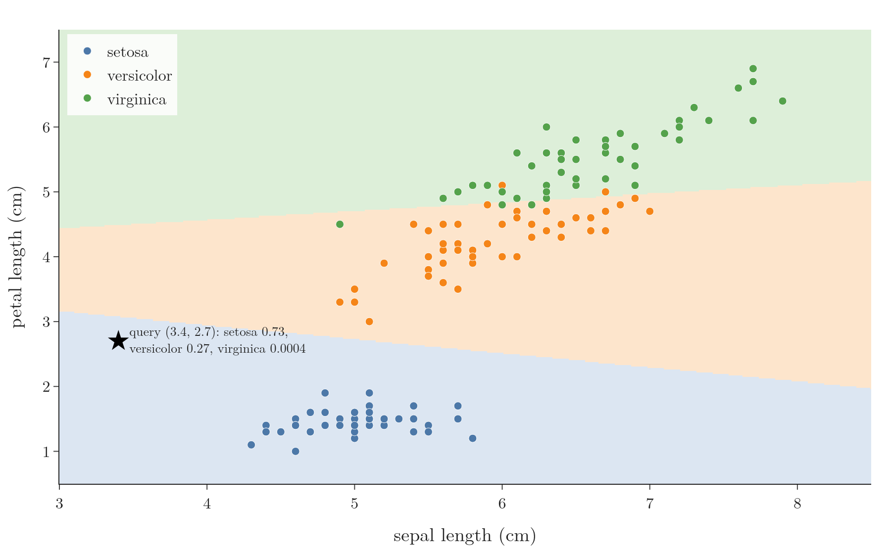

<!-- where-this-fits: generated by course_map/build_map.py; edit concepts.yaml, not this block -->
> **Where this fits:** Pipeline map step 8 (Model). See the [Course map](../../../00-course-map/00-course-map.md).
>
> 
>
> - **Builds on:** [One-hot encoding](../../../ML/03-feature-engineering/ML-026-one-hot-encoding/ML-026-one-hot-encoding.md#2-how-one-hot-encoding-works); [Logistic regression](../../../ML/07-classification/ML-071-sigmoid-function/ML-071-sigmoid-function.md#5-sigmoid-as-a-probability).
> - **Leads to:** [ANN for classification](../../../DL/01-basics/DL-011-customer-churn-ann/DL-011-customer-churn-ann.md#4-building-a-network-in-keras); [Unembedding, logits, temperature and sampling](../../../DL/06-transformers/DL-088-unembedding-and-sampling/DL-088-unembedding-and-sampling.md#3-the-unembedding-one-dot-product-per-token).
<!-- /where-this-fits -->

## 1. Overview

> **Key point:** Softmax regression extends logistic regression to more than two classes. The model computes one score per class and turns the scores into probabilities that add up to 1, using the softmax function.

[Logistic regression](../ML-071-sigmoid-function/ML-071-sigmoid-function.md#4-the-sigmoid-function) handles **binary** classification (two classes): placed or not, spam or not. Many problems have more classes. A student might be placed, not placed, or opt out of placements altogether; an iris flower can be one of three species.

**Softmax regression** (G-1833), also called **multinomial logistic regression** (G-1276), handles any number of classes. Softmax is also the standard output layer of neural networks that classify, so it matters for deep learning too (Goodfellow et al. §6.2.2.3). With two classes it reduces exactly to ordinary logistic regression.

## 2. The softmax function

> **Key point:** Softmax turns a list of scores into shares of 1: a bigger score gets a bigger share, every share is positive, and the shares add up to exactly 1.

### 2.1 Raw scores, and why picking the largest is not enough

> **Key point:** Picking the largest score gives the class, but it gives gradient descent nothing to learn from.

A model gives a flower one raw score per class. Take a flower with scores 2.81 for setosa, 1.84 for versicolor and $-4.66$ for virginica. Raw scores are hard to read: some are above 1, some are below 0, and nothing says how sure the model is.

The simplest fix is to pick the largest score. The function that does so is **argmax** (G-212): it gives 1 to the class with the largest score and 0 to all the others. Here argmax gives setosa 1, versicolor 0 and virginica 0. That output is easy to read, and it is how the final class is reported.

Argmax cannot be used to train the model, though. Training uses [gradient descent](../../06-regression/ML-056-gradient-descent/ML-056-gradient-descent.md#2-the-idea) (repeatedly moving the weights in the direction that lowers the loss), and gradient descent needs a slope: how much the output changes when a score changes a little.

1. Raise the setosa score from 2.81 to 2.91. Setosa is still the largest, so the argmax output stays 1, 0, 0.
2. Lower it to 2.71. The output is still 1, 0, 0.
3. The output did not move, so the slope is 0. A slope of 0 tells gradient descent to change nothing, and the weights never improve.

We need a function that still favours the largest score but changes smoothly. That function is softmax. The model trains with softmax and uses argmax only to report the final class (Figure 2 shows the two side by side).

### 2.2 The formula

> **Key point:** Raise e to each score, then divide by the total.

Call the three scores $z_1$, $z_2$ and $z_3$. The **softmax function** (G-1830) turns them into probabilities in two steps: raise $e$ to each score, then divide by the total. Here $e$ is the fixed number $2.718$, so $e^{1} = 2.718$ and $e^{2} = 7.389$. A bigger score gives a much bigger $e^{z}$, and $e^{z}$ is never negative.

{height=48%}

Figure 1 shows the two steps as bars for the flower with scores $(2.81,\ 1.84,\ -4.66)$: first the scores, then $e^{z}$, then the shares. The worked numbers:

1. Raise $e$ to each score. Every value is now positive, and a larger score gives a much larger value:

   $$
   e^{2.81} = 16.69
   $$

   $$
   e^{1.84} = 6.30
   $$

   $$
   e^{-4.66} = 0.01
   $$

2. Add them for the total:

   $$
   16.69 + 6.30 + 0.01 = 23.00
   $$

3. Divide each value by the total:

   $$
   \frac{16.69}{23.00} = 0.726
   $$

   $$
   \frac{6.30}{23.00} = 0.274
   $$

   $$
   \frac{0.01}{23.00} = 0.0004
   $$

The flower is most likely setosa (73%), possibly versicolor (27%), and almost certainly not virginica. As a formula, with $\hat y_k$ the softmax output for class $k$ ($k = 1$ is setosa, so $\hat y_1 = 0.726$):

$$\hat y_k = \frac{e^{z_k}}{e^{z_1} + e^{z_2} + e^{z_3}}$$

With $K$ classes the denominator is the sum of $e^{z_j}$ for $j = 1, 2, \dots, K$, written $\sum_{j=1}^{K} e^{z_j}$. The symbol $\sum$ means "add up". For our flower $K = 3$, so:

$$\sum_{j=1}^{3} e^{z_j} = 16.69 + 6.30 + 0.01 = 23.00$$

### 2.3 Its properties

> **Key point:** All outputs are in (0, 1), they add up to 1, and the order of the scores is kept.

- Each output is between 0 and 1, because $e^{z}$ is always positive and the denominator includes it.
- The outputs always add up to 1: the classes share out all the probability. A flower must be one of the three species.
- The order of the scores is kept: the class with the largest score always gets the largest probability. In Figure 1 the scores rank setosa, versicolor, virginica (2.81 > 1.84 > −4.66), and so do the probabilities (0.726 > 0.274 > 0.0004).

Because the outputs lie between 0 and 1 and add up to 1, we read them as probabilities. They are the model's own estimates: they come from the fitted weights, so a different fit gives somewhat different values.

### 2.4 Softmax has a slope

> **Key point:** A small change in a score gives a small change in every probability, so gradient descent has a slope to follow.


In Figure 2, watch the left panel first. As the setosa score rises, the setosa probability rises and the versicolor probability falls by the same amount. The classes compete for a fixed total of 1.

Now the right panel. The dashed argmax line is flat at 0, jumps to 1 where the setosa score passes the versicolor score (1.84), and is flat again. Its slope is 0 everywhere except at the jump. The solid softmax curve rises smoothly, so it has a slope at every point.

The slope has a simple formula. Write $p_k$ for the softmax probability of class $k$. For our flower, $p_{\text{setosa}} = 0.726$ and $p_{\text{versicolor}} = 0.274$. There are two kinds of slope, shown with the numbers first:

| Question | Rule | Our flower |
|---|---|---|
| Raise the setosa score: how fast does the setosa probability rise? | $p_k(1 - p_k)$ | $0.726 \times (1 - 0.726) = 0.726 \times 0.274 = 0.20$ |
| Raise the versicolor score: how fast does the setosa probability fall? | $-p_k \thinspace p_j$ | $-0.726 \times 0.274 = -0.20$ |

In the rules, $p_k$ is the probability whose change we watch and $p_j$ is the probability of the class whose score is raised. Neither slope is 0, so gradient descent can use them (Section 4.2).

### 2.5 Two classes give the sigmoid

> **Key point:** With two classes, softmax is the sigmoid of the difference of the two scores.

With two classes, divide the top and bottom by $e^{z_1}$:

$$\frac{e^{z_1}}{e^{z_1} + e^{z_2}} = \frac{e^{z_1} / e^{z_1}}{e^{z_1}/e^{z_1} + e^{z_2}/e^{z_1}}$$

$$= \frac{1}{1 + e^{z_2 - z_1}}$$

$$= \frac{1}{1 + e^{-(z_1 - z_2)}}$$

$$= \sigma(z_1 - z_2)$$

The result is the sigmoid of the difference $z_1 - z_2$ ([the sigmoid function](../ML-071-sigmoid-function/ML-071-sigmoid-function.md#4-the-sigmoid-function)). So binary logistic regression is the special case of softmax regression with two classes.

## 3. How the model predicts

> **Key point:** One weight vector per class gives one score per class; softmax turns the scores into probabilities; the largest probability wins.

{width=100%}

With $K$ classes, the model has $K$ weight vectors, one per class (Figure 3). To predict a flower $x$ (with a 1 in front for the intercept):

1. compute a score for every class: $z_k = w^{(k)} \cdot x$;
2. apply softmax to get $K$ probabilities;
3. predict the class with the largest probability.

On the iris data, each flower is one **observation** (G-1374; one record, a row of the data table). We use two **features** (G-772; input variables, one column each): sepal length and petal length. The **target** (G-1949; the output we predict) is the species. The trained model has three weight vectors:

| Class | Intercept | Sepal length | Petal length |
|---|---|---|---|
| setosa | 11.423 | $-0.210$ | $-2.924$ |
| versicolor | 1.605 | 0.347 | $-0.350$ |
| virginica | $-13.028$ | $-0.137$ | 3.274 |

Take a made-up query flower with sepal length 3.4 and petal length 2.7 (no real iris has a sepal this short; the point is chosen to land near a boundary). The setosa score is:

$$11.423 - 0.210 \times 3.4 - 2.924 \times 2.7$$

$$= 2.81$$

The other two scores come out at 1.84 and $-4.66$. Softmax then gives the probabilities of Figure 1, and the prediction is setosa.

## 4. How the model is trained

> **Key point:** One-hot encode the classes, then minimise the categorical cross entropy, the multi-class version of log loss, with gradient descent.

### 4.1 An intuition: one model per class

> **Key point:** Turn the K-class problem into K yes-or-no problems, one per class.

A simple way to picture training is to **one-hot encode** (G-1379) the output ([one column per category](../../03-feature-engineering/ML-026-one-hot-encoding/ML-026-one-hot-encoding.md#22-one-column-per-category)). A column with values 0, 1, 2 becomes three columns: "is it class 0?", "is it class 1?", "is it class 2?". Each column is a binary problem, so one logistic regression could be trained per column, giving three weight vectors.

The one-model-per-class picture works, and scikit-learn offers it as **one-vs-rest** (G-1388). But the K models are trained separately, so nothing makes their probabilities add up to 1, and training K separate models gets slow when there are many classes.

### 4.2 The real approach: one loss for all classes

> **Key point:** For each observation, only the probability given to its true class counts: the loss is the average of −log(that probability).

Softmax regression instead trains all $K$ weight vectors together, by minimising one loss function, the **categorical cross entropy** (G-349). First a worked example. Take $m = 3$ flowers. The true species is written as a **one-hot** row: 1 in the true class, 0 elsewhere. The probabilities for flower 1 are the ones computed above; flowers 2 and 3 have made-up probabilities for illustration:

| Flower | True species | One-hot $y_i$ (setosa, versicolor, virginica) | Probabilities $\hat y_i$ | Probability of the true class |
|---|---|---|---|---|
| 1 | setosa | $(1, 0, 0)$ | $(0.726, 0.274, 0.0004)$ | 0.726 |
| 2 | versicolor | $(0, 1, 0)$ | $(0.2, 0.7, 0.1)$ | 0.7 |
| 3 | virginica | $(0, 0, 1)$ | $(0.1, 0.3, 0.6)$ | 0.6 |

For flower 1, multiply each one-hot entry by the log of its probability and add:

$$1 \times \log 0.726 = -0.320$$

$$0 \times \log 0.274 = 0$$

$$0 \times \log 0.0004 = 0$$

$$\text{sum} = -0.320 + 0 + 0 = -0.320$$

The zeros wipe out every class except the true one. The loss of the flower is the negative of this, 0.320. The same for the other two flowers, and then the average:

$$\text{flower 2: } -\log 0.7 = 0.357$$
$$\text{flower 3: } -\log 0.6 = 0.511$$
$$L = \frac{0.320 + 0.357 + 0.511}{3}$$

$$L = \frac{1.188}{3} = 0.396$$

In symbols, $\sum_{i=1}^{m}$ adds over the flowers ($i = 1, 2, 3$) and $\sum_{k=1}^{K}$ adds over the classes ($k = 1, 2, 3$), so the double sum visits all $3 \times 3$ entries of the table:

$$L = -\frac{1}{m}\sum_{i=1}^{m}\sum_{k=1}^{K} y_{ik}\log \hat y_{ik}$$

Here $y_{ik}$ is the one-hot value (1 if observation $i$ is class $k$, else 0; for flower 2, $y_{22} = 1$ and $y_{21} = y_{23} = 0$) and $\hat y_{ik}$ the softmax probability of class $k$ (for flower 2, $\hat y_{22} = 0.7$). For each observation, every term is multiplied by 0 except the true class. So the loss is simply the average of $-\log$(probability given to the true class): exactly [the log loss](../ML-072-log-loss/ML-072-log-loss.md#62-the-loss-function), extended to $K$ classes. With $K = 2$ it is the **binary cross entropy** (G-303).

Each class has an intercept plus one weight per feature, so with 2 features each class has 3 weights. With 3 classes:

$$3 \text{ classes} \times 3 \text{ weights} = 9$$

Gradient descent computes the derivative of $L$ with respect to all nine and updates them together, just as in [gradient descent for logistic regression](../ML-072-log-loss/ML-072-log-loss.md#72-gradient-descent).

Figure 4 runs this on the training flowers, with the two features standardised. All nine weights start at 0, so every class gets probability 1/3 and the loss is $\log 3 = 1.10$. As the weights move together, the three regions sort themselves out and the loss falls to 0.31 after 500 epochs (an epoch is one pass over the training data), with 28 of the 30 test flowers right (0.933). scikit-learn's solver, run to convergence, reaches the 0.967 of Section 5.



## 5. In scikit-learn

> **Key point:** LogisticRegression uses softmax automatically when there are more than two classes. predict_proba returns the softmax probabilities.

> **Python:** Softmax regression on iris.
>
> ```python
> from sklearn.linear_model import LogisticRegression
>
> X = iris.data[:, [0, 2]]               # sepal length, petal length
> clf = LogisticRegression()             # multinomial for 3+ classes
> clf.fit(X_train, y_train)
> clf.score(X_test, y_test)              # 0.967
> clf.predict_proba([[3.4, 2.7]])        # [0.726, 0.274, 0.0004]
> clf.predict([[3.4, 2.7]])              # [0]  (setosa)
> ```

> **Extra:** Older versions of scikit-learn needed `LogisticRegression(multi_class="multinomial")`. Recent versions removed that setting: with the default solver, multi-class problems always use softmax. One-vs-rest is still available as `OneVsRestClassifier(LogisticRegression())` (scikit-learn docs, `LogisticRegression`).

On 30 test flowers, the model gets 29 right (accuracy 0.967); the one mistake is a versicolor predicted as virginica.

{height=50%}

Figure 5 shows the **decision regions** (G-557): each point of the plane is coloured by the class the model would predict. The boundaries between regions are straight lines, because each score is a linear function of the features, so softmax regression is still a linear classifier. The query flower (star) sits in the setosa region, close to the versicolor boundary, which matches its 73%/27% split.

## 6. Summary

- Softmax regression = logistic regression for $K \geq 2$ classes; also called multinomial logistic regression. So problems with more than two classes, such as the three iris species, need no new kind of model.
- Softmax: $\hat y_k = e^{z_k} / \sum_j e^{z_j}$; outputs are probabilities that add up to 1, because every $e^{z}$ is positive and each is divided by their total; so the classes compete for one fixed total.
- Argmax picks the largest score but has slope 0, so the model trains with softmax and reports the class with argmax.
- One weight vector per class, because each class needs its own score; predict the class with the largest probability.
- Training minimises the categorical cross entropy with gradient descent, so all $K$ weight vectors are learned together and their probabilities add up to 1, which separate one-vs-rest models do not guarantee; with two classes, everything reduces to the sigmoid and the binary log loss.
- Decision boundaries are straight lines, because each score is a linear function of the features; so softmax regression is still a linear classifier.

## 7. Sources

**Built from**

- CampusX, "Softmax Regression || Multinomial Logistic Regression || Logistic Regression Part 6", YouTube, https://www.youtube.com/watch?v=Z8noL_0M4tw
- StatQuest with Josh Starmer, "Neural Networks Part 5: ArgMax and SoftMax", YouTube, https://www.youtube.com/watch?v=KpKog-L9veg (argmax against softmax, the three properties, the slope of softmax)

**Other references**

- **Goodfellow et al.:** Goodfellow, I., Bengio, Y. and Courville, A. *Deep Learning*. MIT Press, 2016. Section 6.2.2.3, "Softmax Units for Multinoulli Output Distributions".
- **scikit-learn docs:** `sklearn.linear_model.LogisticRegression`, scikit-learn 1.9.

## 8. Key terms

Terms taught in this Note come first; linked terms are recaps, taught in the Note the link opens.

| Term | Meaning |
|---|---|
| Softmax regression (G-1833) | Logistic regression extended to any number of classes using the softmax function. |
| Multinomial logistic regression (G-1276) | Logistic regression extended to more than two classes: it gives each class a probability with the softmax. Also called softmax regression. |
| Softmax function (G-1830) | A function that turns a list of scores into probabilities that add up to 1: raise $e$ to each score and divide by the total, $e^{z_k} / \sum_j e^{z_j}$; it gives one probability per class in multi-class models. |
| One-vs-rest (G-1388) | Training one binary classifier per class, each separating that class from all others. |
| Categorical cross entropy (G-349) | The loss for classification with more than two classes and a softmax output: the average of minus the log of the probability given to the true class, $-\sum_j y_j \log \hat y_j$ per row with one-hot labels; it is small when the true class gets a high probability. |
| Decision region (G-557) | The part of the input space in which a model predicts a given class. |
| [argmax](../../../DL/01-basics/DL-012-mnist-ann/DL-012-mnist-ann.md#1-overview) (G-212) | The position of the largest value; on 10 class probabilities, the predicted class. |
| [Observation](../../../ML/01-foundations/ML-003-types-of-ml/ML-003-types-of-ml.md#21-learning-from-inputs-and-outputs) (G-1374) | One record of a dataset: one row of the data table. |
| [Feature](../../../ML/01-foundations/ML-002-ai-vs-ml-vs-dl/ML-002-ai-vs-ml-vs-dl.md#52-features-chosen-by-us-or-learned) (G-772) | One piece of information about each example that a model uses (e.g. a student's CGPA). |
| [Target](../../../ML/01-foundations/ML-003-types-of-ml/ML-003-types-of-ml.md#21-learning-from-inputs-and-outputs) (G-1949) | The output column we predict, such as the class; also called the label. |
| [One-hot encoding](../../../ML/03-feature-engineering/ML-026-one-hot-encoding/ML-026-one-hot-encoding.md#2-how-one-hot-encoding-works) (G-1379) | Replacing a nominal column by one 0/1 column per category, with a single 1 in each row; also used to represent words. |
| [Binary cross entropy (log loss)](../../../ML/07-classification/ML-072-log-loss/ML-072-log-loss.md#62-the-loss-function) (G-303) | The loss function of logistic regression for two classes: per row $-y\log a - (1 - y)\log(1 - a)$, averaged over the rows (the average cross entropy). |
