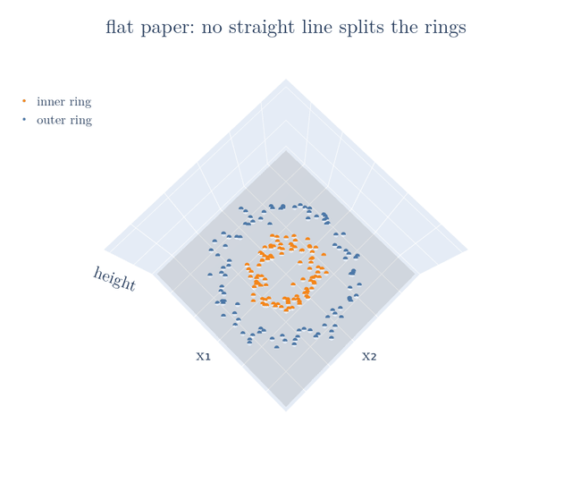
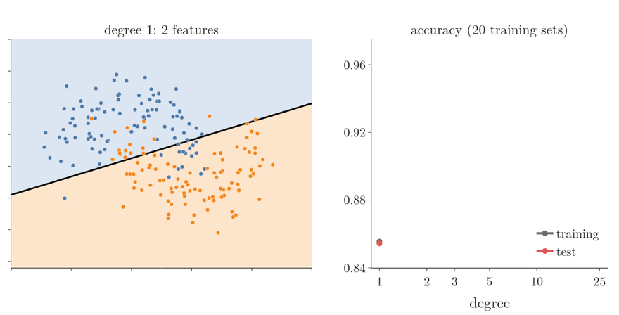
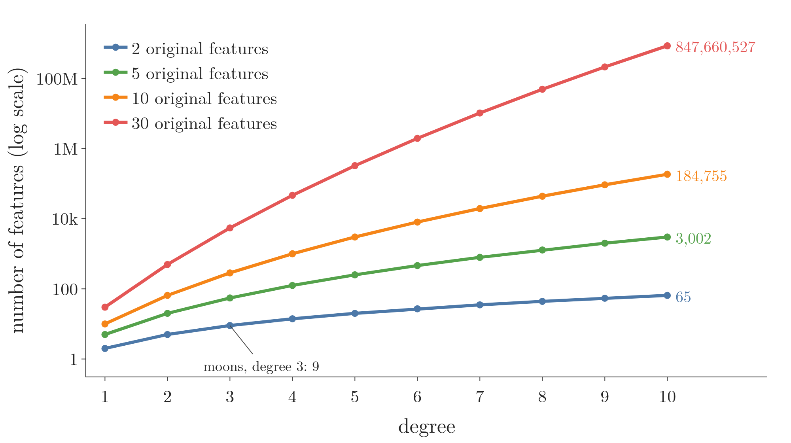

<!-- where-this-fits: generated by course_map/build_map.py; edit concepts.yaml, not this block -->
> **Where this fits:** Pipeline map step 8 (Model). See the [Course map](../../../00-course-map/00-course-map.md).
>
> 
>
> - **Compare with:** [Kernel trick](../../../ML/07-classification/ML-089-kernel-trick-intuition/ML-089-kernel-trick-intuition.md#3-the-kernel-trick).
<!-- /where-this-fits -->

## 1. Overview

> **Key point:** Logistic regression draws a straight boundary. Adding powers and products of the features as new features lets the same algorithm draw curved boundaries, just as polynomial regression did for linear regression.

[When logistic regression works](../ML-069-perceptron-trick/ML-069-perceptron-trick.md#2-when-logistic-regression-works) states a limitation: logistic regression works well only when the classes are (almost) **linearly separable** (G-1103): a straight line can split them. The **decision boundary** (G-555) is the line or curve where the model switches from predicting one class to the other. On data where the true decision boundary is curved, a straight line misclassifies many points.

In this Note each point is one **observation** (G-1374) (one record, a row of the data table). Its two coordinates $x_1$ and $x_2$ are its **features** (G-772) (input variables, one column each), and its class $y$ is the **target** (G-1949) (the output we predict).

Other algorithms handle such data naturally (decision trees, random forests, SVMs, covered later). But a simple trick also lets logistic regression handle it: polynomial features, the same idea as [polynomial regression](../../06-regression/ML-060-polynomial-regression/ML-060-polynomial-regression.md#1-overview).

## 2. The idea

> **Key point:** Create new features x₁², x₁x₂, x₂², ... and fit ordinary logistic regression on them. A straight boundary in the new features is a curve in the original ones.

### 2.1 The picture: lift the points

An everyday picture: a straight ruler cannot trace a circle on flat paper. Lift the paper into a bowl shape, and a flat cut through the bowl traces exactly that circle.

Figure 1 plays this out on two rings of points. Each point is lifted to the height $x_1^2 + x_2^2$, a value made from its own two features. Watch the inner ring stay low while the outer ring rises up the bowl, until one flat plane splits them.



Step by step, with two points of Figure 1:

| Point | $x_1$ | $x_2$ | $x_1^2$ | $x_2^2$ | Height $x_1^2 + x_2^2$ | Side of the plane at 0.51 |
|---|---|---|---|---|---|---|
| inner ring | $-0.12$ | $-0.56$ | 0.01 | 0.31 | 0.33 | below |
| outer ring | 0.39 | 0.87 | 0.15 | 0.76 | 0.91 | above |

1. **Make new features.** Square each feature: $x_1^2$ and $x_2^2$.
2. **Look at the data in the new features.** Every inner point has a height of at most 0.40 and every outer point at least 0.62, so the flat plane at height 0.51 separates the rings.
3. **Read the plane back in the original features.** The plane is $x_1^2 + x_2^2 = 0.51$: a circle of radius 0.71 in the $(x_1, x_2)$ plane.

A flat (linear) decision boundary in the new features is a curved decision boundary in the original ones. On these 200 points a straight line reaches a training accuracy (the share of training points classified correctly) of 0.49, and degree-2 features reach 1.00.

### 2.2 The formal version: polynomial features

Creating powers and products of the features as new features gives **polynomial features** (G-1513). With two features $x_1$ and $x_2$, degree 2 creates five feature columns:

$$x_1,\quad x_2,\quad x_1^2,\quad x_1 x_2,\quad x_2^2$$

The product $x_1 x_2$ belongs to the list: scikit-learn's `PolynomialFeatures` creates every product of the features up to the chosen degree, not only the powers of each feature on its own.

Logistic regression then learns a weight for each feature, so its decision boundary is

$$w_0 + w_1 x_1 + w_2 x_2 + w_3 x_1^2 + w_4 x_1 x_2 + w_5 x_2^2 = 0$$

The decision boundary equation describes a curve (an ellipse, parabola or hyperbola) in the $(x_1, x_2)$ plane. The circle of section 2.1 is the special case $w_3 = w_5 = 1$, $w_0 = -0.51$ and the other weights 0. Higher degrees add more terms ($x_1^3$, $x_1^2 x_2$, ...) and allow more complicated curves. The target $y$ is unchanged, and the model is still logistic regression: only its inputs have changed.

The number of features grows quickly with the degree: 2 at degree 1, 5 at degree 2, 9 at degree 3, 65 at degree 10 and 350 at degree 25. Section 4 shows how much faster it grows with more original features.

> **Python:** Logistic regression on polynomial features.
>
> ```python
> from sklearn.pipeline import make_pipeline
> from sklearn.preprocessing import PolynomialFeatures, StandardScaler
> from sklearn.linear_model import LogisticRegression
>
> model = make_pipeline(
>     PolynomialFeatures(degree=3, include_bias=False),
>     StandardScaler(),
>     LogisticRegression())
> model.fit(X, y)
> ```
>
> The scaler puts the power features on similar scales; without it, high powers such as $x^{10}$ dominate and the solver needs more steps (at degree 10 on the data below: 279 steps instead of 182).

## 3. An example: two half-moons

> **Key point:** On moon-shaped data, test accuracy rises from 0.854 with a straight line to 0.935 with degree 3, then falls at higher degrees while training accuracy keeps rising: overfitting.

The data has 200 points in two interlocking half-moon shapes (`make_moons` with noise 0.25). No straight line can separate them. Each model is scored on a large fresh test set of 5,000 points from the same generator. Regularisation is kept weak (`C=10000`) so that the effect of the degree is visible. The figure shows one training set; the table averages 20 training sets, so that one lucky or unlucky sample cannot decide the result.

In the left panel of Figure 2 the two pale colours are the model's two answers: blue where it predicts one moon, orange where it predicts the other; the black line between them is the decision boundary, and the dots are the training points. In the right panel, across is the degree and up is the accuracy (the share of points classified correctly) on the training points (grey) and on the large fresh test set (red). Figure 2 raises the degree one step per frame. Watch the decision boundary (black line) bend around the moons, and the two accuracy curves split apart after degree 3.



| Degree | Features | Training accuracy | Test accuracy | Gap |
|---|---|---|---|---|
| 1 | 2 | 0.855 | 0.854 | 0.001 |
| 2 | 5 | 0.859 | 0.855 | 0.005 |
| 3 | 9 | 0.947 | **0.935** | 0.012 |
| 4 | 14 | 0.947 | 0.928 | 0.020 |
| 10 | 65 | 0.962 | 0.919 | 0.043 |
| 25 | 350 | 0.962 | 0.917 | 0.045 |

- **Degree 1:** plain logistic regression, a straight line. The line misclassifies the tips of both moons.
- **Degree 2:** a gentle curve, little better.
- **Degrees 3 and 4:** the boundary bends around the moons. **Test accuracy** (G-2211) jumps to 0.93.
- **Degrees 10 and 25:** the boundary develops odd loops and islands far from the data. Training accuracy keeps rising, but test accuracy falls to about 0.92, and the gap between the two grows from 0.012 to 0.045.

As with polynomial regression, the degree controls flexibility. Too low a degree gives **underfitting** (G-2035): the boundary is too simple for the pattern. Too high a degree gives **overfitting** (G-1429): the boundary follows single training points. The degree is a **hyperparameter** (G-910), chosen by comparing scores on data not used for training. Here degree 3 is best.

> **Extra:** A penalty keeps the many weights small ([penalising large coefficients](../../06-regression/ML-062-ridge-regression-intuition/ML-062-ridge-regression-intuition.md#3-the-idea-penalise-large-coefficients)), so it fights the overfitting of high degrees. Same 20 training sets and test set:
>
> | C | Degree 3 test | Degree 10 test | Degree 25 test |
> |---|---|---|---|
> | 10,000 (weak) | 0.935 | 0.919 | 0.917 |
> | 10 (moderate) | 0.932 | **0.933** | 0.931 |
> | 1 (default, strong) | 0.899 | 0.915 | 0.914 |
>
> A moderate penalty lifts degree 10 from 0.919 to 0.933, and its train-test gap shrinks from 0.043 to 0.012. The default `C=1` is too strong for this data: even degree 3 underfits (0.899). So `C` is a second hyperparameter to tune alongside the degree.

## 4. When to use it

> **Key point:** Useful when only a linear model is available or interpretability matters. For strongly non-linear data, tree-based models or SVMs usually do better.

Polynomial features are a quick way to give logistic regression curved boundaries, and they work well for mildly non-linear data like this example. They have costs:

- the number of features explodes with many original features or high degrees, which slows training and invites overfitting;
- the degree must be tuned.

In Figure 3, across is the degree and up is the number of features. The vertical axis is a log scale: each labelled gridline (1, 100, 10k, 1M, 100M) is 100 times the one below, so a line that keeps climbing is growing very fast. Figure 3 shows the first cost. Watch the gap between the lines: with 2 features, degree 10 gives 65 features; with 10 features it gives 184,755; with 30 it gives about 850 million.

{height=40%}

On real data with strongly non-linear patterns, decision trees, random forests or SVMs (later Notes) usually reach better results with less effort.

## 5. Summary

- Logistic regression's boundary is straight; polynomial features make it curved, because a flat boundary in the new features is a curve in the original ones. So the same algorithm handles data that is not linearly separable.
- Degree $d$ adds all powers and products of the features up to total power $d$, so the feature count grows very fast with the degree and with the number of original features (65 at degree 10 from 2 features, 184,755 from 10).
- On the moons data: test accuracy 0.854 (straight line) rises to 0.935 (degree 3), then falls at higher degrees while training accuracy keeps rising, because a very flexible boundary starts to follow single training points: overfitting.
- Choose the degree on data not used for training, because training accuracy keeps rising and cannot show overfitting; standardise the new features, so high powers do not dominate; regularisation limits overfitting by keeping the many weights small.
- So polynomial features are a quick fix for mildly curved boundaries; for strongly non-linear data, trees or SVMs usually do better.

## 6. Sources

**Built from**

- CampusX, "Polynomial Features in Logistic Regression | Non Linear Logistic Regression | Logistic Regression 7", YouTube, https://www.youtube.com/watch?v=WnBYW_DX3sM

## 7. Key terms

| Term | Meaning |
|---|---|
| Polynomial features | New features made from powers and products of the original features |
| Decision boundary | The line or curve where the model switches from predicting one class to the other |
| make_moons (G-111) | scikit-learn function that creates two interlocking half-moon classes |
| Test accuracy (G-2211) | Accuracy on data not used for training, an estimate of performance on new data |
