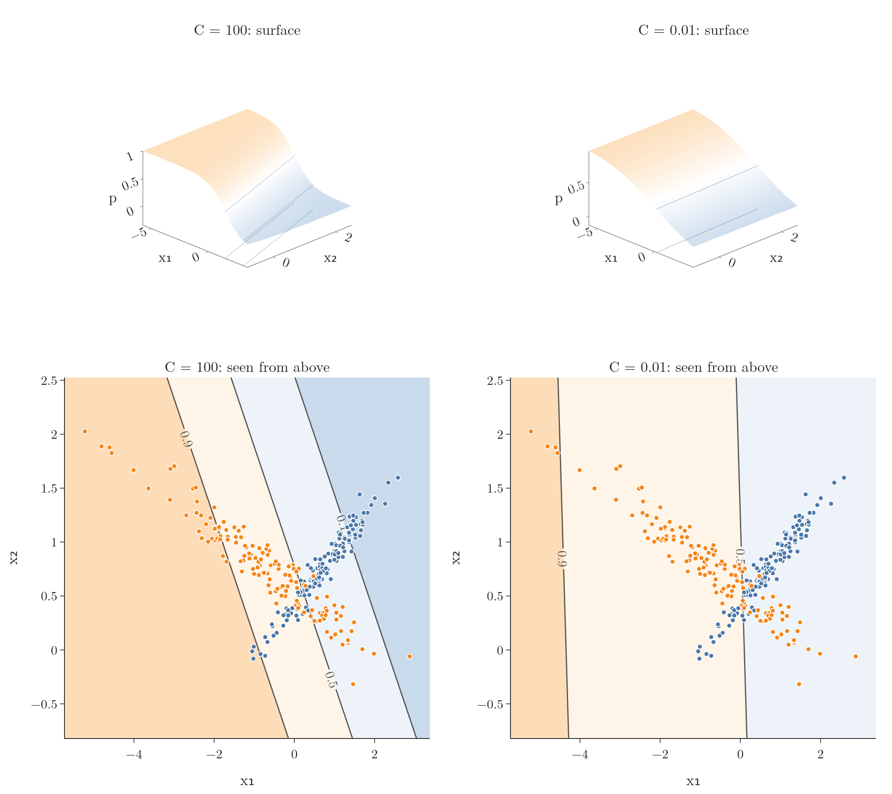
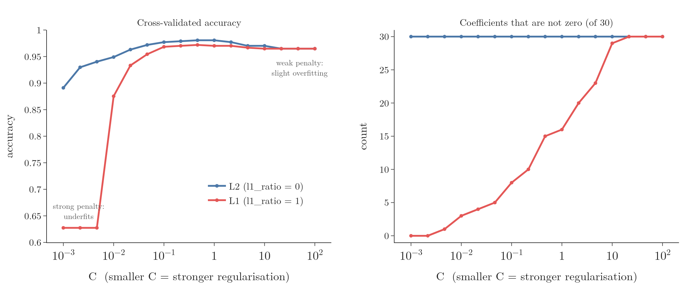
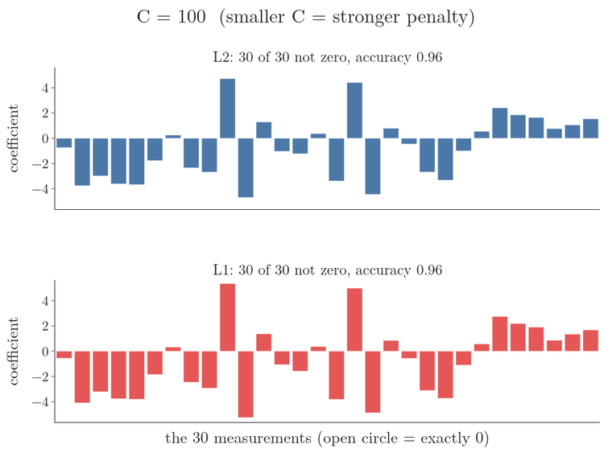
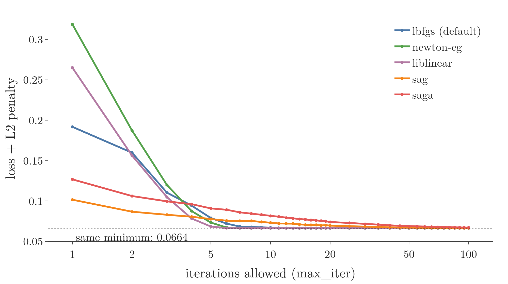
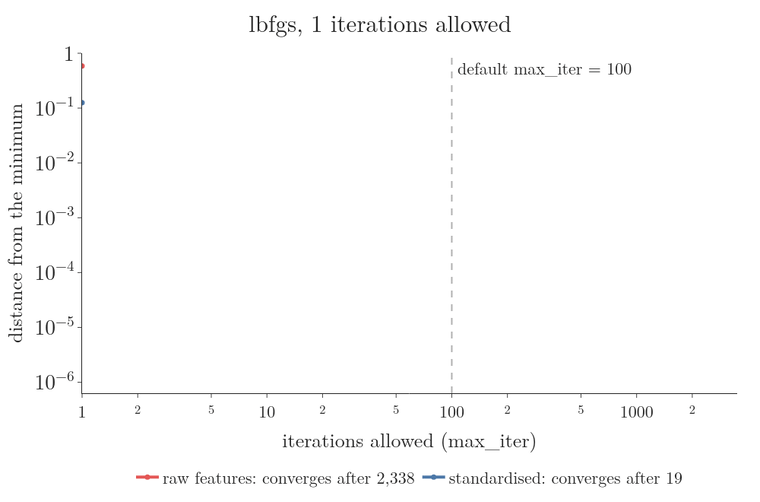
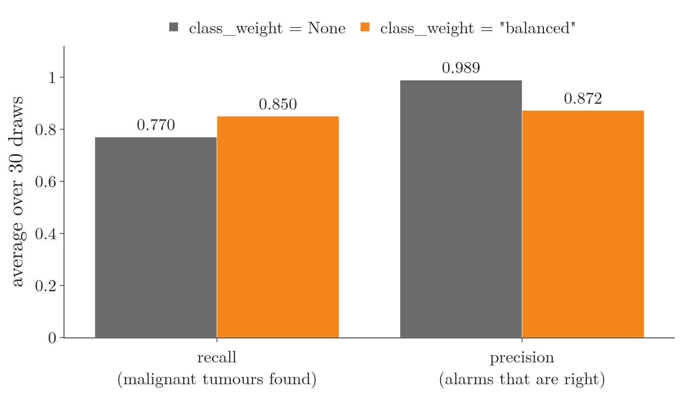
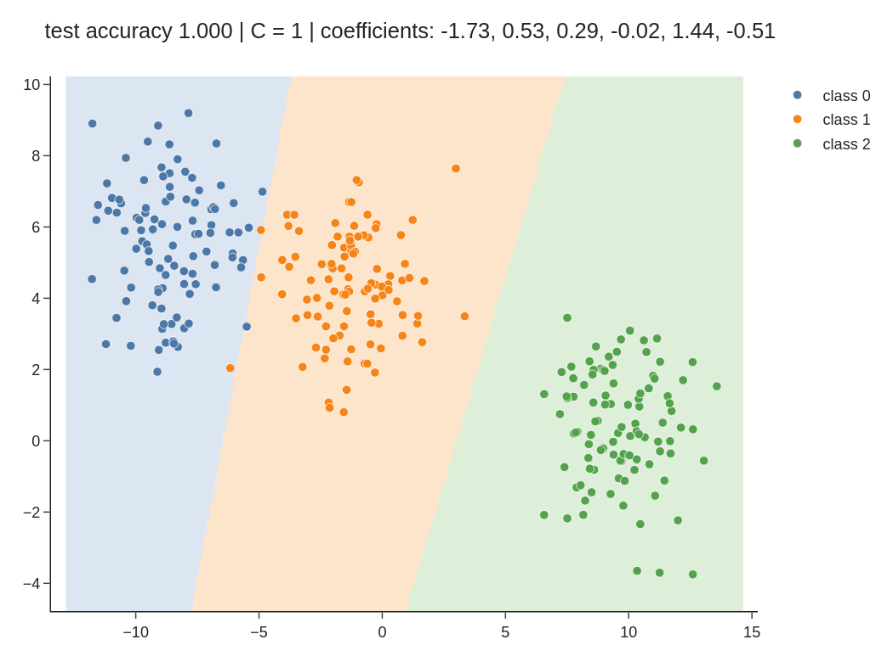

<!-- where-this-fits: generated by course_map/build_map.py; edit concepts.yaml, not this block -->
> **Where this fits:** Pipeline map step 10 (Tune). See the [Course map](../../../00-course-map/00-course-map.md).
>
> 
>
> - **Builds on:** [Overfitting](../../../ML/01-foundations/ML-007-challenges-in-ml/ML-007-challenges-in-ml.md#7-overfitting-and-underfitting).
> - **Leads to:** [Grid and random search](../../../ML/07-classification/ML-085-knn/ML-085-knn.md#33-train-predict-score); [Random forest](../../../ML/08-trees-and-ensembles/ML-102-random-forest-intro/ML-102-random-forest-intro.md#2-why-random-forests-are-so-popular); [AdaBoost](../../../ML/08-trees-and-ensembles/ML-109-adaboost-intuition/ML-109-adaboost-intuition.md#11-why-learn-adaboost); [Optuna](../../../ML/09-clustering-and-more/ML-128-optuna/ML-128-optuna.md#4-optunas-vocabulary); [Improving a neural network](../../../DL/02-training/DL-021-improving-a-neural-network/DL-021-improving-a-neural-network.md#1-overview); [Keras Tuner](../../../DL/03-optimizers/DL-039-keras-tuner/DL-039-keras-tuner.md#5-the-keras-tuner-workflow-choosing-the-optimizer).
<!-- /where-this-fits -->

## 1. Overview

> **Key point:** The settings that matter most are the regularisation (C and the L1/L2 mix), the solver, max_iter and class_weight. The rest can usually stay at their defaults.

scikit-learn's `LogisticRegression` has about fifteen **hyperparameters** (G-910): settings chosen before training, not learned from the data. This Note covers:

- what each one does;
- which ones are worth tuning;
- their effect on real data.

An interactive app at the end lets you change them and watch the decision boundary move.

> **Extra:** scikit-learn 1.8 changed how the penalty is chosen. The old `penalty="l1" / "l2" / "elasticnet" / "none"` setting is deprecated. The L1/L2 mix is now set with `l1_ratio` alone, and "no penalty" is `C=np.inf`. Older code and tutorials use `penalty`; this Note shows both.

## 2. Regularisation

> **Key point:** By default, logistic regression adds an L2 (Ridge) penalty. C is the inverse of its strength: a small C means strong regularisation.

### 2.1 The type of penalty

> **Key point:** l1_ratio = 0 is L2 (Ridge), 1 is L1 (Lasso), in between is Elastic Net; C = inf switches the penalty off.

The same three penalties as in [Ridge](../../06-regression/ML-062-ridge-regression-intuition/ML-062-ridge-regression-intuition.md#3-the-idea-penalise-large-coefficients), [Lasso](../../06-regression/ML-066-lasso-regression/ML-066-lasso-regression.md#2-one-feature-the-slope-reaches-exactly-0) and [Elastic Net](../../06-regression/ML-068-elastic-net/ML-068-elastic-net.md#2-the-loss-function) are available, and the mix is set by **l1_ratio** (G-1027), the L1 share of the penalty:

| Wanted | New way (1.8+) | Old way |
|---|---|---|
| L2 (Ridge), the default | `l1_ratio=0` | `penalty="l2"` |
| L1 (Lasso) | `l1_ratio=1` | `penalty="l1"` |
| Elastic Net | `0 < l1_ratio < 1` | `penalty="elasticnet"` |
| no penalty | `C=np.inf` | `penalty=None` |

On the breast-cancer data: 569 tumours, each one **observation** (G-1374) (one record, a row of the data table), with 30 **features** (G-772) (input variables, one column each: measurements of the tumour, standardised). The **target** (G-1949) (the output we predict) is malignant or benign. Scores come from 5-fold **cross-validation** (G-510):

| Setting | CV accuracy | Non-zero coefficients |
|---|---|---|
| no penalty | 0.956 | 30 |
| L2, C = 1 (default) | **0.981** | 30 |
| L1, C = 1 | 0.970 | 16 |
| Elastic Net, `l1_ratio=0.5`, C = 1 | 0.974 | 26 |

Without a penalty the model overfits slightly (and the solver stops at `max_iter` with a `ConvergenceWarning`). As in [why coefficients reach exactly 0](../../06-regression/ML-066-lasso-regression/ML-066-lasso-regression.md#7-why-coefficients-reach-exactly-0), L1 sets many coefficients to exactly zero: here it keeps 16 of the 30 measurements.

### 2.2 The strength: C

> **Key point:** C is 1/λ, where λ is the penalty strength of Ridge and Lasso. Smaller C: smaller coefficients and simpler boundaries; too small underfits. Larger C: closer to no penalty.

In plain words, **C** (G-337) says how much the model may trust the training data. A large C means "trust the data fully": the coefficients may grow as large as the data asks for. A small C means "do not trust the data much": the coefficients are held close to 0, whatever the data says.

The next animation shades the plane by the model's predicted probability, so first the surface behind it. For two features the model outputs the sigmoid ramp of [the sigmoid function](../ML-071-sigmoid-function/ML-071-sigmoid-function.md#4-the-sigmoid-function):

$$p = \sigma(w_0 + w_1 x_1 + w_2 x_2)$$

Here are two fits of the 300 points:

- at $C = 100$ the coefficients are $w_1 = -1.38$ and $w_2 = -1.25$, and the point $(0, 0)$ gets $p = 0.73$;
- at $C = 0.01$ they are $w_1 = -0.49$ and $w_2 = -0.04$, and $(0, 0)$ gets $p = 0.51$.

Figure 1 draws both surfaces. At $C = 100$ the surface is a steep ramp from low to high; at $C = 0.01$ the ramp is gentle. Seen from above, each surface is a [contour map](../../../MA/06-calculus/MA-062-partial-derivatives-and-gradients/MA-062-partial-derivatives-and-gradients.md#11-reading-a-contour-map): each line joins points with the same $p$ (0.1, 0.5, 0.9; at $C = 0.01$ the 0.1 line lies outside the plot, so only 0.5 and 0.9 show). Lines close together mean a steep ramp, lines far apart a gentle one. Orange is high $p$ (class 1), blue is low $p$. The 0.5 line is the decision boundary, and the strip between the 0.1 and 0.9 lines is the unsure band of the animation below.

Figure 2 shows this on 300 points with two features, with the default L2 penalty. C falls from 100 to 0.001. Watch the two coefficient bars on the right shrink, and the pale band on the left, where the model is unsure, grow wider.

1. **C = 100:** the coefficients are $-1.38$ and $-1.25$. The pale band is narrow: the model is sure about most points.
2. **C = 1 (the default):** a little smaller, $-1.32$ and $-0.99$.
3. **C = 0.01:** the coefficients are down to $-0.49$ and $-0.04$. The model has almost stopped using the second feature, so the boundary has turned nearly vertical, and the pale band covers most of the points.
4. **C = 0.001:** both coefficients are close to 0 ($-0.09$ and $-0.00$). Every point gets a probability near 0.5.

Formally: in Ridge and Lasso, the penalty strength was $\lambda$ (alpha). Logistic regression uses its inverse:

$$C = 1/\lambda$$

So the direction is reversed: **a smaller C means stronger regularisation**. Two instances:

A strong penalty, $\lambda = 100$:

$$C = 1/100 = 0.01$$

A weak penalty, $\lambda = 0.5$:

$$C = 1/0.5 = 2$$

The default is `C=1.0`.

The breast-cancer data shows what C does to the score (Figure 3). In Figure 3, C runs across on a log scale (each gridline is ten times the one before). The left panel shows the cross-validated accuracy (the average accuracy on held-out parts of the data) and the right panel counts how many of the 30 coefficients are not exactly zero; blue is the L2 penalty, red the L1 penalty.

{height=50%}

- With **L2** (blue), accuracy peaks around C = 0.3 to 1 (0.981). Very small C squeezes the coefficients so hard that accuracy falls to 0.89; very large C slightly overfits.
- With **L1** (red), small C sets more and more coefficients to zero (right panel). At C = 0.001 every coefficient is zero and the model just predicts the most common class (accuracy 0.63).

| C | CV accuracy (L2) | Largest coefficient |
|---|---|---|
| 0.001 | 0.891 | 0.095 |
| 0.1 | 0.977 | 0.597 |
| 1 | 0.981 | 1.321 |
| 100 | 0.963 | 7.696 |

Figure 4 lowers C from 100 to 0.001 and shows all 30 coefficients at each step. Watch the L2 bars (top) shrink together while staying non-zero, and the L1 bars (bottom) vanish one by one into open circles, exact zeros.

{height=60%}

C is the hyperparameter most worth tuning, typically by trying values spaced by factors of 10 with cross-validation ([grid search](../../08-trees-and-ensembles/ML-106-random-forest-tuning/ML-106-random-forest-tuning.md#6-grid-search-over-a-random-forest)).

## 3. The solver

> **Key point:** The solver is the optimisation method. Each one supports only some penalties; lbfgs, the default, does L2 or no penalty.

Our own gradient descent ([the code](../ML-074-logistic-gradient-descent/ML-074-logistic-gradient-descent.md#7-the-code)) was one way to minimise the log loss. scikit-learn offers several faster methods, called **solvers** (G-1836):

| Solver | L2 | L1 | Elastic Net | None | Notes |
|---|---|---|---|---|---|
| `lbfgs` (default) | yes | | | yes | good general choice |
| `newton-cg` | yes | | | yes | |
| `newton-cholesky` | yes | | | yes | fast when observations far outnumber features |
| `liblinear` | yes | yes | | | small data; two classes only (wrap in `OneVsRestClassifier` for more); also penalises the intercept, which the others do not |
| `sag` | yes | | | yes | large data; needs features on similar scales |
| `saga` | yes | yes | yes | yes | large data; the only one for Elastic Net |

Asking for a combination that is not supported raises an error, for example `LogisticRegression(l1_ratio=1, solver="lbfgs")` fails with "Solver lbfgs supports only 'l2' or None penalties". For L1 use `liblinear` or `saga`; for Elastic Net use `saga`.

A **solver** is the algorithm that searches for the best coefficients, step by step, like the gradient descent of the earlier Notes. In Figure 5, across is the number of iterations (steps) allowed and up is how high the quantity being minimised still is, so a line that falls fast has found a good answer in few steps. Figure 5 runs five solvers on the standardised breast-cancer data with the default L2 penalty, C = 1. Each point is a fresh fit stopped after k iterations, scored by the quantity every solver minimises: the log loss plus the L2 penalty. In Figure 5, the lines start from different heights and fall at different speeds, but all five end on the same dotted line, 0.0664: the solver changes the route to the minimum, not the minimum itself.

{height=40%}

## 4. Training settings

> **Key point:** max_iter and tol control when the solver stops; raise max_iter if a ConvergenceWarning appears.

| Setting | Default | Meaning |
|---|---|---|
| `max_iter` | 100 | the maximum number of solver iterations (like epochs) |
| `tol` | 0.0001 | stop when an iteration improves the result by less than this |
| `warm_start` | False | if True, a second `fit` starts from the previous coefficients instead of from scratch |
| `verbose` | 0 | print progress while training |
| `n_jobs` | None | has no effect; deprecated since 1.8 |
| `random_state` | None | seed for solvers that shuffle the data (`sag`, `saga`, `liblinear`) |

If scikit-learn prints a **ConvergenceWarning** (G-473), the solver stopped at `max_iter` before reaching the minimum. The fixes are to standardise the features, raise `max_iter`, or both. Lowering `tol` is rarely needed.

In Figure 6, across is the number of iterations the solver is allowed and up is how far the coefficients still are from the best ones, on a log scale (each gridline is ten times closer than the one above). Figure 6 shows why standardising helps, on the breast-cancer data with the default `lbfgs`. The y-axis is the distance from the minimum after k iterations. On standardised features (blue), the distance reaches the floor of the plot after 19 iterations. On the raw features (red), whose standard deviations differ by a factor of about 200,000 between columns, `lbfgs` needs 2,338 iterations. In Figure 6, the red line is still far from the minimum at the dashed line, the default `max_iter = 100`, so the fit stops there with a ConvergenceWarning.

## 5. Other settings

> **Key point:** class_weight="balanced" helps on imbalanced classes; fit_intercept, dual and intercept_scaling rarely need changing.

| Setting | Default | Meaning |
|---|---|---|
| `class_weight` | None | `"balanced"` gives rare classes more weight in the loss |
| `fit_intercept` | True | learn the intercept $w_0$; almost always leave it on |
| `dual` | False | an alternative formulation for `liblinear` with L2, useful only when features outnumber observations |
| `intercept_scaling` | 1 | a technical setting for `liblinear` only |

### 5.1 class_weight

> **Key point:** On real data with 5% positives, "balanced" raised recall from 0.77 to 0.85, at some cost in precision.

On imbalanced data ([when accuracy misleads](../ML-075-accuracy-confusion-matrix/ML-075-accuracy-confusion-matrix.md#6-when-accuracy-misleads-imbalanced-data)), the loss is dominated by the common class, so the model tends to neglect the rare one. The **class_weight** (G-391) setting `class_weight="balanced"` multiplies each observation's loss by a weight inversely proportional to its class's frequency, so mistakes on the rare class count more.

An everyday picture: if an exam has one rare question type worth the same marks as the rest, a student can skip it and still score well. Give that question type extra marks, and skipping it becomes costly.

To test this on real data, we make the breast-cancer data imbalanced: all 357 benign tumours plus 20 malignant ones drawn at random, so 5% are positive. Half is used for training and half for testing (10 malignant in each test set). The results are averaged over 30 random draws:

| class_weight | Recall | Precision |
|---|---|---|
| None | 0.770 | 0.989 |
| `"balanced"` | 0.850 | 0.872 |

{height=36%}

In Figure 7, the orange bars show the trade. The weighted model finds more of the rare malignant tumours (**recall** (G-1641) up by 0.08), but also raises more false alarms (**precision** (G-1547) down by 0.12). Weighting trades precision for recall, so check both, and choose by which mistake costs more ([precision and recall](../ML-076-precision-recall-f1/ML-076-precision-recall-f1.md#2-precision)).

The `"balanced"` weight of each class is $n / (k \times n_c)$: the number of observations $n$, over the number of classes $k$ times that class's count $n_c$ (scikit-learn docs). For a training half of $n = 188$ observations with $k = 2$ classes, 10 malignant and 178 benign (the split used above):

$$\text{malignant weight} = 188 / (2 \times 10) = 9.4$$

$$\text{benign weight} = 188 / (2 \times 178) = 0.53$$

Each malignant mistake therefore counts about 18 times as much as a benign one.

## 6. Multi-class settings

> **Key point:** With three or more classes, LogisticRegression uses softmax automatically; one-vs-rest needs OneVsRestClassifier.

Older versions had a `multi_class` setting (`"ovr"`, `"multinomial"`, `"auto"`). The setting has been removed: with three or more classes, all solvers except `liblinear` now fit [the softmax model](../ML-078-softmax-regression/ML-078-softmax-regression.md#2-the-softmax-function), and `liblinear` raises an error (scikit-learn docs, `LogisticRegression`). For one-vs-rest, wrap the model: `OneVsRestClassifier(LogisticRegression())`.

## 7. An interactive playground

> **Key point:** app.py lets you change the dataset, penalty, C, solver, l1_ratio and max_iter and see the decision regions update.

The folder of this Note contains `app.py`, a small Dash app. Run `python app.py` and open `http://127.0.0.1:8050`.

<!-- playground: images/logistic_playground.html -->

{height=45%}

Things to try:

- **C** from 3 down to $-3$ (that is, $10^3$ to $10^{-3}$) with L2: the boundaries stay straight but the coefficients shrink and the model becomes less sure.
- **L1 with small C**: one of the two coefficients drops to exactly 0, and the boundary becomes vertical or horizontal (the model uses only one feature).
- **Penalty L1 with solver lbfgs**: the app shows the "not allowed" error.
- **max_iter = 10**: the solver stops early and the boundary is not yet in place.

## 8. Summary

| Hyperparameter | Default | Tune it? |
|---|---|---|
| `C` | 1.0 | yes: the most important; smaller = stronger regularisation |
| `l1_ratio` (old `penalty`) | 0 (L2) | sometimes: 1 for feature selection, between for Elastic Net |
| `solver` | `lbfgs` | only to allow L1/Elastic Net or for very large data |
| `max_iter` | 100 | raise it if a ConvergenceWarning appears |
| `class_weight` | None | `"balanced"` for imbalanced classes |
| others | | rarely |

## 9. Sources

**Built from**

- CampusX, "Logistic Regression Hyperparameters || Logistic Regression Part 8", YouTube, https://www.youtube.com/watch?v=ay_OcblJasE

**Other references**

- **scikit-learn docs:** `sklearn.linear_model.LogisticRegression` (penalty, l1_ratio, C, solver, n_jobs, class_weight), scikit-learn 1.9.

## 10. Key terms

| Term | Meaning |
|---|---|
| C (G-337) | The inverse of the regularisation strength in LogisticRegression; smaller C means stronger regularisation |
| l1_ratio | The share of the penalty that is L1: 0 is Ridge, 1 is Lasso, in between is Elastic Net |
| Solver | The optimisation method used to find the coefficients |
| lbfgs | The default solver of LogisticRegression; supports L2 or no penalty |
| saga | A stochastic solver that supports every penalty, including Elastic Net |
| ConvergenceWarning | A warning that the solver stopped at max_iter before reaching the minimum |
| class_weight | A setting that weights each class's mistakes in the loss; "balanced" helps rare classes |
| Recall (G-1641) | The share of actual positives that the model finds |
| Precision | The share of predicted positives that are actually positive |
| Dash | A Python library for building interactive web apps with Plotly charts |
