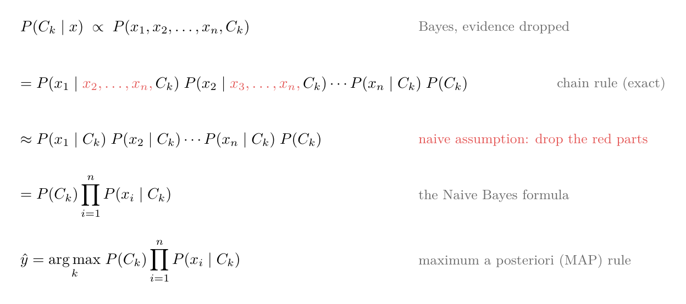
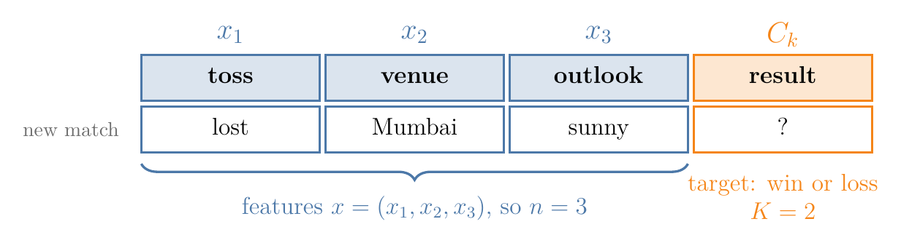
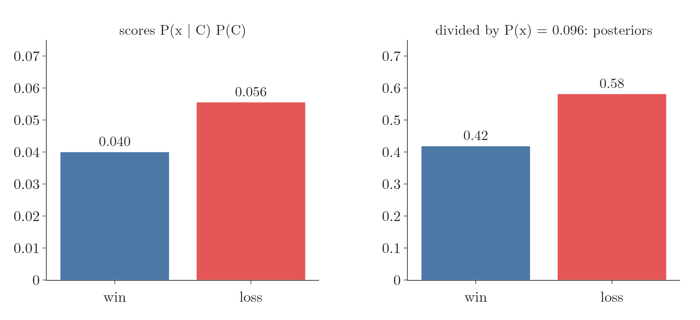
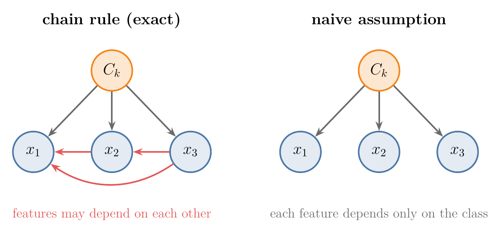
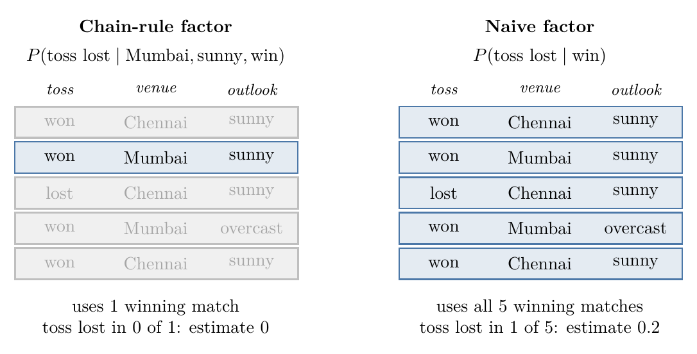

<!-- where-this-fits: generated by course_map/build_map.py; edit concepts.yaml, not this block -->
> **Where this fits:** Pipeline map step 8 (Model). See the [Course map](../../../00-course-map/00-course-map.md).
>
> 
>
> - **Builds on:** [Classification problems](../../../ML/01-foundations/ML-003-types-of-ml/ML-003-types-of-ml.md#1-overview); [Probability density function (PDF)](../../../ML/02-getting-data/ML-019-univariate-analysis/ML-019-univariate-analysis.md#7-density-plot); [Independent and mutually exclusive events](../../../MA/02-probability/MA-016-independent-events/MA-016-independent-events.md#5-independent-or-not); [Bayes' theorem](../../../MA/02-probability/MA-018-bayes-theorem/MA-018-bayes-theorem.md#1-overview); [Normal distribution](../../../MA/03-distributions/MA-020-random-variables-and-distributions/MA-020-random-variables-and-distributions.md#6-famous-distributions).
<!-- /where-this-fits -->

## 1. Overview

> **Key point:** To score a class, start with how common the class is, then multiply by how often each observed feature value occurs inside that class. The class with the bigger score is the prediction.

The previous Note used the Naive Bayes recipe on a small example. This Note derives it in general, step by step, and makes the "naive" assumption precise.

**The recipe first, on the cricket numbers.** The new match has toss lost, venue Mumbai and weather sunny. Of the 8 past matches, 5 were wins and 3 were losses. Each score is the **prior** ([the share of all matches that fall in the class, G-1565](../../../MA/02-probability/MA-018-bayes-theorem/MA-018-bayes-theorem.md#3-the-names-of-the-four-parts)) times three feature fractions, one factor per line:

| Step | Win | Loss |
|---|---|---|
| Start: share of matches in the class | 5/8 = 0.625 | 3/8 = 0.375 |
| × share of the class with toss lost | × 1/5 = 0.2 | × 2/3 = 0.667 |
| × share of the class played in Mumbai | × 2/5 = 0.4 | × 2/3 = 0.667 |
| × share of the class played in sunny weather | × 4/5 = 0.8 | × 1/3 = 0.333 |
| Score after all four factors | 0.040 | 0.056 |

Loss has the larger score, so the prediction is loss. The rest of the Note shows why this product is the right thing to compute, and when it is not. The scores are later turned into **posteriors** (G-1536; the probability of each class after seeing the features). The formal name for the recipe is the **maximum a posteriori (MAP) rule** (G-1157), and the derivation is summarised in Figure 1.

{height=42%}

## 2. Notation

> **Key point:** Features x = (x₁, ..., xₙ); K classes, C₁ to Cₖ for k up to K.

- An **observation** (G-1374; one record, a row of the data table) has $n$ **features** (G-772; input variables, one column each), with values $x = (x_1, x_2, \dots, x_n)$. In the cricket example, $n = 3$: toss, venue and outlook.
- The **target** (G-1949; the output we predict) is one of $K$ classes, $C_1, \dots, C_K$. In the cricket example, $K = 2$: win and loss.

The goal: for each class $C_k$, compute $P(C_k \mid x)$, then pick the largest.

{width=90%}

Figure 2 puts the symbols on the cricket table: each feature column is one $x_i$, and the result column holds the class.

## 3. Step 1: Bayes' theorem without the evidence

> **Key point:** P(Cₖ | x) is proportional to P(x | Cₖ) P(Cₖ) = P(x₁, ..., xₙ, Cₖ).

We want the probability of each class given the features. Bayes' theorem turns that question round, into the probability of the features given the class, which the training data can count:

$$P(C_k \mid x) = \frac{P(x \mid C_k)\thinspace P(C_k)}{P(x)}$$

The **evidence** $P(x)$ ([G-718; the probability of the features on their own](../../../MA/02-probability/MA-018-bayes-theorem/MA-018-bayes-theorem.md#3-the-names-of-the-four-parts)) is the same for every class, so it does not affect which class is largest ([comparing posteriors](../ML-081-naive-bayes-intuition/ML-081-naive-bayes-intuition.md#4-the-strategy-compare-posteriors)). Dropping it, we write $\propto$, "is **proportional to**" (G-1584):

$$P(C_k \mid x) \propto P(x \mid C_k)\thinspace P(C_k)$$

Figure 3 checks this on the cricket scores of Section 1. The two scores are 0.040 for win and 0.056 for loss. Dividing both by their sum, the evidence 0.096, gives the posteriors 0.42 and 0.58: the bars change height but not order.

From the [proof of Bayes' theorem](../../../MA/02-probability/MA-018-bayes-theorem/MA-018-bayes-theorem.md#42-the-proof), $P(x \mid C_k) P(C_k) = P(x \cap C_k)$, the probability of the features and the class together. Writing the features out, with commas meaning "and":

$$P(C_k \mid x) \propto P(x_1, x_2, \dots, x_n, C_k)$$

## 4. Step 2: the chain rule

> **Key point:** Peel off one variable at a time with P(A, B) = P(A | B) P(B). The rule is exact.

The probability of all the features and the class together is hard to count directly. The [multiplication rule of conditional probability](../../../MA/02-probability/MA-015-conditional-probability/MA-015-conditional-probability.md#5-the-multiplication-rule), $P(A \cap B) = P(A \mid B)\thinspace P(B)$, splits it into smaller pieces, one variable at a time. Check it on two events, "win" and "toss lost". The chance of a win is 5 of the 8 matches, and among the 5 wins the toss was lost once:

$$P(\text{win}) = \frac{5}{8}$$

$$P(\text{toss lost} \mid \text{win}) = \frac{1}{5}$$

$$P(\text{toss lost}, \text{win}) = P(\text{toss lost} \mid \text{win}) \times P(\text{win})$$
$$= \frac{1}{5} \times \frac{5}{8}$$
$$= \frac{1}{8}$$

Counting directly agrees: 1 of the 8 matches is a win after a lost toss.

**Written out for the cricket match.** Here $n = 3$, with $x_1$ = toss lost, $x_2$ = Mumbai, $x_3$ = sunny, and $C_k$ = win. Each line peels off one feature:

$$P(x_1, x_2, x_3, \text{win})$$
$$= P(x_1 \mid x_2, x_3, \text{win}) \times P(x_2, x_3, \text{win})$$

$$P(x_2, x_3, \text{win}) = P(x_2 \mid x_3, \text{win}) \times P(x_3, \text{win})$$

$$P(x_3, \text{win}) = P(x_3 \mid \text{win}) \times P(\text{win})$$

Substituting the lower lines into the top one gives three conditional factors and the prior:

$$P(x_1, x_2, x_3, \text{win})$$
$$= P(x_1 \mid x_2, x_3, \text{win})$$
$$\times P(x_2 \mid x_3, \text{win})$$
$$\times P(x_3 \mid \text{win})$$
$$\times P(\text{win})$$

**The same for any $n$.** Apply the rule with $A = x_1$ and $B = (x_2, \dots, x_n, C_k)$. The dots ($\dots$) stand for the features in between; for $n = 3$ the list $(x_2, \dots, x_n)$ is just $(x_2, x_3)$:

$$P(x_1, \dots, x_n, C_k)$$
$$= P(x_1 \mid x_2, \dots, x_n, C_k)$$
$$\times P(x_2, \dots, x_n, C_k)$$

The last factor has the same form with one variable fewer, so apply the rule again, with $A = x_2$:

$$P(x_2, \dots, x_n, C_k)$$
$$= P(x_2 \mid x_3, \dots, x_n, C_k)$$
$$\times P(x_3, \dots, x_n, C_k)$$

Repeating until only $x_n$ and $C_k$ are left, and finally $P(x_n, C_k) = P(x_n \mid C_k)\thinspace P(C_k)$:

$$P(x_1, \dots, x_n, C_k)$$
$$= P(x_1 \mid x_2, \dots, x_n, C_k)$$
$$\times P(x_2 \mid x_3, \dots, x_n, C_k)$$
$$\cdots$$
$$\times P(x_n \mid C_k)$$
$$\times P(C_k)$$

This repeated splitting is the **chain rule of probability** (G-369). Nothing has been assumed yet: the chain rule is exact.

## 5. Step 3: the naive assumption

> **Key point:** Assume each feature depends only on the class, not on the other features: P(xᵢ | other features, Cₖ) = P(xᵢ | Cₖ).

The factors of the chain rule are hard to estimate. For the cricket match, $P(x_1 \mid x_2, x_3, C_k)$ is "the probability the toss was lost, given the venue was Mumbai, the weather was sunny and the match was won". Few or no training observations match all those conditions, so the estimate is 0 or unreliable ([the problem with specific combinations](../ML-081-naive-bayes-intuition/ML-081-naive-bayes-intuition.md#6-the-problem-specific-combinations-are-rare)).

Naive Bayes assumes **conditional independence** (G-443): once the class is known, each feature is independent of the others. In symbols, for any features,

$$P(x_i \mid x_{i+1}, \dots, x_n, C_k) = P(x_i \mid C_k)$$

Conditional independence is the [independence of two events](../../../MA/02-probability/MA-016-independent-events/MA-016-independent-events.md#2-the-definition), $P(A \mid B) = P(A)$ (knowing $B$ does not change the chance of $A$), but holding **within each class**. Every chain-rule factor loses its other features (the red parts in Figure 1):

$$P(x_1, \dots, x_n, C_k)$$
$$\approx P(x_1 \mid C_k)\thinspace P(x_2 \mid C_k)$$
$$\cdots P(x_n \mid C_k)\thinspace P(C_k)$$

{width=90%}

Figure 4 shows what the assumption removes: the red links between features. Each remaining factor needs only one feature and the class, which the training data can count reliably.

### 5.1 One factor, checked on the cricket data

> **Key point:** The chain-rule factor rests on 1 match; the naive factor rests on 5.

Take the first factor for the class win, with the query of the [cricket example](../ML-081-naive-bayes-intuition/ML-081-naive-bayes-intuition.md#3-the-data) (toss lost, Mumbai, sunny).

1. **The chain-rule factor** is $P(\text{toss lost} \mid \text{Mumbai}, \text{sunny}, \text{win})$. Only the wins played in Mumbai in sunny weather count. There is 1 such match, and its toss was won. The estimate comes from a single match:
   $$0/1 = 0$$
2. **The naive factor** is $P(\text{toss lost} \mid \text{win})$. All 5 wins count, and the toss was lost in 1 of them:
   $$1/5 = 0.2$$

{width=85%}

Figure 5 shows the rows each estimate uses. The chain-rule factor is exact in principle, but one match cannot give a reliable estimate, and a 0 wipes out the whole product. The naive factor gives up exactness and gains data: every factor is counted over all the matches of the class.

## 6. The formula and the MAP rule

> **Key point:** Score each class by P(Cₖ) Π P(xᵢ | Cₖ) and predict the largest: the maximum a posteriori rule.

Written with a product sign. $\prod_{i=1}^{n}$ means "multiply the terms for $i = 1$, then $i = 2$, up to $i = n$", just as $\sum$ means add. For the cricket match with $n = 3$ and class win:

$$\prod_{i=1}^{3} P(x_i \mid \text{win})$$
$$= P(x_1 \mid \text{win}) \times P(x_2 \mid \text{win})$$
$$\times P(x_3 \mid \text{win})$$
$$= 0.2 \times 0.4 \times 0.8 = 0.064$$

$$P(\text{win}) \times 0.064$$
$$= 0.625 \times 0.064 = 0.040$$

The general formula is the same calculation with $k$ and $n$ left open:

$$P(C_k \mid x) \propto P(C_k) \prod_{i=1}^{n} P(x_i \mid C_k)$$

To get actual probabilities, divide by the sum over all classes. Call that sum $Z$; it equals the evidence $P(x)$:

$$P(C_k \mid x) = \frac{1}{Z} P(C_k) \prod_i P(x_i \mid C_k)$$

On the cricket match:

$$Z = 0.040 + 0.056 = 0.096$$

$$P(\text{win} \mid x) = \frac{0.040}{0.096} = 0.42$$
$$P(\text{loss} \mid x) = \frac{0.056}{0.096} = 0.58$$

The prediction is the class with the largest posterior:

$$\hat{y} = \underset{k \in \lbrace1, \dots, K\rbrace}{\arg\max}\thickspace P(C_k) \prod_{i=1}^{n} P(x_i \mid C_k)$$

(**$\arg\max$** (G-210) means "the $k$ that gives the maximum".) This is the **maximum a posteriori (MAP) rule** (G-1157). On the cricket example, it gives 0.040 for win and 0.056 for loss, so $\hat{y}$ = loss.

Figure 6 is a line chart of the two running scores, blue for win and red for loss. The horizontal axis lists the factors in order; the vertical axis is the score so far. The axis is logarithmic: each step up multiplies the value by the same amount, so multiplying by a factor always moves a point down by a distance that depends only on the factor. Each frame multiplies in one more factor, for a match where the toss was lost, the venue was Mumbai and the weather sunny. Win starts ahead on its prior, 5/8 against 3/8. The second factor turns it round: only 1 of the 5 wins came after a lost toss, against 2 of the 3 losses. From there on loss stays ahead.

## 7. When the assumption fails

> **Key point:** The chain rule is exact; the naive product is only exact when the features really are independent within each class. Strongly related features get counted twice.

A simulation with two binary features (each 0 or 1) and 200,000 observations shows the difference. Each entry is the probability, within class $C$, that both features equal 1:

| Features within a class | Exact $P(x_1, x_2 \mid C)$ | Chain rule | Naive product |
|---|---|---|---|
| independent | 0.476 | 0.476 | 0.477 |
| $x_2$ is a copy of $x_1$ | 0.800 | 0.800 | 0.639 |

When the features are independent, the naive product matches. When $x_2$ simply repeats $x_1$, the naive product multiplies the same evidence twice and is wrong.

An everyday picture: two friends tell us the same rumour, but both read it in the same newspaper. The rumour feels twice as certain, yet we have only one source.

{height=40%}

Figure 7 is a bar chart. The horizontal axis counts how many identical copies of the "toss" column the model is given; each bar is the probability the model gives to loss (toss lost, Mumbai, sunny). Each extra copy of the "toss" feature pushes $P(\text{loss})$ further, from 58% with one copy to 99.4% with five, although no new information was added.

In practice, Naive Bayes often still picks the right class even when its independence assumption is wrong, because only the **order** of the scores matters for the prediction. Its probabilities, however, tend to be too extreme, so they should not be trusted as exact (Domingos and Pazzani 1997; scikit-learn user guide §1.9).

> **Extra:** Multiplying many probabilities, each below 1, produces very small numbers (the [problem with products](../ML-072-log-loss/ML-072-log-loss.md#41-the-problem-with-products)). Implementations therefore add logarithms instead:
>
> $$\log P(C_k) + \sum_i \log P(x_i \mid C_k)$$
>
> The largest sum identifies the same class.

## 8. Summary

| Step | Result |
|---|---|
| Bayes, drop the evidence | $P(C_k \mid x) \propto P(x_1, \dots, x_n, C_k)$ |
| Chain rule (exact) | $\prod_i P(x_i \mid x_{i+1}, \dots, x_n, C_k) \times P(C_k)$ |
| Naive assumption | $P(x_i \mid \dots, C_k) = P(x_i \mid C_k)$ |
| Formula | $P(C_k) \prod_i P(x_i \mid C_k)$ |
| MAP rule | predict $\arg\max_k$ of the formula |

## 9. Sources

**Built from**

- CampusX, "Naive Bayes Classifier | Part 7 | Mathematics behind Naive Bayes Algorithm", YouTube, https://www.youtube.com/watch?v=2PVRG45eVrY

**Other references**

- **Domingos and Pazzani 1997:** Domingos, P. and Pazzani, M. "On the Optimality of the Simple Bayesian Classifier under Zero-One Loss." *Machine Learning* 29, 103–130, 1997.
- **scikit-learn user guide:** Section 1.9, "Naive Bayes", scikit-learn 1.9.

## 10. Key terms

| Term | Meaning |
|---|---|
| Chain rule of probability | Writing a joint probability as a product of conditional probabilities, one variable at a time |
| Conditional independence | Independence that holds once a third variable (here the class) is known |
| Proportional to (∝) | Equal up to a constant factor that is the same for every class |
| arg max | The value of the variable that makes an expression largest |
| MAP rule | Maximum a posteriori: predict the class with the largest posterior probability |
