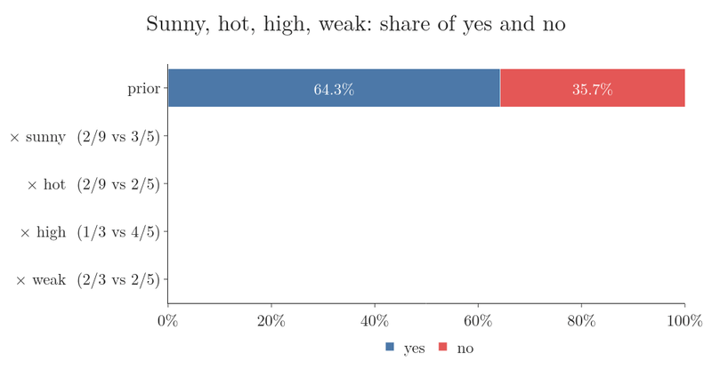

<!-- where-this-fits: generated by course_map/build_map.py; edit concepts.yaml, not this block -->
> **Where this fits:** Pipeline map step 8 (Model). See the [Course map](../../../00-course-map/00-course-map.md).
>
> 
>
> - **Builds on:** [Classification problems](../../../ML/01-foundations/ML-003-types-of-ml/ML-003-types-of-ml.md#1-overview); [Probability density function (PDF)](../../../ML/02-getting-data/ML-019-univariate-analysis/ML-019-univariate-analysis.md#7-density-plot); [Independent and mutually exclusive events](../../../MA/02-probability/MA-016-independent-events/MA-016-independent-events.md#5-independent-or-not); [Bayes' theorem](../../../MA/02-probability/MA-018-bayes-theorem/MA-018-bayes-theorem.md#1-overview); [Normal distribution](../../../MA/03-distributions/MA-020-random-variables-and-distributions/MA-020-random-variables-and-distributions.md#6-famous-distributions).
<!-- /where-this-fits -->

## 1. Overview

> **Key point:** Training Naive Bayes means building a lookup table of probabilities by counting. Predicting means looking up one probability per feature and multiplying.

[The intuition](../ML-081-naive-bayes-intuition/ML-081-naive-bayes-intuition.md#2-the-method-on-one-picture) and [the formula](../ML-082-naive-bayes-maths/ML-082-naive-bayes-maths.md#6-the-formula-and-the-map-rule) of Naive Bayes (a classifier that scores each class by multiplying one probability per feature) are applied here to a classic toy dataset, **Play Tennis**, in Python: first by hand with pandas, then with scikit-learn.

This Note covers:

- the data and the question (section 2);
- the two phases, training and testing (section 3);
- training: building the lookup table by counting (section 4);
- testing: looking up and multiplying (section 5);
- a practical problem, the **zero-frequency problem** (G-2149) (section 6);
- its standard fix, Laplace smoothing, and scikit-learn's `CategoricalNB` (section 7).

## 2. The data

> **Key point:** 14 days, four weather features, and whether tennis was played (9 yes, 5 no).

Each day is one **observation** (one record, a row of the data table). Each has four **features** (input variables, one column each):

- **outlook:** sunny, overcast, rain;
- **temperature:** hot, mild, cool;
- **humidity:** high, normal;
- **wind:** weak, strong.

The **target** (the output we predict) is **play** (yes or no). Tennis was played on 9 of the 14 days.

The question: on a day that is sunny, hot, high-humidity with weak wind, will tennis be played?

From [the formula](../ML-082-naive-bayes-maths/ML-082-naive-bayes-maths.md#6-the-formula-and-the-map-rule), each class gets a score: its **prior** (G-1565; how common the class is, here $P(\text{yes})$ is the share of days with tennis) multiplied by one **likelihood** (G-1086; how often a feature value occurs within the class) per feature. The bar in $P(\text{sunny} \mid \text{yes})$ reads "given": the probability of sunny among the days with tennis (see [the notation](../ML-082-naive-bayes-maths/ML-082-naive-bayes-maths.md#2-notation)).

$$\text{score(yes)} = P(\text{yes})$$
$$\qquad \times P(\text{sunny} \mid \text{yes}) \times P(\text{hot} \mid \text{yes})$$
$$\qquad \times P(\text{high} \mid \text{yes}) \times P(\text{weak} \mid \text{yes})$$

The score for "no" has the same form. We predict the class with the larger score, which is the **MAP rule** (G-1157; maximum a posteriori: pick the class with the largest posterior probability, the probability of the class after seeing the features, see [the names of the four parts](../../../MA/02-probability/MA-018-bayes-theorem/MA-018-bayes-theorem.md#3-the-names-of-the-four-parts)).

## 3. Two phases

> **Key point:** Training computes and stores every probability; testing only looks them up.

Like every machine learning algorithm, Naive Bayes works in two phases:

1. **Training:** go through the data once and compute every probability the formula could ever need: the class priors, and $P(\text{value} \mid \text{class})$ for every value of every feature. Store them in a **lookup table** (G-1128) (in Python, a dictionary).
2. **Testing:** for a new day, look up the relevant probabilities and multiply. Nothing is recomputed.

How many probabilities does the table hold? Outlook has 3 values and there are 2 classes, so 6; temperature 6; humidity 4; wind 4; plus 2 priors. 22 numbers in all.

Figure 1 shows the two phases side by side. Watch the dashed arrow: testing only reads the table that training built.

{height=28%}

## 4. Training: the lookup table

> **Key point:** pd.crosstab counts each value per class; dividing by the class sizes gives P(value | class).

> **Python:** Building the lookup table.
>
> ```python
> cols = ["outlook", "temperature", "humidity", "wind"]
> class_counts = df["play"].value_counts()          # Yes 9, No 5
> prior = class_counts / len(df)                    # 9/14, 5/14
> lookup = {col: pd.crosstab(df[col], df["play"]) / class_counts
>           for col in cols}
> ```

`pd.crosstab` (G-1470) builds a **crosstab** (G-511): a table that counts how often each value appears with each class. Dividing each class column by the class size turns the counts into probabilities.

Figure 2 runs these two steps for the feature outlook:

1. **Count.** For each value and each class, count the matching days. Rain with "no" matches days 6 and 14, so the count is 2. Sunny appears on 3 "no" days and 2 "yes" days.
2. **Divide.** Divide the "no" column by 5 (the number of "no" days) and the "yes" column by 9. The counts become probabilities, for example:
   $$P(\text{rain} \mid \text{no}) = 2/5$$
   $$P(\text{sunny} \mid \text{yes}) = 2/9$$
   and so on.

{height=50%}

Figure 3 shows the result of the same two steps for all four features, plus the priors: the full lookup table.

{width=100%}

For example, of the 5 days without tennis, 4 had high humidity:

$$P(\text{high} \mid \text{no}) = 4/5$$

Of the 9 days with tennis, 6 had normal humidity:

$$P(\text{normal} \mid \text{yes}) = 6/9$$

## 5. Testing: look up and multiply

> **Key point:** Sunny, hot, high, weak: yes scores 0.0071, no scores 0.0274. Predict no.

> **Python:** Prediction.
>
> ```python
> def predict(day):
>     scores = {}
>     for c in ["Yes", "No"]:
>         s = prior[c]
>         for col, value in day.items():
>             s *= lookup[col].loc[value, c]
>         scores[c] = s
>     return scores
>
> predict({"outlook": "Sunny", "temperature": "Hot",
>          "humidity": "High", "wind": "Weak"})
> ```

For the sunny, hot, high, weak day:

$$\text{yes: } \frac{9}{14} \times \frac{2}{9} \times \frac{2}{9} \times \frac{3}{9} \times \frac{6}{9}$$
$$\text{yes: } 0.0071$$

$$\text{no: } \frac{5}{14} \times \frac{3}{5} \times \frac{2}{5} \times \frac{4}{5} \times \frac{2}{5}$$
$$\text{no: } 0.0274$$

The "no" score is larger: **no tennis**. As probabilities (with more decimals, so the rounding does not show):

$$\frac{0.027429}{0.007055 + 0.027429}$$

$$= \frac{0.027429}{0.034484} = 0.795$$

So 79.5% no. Sunny weather and high humidity, both much more common on "no" days, decide it. This exact day is day 1 of the data, where tennis was not played, so the model was trained on it: the right answer here shows how the method works, not how well it predicts new days.

Figure 4 multiplies the factors in one at a time and shows the yes/no share after each. Watch "yes" start ahead at 64.3%, fall behind at "sunny", and end at 20.5%.



## 6. The zero-frequency problem

> **Key point:** Overcast never occurred on a "no" day, so P(overcast | no) = 0, and any overcast day gets a "no" score of exactly 0.

[One zero count](../ML-081-naive-bayes-intuition/ML-081-naive-bayes-intuition.md#9-one-zero-count) met this problem on word counts. The same problem appears in the tennis data. Take an overcast, cool, normal-humidity day with weak wind, a combination that is not among the 14 days. In the data, it was overcast on 4 days, and tennis was played on all of them. So the chance of overcast on a "no" day is 0:

$$P(\text{overcast} \mid \text{no}) = 0/5 = 0$$

The whole "no" product is then 0:

$$\text{no: } \frac{5}{14} \times 0 \times \dots = 0$$

Figure 5 runs the same build-up for this day. Watch the red "no" share vanish at "overcast" and never come back, whatever the later factors say.


The model is 100% sure tennis will be played, purely because one value never happened to appear with "no" in 14 observations. A single zero wipes out all the other evidence, like one veto in a committee that overrules every other vote. With real data and many features, unseen combinations of one value and one class are common, so this is a real problem: training data is never large enough to show every rare event (Manning et al. §13.2).

## 7. The fix: Laplace smoothing

> **Key point:** Add 1 to every count before dividing. No probability is ever exactly 0, and common values are barely affected.

**Laplace smoothing** (G-1045) (or **add-one smoothing**) adds a small count, usually 1, to every cell of each crosstab before turning it into probabilities (Manning et al. §13.2):

$$P(\text{value} \mid \text{class}) = \frac{n_{\text{value}} + 1}{n_{\text{class}} + k}$$

Here $n_{\text{value}}$ is the count of the value in the class, $n_{\text{class}}$ is the class count and $k$ is the number of values.

The added count is usually written $\alpha$; here $\alpha = 1$. Step by step, for outlook given "no":

1. The counts are overcast 0, rain 2, sunny 3, out of 5 "no" days.
2. Add 1 to each: 1, 3, 4. The total grows by the number of values, 3, to 8.
3. Divide. Overcast becomes 0.125 instead of 0:
   $$(0 + 1) / (5 + 3) = 0.125$$
   Sunny becomes 0.5 instead of 0.6:
   $$(3 + 1)/8 = 0.5$$

The denominator grows by $k$ because each of the $k$ values got one extra count. Dividing by the new total keeps the three probabilities adding up to 1:

$$\frac{1}{8} + \frac{3}{8} + \frac{4}{8} = \frac{8}{8} = 1$$

The priors are not smoothed: adding counts to feature values does not change how many days belong to each class.

| Day | Without smoothing | With Laplace smoothing |
|---|---|---|
| sunny, hot, high, weak | 79.5% no | 68.8% no |
| overcast, cool, normal, weak | 100% yes | 96.4% yes |

The predictions stay the same, but the model is no longer absolutely certain about anything it has seen only a few times.

Figure 6 puts the overcast day before and after smoothing side by side. Watch the "no" share: without smoothing it drops to 0 at "overcast"; with smoothing it shrinks to 14.3% but survives, ending at 3.6%.

{height=38%}

> **Python:** scikit-learn's CategoricalNB.
>
> ```python
> from sklearn.naive_bayes import CategoricalNB
> from sklearn.preprocessing import OrdinalEncoder
>
> enc = OrdinalEncoder()
> X = enc.fit_transform(df[cols])        # categories -> 0, 1, 2
> nb = CategoricalNB(alpha=1.0).fit(X, df["play"])
> nb.predict_proba(enc.transform(new_days))
> ```
>
> `CategoricalNB` is Naive Bayes for categorical features. It expects each feature's categories as the numbers 0, 1, ..., n − 1, so `OrdinalEncoder` first turns the words into those numbers (scikit-learn docs, `CategoricalNB`). Its `alpha` is the smoothing count, 1 by default (scikit-learn docs, `CategoricalNB`); with a tiny `alpha` it reproduces the unsmoothed numbers above exactly.

## 8. Summary

- Training: count with `pd.crosstab`, divide by the class sizes, store the lookup table (22 numbers here), so the data is read only once and every probability the formula could need is ready.
- Testing: multiply the prior by one looked-up probability per feature; the largest score wins, so prediction needs no recomputation.
- Sunny, hot, high, weak gives no (0.0274 against 0.0071), because sunny weather and high humidity are much more common on "no" days.
- A value never seen with a class gives a zero that overrides everything, because the score is a product; Laplace smoothing (add 1 to every count) prevents it, so the model is no longer 100% sure about something it saw only a few times. `CategoricalNB(alpha=1)` does this by default.
- So in code, Naive Bayes is two short steps, count then look up and multiply, plus smoothing to keep one unseen value from deciding the answer.

## 9. Sources

**Built from**

- CampusX, "Naive Bayes Classifier | Part 8 | Simple Example Code", YouTube, https://www.youtube.com/watch?v=DeeWsqoY4Eo
- StatQuest with Josh Starmer, "Naive Bayes, Clearly Explained!!!", YouTube, https://www.youtube.com/watch?v=O2L2Uv9pdDA (the zero count and adding $\alpha = 1$ to every count, sections 6 and 7)

**Other references**

- **Manning et al.:** Manning, C. D., Raghavan, P. and Schütze, H. *Introduction to Information Retrieval*. Cambridge University Press, 2008. Section 13.2, "Naive Bayes text classification".
- **scikit-learn docs:** `sklearn.naive_bayes.CategoricalNB` (alpha, input encoding), scikit-learn 1.9.

## 10. Key terms

| Term | Meaning |
|---|---|
| Lookup table (G-1128) | The stored probabilities (class priors, and each feature value's probability within each class) that Naive Bayes computes once in training and then looks up to score new rows. |
| Crosstab (G-511), `pd.crosstab` | A table counting the rows for every pair of categories of two columns; the pandas function that builds it |
| MAP rule (G-1157) | Predict the class with the largest posterior probability |
| Zero-frequency problem (G-2149) | A probability of 0 for a value never seen with a class, which forces that class's score to 0 |
| Laplace smoothing (G-1045) | Adding a small count (usually 1) to every count so that no probability is 0 |
| CategoricalNB (G-353) | scikit-learn's Naive Bayes for categorical features |
