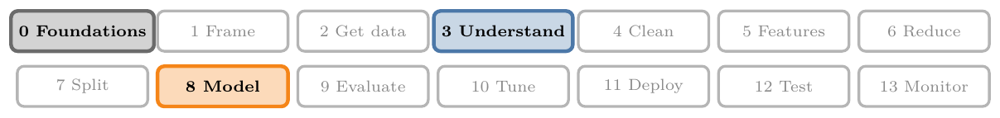
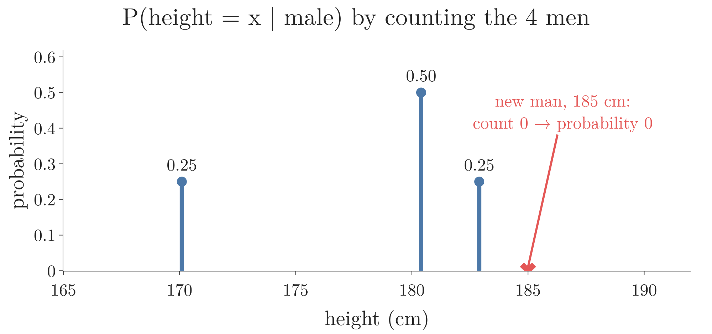
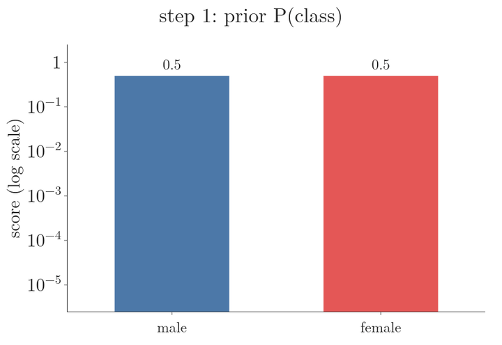
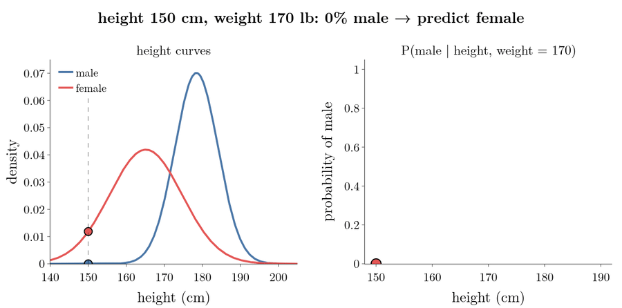
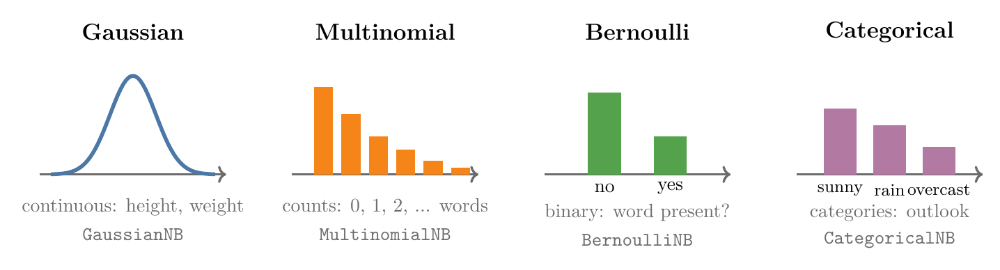

<!-- where-this-fits: generated by course_map/build_map.py; edit concepts.yaml, not this block -->
> **Where this fits:** Pipeline map steps 0 (Foundations), 3 (Understand data), 8 (Model). See the [Course map](../../../00-course-map/00-course-map.md).
>
> 
>
> - **Builds on:** [Probability density function (PDF)](../../../MA/03-distributions/MA-022-pdf-and-continuous-cdf/MA-022-pdf-and-continuous-cdf.md#4-bars-whose-area-is-probability-the-pdf); [Normal distribution](../../../MA/03-distributions/MA-024-normal-distribution/MA-024-normal-distribution.md#2-what-the-normal-distribution-is); [Naive Bayes](../../../ML/07-classification/ML-081-naive-bayes-intuition/ML-081-naive-bayes-intuition.md#2-the-method-on-one-picture).
> - **Compare with:** [Student's t-distribution](../../../MA/04-inference/MA-037-t-procedure/MA-037-t-procedure.md#5-students-t-distribution); [Likelihood](../../../MA/08-likelihood/MA-069-probability-vs-likelihood/MA-069-probability-vs-likelihood.md#22-likelihood-from-the-event-back-to-the-parameter).
<!-- /where-this-fits -->

## 1. Overview

> **Key point:** Numerical features rarely repeat exactly, so counting fails. Gaussian Naive Bayes assumes each feature follows a normal distribution within each class, and uses the normal curve's height (density) in place of a counted probability.

So far every **feature** (G-772; input variable, one column of the data table) was categorical, so probabilities came from counting. This Note handles **numerical** features such as height or weight, and introduces **Gaussian Naive Bayes** (G-830), the most common variant for them.

This Note covers:

- why counting fails for numbers (section 2);
- the assumption: one normal curve per class and feature (section 3);
- the scores for a new person, read off the curves (section 4);
- adding logs instead of multiplying small numbers (section 5);
- reading the result: which feature decides, and where the prediction flips (section 6);
- other variants for features that are not normal (section 7).

## 2. The problem

> **Key point:** No man in the data is exactly 185 cm tall, so P(height = 185 | male) by counting is 0.

The data has 8 people. Each person is one **observation** (G-1374; one record, a row of the table). The two features are height (cm) and weight (pounds); the **target** (G-1949; the output we predict) is gender:

| Height (cm) | Weight (lb) | Gender |
|---|---|---|
| 182.9 | 180 | male |
| 180.4 | 190 | male |
| 170.1 | 170 | male |
| 180.4 | 165 | male |
| 152.4 | 100 | female |
| 167.6 | 150 | female |
| 165.2 | 130 | female |
| 175.3 | 150 | female |

A new person is 185 cm tall and weighs 170 pounds. Male or female?

The Naive Bayes recipe ([the formula](../ML-082-naive-bayes-maths/ML-082-naive-bayes-maths.md#6-the-formula-and-the-map-rule)) needs

$$P(\text{male}) \times P(\text{height} = 185 \mid \text{male})$$

$$\times P(\text{weight} = 170 \mid \text{male})$$

and the same for female. The **prior** (G-1565), the share of each class in the data, is easy: 4 of 8 are male, so:

$$P(\text{male}) = 1/2$$

But no man in the data is exactly 185 cm, so counting gives:

$$P(\text{height} = 185 \mid \text{male}) = 0$$

and the whole score is 0. With a continuous measurement, almost every new value is one never seen before, so counting cannot work.



In Figure 1, watch the gap at 185 cm: counting puts all its probability on the exact heights already seen, so a man just 2 cm taller than the tallest one gets probability 0.

## 3. The assumption: normal distributions

> **Key point:** Assume each feature is normally distributed within each class. Estimate the mean and standard deviation, then read off the curve's height at the new value.

Gaussian Naive Bayes assumes that, within each class, each numerical feature follows a **normal** (Gaussian) **distribution** (G-1343), the bell curve (see [what the normal distribution is](../../../MA/03-distributions/MA-024-normal-distribution/MA-024-normal-distribution.md#2-what-the-normal-distribution-is)).

For each class and each feature, three steps:

1. Fit the bell curve: find the **mean** (G-1203, the centre of the curve) and the **standard deviation** (G-1871, how wide it is) of that feature over that class's observations.
2. Read the height of that class's curve at the new value. This height is the **probability density** (G-1569).
3. Put the height in place of the counted probability in the Naive Bayes product. In this role the height is the **likelihood** (G-1086) of the value under that class.

**Worked example: the male height curve.** The four male heights are 182.9, 180.4, 170.1 and 180.4 cm. The new person is $x = 185$ cm.

Step 1a, the mean $\mu$ (add the four heights, divide by 4):

$$\mu = \frac{182.9 + 180.4 + 170.1 + 180.4}{4}$$

$$\mu = \frac{713.8}{4}$$

$$\mu = 178.45$$

Step 1b, the standard deviation $\sigma$. Take each height's distance from the mean and square it, one per line:

| Height | Distance from 178.45 | Squared |
|---|---|---|
| 182.9 | 4.45 | 19.80 |
| 180.4 | 1.95 | 3.80 |
| 170.1 | -8.35 | 69.72 |
| 180.4 | 1.95 | 3.80 |
| Sum | | 97.13 |

Then divide the sum by $n - 1 = 3$ (the [sample variance](../../../MA/01-descriptive-stats/MA-006-measures-of-dispersion/MA-006-measures-of-dispersion.md#6-the-sample-variance-divide-by-n---1) divides by $n - 1$ because the mean was computed from the same four heights) and take the square root:

$$\sigma = \sqrt{\frac{97.13}{4 - 1}}$$

$$\sigma = \sqrt{32.38}$$

$$\sigma = 5.69$$

Step 2, the height of the curve at $x = 185$. First, how many standard deviations the new value is from the mean:

$$z = \frac{x - \mu}{\sigma}$$

$$z = \frac{185 - 178.45}{5.69}$$

$$z = 1.151$$

Then the bell shape at that distance ($e$ is the number 2.718...), and the scale that makes the curve's total area 1. First the square of $z$:

$$z^2 = 1.151^2 = 1.325$$

$$e^{-\frac{1}{2} z^2} = e^{-\frac{1}{2} \times 1.325}$$

$$e^{-\frac{1}{2} z^2} = e^{-0.663}$$

$$e^{-\frac{1}{2} z^2} = 0.5155$$

$$\sigma\sqrt{2\pi} = 5.69 \times 2.507$$

$$\sigma\sqrt{2\pi} = 14.26$$

$$\text{density} = \frac{0.5155}{14.26}$$

$$\text{density} = 0.03615$$

So the male curve is 0.03615 high at 185 cm. This is the number that goes into the table in Section 4.

**The same steps as one formula.** Writing $\mu$ and $\sigma$ for any class and feature, and $x$ for the new value, the three lines above are

$$f(x) = \frac{1}{\sigma\sqrt{2\pi}}\thinspace e^{-\frac{1}{2}\left(\frac{x - \mu}{\sigma}\right)^2}$$

With $\mu = 178.45$, $\sigma = 5.69$ and $x = 185$, this gives $f(185) = 0.03615$, the same as the worked lines.

{height=52%}

Figure 2 shows the four fitted curves. The new person's height (185 cm) sits on the right flank of the male curve but far out in the tail of the female curve; the same holds for the weight (170 pounds).

## 4. The numbers

> **Key point:** Male score 5.5 × 10⁻⁴ against female 1.1 × 10⁻⁵: predict male, with about 98% probability.

| Class | Feature | Mean | Std. deviation | Density at the new value |
|---|---|---|---|---|
| male | height | 178.45 | 5.69 | 0.03615 |
| male | weight | 176.25 | 11.09 | 0.03070 |
| female | height | 165.12 | 9.51 | 0.00473 |
| female | weight | 132.50 | 23.63 | 0.00479 |

The male height row was worked out in Section 3. The other three use the same steps, one column per step:

| Class, feature | $x - \mu$ | $z = (x - \mu)/\sigma$ | $e^{-z^2/2}$ | $\sigma\sqrt{2\pi}$ | Density = column 4 / column 5 |
|---|---|---|---|---|---|
| male, height | 185 - 178.45 = 6.55 | 1.151 | 0.5155 | 14.26 | 0.03615 |
| male, weight | 170 - 176.25 = -6.25 | -0.564 | 0.8531 | 27.79 | 0.03070 |
| female, height | 185 - 165.12 = 19.88 | 2.089 | 0.1128 | 23.85 | 0.00473 |
| female, weight | 170 - 132.50 = 37.50 | 1.587 | 0.2838 | 59.23 | 0.00479 |

Now the scores, multiplying the prior and the two densities, one product per line:

Male:

$$0.5 \times 0.03615 = 0.018075$$

$$0.018075 \times 0.03070 = 5.5 \times 10^{-4}$$

Female:

$$0.5 \times 0.00473 = 0.002365$$

$$0.002365 \times 0.00479 = 1.1 \times 10^{-5}$$

Figure 3 shows where the four densities come from. A dashed line marks the new person's value on each chart; the height of each curve at that line is the density.

{height=50%}

The male score is about 49 times larger, so the prediction is **male**. To turn the scores into probabilities, divide each by their sum:

$$0.000555 + 0.0000113 = 0.000566$$

$$P(\text{male}) = \frac{0.000555}{0.000566} = 0.98$$

$$P(\text{female}) = \frac{0.0000113}{0.000566} = 0.02$$

As probabilities: 98% male, 2% female.



In Figure 4, watch the gap open: both classes start at 0.5, the height density pulls the female score about 8 times lower, and the weight density widens the gap to about 49 times.

> **Extra:** A density is not a probability: for a continuous variable, the probability of exactly 185.000... cm is 0, and densities can even be larger than 1. But the density measures how likely values **near** 185 are, and the same small interval would multiply every class's density equally. So comparing densities across classes gives the same decision as comparing probabilities.

> **Python:** scikit-learn's GaussianNB.
>
> ```python
> from sklearn.naive_bayes import GaussianNB
>
> nb = GaussianNB().fit(df[["height_cm", "weight_lb"]], df["gender"])
> nb.theta_           # class means
> nb.var_             # class variances
> nb.predict_proba(new_person)   # about 99% male
> ```
>
> `GaussianNB` estimates the variance by dividing by $n$ rather than $n - 1$ (scikit-learn docs, `GaussianNB`), so its numbers differ slightly from the table: 99.2% male instead of 98.0%. The prediction is the same.

## 5. Adding logs instead of multiplying

> **Key point:** Many small factors multiplied together can become too small for the computer to store. Taking the log of each factor and adding gives the same winner, with ordinary-sized numbers.

The two scores are already small: $5.5 \times 10^{-4}$ and $1.1 \times 10^{-5}$, with only two features. Every extra feature multiplies in another small density. With hundreds of features the product falls below the smallest number the computer can store and becomes 0 for every class. This failure is **underflow** (G-2036), met before in [the problem with products](../ML-072-log-loss/ML-072-log-loss.md#41-the-problem-with-products).

The fix is to take the natural log (written $\ln$) of the score. The log of a product is the sum of the logs, so the multiplication becomes an addition:

$$\ln(\text{score}) = \ln P(\text{class}) + \ln f(\text{height}) + \ln f(\text{weight})$$

On the new person:

| | ln prior | ln density of height | ln density of weight | Sum |
|---|---|---|---|---|
| male | $\ln 0.5 = -0.69$ | $\ln 0.03615 = -3.32$ | $\ln 0.03070 = -3.48$ | $-7.50$ |
| female | $\ln 0.5 = -0.69$ | $\ln 0.00473 = -5.35$ | $\ln 0.00479 = -5.34$ | $-11.39$ |

The log is an increasing function, so the class with the larger score also has the larger log score. $-7.50$ is larger than $-11.39$, so the prediction is male, as before. scikit-learn computes Naive Bayes with log scores for this reason (its `GaussianNB` works with a joint log-likelihood).

## 6. Reading the result

> **Key point:** Each feature's say is the ratio of its two curve heights. Here height favours male 7.6 times and weight 6.4 times. With the weight fixed at 170 lb, the prediction flips from female to male at about 166 cm.

### 6.1 Which feature decides

> **Key point:** The feature whose two curve heights differ most has the largest say.

Both priors are 0.5, so the 49-fold gap between the scores comes only from the densities. Figure 3 gives each feature's share:

- height, in favour of male:
  $$0.03615 / 0.00473 = 7.6$$
- weight, in favour of male:
  $$0.03070 / 0.00479 = 6.4$$
- together:
  $$7.6 \times 6.4 \approx 49$$

Here the two features have a similar say. When one feature's ratio is far larger than all the others, that feature alone decides the class, and the others may not be needed. **Cross-validation** (G-510; splitting the data into parts and testing on each part in turn, see [cross-validation with a pipeline](../../03-feature-engineering/ML-028-pipelines/ML-028-pipelines.md#8-cross-validation-with-a-pipeline)) can check which features help.

### 6.2 Where the prediction flips

> **Key point:** The set of inputs where the two classes are equally likely is the decision boundary.

Figure 5 keeps the weight at 170 lb and slides the height from 150 to 190 cm. On the left, the dashed line moves across the two height curves. On the right, the probability of male is traced out.

{height=45%}

Watch the right-hand chart: for short heights the female curve is much higher and P(male) is near 0. Near 166 cm the two scores are equal and P(male) is 50%. Above that the male score wins. The point where the prediction switches is the **decision boundary** (G-555). It sits below the crossing point of the two height curves (about 172 cm) because the weight of 170 lb already favours male 6.4 times.

## 7. When the data is not normal

> **Key point:** The normal assumption can be wrong. Other variants assume other distributions: multinomial for counts, Bernoulli for yes/no, categorical for categories.

The normal assumption is a choice, and it can be poor, for example for a skewed feature like income. Naive Bayes can use any distribution that suits the data, giving different variants:

| Variant | Assumed distribution | Typical features | scikit-learn |
|---|---|---|---|
| Gaussian | normal | continuous measurements | `GaussianNB` |
| Multinomial | multinomial | counts, such as word counts in a document | `MultinomialNB` |
| Bernoulli | Bernoulli (yes/no) | binary features, such as "word present or not" | `BernoulliNB` |
| Categorical | categorical | categories, as in [the Play Tennis data](../ML-083-naive-bayes-code/ML-083-naive-bayes-code.md#2-the-data) | `CategoricalNB` |



In Figure 6, match the shape to the feature: a smooth bell for measurements, bars over 0, 1, 2, ... for counts, two bars for yes/no, one bar per category.

Each variant suits one kind of data (scikit-learn user guide §1.9), so we look at each feature's distribution and pick the variant whose assumption fits it. A strongly skewed numerical feature can also be transformed first (see [the power transformer](../../03-feature-engineering/ML-030-power-transformer/ML-030-power-transformer.md#1-overview)) so that it looks more normal.

## 8. Summary

- Numerical values rarely repeat, so $P(x \mid \text{class})$ cannot be counted: a value never seen before would get 0 and wipe out the score.
- Gaussian Naive Bayes fits a normal curve (mean, standard deviation) per class and feature, and uses the density at $x$, so every value, seen or not, gets a non-zero likelihood; the same small interval scales every class's density equally, so comparing densities gives the same decision as comparing probabilities.
- New person 185 cm, 170 lb: male score $5.5 \times 10^{-4}$, female $1.1 \times 10^{-5}$: male (98%), because 185 cm and 170 lb sit near the male curves and far out in the tails of the female ones.
- With many features, add the logs of the factors instead of multiplying them, to avoid underflow; the log keeps the order, so the winner is the same.
- A feature's say is the ratio of its two curve heights, so you can see which feature decides (here height 7.6 times, weight 6.4 times); the decision boundary is where the scores are equal.
- Other variants (multinomial, Bernoulli, categorical) suit other kinds of features, because the normal assumption can be poor, for example for a skewed feature or for counts.
- So numerical features need only one change to Naive Bayes: read the likelihood off a fitted curve instead of counting it.

## 9. Sources

**Built from**

- CampusX, "Naive Bayes Part 9 | Handling Numerical Data", YouTube, https://www.youtube.com/watch?v=TCgK2nBJx9o
- StatQuest with Josh Starmer, "Gaussian Naive Bayes, Clearly Explained!!!", YouTube, https://www.youtube.com/watch?v=H3EjCKtlVog (the likelihood as the curve's height, adding logs to avoid underflow, one feature having the larger say; Figure 3 is redrawn from this idea with our own data)

**Other references**

- **scikit-learn docs:** `sklearn.naive_bayes.GaussianNB`; user guide Section 1.9, "Naive Bayes", scikit-learn 1.9.

## 10. Key terms

Terms taught in this Note come first; linked terms are recaps, taught in the Note the link opens.

| Term | Meaning |
|---|---|
| Gaussian Naive Bayes (G-830) | Naive Bayes that models each numerical input as normally distributed within each class. |
| BernoulliNB (G-277) | Naive Bayes for binary (yes/no) inputs. |
| GaussianNB (G-833) | scikit-learn's Gaussian Naive Bayes. |
| MultinomialNB (G-1277) | Naive Bayes for count data, such as word counts. |
| [Feature](../../../ML/01-foundations/ML-002-ai-vs-ml-vs-dl/ML-002-ai-vs-ml-vs-dl.md#52-features-chosen-by-us-or-learned) (G-772) | One piece of information about each example that a model uses (e.g. a student's CGPA). |
| [Observation](../../../ML/01-foundations/ML-003-types-of-ml/ML-003-types-of-ml.md#21-learning-from-inputs-and-outputs) (G-1374) | One record of a dataset: one row of the data table. |
| [Target](../../../ML/01-foundations/ML-003-types-of-ml/ML-003-types-of-ml.md#21-learning-from-inputs-and-outputs) (G-1949) | The output column we predict, such as the class; also called the label. |
| [Prior](../../../MA/02-probability/MA-018-bayes-theorem/MA-018-bayes-theorem.md#3-the-names-of-the-four-parts) (G-1565) | The probability of an event before any evidence is seen. |
| [Normal distribution](../../../MA/03-distributions/MA-024-normal-distribution/MA-024-normal-distribution.md#2-what-the-normal-distribution-is) (G-1343) | A symmetric, bell-shaped distribution: most values sit near the mean and they get rarer the further out we go; its mean and standard deviation set its centre and width. |
| [Mean](../../../ML/02-getting-data/ML-018-understanding-your-data/ML-018-understanding-your-data.md#71-count-mean-standard-deviation-minimum-and-maximum) (G-1203) | The average of the values; the centre of the data. |
| [Standard deviation](../../../ML/02-getting-data/ML-018-understanding-your-data/ML-018-understanding-your-data.md#71-count-mean-standard-deviation-minimum-and-maximum) (G-1871) | How far values typically lie from the mean; divide by $n - 1$ for a sample (pandas default) or by $n$ for a population (NumPy default). |
| [Probability density](../../../MA/03-distributions/MA-022-pdf-and-continuous-cdf/MA-022-pdf-and-continuous-cdf.md#5-what-the-density-at-a-point-means) (G-1569) | The height of a continuous distribution's curve; compares how likely nearby values are. |
| [Likelihood](../../../MA/08-likelihood/MA-069-probability-vs-likelihood/MA-069-probability-vs-likelihood.md#22-likelihood-from-the-event-back-to-the-parameter) (G-1086) | How probable the observed data is under given parameter values; read as a function of the parameters with the data fixed. |
| [Underflow](../../../ML/07-classification/ML-072-log-loss/ML-072-log-loss.md#41-the-problem-with-products) (G-2036) | A number too close to 0 for the computer to store, which then becomes 0 or loses precision. |
| [Cross-validation](../../../ML/03-feature-engineering/ML-028-pipelines/ML-028-pipelines.md#8-cross-validation-with-a-pipeline) (G-510) | Testing a model by training and testing it several times on different parts of the training data. |
| [Decision boundary](../../../ML/01-foundations/ML-006-instance-vs-model-based/ML-006-instance-vs-model-based.md#41-learning-a-decision-boundary) (G-555) | A line or curve that separates the classes in classification. |
