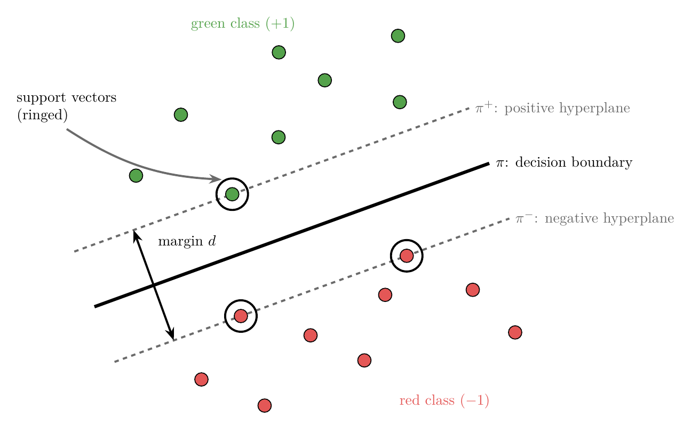
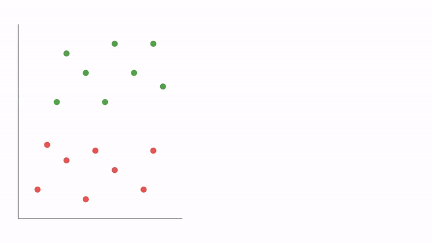
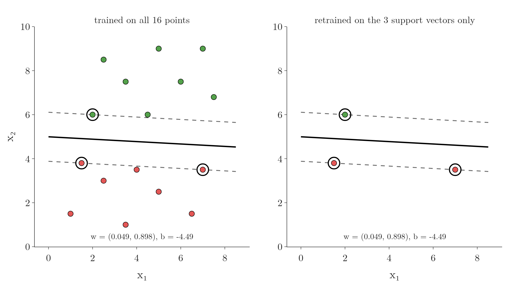
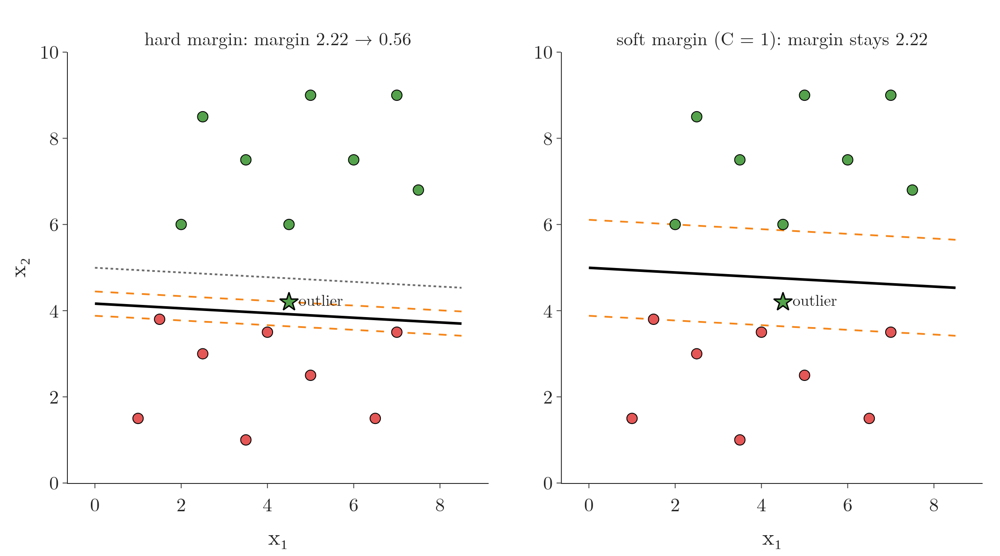

<!-- where-this-fits: generated by course_map/build_map.py; edit concepts.yaml, not this block -->
> **Where this fits:** Pipeline map step 8 (Model). See the [Course map](../../../00-course-map/00-course-map.md).
>
> 
>
> - **Builds on:** [Classification problems](../../../ML/01-foundations/ML-003-types-of-ml/ML-003-types-of-ml.md#1-overview); [Regularisation](../../../ML/06-regression/ML-062-ridge-regression-intuition/ML-062-ridge-regression-intuition.md#1-overview); [Perceptron trick](../../../ML/07-classification/ML-069-perceptron-trick/ML-069-perceptron-trick.md#5-the-perceptron-trick); [Dot product](../../../MA/05-linear-algebra/MA-050-dot-product-and-cosine-similarity/MA-050-dot-product-and-cosine-similarity.md#3-computing-the-dot-product); [Equation of a hyperplane](../../../MA/05-linear-algebra/MA-051-equation-of-a-hyperplane/MA-051-equation-of-a-hyperplane.md#4-the-vector-form); [Lagrange multipliers, KKT and duality](../../../MA/07-optimisation/MA-066-lagrange-multipliers/MA-066-lagrange-multipliers.md#6-lagrangian-duality).
> - **Used here, taught in full later:** [Hinge loss and soft margin](../../../ML/07-classification/ML-088-svm-soft-margin/ML-088-svm-soft-margin.md#8-why-soft-margin); [Kernel trick](../../../ML/07-classification/ML-089-kernel-trick-intuition/ML-089-kernel-trick-intuition.md#3-the-kernel-trick).
> - **Compare with:** [Logistic regression](../../../ML/07-classification/ML-074-logistic-gradient-descent/ML-074-logistic-gradient-descent.md#1-overview).
<!-- /where-this-fits -->

## 1. Overview

> **Key point:** A support vector machine (SVM) separates two classes with the line that leaves the widest possible gap between them. The points that touch the edges of that gap are the support vectors.

A **support vector machine (SVM)** (G-1921) is a classification algorithm (it assigns each observation to one of a few classes; see [classification](../../01-foundations/ML-003-types-of-ml/ML-003-types-of-ml.md#23-regression-and-classification)) from the same family as logistic regression. SVM is a strong, widely used algorithm that works in many situations, often called one of the best "out of the box" classifiers (ISL §9). It builds directly on logistic regression, so [logistic regression](../ML-071-sigmoid-function/ML-071-sigmoid-function.md#1-overview) is the best preparation for it.

Logistic regression accepts any line that separates the classes. SVM goes one step further and asks which separating line is the **best**. Its answer: the line with the widest empty gap on both sides (Figure 1).

{height=40%}

This Note explains that idea with pictures only. Figure 1 names the parts (the line $\pi$, the two dashed lines $\pi^+$ and $\pi^-$, the gap $d$, the ringed support vectors); sections 4 to 6 explain each one. The next Notes turn it into maths: [the SVM equations](../ML-087-svm-maths/ML-087-svm-maths.md#1-overview).

## 2. The idea in one dimension

> **Key point:** With one feature, the separator is a single threshold. The safest threshold sits halfway between the two classes, where its distance to the nearest point is largest.

Start with the simplest case: one **feature** (G-772; an input variable, one column of the data table). Figure 2 puts 100 iris flowers on a number line by petal length. Each flower is one **observation** (G-1374; one record, a row of the table), and its species is the **target** (G-1949; the output we predict). The setosa petals are short (up to 1.9 cm); the versicolor petals are long (from 3.0 cm). Between them lies an empty gap.

To classify a new flower we pick a **threshold**: below it we say setosa, above it versicolor. Any threshold inside the gap classifies all 100 training flowers correctly. They are not equally good, though:

1. **A threshold at 2.0 cm** sits right next to the setosa flowers. A new flower with a 2.1 cm petal falls above it and is called versicolor, although it is only 0.2 cm from the nearest setosa and 0.9 cm from the nearest versicolor.
2. **A threshold at 2.45 cm**, the midpoint between the two edge flowers (1.9 and 3.0), fixes this. Every new flower is now given the species whose flowers it is closer to.


In Figure 2, watch the two coloured bars: the distance from the threshold to the nearest flower on each side. The lower panel plots the smaller of the two. Move the threshold left or right of the midpoint and one bar shrinks, so the smaller distance falls. At the midpoint both bars are 0.55 cm, the largest value the smaller distance can reach.

The empty room around the threshold is the **margin** (G-1160). The classifier that picks the threshold with the largest margin is the **maximal margin classifier** (G-2217); an SVM is this idea extended to any number of features. Section 4 gives the exact definition of the margin SVM uses: the full width of the empty band, here 1.1 cm, which is the gap of 0.55 cm on each side added together.

With more features the separator changes shape, but the idea stays the same:

- **1 feature:** a point on a number line (the threshold);
- **2 features:** a line;
- **3 features:** a plane;
- **4 or more features:** a **hyperplane** (G-911), the same flat separator in a space we cannot draw.

The rest of this Note works with two features, where the separator is a line.

## 3. Choosing between two separating lines

> **Key point:** Two lines can both classify every training point correctly. Logistic regression treats them as equally good; SVM prefers the one that keeps the points further away.

### 3.1 Two perfect lines

> **Key point:** Training accuracy alone cannot tell $\pi_1$ and $\pi_2$ apart: both are 100% correct.

Now take two features. Each point is one observation, its two coordinates are its features, and its colour is the target.

Figure 3 shows two classes, green and red, that are linearly separable (a straight line can put each class on its own side; see [when logistic regression works](../ML-069-perceptron-trick/ML-069-perceptron-trick.md#2-when-logistic-regression-works)). Two lines, $\pi_1$ (black) and $\pi_2$ (blue), both put every green point on one side and every red point on the other. In more dimensions the dividers are planes or [hyperplanes](../../06-regression/ML-052-multiple-linear-regression/ML-052-multiple-linear-regression.md#22-more-inputs-a-hyperplane), so we write each one with the letter $\pi$ ("pi"). Here $\pi$ is only a name for the separator, not the number 3.14.

{height=40%}

For logistic regression both lines do the job, so both are acceptable. SVM asks a further question: which of the two will work better on **new** points? Most people pick $\pi_1$ by eye, because $\pi_2$ passes very close to some points.

### 3.2 Distance as confidence

> **Key point:** The further a point is from the line, the more confident the model is about its class.

Logistic regression already links distance and confidence. Take a small instance: the line below and two points, A at $(3, 2.2)$ close to it and B at $(4, 5)$ far from it.

$$x_1 + x_2 - 5 = 0$$

The line is written with a weight vector $w = (1, 1)$ (one weight per feature) and an intercept $b = -5$. For a point $x = (x_1, x_2)$, the symbol $w^T x$ means "multiply the weights by the features and add":

$$w^T x = 1 \times x_1 + 1 \times x_2$$

The score $z = w^T x + b$ is 0 on the line and grows with the point's distance from it. For the two points:

$$z_A = 1 \times 3 + 1 \times 2.2 - 5 = 0.2$$

$$z_B = 1 \times 4 + 1 \times 5 - 5 = 4$$

The distance of a point from the line is $z$ divided by the length of $w$:

$$\lVert w \rVert = \sqrt{1^2 + 1^2} = 1.41$$

A is this far away:

$$\frac{0.2}{1.41} = 0.14$$

B is this far away:

$$\frac{4}{1.41} = 2.83$$

The sigmoid turns the score into the probability $P(y = 1)$ (see [the sigmoid function](../ML-071-sigmoid-function/ML-071-sigmoid-function.md#4-the-sigmoid-function)):

$$\sigma(z) = \frac{1}{1 + e^{-z}}$$

For the two points:

$$\sigma(0.2) = \frac{1}{1 + 0.82} = 0.55$$

$$\sigma(4) = \frac{1}{1 + 0.018} = 0.98$$

Near the line $\sigma$ is close to 0.5 (unsure); far away it is close to 0 or 1 (confident).

So a line that keeps every point far away classifies every point with high confidence. The perceptron already showed [the danger of the opposite](../ML-070-perceptron-code/ML-070-perceptron-code.md#6-the-weakness-the-decision-boundary-stops-too-early): a line that hugs one class misclassifies new points from that class easily.

### 3.3 The core idea of SVM

> **Key point:** Separate the classes, and among all lines that do, choose the one that keeps the points as far away as possible.

SVM classifies the data with the hyperplane that separates the classes **as widely as possible**. SVM wants to make the gap between the line and the points as large as it can. The hope is that such a line generalises better: it performs better on new, unseen data than a line that squeezes past the points (ISL §9.1.3). The perceptron [tested this on the iris flowers](../ML-070-perceptron-code/ML-070-perceptron-code.md#61-comparing-with-logistic-regression): lines that hugged one class made more mistakes on new flowers.

## 4. The margin

> **Key point:** The margin is the width of the empty gap around the line. SVM looks for the margin-maximising hyperplane.

The gap around the separating line is called the **margin** (G-1160). In SVM, the margin is the **full width** of the empty band: the distance from the nearest green point to the nearest red point, measured across the line. The perceptron code used "[margin](../ML-070-perceptron-code/ML-070-perceptron-code.md#61-comparing-with-logistic-regression)" for the one-sided distance from the line to the nearest point of one class; the SVM margin is the two one-sided gaps added together, so for a line in the middle of the band it is **twice** that distance. SVM searches for the hyperplane that makes this full width as large as possible. For this reason, the SVM line is also called the **margin-maximising hyperplane** (G-1163).

A wide margin makes the model more general: it leaves room for new points that vary a little from the training points. An everyday picture: a driver who keeps to the middle of the lane, as far as possible from both kerbs, has the most room for a small wobble. A wide margin is the whole goal of SVM; everything else in the following Notes is about how to compute it.

## 5. Measuring the margin of a line

> **Key point:** Slide two copies of the line outwards until each touches the first point of its class. The distance between the copies is the margin d.

### 5.1 The procedure

> **Key point:** Pick a line, build $\pi^+$ and $\pi^-$, measure d, repeat for many lines, keep the line with the largest d.

To measure the margin of a candidate hyperplane $\pi$ (Figure 4):

1. **Pick a hyperplane** $\pi$ that separates the classes.
2. **Find $\pi^+$:** move a copy of $\pi$ parallel to itself in the positive direction. Stop as soon as it touches the first green point. This copy is the **positive hyperplane** $\pi^+$ (G-1531).
3. **Find $\pi^-$:** do the same in the negative direction, stopping at the first red point. This copy is the **negative hyperplane** $\pi^-$ (G-1309).
4. **Measure the margin:** $\pi^+$ and $\pi^-$ are both parallel to $\pi$, so they are parallel to each other. The **margin** $d$ is the shortest distance between them.
5. **Repeat** steps 1 to 4 for many other hyperplanes, each with its own $\pi^+$, $\pi^-$ and $d$.
6. **Keep** the hyperplane whose $d$ is the largest.



In 2D, $\pi$, $\pi^+$ and $\pi^-$ are all straight lines. The same procedure works unchanged with planes in 3D and hyperplanes in more dimensions.

### 5.2 Comparing two lines by their margin

> **Key point:** $\pi_1$ has margin d = 2.22, $\pi_2$ only $d'$ = 0.96, so SVM chooses $\pi_1$.

Applying the procedure to the two lines of Figure 3 gives Figure 5. The parallel copies of $\pi_2$ hit a green point and a red point very quickly, so its margin is narrow.

{height=45%}

Each of the three lines of the procedure has an equation. Use the best line of Figure 5, which has weights $w = (0.049, 0.898)$ and intercept $b = -4.485$ (the values found in section 6). As in section 3.2, $w^T x$ multiplies each weight by its feature and adds:

$$w^T x = 0.049 \times x_1 + 0.898 \times x_2$$

The three lines are the points where the score $w^T x + b$ equals $0$, $+1$ and $-1$:

- $\pi$, the separating line:

  $$0.049 x_1 + 0.898 x_2 - 4.485 = 0$$

- $\pi^+$, the upper margin line:

  $$0.049 x_1 + 0.898 x_2 - 4.485 = +1$$

- $\pi^-$, the lower margin line:

  $$0.049 x_1 + 0.898 x_2 - 4.485 = -1$$


The three have the same slope, so they are parallel. A red point $(2.5, 3)$ gives a score on the far side of $\pi^-$:

$$0.049 \times 2.5 + 0.898 \times 3 - 4.485$$

$$= 0.1225 + 2.694 - 4.485$$

$$= -1.67$$

The next Note explains [why the values $\pm 1$ are used](../ML-087-svm-maths/ML-087-svm-maths.md#32-scaling-w-and-b-changes-the-margin). In plain words, SVM wants the separating line whose margin is the widest. As a formula, with the line written as $w^T x + b = 0$:

$$\text{choose } w, b \text{ that maximise } d$$

With numbers: $d = 2.22$ for $\pi_1$ and $d' = 0.96$ for $\pi_2$. Since $d' < d$, SVM chooses $\pi_1$ over $\pi_2$.

The next Note turns $d$ into a formula in $w$ and $b$, so that the best line can be found by optimisation instead of trial and error.

> **Python:** In scikit-learn, the SVM classifier is `SVC`. With a straight line (`kernel="linear"`) and a very large `C` (explained in [the hyperparameter C](../ML-088-svm-soft-margin/ML-088-svm-soft-margin.md#6-the-hyperparameter-c)), it finds the widest-margin line of Figure 5.
>
> ```python
> from sklearn.svm import SVC
>
> svm = SVC(kernel="linear", C=1e6)
> svm.fit(X, y)                    # y holds +1 (green) and -1 (red)
> svm.coef_, svm.intercept_        # w and b of the line
> svm.support_vectors_             # the ringed points
> ```

## 6. Support vectors

> **Key point:** Support vectors are the points that lie on $\pi^+$ and $\pi^-$. They alone decide where the SVM line goes.

When $\pi^+$ and $\pi^-$ are moved outwards, they stop at the first points of each class. These points, lying exactly on $\pi^+$ or $\pi^-$, are the **support vectors** (G-1923). In Figure 1 there is one green support vector and two red ones; for $\pi_1$ in Figure 5 it is the same.

The idea is so central that it gives the algorithm its name. The support vectors "support" the two edges of the margin: move one of them and the best line moves too.

The other points have no say at all. If we delete every point except the three support vectors and train again, we get the same line (ISL §9.1.3). Figure 6 does exactly that: trained on all 16 points or on the 3 support vectors alone, the SVM finds $w = (0.049, 0.898)$ and $b = -4.49$ both times. For the same reason, a trained SVM can discard the other points and keep only its support vectors (Bishop §7.1).



## 7. Strengths of SVM

> **Key point:** SVM copes with outliers (in its soft-margin form), handles non-linear data through kernels, and works for both classification and regression.

1. **Outliers:** SVM handles outliers well, provided we use the [soft-margin version](../ML-088-svm-soft-margin/ML-088-svm-soft-margin.md#2-why-the-hard-margin-is-not-enough).
2. **Non-linear data:** when no single straight line can separate the classes, SVM uses **kernels** to draw curved boundaries. The [kernel trick](../ML-089-kernel-trick-intuition/ML-089-kernel-trick-intuition.md#1-overview) explains how.
3. **Classification and regression:** the same ideas give a classifier (SVC) and a regression model (**support vector regression**, SVR, G-1922).

> **Extra:** The version described in this Note, which demands a perfect separation, is called the hard-margin SVM. The hard-margin SVM is actually **sensitive** to outliers: a single point on the wrong side makes it impossible, and a single extreme point near the boundary changes the line, because that point becomes a support vector (ISL §9.2.1). The robustness comes from the soft margin, which lets a few points break the rules at a cost.
>
> Figure 7 tests this with one extra green point placed at $(4.5, 4.2)$, close to the red class. The hard-margin SVM must keep it on the green side, so its line drops and its margin shrinks from 2.22 to 0.56. A soft-margin SVM (`C = 1`) lets that one point sit on the wrong side and keeps the line and the margin of 2.22 it had without it.



## 8. Summary

| | Logistic regression | SVM |
|---|---|---|
| Goal | any line that separates the classes well | the separating line with the widest margin |
| Two perfect lines | equally good | the one with the larger margin wins |
| Points that decide the line | all points | only the support vectors |
| Non-linear data | needs extra features | kernels |

- In one dimension the separator is a threshold; the best one is the midpoint between the edge points of the two classes (iris petal lengths: 2.45 cm), because there its distance to the nearest flower of either species is largest, so a new flower gets the species it is closer to.
- SVM picks, among all separating hyperplanes, the margin-maximising one, hoping it generalises better, because a line that keeps every point far away classifies each with high confidence and leaves room for new points that vary a little.
- Positive and negative hyperplanes $\pi^+$ and $\pi^-$ are copies of $\pi$ moved out to the first point of each class, so the empty band between them can be measured.
- The margin $d$ is the distance between $\pi^+$ and $\pi^-$. SVM chooses $w$ and $b$ to make $d$ as large as possible, so two lines that are both 100% correct on the training data can still be ranked ($\pi_1$ with 2.22 beats $\pi_2$ with 0.96).
- The points on $\pi^+$ and $\pi^-$ are the support vectors; they alone decide the line, so retraining on the 3 support vectors gives the same line as on all 16 points.
- So SVM answers the question logistic regression leaves open: of all the lines that separate the classes, which is best.

## 9. Sources

**Built from**

- CampusX, "Support Vector Machines | Geometric Intuition", YouTube, https://www.youtube.com/watch?v=ugTxMLjLS8M
- StatQuest with Josh Starmer, "Support Vector Machines Part 1 (of 3): Main Ideas!!!", YouTube, https://www.youtube.com/watch?v=efR1C6CvhmE (the one-dimensional threshold, the maximal margin classifier, and the separator in 1, 2, 3 and more dimensions; Figure 2 recreates the threshold on iris petal lengths)

**Other references**

- **ISL:** James, G., Witten, D., Hastie, T. and Tibshirani, R. *An Introduction to Statistical Learning*, 2nd ed. Springer, 2021. Chapter 9 introduction (p. 367), Sections 9.1.3 (p. 371) and 9.2.1 (p. 374).
- **Bishop:** Bishop, C. M. *Pattern Recognition and Machine Learning*. Springer, 2006. Section 7.1, p. 330.

## 10. Key terms

| Term | Meaning |
|---|---|
| Support vector machine (SVM) | A classifier that separates the classes with the line, or flat surface in more dimensions (a hyperplane), that leaves the widest gap (margin) between the classes. |
| Margin (SVM) | The full width between $\pi^+$ and $\pi^-$ (later shown to be $2/\lVert w \rVert$): twice the one-sided margin of the perceptron |
| Maximal margin classifier (G-2217) | The classifier that separates the classes with the largest possible margin; the hard-margin SVM |
| Hyperplane | The flat separator: a point for 1 feature, a line for 2, a plane for 3, a hyperplane beyond |
| Margin-maximising hyperplane | The flat boundary (hyperplane) that splits the classes while staying as far as possible from the nearest points of each (the largest margin); it is the decision boundary an SVM learns. |
| Positive hyperplane ($\pi^+$) | A copy of the separating hyperplane moved out, parallel to itself, until it touches the first positive point; with the negative hyperplane it marks the two edges of the SVM's margin. |
| Negative hyperplane ($\pi^-$) | In an SVM, the copy of the separating hyperplane pushed out, parallel to it, until it touches the first negative-class point; with $\pi^+$ on the other side it marks the edges of the margin. |
| Support vectors | The training points that lie on the two margin lines, $\pi^+$ or $\pi^-$; they alone fix the SVM line. |
| Support vector regression (SVR) | The regression version of SVM: the same ideas, used to predict a number instead of a class. |
