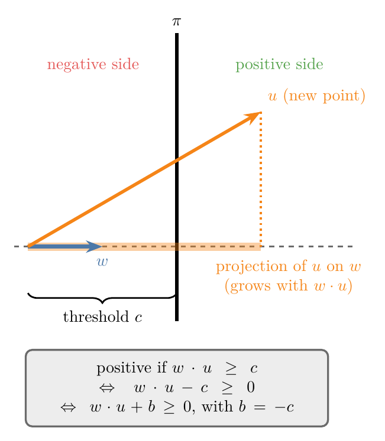
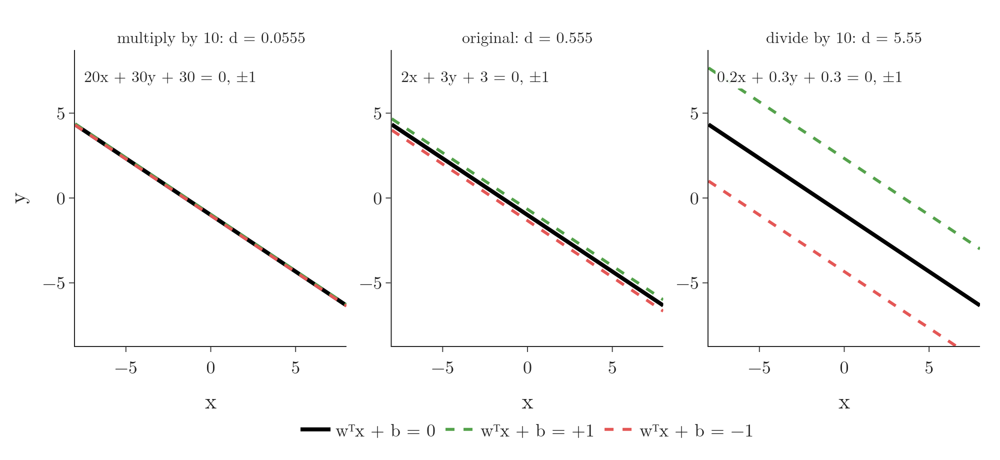
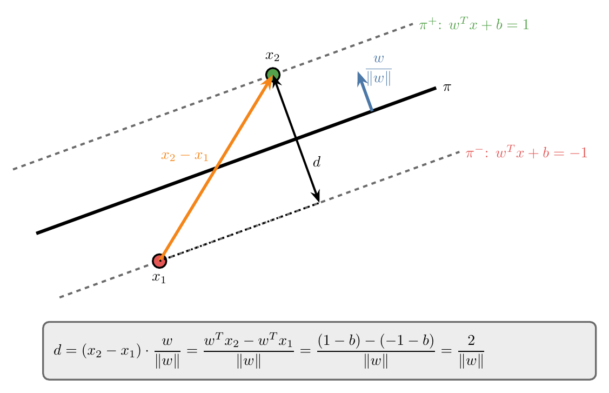
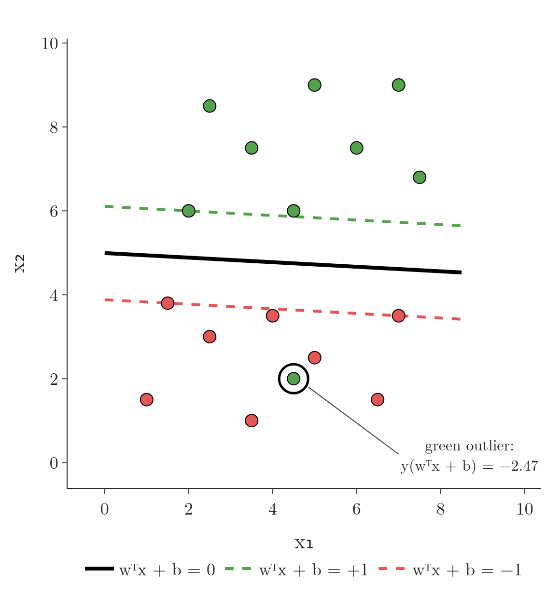

<!-- where-this-fits: generated by course_map/build_map.py; edit concepts.yaml, not this block -->
> **Where this fits:** Pipeline map step 8 (Model). See the [Course map](../../../00-course-map/00-course-map.md).
>
> 
>
> - **Builds on:** [Support vector machines](../../../ML/07-classification/ML-086-svm-intuition/ML-086-svm-intuition.md#33-the-core-idea-of-svm).
> - **Compare with:** [Logistic regression](../../../ML/07-classification/ML-071-sigmoid-function/ML-071-sigmoid-function.md#5-sigmoid-as-a-probability).
<!-- /where-this-fits -->

## 1. Overview

> **Key point:** The SVM line $w^T x + b = 0$ has two parallel edges $w^T x + b = \pm 1$ around an empty band of width $2/\lVert w \rVert$. The band is wider the shorter $w$ is, so SVM picks the shortest $w$ that keeps every point on its correct side.

[The margin](../ML-086-svm-intuition/ML-086-svm-intuition.md#4-the-margin) described SVM in pictures: among all lines that separate two classes, choose the one whose margin $d$ is the largest. The margin is the distance between the positive hyperplane $\pi^+$ and the negative hyperplane $\pi^-$: two lines (in 2D; a hyperplane is the flat boundary of any dimension) parallel to the boundary $\pi$, each touching the closest points of its class, the [support vectors](../ML-086-svm-intuition/ML-086-svm-intuition.md#6-support-vectors). This Note turns that picture into a formula that a computer can optimise.

{height=38%}

Before the steps, here are the symbols of the Key point, each on one small instance. Take the line $2x + 3y + 3 = 0$ (as in [the perceptron trick](../ML-069-perceptron-trick/ML-069-perceptron-trick.md#3-the-line-and-its-two-sides)). Its numbers form the weight vector $w = (2, 3)$ (a vector is an ordered list of numbers; this one has two, one per feature) and the intercept $b = 3$. A point such as $x = (3, 2)$ is also a vector: $x$-coordinate 3, $y$-coordinate 2.

**$w^T x$** (read: w transpose x, the same as $w \cdot x$) multiplies the vectors entry by entry and adds the products. The $T$ only says "write $w$ as a row so it can multiply $x$":

$$w^T x = 2 \times 3 + 3 \times 2 = 6 + 6 = 12$$

**$w^T x + b$** is the score of the point: how far it sits to one side of the line, in units of $w$:

$$w^T x + b = 12 + 3 = 15$$

**$\lVert w \rVert$** ("norm of $w$") is the length of the arrow $w$, from Pythagoras:

$$\lVert w \rVert = \sqrt{2^2 + 3^2} = \sqrt{4 + 9} = \sqrt{13} = 3.606$$

Figure 1 shows the result. The steps to get there:

1. A **decision rule** that says on which side of the line a new point lies.
2. Equations for $\pi^+$ and $\pi^-$, and why they use $+1$ and $-1$.
3. **Constraints** that keep every training point on its correct side.
4. A formula for the margin $d$ in terms of $w$.
5. The optimisation problem that puts it all together.

## 2. The decision rule

> **Key point:** Compute the point's score. If the score is zero or positive, predict +1 (green); if it is negative, predict −1 (red). The score is $w \cdot u + b$.

Before finding the best line, we need to know how a line classifies a new point once we have it.

### 2.1 A vector perpendicular to the hyperplanes

> **Key point:** π, $\pi^+$ and $\pi^-$ are parallel, so one vector w is perpendicular to all three. At first we know its direction but not its length.

The three hyperplanes are parallel. So a vector $w$ that is perpendicular to one of them is perpendicular to all three (the blue arrow in Figure 1). At this point we only fix the **direction** of $w$; its length is still unknown and will be decided later.

### 2.2 Projecting a new point onto w

> **Key point:** Project the new point u onto w. If the projection passes a threshold c, the point is positive.

Take an unknown point $u$. In 2D a point is also a vector from the origin, with an x and a y component. Drop $u$ onto the direction of $w$: this is the [projection](../../05-dimensionality/ML-047-pca-step-by-step/ML-047-pca-step-by-step.md#21-projecting-one-point) of $u$ onto $w$, and its length grows with the [dot product](../../05-dimensionality/ML-047-pca-step-by-step/ML-047-pca-step-by-step.md#21-projecting-one-point) $w \cdot u$ (Figure 2).

{height=38%}

A worked instance with $w = (2, 3)$ and $u = (3, 2)$. The dot product is

$$w \cdot u = 2 \times 3 + 3 \times 2 = 12$$

and the projection of $u$ onto the direction of $w$ has length (the dot product divided by the length $\lVert w \rVert = 3.606$ of $w$, see Section 5)

$$12 / 3.606 = 3.33$$

The boundary $\pi$ crosses the direction of $w$ at some distance from the origin. Call $c$ the dot-product value at which $\pi$ is crossed; for the line $2x + 3y + 3 = 0$ the crossing is at $c = -3$. A point is on the positive side when its dot product goes past that threshold. For $u = (3, 2)$ the dot product is 12, which is above $-3$, so $u$ is positive:

$$12 \geq -3$$

In general:

$$w \cdot u \geq c$$

$$w \cdot u - c \geq 0$$

$$w \cdot u + b \geq 0, \quad \text{with } b = -c$$

So the **decision rule** (G-558) of SVM is:

$$\hat{y} = \begin{cases} +1 & \text{if } w \cdot u + b \geq 0 \cr-1 & \text{if } w \cdot u + b < 0 \end{cases}$$

Once we know $w$ and $b$, classifying any new point takes one dot product and one addition.

### 2.3 The same rule in 2D

> **Key point:** In 2D, w · u + b is just "put the point into the line's equation", as in the perceptron trick.

In 2D this rule is the side test of [positive and negative sides](../ML-069-perceptron-trick/ML-069-perceptron-trick.md#32-positive-and-negative-sides): put the point into the left-hand side of the line's equation and look at the sign. Written with vectors, the line $2x + 3y + 3 = 0$ has $w = (2, 3)$ and $b = 3$.

- $u = (3, 2)$:

  $$w \cdot u + b = 2 \times 3 + 3 \times 2 + 3 = 15$$

  This is at least 0, so the point is **positive**.

- $u = (-2, 0)$:

  $$w \cdot u + b = 2 \times (-2) + 3 \times 0 + 3 = -1$$

  This is below 0, so the point is **negative**.


The vector form says exactly the same thing, but it works unchanged in any number of dimensions.

## 3. The equations of $\pi^+$ and $\pi^-$

> **Key point:** We choose $\pi^+$ to be $w^T x + b = +1$ and $\pi^-$ to be $w^T x + b = -1$. Equal sizes keep $\pi$ in the middle; the value 1 is a free choice of scale.

### 3.1 The assumption

> **Key point:** $\pi$: $w^T x + b = 0$, $\pi^+$: $w^T x + b = +1$, $\pi^-$: $w^T x + b = -1$.

To compute the margin we need equations for $\pi^+$ and $\pi^-$. We **choose** them to be:

$$\pi^+:\ w^T x + b = +1$$

$$\pi:\ w^T x + b = 0$$

$$\pi^-:\ w^T x + b = -1$$

For the line $2x + 3y + 3 = 0$, these are $2x + 3y + 3 = 1$ and $2x + 3y + 3 = -1$: two lines parallel to it, one on each side. This choice raises three questions.

1. **Why must the two right-hand sides have the same size** (for example not $+1$ and $-2$)? Because $\pi$ must lie exactly in the middle of $\pi^+$ and $\pi^-$. The distance from $\pi$ to $\pi^+$ must equal the distance from $\pi$ to $\pi^-$, and equal values on both sides give that.
2. **Why 1, and not 25 or 37?** The exact number makes no difference to which line is best. Section 5 shows that a different number only multiplies the margin by a constant, so 1 is chosen for convenience.
3. **Why are these equations useful at all?** Section 3.2 answers this with an experiment.

### 3.2 Scaling w and b changes the margin

> **Key point:** Multiplying w and b by 10 gives the same line π, but $\pi^+$ and $\pi^-$ move closer together. Dividing by 10 pushes them apart.

Multiply every coefficient of $2x + 3y + 3 = 0$ by 10. The result, $20x + 30y + 30 = 0$, is the **same line**: the slope and intercept do not change.

Now do the same to $\pi^+$ and $\pi^-$, multiplying only the left-hand side. The equations $20x + 30y + 30 = \pm 1$ are **not** the same lines as $2x + 3y + 3 = \pm 1$. Since the right-hand side stays at 1, the new $\pi^+$ and $\pi^-$ lie much closer to $\pi$ (Figure 3).

{height=38%}

In plain words: scaling $w$ and $b$ up squeezes the margin; scaling them down widens it. As a formula (derived in Section 5), with $\lVert w \rVert$ the length of $w$:

$$d = \frac{2}{\lVert w \rVert}$$

With numbers, for $w$ equal to $k$ times $(2, 3)$:

| Factor $k$ | Equation of $\pi$ | $\lVert w \rVert$ | Margin $d$ |
|---|---|---|---|
| 10 | $20x + 30y + 30 = 0$ | 36.06 | 0.0555 |
| 1 | $2x + 3y + 3 = 0$ | 3.606 | 0.555 |
| 0.1 | $0.2x + 0.3y + 0.3 = 0$ | 0.3606 | 5.55 |

The scaling effect is why the $\pm 1$ equations are useful. While an optimiser adjusts $w$ and $b$, it can both turn and shift the line and make the margin wider or narrower. The search for the best line becomes a search over $w$ and $b$ alone.

## 4. The constraints

> **Key point:** Every training point must lie on or beyond its own hyperplane: $y_i (w^T x_i + b) \geq 1$ for every i.

### 4.1 Green points above $\pi^+$, red points below $\pi^-$

> **Key point:** Green: $w^T x + b \geq 1$. Red: $w^T x + b \leq -1$. Support vectors give exactly ±1.

Each training point $x_i$ is one **observation** (G-1374; one record, a row of the data table). Its coordinates are its **features** (G-772; input variables, one column each), and its class is the **target** (G-1949; the output we predict).

The margin only means something if no point sits inside it. $\pi^+$ and $\pi^-$ stop at the first point of each class, so no green point can lie below $\pi^+$ and no red point above $\pi^-$. In equations:

- every green point: $w^T x_i + b \geq 1$;
- every red point: $w^T x_i + b \leq -1$.

The support vectors lie exactly on $\pi^+$ or $\pi^-$, so they give exactly $+1$ or $-1$. All other points give more than $+1$ or less than $-1$.

### 4.2 One constraint for both classes

> **Key point:** Label green points +1 and red points −1, and multiply: both rules become $y_i (w^T x_i + b) \geq 1$.

Two separate rules are awkward to work with, so we merge them. Give every green point the target value $y_i = +1$ and every red point the target value $y_i = -1$, then multiply $w^T x_i + b$ by the target value.

- **Green point:** $y_i = +1$ leaves $w^T x_i + b \geq 1$ unchanged.
- **Red point:** multiplying $w^T x_i + b \leq -1$ by $-1$ flips the sign: $-(w^T x_i + b) \geq 1$.

Both become one **constraint** (G-456), for every training point $i = 1, \dots, n$:

$$y_i\thinspace(w^T x_i + b) \geq 1$$

with equality for the support vectors. Figure 4 checks this on the data of [the margin of a line](../ML-086-svm-intuition/ML-086-svm-intuition.md#5-measuring-the-margin-of-a-line), whose best line is $w = (0.049, 0.898)$, $b = -4.485$. For the red point $(2.5, 3)$, whose target is $y_i = -1$, the steps are:

$$w^T x + b = 0.049 \times 2.5 + 0.898 \times 3 - 4.485$$

$$= 0.1225 + 2.694 - 4.485 = -1.67$$

$$y_i (w^T x_i + b) = (-1) \times (-1.67) = 1.67 \geq 1$$

The constraint holds.

{height=48%}

The whole formula for the margin relies on these constraints. If a red point entered the region above $\pi^-$, or a green point the region below $\pi^+$, the margin would no longer be the gap between the classes.

## 5. The margin in terms of w

> **Key point:** Project the vector between two support vectors onto the unit vector $w / \lVert w \rVert$. The result is d = $2/\lVert w \rVert$.

### 5.1 The derivation

> **Key point:** the margin is a projection, and the equations of $\pi^+$ and $\pi^-$ turn it into $2/\lVert w \rVert$:
>
> $$d = (x_2 - x_1) \cdot w / \lVert w \rVert$$

Take one support vector on each edge: $x_1$ on $\pi^-$ and $x_2$ on $\pi^+$ (Figure 5). The vector from $x_1$ to $x_2$ is $x_2 - x_1$. The vector crosses the margin, but at a slant, so its length is not the margin.

{height=38%}

The **shortest** distance between the two edges is measured perpendicular to them, that is along $w$. So we project $x_2 - x_1$ onto the [unit vector](../../05-dimensionality/ML-047-pca-step-by-step/ML-047-pca-step-by-step.md#21-projecting-one-point) in the direction of $w$, which is $w$ divided by its length (its **norm**, here the **L2 norm**, G-1028) $\lVert w \rVert$:

$$d = (x_2 - x_1) \cdot \frac{w}{\lVert w \rVert}$$

$$= \frac{w^T x_2 - w^T x_1}{\lVert w \rVert}$$

Both points are support vectors, so their equations are known:

- $x_2$ is on $\pi^+$: $w^T x_2 + b = 1$, so $w^T x_2 = 1 - b$.
- $x_1$ is on $\pi^-$: $w^T x_1 + b = -1$, so $w^T x_1 = -1 - b$.

Substituting:

$$d = \frac{(1 - b) - (-1 - b)}{\lVert w \rVert}$$

The top simplifies, because the two $b$ cancel:

$$(1 - b) - (-1 - b) = 1 - b + 1 + b$$

$$= 2$$

So

$$d = \frac{2}{\lVert w \rVert}$$

### 5.2 The formula with numbers

> **Key point:** For the best line of the earlier example, $\lVert w \rVert$ = 0.899 and d = 2/0.899 = 2.22.

The margin is two divided by the length of $w$. For the line of Figure 4, $w = (0.049, 0.898)$:

$$\lVert w \rVert = \sqrt{0.049^2 + 0.898^2}$$

$$= 0.899$$

$$d = \frac{2}{0.899} = 2.22$$

The value 2.22 is the margin $d$ measured in [the margin of a line](../ML-086-svm-intuition/ML-086-svm-intuition.md#5-measuring-the-margin-of-a-line). The $b$ cancelled out: the margin depends only on $w$. The margin $d$ is the full width between $\pi^+$ and $\pi^-$; the one-sided distance from $\pi$ to the nearest point, called the margin in [the weakness of the perceptron](../ML-070-perceptron-code/ML-070-perceptron-code.md#6-the-weakness-the-decision-boundary-stops-too-early), is half of it, $1/\lVert w \rVert$.

> **Extra:** The derivation also answers "why 1?". With $\pi^\pm: w^T x + b = \pm k$, the same steps give $d = 2k / \lVert w \rVert$. The new margin is the old one times a constant, so the same $w$ and $b$ are best. Equivalently, dividing $w$ and $b$ by $k$ turns $\pm k$ back into $\pm 1$ without moving any line. Fixing the support vectors at exactly $\pm 1$ simply picks one scale for $w$ and $b$.

## 6. The optimisation problem

> **Key point:** Find w and b that maximise $2/\lVert w \rVert$, subject to $y_i (w^T x_i + b) \geq 1$ for every point.

Putting the pieces together, SVM looks for the $w$ and $b$ that make the margin as large as possible while every point respects its constraint. Two symbols need an instance first:

- **max versus arg max.** $\max$ returns the largest value of a function; $\arg\max$ returns the input that produces it. For the margin $2/\lVert w \rVert$, the best $w$ is $(0.049, 0.898)$:

  $$2/0.899 = 2.22$$

  Another allowed $w$ gives a smaller value, say:

  $$2/1.2 = 1.67$$

  The $\max$ is 2.22; the $\arg\max$ is the vector $w = (0.049, 0.898)$ that gave it.
- **$w^\ast, b^\ast$** (read: w star) name the winning values.
- **such that ... for all $i$** means the condition must hold for $i = 1, 2, \ldots, n$, once for each of the $n$ training points (here $n = 16$).

The full problem:

$$w^\ast, b^\ast= \underset{w,\thinspace b}{\arg\max}\ \frac{2}{\lVert w \rVert}$$

$$\text{such that}$$

$$y_i\thinspace(w^T x_i + b) \geq 1 \ \text{ for all } i$$

The problem is a **constrained optimisation** (G-455) problem: we maximise a function while keeping a condition true, one condition per training point. On the data of Figure 4 the answer is $w = (0.049, 0.898)$, $b = -4.485$ and $d = 2.22$.

Figure 6 shows the search in two dimensions. Every direction of $w$ is one candidate. For each direction, the widest margin that still obeys every constraint is the gap between the lowest green point and the highest red point, measured along $w$. Sweeping the direction from 60 to 120 degrees traces a curve with a single peak: 2.22, at the direction of the SVM's $w$. The optimiser finds this peak without drawing the curve.

Maximising $2/\lVert w \rVert$ is the same as minimising $\lVert w \rVert$: the smaller the length of $w$, the wider the margin. [From maximising to minimising](../ML-088-svm-soft-margin/ML-088-svm-soft-margin.md#3-from-maximising-to-minimising) uses this minimising form, and gives the standard textbook version, $\tfrac{1}{2}\lVert w \rVert^2$.


> **Python:** scikit-learn solves this problem for us. A very large `C` makes `SVC` behave like the hard-margin SVM. `kernel="linear"` keeps the straight hyperplane of this Note; other kernels first lift the data into more dimensions, where a flat hyperplane can separate classes that no straight line separates in the original features. That lifting is the **[kernel trick](../ML-089-kernel-trick-intuition/ML-089-kernel-trick-intuition.md#3-the-kernel-trick)** (taught in full later).
>
> ```python
> import numpy as np
> from sklearn.svm import SVC
>
> svm = SVC(kernel="linear", C=1e6).fit(X, y)
> w, b = svm.coef_[0], svm.intercept_[0]
> y * (X @ w + b)                 # every value >= 1
> 2 / np.linalg.norm(w)           # the margin: 2.22
> ```
>
> The Notebook of this Note checks every number in this Note and rebuilds the scaling experiment of Figure 3 with a slider.

## 7. The limit: hard-margin SVM

> **Key point:** The formulation needs perfectly separable data. A single point on the wrong side makes the constraints impossible to meet.

Real data is often not perfectly separable (ISL §9.1.5). Usually such data is **almost** linearly separable, with a few points on the wrong side, or not linearly separable at all.

The constraints above allow no exceptions. In Figure 7 one green point lies among the red points: for the old line it gives $y(w^T x + b) = -2.47$, far below 1. No straight line can put that point on the green side without putting red points there too, so **no** $w$ and $b$ satisfy every constraint. The optimisation has no answer at all.

{height=45%}

The formulation of this Note is called the **hard-margin SVM** (G-879): it works only on data that a hyperplane separates perfectly. [The soft margin](../ML-088-svm-soft-margin/ML-088-svm-soft-margin.md#4-slack-how-far-a-point-breaks-the-rules) relaxes the constraints to allow a few mistakes, which gives the **soft-margin SVM**.

## 8. Summary

| Piece | Formula | Why it matters |
|---|---|---|
| Decision rule | $\hat{y} = +1$ if $w \cdot u + b \geq 0$, else $-1$ | once $w$ and $b$ are known, a new point takes one dot product and one addition |
| Hyperplanes | $\pi: w^T x + b = 0$, $\ \pi^\pm: w^T x + b = \pm 1$ | equal sizes keep $\pi$ in the middle; 1 only fixes the scale of $w$ and $b$ |
| Constraint (every point) | $y_i (w^T x_i + b) \geq 1$, equal to 1 for support vectors | no point may sit inside the band, so the margin really is the gap between the classes |
| Margin | $d = 2 / \lVert w \rVert$ | $b$ cancels, so the margin depends only on the length of $w$ |
| Optimisation | maximise $2 / \lVert w \rVert$ subject to the constraints | the best line is found by an optimiser instead of trial and error |

- $w$ is perpendicular to all three hyperplanes, because they are parallel; $b$ shifts them.
- Scaling $w$ and $b$ leaves $\pi$ in place but moves $\pi^+$ and $\pi^-$: a smaller $\lVert w \rVert$ means a wider margin, so the search for the best line becomes a search over $w$ and $b$ alone.
- The target values $\pm 1$ merge the two class rules into one constraint, so one formula covers every point.
- Hard-margin SVM fails as soon as one point is on the wrong side, because then no $w$ and $b$ satisfy every constraint; the soft margin fixes this.
- So the picture of the widest band becomes a problem a computer can solve: find the shortest $w$ that keeps every point on its correct side.

## 9. Sources

**Built from**

- CampusX, "Mathematics of SVM | Support Vector Machines | Hard margin SVM", YouTube, https://www.youtube.com/watch?v=yCAlHPDgWtM

**Other references**

- **ISL:** James, G., Witten, D., Hastie, T. and Tibshirani, R. *An Introduction to Statistical Learning*, 2nd edition. Springer, 2021. Section 9.1.5, p. 373.

## 10. Key terms

Terms taught in this Note come first; linked terms are recaps, taught in the Note the link opens.

| Term | Meaning |
|---|---|
| Decision rule (SVM) (G-558) | How a trained SVM labels a new point $u$: by which side of the separating line it falls on, predicting +1 if $w \cdot u + b \geq 0$ and −1 otherwise. |
| Constraint (G-456) | A condition the solution must satisfy; in SVM, $y_i (w^T x_i + b) \geq 1$ for every training point. |
| Hard-margin SVM (G-879) | The SVM that allows no point inside the margin or on the wrong side; it needs perfectly separable data. |
| [Observation](../../../ML/01-foundations/ML-003-types-of-ml/ML-003-types-of-ml.md#21-learning-from-inputs-and-outputs) (G-1374) | One record of a dataset: one row of the data table. |
| [Feature](../../../ML/01-foundations/ML-002-ai-vs-ml-vs-dl/ML-002-ai-vs-ml-vs-dl.md#52-features-chosen-by-us-or-learned) (G-772) | One piece of information about each example that a model uses (e.g. a student's CGPA). |
| [Target](../../../ML/01-foundations/ML-003-types-of-ml/ML-003-types-of-ml.md#21-learning-from-inputs-and-outputs) (G-1949) | The output column we predict, such as the class; also called the label. |
| [L2 norm (norm, magnitude, length of a vector)](../../../MA/05-linear-algebra/MA-049-magnitude-distance-and-scalar-operations/MA-049-magnitude-distance-and-scalar-operations.md#22-in-n-dimensions) (G-1028) | The usual magnitude of a vector, its distance from the origin: the square root of the sum of squared components, $\lVert w \rVert = \sqrt{w_1^2 + w_2^2 + \dots}$. |
| [Constrained optimisation](../../../MA/07-optimisation/MA-066-lagrange-multipliers/MA-066-lagrange-multipliers.md#2-constrained-optimisation-problems) (G-455) | Maximising or minimising a function while keeping one or more constraints true. |
