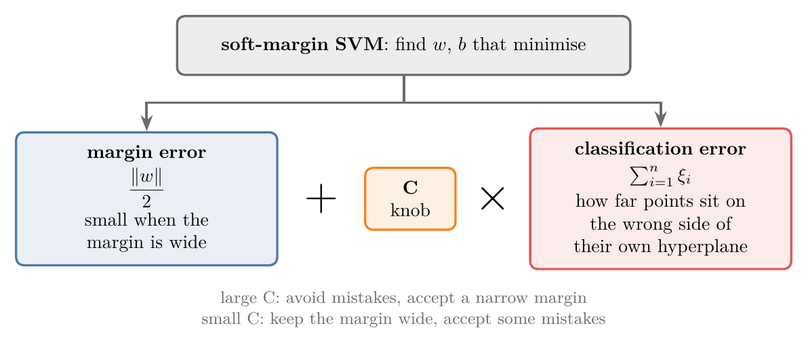
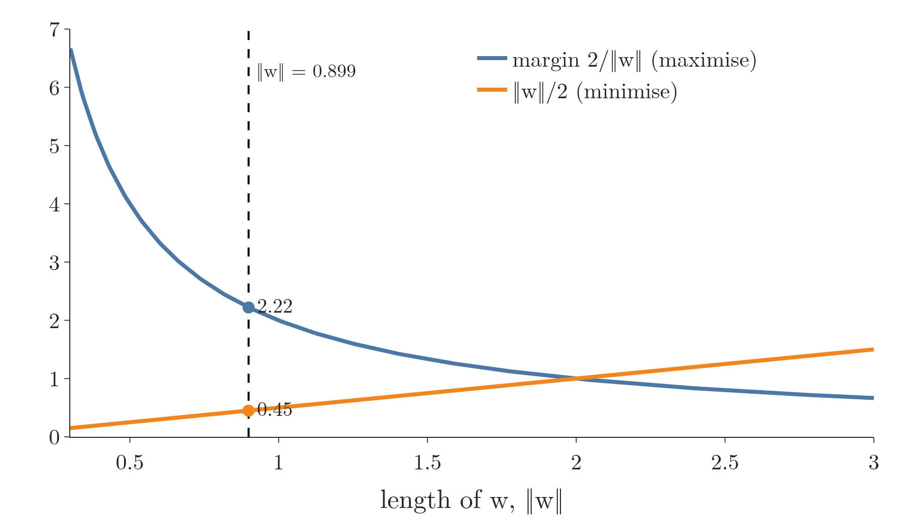
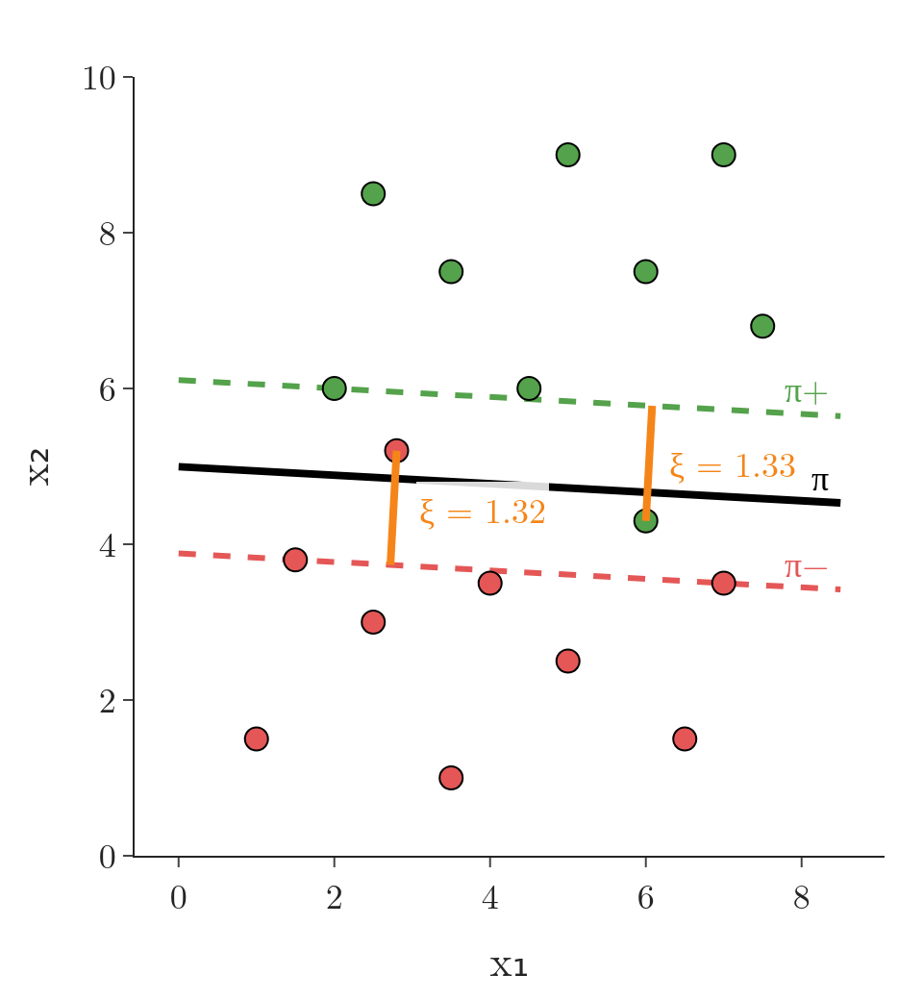
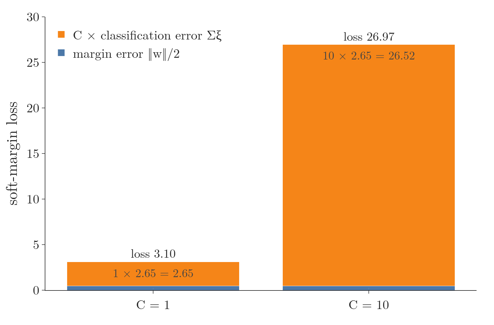
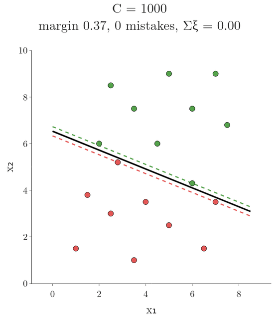
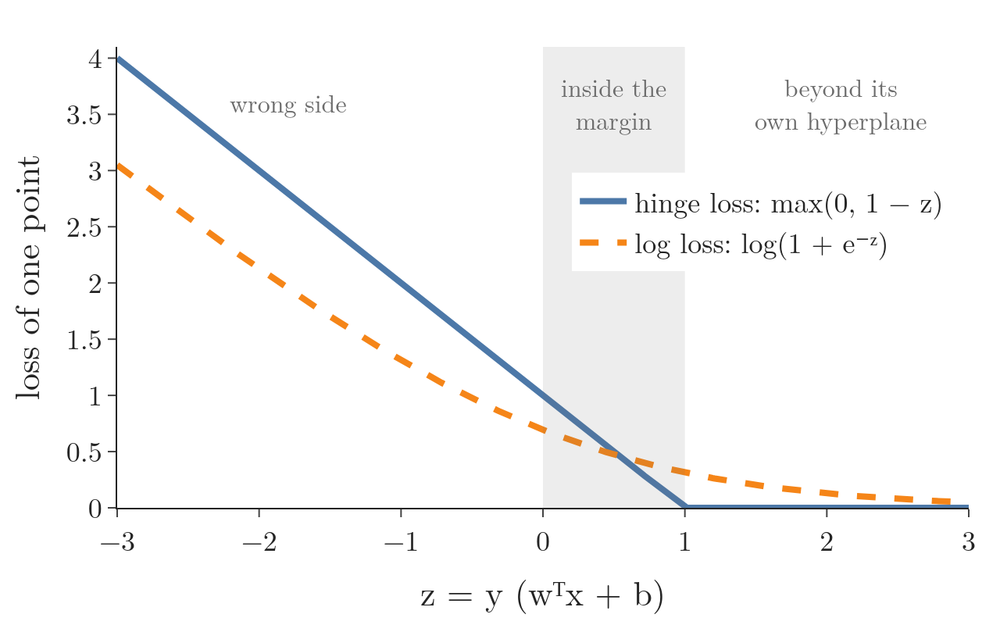

<!-- where-this-fits: generated by course_map/build_map.py; edit concepts.yaml, not this block -->
> **Where this fits:** Pipeline map step 8 (Model). See the [Course map](../../../00-course-map/00-course-map.md).
>
> 
>
> - **Builds on:** [Classification problems](../../../ML/01-foundations/ML-003-types-of-ml/ML-003-types-of-ml.md#1-overview); [Regularisation](../../../ML/06-regression/ML-062-ridge-regression-intuition/ML-062-ridge-regression-intuition.md#1-overview); [Perceptron trick](../../../ML/07-classification/ML-069-perceptron-trick/ML-069-perceptron-trick.md#5-the-perceptron-trick); [Dot product](../../../MA/05-linear-algebra/MA-050-dot-product-and-cosine-similarity/MA-050-dot-product-and-cosine-similarity.md#3-computing-the-dot-product); [Equation of a hyperplane](../../../MA/05-linear-algebra/MA-051-equation-of-a-hyperplane/MA-051-equation-of-a-hyperplane.md#4-the-vector-form); [Lagrange multipliers, KKT and duality](../../../MA/07-optimisation/MA-066-lagrange-multipliers/MA-066-lagrange-multipliers.md#6-lagrangian-duality).
> - **Used here, taught in full later:** [Kernel trick](../../../ML/07-classification/ML-089-kernel-trick-intuition/ML-089-kernel-trick-intuition.md#3-the-kernel-trick).
> - **Compare with:** [Log loss (binary cross entropy)](../../../ML/07-classification/ML-072-log-loss/ML-072-log-loss.md#62-the-loss-function); [Logistic regression](../../../ML/07-classification/ML-074-logistic-gradient-descent/ML-074-logistic-gradient-descent.md#1-overview); [Perceptron loss](../../../DL/01-basics/DL-006-perceptron-loss/DL-006-perceptron-loss.md#6-the-perceptron-loss).
<!-- /where-this-fits -->

## 1. Overview

> **Key point:** Soft-margin SVM lets some points break the rules, but charges for it. Its loss adds a margin error and C times a classification error; C sets the balance.

The hard-margin SVM ([the optimisation problem](../ML-087-svm-maths/ML-087-svm-maths.md#6-the-optimisation-problem)) needs data that a hyperplane separates perfectly (a hyperplane is a straight line when there are two features). Its middle line is $\pi$; the two lines that mark the edges of the margin are $\pi^+$ (on the green side) and $\pi^-$ (on the red side); the margin is the gap between them. Real data often is not (ISL §9.1.5). The **soft-margin SVM** (G-1829) fixes this by giving every point a little room to be wrong, and adding the cost of that room to the loss (Figure 1).

{width=90%}

## 2. Why the hard margin is not enough

> **Key point:** The hard-margin constraints allow no exceptions, so a single point on the wrong side leaves the problem without a solution.

### 2.1 One outlier, in one dimension

> **Key point:** One outlier drags the hard-margin threshold right next to the other class. Allowing that one mistake puts the threshold back between the two main groups.

Take the iris petal lengths of [the idea in one dimension](../ML-086-svm-intuition/ML-086-svm-intuition.md#2-the-idea-in-one-dimension): setosa petals up to 1.9 cm, versicolor petals from 3.0 cm, and the best threshold in the middle of the gap. Now add one made-up outlier: a flower labelled setosa with a 2.9 cm petal, right next to the versicolor flowers (the diamond in Figure 2).

1. **No mistakes allowed.** The threshold must keep the outlier on the setosa side, so it is squeezed between 2.9 and 3.0 cm: threshold 2.95 cm, margin 0.1 cm. A new flower with a 2.8 cm petal is then called setosa, although it sits next to the versicolor flowers and 0.9 cm from the nearest ordinary setosa.
2. **One mistake allowed.** Give up the outlier and the threshold moves back to 2.60 cm, between the two main groups, with a margin of 1.4 cm. The outlier is now misclassified, but the new flower is called versicolor, which is what its neighbours say.


In Figure 2, watch the black threshold and the grey margin as mistakes become cheaper. The number C in the titles is the price of a mistake; Section 6 defines it.

The second threshold is wrong on one training flower but should do better on new flowers. In the language of the bias-variance trade-off (G-288; see [the trade-off](../../06-regression/ML-061-bias-variance/ML-061-bias-variance.md#5-the-trade-off)): allowing a mistake adds a little bias, and removes a lot of variance, because one unusual point no longer decides where the threshold goes. A margin that is allowed to contain or misclassify points is a **soft margin**. How many mistakes to allow is chosen by cross-validation (Section 6).

### 2.2 The same failure in the formula

> **Key point:** With one constraint per point and no exceptions, a single point on the wrong side leaves the problem without a solution.

The hard-margin SVM solves the problem below. Its symbols, each with a value from the best line of [the margin of a line](../ML-086-svm-intuition/ML-086-svm-intuition.md#5-measuring-the-margin-of-a-line):

- $w = (0.049, 0.898)$ is the weight vector (one number per feature) and $b = -4.485$ the intercept;
- $\lVert w \rVert$ is the length of $w$:

  $$\sqrt{0.049^2 + 0.898^2} = 0.899$$

- $w^T x_i$ multiplies the weights by the features of point $i$ and adds. For $x_i = (2.5, 3)$:

  $$0.049 \times 2.5 + 0.898 \times 3 = 2.82$$

- $y_i$ is the class of point $i$, $+1$ or $-1$, and $n$ is the number of points (16 here).

The hard-margin problem ($\arg\max$ returns the $w$ and $b$ that make the expression after it as large as possible):

$$\underset{w,\thinspace b}{\arg\max}\ \frac{2}{\lVert w \rVert}$$

such that, for every point $i$:

$$y_i\thinspace(w^T x_i + b) \geq 1$$

Each point is one **observation** (G-1374; one record, a row of the data table). Its coordinates are its **features** (G-772; input variables, one column each), and its class $y_i$ ($+1$ green, $-1$ red) is the **target** (G-1949; the output we predict).

The constraint says that every green point lies on or above $\pi^+$ and every red point on or below $\pi^-$. A green point below $\pi^+$ breaks the constraint: its target is $+1$ but $w^T x_i + b$ is less than 1, so the product is less than 1. A red point above $\pi^-$ breaks it the same way, with $y_i = -1$ and $w^T x_i + b > -1$.

The hard-margin problem is a constrained optimisation problem with $n$ constraints, one per point. The problem assumes that **no** point ever lies inside the margin or on the wrong side. Many real datasets are at best almost linearly separable: a few points, often outliers, sit on the wrong side. With such data the constraints cannot all be met (see [the constraints](../ML-087-svm-maths/ML-087-svm-maths.md#4-the-constraints)), and the hard-margin problem has no solution (ISL §9.1.5).

We need a version that leaves some space for outliers. That version is the soft-margin SVM.

## 3. From maximising to minimising

> **Key point:** Maximising $2/\lVert w \rVert$ is the same as minimising $\lVert w \rVert$/2. The minimising form is easier to extend.

Before changing anything, we rewrite the hard-margin problem. Take three candidate lines whose margin $f$ is 1, 2 and 4. Their inverses $1/f$ are 1, 0.5 and 0.25. The line with the largest $f$ (4) has the smallest $1/f$ (0.25). In general, for a positive quantity $f$, the largest $f$ is exactly where $1/f$ is smallest, so maximising $f$ and minimising $1/f$ give the same answer. Here $f$ is 2 divided by $\lVert w \rVert$, so $1/f$ is half of $\lVert w \rVert$:

$$\underset{w,\thinspace b}{\arg\max}\ \frac{2}{\lVert w \rVert} = \underset{w,\thinspace b}{\arg\min}\ \frac{\lVert w \rVert}{2}$$

With numbers, for the best line of section 2.2, $\lVert w \rVert = 0.899$:

$$\text{margin} = 2/0.899 = 2.22$$

$$\lVert w \rVert / 2 = 0.899/2 = 0.45$$

The margin 2.22 is as large as possible exactly when 0.45 is as small as possible. The rewritten problem is still the hard-margin SVM; only the form has changed, because a minimisation is easier to add terms to.

Figure 3 shows why the two forms agree. As $\lVert w \rVert$ grows, the margin $2/\lVert w \rVert$ falls and the term $\lVert w \rVert / 2$ rises, so the smallest $\lVert w \rVert$ the constraints allow is the best choice for both.



> **Extra:** In practice, and in scikit-learn, the term is written $\tfrac{1}{2}\lVert w \rVert^2$ instead of $\lVert w \rVert / 2$ (scikit-learn user guide §1.4.7). Squaring does not change which $w$ is smallest, and the squared form is smooth (it has no kink at $w = 0$) and is exactly the L2 penalty of [Ridge regression](../../06-regression/ML-062-ridge-regression-intuition/ML-062-ridge-regression-intuition.md#3-the-idea-penalise-large-coefficients).

## 4. Slack: how far a point breaks the rules

> **Key point:** Each point gets a slack $\xi_i$. The slack is 0 for a point on the correct side of its own hyperplane, and grows with how far the point sits on the wrong side of it.

### 4.1 The new term

> **Key point:** Add $\sum \xi_i$ to the loss: the total amount by which the points break their constraints.

To make the SVM soft, we add one more term to the minimisation:

$$\underset{w,\thinspace b}{\arg\min}\ \frac{\lVert w \rVert}{2} + \sum_{i=1}^{n} \xi_i$$

The Greek letter $\xi$ is "xi". Each training point $i$ gets its own value $\xi_i$, called its **slack** (G-1820). The symbol $\sum_{i=1}^{n}$ (sigma) means "add up the terms for $i = 1, 2, \ldots, n$". On a toy set of $n = 4$ points with slacks $\xi_1 = 0$, $\xi_2 = 1.33$, $\xi_3 = 0$, $\xi_4 = 1.32$:

$$\sum_{i=1}^{4} \xi_i = 0 + 1.33 + 0 + 1.32 = 2.65$$

The symbol $\arg\min$ is the mirror of $\arg\max$: it returns the $w$ and $b$ that give the smallest value of the expression. The algorithm now looks for the $w$ and $b$ that make **both** terms small.

### 4.2 What ξ measures

> **Key point:** During training, green points are judged against π+ and red points against π−, not against π.

During training, each class is judged against its **own** hyperplane: green points against $\pi^+$, red points against $\pi^-$. (The middle line $\pi$ is only used later, to classify new points.)

- A green point on or above $\pi^+$, or a red point on or below $\pi^-$, is fine: $\xi_i = 0$.
- A green point below $\pi^+$, or a red point above $\pi^-$, is an error point. Its $\xi_i$ says how far it is from its own hyperplane, in the wrong direction. The unit is the margin itself: the gap from $\pi$ to $\pi^+$ counts as 1. So $\xi_i = 1$ means the point sits exactly on $\pi$, and $\xi_i > 1$ means it has crossed to the wrong side of $\pi$.

So an error point may be inside the margin but still on the correct side of $\pi$, or right across $\pi$ on the wrong side. The further it is from where it should be, the larger its $\xi_i$.

From here on, the 16 points get two made-up companions that do not fit: a green point at $(6, 4.3)$ among the red points and a red point at $(2.8, 5.2)$ among the green ones. With them, the hard-margin line can still separate the classes, but only with a margin of 0.37 instead of 2.22 (Figure 6, $C = 1000$). Figures 4 to 6 use these 18 points.

Figure 4 shows the two error points of a soft-margin SVM on them. The green point $(6, 4.3)$ lies below $\pi^+$, even below $\pi$: $\xi = 1.33$. The red point $(2.8, 5.2)$ lies above $\pi^-$ and above $\pi$: $\xi = 1.32$. Every other point has $\xi = 0$.

{height=45%}

Minimising $\sum \xi_i$ therefore means keeping the errors few and small.

> **Extra:** Precisely, the slack is:
>
> $$\xi_i = \max\bigl(0,\ 1 - y_i (w^T x_i + b)\bigr)$$
>
> The hard constraint is loosened to the following, with $\xi_i \geq 0$:
>
> $$y_i (w^T x_i + b) \geq 1 - \xi_i$$
>
> The distance in the plot, in the units of the axes, is $\xi_i / \lVert w \rVert$. For the green point:
>
> $$1.33 / 0.900 = 1.48$$
>
> A point with $0 < \xi_i \leq 1$ is inside the margin but still correctly classified; $\xi_i > 1$ means it is on the wrong side of $\pi$.

## 5. The soft-margin loss

> **Key point:** Loss = margin error + C × classification error. The first term wants a wide margin, the second wants few and small mistakes.

The two terms pull in different directions:

- $\lVert w \rVert / 2$ is the **margin error** (G-1161). Section 3 showed the margin width; call it $d$:

  $$d = 2/\lVert w \rVert$$

  So the margin error equals $1/d$: it falls as the margin widens, and a wide margin gives a small margin error.
- $\sum \xi_i$ is the **classification error** (G-393). The classification error falls as the error points move back to their own side.

The last step is a weight on the classification error, a positive number $C$. In words: find the line that balances a wide margin against small errors, with $C$ deciding how much the errors count. As a formula, the soft-margin SVM solves:

$$\underset{w,\thinspace b}{\arg\min}\ \text{margin error}$$

$$\phantom{\arg\min} + C \times \text{classification error}$$

The two errors are:

$$\text{margin error} = \frac{\lVert w \rVert}{2}$$

$$\text{classification error} = \sum_{i=1}^{n} \xi_i$$

With numbers, for the line of Figure 4. First the two parts, which do not depend on $C$:

$$\text{margin error} = \lVert w \rVert / 2 = 0.900 / 2 = 0.45$$

$$\text{classification error} = \sum \xi_i = 1.33 + 1.32 = 2.65$$

With $C = 1$ the loss is:

$$0.45 + 1 \times 2.65 = 3.10$$

With $C = 10$ the same mistakes cost more (the unrounded $\sum \xi_i$ is 2.652):

$$0.45 + 10 \times 2.652 = 0.45 + 26.52 = 26.97$$

A larger C makes each mistake cost more, which is why a larger C pushes the line to fix them. Figure 5 stacks the two parts for both values of $C$: the margin error is a thin slice either way, and the classification error takes over as $C$ grows.



## 6. The hyperparameter C

> **Key point:** Large C: avoid mistakes, accept a narrow margin. Small C: keep the margin wide, accept some mistakes. Tune C with cross-validation.

$C$ (G-336) is a **hyperparameter** (G-910; see [hyperparameter tuning](../../03-feature-engineering/ML-028-pipelines/ML-028-pipelines.md#9-hyperparameter-tuning-with-a-pipeline)): a tuning knob we set before training. C can be any positive number. An everyday picture: C is the size of the fine for each rule-breaking point. A huge fine makes the line bend over backwards to avoid any mistake; a tiny fine lets it relax and keep a wide road.

- **Large C** (say 1,000 or 10,000): the classification error dominates. The algorithm stops caring about the width of the margin and concentrates on misclassifying no point.
- **Small C** (say 0.1, 0.01 or 0.001): the margin error dominates. The algorithm keeps the margin wide even if some points end up misclassified.

Figure 6 lowers C step by step on the same data and pauses at three values. Watch the margin widen as the fine for mistakes falls, while more points need slack (orange). With $C = 1000$ the margin is only 0.37 wide, but no point is misclassified. With $C = 1$ it is 2.22 wide with two mistakes; with $C = 0.05$ it is 4.65 wide.

{height=36%}

Neither extreme is right in general. A model with no training mistakes and a thin margin may be fitting outliers; a model with a very wide margin may ignore real structure. So we pick C for each dataset with cross-validation (ISL §9.2.2), usually through a grid search over values such as 0.001, 0.01, ..., 1,000.

> **Python:** In scikit-learn, `C` is an argument of `SVC`; its default is 1.
>
> ```python
> from sklearn.svm import SVC
> from sklearn.model_selection import GridSearchCV
>
> svm = SVC(kernel="linear", C=1)     # soft margin, C = 1
> svm.fit(X, y)
>
> # choose C by 5-fold cross-validation
> grid = GridSearchCV(SVC(kernel="linear"),
>                     {"C": [0.001, 0.01, 0.1, 1, 10, 100, 1000]}, cv=5)
> grid.fit(X, y)
> grid.best_params_
> ```

## 7. Comparison with logistic regression

> **Key point:** Both are "loss + regularisation". SVM uses the hinge loss where logistic regression uses the log loss, and in both, C is the inverse of the regularisation strength λ.

The soft-margin loss has the same shape as the loss of regularised logistic regression:

| | Error on the data | Regularisation | Strength |
|---|---|---|---|
| Logistic regression | [log loss](../ML-072-log-loss/ML-072-log-loss.md#62-the-loss-function) | $\lambda \lVert w \rVert^2$ (L2) | $\lambda$ on the penalty |
| Soft-margin SVM | $\sum \xi_i$: the **hinge loss** | $\lVert w \rVert / 2$ | $C$ on the error |

- The margin term $\lVert w \rVert / 2$ plays the role of the **regularisation** (G-1659) term: it keeps $w$ small, which here means a wide margin.
- The error term $\sum \xi_i$ is called the **hinge loss** (G-898), the SVM's counterpart of the log loss.
- $C$ multiplies the error instead of the penalty, so it works the other way round: written as "hinge loss + $\tfrac{\lambda}{2} \lVert w \rVert^2$", the SVM has $\lambda = 1/C$ (ESL §12.3.2). A large C means weak regularisation; a small C means strong regularisation.

scikit-learn's `LogisticRegression` also has a `C` and no $\lambda$ (see [the strength C](../ML-080-logistic-hyperparameters/ML-080-logistic-hyperparameters.md#22-the-strength-c)), following the same convention as SVM: a larger C means less regularisation in both (scikit-learn docs, `LogisticRegression`).

> **Extra:** Write $z = y_i(w^T x_i + b)$ for one point. For example, a green point with $w^T x_i + b = 0.4$ has $z = 0.4$. Then the two losses of that point are:
>
> $$\text{hinge} = \max(0, 1 - z)$$
>
> $$\text{log loss} = \log(1 + e^{-z})$$
>
> This is the same log loss as before, written for target values $\pm 1$. At $z = 0.4$ the hinge loss is:
>
> $$1 - 0.4 = 0.6$$
>
> Figure 7 compares them. The hinge loss is exactly 0 for every point beyond its own hyperplane ($z \geq 1$), so those points do not affect the line at all; only points on or inside the margin matter, which is why SVM depends only on its support vectors. The log loss never quite reaches 0, so every point keeps pulling a little.
>
> {height=32%}

## 8. Why "soft margin"

> **Key point:** The margin is "soft" because points may enter it or cross it, at a price.

The hard-margin SVM forbids any point inside the margin. The soft-margin SVM relaxes that rule: it allows some errors, as long as it pays for them through $C \sum \xi_i$. Because the criterion is softened, this formulation is called the **soft-margin SVM**. The soft-margin SVM is the version scikit-learn's `SVC` uses.

## 9. Summary

| | Hard-margin SVM | Soft-margin SVM |
|---|---|---|
| Objective | $\min \lVert w \rVert / 2$ | $\min \lVert w \rVert / 2 + C \sum \xi_i$ |
| Points inside the margin or misclassified | not allowed | allowed, at a cost $\xi_i$ |
| Works on | perfectly separable data | almost separable data with outliers |
| Knob | none | C |

- $\arg\max 2/\lVert w \rVert$ equals $\arg\min \lVert w \rVert / 2$, because the largest margin is exactly where its inverse is smallest; the minimising form is easier to add terms to.
- Slack $\xi_i$: 0 on the correct side of a point's own hyperplane, otherwise how far the point is past it, in margin units ($\xi_i > 1$: wrong side of $\pi$). So every point gets room to be wrong, and the problem always has a solution.
- Loss = margin error + C × classification error (hinge loss), so the line balances a wide margin against few and small mistakes.
- Large C: narrow margin, few mistakes. Small C: wide margin, more mistakes. Tune C by cross-validation, because a thin margin may fit outliers and a very wide one may ignore real structure.
- C plays the role of $1/\lambda$, as in `LogisticRegression`, because it multiplies the error instead of the penalty; so a larger C means weaker regularisation in both.
- So the soft margin lets one outlier stop deciding where the line goes (iris threshold 2.60 cm instead of 2.95 cm), which is why it is the version scikit-learn's `SVC` uses.

## 10. Sources

**Built from**

- CampusX, "Mathematics of Support Vector Machine | Soft Margin SVM", YouTube, https://www.youtube.com/watch?v=utqrvIFAE1k
- StatQuest with Josh Starmer, "Support Vector Machines Part 1 (of 3): Main Ideas!!!", YouTube, https://www.youtube.com/watch?v=efR1C6CvhmE (the one-dimensional outlier, the soft margin and the bias-variance reason for it; Figure 2 recreates it on iris petal lengths)

**Other references**

- **ISL:** James, G., Witten, D., Hastie, T. and Tibshirani, R. *An Introduction to Statistical Learning*, 2nd edition. Springer, 2021. Sections 9.1.5 (p. 373) and 9.2.2 (p. 377).
- **ESL:** Hastie, T., Tibshirani, R. and Friedman, J. *The Elements of Statistical Learning*, 2nd ed. Springer, 2009. Section 12.3.2, p. 426.
- **scikit-learn docs:** user guide Section 1.4.7, "Mathematical formulation" (SVC); `sklearn.linear_model.LogisticRegression` (parameter C), scikit-learn 1.9.

## 11. Key terms

| Term | Meaning |
|---|---|
| Soft-margin SVM | The SVM that allows points inside the margin or on the wrong side, at a cost controlled by C |
| Slack (ξ) | How far a training point lies on the wrong side of its own hyperplane; 0 if it is on the correct side |
| Margin error | The part of the soft-margin SVM loss, $\lVert w \rVert / 2$, that grows as the margin narrows; minimising it pushes the margin wider. |
| Classification error (SVM) | The part of the soft-margin SVM loss that adds up every point's slack $\xi_i$ (how far the point sits on the wrong side of its own hyperplane): $\sum \xi_i$, the total slack of all points. |
| Hinge loss | The SVM's error for one point: 0 when the point is on the correct side and outside the margin, growing in a straight line the further it goes past the margin; formula $\max(0, 1 - y(w^T x + b))$. |
| C (SVM) | The weight on the classification error; a large C means few mistakes and a narrow margin, a small C a wide margin |
