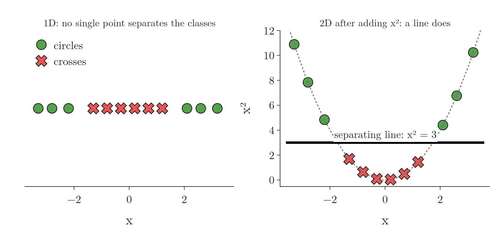
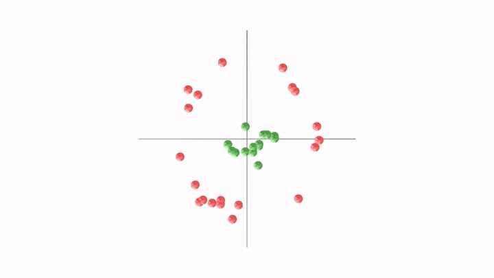

<!-- where-this-fits: generated by course_map/build_map.py; edit concepts.yaml, not this block -->
> **Where this fits:** Pipeline map step 8 (Model). See the [Course map](../../../00-course-map/00-course-map.md).
>
> 
>
> - **Compare with:** [Polynomial features](../../../ML/07-classification/ML-079-polynomial-logistic-regression/ML-079-polynomial-logistic-regression.md#22-the-formal-version-polynomial-features).
<!-- /where-this-fits -->

## 1. Overview

> **Key point:** When the classes cannot be split by a straight line, we move the data into a higher dimension (a space with more axes) where they can. A linear SVM there gives a curved boundary back in the original space. A kernel lets SVM work in that higher dimension without ever building it.

One of SVM's main strengths, listed in the [SVM strengths](../ML-086-svm-intuition/ML-086-svm-intuition.md#7-strengths-of-svm), is that it also works on non-linear data. The tool that makes this possible is the **kernel trick** (G-1008). Figure 1 shows the idea in four steps.

{width=100%}

An everyday picture: blue marbles sit in the middle of a tablecloth and red marbles around them. No ruler laid flat on the table can fence off the blue ones. Now push the middle of the cloth up from below. The blue marbles rise, the red ones stay low, and a flat tray held level slides between the two colours. The kernel trick uses the same idea: add a height so that a flat cut works.

The mathematics behind it is involved. This Note gives the intuition with two pictures; the next Note runs it in code.

## 2. Data that no straight line can split

> **Key point:** In 1D, a straight boundary is a single point. Circles on both ends and crosses in the middle cannot be split by one point.

Take a dataset with only one **feature** (G-772; an input variable, one column of the data table), so every **observation** (G-1374; one record, one row of the table) is a point on one axis (Figure 2, left). There are two classes: crosses in the middle and circles on both sides.

In 1D a linear boundary is a single point: everything left of it is one class, everything right of it the other. No single point can put all the crosses on one side and all the circles on the other. Data like this is **not linearly separable** (**non-linear data**, G-1335): no straight boundary splits the classes, so a linear SVM cannot classify it.

## 3. The kernel trick

> **Key point:** Apply a function that adds a new dimension, chosen so the classes become linearly separable there. That function is the feature map φ. The kernel K(a, b) gives the dot product of two lifted points straight from the original values.

### 3.1 Lifting 1D data into 2D

> **Key point:** Add x² as a second axis. The circles go high, the crosses stay low, and a horizontal line splits them.

The trick is to apply a mathematical function that turns the lower-dimensional **feature space** (G-2219) (the space whose axes are the features) into a higher-dimensional one, in such a way that the data becomes linearly separable. For the 1D data, the function $x \mapsto (x, x^2)$ does it (Figure 2, right). The arrow $\mapsto$ reads "turns into": each 1D point $x$ becomes a 2D point $(x, x^2)$.

$$x = 3 \thickspace\mapsto\thickspace(3, 9)$$

$$x = -1 \thickspace\mapsto\thickspace(-1, 1)$$

$$x = 0 \thickspace\mapsto\thickspace(0, 0)$$

{height=33%}

Each point keeps its $x$ and gets a height $x^2$:

- the crosses lie near 0, so their $x^2$ is small (at most $1.3^2 = 1.69$);
- the circles lie far from 0, so their $x^2$ is large (at least $2.1^2 = 4.41$).

In 2D the boundary is a line, and the horizontal line $x^2 = 3$ now separates the two classes. Read back on the original axis, this line corresponds to two cut points, $x = -1.73$ and $x = +1.73$: a boundary that no single linear cut could give. Adding $x^2$ as a new input is the same idea as the [polynomial features](../ML-079-polynomial-logistic-regression/ML-079-polynomial-logistic-regression.md#22-the-formal-version-polynomial-features) used with logistic regression.

### 3.2 The feature map and the kernel

> **Key point:** The feature map φ lifts one point. The kernel K(a, b) = φ(a) · φ(b) compares two lifted points, and is computed without lifting them.

Two functions are involved, and they are easy to mix up.

1. **The feature map** (G-765), written $\phi$, is the lifting function. It takes one point and gives its coordinates in the higher-dimensional space. In Section 3.1, $\phi(x) = (x, x^2)$. Lifting the data this way is loosely called the **kernel transformation** (G-1007).
2. **The kernel** (G-1004), written $K(a, b)$, takes **two** points and returns one number: the **dot product** (G-634; multiply matching entries of two vectors and add, see [computing the dot product](../../../MA/05-linear-algebra/MA-050-dot-product-and-cosine-similarity/MA-050-dot-product-and-cosine-similarity.md#3-computing-the-dot-product)) the two points would have after lifting, $K(a, b) = \phi(a) \cdot \phi(b)$.

An SVM needs only these dot products between pairs of points, never the lifted coordinates themselves. And the kernel can be computed from the original values. For the lift of Section 3.1:

$$\phi(a) \cdot \phi(b) = (a, a^2) \cdot (b, b^2)$$

$$= ab + a^2 b^2$$

$$= ab + (ab)^2$$

With numbers, for $a = 2$ and $b = 3$:

- **Lift, then dot product:** $\phi(2) = (2, 4)$ and $\phi(3) = (3, 9)$, so:
  $$2 \times 3 = 6$$
  $$4 \times 9 = 36$$
  $$\phi(a) \cdot \phi(b) = 6 + 36 = 42$$
- **Kernel only:** $ab = 6$, so:
  $$K(a, b) = 6 + 6^2 = 42$$

Both routes give 42, but the second never built the new axis. Getting the higher-dimensional dot product without lifting the data is the **kernel trick** (G-1008). [Why it is a trick](../ML-090-kernel-trick-code/ML-090-kernel-trick-code.md#7-why-it-is-a-trick) in the next Note draws the two routes for 2D points.

So "choosing a kernel" means choosing the formula $K(a, b)$, and with it, silently, the lift $\phi$. (The word has nothing to do with the Jupyter kernel, the Python process behind a notebook; see [the kernel](../../01-foundations/ML-011-setup-anaconda-jupyter-colab/ML-011-setup-anaconda-jupyter-colab.md#33-the-kernel).)

There are many kernels. Besides the plain linear one, scikit-learn's SVM comes with three:

1. **RBF** (G-1639; radial basis function): the most important one, used in Section 4. RBF is the usual first choice (Hsu et al. §3.1), for three reasons:
   - it draws curved boundaries, and with suitable settings it can also behave like the linear kernel;
   - it has fewer settings to tune than the polynomial kernel;
   - its values always stay between 0 and 1, while polynomial kernel values can grow huge or shrink towards 0 at high degrees.
2. **Polynomial** (G-1514): built from powers of the inputs. The $x^2$ example above is of this type.
3. **Sigmoid** (G-1799): an S-shaped kernel.

> **Extra:** The sigmoid kernel is $\tanh(\gamma\thinspace x \cdot x' + r)$. The sigmoid kernel has the same S-shape as the [sigmoid function](../ML-071-sigmoid-function/ML-071-sigmoid-function.md#4-the-sigmoid-function) of logistic regression, but it is a different formula (tanh, ranging from −1 to 1), and it does not turn SVM into logistic regression. The sigmoid kernel came to SVMs from neural networks, where tanh is a common activation, and in general it does no better than RBF (Lin and Lin 2003).

## 4. A 2D example: concentric circles

> **Key point:** One class in the centre, the other in a ring around it. The RBF function $e^{-r^2}$ lifts the centre points up, and a flat plane then separates them.

Now take 2D data with two classes arranged as concentric circles: green points in the centre, red points in a ring around them (Figure 3, first frame). No straight line can separate a disc from the ring around it.

We apply a function of the form $e^{-x^2}$ (with $e \approx 2.718$). The graph of $e^{-x^2}$ is a bump: highest at 0 and falling towards 0 on both sides. In 2D we use the distance from the centre, $r^2 = x_1^2 + x_2^2$, and give every point a third coordinate:

$$z = e^{-(x_1^2 + x_2^2)}$$

The data is first centred so that the bump sits in the middle of the inner class.

- A green point near the centre, say $(0.3, 0.2)$, ends high up:
  $$r^2 = 0.3^2 + 0.2^2 = 0.13$$
  $$z = e^{-0.13} = 0.88$$
- A red point on the ring, say $(1.5, 0.6)$, stays near the floor:
  $$r^2 = 1.5^2 + 0.6^2 = 2.61$$
  $$z = e^{-2.61} = 0.07$$

So the green points rise and the red points stay low. In 3D a flat plane between the two heights separates them (Figure 3).

{height=55%}

Back in the original 2D plane, the flat plane corresponds to a circle around the centre: the curved boundary we needed (Section 5 draws it).

This bump is the shape behind the **RBF kernel**, short for radial basis function: "radial" because it depends only on a distance. The RBF kernel puts such a bump on the distance between two points: $K(a, b) = e^{-\gamma \lVert a - b \rVert^2}$. Its value is close to 1 for two points that are near each other and close to 0 for two points far apart. So each training point mainly influences the points near it, much like a weighted vote of the nearest neighbours (see [how KNN predicts](../ML-085-knn/ML-085-knn.md#2-how-knn-predicts)). The setting $\gamma$ (gamma, G-823) controls how far that influence reaches; [gamma, how far one point's influence reaches](../ML-090-kernel-trick-code/ML-090-kernel-trick-code.md#8-gamma-how-far-one-points-influence-reaches) in the next Note shows its effect.

## 5. The kernel trick in SVM

> **Key point:** Kernels are built into SVM. We choose the kernel and its settings as hyperparameters and tune them with grid search.

The kernel trick is built into the SVM algorithm. We do not write the feature map ourselves: we choose a kernel, and SVM handles the rest. The kernel and its settings are **hyperparameters** (G-910), so we choose them like C in [the hyperparameter C](../ML-088-svm-soft-margin/ML-088-svm-soft-margin.md#6-the-hyperparameter-c): with a **grid search** (trying every combination of listed values; see [grid search](../../03-feature-engineering/ML-028-pipelines/ML-028-pipelines.md#9-hyperparameter-tuning-with-a-pipeline)) and **cross-validation** (scoring each setting on several held-out parts of the data; see [cross-validation with a pipeline](../../03-feature-engineering/ML-028-pipelines/ML-028-pipelines.md#8-cross-validation-with-a-pipeline)).

In summary, an SVM with a kernel works in three steps:

1. start with data that is not linearly separable in its own dimension;
2. move it, through the kernel, into a higher-dimensional feature space where it is linearly separable;
3. find the widest-margin hyperplane there (the flat boundary with the widest empty strip on each side, see [the margin](../ML-086-svm-intuition/ML-086-svm-intuition.md#4-the-margin)).

Figure 4 shows steps 2 and 3 on the 34 points of Figure 3, and reads the cut back in the original plane. On the left, every point is placed by its distance from the centre and its new height $z$; the flat cut is the horizontal line at $z = 0.37$, halfway between the lowest green point and the highest red one. On the right, the same cut drawn in the original plane: every point at height 0.37 lies at distance 0.99 from the centre, so the straight cut becomes a circle, with all green points inside and all red points outside.

Why is it called a "trick"? As Section 3.2 showed, SVM never actually builds the new features: its training only needs dot products between pairs of points, and the kernel gives each one directly from the original coordinates (MML §12.4).

> **Extra:** For the RBF kernel the higher-dimensional space is even infinite, so building it explicitly would be impossible; the kernel value is still one cheap formula (MML §12.4).

## 6. Summary

| Data | Feature map | New space | Boundary there | Boundary back in the original space |
|---|---|---|---|---|
| 1D: crosses in the middle | $x \mapsto (x, x^2)$ (polynomial) | 2D | the line $x^2 = 3$ | two cut points, $x = \pm 1.73$ |
| 2D: concentric circles | $z = e^{-(x_1^2 + x_2^2)}$ (the RBF bump) | 3D | a flat plane | a circle |

- Non-linear data: no straight line, plane or hyperplane separates the classes, so a linear SVM cannot classify it.
- Idea: map the data to a higher dimension where it becomes linearly separable, then use a linear SVM there, because a flat boundary in the new space reads back as a curved one in the original space (two cut points, a circle).
- The map is the feature map $\phi$. The kernel is $K(a, b) = \phi(a) \cdot \phi(b)$, computed from the original values, so both routes give the same number (42 in the worked example) without building the new axis.
- Kernel trick: SVM only needs these dot products, so the higher-dimensional features are never built; for RBF that space is infinite, so building it would be impossible.
- Common kernels: RBF (most used), polynomial, sigmoid. The kernel is a hyperparameter of SVM, so it is chosen with grid search and cross-validation, like C.
- So the kernel trick is what lets SVM draw curved boundaries on data no straight line can split.

## 7. Sources

**Built from**

- CampusX, "Kernel Trick in SVM | Geometric Intuition", YouTube, https://www.youtube.com/watch?v=egxjT0p7_K8
- StatQuest with Josh Starmer, "Support Vector Machines Part 1 (of 3): Main Ideas!!!", YouTube, https://www.youtube.com/watch?v=efR1C6CvhmE (the kernel trick: pairwise relationships computed without transforming the data)
- StatQuest with Josh Starmer, "Support Vector Machines Part 3: The Radial (RBF) Kernel (Part 3 of 3)", YouTube, https://www.youtube.com/watch?v=Qc5IyLW_hns (the RBF kernel as a weighted nearest-neighbour vote; gamma scales the influence)

**Other references**

- **Lin and Lin 2003:** H.-T. Lin and C.-J. Lin, *A Study on Sigmoid Kernels for SVM and the Training of non-PSD Kernels by SMO-type Methods*, National Taiwan University, 2003. csie.ntu.edu.tw/~cjlin/papers/tanh.pdf
- **Hsu et al.:** C.-W. Hsu, C.-C. Chang and C.-J. Lin, *A Practical Guide to Support Vector Classification*, National Taiwan University, 2003 (updated 2025). Section 3.1, RBF Kernel. csie.ntu.edu.tw/~cjlin/papers/guide/guide.pdf
- **MML:** M. P. Deisenroth, A. A. Faisal and C. S. Ong, *Mathematics for Machine Learning*, Cambridge University Press, 2020. Section 12.4, Kernels.

## 8. Key terms

| Term | Meaning |
|---|---|
| Feature space (G-2219) | The space whose axes are the features; the feature map takes the data into a higher-dimensional one |
| Kernel trick | Making non-linear data separable by mapping it to a higher dimension, without building the new features |
| Feature map ($\phi$) | The lifting function: it takes one point and gives its coordinates in the higher-dimensional space |
| Kernel (SVM), $K(a, b)$ (G-1004) | A function of two points that returns their dot product in the higher-dimensional space, $\phi(a) \cdot \phi(b)$, directly from the original values (not the Jupyter kernel) |
| Kernel transformation | A loose name for lifting the data to the higher-dimensional space |
| Non-linear data | Data whose classes no straight line, plane or hyperplane can separate |
| RBF kernel | Radial basis function kernel, built on $e^{-(\text{distance})^2}$: it scores two points as similar (close to 1) when they are near each other and close to 0 when far apart; the usual first-choice SVM kernel for curved boundaries. |
| Polynomial kernel | A kernel (a function that gives the dot product of two points after a feature map) whose feature map is built from powers of the inputs, such as $x^2$; it lets an SVM draw curved boundaries. |
| Sigmoid kernel | The S-shaped kernel $\tanh(\gamma\thinspace x \cdot x' + r)$ |
