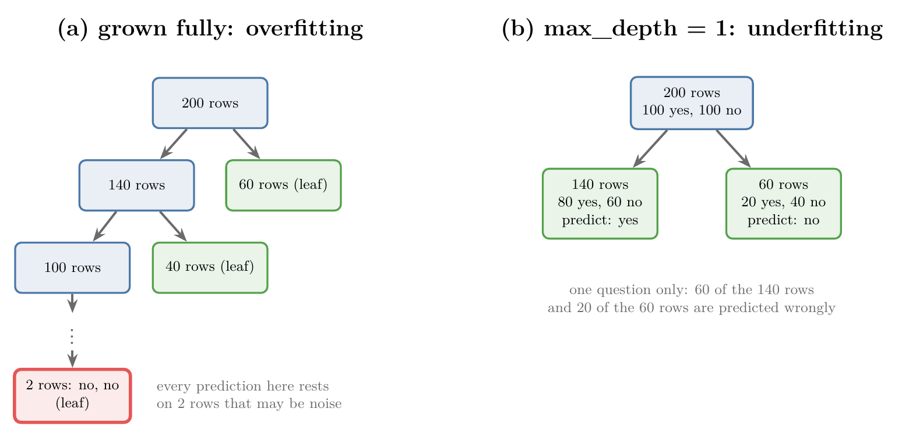
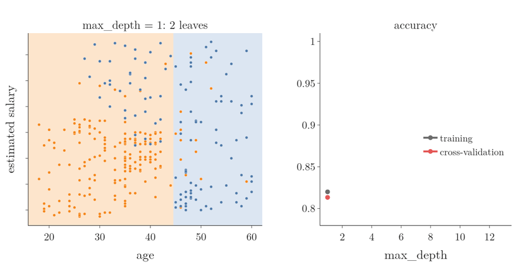
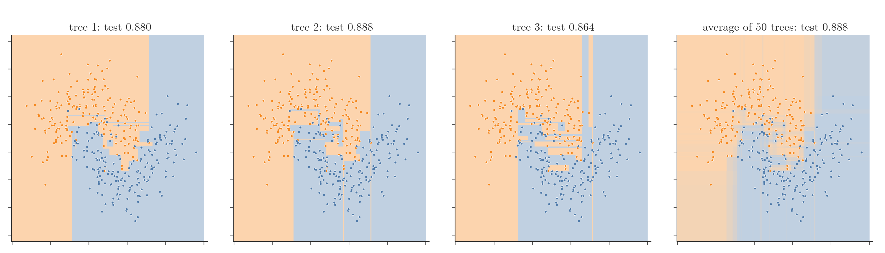
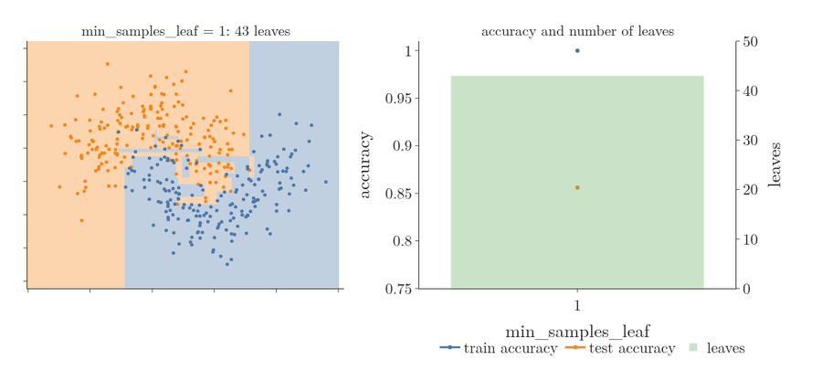

<!-- where-this-fits: generated by course_map/build_map.py; edit concepts.yaml, not this block -->
> **Where this fits:** Pipeline map steps 8 (Model), 10 (Tune). See the [Course map](../../../00-course-map/00-course-map.md).
>
> 
>
> - **Builds on:** Model-based learning ([Note ML-006](../../../ML/01-foundations/ML-006-instance-vs-model-based/ML-006-instance-vs-model-based.md)); Overfitting ([Note ML-007](../../../ML/01-foundations/ML-007-challenges-in-ml/ML-007-challenges-in-ml.md)); Decision surface and boundary ([Note ML-085](../../../ML/07-classification/ML-085-knn/ML-085-knn.md)); Entropy, information gain and Gini ([Note ML-091](../../../ML/08-trees-and-ensembles/ML-091-decision-trees-intuition/ML-091-decision-trees-intuition.md)).
> - **Leads to:** Feature importance ([Note ML-093](../../../ML/08-trees-and-ensembles/ML-093-regression-trees/ML-093-regression-trees.md)); Regression trees ([Note ML-093](../../../ML/08-trees-and-ensembles/ML-093-regression-trees/ML-093-regression-trees.md)); Grid and random search ([Note ML-093](../../../ML/08-trees-and-ensembles/ML-093-regression-trees/ML-093-regression-trees.md)); Ensemble learning ([Note ML-095](../../../ML/08-trees-and-ensembles/ML-095-ensemble-learning/ML-095-ensemble-learning.md)); Bagging ([Note ML-099](../../../ML/08-trees-and-ensembles/ML-099-bagging-intuition/ML-099-bagging-intuition.md)); Random forest ([Note ML-102](../../../ML/08-trees-and-ensembles/ML-102-random-forest-intro/ML-102-random-forest-intro.md)).
> - **Compare with:** Feature scaling ([Note ML-023](../../../ML/03-feature-engineering/ML-023-standardization/ML-023-standardization.md)).
<!-- /where-this-fits -->

## 1. Overview

> **Key point:** A decision tree left alone grows until every leaf is pure, which overfits. Its hyperparameters are brakes: each one stops the tree earlier, and too much braking underfits.

Decision trees (the [decision tree intuition Note](../ML-091-decision-trees-intuition/ML-091-decision-trees-intuition.md)) are strong models with one big weakness: they tend to **overfit** (G-1429). They score very well on the training data and worse on new data (overfitting, [Note ML-007](../../01-foundations/ML-007-challenges-in-ml/ML-007-challenges-in-ml.md)). A tree asks questions about the **features** (G-772; input variables, one column each of the data table) of each **observation** (G-1374; one record, one row of the table) and predicts the **target** (G-1949; the output).

To control this, scikit-learn's `DecisionTreeClassifier` offers several **hyperparameters** (G-910), settings we choose before training (the [pipelines Note](../../03-feature-engineering/ML-028-pipelines/ML-028-pipelines.md)), that act as tuning knobs. This Note covers:

- why a fully grown tree overfits, and why a very short one underfits;
- `max_depth` on a real dataset, with its decision surfaces;
- the other main hyperparameters: `criterion`, `splitter`, `min_samples_split`, `min_samples_leaf`, `max_features`, `max_leaf_nodes` and `min_impurity_decrease`;
- cutting a grown tree back: cost-complexity pruning with `ccp_alpha`.

The Notebook (`notebook.ipynb`) runs every experiment. The Dash app `app.py` has a control for every hyperparameter, redraws the decision surface and prints the tree.

## 2. Overfitting and underfitting in a tree

> **Key point:** Depth is the main knob: too deep and leaves rest on a handful of noisy observations; too shallow and the tree ignores most of the pattern.

The **depth** (G-594) of a tree is the number of questions on its longest path from the root to a leaf. The hyperparameter `max_depth` (G-1184) caps it. Depth is the main cause of both overfitting and underfitting.

### 2.1 A fully grown tree overfits

> **Key point:** With no limit, the tree keeps splitting until its leaves hold a few observations, and those observations may be noise.

Take 200 observations (Figure 1a). A split on some feature sends 140 observations one way and 60 the other. Suppose the 60 form a leaf, but the 140 are split again, then again, and so on. Eventually we reach a leaf with only **2 observations**, both "no".

{height=38%}

Every new point that reaches this leaf is labelled "no", because of those 2 observations alone. If they are noise, outliers or data-entry errors, all that if-else logic ends up relying on two untrustworthy observations. The tree is perfect on the training data and fails on new data: overfitting.

By default `max_depth=None`, so the tree grows until every leaf is pure. That default, the **fully grown tree** (G-813), invites exactly this tiny-leaf overfitting.

Geometrically, the tree keeps cutting the plane with axis-parallel lines until each small box holds a single class. A lone green point surrounded by red ones gets its own tiny green box. Any new point landing in that box is called green, although everything around it says red. Such a tiny box is the same problem as KNN with k = 1 (the [KNN Note](../../07-classification/ML-085-knn/ML-085-knn.md), section 6.1).

### 2.2 A tree of depth 1 underfits

> **Key point:** With one question, each leaf predicts its majority class even when the leaf is badly mixed.

Now set `max_depth=1`: one split only (Figure 1b). The 200 observations (100 yes, 100 no) split into 140 observations (80 yes, 60 no) and 60 observations (20 yes, 40 no). Both children become leaves at once.

A leaf predicts its majority class. A new point that falls in the 140-observation leaf is called "yes", because yes outnumbers no there, even though 60 of those 140 training observations were "no". The tree has barely looked at the data before answering confidently: underfitting.

Geometrically, one line cuts the plane in two, and each half gets a single class, however mixed it is.

So `max_depth` needs a middle value: too small underfits, too large (or `None`) overfits.

## 3. max_depth on the Social Network Ads data

> **Key point:** On age and salary, the fully grown tree draws islands around single points; depth 1 draws one line; depths 2 to 5 follow the real pattern.

The Social Network Ads data (the [standardization Note](../../03-feature-engineering/ML-023-standardization/ML-023-standardization.md)) records each user's age and estimated salary, and whether they bought a product after seeing an ad. We train trees of several depths on 300 observations and test on the other 100, then draw each decision surface the same way as in the [KNN Note](../../07-classification/ML-085-knn/ML-085-knn.md) (section 5.2): predict on a dense `meshgrid` and colour every point by its class.

{height=55%}

Figure 2 shows the results:

- **`max_depth=None`** (top left): 49 leaves and 100% training accuracy. The surface is full of thin strips and small boxes around single points: a blue point deep in orange territory gets its own blue box, and a few orange points carve orange strips into the blue area. Clear overfitting; test accuracy 0.91.
- **`max_depth=1`** (top middle): one vertical line at an age of about 44.5. Many young buyers with high salaries sit in the orange "not purchased" region. Clear underfitting; training accuracy only 0.82.
- **`max_depth=2` to `5`**: the surface follows the pattern of the data. Young people with high salaries buy, older people mostly buy, and young people with average salaries do not. Test accuracy is 0.93 to 0.95.

From depth 5 onwards, strips around single points start to appear again: overfitting returns.

Picking the depth by eye works for two features we can plot. With tens of features we cannot see the surface, so we choose `max_depth` by **cross-validation** (G-510) with `GridSearchCV`, exactly as for k in the [KNN Note](../../07-classification/ML-085-knn/ML-085-knn.md) (section 4.2).

> **Extra:** On this data, 5-fold cross-validation over `max_depth` in {1, 2, 3, 4, 5, 6, 8, 10, None} picks **depth 2** (average 0.90), with a test accuracy of 0.94. The deeper trees in Figure 2 score similar test accuracies on these 100 test observations, but their cross-validation averages fall steadily after depth 2: 0.883 at depth 3, 0.837 at depth 5, 0.820 fully grown. One test split of 100 observations is a noisy measure; cross-validation averages over several splits and is steadier (ISLR §5.1). So we trust the cross-validation ranking.

Figure 3 grows the tree one level per frame. Watch the surface split into ever smaller boxes while the two accuracy curves part: training accuracy climbs to 1.00, and cross-validation accuracy peaks at depth 2 and then falls.



## 4. The main hyperparameters

> **Key point:** Each hyperparameter either changes how splits are chosen or stops splitting earlier; a stronger brake means less overfitting and more risk of underfitting.

For the rest of the Note we use a toy dataset: two interleaving half-moons, 500 points with noise, of which 375 are used for training. Each class forms a U shape, so no straight line separates them. All numbers below come from `notebook.ipynb`; `app.py` lets us try any setting.

### 4.1 criterion: Gini or entropy

> **Key point:** The impurity measure used to score splits; the two usually give similar accuracy.

`criterion` chooses the impurity measure: `"gini"` (the default) or `"entropy"`, both from the [decision tree intuition Note](../ML-091-decision-trees-intuition/ML-091-decision-trees-intuition.md) (sections 6 and 8). On the moons data, both fully grown trees look almost the same: test accuracy 0.856 with Gini and 0.832 with entropy on this split. Averaged over 50 fresh moons datasets, the two are level (0.866 against 0.867). Both are worth trying when tuning.

### 4.2 splitter: best or random

> **Key point:** `"random"` picks thresholds at random instead of searching for the best. On a single tree this adds randomness without a gain; the randomness pays off when many trees are averaged.

For a numerical feature, the tree normally checks every candidate threshold and keeps the one with the highest information gain. This full search is `splitter="best"` (G-1853), the default.

With `splitter="random"`, the threshold of each feature is drawn at random, and the tree keeps the best of these random splits. Each split is a little worse, so the tree needs more of them: fully grown on the moons data, it ends with about 99 leaves instead of 45 (average over 50 datasets). Test accuracy does not improve: 0.862 against 0.866 for `"best"`.

Think of one guesser who guesses wildly: no better on their own. Ask a crowd of such guessers and average them, and the wild guesses cancel out. Random splits work the same way: scikit-learn builds its random-split trees for use inside ensembles such as Extra Trees, not alone (sklearn reference, `ExtraTreeClassifier`). The [ensemble learning Note](../ML-095-ensemble-learning/ML-095-ensemble-learning.md) explains why averaging helps.

Figure 4 shows the idea with the random-feature trees of Section 4.6 on the moons split. Three fully grown trees that each see one random feature per split draw three different surfaces, with test accuracies of 0.880, 0.888 and 0.864. The average vote of 50 such trees scores 0.888, above the 0.856 a single tree scores on average.



### 4.3 max_depth

> **Key point:** Caps the number of questions on any path: small values underfit, large values or None overfit.

Section 2 covered `max_depth` in detail. On the moons data:

| max_depth | Leaves | Train accuracy | Test accuracy |
|---|---|---|---|
| 1 | 2 | 0.819 | 0.824 |
| 2 | 4 | 0.899 | 0.896 |
| 5 | 13 | 0.936 | 0.896 |
| None (fully grown) | 43 | 1.000 | 0.856 |

### 4.4 min_samples_split

> **Key point:** A node is split only if it holds at least this many observations. Higher values stop the tree earlier.

`min_samples_split` (G-1221; default 2) is the smallest number of observations a node must hold to be split. Stopping a tree early in this way is a form of **pruning** (G-1587): cutting the tree back so it stays general.

The root of the moons tree holds 375 observations and splits into 216 and 159. With `min_samples_split=100`:

- a node with 78, 71 or 59 observations is not split again: it becomes a leaf;
- a node with 137 observations is still split, because $137 \ge 100$.

The result has 7 leaves (Figure 6, top right). With `min_samples_split=301`, the root (375 observations) splits, but neither child (216 or 159 observations) reaches 301, so the tree stops after one question.

So: **higher value, more underfitting; lower value, more overfitting.**

### 4.5 min_samples_leaf

> **Key point:** Every leaf must keep at least this many observations; a split that would create a smaller leaf is not made.

`min_samples_leaf` (G-1220; default 1) is the smallest number of observations allowed in a leaf. A split is only made if **both** children keep at least that many observations.

With `min_samples_leaf=100`, the tree stops after 3 leaves: any further split would leave fewer than 100 observations on one side. With `min_samples_leaf=20` it has 11 leaves (Figure 6, bottom left).

`min_samples_leaf` works much like `min_samples_split`: a higher value underfits, a lower value overfits.

Figure 5 sweeps it from 1 to 150. The number of leaves falls from 43 to 2 and training accuracy falls with it, from 1.00 to 0.82. Test accuracy is best in between, 0.904 at `min_samples_leaf=10`; from 70 onwards the tree keeps only one or two questions and **underfits** (G-2035).



{height=60%}

### 4.6 max_features

> **Key point:** At each split, the tree considers only this many randomly chosen features.

Normally every split considers every feature: at each node, the tree computes the information gain of all features and picks the best. With `max_features` (G-1185), each node only gets a **random subset** of the features. For example, with 100 features and `max_features=50`, each node computes the gain of 50 randomly chosen features and picks the best of those.

On the moons data there are only 2 features, so `max_features=1` means each node may look at only one, chosen at random. One node may only see x1, the next only x2.

The random subset adds randomness on purpose, so two trees grown on the same data differ. On a single tree the gain is absent: on the moons data, `max_features=1` scores 0.857 against 0.866 for all features (average over 50 datasets). The payoff comes from averaging many such trees: different trees make different errors, and the average cancels part of them (ESL §15.2).

The same idea is the heart of **random forests** (see the [random forest Note](../ML-102-random-forest-intro/ML-102-random-forest-intro.md) and [bagging vs random forest Note](../ML-104-bagging-vs-random-forest/ML-104-bagging-vs-random-forest.md)): many trees, each seeing random features at every split.

> **Extra:** Even with `max_features=None`, scikit-learn shuffles the order in which it tries the features at each node. When two features give exactly the same gain, the order decides, so the tree can change with `random_state`. Fixing `random_state` makes the tree reproducible (sklearn reference, `random_state`).

### 4.7 max_leaf_nodes

> **Key point:** Caps the number of leaves; the tree keeps the splits that reduce impurity the most.

`max_leaf_nodes` (G-1186) limits how many leaves the tree may have. With `max_leaf_nodes=2` there is one split and two leaves; with 5, exactly 5 leaves (Figure 6, bottom right).

When this limit is set, scikit-learn grows the tree **best-first**: it always makes the split with the largest impurity decrease next, wherever it is in the tree, until the leaf budget is used up (sklearn reference, `max_leaf_nodes`). Higher value: overfitting; lower value: underfitting.

### 4.8 min_impurity_decrease

> **Key point:** A split is made only if it reduces the weighted impurity by at least this amount.

Every split is chosen to lower the impurity (Gini or entropy). `min_impurity_decrease` (G-1219; default 0) sets the smallest decrease worth a split: if the best split of a node gains less, the node becomes a leaf.

The decrease is measured with weights, so that a split of a small node counts less than a split of a big one (sklearn reference, `min_impurity_decrease`).

1. **In words:** take the node's share of all training observations, and multiply it by (the node's impurity minus the weighted impurity of its two children).
2. **Formula:**
   $$\Delta = \frac{N_t}{N}\left(G_t - \frac{N_L}{N_t}G_L - \frac{N_R}{N_t}G_R\right)$$
   where $N$ is the number of training observations, $N_t$ the observations in the node, $N_L$ and $N_R$ the observations in its children, and $G$ the impurities.
3. **Example:** the moons root: $N = N_t = 375$, Gini 0.5; its children hold 216 observations (Gini 0.351) and 159 observations (Gini 0.210):
   $$\Delta = \frac{375}{375}\left(0.5 - \frac{216}{375}(0.351) - \frac{159}{375}(0.210)\right) = 0.5 - 0.202 - 0.089 = 0.209$$

With `min_impurity_decrease=0.01` the tree keeps 7 leaves. With 0.1, only the root split (0.209) is large enough, so the tree stops after one question. Higher value: underfitting; lower value: overfitting.

## 5. Pruning a grown tree: cost-complexity pruning

> **Key point:** Instead of stopping the tree early, grow it fully and then cut leaves back. A penalty $\alpha$ per leaf decides how much to cut, and cross-validation chooses $\alpha$.

### 5.1 The idea: grow first, cut back after

> **Key point:** Remove the leaves that buy the least fit; each removal makes the training fit a little worse and the tree simpler.

The hyperparameters of section 4 are brakes: they stop the tree **while** it grows. The second kind of **pruning** (G-1587) works the other way round. We let the tree grow fully, then cut it back: a pair of leaves is removed and their parent becomes a leaf.

Each cut makes the tree fit the training data a little worse, because the merged leaf is less pure. Each cut also removes boxes that were drawn around one or two noisy observations (section 2.1). The question is how far to cut.

### 5.2 The tree score

> **Key point:** Tree score = total leaf impurity + $\alpha$ times the number of leaves. The subtree with the lowest score wins.

**Cost-complexity pruning** (G-2222) (also called weakest-link pruning) gives every candidate subtree one number, its tree score, and keeps the subtree with the lowest score.

1. **In words:** take how badly the subtree fits the training data (the total impurity of its leaves), and add a fixed penalty $\alpha$ for every leaf it has.
2. **Formula:**
   $$R_\alpha(T) = R(T) + \alpha \thinspace|T|$$
   where $R(T)$ is the total impurity of the leaves of subtree $T$ (each leaf's Gini weighted by its share of the training observations), $|T|$ is its number of leaves, and $\alpha \ge 0$ is the penalty per leaf (sklearn UG §1.10.9).
3. **Example:** four subtrees of the fully grown Social Network Ads tree of section 3, with 49, 3, 2 and 1 leaves. Their leaf impurities $R(T)$ are 0, 0.157, 0.295 and 0.466.

| Subtree | $R(T)$ | score, $\alpha = 0$ | score, $\alpha = 0.01$ | score, $\alpha = 0.2$ |
|---|---|---|---|---|
| 49 leaves (fully grown) | 0.000 | **0.000** | 0.490 | 9.800 |
| 3 leaves | 0.157 | 0.157 | **0.187** | 0.757 |
| 2 leaves | 0.295 | 0.295 | 0.315 | 0.695 |
| 1 leaf | 0.466 | 0.466 | 0.476 | **0.666** |

For the 3-leaf subtree at $\alpha = 0.01$, the score is $0.157 + 0.01 \times 3 = 0.187$.

- With $\alpha = 0$ there is no penalty, so the fully grown tree wins: it fits the training data best.
- With $\alpha = 0.01$ the 49 leaves cost 0.49 in penalties, and the 3-leaf subtree wins.
- With $\alpha = 0.2$ even 3 leaves cost too much, and the single leaf wins.

So $\alpha$ is one more knob: **higher value, smaller tree, more underfitting; lower value, bigger tree, more overfitting.** In scikit-learn the knob is the hyperparameter `ccp_alpha` (G-360; default 0, no pruning).

### 5.3 Choosing alpha

> **Key point:** As $\alpha$ grows, the best subtree changes only at a few values. Try each of those values and keep the one with the best cross-validation score.

Raising $\alpha$ slowly from 0, the winning subtree stays the same for a while, then loses its weakest leaves, and so on down to a single leaf. The method `cost_complexity_pruning_path` returns exactly the $\alpha$ values at which the winner changes. On the Social Network Ads training data there are 17 of them, from 0 (49 leaves) to 0.171 (1 leaf).

> **Python:** Pruning with `ccp_alpha`, chosen by cross-validation.
>
> ```python
> from sklearn.model_selection import GridSearchCV
> from sklearn.tree import DecisionTreeClassifier
>
> full = DecisionTreeClassifier(random_state=42).fit(X_train, y_train)
> path = full.cost_complexity_pruning_path(X_train, y_train)
>
> grid = GridSearchCV(DecisionTreeClassifier(random_state=42),
>                     {"ccp_alpha": path.ccp_alphas}, cv=5)
> grid.fit(X_train, y_train)
> grid.best_params_          # ccp_alpha about 0.0071: 3 leaves
> ```

Figure 7 plays the path. Each frame raises $\alpha$ to the next value: leaves drop off the tree, and the islands and strips of the fully grown surface disappear. Watch the two curves: training accuracy falls from 1.00 to 0.91, while 5-fold cross-validation accuracy **rises** from 0.820 to 0.873 at 3 leaves ($\alpha = 0.0071$). One step further, at 2 leaves, cross-validation accuracy falls to 0.830: the tree now underfits.


The pruned tree has 3 leaves instead of 49 and scores 0.94 on the test set, against 0.91 for the fully grown tree.

## 6. Why trees deserve the extra attention

> **Key point:** Random forests, bagging and gradient boosting are all built from decision trees, and they are tuned with these same hyperparameters.

The best way to get a feel for these hyperparameters is to experiment. Run `python app.py`, open `http://127.0.0.1:8050`, and try:

- **max_depth 1, 2, 5, then 0 (no limit):** watch the surface go from one line to small islands.
- **min_samples_split 100, then 301:** read the printed tree and check where splitting stops.
- **min_impurity_decrease 0.01, then 0.1:** the tree shrinks to a single question.
- **splitter "random"** or **max_features 1:** the tree changes on every setting, a sign of the randomness that ensembles later average away.

Decision trees are the building blocks of **bagging**, **random forests** and **gradient boosting**, which come later. All of them are tuned through these same knobs, so knowing how each one moves a single tree pays off there too.

## 7. Summary

| Hyperparameter | Default | What it controls | Raise it to |
|----------------------------|------------|------------------------------|-----------------|
| `criterion` | `"gini"` | impurity measure: `"gini"`, `"entropy"`, `"log_loss"` | (no direction) |
| `splitter` | `"best"` | best threshold, or best of random thresholds | `"random"`: more randomness (for ensembles) |
| `max_depth` | `None` | longest path from root to leaf | overfit more |
| `min_samples_split` | 2 | observations a node needs to be split | underfit more |
| `min_samples_leaf` | 1 | observations every leaf must keep | underfit more |
| `max_features` | `None` (all) | features considered at each split | less randomness |
| `max_leaf_nodes` | `None` | number of leaves | overfit more |
| `min_impurity_decrease` | 0 | weighted impurity drop a split must give | underfit more |
| `ccp_alpha` | 0 | penalty per leaf when the grown tree is pruned back | underfit more |

- A fully grown tree (`max_depth=None`) has pure leaves resting on a few observations: overfitting. One split (`max_depth=1`): underfitting.
- On the Social Network Ads data, depths 2 to 5 follow the real pattern; cross-validation picks depth 2.
- Cost-complexity pruning grows the tree fully and cuts it back: tree score = leaf impurity + $\alpha$ × leaves. On the Social Network Ads data, cross-validation picks $\alpha = 0.0071$: 3 leaves instead of 49.
- Every hyperparameter except `criterion` either limits growth or adds randomness; the randomness pays off in ensembles. Tune them with cross-validation, not by eye.

## 8. Sources

**Built from**

- CampusX, "Decision Trees - Hyperparameters | Overfitting and Underfitting in Decision Trees", YouTube, https://www.youtube.com/watch?v=mDEV0Iucwz0
- StatQuest with Josh Starmer, "How to Prune Regression Trees, Clearly Explained!!!", YouTube, https://www.youtube.com/watch?v=D0efHEJsfHo

**Other references**

- **ISLR:** G. James, D. Witten, T. Hastie and R. Tibshirani, *An Introduction to Statistical Learning*, 2nd ed., Springer, 2021. Sections 5.1.1 and 5.1.3.
- **ESL:** T. Hastie, R. Tibshirani and J. Friedman, *The Elements of Statistical Learning*, 2nd ed., Springer, 2009. Section 15.2, Definition of random forests.
- **sklearn UG:** scikit-learn User Guide, Section 1.10.9, Minimal Cost-Complexity Pruning. scikit-learn.org/stable/modules/tree.html
- **sklearn reference:** scikit-learn `DecisionTreeClassifier` API reference (parameters `random_state`, `max_leaf_nodes`, `min_impurity_decrease`) and `ExtraTreeClassifier` API reference ("Extra-trees should only be used within ensemble methods"). scikit-learn.org/stable/api/sklearn.tree.html

## 9. Key terms

| Term | Meaning |
|---|---|
| Depth | The number of questions on the longest path from a tree's root to a leaf |
| max_depth | The cap on a tree's depth; None lets it grow until every leaf is pure |
| splitter | "best" searches every threshold; "random" draws thresholds at random |
| min_samples_split | The smallest number of observations a node must hold to be split |
| min_samples_leaf | The smallest number of observations every leaf must keep |
| max_features | The number of randomly chosen features a tree considers at each split |
| max_leaf_nodes | The cap on the number of leaves; the tree grows best-first until it is reached |
| min_impurity_decrease | The smallest weighted impurity decrease a split must give to be made |
| Pruning | Stopping a tree early or cutting it back so it does not overfit |
| Cost-complexity pruning (G-2222) | Growing a tree fully, then cutting back the leaves that buy the least fit: keep the subtree with the lowest leaf impurity + $\alpha$ × number of leaves |
| ccp_alpha | The penalty per leaf, $\alpha$, in cost-complexity pruning; 0 means no pruning |
| Fully grown tree | A tree split until every leaf is pure; usually overfits |
