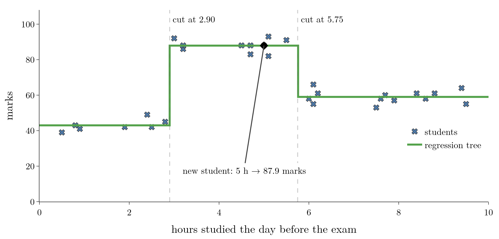
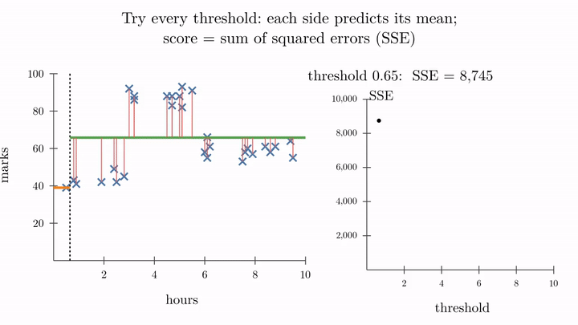
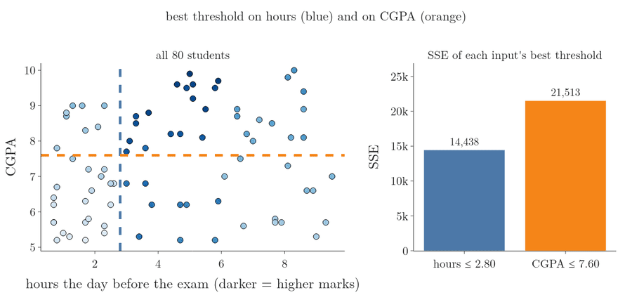
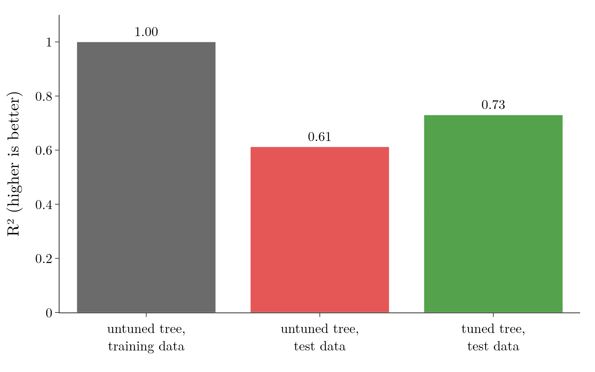
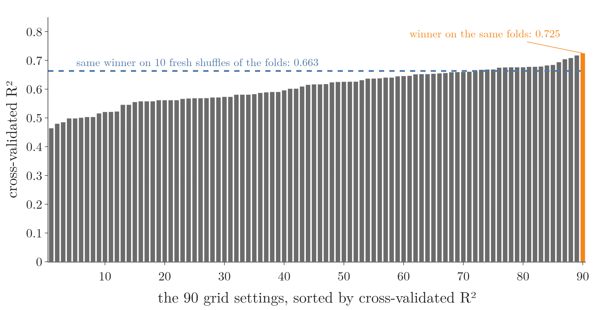
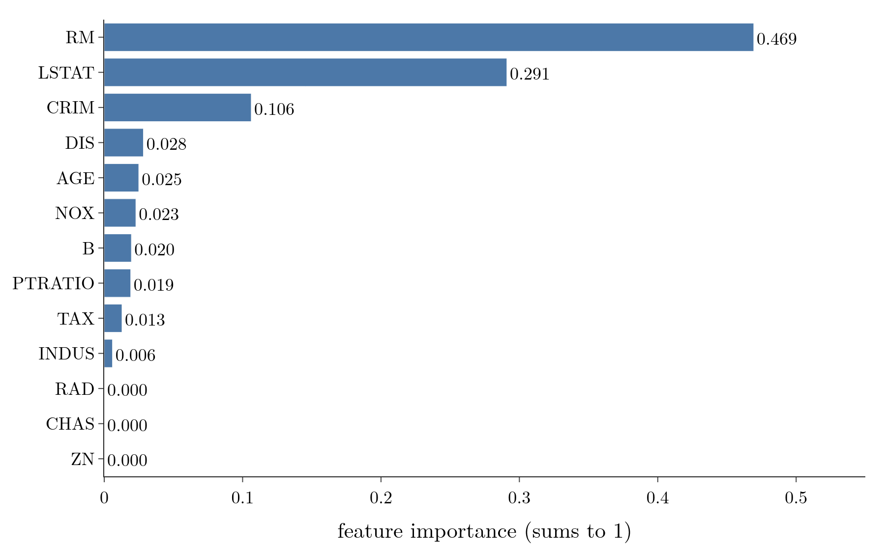

<!-- where-this-fits: generated by course_map/build_map.py; edit concepts.yaml, not this block -->
> **Where this fits:** Pipeline map steps 5 (Engineer features), 8 (Model), 10 (Tune). See the [Course map](../../../00-course-map/00-course-map.md).
>
> 
>
> - **Builds on:** [Hyperparameter tuning](../../../ML/01-foundations/ML-009-mldlc/ML-009-mldlc.md#83-model-selection-and-hyperparameter-tuning); [ML pipelines](../../../ML/01-foundations/ML-012-toy-project/ML-012-toy-project.md#1-overview); [Simple imputation (mean, median, mode, constant)](../../../ML/03-feature-engineering/ML-022-what-is-feature-engineering/ML-022-what-is-feature-engineering.md#1-overview); [Cross-validation](../../../ML/03-feature-engineering/ML-028-pipelines/ML-028-pipelines.md#8-cross-validation-with-a-pipeline); [Regression metrics](../../../ML/06-regression/ML-051-regression-metrics/ML-051-regression-metrics.md#1-overview); [Decision trees](../../../ML/08-trees-and-ensembles/ML-091-decision-trees-intuition/ML-091-decision-trees-intuition.md#2-a-decision-tree-is-nested-if-else).
> - **Leads to:** [Bagging](../../../ML/08-trees-and-ensembles/ML-099-bagging-intuition/ML-099-bagging-intuition.md#3-why-bagging-works); [Random forest](../../../ML/08-trees-and-ensembles/ML-102-random-forest-intro/ML-102-random-forest-intro.md#2-why-random-forests-are-so-popular); [Permutation importance](../../../ML/08-trees-and-ensembles/ML-108-feature-importance/ML-108-feature-importance.md#7-permutation-importance); [Gradient boosting](../../../ML/08-trees-and-ensembles/ML-114-gradient-boosting-intuition/ML-114-gradient-boosting-intuition.md#13-gradient-boosting-compared-with-adaboost).
> - **Compare with:** [Simple linear regression](../../../ML/06-regression/ML-050-linear-regression-maths/ML-050-linear-regression-maths.md#6-our-own-linear-regression-class); [Optuna](../../../ML/09-clustering-and-more/ML-128-optuna/ML-128-optuna.md#4-optunas-vocabulary); [Bayesian optimisation](../../../ML/09-clustering-and-more/ML-128-optuna/ML-128-optuna.md#1-overview); [Keras Tuner](../../../DL/03-optimizers/DL-039-keras-tuner/DL-039-keras-tuner.md#5-the-keras-tuner-workflow-choosing-the-optimizer).
<!-- /where-this-fits -->

## 1. Overview

> **Key point:** A regression tree asks if-else questions that cut the range of each input into parts, exactly like a classification tree, but each leaf predicts the **mean** of its training outputs, and splits are chosen to minimise the squared error.

Decision trees are mostly used for classification (see [decision trees](../ML-091-decision-trees-intuition/ML-091-decision-trees-intuition.md#2-a-decision-tree-is-nested-if-else)), where the output is a category. The same algorithm also works when the output is a number: a **regression tree** (G-1654). As before, the tree reads the **features** (G-772; input variables, one column each of the data table) of each **observation** (G-1374; one record, one row of the table) and predicts the **target** (G-1949; the output, here a number).

This Note covers:

- when a regression tree beats linear regression: non-linear data;
- how a tree predicts a number: the mean of a leaf;
- how it finds each split: the sum of squared errors;
- splits with two or more inputs;
- the hyperparameters, and a full example on the Boston housing data, with feature importance.

The Notebook (`ML-093-regression-trees.ipynb`) runs every example.

## 2. When a straight line is not enough

> **Key point:** Linear regression handles a roughly straight trend; when the pattern bends, rises and falls, a regression tree follows it.

### 2.1 A linear pattern: hours in the semester

> **Key point:** More study hours over the semester, more marks, roughly in a straight line.

For many regression problems, linear regression is the go-to algorithm. Linear regression finds the **best-fit line** $y = mx + b$ (see [the best-fit line](../../06-regression/ML-049-simple-linear-regression/ML-049-simple-linear-regression.md#34-the-best-fit-line)) and predicts by reading the line.

Figure 1 (left) plots 30 students: hours studied over the whole semester against exam marks. Some students study less and score more, others the opposite, but the trend is roughly a straight line. The best-fit line predicts that a student who studied 75 hours gets about 60 marks.

{height=30%}

### 2.2 A non-linear pattern: hours the day before the exam

> **Key point:** Too little and too much last-day study both score low; a line through this data misses every group.

Figure 1 (right) uses a different input: the hours studied on the day **before** the exam.

- Students who studied **under 3 hours** scored low, around 43.
- Students in the **3 to 6 hours** range scored high, around 88.
- Students who studied **more than 6 hours** scored around 59: they were exhausted on exam day.

A straight line through this data is almost flat. For a student who studied 5 hours, it predicts about 65 marks, while every such student scored above 80. The line also misses the low group and the tired group. The line's $R^2$ (the share of the marks' variation the line explains, 1 is perfect; see [R² score](../../06-regression/ML-051-regression-metrics/ML-051-regression-metrics.md#6-r²-score)) on these 30 students is only 0.02.

Whenever the relationship is non-linear like this, a regression tree usually does better than linear regression.

## 3. How a regression tree predicts

> **Key point:** Cut the input into ranges with if-else questions; in each range, predict the mean output of the training observations that fall there.

### 3.1 Cutting the data by hand

> **Key point:** Two cuts, at 3 and 6 hours, separate the three groups.

Decision trees cut the data. Here two cuts are enough: one at 3 hours and one at 6 hours. Written as if-else questions (Figure 2):

1. **Is hours < 6?** If no, the student is in the "tired" group.
2. If yes: **is hours < 3?** If yes, the "too little" group; if no, the "just right" group.

{height=30%}

### 3.2 A leaf predicts the mean

> **Key point:** A leaf's prediction is the average output of its training observations.

In a classification tree, a leaf predicts its majority class. In a regression tree, a leaf predicts the **mean** output of the training observations that reached it.

1. **In words:** add up the outputs of the observations in the leaf and divide by how many there are.
2. **Formula:** for a leaf with $n$ training observations and outputs $y_1, \dots, y_n$:
   $$\hat y_{\text{leaf}} = \bar{y} = \frac{1}{n}\sum_{i=1}^{n} y_i$$
3. **Example:** the 10 students who studied between 3 and 6 hours scored, in total, 879 marks, so the leaf predicts:
   $$879 / 10 = 87.9$$

Why the mean: of all the single numbers a leaf could predict, the mean gives the smallest sum of squared errors over the leaf's observations (ESL §9.2.2), and the squared error is also what chooses the splits (section 4). A check on a leaf with the two marks 40 and 46, whose mean is 43:

$$\text{predict } 43\text{: } 3^2 + 3^2 = 18$$

$$\text{predict } 42\text{: } 2^2 + 4^2 = 20$$

$$\text{predict } 44\text{: } 4^2 + 2^2 = 20$$

The three leaves in Figure 2 predict 43.0, 87.9 and 59.0 marks.

A new student who studied 5 hours goes down the tree: $5 < 6$, yes; $5 < 3$, no. They land in the middle leaf, so the tree predicts **87.9 marks**, where the line predicted 65.

Plotted against the hours, the tree's prediction is a staircase: flat within each range, jumping at each cut (Figure 3). scikit-learn, given this data and allowed 3 leaves, finds almost the same cuts by itself: 2.90 and 5.75 hours.

{height=33%}

## 4. Finding the splitting criterion

> **Key point:** Try every threshold; for each, predict each side's mean and add up the squared errors; keep the threshold with the smallest total.

### 4.1 The question

> **Key point:** We can see the gaps at 3 and 6 by eye; the algorithm needs a rule.

In Figure 1 the groups are separated by visible gaps, so we could place the cuts by eye. Real data is continuous, with no gaps, and an algorithm cannot "see". With several inputs, such as hours, CGPA and attendance together, no single graph shows the pattern, so nobody can place the cuts by eye either. The algorithm needs a rule that scores every possible cut. Classification trees use information gain (a score for how much a split makes the groups purer; see [information gain](../ML-091-decision-trees-intuition/ML-091-decision-trees-intuition.md#7-information-gain)); regression trees use the squared error.

### 4.2 Scoring one threshold: the sum of squared errors

> **Key point:** A threshold's score is the sum of squared residuals when each side predicts its own mean.

Take a threshold $t$ between two neighbouring points. The threshold splits the observations into a left group ($x \le t$) and a right group ($x > t$). Each group predicts its own mean. The gap between a point's actual mark and its group's mean is its **residual** (see [the best-fit line](../../06-regression/ML-049-simple-linear-regression/ML-049-simple-linear-regression.md#34-the-best-fit-line)), its error.

1. **In words:** square every residual on the left, square every residual on the right, and add them all up. The result is the **sum of squared errors (SSE)** (G-1684) of that threshold.
2. **Formula:**
   $$\text{SSE}(t) = \sum_{x_i \le t} \left(y_i - \bar y_{\text{left}}\right)^2 + \sum_{x_i > t} \left(y_i - \bar y_{\text{right}}\right)^2$$
3. **Example:** 5 students with hours 1, 2, 4, 5, 8 and marks 40, 46, 88, 90, 58. Try $t = 3$ (between 2 and 4):
   - left: 40 and 46. Their mean:
     $$\bar y_{\text{left}} = (40 + 46) / 2 = 43$$
     $$\text{SSE(left)} = (-3)^2 + 3^2 = 18$$
   - right: 88, 90, 58. Their mean:
     $$\bar y_{\text{right}} = (88 + 90 + 58) / 3$$
     $$= 236 / 3 = 78.67$$
     The residuals are 9.33, 11.33 and −20.67:
     $$\text{SSE(right)} = 9.33^2 + 11.33^2 + (-20.67)^2$$
     $$= 87.1 + 128.4 + 427.2 = 642.7$$
   - total:
     $$\text{SSE}(3) = 18 + 642.7 = 660.7$$

The other thresholds score worse: $t = 1.5$ gives 1,443.0, $t = 4.5$ gives 1,880.0 and $t = 6.5$ gives 2,136.0. So $t = 3$ is the best first split for these 5 students.

### 4.3 Trying every threshold

> **Key point:** Sweep the threshold across the data, plot SSE against it, and take the minimum.

The algorithm repeats this for every candidate threshold:

1. Sort the observations by the input. Take the first two points, and put the threshold halfway between them (their mean). The left group has one point, which is its own mean; the right group has the rest.
2. Compute the SSE and plot it against the threshold.
3. Move to the next two points and repeat, until the threshold has passed every gap.
4. Keep the threshold with the **smallest SSE**. That threshold becomes the split.

Figure 4 shows this sweep on our 30 students (`images/sse_sweep.gif` animates it). The red lines are the residuals, the orange and green lines the two means, and the right panel traces the SSE. The minimum is at **hours $\le$ 2.90**, with an SSE of 5,060, down from 9,439 with no split at all.

{height=48%}

> **Extra:** scikit-learn's default criterion, `"squared_error"` (G-1864), compares splits by the weighted **mean** squared error (MSE) of the children. Since the parent's observation count is the same for every candidate, minimising the children's weighted MSE is the same as minimising the SSE. The drop from the parent's MSE to the weighted MSE of its children plays the role that information gain plays in classification; it is often called **variance reduction**, because a node's MSE around its mean is the variance of its outputs (sklearn reference, `criterion`).

### 4.4 Recursion, and when to stop

> **Key point:** Repeat the search inside each side; stop when a node gets too small, or the tree will give every point its own leaf.

After the first split, each side is searched again, in exactly the same way, to find its own best split. On our data the next split, inside the right group, is at 5.75 hours.

If we never stop, the tree keeps splitting until every training point sits alone in a leaf. The tree then reproduces every training mark exactly but fails badly on new students: overfitting (see [overfitting and bias-variance](../../06-regression/ML-061-bias-variance/ML-061-bias-variance.md#4-seeing-bias-and-variance)). We want to separate the groups, not every point.

So we set a stopping rule, for example: do not split a node with fewer than 4 observations. In practice a minimum of about 20 to 25 observations per node is a common starting point, depending on the dataset. Such a rule is the hyperparameter `min_samples_split` (or `min_samples_leaf`) in [min_samples_split](../ML-092-decision-tree-hyperparameters/ML-092-decision-tree-hyperparameters.md#44-min_samples_split).

## 5. More than one input

> **Key point:** Find the best threshold for each input separately, then split on the input whose best threshold has the smaller SSE.

Add a second input: each student's CGPA so far. Now there are two inputs, hours and CGPA, and one output, marks, so the data lives in 3D.

For every split, the tree:

1. finds the best threshold on **hours** and its SSE, $\text{SSE(hours)}$;
2. finds the best threshold on **CGPA** and its SSE, $\text{SSE(CGPA)}$;
3. splits on whichever input has the **smaller** SSE.

In 3D, each split is a plane parallel to one axis that cuts the cloud of points in two. The search then repeats inside each part, with hours and CGPA competing again at every node, until the stopping rule leaves too few observations to split; each final part predicts the mean of its observations.

Figure 5 plays this competition on 80 students, viewed from above (darker points have higher marks). At each node the dashed lines are the two candidates (blue for hours, orange for CGPA), the bars are their SSEs in the same colours, and the winner becomes a solid cut. Once a node is decided, the losing input's bar turns grey and the earlier cuts are drawn in black:

- **All 80 students:** the best cut on hours ($\le 2.80$) has an SSE of 14,438; the best cut on CGPA ($\le 7.60$) has 21,513. Hours wins.
- **Students with hours $> 2.8$:** hours wins again, at 6.0 (SSE 2,896 against 8,979 for CGPA).
- **Students with hours $\le 2.8$:** now CGPA wins, at 6.90 (SSE 437 against 1,599 for hours).



Figure 6 shows the finished tree, grown one level further: each box is a leaf, shaded by its predicted mark. The first split is on hours ($\le 2.8$), and the next ones mix hours (at 6.0) and CGPA. Within each range of hours, a higher CGPA means a higher prediction.

{height=36%}

## 6. Hyperparameters of a regression tree

> **Key point:** The same hyperparameters as the classification tree; only the criterion changes, from Gini or entropy to squared or absolute error.

`DecisionTreeRegressor` has exactly the hyperparameters of the classifier (see [the main hyperparameters](../ML-092-decision-tree-hyperparameters/ML-092-decision-tree-hyperparameters.md#4-the-main-hyperparameters)): `splitter`, `max_depth`, `min_samples_split`, `min_samples_leaf`, `max_leaf_nodes`, `min_impurity_decrease` and `max_features`, with the same effects. The difference is the **criterion**, which measures error instead of impurity (how mixed the classes in a node are, measured by Gini or entropy; see [entropy](../ML-091-decision-trees-intuition/ML-091-decision-trees-intuition.md#6-entropy)):

- `"squared_error"` (default): the mean squared error, MSE (see [mean squared error](../../06-regression/ML-051-regression-metrics/ML-051-regression-metrics.md#3-mean-squared-error-mse)); leaves predict the mean.
- `"absolute_error"`: the mean absolute error, MAE; leaves predict the **median**, so outliers pull less (ESL §10.6). The `absolute_error` criterion is slower to train: about 1.4 times slower than `squared_error` on the Boston data in the Notebook.
- `"poisson"`: for counts, such as the number of visits (sklearn UG §1.10.7.2).

Neither criterion wins on every dataset (the Boston grid in section 7.2 picks `"absolute_error"`), so the criterion is settled by tuning.

### 6.1 max_depth on a non-linear curve

> **Key point:** Depth 1 is a single step; depth 5 follows the curve; depth 15 chases every point.

Figure 7 trains trees of four depths on 150 noisy points along a wave and scores them on 50 test points with $R^2$.

{height=50%}

- **Depth 1:** one split at $x \approx 0.1$ and two flat levels. Clear underfitting; test $R^2 = 0.53$.
- **Depth 2:** four levels, a rough outline of the wave; $R^2 = 0.75$.
- **Depth 5:** 30 small steps that follow the wave without chasing single points; $R^2 = 0.90$, the best of the four.
- **Depth 15:** 149 leaves for 150 training points. The line jumps to touch almost every point, noise included: overfitting; $R^2$ falls to 0.87.

The other hyperparameters behave as for classification. For example, with 150 training observations and `min_samples_split=100`, the root splits into 82 and 68 observations, and neither child has 100 observations, so the tree stops there: underfitting. With only one input feature, `max_features` has nothing to choose from; it matters on data with many features.

## 7. A regression tree on the Boston housing data

> **Key point:** Cross-validation gives an honest score, tuning beats an untuned fully grown tree on new data, and `feature_importances_` shows which features the tree relies on.

### 7.1 The data and a first tree

> **Key point:** 506 Boston districts, 13 inputs, and the median house price; a depth-5 tree scores R² = 0.88 on one test split.

The **Boston housing data** (G-324) describes 506 districts of Boston in the 1970s. Each district is one **observation** (one row of the table). Each has 13 **features**, the input variables (one column each), such as `RM` (average number of rooms per home), `LSTAT` (percentage of lower-income residents) and `CRIM` (crime rate). The **target**, the output we predict, is `MEDV`, the median home value in thousands of dollars.

> **Python:** A regression tree on the Boston data.
>
> ```python
> import pandas as pd
> from sklearn.model_selection import train_test_split
> from sklearn.tree import DecisionTreeRegressor
> from sklearn.metrics import r2_score
>
> boston = pd.read_csv("data/boston.csv")
> X = boston.drop(columns="MEDV")
> y = boston["MEDV"]
> X_train, X_test, y_train, y_test = train_test_split(
>     X, y, test_size=0.2, random_state=42)
>
> reg = DecisionTreeRegressor(criterion="squared_error",
>                             max_depth=5, random_state=42)
> reg.fit(X_train, y_train)
> r2_score(y_test, reg.predict(X_test))   # 0.883
> ```
>
> `DecisionTreeRegressor` (G-562) is used exactly like `DecisionTreeClassifier`; only the output is a number.

> **Extra:** Older code loads this data with `load_boston` from `sklearn.datasets`. That function was removed in scikit-learn 1.2, because one feature, `B`, was built from the share of Black residents of each district, an ethically problematic variable (sklearn 1.1, `load_boston` notice). The Notebook reads the same table from `data/boston.csv` (OpenML dataset 531). For new projects, scikit-learn suggests the California housing data instead.

An $R^2$ of 0.88 looks impressive, but it comes from one random test set of 102 districts. Cross-validation (see [cross-validation with a pipeline](../../03-feature-engineering/ML-028-pipelines/ML-028-pipelines.md#8-cross-validation-with-a-pipeline)) on the training set gives a more honest average: **0.66**.

### 7.2 Tuning with GridSearchCV and RandomizedSearchCV

> **Key point:** Grid search tries every combination; randomized search tries a fixed number of random ones, which is faster on big grids.

Grid search with `GridSearchCV` (see [experiments: try every k](../../07-classification/ML-085-knn/ML-085-knn.md#42-experiments-try-every-k)) tries every combination of the values we list and keeps the one with the best cross-validated score. Here we tune four hyperparameters:

> **Python:** Tuning a regression tree.
>
> ```python
> from sklearn.model_selection import GridSearchCV
>
> params = {"max_depth": [2, 4, 6, 8, None],
>           "criterion": ["squared_error", "absolute_error"],
>           "max_features": [0.25, 0.5, 1.0],
>           "min_samples_split": [2, 0.05, 0.25]}
> grid = GridSearchCV(DecisionTreeRegressor(random_state=42),
>                     params, cv=5)
> grid.fit(X_train, y_train)
> grid.best_params_   # absolute_error, max_depth 6,
>                     # max_features 1.0, min_samples_split 2
> grid.best_score_    # 0.725, cross-validated R2
> ```
>
> A decimal such as `max_features=0.5` means "50% of the features" (6 of 13), and `min_samples_split=0.05` means "5% of the training observations".

The grid holds 90 combinations:

$$5 \times 2 \times 3 \times 3 = 90$$

Each is cross-validated 5 times, which gives 450 trees. The best combination reaches a cross-validated $R^2$ of **0.725**.

When a grid becomes too large, **`RandomizedSearchCV`** (G-1625) is the faster alternative: instead of every combination, it tries `n_iter` combinations drawn at random from the same lists. With `n_iter=20` it trains 100 trees instead of 450 and reaches a cross-validated $R^2$ of 0.70.

### 7.3 Does tuning beat an untuned tree?

> **Key point:** An untuned tree grows until every leaf is pure, so it learns the noise. A tuned tree stops earlier and scores clearly better on new data.

With its default settings, `DecisionTreeRegressor` never stops early: it splits until each leaf holds observations with the same target value, often a single observation (section 4.4). Such a tree copies the training data perfectly, noise included. Memorised noise is why tree size must be tuned: "a very large tree might overfit the data, while a small tree might not capture the important structure", so the right size should be chosen from the data (ESL §9.2.2).

The effect is clearest on a large dataset with a noisy target. We use the **California housing data** (G-2223): 20,640 districts of California in 1990, with 8 features (input variables) such as median income and house age, and the median house value as the target (sklearn California housing). Each district is one observation.

The experiment changes one thing only, the tree's settings:

1. split the data 80/20 into training and test sets;
2. **untuned tree:** fit `DecisionTreeRegressor()` with its defaults on the training set;
3. **tuned tree:** run `GridSearchCV` over `max_depth` (4 to 12, or `None`) and `min_samples_leaf` (1, 5, 20, 50) **on the training set only**, and keep its best tree;
4. score both trees on the test set, which the search never saw.

The Notebook repeats this over 20 random splits and averages the scores (Figure 8).

{height=32%}

- The untuned tree scores a perfect $R^2 = 1.00$ on its training data, with about 15,900 leaves for 16,512 training observations: it has memorised the noise.
- On the test data it falls to **0.61**.
- The tuned tree, with about 630 leaves, scores **0.73** on the test data, and it beats the untuned tree on all 20 splits.

So tuning gains about 0.12 in test $R^2$ here. On every split the search picked `min_samples_leaf=20`: every leaf averages at least 20 districts, which smooths out the noise in single prices.

### 7.4 The best score of a grid is a little lucky

> **Key point:** The best of many cross-validated scores is slightly too high; re-score the winner on fresh folds to get an honest number.

Picture 90 random people and pick the tallest. That person is tall, but part of the reason they won is luck of who showed up. A grid search works the same way. On the Boston data in section 7.2, it keeps the best of 90 scores, all measured on the same 5 folds, so a setting can win partly because it happens to suit those folds. Picking the best of many scores always makes the winner look a little better than it is; the effect is called **selection bias** (G-2157; Cawley and Talbot 2010).

The Notebook measures it. On 10 fresh shuffles of 5-fold cross-validation (only the folds change), the Boston grid's winning setting scores **0.663**, not 0.725. To report an honest score, either re-score the winner on fresh folds, or test it on data the search never saw, as in section 7.3.

Figure 9 shows the 90 scores of the grid. The winner stands at the top of a smooth climb, a little above its neighbours; on fresh folds it drops to 0.663, back among the pack.



### 7.5 Feature importance

> **Key point:** `feature_importances_` gives each feature's share of the tree's total error reduction; on Boston, RM, LSTAT and CRIM dominate.

A trained tree also tells us which features it relied on. Its attribute **`feature_importances_`** (G-773) gives one number per feature: that feature's share of all the impurity (here, error) reduction achieved by the tree's splits. The numbers add up to 1.

{height=34%}

Figure 10 shows them for the tuned Boston tree of section 7.2:

- **RM** (rooms per home) is by far the most important feature, at 0.47;
- then **LSTAT** (0.29) and **CRIM** (0.11);
- the last few features (`INDUS`, `ZN`, `CHAS`, `RAD`) contribute almost nothing.

Feature importance is useful for **feature selection** (dropping columns to fight the curse of dimensionality; see [the solution: dimensionality reduction](../../05-dimensionality/ML-045-curse-of-dimensionality/ML-045-curse-of-dimensionality.md#6-the-solution-dimensionality-reduction)): if we must drop features, the ones with near-zero importance are the first candidates.

> **Extra:** The importance of a feature is computed by adding up, over every node that splits on it, the node's share of the training observations times its impurity decrease (the $\Delta$ of `min_impurity_decrease` in [min_impurity_decrease](../ML-092-decision-tree-hyperparameters/ML-092-decision-tree-hyperparameters.md#48-min_impurity_decrease)), and then dividing by the total over all features. A single tree is unstable: a small change in the data can give very different splits (ESL §9.2.4), so its importances can change a lot from one training set to another. A random forest averages them over many trees and gives steadier values; in the Notebook, over 30 resampled training sets, the spread of RM's importance drops from 0.20 for one tree to 0.12 for a forest.

## 8. Summary

| | Classification tree | Regression tree |
|---|---|---|
| Output | a class | a number |
| Leaf predicts | the majority class | the mean of its observations (median with `absolute_error`) |
| Split chosen by | information gain (Gini or entropy) | smallest squared error (SSE / MSE) |
| scikit-learn | `DecisionTreeClassifier` | `DecisionTreeRegressor` |
| Criterion values | `"gini"`, `"entropy"`, `"log_loss"` | `"squared_error"`, `"absolute_error"`, `"poisson"` |
| Prediction shape | boxes of one class | a staircase: boxes of one value |

- Linear regression handles roughly straight trends; regression trees handle non-linear ones, such as marks against last-day study hours, because each leaf predicts its own mean, so the prediction can rise and fall where a line stays almost flat.
- Each candidate threshold splits the data in two; each side predicts its mean; the threshold with the smallest SSE wins (here, hours $\le$ 2.90), because real data has no visible gaps and the algorithm needs one score to compare every cut.
- With several inputs, each input's best threshold competes; the smallest SSE wins, so the tree finds the cuts even when no single graph shows the pattern.
- A tree grown fully gives every point its own leaf, so it copies the noise and fails on new data; stop it with `max_depth`, `min_samples_split`, `min_samples_leaf` and the other hyperparameters.
- An untuned tree grows until its leaves are pure and memorises the noise; on California housing, tuning `max_depth` and `min_samples_leaf` raises the test $R^2$ from 0.61 to 0.73 (average of 20 splits), because every leaf then averages at least 20 districts, which smooths out the noise.
- The best score of a grid is a little optimistic (best of 90): on fresh folds the Boston winner scores 0.663, not 0.725, so report the winner re-scored on fresh folds or on unseen test data.
- On the Boston data, RM, LSTAT and CRIM are the most important features, so features with near-zero importance are the first to drop when we must drop some.
- So a regression tree is the same if-else tree as a classifier, with a mean in each leaf and SSE to pick each split, which lets it predict a number where a straight line misses the pattern.

## 9. Sources

**Built from**

- CampusX, "Regression Trees | Decision Trees Part 3", YouTube, https://www.youtube.com/watch?v=RANHxyAvtM4
- StatQuest with Josh Starmer, "Regression Trees, Clearly Explained!!!", YouTube, https://www.youtube.com/watch?v=g9c66TUylZ4

**Other references**

- **Cawley and Talbot 2010:** G. C. Cawley and N. L. C. Talbot, "On Over-fitting in Model Selection and Subsequent Selection Bias in Performance Evaluation", *Journal of Machine Learning Research* 11, 2079–2107, 2010. jmlr.org/papers/v11/cawley10a.html
- **ESL:** T. Hastie, R. Tibshirani and J. Friedman, *The Elements of Statistical Learning*, 2nd ed., Springer, 2009. Sections 9.2.2 (the leaf mean minimises the squared error; tree size), 9.2.4 and 10.6.
- **sklearn California housing:** scikit-learn User Guide, Real world datasets, California Housing dataset (`fetch_california_housing`); data from R. K. Pace and R. Barry, "Sparse Spatial Autoregressions", *Statistics and Probability Letters* 33, 1997.
- **sklearn UG:** scikit-learn User Guide, Section 1.10.7.2, Regression criteria.
- **sklearn reference:** scikit-learn `DecisionTreeRegressor` API reference, parameter `criterion`.
- **sklearn 1.1, `load_boston` notice:** scikit-learn 1.1 API reference for `sklearn.datasets.load_boston` (deprecated in 1.0, removed in 1.2).

## 10. Key terms

| Term | Meaning |
|---|---|
| Regression tree | A decision tree whose leaves predict numbers: the mean output of their training observations |
| DecisionTreeRegressor | scikit-learn's regression tree: a decision tree whose leaves predict a number, the mean target of the training rows in the leaf, instead of a class. It is used exactly like `DecisionTreeClassifier`. |
| Sum of squared errors (SSE) (G-1684) | The sum of the squared residuals; a regression tree splits where the SSE of the two sides is smallest |
| Variance reduction | The drop in mean squared error from a node to its children; a regression tree uses it to compare splits, as a classification tree uses information gain. |
| squared_error | The default rule `DecisionTreeRegressor` uses to judge splits: it splits by mean squared error, and each leaf predicts the mean of its rows. |
| absolute_error | A regression-tree setting (criterion) that chooses splits by the average size of the errors (mean absolute error); its leaves predict the median, so outliers pull less. |
| RandomizedSearchCV | A scikit-learn tool that tries a fixed number of randomly drawn combinations of model settings (hyperparameters) and scores each with cross-validation, instead of trying every combination. |
| Feature importance | A feature's share of all the impurity reduction in a tree; the shares add up to 1 |
| feature_importances_ | The fitted attribute holding the feature importance of every feature |
| California housing data (G-2223) | 20,640 California districts (1990), 8 features and the median house value; built into scikit-learn |
| Selection bias | The best of many scores looks better than it really is, because part of its win is luck |
| Boston housing data | 506 Boston districts, 13 inputs and the median home value; removed from scikit-learn in version 1.2 |
