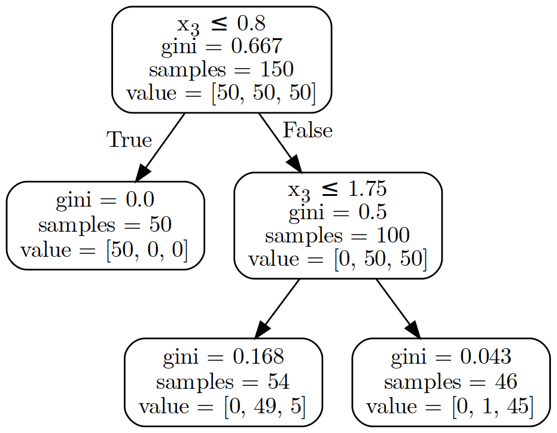
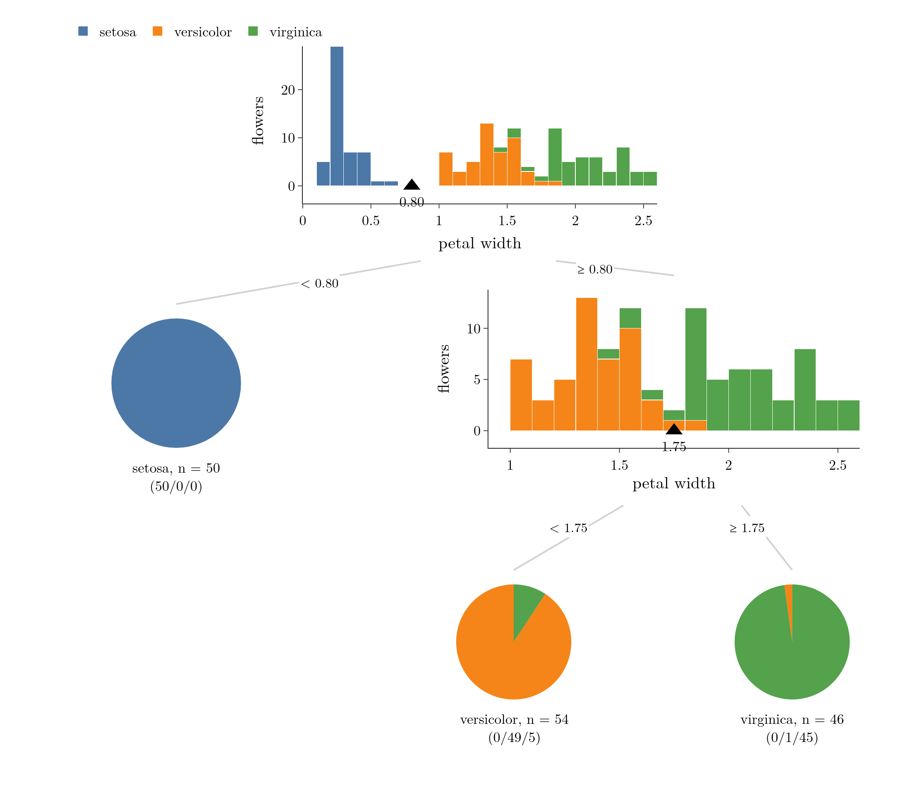
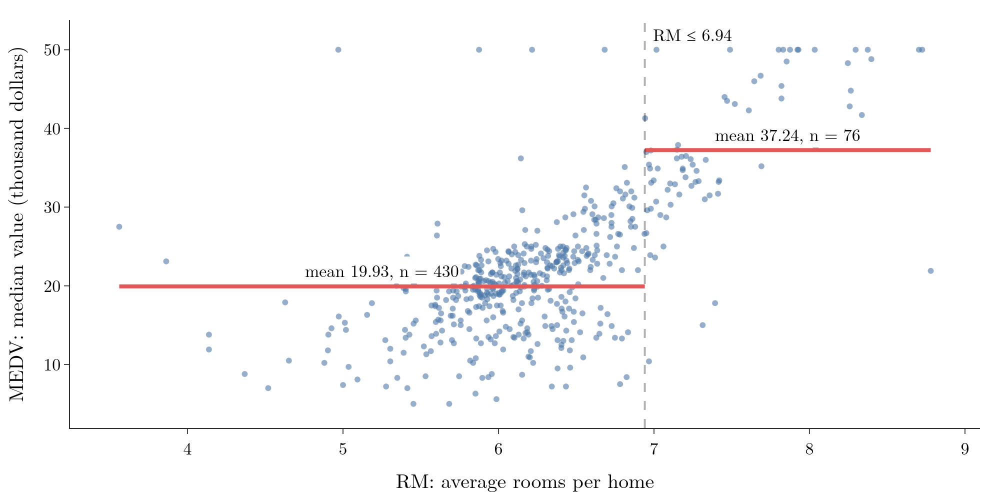
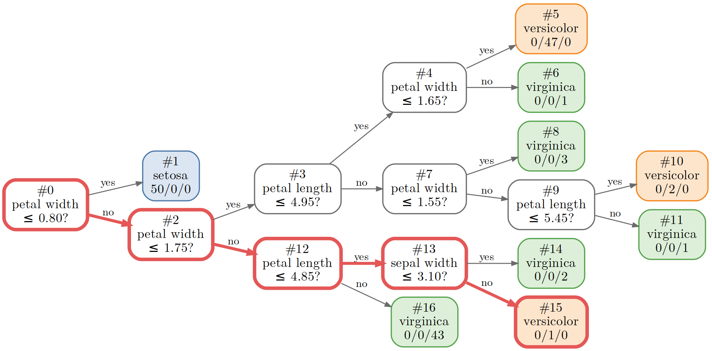
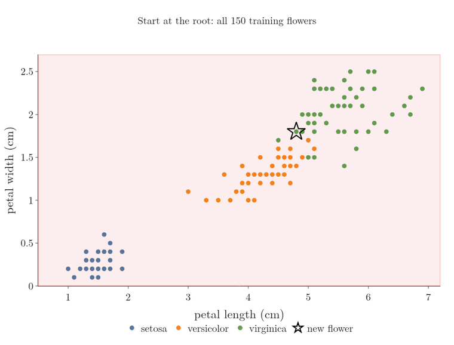
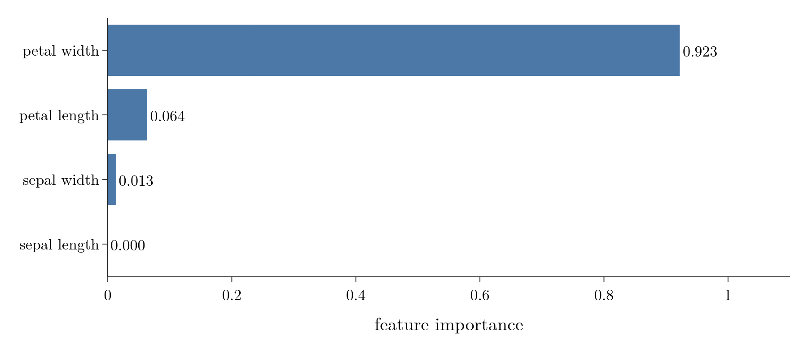
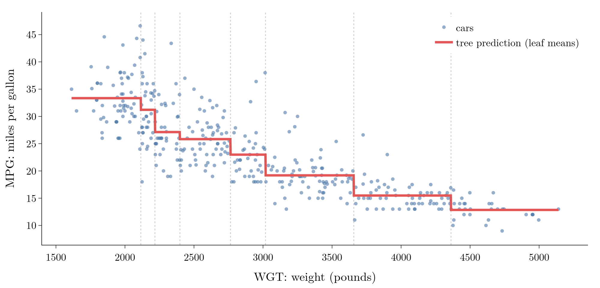
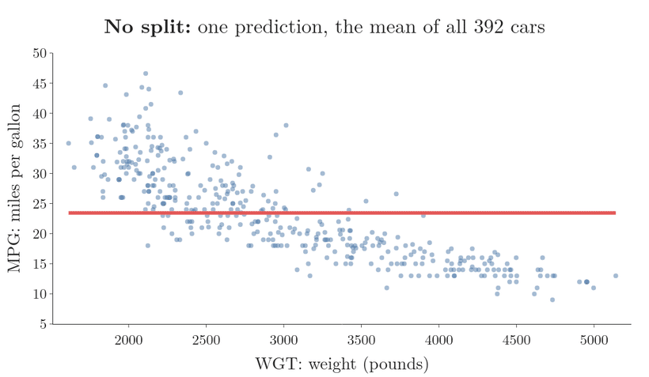
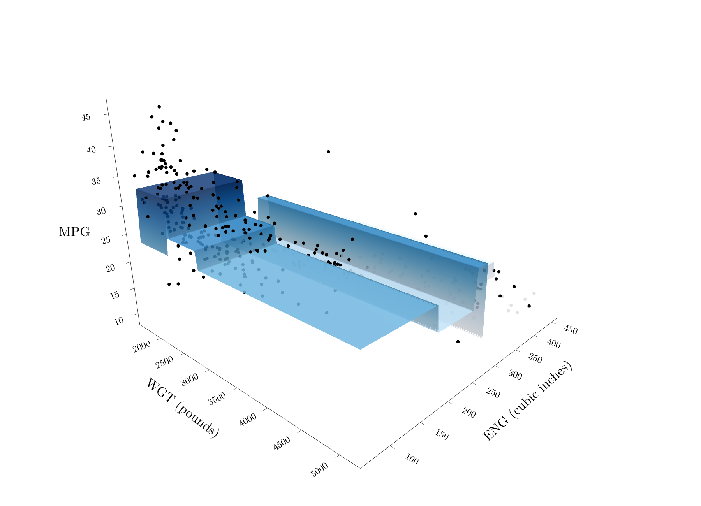

<!-- where-this-fits: generated by course_map/build_map.py; edit concepts.yaml, not this block -->
> **Where this fits:** Pipeline map steps 5 (Engineer features), 8 (Model). See the [Course map](../../../00-course-map/00-course-map.md).
>
> 
>
> - **Builds on:** [Model-based learning](../../../ML/01-foundations/ML-006-instance-vs-model-based/ML-006-instance-vs-model-based.md#4-model-based-learning); [Decision surface and boundary](../../../ML/07-classification/ML-085-knn/ML-085-knn.md#5-decision-surfaces); [Entropy, information gain and Gini](../../../ML/08-trees-and-ensembles/ML-091-decision-trees-intuition/ML-091-decision-trees-intuition.md#6-entropy).
> - **Leads to:** [Ensemble learning](../../../ML/08-trees-and-ensembles/ML-095-ensemble-learning/ML-095-ensemble-learning.md#1-overview); [Bagging](../../../ML/08-trees-and-ensembles/ML-099-bagging-intuition/ML-099-bagging-intuition.md#3-why-bagging-works); [Random forest](../../../ML/08-trees-and-ensembles/ML-102-random-forest-intro/ML-102-random-forest-intro.md#2-why-random-forests-are-so-popular); [Permutation importance](../../../ML/08-trees-and-ensembles/ML-108-feature-importance/ML-108-feature-importance.md#7-permutation-importance); [AdaBoost](../../../ML/08-trees-and-ensembles/ML-109-adaboost-intuition/ML-109-adaboost-intuition.md#11-why-learn-adaboost).
> - **Compare with:** [Feature scaling](../../../ML/03-feature-engineering/ML-023-standardization/ML-023-standardization.md#2-feature-scaling-in-brief).
<!-- /where-this-fits -->

## 1. Overview

> **Key point:** dtreeviz draws a trained decision tree with the training data shown inside every node, so we can see why each split was chosen and where a prediction goes.

**dtreeviz** (G-640) is a Python library for visualising **decision trees** (G-561; chains of yes/no questions about the features that end in a prediction, see [nested if-else](../ML-091-decision-trees-intuition/ML-091-decision-trees-intuition.md#2-a-decision-tree-is-nested-if-else)) trained with scikit-learn (and with XGBoost, LightGBM, Spark MLlib and TensorFlow Decision Forests; dtreeviz README). Compared with scikit-learn's own tree drawing, dtreeviz adds the following. (A **feature** (G-772) is an input variable, one column of the data table; an **observation** (G-1374) is one record, one row of the table.)

- real feature and class names at every split;
- the training data of every node, as histograms (classification) or scatter plots (regression);
- the path a single new observation follows to its prediction, and a plain-English summary of it;
- views of the whole tree as cuts on a scatter plot, in 2D or 3D.

dtreeviz itself draws with Graphviz and matplotlib. The figures below instead rebuild each dtreeviz view from the fitted tree's own numbers, with Plotly and Graphviz. The Notebook (`ML-094-dtreeviz.ipynb`) lists the dtreeviz calls and computes everything the figures show.

## 2. The problem with the default tree drawing

> **Key point:** scikit-learn's drawing shows feature indexes like x[3] and raw lists of numbers; it is hard to read on a real dataset.

scikit-learn can draw a fitted tree with `plot_tree` (built on matplotlib) or export it with `export_graphviz`. Both produce boxes like those in Figure 1, for a tree of depth 2 trained on the iris data (the iris flowers of [softmax regression](../../07-classification/ML-078-softmax-regression/ML-078-softmax-regression.md#3-how-the-model-predicts)).

{height=32%}

The drawing has several weaknesses:

- **Features appear as indexes.** The split $x_3 \le 0.8$ does not say which feature $x_3$ is. With many features we cannot remember every index position. ($x_3$ is the petal width.)
- **Some information is noise for most readers**, such as the Gini value (**Gini impurity**, G-847) of every node (see [Gini impurity](../ML-091-decision-trees-intuition/ML-091-decision-trees-intuition.md#8-gini-impurity)).
- **Some information is hard to read:** `value = [0, 49, 5]` means 0 setosa, 49 versicolor and 5 virginica, but we must remember the class order.
- **The data is invisible.** We see the threshold 0.8 but not why the split falls there.

> **Extra:** Passing `feature_names=` and `class_names=` to `plot_tree` or `export_graphviz` fixes the first problem, and `filled=True` colours the boxes by class (sklearn `plot_tree` reference). The data inside each node, however, only dtreeviz shows.

## 3. Installing and calling dtreeviz

> **Key point:** Wrap the trained tree with `dtreeviz.model(...)`, passing the training data and the feature and class names, then call `.view()`.

dtreeviz is installed with `pip install dtreeviz`. dtreeviz also needs the **Graphviz** (G-868) program `dot`, which lays out the boxes of the tree. In Jupyter the result appears inline; in a script, `.show()` opens it in a window and `.save("tree.svg")` writes a file.

> **Python:** A first dtreeviz tree (dtreeviz 2.x).
>
> ```python
> import dtreeviz
> from sklearn.datasets import load_iris
> from sklearn.tree import DecisionTreeClassifier
>
> iris = load_iris()
> X, y = iris.data, iris.target
> clf = DecisionTreeClassifier(max_depth=2).fit(X, y)
>
> viz = dtreeviz.model(clf, X_train=X, y_train=y,
>     feature_names=iris.feature_names,
>     target_name="flower",
>     class_names=list(iris.target_names))
> viz.view()            # draws the tree
> viz.view(scale=2)     # the same, twice as big
> ```
>
> `dtreeviz.model` needs four things:
>
> 1. the trained tree;
> 2. the data it was trained on;
> 3. the names of the input features;
> 4. (for classification) the names of the classes.

> **Extra:** Older tutorials use the dtreeviz 1.x interface, a single function: `from dtreeviz.trees import dtreeviz`, then `dtreeviz(clf, X, y, target_name=..., feature_names=..., class_names=...)`, with the options of section 6 passed to the same call. dtreeviz 2.0 replaced it with `dtreeviz.model(...)` and methods such as `.view()` (dtreeviz 2.0.0 release notes).

## 4. Reading a dtreeviz tree

> **Key point:** Each decision node shows a stacked histogram of its split feature, with a triangle at the threshold; each leaf shows a pie of the classes that reached it.

Figure 2 shows the dtreeviz view of the same depth-2 iris tree, rebuilt with Plotly from the fitted tree.

{height=58%}

**The root** (the **root node**, G-1706) splits on **petal width** at **0.80**, shown by the black triangle; 0.80 is the split's **threshold** (G-1971). The **histogram** (G-899) of all 150 flowers makes the reason obvious: every setosa flower (blue) has a petal width below 0.8, and every other flower is above it.

- Left of the threshold, **all 50 setosa** flowers go to a leaf (a **leaf node**, G-1060: a node that is not split further). The leaf's pie is entirely blue: a **pure leaf** (G-1591).
- Right of it, the **other 100 flowers** go to the next node.

**The second node**, a **decision node** (G-556) like the root, splits the remaining 100 flowers on petal width again, at **1.75**. Here the two colours overlap between about 1.4 and 1.9, so no threshold separates them perfectly. Because `max_depth=2`, the tree stops here and makes two leaves:

- left: **54 flowers**, mostly versicolor (49 versicolor, 5 virginica);
- right: **46 flowers**, mostly virginica (1 versicolor, 45 virginica).

The counts add up:

$$54 + 46 = 100$$
$$100 + 50 = 150$$

### 4.1 A fully grown tree

> **Key point:** Without max_depth the tree keeps splitting until every leaf is pure, even if a leaf holds one flower.

Without `max_depth`, the same data gives a tree of depth 5 with 9 leaves (Figure 4, in section 6). Every leaf is **pure**: it holds a single class. Some leaves hold 1, 2 or 3 flowers only.

Leaves that small are a sign of **overfitting** (G-1429; the tree memorises its training data instead of learning a pattern that holds for new data, see [a fully grown tree overfits](../ML-092-decision-tree-hyperparameters/ML-092-decision-tree-hyperparameters.md#21-a-fully-grown-tree-overfits)): the tree has carved out a region for one flower. A big tree is also harder to view on screen, which is another reason to limit its growth.

## 5. Regression trees in dtreeviz

> **Key point:** For a regression tree, each node shows a scatter plot of its split feature against the output, with the threshold and the mean of each side.

Everything works the same for a **regression tree** (G-1654): we pass the `DecisionTreeRegressor` and give `target_name` (the name of the **target** (G-1949), the output we predict) instead of class names. The nodes then show **scatter plots** (G-1749) instead of histograms.

Figure 3 shows a regression tree of depth 1 trained on all 506 districts of the Boston housing data (see [a regression tree on the Boston housing data](../ML-093-regression-trees/ML-093-regression-trees.md#7-a-regression-tree-on-the-boston-housing-data)).

{height=33%}

The single split is on **RM** (average rooms per home) at **6.94**:

- **430 districts** have $\text{RM} \le 6.94$; the tree predicts the mean of their **MEDV** (the median home value of a district, the output in Figure 3), **19.93** thousand dollars;
- **76 districts** have $\text{RM} > 6.94$; the tree predicts **37.24** thousand dollars.

So a new district with 7.5 rooms per home is predicted at 37.24 thousand dollars, and one with 6 rooms at 19.93.

## 6. Useful view options

> **Key point:** `orientation`, `x`, `show_just_path`, `show_node_labels` and `fancy` change what `.view()` draws.

Figure 4 combines several of these options on the fully grown iris tree: drawn left to right, with node numbers, and with the path of one flower highlighted in red.

{height=42%}

### 6.1 Left-to-right trees

> **Key point:** `orientation="LR"` draws the tree from left to right, which fits wide trees better.

By default trees are drawn top-down (`orientation="TD"`). With `viz.view(orientation="LR")` the root is on the left and the leaves on the right, as in Figure 4. For a large tree this often fits a screen or page better.

### 6.2 The prediction path of one observation

> **Key point:** `viz.view(x=row)` highlights the path that observation follows from the root to its leaf.

Passing an observation as `x` highlights its **prediction path** (G-1552): the nodes it passes through on the way to its leaf. Figure 4 follows row 70 of the iris data, one of the 150 training flowers, so the tree has already seen it. The flower has sepal length 5.9, sepal width 3.2, petal length 4.8 and petal width 1.8 cm.

Following the red path:

1. **#0**, petal width $\le 0.80$? No (1.8), so it goes to #2.
2. **#2**, petal width $\le 1.75$? No (1.8), so it goes to #12.
3. **#12**, petal length $\le 4.85$? Yes (4.8), so it goes to #13.
4. **#13**, sepal width $\le 3.10$? No (3.2), so it reaches leaf **#15**: versicolor.

Figure 5 shows the same four questions as cuts on the data. Each question keeps only the training flowers that answer it the same way as our flower.



1. **Start.** All 150 training flowers are on the path.
2. **#0, petal width > 0.80.** The region loses its bottom strip; the 50 setosa flowers leave, and 100 remain.
3. **#2, petal width > 1.75.** Only the top part is left: 46 flowers, almost all virginica.
4. **#12, petal length ≤ 4.85.** The region becomes a small corner, and 3 flowers remain. All three sit at exactly the same point, petal length 4.8 and petal width 1.8: one versicolor and two virginica.
5. **#13, sepal width > 3.10.** Petal measurements cannot separate those three, so the tree asks about sepal width, a third feature that this plane does not show. One flower remains, the versicolor with sepal width 3.2, and leaf #15 predicts versicolor.

The flower really is a versicolor, and the prediction is right, but that proves little: the single training flower in leaf #15 is this very flower. The fully grown tree carved out a leaf for one example and remembers its answer, the overfitting of section 4.1. To test a tree, follow a flower it was not trained on.

With `show_just_path=True`, dtreeviz draws only the nodes on the path and leaves out the rest of the tree, which helps when the tree is large.

### 6.3 Node numbers

> **Key point:** `show_node_labels=True` prints each node's number; nodes are numbered depth-first, left branch before right.

With `show_node_labels=True`, every node shows its number, as in Figure 4. scikit-learn numbers the nodes **depth-first**: it starts at the root (0), goes down the left branch to its end (1), then returns up and continues with the next unvisited branch (2, 3, 4, 5, ...).

In Figure 4: #0 is the root, #1 its left leaf (setosa), and #2 the right child. From #2 the numbering first finishes the whole left branch, #3 to #11, before returning to the right branch, #12 to #16. These are the same numbers the arrays of the fitted tree use (`clf.tree_`), so they help when inspecting a node in code.

### 6.4 Simple boxes: fancy=False

> **Key point:** `fancy=False` drops the histograms and scatter plots, keeping small boxes and the leaf pies.

When the histograms make a big tree too heavy, `viz.view(fancy=False)` draws each decision node as a plain box with its question, and keeps only the leaf pies (or leaf values for regression).

### 6.5 The path in plain English

> **Key point:** `viz.explain_prediction_path(x)` lists, for each feature used, the range of values that leads to the prediction.

For a deep tree, a short text can be clearer than a picture. `viz.explain_prediction_path(x)` turns the path into one condition per feature. For the flower of Figure 4:

- $3.10 < \text{sepal width}$
- $\text{petal length} \le 4.85$
- $1.75 < \text{petal width}$

Petal width was asked twice on the path ($> 0.80$, then $> 1.75$), and the two conditions are merged into the tighter one. Any flower that meets these three conditions lands in the same leaf.

### 6.6 Feature importance

> **Key point:** The tree's `feature_importances_` shows which features it relied on; for iris, petal width does almost all the work.

The **feature importance** (G-764) of a feature (see [feature importance](../ML-093-regression-trees/ML-093-regression-trees.md#75-feature-importance)) is its share of all the impurity reduction in the tree. Figure 6 shows it for the fully grown iris tree.

{height=24%}

The shares of the total are:

| Feature | Share of the total |
|---|---|
| petal width | 0.923 |
| petal length | 0.064 |
| sepal width | 0.013 |
| sepal length | 0 (never used) |

The exact values depend on the training data. In the Notebook, over 20 different training splits of iris, petal width and petal length always come first and second, but the two sepal features swap places half of the time.

> **Extra:** In dtreeviz 2.x, `viz.instance_feature_importance(x)` shows the importance computed only along one observation's prediction path (dtreeviz source, `trees.py`). The importance of the whole tree is the scikit-learn attribute `clf.feature_importances_`, which Figure 6 plots.

## 7. The whole tree on one plot

> **Key point:** With one or two input features, dtreeviz draws all the cuts of a regression tree directly over the data: a staircase in 2D, a step surface in 3D.

### 7.1 One input: all cuts on one axis

> **Key point:** Every split uses the same feature, so all the cuts are vertical lines on one scatter plot.

The `cars.csv` sample data from dtreeviz lists 392 cars with four columns:

- fuel use (**MPG**, miles per gallon);
- weight (**WGT**, pounds);
- engine size (**ENG**, cubic inches);
- cylinders (**CYL**).

With **WGT** as the only input and MPG as the output, every split of the tree is on WGT. A regression tree of depth 3 makes 7 cuts and 8 leaves, and each leaf predicts its mean MPG (Figure 7). In dtreeviz 2.x this view is `viz.rtree_feature_space(features=["WGT"])`.

{height=33%}

Heavier cars use more fuel: the staircase steps down from about 33 MPG for the lightest cars to about 13 MPG for the heaviest.

Figure 8 builds the same staircase one split at a time.

{height=45%}

1. **No split.** The tree predicts one number for every car: 23.4 MPG, the mean of all 392 cars.
2. **Split 1.** The first cut is at WGT = 2,764. The single line breaks into two steps: 29.4 MPG, the mean of the lighter cars, and 17.8 MPG, the mean of the heavier cars.
3. **Splits 2 and 3.** Each of the two regions is cut again (at 2,217 and at 3,658), which gives 4 steps.
4. **Splits 4 to 7.** Each of the 4 regions is cut once more, which gives the 8 steps of Figure 7.

Each split replaces one flat step by two, and each new step sits at the mean MPG of its own cars. A deeper tree only adds more, shorter steps.

### 7.2 Two inputs: a step surface in 3D

> **Key point:** With two inputs, each leaf is a rectangle of the input plane, and the prediction is a flat step over it.

With **WGT** and **ENG** as inputs, the cuts are lines on the WGT-ENG plane, and each leaf is a rectangle with a flat height, its mean MPG (Figure 9). In dtreeviz 2.x this view is `viz.rtree_feature_space3D(features=["WGT", "ENG"])`. The root split here is on engine size, at 190.5 cubic inches.

{height=45%}

This picture is exactly the idea of [more than one input](../ML-093-regression-trees/ML-093-regression-trees.md#5-more-than-one-input): planes parallel to the axes cut the data into boxes, and each box predicts one mean.

## 8. Summary

| dtreeviz call | What it shows | In this Note |
|--------------------------------------------|--------------------------------|------------|
| `dtreeviz.model(clf, X_train, y_train, feature_names, target_name, class_names)` | wraps a trained tree with its data and names | (setup) |
| `viz.view()` | tree with histograms (classification) or scatter plots (regression) | Figures 2 and 3 |
| `viz.view(scale=2)` | a bigger drawing | |
| `viz.view(orientation="LR")` | left-to-right tree | Figure 4 |
| `viz.view(x=row)` | highlights one observation's prediction path | Figure 4 |
| `viz.view(x=row, show_just_path=True)` | only the path's nodes | |
| `viz.view(show_node_labels=True)` | node numbers (depth-first) | Figure 4 |
| `viz.view(fancy=False)` | plain boxes, no histograms | |
| `viz.explain_prediction_path(row)` | the path as one range per feature | section 6.5 |
| `clf.feature_importances_` | each feature's share of the impurity reduction | Figure 6 |
| `viz.rtree_feature_space(...)`, `viz.rtree_feature_space3D(...)` | all cuts of a regression tree over the data | Figures 7 and 9 |

- Why the options in the table matter: `orientation="LR"`, `show_just_path=True` and `fancy=False` keep a large tree readable on screen, and node numbers match the arrays of `clf.tree_`, so a node can be inspected in code.
- scikit-learn's default drawing names features by index and hides the data; dtreeviz shows names, data and thresholds together, so we can see why each split falls where it does.
- The depth-2 iris tree splits on petal width at 0.80 (50 setosa) and at 1.75 (54 mostly versicolor, 46 mostly virginica), because the histogram shows every setosa below 0.8, while versicolor and virginica overlap near 1.75, so the second split cannot be pure.
- A regression split on the Boston data, RM $\le$ 6.94, predicts 19.93 (430 districts) or 37.24 (76 districts), because each leaf predicts the mean MEDV of its districts.
- A prediction path shows exactly which questions decided one observation's prediction, so a leaf holding only that one training flower exposes overfitting; to test a tree, follow an observation it was not trained on.
- So dtreeviz answers the question a plain drawing cannot: why each split was chosen, and where a prediction goes.

## 9. Sources

**Built from**

- CampusX, "Awesome Decision Tree Visualization using dtreeviz library", YouTube, https://www.youtube.com/watch?v=SlMZqfvl5uw

**Other references**

- **dtreeviz README:** T. Parr et al., dtreeviz, README at github.com/parrt/dtreeviz (supported libraries).
- **dtreeviz 2.0.0 release notes:** github.com/parrt/dtreeviz/releases/tag/2.0.0 (the API re-organized around `dtreeviz.model`).
- **dtreeviz source, `trees.py`:** class `DTreeVizAPI` in github.com/parrt/dtreeviz, file `dtreeviz/trees.py` (methods `view`, `explain_prediction_path`, `instance_feature_importance`, `rtree_feature_space`, `rtree_feature_space3D`).
- **sklearn `plot_tree` reference:** scikit-learn API reference for `sklearn.tree.plot_tree` and `sklearn.tree.export_graphviz`. scikit-learn.org/stable/api/sklearn.tree.html

## 10. Key terms

| Term | Meaning |
|---|---|
| dtreeviz | A Python library that draws decision trees with the training data shown at every node |
| Graphviz | The graph-drawing program (`dot`) that lays out tree diagrams for dtreeviz and export_graphviz |
| export_graphviz | scikit-learn function that writes a tree as Graphviz DOT text |
| Prediction path | The nodes an observation passes through, from the root to the leaf that predicts it |
| Pure leaf | A leaf whose training observations all belong to one class |
| Node number | A node's index in the fitted tree, assigned depth-first starting from 0 at the root |
| cars.csv | dtreeviz's sample data: 392 cars with MPG, weight, engine size and cylinders |
