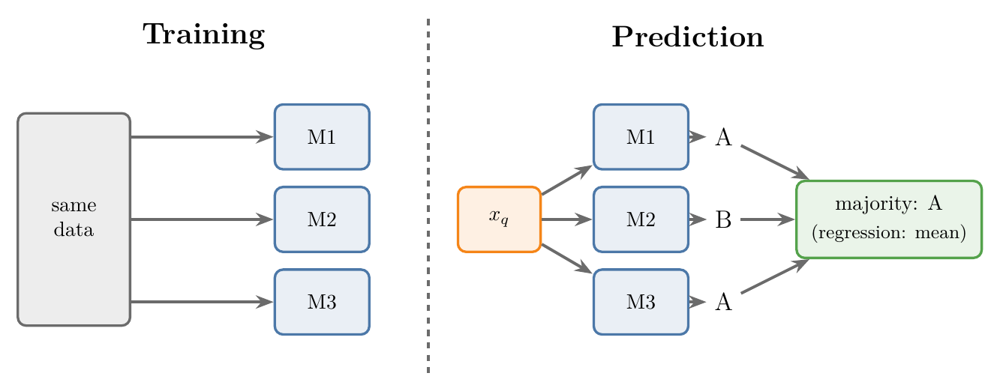
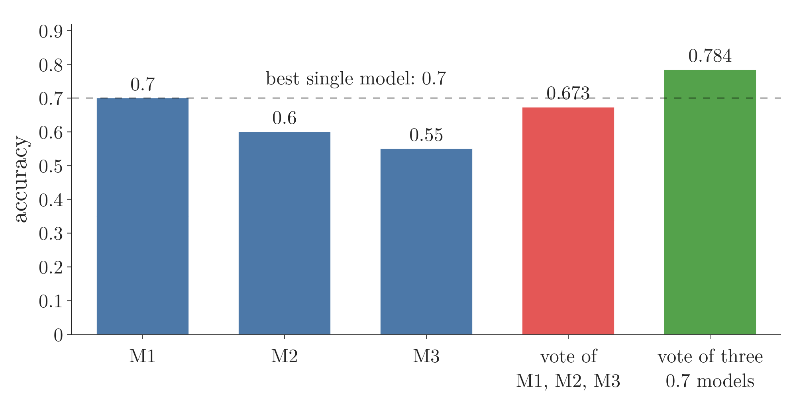
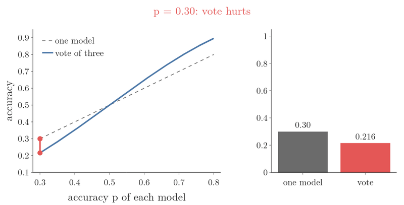
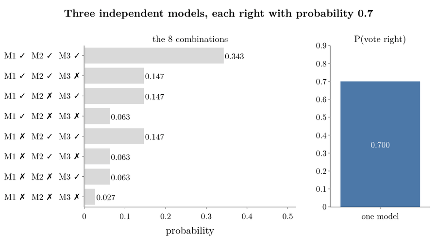
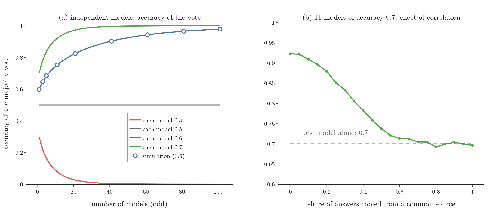

<!-- where-this-fits: generated by course_map/build_map.py; edit concepts.yaml, not this block -->
> **Where this fits:** Pipeline map steps 0 (Foundations), 8 (Model). See the [Course map](../../../00-course-map/00-course-map.md).
>
> 
>
> - **Builds on:** [Ensemble learning](../../../ML/01-foundations/ML-009-mldlc/ML-009-mldlc.md#84-ensemble-learning); [Cross-validation](../../../ML/03-feature-engineering/ML-028-pipelines/ML-028-pipelines.md#8-cross-validation-with-a-pipeline); [Independent and mutually exclusive events](../../../MA/02-probability/MA-016-independent-events/MA-016-independent-events.md#5-independent-or-not); [Probability distributions](../../../MA/01-descriptive-stats/MA-003-statistics-roadmap/MA-003-statistics-roadmap.md#32-probability-distributions).
> - **Compare with:** [Bagging](../../../ML/08-trees-and-ensembles/ML-099-bagging-intuition/ML-099-bagging-intuition.md#3-why-bagging-works); [Stacking and blending](../../../ML/08-trees-and-ensembles/ML-121-stacking-blending/ML-121-stacking-blending.md#2-from-voting-to-stacking); [Poisson distribution](../../../MA/03-distributions/MA-022-pdf-and-continuous-cdf/MA-022-pdf-and-continuous-cdf.md#6-famous-pdfs).
<!-- /where-this-fits -->

## 1. Overview

> **Key point:** A voting ensemble trains several models on the same data and lets them vote. If the models are independent and all have the same accuracy above one half, the vote is right more often than any one of them.

A **voting ensemble** (G-2096) is the simplest ensemble (a group of models whose answers are combined; see [voting](../ML-095-ensemble-learning/ML-095-ensemble-learning.md#41-voting)). This Note and the next two cover it:

- this Note: the core idea (section 2), a puzzle (section 3), the two assumptions voting needs (section 4), and why voting works, with probability (section 5);
- hard and soft voting, code and settings: [the voting classifier](../ML-097-voting-classifier/ML-097-voting-classifier.md#3-hard-voting-and-soft-voting);
- the same ideas for regression (predicting a number): [the voting regressor](../ML-098-voting-regressor/ML-098-voting-regressor.md#2-the-core-idea).

## 2. The core idea

> **Key point:** Train every model on the same data, independently; to predict, ask them all and take the majority (classification) or the mean (regression).

Take a few models, say M1, M2 and M3. The models inside an ensemble are its **base models** (G-260). They can be different algorithms or the same algorithm with different settings; [the voting classifier](../ML-097-voting-classifier/ML-097-voting-classifier.md#5-one-algorithm-different-settings) shows both.

**Training:** each model is trained on the **same** dataset, independently of the others.

**Prediction:** a new query point $x_q$ (the one observation we want an answer for, for example one new flower with petal length 4.5 cm) goes to every trained model, and the ensemble returns the **majority vote** (G-1146; the class most models predict) for classification, or the mean of their outputs for regression, as in [how an ensemble predicts](../ML-095-ensemble-learning/ML-095-ensemble-learning.md#3-how-an-ensemble-predicts).

{height=28%}

In Figure 1, follow the query $x_q$: it reaches all three models, two answer A and one answers B, so the ensemble answers A.

Two small examples with numbers:

- **Classification.** For a query point, M1 predicts 1, M2 predicts 0 and M3 predicts 0. Class 0 has two votes of three, so the ensemble predicts 0.
- **Regression.** M1 predicts 0.5, M2 predicts 0.8 and M3 predicts 0.55. The ensemble predicts their mean, in two steps:

  $$
  0.5 + 0.8 + 0.55 = 1.85
  $$

  $$
  1.85 / 3 = 0.617
  $$

Those two steps are the whole algorithm. A voting ensemble works like an election, which is where the name comes from.

## 3. The puzzle

> **Key point:** Can a vote beat its best member? With accuracies 0.7, 0.6 and 0.55, not quite (0.673); with three models of accuracy 0.7, yes (0.784).

Suppose one model has accuracy ([the share of predictions that are right](../../07-classification/ML-075-accuracy-confusion-matrix/ML-075-accuracy-confusion-matrix.md#21-the-idea)) 0.7, another 0.6 and a third 0.55. Can a vote of the three beat 0.7, the best of them? How could a vote reach further than its best member?

The answer needs two assumptions and a little probability. Figure 2 shows where it leads, for independent models.

{height=32%}

In Figure 2, compare the red and green bars. The red bar is the vote of M1, M2 and M3; the green bar is a vote of three models that are each 0.7. The vote is right when at least two models are right. Each model is right with probability 0.7, 0.6 and 0.55, so it is wrong with probability 0.3, 0.4 and 0.45. Because the models are independent (section 4), the probability of one combination is the product of its three numbers. Four combinations have at least two models right:

| M1 | M2 | M3 | Product | Probability |
|---|---|---|---|---|
| right | right | right | $0.7 \times 0.6 \times 0.55$ | 0.231 |
| right | right | wrong | $0.7 \times 0.6 \times 0.45$ | 0.189 |
| right | wrong | right | $0.7 \times 0.4 \times 0.55$ | 0.154 |
| wrong | right | right | $0.3 \times 0.6 \times 0.55$ | 0.099 |

Adding the last column, one step at a time:

$$0.231 + 0.189 = 0.420$$

$$0.420 + 0.154 = 0.574$$

$$0.574 + 0.099 = 0.673$$

The vote is right with probability 0.673, just below 0.7, because the two weaker models can outvote the best one. Three equally good models of 0.7 reach 0.784 (section 5).

## 4. The two assumptions

> **Key point:** (1) The models must be independent: the more different, the better. (2) Each model must be right more than 50% of the time. For models of equal accuracy, these two make the vote beat each model.

**Assumption 1: the base models are independent.** In probability terms the models' mistakes are **independent events** (G-934): knowing one model is wrong tells us nothing about the others. In plain words: when one model is wrong, the others should not be wrong for the same reason. The more different the models are, the better the vote works, just as a mixed quiz-show audience covers more topics than one of programmers only ([the base models must be different](../ML-095-ensemble-learning/ML-095-ensemble-learning.md#31-the-base-models-must-be-different)); if they are very similar, voting gains little.

**Assumption 2: every model's accuracy is above 50%.** A model that is right less than half the time does harm: a vote of independent models that all share one accuracy below 50% is **worse than each of them** (section 5.1 shows it with numbers).

For two classes, 50% accuracy is what random guessing gives. Beating a coin toss is not hard, so assumption 2 is usually met in practice.

The two assumptions are enough when the models have the **same accuracy** (sections 5 and 5.1). When the accuracies differ, a vote can still fall below its best member: in section 3, the vote of models with accuracy 0.7, 0.6 and 0.55 is right with probability 0.673, less than the 0.7 of the best model.

In Figure 3, $p$ is the probability that one model is right. The horizontal axis is $p$ and the vertical axis is the probability that the vote is right; the dashed line is one model alone, so it equals $p$. Watch the blue curve cross the dashed line at p = 0.5: below it the vote is worse than one model, above it better, and the gap grows as p moves away from 0.5. The bar chart beside the curve shows the same two values at the current $p$: one model (grey) and the vote (red when worse, green when better).

## 5. Why voting works: the probability

> **Key point:** With three independent models of accuracy 0.7, the vote is right whenever at least two are right, which happens with probability 0.784.

Take three independent models, M1, M2 and M3, each with accuracy 0.7. On a new point, each is right with probability 0.7 and wrong with probability 0.3.

Because the models are independent, the probability of a combination of outcomes is the product of the separate probabilities (the multiplication rule for [independent events](../../../MA/02-probability/MA-016-independent-events/MA-016-independent-events.md#2-the-definition)). Figure 4 lists all 8 combinations.

{height=50%}

Figure 4 is a **probability tree**; read it from left to right. Each fork is one model's outcome: right (green box) or wrong (red box), and the number on each branch is the probability of that outcome. One path from "start" to a box on the far right is one combination, so the 8 right-hand boxes are the 8 combinations. Multiply the three numbers along a path to get the probability of that combination, written next to it; the right-hand label says whether the majority is right. Step 1 below works out the top path.

The majority is right when **at least two** models are right. Four of the eight combinations qualify.

Figure 5 adds those four up, one at a time:

1. All three right:

   $$0.7 \times 0.7 \times 0.7 = 0.343$$

2. M1 and M2 right, M3 wrong:

   $$0.7 \times 0.7 \times 0.3 = 0.147$$

   Running total:

   $$0.343 + 0.147 = 0.490$$

3. M1 and M3 right, M2 wrong:

   $$0.7 \times 0.3 \times 0.7 = 0.147$$

   Running total:

   $$0.490 + 0.147 = 0.637$$

4. M2 and M3 right, M1 wrong:

   $$0.3 \times 0.7 \times 0.7 = 0.147$$

   Running total:

   $$0.637 + 0.147 = 0.784$$

{height=50%}

In Figure 5, watch the stacked bar on the right pass the blue bar of a single model when the last piece is added. The general rule behind the four steps:

**In words:** add the probabilities of "all three right" and of the three ways to have exactly two right.

**Formula:** let $p$ be the probability that one model is right ($p = 0.7$ above). The formula has two terms.

- "All three right" has probability

  $$p \times p \times p = p^3$$

- "Exactly two right" can happen in three ways (M3 wrong, M2 wrong or M1 wrong). Each way has probability

  $$p \times p \times (1-p) = p^2(1-p)$$

  and the three ways together give

  $$3\thinspace p^2(1-p)$$

With $p = 0.7$ the two pieces are:

$$p^3 = 0.7^3 = 0.343$$

$$p^2(1-p) = 0.7^2 \times 0.3 = 0.147$$

The formula is:

$$P(\text{vote right}) = p^3 + 3\thinspace p^2(1-p)$$

**Example:** with $p = 0.7$, in three lines:

$$0.7^3 = 0.343$$

$$3 \times 0.7^2 \times 0.3 = 3 \times 0.147 = 0.441$$

$$P(\text{vote right}) = 0.343 + 0.441 = 0.784$$

This matches the running total of the four steps above.

So three models of accuracy 0.7 make a vote of accuracy **0.784**, better than each one. The vote is wrong only when two or three models are wrong at the same time, and with independent models that is rarer than one model being wrong.

### 5.1 Below 50%: the vote is worse than the worst

> **Key point:** With three models of accuracy 0.3, the vote is right with probability only 0.216.

Now let each model be right with probability $p = 0.3$. The same formula gives:

$$0.3^3 = 0.027$$

$$3 \times 0.3^2 \times 0.7 = 3 \times 0.063 = 0.189$$

$$P(\text{vote right}) = 0.027 + 0.189 = 0.216$$

A vote accuracy of about 22% is worse than every single model (30%). The value 0.216 is also what is left over from section 5:

$$1 - 0.784 = 0.216$$

The match has a reason: with $p = 0.3$, each combination where the majority is right has the probability of one of the four "majority wrong" combinations in Figure 4, with right and wrong swapped. This calculation shows assumption 2 at work for three models of equal accuracy: voting amplifies whatever the models are, good or bad.

> **Extra:** With $n$ models (an odd number, so there are no ties), the vote is right when more than half are right. The number of right models follows a **binomial distribution** (G-308), so
> $$P(\text{vote right}) = \sum_{k > n/2} \binom{n}{k} p^k (1-p)^{n-k}$$
> Reading the symbols with $n = 3$ and $p = 0.7$:
>
> - $\sum_{k > n/2}$ means "add one term for every $k$ above $n/2$". Here
>
>   $$n/2 = 3/2 = 1.5$$
>
>   so the terms are $k = 2$ and $k = 3$.
> - $\binom{n}{k}$ counts the ways to choose which $k$ models are right:
>
>   $$\binom{3}{2} = 3$$
>
>   $$\binom{3}{3} = 1$$
>
> The two terms are
> $$k = 2:\ 3 \times 0.7^2 \times 0.3 = 0.441$$
> $$k = 3:\ 1 \times 0.7^3 \times 0.3^0 = 0.343$$
> and their sum is the same 0.784 as the formula above:
> $$0.441 + 0.343 = 0.784$$
> This result is known as **Condorcet's jury theorem** (G-445; Condorcet, 1785).

### 5.2 More models, and correlated models

> **Key point:** With independent models of equal accuracy above 50%, more models push the vote toward 100%; once the models start copying each other, the benefit disappears.

{height=45%}

Figure 6a uses the formula of the Extra box for 1 to 101 models:

| Each model | 3 models | 11 models | 101 models |
|---|---|---|---|
| 0.7 | 0.784 | 0.922 | 1.000 |
| 0.6 | 0.648 | 0.753 | 0.979 |
| 0.5 | 0.500 | 0.500 | 0.500 |
| 0.3 | 0.216 | 0.078 | 0.000 |

Even models only slightly better than chance (0.6) reach a vote of 0.98 with 101 of them. Models at exactly 0.5 gain nothing, and models below 0.5 drive the vote to 0.

The dots in Figure 6a come from a simulation: 20,000 random trials of independent models of accuracy 0.6. They sit on the formula's line, so the formula is right.

Figure 6b tests assumption 1. Eleven models of accuracy 0.7 vote, but each answer is, with some probability, copied from one shared source instead of being the model's own:

- with no copying (independent models), the vote scores about **0.92**;
- with half the answers copied, about **0.74**;
- with everything copied, the eleven models act as one, and the vote scores **0.7**, no better than a single model.

> **Extra:** Models trained on the same data are usually correlated, so real gains are smaller than Figure 6a promises: the correlation between the models limits what combining them can gain (ESL §15.2), just as Figure 6b shows. An ensemble beats its members only when they are both accurate and *diverse*, meaning they make different errors (Dietterich, 2000). Correlation is the reason ensembles work to make their models different: different algorithms (voting), different samples of the data ([bagging](../ML-099-bagging-intuition/ML-099-bagging-intuition.md#2-the-core-idea)), or both.

## 6. Summary

| Situation | Each model right | Vote of 3 models right |
|---|---|---|
| Independent, better than chance | 0.7 | 0.784 (better than each) |
| Independent, worse than chance | 0.3 | 0.216 (worse than each) |
| Fully correlated | 0.7 | 0.7 (no gain) |

- The table rows differ because voting amplifies whatever the models are: good independent models get better, bad ones get worse, and copies of one model add nothing.
- A voting ensemble trains several models on the same data; classification takes the majority vote, regression the mean, so the whole algorithm is two steps, like an election.
- It needs two assumptions: independent (different) models, and every model better than 50%. Together they guarantee a gain when the models have equal accuracy; with unequal accuracies the vote can trail its best member (0.673 against 0.7 in section 3), because the two weaker models can outvote the best one.
- For three models, the chance that the vote is right is 0.784 for $p = 0.7$, because the vote is wrong only when two or three models are wrong at the same time, which is rarer than one model being wrong:

  $$P(\text{vote right}) = p^3 + 3p^2(1-p)$$

- More independent models help more; correlated models help less, because models that copy each other make the same mistakes, so ensembles work to make their models different.
- This answers the opening question: a vote beats each of its members when they are independent and equally accurate above 50%.

## 7. Sources

**Built from**

- CampusX, "Voting Ensemble | Introduction and Core Idea | Part 1", YouTube, https://www.youtube.com/watch?v=_W1i-c_6rOk

**Other references**

- Condorcet, Marquis de (1785). *Essai sur l'application de l'analyse à la probabilité des décisions rendues à la pluralité des voix*. Paris.
- Dietterich, T. G. (2000). "Ensemble Methods in Machine Learning". *Multiple Classifier Systems* (MCS 2000), LNCS 1857, Springer, section 1.
- Hastie, T., Tibshirani, R. and Friedman, J. (2009). *The Elements of Statistical Learning* (ESL), 2nd ed. Springer, section 15.2.

## 8. Key terms

| Term | Meaning |
|---|---|
| Voting ensemble (G-2096) | Several models trained on the same data, combined by majority vote (classification) or mean (regression) |
| Base model (G-260) | One of the models inside an ensemble |
| Independent models | Models whose mistakes are unrelated, so one being wrong says nothing about the others |
| Binomial distribution (G-308) | The distribution of the number of successes in $n$ independent trials with the same success probability |
| Condorcet's jury theorem (G-445) | A majority of independent voters, each right with the same probability above 0.5, is right more often than any one voter, and more so as voters are added |
