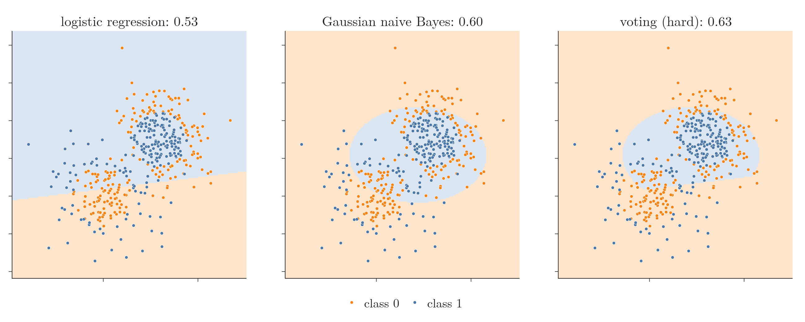
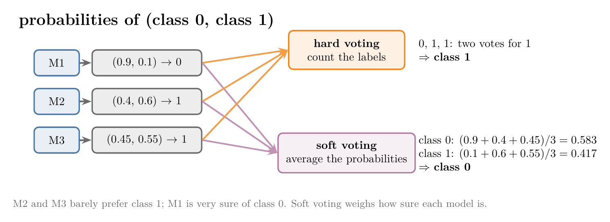
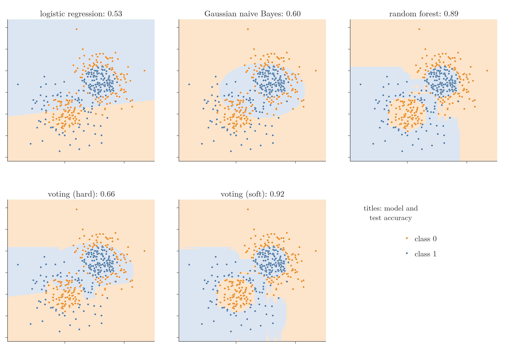
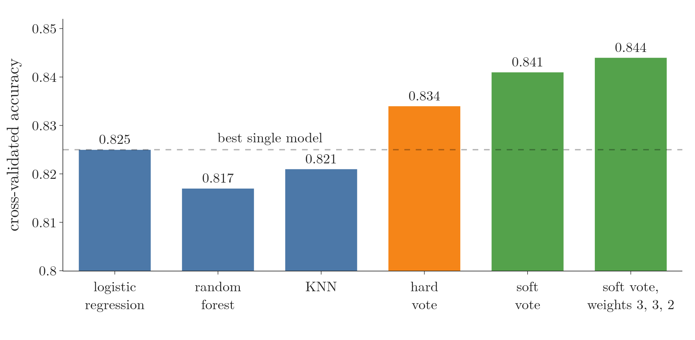
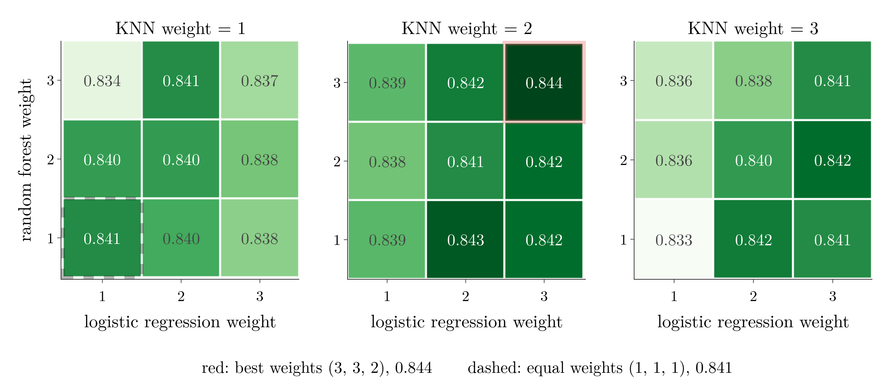
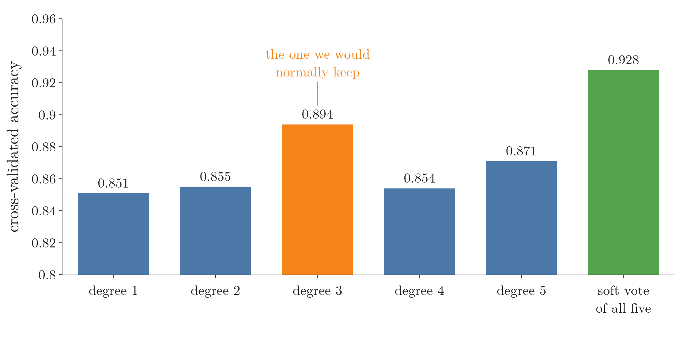

<!-- where-this-fits: generated by course_map/build_map.py; edit concepts.yaml, not this block -->
> **Where this fits:** Pipeline map steps 8 (Model), 9 (Evaluate). See the [Course map](../../../00-course-map/00-course-map.md).
>
> 
>
> - **Builds on:** Ensemble learning ([Note ML-009](../../../ML/01-foundations/ML-009-mldlc/ML-009-mldlc.md)); Independent and mutually exclusive events ([Note MA-016](../../../MA/02-probability/MA-016-independent-events/MA-016-independent-events.md)); Bernoulli and binomial distributions ([Note MA-021](../../../MA/03-distributions/MA-021-pmf-and-discrete-cdf/MA-021-pmf-and-discrete-cdf.md)).
> - **Leads to:** Grid and random search ([Note ML-100](../../../ML/08-trees-and-ensembles/ML-100-bagging-classifier/ML-100-bagging-classifier.md)); Stacking and blending ([Note ML-121](../../../ML/08-trees-and-ensembles/ML-121-stacking-blending/ML-121-stacking-blending.md)); Random under- and oversampling ([Note ML-127](../../../ML/09-clustering-and-more/ML-127-imbalanced-data/ML-127-imbalanced-data.md)); Optuna ([Note ML-128](../../../ML/09-clustering-and-more/ML-128-optuna/ML-128-optuna.md)).
> - **Compare with:** Train-test split ([Note ML-012](../../../ML/01-foundations/ML-012-toy-project/ML-012-toy-project.md)); Bagging ([Note ML-099](../../../ML/08-trees-and-ensembles/ML-099-bagging-intuition/ML-099-bagging-intuition.md)); OOB score ([Note ML-099](../../../ML/08-trees-and-ensembles/ML-099-bagging-intuition/ML-099-bagging-intuition.md)); Stacking and blending ([Note ML-121](../../../ML/08-trees-and-ensembles/ML-121-stacking-blending/ML-121-stacking-blending.md)).
<!-- /where-this-fits -->

## 1. Overview

> **Key point:** A voting classifier combines several classifiers trained on the same data. Hard voting counts their predicted labels; soft voting averages their predicted probabilities. Weights let some models count more.

The idea and the probability behind voting are in the [voting ensemble Note](../ML-096-voting-ensemble/ML-096-voting-ensemble.md). This Note applies them to classification:

- a demo of decision surfaces, showing what voting does to the decision boundary (section 2);
- the two kinds of voting, **hard** and **soft**, and how they differ (section 3);
- scikit-learn's `VotingClassifier` on a real dataset, with its `weights` hyperparameter (section 4);
- voting over one algorithm with different settings (section 5).

The Notebook (`notebook.ipynb`) runs every experiment. The Dash app `app.py` lets us pick a dataset, base models and the voting type, and redraws every decision surface.

<!-- playground: images/voting_playground.html -->

## 2. The core idea, on decision surfaces

> **Key point:** Each base model has its own decision boundary; the voting classifier's decision boundary mixes them, and can generalise better than each one.

Recall the setup: base models M1, M2, M3 are trained on the same data D. For a query point $x_q$, each predicts a class (0 or 1 for a two-class problem), and the voting classifier returns the most common one, the **mode** of the predictions.

A **decision surface** (G-560; the feature plane coloured by the class a model predicts at each point, the [KNN Note](../../07-classification/ML-085-knn/ML-085-knn.md), section 5) shows this best. The line where the colour changes is the **decision boundary** (G-555). The app `app.py` offers:

- six toy datasets with two **features** (input variables, the columns of the data table), such as concentric circles, a U shape, two spirals and XOR;
- five base models: KNN, logistic regression, Gaussian naive Bayes, SVM and random forest (a forest of trees, covered in later Notes).

The app trains the chosen models and the voting classifier on 80% of the **observations** (the points, one row of the table each) and reports accuracy on the other 20%.

On the concentric-circles data, one class forms rings around the other, so no straight line separates them. With logistic regression and Gaussian naive Bayes (hard voting):

| Base models | Each model's test accuracy | Voting classifier (G-2095) |
|---|---|---|
| logistic regression, Gaussian naive Bayes | 0.53, 0.60 | **0.63** |

Logistic regression has a straight decision boundary, which cannot follow rings, so it scores barely better than guessing. Naive Bayes has a curved (oval) decision boundary and does a little better. Voting with both gives 0.63, above each of them. With two models, a point is labelled class 1 only where both models say class 1 (on a tie, `VotingClassifier.predict` takes the `argmax` of the vote counts, which returns the lower label, class 0; scikit-learn 1.9 source), so the vote's decision boundary keeps the part of the oval that lies on logistic regression's class-1 side.



In Figure 1, watch the right panel: the vote keeps the naive Bayes oval but cuts it along logistic regression's straight decision boundary.

With few test points (here 100), accuracies jump around, so the shape of the decision boundary is often a better guide than the last digit of the score: a smooth decision boundary that follows the data tends to generalise better.

**When the vote loses.** The [voting ensemble Note](../ML-096-voting-ensemble/ML-096-voting-ensemble.md), section 4, needs every member to beat a coin toss clearly. Logistic regression (0.53) barely does, so mixing it with a strong model can drag the vote down:

- logistic regression with an SVM (0.53 and 0.87): hard vote **0.76**, below the SVM;
- logistic regression, naive Bayes and random forest (0.53, 0.60 and 0.89): hard vote **0.66**, because the two weak models outvote the good one.

In such a case we drop the weak members, or switch to soft voting, below, which rescues the second case.

## 3. Hard voting and soft voting

> **Key point:** Hard voting takes the most common predicted label. Soft voting averages the predicted probabilities of each class and picks the highest average.

Almost every classification algorithm can give its answer as probabilities: for example, class 0 with probability 0.6 and class 1 with probability 0.4. The predicted label is the class with the highest probability.

### 3.1 Hard voting

> **Key point:** Each model casts one vote for its predicted label; the label with most votes wins.

**Hard voting** (G-878) is what we have done so far: each model's predicted label counts as one vote, and the majority wins. Hard voting is scikit-learn's default, `voting="hard"`.

Take two models on a two-class problem. M1 gives (class 0: 0.6, class 1: 0.4) and predicts 0; M2 gives (0.8, 0.2) and also predicts 0. Hard voting: 0 and 0, so the answer is **0**.

### 3.2 Soft voting

> **Key point:** Average each class's probability across the models; the class with the highest average wins.

**Soft voting** (G-1828; `voting="soft"`) uses the probabilities themselves.

1. **In words:** for each class, average the probability that the models give it; predict the class with the largest average.
2. **Formula:** with $n$ models, where model $i$ gives class $c$ the probability $p_i(c)$,
   $$\bar{p}(c) = \frac{1}{n}\sum_{i=1}^{n} p_i(c)$$

   The prediction $\hat{y}$ is the class $c$ with the largest $\bar{p}(c)$.
3. **Example:** the same two models:
   $$\bar{p}(0) = \frac{0.6 + 0.8}{2} = 0.7$$

   $$\bar{p}(1) = \frac{0.4 + 0.2}{2} = 0.3$$
   so the answer is again **0**.

The same works for more classes. Five classifiers on a three-class problem give these probabilities (in %):

| Classifier | Class 1 | Class 2 | Class 3 |
|---|---|---|---|
| C1 | 90 | 8 | 2 |
| C2 | 20 | 70 | 10 |
| C3 | 10 | 60 | 30 |
| C4 | 30 | 65 | 5 |
| C5 | 25 | 55 | 20 |
| **Average** | **35** | **51.6** | **13.4** |

Class 2 has the highest average, so soft voting predicts **class 2**. Hard voting agrees here: four of the five classifiers pick class 2.

### 3.3 When the two disagree

> **Key point:** Soft voting listens to how sure each model is, so one very confident model can outweigh two unsure ones.

{height=30%}

> **Extra:** In the examples above both kinds of voting agree. Figure 2 shows a case where they do not. M1 is very sure of class 0 (0.9); M2 and M3 lean only slightly to class 1 (0.6 and 0.55). Hard voting counts two votes for class 1 and answers **1**. Soft voting averages 0.583 for class 0 against 0.417 for class 1 and answers **0**.

### 3.4 Which one to use

> **Key point:** Soft voting is sometimes better, but not always. The voting type is a hyperparameter: try both.

Soft voting can do better. On the concentric circles with logistic regression, naive Bayes and random forest (Figure 4):

- the base models score 0.53, 0.60 and 0.89;
- **hard** voting scores **0.66**: the two weak models outvote the forest;
- **soft** voting scores **0.92**, better than every base model.

Why? The forest is sure of its answers, while the two weak models hover near 50/50. In the hard vote their two shaky votes beat the forest's one; in the soft vote their near-0.5 probabilities barely move the average, so the forest decides (the effect of section 3.3).

> **Extra:** We checked this in the Notebook. On the 100 test points, hard and soft voting disagree on 30; soft voting is right on 28 of them and sides with the random forest on all 30. On those points the forest's probability is on average 0.35 away from 0.5, against 0.01 for logistic regression and 0.06 for naive Bayes.

Figure 3 replays the count for three of those 30 test points. Watch the two weak models fall just on one side of 0.5 and win the hard vote, while in the average the forest's confident probability decides.


{height=58%}

Soft voting also tends to give a smoother decision surface, and that smoothing is sometimes why it does better. Soft voting does not always win, though: on the hard iris problem in section 4.3, soft voting does slightly worse than hard (0.64 against 0.67). The voting type is a hyperparameter like any other, so we try both and keep the better.

> **Extra:** Soft voting needs every base model to give probabilities, through a `predict_proba` method. Most classifiers have one. An SVM does not by default: older code wrote `SVC(probability=True)`, which is deprecated in scikit-learn 1.9 and due to be removed in 1.11. The current way is to wrap the SVM: `CalibratedClassifierCV(SVC(), ensemble=False)` (scikit-learn 1.9 deprecation message for `SVC`).

## 4. VotingClassifier on the heart disease data

> **Key point:** Three base models of about equal accuracy (0.825, 0.817, 0.821) combine into a vote that beats each of them: 0.834 hard, 0.841 soft.

### 4.1 The data and the conditions

> **Key point:** 303 patients, 13 features, target "heart disease or not"; every score is a repeated, shuffled 10-fold cross-validation.

We use the heart disease data from the [accuracy and confusion matrix Note](../../07-classification/ML-075-accuracy-confusion-matrix/ML-075-accuracy-confusion-matrix.md): 303 **observations** (one patient each, one row of the data table), 13 **features** (input variables such as age, cholesterol and maximum heart rate) and a yes/no **target** (the output we predict): does the patient have heart disease.

The conditions follow the [voting ensemble Note](../ML-096-voting-ensemble/ML-096-voting-ensemble.md): the members should be about equally accurate and make different mistakes. So we pick three very different algorithms, logistic regression, random forest and KNN, and give logistic regression and KNN standardized features (the [standardization Note](../../03-feature-engineering/ML-023-standardization/ML-023-standardization.md)), since both are sensitive to the scale of each feature.

Each score is 10-fold cross-validation (the [pipelines Note](../../03-feature-engineering/ML-028-pipelines/ML-028-pipelines.md), section 8): the data is cut into 10 parts, the model is trained on 9 and tested on the tenth, ten times. With only 303 patients one cut is noisy, so we repeat the whole procedure with 5 different shuffles and report the mean.

> **Python:** Loading the data and scoring each base model.
>
> ```python
> from sklearn.model_selection import (RepeatedStratifiedKFold,
>                                      cross_val_score)
> from sklearn.pipeline import make_pipeline
> from sklearn.preprocessing import StandardScaler
>
> heart = pd.read_csv("data/heart.csv")
> X, y = heart.drop(columns="target"), heart["target"]
> cv = RepeatedStratifiedKFold(n_splits=10, n_repeats=5,
>                              random_state=0)
>
> estimators = [
>     ("lr", make_pipeline(StandardScaler(), LogisticRegression())),
>     ("rf", RandomForestClassifier(random_state=42)),
>     ("knn", make_pipeline(StandardScaler(), KNeighborsClassifier()))]
> for name, model in estimators:
>     print(name, cross_val_score(model, X, y, cv=cv).mean())
> # lr 0.825, rf 0.817, knn 0.821
> ```
>
> `estimators` is a **list of tuples**: each tuple is (a name as a string, the model object). `VotingClassifier` takes exactly this format.

### 4.2 Hard and soft voting

> **Key point:** Hard voting 0.834, soft voting 0.841: both beat every base model.

> **Python:** The voting classifier.
>
> ```python
> from sklearn.ensemble import VotingClassifier
>
> vc = VotingClassifier(estimators=estimators, voting="hard")
> cross_val_score(vc, X, y, cv=cv).mean()      # 0.834
>
> vc = VotingClassifier(estimators=estimators, voting="soft")
> cross_val_score(vc, X, y, cv=cv).mean()      # 0.841
> ```
>
> `voting` is `"hard"` by default. `fit` trains every base model; `predict` combines them.

| Model | Logistic regression | Random forest | KNN | Hard vote | Soft vote |
|---|---|---|---|---|---|
| Accuracy | 0.825 | 0.817 | 0.821 | 0.834 | **0.841** |



In Figure 5, watch the bars cross the dashed line: every vote beats every member, but only by one to two points (the axis starts at 0.80).

Both votes beat the best single model. The gain is about one to two points: the three models disagree on only some patients, and on those the majority is right more often than any one of them, as section 5 of the voting ensemble Note predicts.

### 4.3 Weights

> **Key point:** `weights` gives each model's vote a different importance. With members this close, the best weights (3, 3, 2) add almost nothing: 0.844 against 0.841.

By default every model's vote counts the same, as in a democracy. The `weights` (G-2120) hyperparameter changes that: `weights=[5, 1]` makes the first model's vote count five times as much as the second's. In hard voting it multiplies the votes; in soft voting it gives a weighted average of the probabilities.

1. **In words:** each model's probability is multiplied by its weight, and the sum is divided by the total weight.
2. **Formula:** with weights $w_1, \dots, w_n$,
   $$\bar{p}(c) = \frac{\sum_{i=1}^{n} w_i\thinspace p_i(c)}{\sum_{i=1}^{n} w_i}$$
3. **Example:** in Figure 2, give M1 weight 2 and the others weight 1. For class 1:
   $$\bar{p}(1) = \frac{2(0.1) + 0.6 + 0.55}{2 + 1 + 1} = \frac{1.35}{4} = 0.3375$$
   so class 0 wins even more clearly ($0.6625$).

To find good weights, we try them all: each weight from 1 to 3 for each of the three models, 27 combinations, each scored by cross-validation.

> **Python:** Searching over weights.
>
> ```python
> for i in range(1, 4):
>     for j in range(1, 4):
>         for k in range(1, 4):
>             vc = VotingClassifier(estimators=estimators,
>                     voting="soft", weights=[i, j, k])
>             acc = cross_val_score(vc, X, y, cv=cv).mean()
>             print(i, j, k, round(acc, 3))
> ```

Figure 6 shows all 27 scores. Each panel fixes the KNN weight; inside a panel, the logistic regression weight runs left to right and the random forest weight bottom to top.

{height=30%}

In Figure 6, watch how little the numbers move: the worst triple scores 0.833 and the best 0.844.

The best combination is **(3, 3, 2)** with **0.844**, against 0.841 for equal weights. When the members are about equally good, equal weights are already close to the best. Trying values and keeping the best is hyperparameter tuning; `GridSearchCV` (the [KNN Note](../../07-classification/ML-085-knn/ML-085-knn.md), section 4.2) can run the same search for us.

> **Extra:** Weights matter when one member is much stronger than the rest. Take a hard version of the iris data (the [softmax regression Note](../../07-classification/ML-078-softmax-regression/ML-078-softmax-regression.md)): only versicolor and virginica, and only the two sepal features, where the two species overlap heavily (100 observations, plain 10-fold cross-validation). Logistic regression scores 0.75, random forest 0.60 and KNN 0.61. The weak pair outvotes the strong model: hard voting scores 0.67 and soft voting 0.64, both below logistic regression alone. Weights (3, 1, 1), which give logistic regression the biggest say, lift soft voting to 0.71, still below 0.75. Voting needs members that are both accurate and diverse (Dietterich, 2000, section 1); when one member is far ahead, the honest choice is that member alone. The loss is what the [voting ensemble Note](../ML-096-voting-ensemble/ML-096-voting-ensemble.md) (section 3) predicts: a vote cannot be relied on to beat a member that is much stronger than the others, because the weaker members can outvote it.

## 5. One algorithm, different settings

> **Key point:** Instead of picking the best of five SVMs, vote over all five: 0.928, above the best single one (0.894).

Voting does not need different algorithms. Voting can also combine **one algorithm with different hyperparameter values**.

Tuning is hard because we do not know which value is right. Take an SVM with a polynomial kernel (the [kernel trick Note](../../07-classification/ML-090-kernel-trick-code/ML-090-kernel-trick-code.md)) and an unknown degree. On a synthetic dataset of 1,000 observations and 20 features (`make_classification`), we try degrees 1 to 5, each scored by 10-fold cross-validation:

| Degree | 1 | 2 | 3 | 4 | 5 | Soft vote of all five |
|---|---|---|---|---|---|---|
| Accuracy | 0.851 | 0.855 | 0.894 | 0.854 | 0.871 | **0.928** |

Normally we would keep degree 3. Putting all five SVMs into a soft-voting classifier does better than any of them.



In Figure 7, compare the green bar with the orange one: the vote of all five settings beats the best single setting by 3.4 points.

> **Python:** Voting over five SVMs.
>
> ```python
> from sklearn.calibration import CalibratedClassifierCV
> from sklearn.svm import SVC
>
> svms = [(f"svm{d}", CalibratedClassifierCV(
>             SVC(kernel="poly", degree=d), ensemble=False))
>         for d in range(1, 6)]
> vc = VotingClassifier(estimators=svms, voting="soft")
> cross_val_score(vc, X, y, cv=10).mean()      # 0.928
> ```

Both approaches are used: different algorithms, or one algorithm with several settings. Neither wins on every dataset, so with ensembles, experimenting matters most.

## 6. Summary

| | Hard voting (G-878) | Soft voting (G-1828) |
|---|---|---|
| Combines | predicted labels | predicted probabilities |
| Rule | most common label | highest average probability |
| Needs | `predict` | `predict_proba` on every model |
| Concentric circles (LR, NB, RF) | 0.66 | 0.92 |
| Heart disease (LR, RF, KNN: 0.825, 0.817, 0.821) | 0.834 | 0.841 (0.844 with weights 3, 3, 2) |
| Iris, two species, two features (one strong member) | 0.67 | 0.64 (0.71 with weights 3, 1, 1) |

- `VotingClassifier(estimators=[(name, model), ...], voting="hard" or "soft", weights=[...])`.
- Soft voting is sometimes better and gives a smoother surface, but not always: treat the voting type as a hyperparameter.
- A vote beats its members when they are about equally accurate and different (heart data); it can lose when one member is far ahead or barely beats chance, and then that member alone is the better choice.
- Voting over one algorithm with different settings (five SVM degrees: 0.928) can beat picking the best setting (0.894).

## 7. Sources

**Built from**

- CampusX, "Voting Ensemble | Classification | Voting Classifier | Hard Voting Vs Soft Voting | Part 2", YouTube, https://www.youtube.com/watch?v=pGQnNYdPTvY

**Other references**

- Dietterich, T. G. (2000). "Ensemble Methods in Machine Learning". *Multiple Classifier Systems* (MCS 2000), LNCS 1857, Springer, section 1.
- scikit-learn developers. `sklearn.svm.SVC`, version 1.9: the `probability` parameter is deprecated in 1.9 and will be removed in 1.11. scikit-learn.org, modules/generated/sklearn.svm.SVC.

## 8. Key terms

| Term | Meaning |
|---|---|
| Feature (G-772) | An input variable: one column of the data table |
| Observation (G-1374) | One record of the data: one row of the data table |
| Target (G-1949) | The output we predict |
| Voting classifier (G-2095) | A classifier that combines several trained classifiers by voting |
| Hard voting (G-878) | Predicting the label that most base models predict |
| Soft voting (G-1828) | Predicting the class with the highest average predicted probability across the base models |
| weights (G-2120) | VotingClassifier and VotingRegressor setting that gives each base model's vote a different importance |
| CalibratedClassifierCV (G-340) | scikit-learn wrapper that gives a classifier, such as an SVM, calibrated probabilities |
