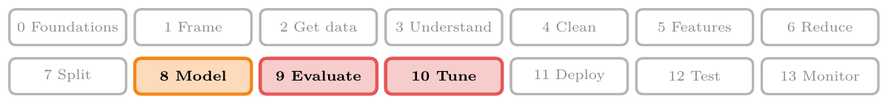
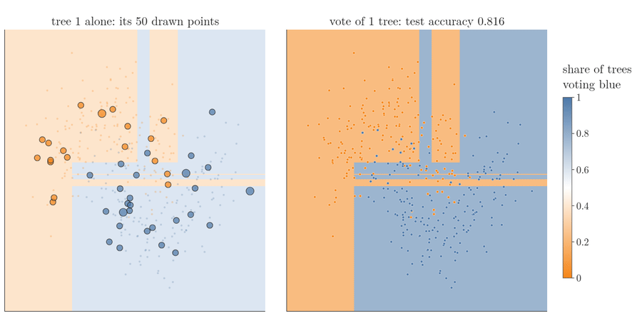
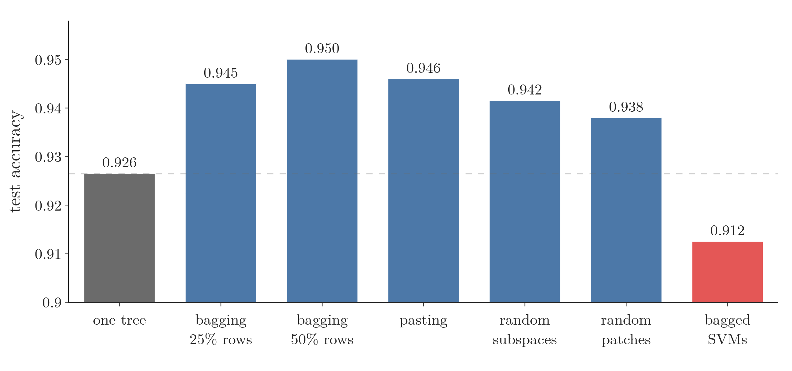
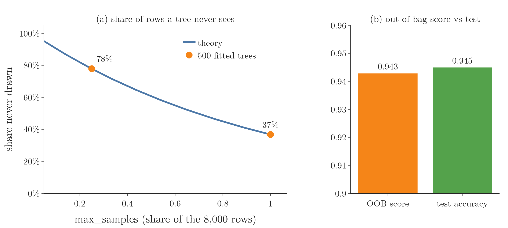

<!-- where-this-fits: generated by course_map/build_map.py; edit concepts.yaml, not this block -->
> **Where this fits:** Pipeline map steps 8 (Model), 9 (Evaluate), 10 (Tune). See the [Course map](../../../00-course-map/00-course-map.md).
>
> 
>
> - **Builds on:** [Overfitting](../../../ML/01-foundations/ML-007-challenges-in-ml/ML-007-challenges-in-ml.md#7-overfitting-and-underfitting); [Ensemble learning](../../../ML/01-foundations/ML-009-mldlc/ML-009-mldlc.md#84-ensemble-learning); [Hyperparameter tuning](../../../ML/01-foundations/ML-009-mldlc/ML-009-mldlc.md#83-model-selection-and-hyperparameter-tuning); [ML pipelines](../../../ML/01-foundations/ML-012-toy-project/ML-012-toy-project.md#1-overview); [Simple imputation (mean, median, mode, constant)](../../../ML/03-feature-engineering/ML-022-what-is-feature-engineering/ML-022-what-is-feature-engineering.md#1-overview); [Cross-validation](../../../ML/03-feature-engineering/ML-028-pipelines/ML-028-pipelines.md#8-cross-validation-with-a-pipeline).
> - **Leads to:** [Random forest](../../../ML/08-trees-and-ensembles/ML-102-random-forest-intro/ML-102-random-forest-intro.md#2-why-random-forests-are-so-popular).
> - **Compare with:** [Boosting](../../../ML/08-trees-and-ensembles/ML-095-ensemble-learning/ML-095-ensemble-learning.md#44-boosting); [Voting ensembles](../../../ML/08-trees-and-ensembles/ML-098-voting-regressor/ML-098-voting-regressor.md#6-sources); [Cross-validation](../../../ML/08-trees-and-ensembles/ML-098-voting-regressor/ML-098-voting-regressor.md#41-the-data-and-the-base-models); [Random forest](../../../ML/08-trees-and-ensembles/ML-102-random-forest-intro/ML-102-random-forest-intro.md#2-why-random-forests-are-so-popular); [Optuna](../../../ML/09-clustering-and-more/ML-128-optuna/ML-128-optuna.md#4-optunas-vocabulary); [Bayesian optimisation](../../../ML/09-clustering-and-more/ML-128-optuna/ML-128-optuna.md#1-overview).
<!-- /where-this-fits -->

## 1. Overview

> **Key point:** scikit-learn's `BaggingClassifier` trains many copies of one classifier on random samples of the observations and/or features and takes their majority vote. Its settings choose the type: bagging, pasting, random subspaces or random patches.

The idea was explained in [the four types of bagging](../ML-099-bagging-intuition/ML-099-bagging-intuition.md#6-types-of-bagging). **Bootstrapping** draws random samples of the observations with replacement (an observation can be drawn more than once); one model is trained on each sample; **aggregation** combines their answers by majority vote; there are four variants. This Note applies it to classification:

- a demo of decision surfaces, comparing one model with its bagged version, for each of the four types (section 2);
- `BaggingClassifier` in code on a dataset of 10,000 observations, with its hyperparameters (section 3);
- the out-of-bag score (section 4);
- what works in practice, and tuning with `GridSearchCV` (section 5).

The Notebook (`ML-100-bagging-classifier.ipynb`) runs every experiment. The Dash app `app.py` has a control for every bagging setting and redraws the decision surfaces.

<!-- playground: images/bagging_classifier_playground.html -->

## 2. Seeing bagging on decision surfaces

> **Key point:** On the moons data, one fully grown tree overfits (test accuracy 0.856); bagging 100 trees smooths the decision boundary and reaches 0.912.

The demo data is the two-moons toy dataset: 500 **observations** (points; each is one row of the data table), 375 for training, with two **features** (input variables, the columns $x_1$ and $x_2$) and a class label as the **target** (the output we predict). It is the same data as in [the main hyperparameters](../ML-092-decision-tree-hyperparameters/ML-092-decision-tree-hyperparameters.md#4-the-main-hyperparameters) of decision trees. The app asks for six settings, the main hyperparameters of `BaggingClassifier`:

- **base model** (G-260; `estimator`): decision tree (the default), KNN or SVM;
- **`n_estimators`:** how many base models;
- **`max_samples`:** how many observations each model gets (here out of 375);
- **`bootstrap`:** draw those observations with replacement (`True`: an observation can be drawn more than once) or without (`False`);
- **`max_features`:** how many features each model gets (here out of 2);
- **`bootstrap_features`:** draw those features with replacement or without.

{height=60%}

### 2.1 Bagging against a single tree

> **Key point:** The single tree's decision boundary wraps small boxes around single points; the bagged trees' decision boundary is one smooth curve.

With a decision tree, 100 estimators, 50 observations each, drawn with replacement, and both features:

- **One tree** (Figure 1, top left): 0.856. Its **decision surface** (G-560; the feature plane coloured by the predicted class) has small boxes of one colour inside the other. A tree splits on one feature at a time, so each region it carves out is a rectangle, and a fully grown tree keeps splitting until it gives single training points their own rectangle. That is **overfitting** (G-1429). The tree is right on the training data, wrong on new data.
- **Bagging** (G-251; top middle): 0.912. The **decision boundary** (G-555), the line where the predicted class changes, is much smoother: each tree's stray boxes sit in different places, so the majority vote outvotes them. The **bias** (G-287) stays low and the **variance** (G-2073) falls, as [why bagging works](../ML-099-bagging-intuition/ML-099-bagging-intuition.md#3-why-bagging-works) predicted.

Figure 2 builds the same bagging classifier one tree at a time. Watch the left panel: every tree draws its own 50 points (large markers; bigger means drawn more than once) and cuts its own boxes. On the right, the vote of all trees so far turns from one tree's hard boxes into a smooth band of shared votes, and test accuracy climbs from 0.816 with one tree to 0.912 after 10 trees; from there on it only wobbles between 0.896 and 0.928 and ends at 0.912 with 100 trees.

{height=55%}

### 2.2 Other base models

> **Key point:** Bagging helps unstable models such as trees; here KNN and the SVM gain nothing, or lose a little.

Any classifier can be bagged, but the gain depends on how **unstable** the model is (an **unstable model**, G-2156): how much its fit changes when the training data changes a little. Breiman (1996, sections 1 and 6.3) found that bagging helps unstable models such as trees, and can slightly degrade stable ones such as nearest-neighbour methods. Think of asking one calm friend the same question ten times: averaging the answers adds nothing new. The moons data shows the same:

- **KNN:** a single KNN (k = 5) already gives a smooth decision boundary and scores 0.912. Bagged, its decision boundary is a little smoother still (Figure 1, bottom right), with the same 0.912.
- **SVM:** a single SVM scores 0.896, but 100 bagged SVMs score only 0.872. The SVM behaves like a stable model here: bagging does not help it.

Instability is the reason decision trees are by far the usual base model for bagging.

### 2.3 More estimators, more observations

> **Key point:** Beyond a point, more models or more observations per model change little.

With 500 trees instead of 100 (50 observations each), accuracy moves only from 0.912 to 0.920. With 500 trees of 150 observations each it is 0.904. Both changes are smaller than the wobble of Figure 2 (0.896 to 0.928): with 125 test observations, each one right or wrong moves the accuracy by 0.008. More estimators usually help up to some number, then stop making a difference. Both settings are worth tuning.

### 2.4 Pasting, random subspaces and random patches

> **Key point:** Pasting behaves like bagging here; sampling one of only two features hurts badly.

- **Pasting** (G-1463; 50 observations, `bootstrap=False`): 0.904, close to bagging's 0.912.
- **Random subspaces** (G-1618; all 375 observations, `bootstrap=False`, `max_features=1`, `bootstrap_features=True`): **0.648**, much worse than one tree. Each tree sees only one feature, so it can only cut along one axis. The surface becomes vertical stripes (Figure 1, bottom left).
- **Random patches** (G-1614; 50 observations with replacement, 1 feature): 0.880. Observation sampling brings back some variety, but one feature is still too little.

Feature sampling makes sense only when there are many features: 10, 20, 50, 100 or more. With two features, sample observations (bagging or pasting) instead.

## 3. BaggingClassifier in code

> **Key point:** On 10,000 observations with 10 features, one tree scores 0.927; 500 bagged trees score 0.945.

### 3.1 The data and a single tree

> **Key point:** `make_classification` builds 10,000 observations; 8,000 train, 2,000 test.

We make a dataset of 10,000 observations and 10 features with `make_classification` (see [the data](../../07-classification/ML-070-perceptron-code/ML-070-perceptron-code.md#2-the-data)), of which 3 features carry the information. 8,000 observations go to training and 2,000 to testing. A single fully grown decision tree scores **0.9265**: the number to beat.

### 3.2 Bagging

> **Key point:** 500 trees, each trained on 2,000 observations (25%) drawn with replacement.

> **Python:** A bagging classifier.
>
> ```python
> from sklearn.ensemble import BaggingClassifier
> from sklearn.tree import DecisionTreeClassifier
>
> bag = BaggingClassifier(
>     estimator=DecisionTreeClassifier(),
>     n_estimators=500,
>     max_samples=0.25,  # 25% of 8,000 rows
>     bootstrap=True,    # with replacement
>     random_state=42,
>     n_jobs=-1)         # all CPU cores
> bag.fit(X_train, y_train)
> accuracy_score(y_test, bag.predict(X_test))   # 0.945
> ```
>
> `max_samples` is a share of the observations when it is a decimal (0.25 means 25%) and a count when it is a whole number (50 means 50 observations). `max_features` works the same way for features.

Bagging scores **0.945**, against 0.9265 for one tree. Training takes a while: 500 trees are trained instead of one. `n_jobs=-1` spreads them over every CPU core.

> **Extra:** Older code passes the base model as `base_estimator=`. The name `base_estimator` was deprecated in scikit-learn 1.2 and removed in 1.4; the current name is `estimator` (scikit-learn 1.2 release notes; `BaggingClassifier` API docs, versions 1.3 and 1.4).

### 3.3 Which observations and features each tree got

> **Key point:** Two attributes record what each tree saw: `estimators_samples_` (its observations) and `estimators_features_` (its features).

After training, the classifier records what each base model saw:

- `bag.estimators_samples_[0]` holds the row numbers (in `X_train`) the first tree was trained on: 2,000 of them (25% of 8,000), starting 2523, 3113, 7114, ... Rows can repeat, because of replacement.
- `bag.estimators_features_[0]` holds its column numbers: all 10, `[0 1 2 ... 9]`, because we did not sample features.

With `max_samples=0.5`, each tree gets 4,000 observations instead, and the accuracy is 0.950.

### 3.4 Other base models, pasting, subspaces and patches

> **Key point:** Bagged SVMs 0.913, pasting 0.946, random subspaces 0.942, random patches 0.938: all within a point or so of bagging, except the SVMs.

Every variant is the same class with different settings:

| Variant | Settings (all with 500 estimators) | Test accuracy |
|---|---|---|
| Bagging | `max_samples=0.25, bootstrap=True` | 0.945 |
| Bagged SVMs | `estimator=SVC()`, otherwise as bagging | 0.9125 |
| Pasting | `max_samples=0.25, bootstrap=False` | 0.946 |
| Random subspaces | `max_samples=1.0, bootstrap=False, max_features=0.5, bootstrap_features=True` | 0.9415 |
| Random patches | `max_samples=0.25, bootstrap=True, max_features=0.5, bootstrap_features=True` | 0.938 |

{height=32%}

In Figure 3, every tree-based variant clears the dashed line of one tree; only the bagged SVMs fall below it.

- The **SVMs** do worse than trees and take much longer: as on the moons data (section 2.2), bagging does not help the SVM.
- For **pasting**, we also set `verbose=1`, which prints training progress, and `n_jobs=-1`.
- For **random subspaces**, `estimators_samples_[0]` now has all 8,000 observations, and `estimators_features_[0]` has 5 feature numbers, for example `[9 2 9 7 7]`. Features 9 and 7 appear twice because `bootstrap_features=True` draws features with replacement.

## 4. The out-of-bag score

> **Key point:** Every tree misses some observations: about 37% when it draws as many as the training set, about 78% with `max_samples=0.25`. Each observation is predicted by only the trees that never saw it; the share of observations they get right is a free estimate of test accuracy.

The observations a tree never drew are its **out-of-bag (OOB) rows** (G-1412). The 37% is counted per tree: every tree misses a different set of observations. Across many trees, almost every observation is drawn by some trees and missed by others.

A tree has never seen its out-of-bag observations, so for that tree they work like test data. **OOB evaluation** (G-1411) uses this, one observation at a time (Figure 4):

1. **Take one training observation.** Find the trees whose sample does not contain it.
2. **Let only those trees vote.** Their majority is the observation's **OOB prediction** (G-1392).
3. **Compare** the OOB prediction with the observation's true class.
4. **Repeat for every training observation.** The share predicted correctly is the **OOB score**.

{height=55%}

In Figure 4, watch the grey squares change from one observation to the next: a different third or so of the trees is free to vote each time (here each tree draws 375 observations, as many as the training set, so on average 37% of the trees miss a given observation). The final OOB score, 0.899, is close to the accuracy on the 125 test observations, 0.888, although no test set was used to compute it.

When a tree draws as many observations as the training set, about 37% are never drawn (see [drawing with replacement](../ML-099-bagging-intuition/ML-099-bagging-intuition.md#23-drawing-with-replacement)); the trees of section 3 draw only 25%, so each misses about 78% (Figure 5a). With `oob_score=True` (it needs `bootstrap=True`), scikit-learn computes the OOB score during training, so no separate test set is needed:

> **Python:** The out-of-bag score.
>
> ```python
> bag = BaggingClassifier(DecisionTreeClassifier(),
>         n_estimators=500, max_samples=0.25,
>         bootstrap=True, oob_score=True,
>         random_state=42, n_jobs=-1)
> bag.fit(X_train, y_train)
> bag.oob_score_      # 0.9429
> ```

{height=34%}

In Figure 5, watch the curve fall as each tree draws more: the fewer rows a tree draws, the more rows are left over to score it on.

The OOB score, **0.943**, is close to the real test accuracy, **0.945**. [How the OOB score is computed](../ML-107-oob-score/ML-107-oob-score.md#3-how-the-oob-score-is-computed) covers the OOB score in full, including when it can be trusted.

## 5. What works in practice

> **Key point:** Try both bagging and pasting; start `max_samples` at 0.25 to 0.5; sample features only when there are many; let `GridSearchCV` decide.

Four rules of thumb, each with what our data says:

1. **Bagging and pasting trade bias for variance.** Drawing with replacement makes the samples more varied, so the trees are less alike and the ensemble's variance is lower, at the cost of a little more bias. Which effect wins depends on the data: here the two score almost the same (0.945 against 0.946, and 0.912 against 0.904 on the moons). Since it is only `bootstrap=True` or `False`, try both.

   The variance part follows from theory: the variance of an average falls as the models become less correlated (ESL §15.2), and the Notebook's last cell confirms it on the sine data of [how bagging lowers variance](../ML-099-bagging-intuition/ML-099-bagging-intuition.md#32-how-bagging-lowers-variance): changing only `bootstrap`, bagging's trees are less correlated (0.82 against 0.84), its variance lower (0.041 against 0.055) and its squared bias a little higher (0.0019 against 0.0013).

   {height=28%}

   In Figure 6, read the trade from left to right: slightly less correlated trees, clearly lower variance, slightly higher bias.

2. **`max_samples` between 0.25 and 0.5** is a good place to start. Here 0.5 beat 0.25 (0.950 against 0.945), and the grid search below prefers 0.7: the best share depends on the data.
3. **Feature sampling** (random subspaces, random patches) is for **high-dimensional** data, with many features. With few features it hurts, as Figure 1 showed.
4. **Tune with `GridSearchCV` or `RandomizedSearchCV`** instead of guessing (see [grid search with KNN](../../07-classification/ML-085-knn/ML-085-knn.md#42-experiments-try-every-k) and [tuning with GridSearchCV](../ML-093-regression-trees/ML-093-regression-trees.md#72-tuning-with-gridsearchcv-and-randomizedsearchcv)).

> **Python:** Grid search over the bagging settings.
>
> ```python
> parameters = {"n_estimators": [50, 100, 500],
>               "max_samples": [0.1, 0.4, 0.7, 1.0],
>               "bootstrap": [True, False],
>               "max_features": [0.1, 0.4, 0.7, 1.0]}
> search = GridSearchCV(BaggingClassifier(random_state=42),
>                       parameters, cv=5, n_jobs=-1)
> search.fit(X_train, y_train)
> search.best_params_
> ```

The search tries this many combinations:

$$3 \times 4 \times 2 \times 4 = 96$$

With 5-fold cross-validation that is:

$$96 \times 5 = 480 \text{ fits}$$

This takes several minutes (about 12 minutes on our 12-core machine). The best: **500 trees, 70% of the observations without replacement (pasting), 70% of the features**. Its cross-validation accuracy is 0.955, and its test accuracy 0.952, the best of all our settings.

Here pasting wins by a hair: the rules are a starting point; the search decides.

## 6. Summary

| Hyperparameter | Default | Meaning |
|---|---|---|
| `estimator` | `None` (decision tree) | the base model (formerly `base_estimator`) |
| `n_estimators` | 10 | number of base models |
| `max_samples` | 1.0 (all observations) | observations per model: a share (0.25) or a count (50) |
| `bootstrap` | `True` | observations with replacement (bagging) or without (pasting) |
| `max_features` | 1.0 (all features) | features per model: a share or a count |
| `bootstrap_features` | `False` | features with replacement or without |
| `oob_score` | `False` | score the ensemble on out-of-bag observations (`oob_score_`) |
| `n_jobs` | `None` (1 core) | cores to use; -1 means all |

- On the moons data, bagging lifts one tree from 0.856 to 0.912, because each tree's stray boxes sit in different places and the majority vote outvotes them; with only two features, feature sampling hurts (0.648), because a tree that sees one feature can only cut along one axis.
- Bagging helps unstable models (trees); here it does not help KNN or the SVM, because their fit barely changes with the data, so averaging adds nothing new; this is why trees are the usual base model.
- On 10,000 observations, bagging lifts one tree from 0.927 to 0.945; a grid search finds 0.952, so tuning the bagging settings is worth the extra training time.
- The OOB score (0.943) estimates test accuracy (0.945) without a test set, because each observation is predicted only by the trees that never saw it.
- Try bagging and pasting, start `max_samples` at 0.25 to 0.5, sample features only when there are many, and tune with a grid search, because which setting wins depends on the data (here pasting won by a hair).
- So `BaggingClassifier` is one class whose settings pick the bagging type, and its majority vote turns an overfitting tree into a smoother, more accurate classifier.

## 7. Sources

**Built from**

- CampusX, "Bagging Ensemble | Part 2 | Bagging Classifiers", YouTube, https://www.youtube.com/watch?v=-1T54G_E-ys
- StatQuest with Josh Starmer, "StatQuest: Random Forests Part 1 - Building, Using and Evaluating", YouTube, https://www.youtube.com/watch?v=J4Wdy0Wc_xQ (the out-of-bag procedure: each left-out observation is run through the trees built without it; Figure 4 is redrawn from this idea with our own data)

**Other references**

- Breiman, L. (1996). "Bagging Predictors". *Machine Learning* 24(2), 123–140, sections 1 and 6.3.
- Hastie, T., Tibshirani, R. and Friedman, J. (2009). *The Elements of Statistical Learning* (ESL), 2nd ed. Springer, section 15.2, equation 15.1.
- scikit-learn developers. Release notes, version 1.2 (December 2022), `base_estimator` renamed to `estimator`. scikit-learn.org, whats_new/v1.2.
- scikit-learn developers. API reference, `sklearn.ensemble.BaggingClassifier`, versions 1.3 ("`base_estimator` ... will be removed in 1.4") and 1.4 (no `base_estimator`). scikit-learn.org, modules/generated/sklearn.ensemble.BaggingClassifier.

## 8. Key terms

| Term | Meaning |
|---|---|
| BaggingClassifier (G-253) | scikit-learn class for bagging, pasting, random subspaces and random patches in classification |
| estimator | The base model that bagging copies (formerly base_estimator) |
| n_estimators | The number of base models in an ensemble |
| Observation | One record of the data: one row of the data table |
| Feature | An input variable: one column of the data table |
| Target | The output we predict |
| Unstable model (G-2156) | A model whose fit changes a lot when the training data changes a little; bagging helps it most |
| Out-of-bag (OOB) evaluation, OOB score (G-1411) | Testing a bagging model by predicting each training observation with only the base models that never saw it |
| max_samples | The number or share of observations each base model gets |
| bootstrap (G-320) | BaggingClassifier setting: draw observations with replacement (True, bagging) or without (False, pasting) |
| bootstrap_features (G-321) | BaggingClassifier setting: draw features with replacement or without |
| estimators_samples_ | The row numbers (observations) each trained base model was given |
| estimators_features_ | The column numbers (features) each trained base model was given |
| verbose | scikit-learn setting that prints progress messages during training |
