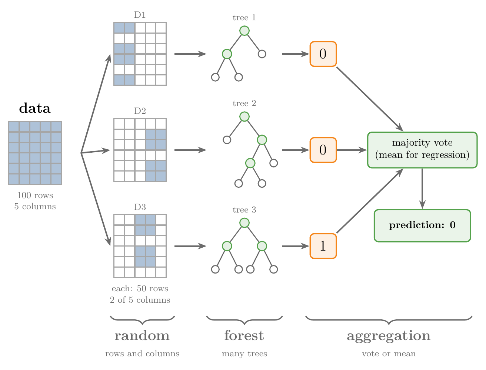

<!-- where-this-fits: generated by course_map/build_map.py; edit concepts.yaml, not this block -->
> **Where this fits:** Pipeline map step 8 (Model). See the [Course map](../../../00-course-map/00-course-map.md).
>
> 
>
> - **Builds on:** [Overfitting](../../../ML/01-foundations/ML-007-challenges-in-ml/ML-007-challenges-in-ml.md#7-overfitting-and-underfitting); [Hyperparameter tuning](../../../ML/01-foundations/ML-009-mldlc/ML-009-mldlc.md#83-model-selection-and-hyperparameter-tuning); [Grid and random search](../../../ML/03-feature-engineering/ML-028-pipelines/ML-028-pipelines.md#9-hyperparameter-tuning-with-a-pipeline); [Decision trees](../../../ML/08-trees-and-ensembles/ML-091-decision-trees-intuition/ML-091-decision-trees-intuition.md#2-a-decision-tree-is-nested-if-else); [Feature importance](../../../ML/08-trees-and-ensembles/ML-093-regression-trees/ML-093-regression-trees.md#75-feature-importance); [Bagging](../../../ML/08-trees-and-ensembles/ML-099-bagging-intuition/ML-099-bagging-intuition.md#3-why-bagging-works).
> - **Leads to:** [Balanced random forest](../../../ML/09-clustering-and-more/ML-127-imbalanced-data/ML-127-imbalanced-data.md#8-ensemble-methods-the-balanced-random-forest).
> - **Compare with:** [Bagging](../../../ML/08-trees-and-ensembles/ML-101-bagging-regressor/ML-101-bagging-regressor.md#4-baggingregressor-on-the-boston-housing-data); [Dropout](../../../DL/02-training/DL-024-dropout/DL-024-dropout.md#4-how-dropout-works).
<!-- /where-this-fits -->

## 1. Overview

> **Key point:** A random forest trains many decision trees, each on its own random sample of the data and with a random choice of features at every split, and combines their answers by majority vote (classification) or mean (regression).

{height=48%}

A **random forest** (G-1611) is **bagging** (G-251; see [the core idea of bagging](../ML-099-bagging-intuition/ML-099-bagging-intuition.md#2-the-core-idea)) with **decision trees** (G-561; see [a decision tree is nested if-else](../ML-091-decision-trees-intuition/ML-091-decision-trees-intuition.md#2-a-decision-tree-is-nested-if-else)) as the **base models** (G-260), the models the ensemble combines. Figure 1 shows the whole idea: random data goes to different trees, each tree predicts, and the forest takes the majority.

This Note covers:

- why random forests are so widely used (section 2);
- where the name comes from (section 3);
- how a random forest is built, used and checked (section 4);
- a small forest of three trees built by hand (section 5).

The next Notes explain:

- why it works so well ([why a forest lowers the variance](../ML-103-random-forest-bias-variance/ML-103-random-forest-bias-variance.md#2-why-a-forest-lowers-the-variance));
- how it differs from plain bagging ([tree-level against node-level feature sampling](../ML-104-bagging-vs-random-forest/ML-104-bagging-vs-random-forest.md#3-difference-2-tree-level-against-node-level-feature-sampling));
- its [hyperparameters](../ML-105-random-forest-hyperparameters/ML-105-random-forest-hyperparameters.md#2-the-three-groups) and their [tuning](../ML-106-random-forest-tuning/ML-106-random-forest-tuning.md#5-tuning-one-setting-by-hand);
- the [OOB score](../ML-107-oob-score/ML-107-oob-score.md#3-how-the-oob-score-is-computed) and [feature importance](../ML-108-feature-importance/ML-108-feature-importance.md#2-what-feature-importance-is-for).

The Notebook (`ML-102-random-forest-intro.ipynb`) runs the forest built by hand.

## 2. Why random forests are so popular

> **Key point:** Strong results on many problems, classification and regression alike, with little tuning.

Three things make the random forest one of the first algorithms to try in a project:

1. **Strong results on many problems.** On many problems a random forest performs about as well as boosting (ESL §15.1), a family of methods (**boosting**, G-318) covered in later Notes. In a comparison of 179 classifiers on 121 datasets, random forests were the best family overall (Fernández-Delgado et al., 2014).
2. **Both problem types.** `RandomForestClassifier` predicts classes and `RandomForestRegressor` predicts numbers.
3. **Little tuning.** Random forests are simpler to train and tune than boosting (ESL §15.1), and the default settings usually give a good result. Little tuning makes the random forest especially friendly for beginners.

## 3. Where the name comes from

> **Key point:** "Forest" because it is a collection of trees; "random" because each tree gets randomly sampled data.

- **Forest:** we train many decision trees together. A group of trees is a forest.
- **Random:** a random forest is a bagging technique, and bagging means **b**ootstrap **agg**regation. Bootstrapping draws a random sample of the data for each tree (see [bootstrapping](../ML-099-bagging-intuition/ML-099-bagging-intuition.md#21-bootstrapping)). That random selection gives the "random".

So a random forest is a special case of bagging: bagging lets the base model be any algorithm, and when that algorithm is a decision tree, we call the result a random forest. There is one more, subtler difference, the subject of [bagging against a random forest](../ML-104-bagging-vs-random-forest/ML-104-bagging-vs-random-forest.md#3-difference-2-tree-level-against-node-level-feature-sampling).

## 4. How a random forest works

> **Key point:** For each tree: draw a bootstrap sample of the observations, then grow a tree that looks at only a few randomly chosen features at every split. To predict, send the new point to every tree and take the vote or the mean.

Here an **observation** is one record (a row of the data table), a **feature** is one input variable (a column), and the **target** is the output we predict.

### 4.1 Building one tree

> **Key point:** Two sources of randomness: which observations the tree sees, and which features each split may use.

Think of a panel of doctors. Each doctor has seen a different set of past patients, and for each question is allowed to look at only a couple of test results picked at random. The doctors end up reasoning in different ways, and their mistakes differ, so the panel's majority is better than any one doctor.

Figure 2 builds one tree this way on 12 patients of the heart disease data (the data of [the heart disease data](../ML-106-random-forest-tuning/ML-106-random-forest-tuning.md#2-the-heart-disease-data)) with 5 features:

1. **Draw a bootstrap sample.** Pick 12 patients at random **with replacement**: the same patient can be picked again. The result is a **bootstrap sample** (G-319), as large as the data. In Figure 2, patient 1 is drawn three times, and patients 2, 5, 6, 9 and 12 are never drawn.
2. **Grow a tree, with a random choice of features at every split.** At the first split the tree does not compare all 5 features. Two are drawn at random, pressure and cholesterol, and the better of the two (cholesterol) makes the split. At the next split two features are drawn again, and so on until every leaf is pure (holds observations of one class only).
3. **Repeat** steps 1 and 2 for every tree, usually a hundred or more.


Watch the feature row at the top of Figure 2: the two orange candidates change from split to split.

Drawing the features again at every split is **node-level column sampling** (G-1325). The number of features drawn is the setting `max_features` (G-1185). scikit-learn's default for classification is the square root of the number of features. With 5 features:

$$\sqrt{5} = 2.2$$

Rounded down, this is **2**, as in Figure 2.

Because every tree sees different observations and different features at each split, every tree learns a different structure. The variety of the trees is what makes the forest better than a single tree (see [why a forest lowers the variance](../ML-103-random-forest-bias-variance/ML-103-random-forest-bias-variance.md#2-why-a-forest-lowers-the-variance)).

### 4.2 Using the forest

> **Key point:** Every tree predicts; the forest returns the majority vote or the mean.

A new **query point** (G-1605), the observation we want a prediction for, goes to every tree. The combining step is **aggregation** (G-183): the forest returns the **majority vote** (G-1146) for classification or the mean for regression, as every ensemble does (see [how an ensemble predicts](../ML-095-ensemble-learning/ML-095-ensemble-learning.md#3-how-an-ensemble-predicts)). For example, if 57 of 100 trees say 1 and 43 say 0, the forest predicts 1.

Figure 3 builds a forest of 100 trees on the student placement data of [the toy project](../../01-foundations/ML-012-toy-project/ML-012-toy-project.md#3-loading-and-cleaning-the-data) (two features, CGPA and IQ, 100 students). On the left, each new tree's bootstrap sample: bigger dots were drawn more than once, grey crosses were left out (about a third). The **decision boundary** (G-555) is the line where the predicted class switches from "not placed" to "placed". Watch each single tree put narrow strips of the wrong class around a few points, while the forest's vote map on the right settles into one clean decision boundary near CGPA 6; after about 20 trees, adding more changes it very little.


### 4.3 Checking the forest

> **Key point:** The observations a tree never drew can test that tree, so a forest can be checked without a separate test set.

Each tree leaves out about a third of the observations (the patients marked "out" in Figure 2). The left-out observations of a tree are its **out-of-bag** observations. Each observation is predicted by only the trees that never saw it, and the share predicted correctly is the **out-of-bag score** (G-1411): [how the OOB score is computed](../ML-107-oob-score/ML-107-oob-score.md#3-how-the-oob-score-is-computed) explains it in full.

## 5. A random forest by hand

> **Key point:** Three trees, each trained on its own random subset of a dataset of 100 observations, vote on one query point; with row, column or combined sampling, the majority gets it right even when one tree is wrong.

To see every step, we build a forest of three trees ourselves (Figure 1). Our forest is a simplified version: it has only three trees, and it picks each tree's features **once per tree** instead of at every split (section 5.4).

Each tree gets its own random subset of the data, made in one of three ways:

- **row sampling** (G-1712): random observations, all features;
- **column sampling**, also called **feature sampling** (G-413): all observations, random features;
- **combined sampling** (G-418): random observations and random features.

These three ways are the bagging, random subspaces and random patches types of [bagging](../ML-099-bagging-intuition/ML-099-bagging-intuition.md#6-types-of-bagging).

### 5.1 The data and the sampling functions

> **Key point:** 100 observations, 5 features, two classes; three small functions draw the subsets.

We make a classification dataset of 100 observations with `make_classification` (see [the data of the perceptron code](../../07-classification/ML-070-perceptron-code/ML-070-perceptron-code.md#2-the-data)): 5 features, in columns `col1` to `col5`, and a target in the column `target`, with classes 0 and 1.

> **Python:** The three ways of sampling.
>
> ```python
> def sample_rows(df, share):
>     n = int(share * len(df))
>     return df.sample(n, replace=True)
>
> def sample_features(df, share):
>     # do not count the target column
>     n = int(share * (df.shape[1] - 1))
>     cols = list(rng.choice(df.columns[:-1], n,
>                            replace=False))
>     return df[cols + ["target"]]
>
> def combined_sampling(df, row_share, col_share):
>     rows = sample_rows(df, row_share)
>     return sample_features(rows, col_share)
> ```
>
> `df.sample(n, replace=True)` draws `n` rows with replacement (see [bootstrapping: three samples, three trees](../ML-099-bagging-intuition/ML-099-bagging-intuition.md#52-bootstrapping-three-samples-three-trees)). `rng.choice(columns, n, replace=False)` picks `n` different column names at random; `rng` is NumPy's random generator, `np.random.default_rng(4)`, seeded so every run draws the same subsets. The target column is added back, because every tree needs it to learn.

Each tree is a fully grown `DecisionTreeClassifier`, trained on its subset's features. The query point is observation 7 of the data, whose true class is **0**. Observation 7 is also one of the 100 training observations, so any tree whose subset contains it has already seen its answer. This small forest therefore shows how the vote works, not how well a forest predicts new data; section 5.4 repeats the test with observation 7 held out.

### 5.2 Row sampling

> **Key point:** 20 observations per tree, with replacement: the votes are 1, 0, 0, so the forest says 0.

With `sample_rows(df, 0.2)`, each tree gets 20 observations (20% of 100), drawn with replacement:

| Tree | Observations | Repeated | Depth | Vote |
|---|---|---|---|---|
| 1 | 20 | 2 | 2 | 1 |
| 2 | 20 | 1 | 2 | 0 |
| 3 | 20 | 1 | 2 | 0 |

Tree 1 is wrong, but two trees say 0, so the majority, **0**, is right. Each tree saw different observations, so each placed its decision boundaries in different places (Figure 4, top row).

### 5.3 Column sampling and combined sampling

> **Key point:** 4 of 5 features per tree: all three trees say 0. Half the observations and 2 of 5 features: the votes are 0, 0, 1, so the forest still says 0.

With `sample_features(df, 0.8)` (Figure 4, middle row), each tree gets all 100 observations and 4 of the 5 features (80% of 5). The three trees got different feature sets: (col5, col4, col3, col2), (col5, col2, col1, col3) and (col1, col3, col2, col5). With all the observations, the trees grow deeper (depths 6, 3 and 3), and all three vote **0**.

With `combined_sampling(df, 0.5, 0.5)` (Figure 4, bottom row), each tree gets 50 observations (10 to 14 of them repeats) and 2 of the 5 features (half of 5 is 2.5, and `int` rounds down to 2). Figure 1 shows this setting:

| Tree | Features | Depth | Vote |
|---|---|---|---|
| 1 | col2, col1 | 4 | 0 |
| 2 | col5, col4 | 5 | 0 |
| 3 | col4, col3 | 6 | 1 |

Combined sampling adds the most randomness: the trees differ in both observations and features. The majority is again **0**, the right answer.

{height=40%}

Figure 4 puts the three settings side by side. Watch the black-framed boxes: one tree is wrong in two of the settings, and the majority on the right is still the true class 0 every time.

> **Python:** Asking one tree about the query point.
>
> ```python
> inputs = d.columns[:-1]   # this tree's input columns
> tree = DecisionTreeClassifier().fit(d[inputs], d["target"])
> tree.predict(query[inputs])
> ```
>
> A tree trained on 2 features must be given exactly those 2 columns when it predicts. Selecting `query[inputs]` passes the same columns in the same order.

### 5.4 What a real random forest does differently

> **Key point:** scikit-learn's `RandomForestClassifier` does all this in one line, with 100 trees by default, and samples the features afresh at every split.

> **Python:** A random forest in scikit-learn.
>
> ```python
> from sklearn.ensemble import RandomForestClassifier
>
> rf = RandomForestClassifier(random_state=42)
> rf.fit(df.iloc[:, :5], df["target"])
> rf.predict(query.iloc[:, :5])     # array([0])
> ```

The forest of 100 trees also predicts **0**.

{height=28%}

Figure 5 counts the votes: 96 trees say 0 and 4 say 1. With 100 voters, a few wrong trees barely dent the majority.

These trees were trained on all 100 observations, the query included. Trained on the other 99 only, so that observation 7 is new to every tree, the answer is still **0**: all nine hand-built trees say 0, and 89 of the 100 scikit-learn trees say 0 and 11 say 1 (Notebook, section 8).

Two things differ from our hand-built version:

- **More trees.** Three trees are only enough to show the idea; the default is 100.
- **Feature sampling at every split.** Our functions picked the features once per tree. A random forest picks a fresh random set of features at every node of every tree (section 4.1; Breiman, 2001, section 4), which makes the trees even less alike (ESL §15.2). Sampling at every split is the main difference between bagging and a random forest, explained in [bagging against a random forest](../ML-104-bagging-vs-random-forest/ML-104-bagging-vs-random-forest.md#3-difference-2-tree-level-against-node-level-feature-sampling).

## 6. Summary

| Step | What happens | In our example |
|---|---|---|
| Bootstrapping | each tree gets a bootstrap sample of the observations | by hand: 3 trees; 20 observations, or 4 features, or 50 observations and 2 features each |
| Training | each tree is fully grown, with a few random features to choose from at every split | trees of depth 2 to 6, all different |
| Aggregation | majority vote (classes) or mean (numbers) | votes 1, 0, 0 and 0, 0, 1: prediction 0 |

- A random forest is bagging with decision trees as the base models, so everything about bagging (vote or mean, out-of-bag observations) carries over.
- "Forest": many trees. "Random": each tree gets randomly sampled data.
- Each tree is built from a bootstrap sample, and each split chooses among a few randomly drawn features (`max_features`, by default the square root of the number of features), so every tree learns a different structure; this variety is what makes the forest better than a single tree.
- With many trees voting, a few wrong trees barely dent the majority (96 of 100 trees said 0 on the query point), so the forest stays right even when single trees are wrong.
- The observations a tree never drew are its out-of-bag observations; they give a free check of the forest, because that tree has never seen them, so no separate test set is needed.
- A random forest works for classification and regression, and gives strong results with little tuning (ESL §15.1), which is why it is one of the first algorithms to try in a project.

## 7. Sources

**Built from**

- CampusX, "Introduction to Random Forest | Intuition behind the Algorithm", YouTube, https://www.youtube.com/watch?v=F9uESCHGjhA
- StatQuest with Josh Starmer, "StatQuest: Random Forests Part 1 - Building, Using and Evaluating", YouTube, https://www.youtube.com/watch?v=J4Wdy0Wc_xQ (the two building steps and Figures 2 and 3)

**Other references**

- Breiman, L. (2001). "Random Forests". *Machine Learning* 45(1), 5–32.
- Fernández-Delgado, M., Cernadas, E., Barro, S. and Amorim, D. (2014). "Do we Need Hundreds of Classifiers to Solve Real World Classification Problems?" *Journal of Machine Learning Research* 15, 3133–3181.
- Hastie, T., Tibshirani, R. and Friedman, J. (2009). *The Elements of Statistical Learning* (ESL), 2nd ed. Springer, sections 15.1 and 15.2.

## 8. Key terms

| Term | Meaning |
|---|---|
| Random forest | Bagging with decision trees as the base models; the trees vote (classification) or are averaged (regression) |
| Observation | One record of the data: one row of the data table |
| Feature | An input variable: one column of the data table |
| Target | The output we predict |
| Row sampling | Giving each base model a random subset of the observations |
| Column sampling (feature sampling) | Giving each base model a random subset of the features |
| Combined sampling | Giving each base model random observations and random features together |
| RandomForestClassifier | scikit-learn's random forest for classification |
| RandomForestRegressor | scikit-learn's random forest for regression |
