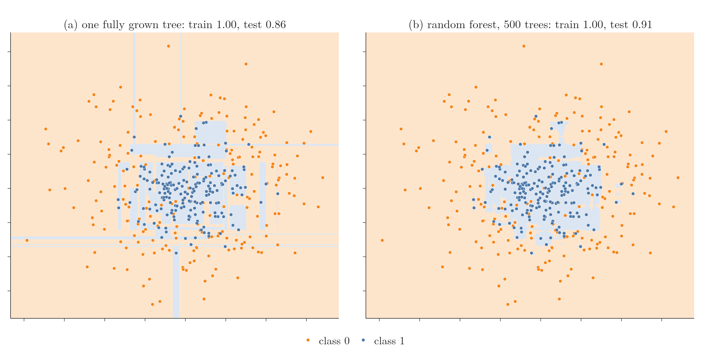
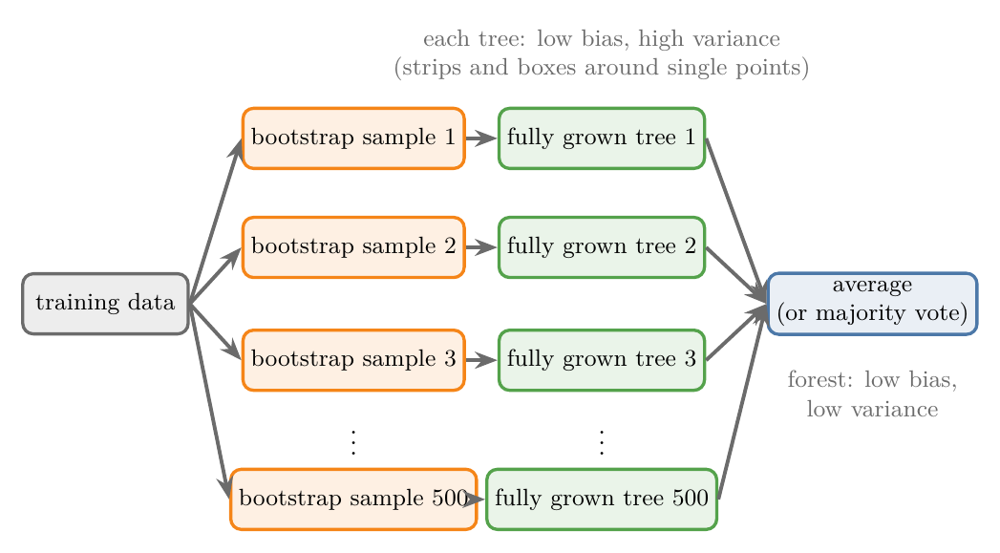

<!-- where-this-fits: generated by course_map/build_map.py; edit concepts.yaml, not this block -->
> **Where this fits:** Pipeline map steps 8 (Model), 9 (Evaluate). See the [Course map](../../../00-course-map/00-course-map.md).
>
> 
>
> - **Builds on:** [Overfitting](../../../ML/01-foundations/ML-007-challenges-in-ml/ML-007-challenges-in-ml.md#7-overfitting-and-underfitting); [Underfitting](../../../ML/01-foundations/ML-007-challenges-in-ml/ML-007-challenges-in-ml.md#7-overfitting-and-underfitting); [Hyperparameter tuning](../../../ML/01-foundations/ML-009-mldlc/ML-009-mldlc.md#83-model-selection-and-hyperparameter-tuning); [Grid and random search](../../../ML/03-feature-engineering/ML-028-pipelines/ML-028-pipelines.md#9-hyperparameter-tuning-with-a-pipeline); [Polynomial regression](../../../ML/06-regression/ML-060-polynomial-regression/ML-060-polynomial-regression.md#1-overview); [Decision trees](../../../ML/08-trees-and-ensembles/ML-091-decision-trees-intuition/ML-091-decision-trees-intuition.md#2-a-decision-tree-is-nested-if-else).
> - **Leads to:** [Boosting](../../../ML/08-trees-and-ensembles/ML-113-bagging-vs-boosting/ML-113-bagging-vs-boosting.md#21-boosting-high-bias-low-variance-models); [Balanced random forest](../../../ML/09-clustering-and-more/ML-127-imbalanced-data/ML-127-imbalanced-data.md#8-ensemble-methods-the-balanced-random-forest).
> - **Compare with:** [K-nearest neighbours](../../../ML/07-classification/ML-085-knn/ML-085-knn.md#1-overview); [Bagging](../../../ML/08-trees-and-ensembles/ML-101-bagging-regressor/ML-101-bagging-regressor.md#4-baggingregressor-on-the-boston-housing-data); [Dropout](../../../DL/02-training/DL-024-dropout/DL-024-dropout.md#4-how-dropout-works).
<!-- /where-this-fits -->

## 1. Overview

> **Key point:** A **random forest** (G-1611) takes fully grown trees, which have low bias and high variance, and averages away most of the variance. The result has low bias and low variance, the combination single models rarely reach.

{height=45%}

Figure 1 shows the whole story. One fully grown tree (a) carves out thin strips and small boxes for single points: it overfits. A forest of 500 such trees (b) keeps the shape of the data, a blue disc inside an orange ring, and drops most of the strips. Its test accuracy rises from 0.86 to 0.91.

This Note explains why, using the **bias-variance trade-off** (G-288), and shows the same effect on a regression problem. The Notebook (`ML-103-random-forest-bias-variance.ipynb`) computes every number; `images/figs.py` draws the figures.

## 2. Why a forest lowers the variance

> **Key point:** A random forest is bagging with fully grown trees: each tree keeps the bias low, and averaging many of them removes most of the variance.

Two words carry this Note (both explained in [bias and variance](../../06-regression/ML-061-bias-variance/ML-061-bias-variance.md#2-bias)):

- **Bias** (G-287): the error of a model that is too simple to follow the true pattern, such as a straight line through curved data. The model is wrong even on its own training data.
- **Variance** (G-2074): how much the fitted model changes when the training data changes. A model that hugs every training point fits them perfectly, then fits new data badly.

We want both low, but a single model usually trades one for the other. **Bagging** (G-251) escapes this by averaging low-bias, high-variance models (G-1132), each trained on its own random sample, a **bootstrap sample** (G-319), so a change in the data is spread across many models (see [how bagging lowers variance](../ML-099-bagging-intuition/ML-099-bagging-intuition.md#32-how-bagging-lowers-variance)). Think of many people guessing the number of sweets in a jar: each guess is off, some high and some low, but the average of the guesses lands close to the truth.

A random forest applies this to **fully grown** **decision trees** (G-561; no `max_depth`). Each tree fits its training data almost perfectly, so the forest starts with low bias; averaging hundreds of them keeps the bias low and cuts the variance. Figure 2 shows the recipe. The next two sections measure the effect. Averaging helps most when the trees differ from one another; the random choice of features at each split, which makes them differ more, is the subject of [node-level feature sampling](../ML-104-bagging-vs-random-forest/ML-104-bagging-vs-random-forest.md#3-difference-2-tree-level-against-node-level-feature-sampling).

{width=90%}

## 3. Seeing it in classification

> **Key point:** On noisy concentric circles, one tree scores 0.86 on the test set and a forest of 500 trees 0.91.

The data is made with `make_circles` (see [the data: two circles](../../07-classification/ML-090-kernel-trick-code/ML-090-kernel-trick-code.md#2-the-data-two-circles)): 500 **observations** (G-1374; records, one row of the data table each), 2 **features** (G-772; input variables, one column each) and a **target** (G-1949; the output we predict) with two classes. The blue class (1) sits in a small disc inside the orange class (0), with plenty of noise, so the classes overlap. We train on 400 points and test on 100.

**One fully grown tree** (Figure 1a). Its surface has long thin strips and isolated boxes. Each exists because of a single point: a lone blue point among orange ones gets its own blue strip, although the region around it clearly belongs to orange.

- Training accuracy: **1.00**, every training point is classified correctly: low bias.
- Test accuracy: **0.86**. A new sample from the same pattern would produce different strips in different places: high variance. This is **overfitting** (G-1429): the model fits the quirks of its training sample, not the pattern.

**A random forest of 500 trees** (Figure 1b). Most strips and boxes are gone. The surface captures the true nature of the data: a blue region inside an orange one.

- Training accuracy: still **1.00**.
- Test accuracy: **0.91**: the variance has dropped.

Variance means how much a model changes when the training data changes, so Figure 3 changes the data. It draws the circles eight times with the same recipe (draw 1 is the data of Figure 1) and trains both models on each draw. Watch the left panel: the tree's strips and boxes jump to new places with every draw. The forest's disc barely moves. The last frame overlays all eight surfaces: white marks the places where the draws disagree. Two draws of the tree disagree on 11% of the plane; two draws of the forest on 5%. Averaged over the eight draws, test accuracy is 0.80 for the tree and 0.83 for the forest.

{height=55%}

> **Python:** The two models.
>
> ```python
> from sklearn.ensemble import RandomForestClassifier
> from sklearn.tree import DecisionTreeClassifier
>
> tree = DecisionTreeClassifier(random_state=42)
> tree.fit(X_train, y_train)
> rf = RandomForestClassifier(n_estimators=500,
>                             random_state=42, n_jobs=-1)
> rf.fit(X_train, y_train)
> rf.score(X_test, y_test)      # 0.91
> ```
>
> `n_estimators` is the number of trees and `n_jobs=-1` trains them on every CPU core (both from [BaggingClassifier in code](../ML-100-bagging-classifier/ML-100-bagging-classifier.md#3-baggingclassifier-in-code)). The surfaces are drawn on a grid of points, as in [decision surfaces](../../07-classification/ML-085-knn/ML-085-knn.md#5-decision-surfaces).

> **Extra:** One might expect the forest to give up a little training accuracy in exchange for the lower variance. Here it does not. Each tree's bootstrap sample holds about 63% of the training observations (ESL §7.11), and a fully grown tree gets every observation it saw right. So for any training observation, the trees that saw it are a majority, and they outvote the rest.
>
> The Notebook checks this: every training observation was seen by at least 57% of the 500 trees, and those trees were always right on it. Raising the noise of `make_circles` up to 1.0 leaves the forest's training accuracy at 1.00.

## 4. Seeing it in regression

> **Key point:** On a noisy curve, one tree chases every point (test MSE 0.0192); a forest of 1,000 trees stays closer to the true pattern (test MSE 0.0140), exactly like bagging, since one feature leaves no features to sample.

{height=36%}

The data is the two-bumps curve of [seeing it on a curve](../ML-101-bagging-regressor/ML-101-bagging-regressor.md#3-seeing-it-on-a-curve), which compares one tree with bagging. Here we add the random forest. We train on 150 points and test on 1,000; the dashed curve in Figure 4 is the true pattern.

- **(a) One fully grown tree** (red) passes through every training point: training error 0, test **mean squared error (MSE)** (G-1201; the average squared gap between prediction and truth, see [mean squared error](../../06-regression/ML-051-regression-metrics/ML-051-regression-metrics.md#3-mean-squared-error-mse)) **0.0192**.
- **(b) Bagging with 1,000 fully grown trees** (green) no longer reaches every outlier and stays closer to the dashed curve: test MSE **0.0140**.
- **(c) A random forest of 1,000 trees** (blue) draws almost the same curve, with the same test MSE. Its training MSE rises a little, from 0 to 0.0018, because each training point was missed by about a third of the trees (the Extra in section 3), and an average, unlike a majority vote, lets their slightly different values pull the prediction off the point; meanwhile its test MSE falls about 27% below the single tree's.

Panels (b) and (c) match because the data has a single feature. A random forest differs from bagging only in sampling features at each split (see [node-level feature sampling](../ML-104-bagging-vs-random-forest/ML-104-bagging-vs-random-forest.md#3-difference-2-tree-level-against-node-level-feature-sampling)); with one feature there is nothing to sample, and `RandomForestRegressor` uses every feature at every split by default anyway. The forest's extra gain shows only on data with many features.

## 5. Summary

| | One fully grown tree | Random forest |
|---|---|---|
| Bias | low | low |
| Variance | high | low |
| Circles: train / test accuracy | 1.00 / 0.86 | 1.00 / 0.91 |
| Curve: train / test MSE | 0.0000 / 0.0192 | 0.0018 / 0.0140 |

- We want low bias and low variance, but single models usually trade one for the other, so a model that escapes the trade-off is worth having.
- Fully grown trees are low bias, high variance: they overfit, because they fit every training point (training accuracy 1.00) and draw strips around single noisy points that move with every new sample.
- A random forest averages many such trees, each trained on a different random sample, so noisy observations are spread out and their effect averages away.
- The result keeps the low bias and cuts the variance: smoother boundaries and curves, better scores on new data. This is why a random forest performs so well: each tree keeps the bias low, and the average removes most of the variance.

## 6. Sources

**Built from**

- CampusX, "How Random Forest Performs So Well? Bias Variance Trade-Off in Random Forest", YouTube, https://www.youtube.com/watch?v=jHgG4gjuFAk

**Other references**

- Hastie, T., Tibshirani, R. and Friedman, J. (2009). *The Elements of Statistical Learning*, 2nd ed. Springer. §7.11 (the bootstrap holds about 63.2% of distinct observations).

## 7. Key terms

No new terms. Bias and variance are defined in [bias and variance](../../06-regression/ML-061-bias-variance/ML-061-bias-variance.md#5-the-trade-off); low-bias, high-variance base models in [the bias-variance problem](../ML-099-bagging-intuition/ML-099-bagging-intuition.md#31-the-bias-variance-problem).
