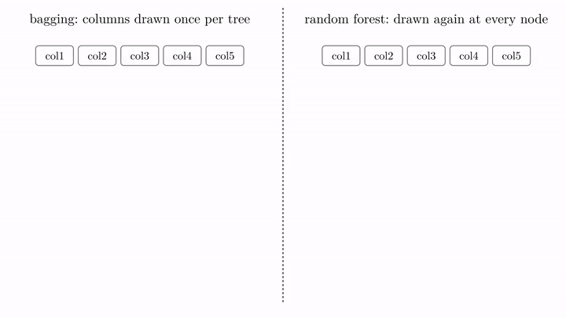
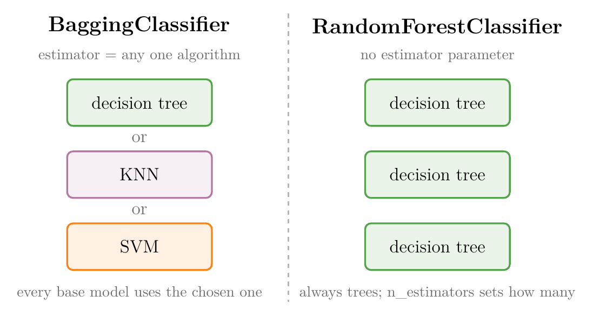
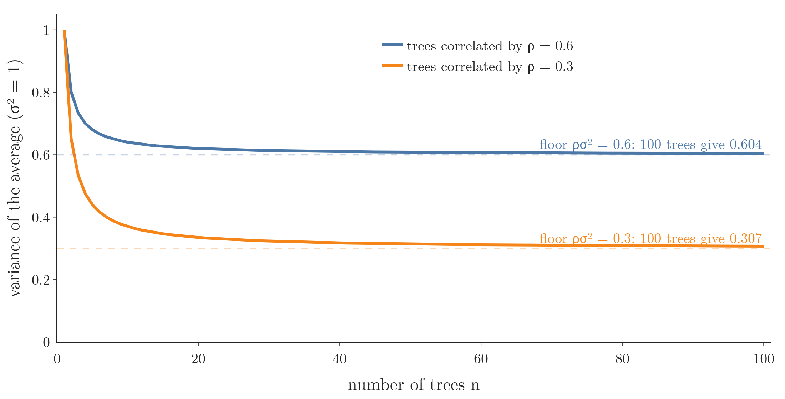
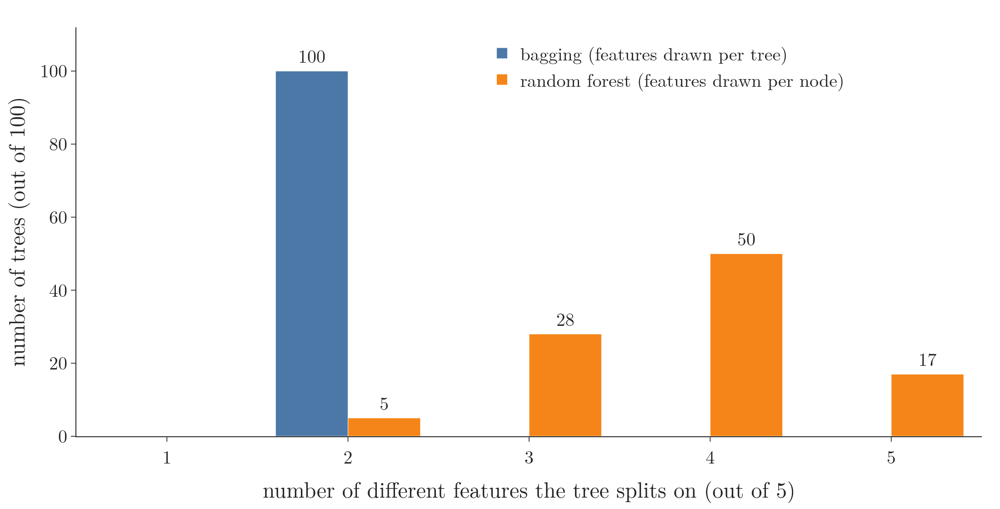

<!-- where-this-fits: generated by course_map/build_map.py; edit concepts.yaml, not this block -->
> **Where this fits:** Pipeline map step 8 (Model). See the [Course map](../../../00-course-map/00-course-map.md).
>
> 
>
> - **Builds on:** [Random forest](../../../ML/08-trees-and-ensembles/ML-102-random-forest-intro/ML-102-random-forest-intro.md#4-how-a-random-forest-works).
> - **Compare with:** [Bagging](../../../ML/08-trees-and-ensembles/ML-099-bagging-intuition/ML-099-bagging-intuition.md#2-the-core-idea); [Dropout](../../../DL/02-training/DL-024-dropout/DL-024-dropout.md#4-how-dropout-works).
<!-- /where-this-fits -->

## 1. Overview

> **Key point:** Two differences: bagging can use any **base model** (G-260) while a random forest always uses decision trees; and bagging samples features once per tree while a random forest samples them again at every node.



A **random forest** (G-1611) is built on **bagging** (G-251; training many models on random samples and combining their votes, see [how a random forest works](../ML-102-random-forest-intro/ML-102-random-forest-intro.md#4-how-a-random-forest-works)), but the two are not the same, even when bagging uses decision trees. Figure 1 shows the subtle difference: **where** the **features** (input variables, one column of the data table each) are sampled. Each **observation** (one record, one row of the table) has a value for every feature and a **target**, the class we predict.

This Note covers both differences and checks the second one in code. The Notebook (`ML-104-bagging-vs-random-forest.ipynb`) runs every check.

## 2. Difference 1: the base model

> **Key point:** Bagging is a general technique for any algorithm; a random forest is made of decision trees only.

In bagging, the base models can come from any algorithm, as long as they all use the same one: all decision trees, all KNN or all SVMs (see [other base models](../ML-100-bagging-classifier/ML-100-bagging-classifier.md#22-other-base-models)). Decision trees, KNN and SVMs are the usual choices.

{height=30%}

Figure 2 sets the two classes side by side. Watch the left column: bagging offers a choice of base model, while the forest's column holds only trees.

In a random forest, the base model is always a decision tree. scikit-learn's classes show this directly:

- `BaggingClassifier` has an `estimator` parameter for choosing the base model; when it is left at `None`, it uses a decision tree.
- `RandomForestClassifier` has `n_estimators`, the number of trees, but **no** parameter for choosing the base model.

> **Extra:** Older documentation and code call this parameter `base_estimator`. It was renamed `estimator` and the old name was removed in scikit-learn 1.4 (see [BaggingClassifier: bagging](../ML-100-bagging-classifier/ML-100-bagging-classifier.md#32-bagging)).

## 3. Difference 2: tree-level against node-level feature sampling

> **Key point:** Bagging fixes each tree's features before the tree is grown; a random forest picks a fresh random set of features before every split.

So is a bagging ensemble of decision trees a random forest? **No.** The remaining difference is in how the features are sampled (feature sampling, see [how a random forest works](../ML-102-random-forest-intro/ML-102-random-forest-intro.md#4-how-a-random-forest-works)).

Take a dataset with 5 features, and suppose each tree may use 2 of them (`max_features=2` (G-1185) in both classes).

### 3.1 Bagging: tree-level sampling

> **Key point:** Two features are drawn once; every split in that tree uses one of those two.

Before tree 1 is grown, 2 of the 5 features are drawn at random, say col1 and col3. Tree 1 is then trained on those two features only, and every split in it is on col1 or col3 (Figure 1, left). Tree 2 gets its own pair, say col4 and col5; tree 3 col1 and col4; and so on.

Bagging therefore uses **tree-level feature sampling** (tree-level column sampling, G-2014): the features are decided once, before the tree is built, and no other feature is ever touched by that tree.

### 3.2 Random forest: node-level sampling

> **Key point:** Two features are drawn at every node, so one tree can end up using all five.

In a random forest, the draw happens again **every time a node is about to split** (Figure 1, right). The forest therefore uses **node-level feature sampling** (node-level column sampling, G-1325):

- the root draws col2 and col3, and splits on the better of the two, col3;
- the next node draws again, col4 and col5, and splits on col4;
- the next draws col2 and col1, and splits on col1.

Building a forest tree this way is shown step by step in [building one tree](../ML-102-random-forest-intro/ML-102-random-forest-intro.md#41-building-one-tree). Node-level sampling is exactly the `max_features` setting of a single decision tree (see [max_features](../ML-092-decision-tree-hyperparameters/ML-092-decision-tree-hyperparameters.md#46-max_features)), applied in every tree of the forest. Node-level sampling adds more randomness than tree-level sampling.

### 3.3 Why more randomness helps

> **Key point:** More randomness makes the trees more different from each other, and an ensemble of different models performs better, as long as each tree stays accurate on its own (section 4.3 shows randomness that weakens every tree doing harm).

Recall [more models, and correlated models](../ML-096-voting-ensemble/ML-096-voting-ensemble.md#52-more-models-and-correlated-models): an ensemble works best when its base models are each better than chance and as different from each other as possible. How alike two models' predictions are is measured by the **correlation between base models** (G-488): 0 means unrelated, 1 means identical. The chain from sampling to accuracy:

1. Node-level sampling forces each split to choose among a random few features, so even trees grown on similar observations end up splitting on different features.
2. Trees that split differently make their mistakes on different observations, so their correlation is lower (ESL §15.2).
3. When the trees vote or are averaged, mistakes made by only some trees are outvoted, so a lower correlation leaves a smaller error.

The Extra below gives the formula, and Figure 3 plots it.

ESL Figure 15.1 shows this gain on spam email data, and section 4.3 repeats the comparison on the same data.

> **Extra:** Why does difference between the trees matter so much? Suppose each tree's prediction has **variance** (G-2074) $\sigma^2$, its spread around its average and any two trees are correlated by $\rho$ (0: unrelated, 1: identical).
>
> 1. **In words:** the variance of the average of $n$ trees has a part that more trees can remove and a part, set by the correlation, that they cannot.
> 2. **Formula:**
> $$\text{variance of the average} = \rho\thinspace\sigma^2 + \frac{1 - \rho}{n}\thinspace\sigma^2$$
> 3. **Example:** with $\sigma^2 = 1$ and $n = 100$ trees. For $\rho = 0.6$:
> $$0.6 + 0.4/100 = 0.604$$
> For $\rho = 0.3$:
> $$0.3 + 0.7/100 = 0.307$$
>
> {height=32%}
>
> Figure 3 plots the formula. Watch both curves flatten: by 20 trees each is within 0.04 of its dashed floor, so more trees stop helping, and only a lower $\rho$ moves the floor down.
>
> Adding trees only shrinks the second term. The first term stays, however many trees we add, unless the trees become less alike. Lowering $\rho$ is exactly what node-level sampling does. (ESL §15.2, eq. 15.1)

## 4. Checking it in code

> **Key point:** Every bagged tree splits on exactly 2 features; the forest's trees split on 2 to 5 features, most often 4.

We use a dataset of 100 observations and 5 features, col1 to col5, made with `make_classification`, and give both classes `max_features=2`.

### 4.1 The bagged trees

> **Key point:** The first bagged tree only ever splits on col5 and col1, the two features it was given.

> **Python:** Bagging with 2 features per tree, and the features each tree got.
>
> ```python
> from sklearn.ensemble import BaggingClassifier
>
> bag = BaggingClassifier(max_features=2, random_state=42)
> bag.fit(df.iloc[:, :5], df["target"])
> bag.estimators_features_[0]      # array([4, 0])
> ```
>
> `bag.estimators_[0]` is the first trained tree. `estimators_features_` (G-710) `[0]` lists the features it was given (see [which observations and features each tree got](../ML-100-bagging-classifier/ML-100-bagging-classifier.md#33-which-observations-and-features-each-tree-got)): positions 4 and 0, that is col5 and col1.

When we print the first tree, its splits use only `feature_0` and `feature_1`, the only two columns it has (the top lines may show just one of them). Careful: these are **not** col1 and col2. The tree was trained on a 2-column table, so it numbers those two features 0 and 1 itself; `estimators_features_` maps them back to col5 and col1.

> **Python:** Printing a tree with the real feature names.
>
> ```python
> from sklearn.tree import export_text
>
> cols = bag.estimators_features_[0]
> print(export_text(bag.estimators_[0],
>       feature_names=list(df.columns[cols])))
> ```
>
> `export_text` (G-737) prints a tree as indented text, one line per split. `feature_names` replaces `feature_0`, `feature_1`, ... with names.

All 10 bagged trees use exactly 2 features: (col1, col5), (col1, col3), (col3, col5), and so on.

### 4.2 The forest's trees

> **Key point:** The first forest tree splits on col3, col5, col1 and col2: four different features with `max_features=2`.

The first tree of `RandomForestClassifier(max_features=2)` splits first on col3, then on col5, col1 and col2. Every tree of a forest is trained on all the features, so its feature numbers are the real ones.

{height=30%}

Figure 4 counts, for 100 trees of each kind, how many different features each tree splits on:

- **bagging:** all 100 trees use exactly 2 features;
- **random forest:** 5 trees use 2 features, 28 use 3, 50 use 4, and 17 use all 5.

The counts prove the point: bagging samples features at the tree level, a random forest at the node level.

### 4.3 Does it pay off?

> **Key point:** On real spam data, the random forest scores 0.953, bagging 0.946 with all features and 0.922 with 7 features per tree.

We use the Spambase data (UCI, via OpenML): 4,601 emails, 57 features such as how often words like "free" or "$" appear, and a target of spam or not. ESL §15.2 compares bagging and random forests on the same data. Each model has 200 trees, scored with 5-fold **cross-validation** (G-510; the data is split into 5 parts, each used once as the test part, see [cross-validation with a pipeline](../../03-feature-engineering/ML-028-pipelines/ML-028-pipelines.md#8-cross-validation-with-a-pipeline)) repeated 3 times:

| Model | Features | Accuracy |
|---|---|---|
| Bagging | all 57 per tree | 0.946 |
| Bagging | 7 per tree (tree level) | 0.922 |
| Random forest | 7 per node ($\sqrt{57} \approx 7$, the default) | **0.953** |

The random forest makes about 13% fewer mistakes than bagging (4.7% against 5.4% of emails wrong), the same ranking ESL Figure 15.1 shows on this data. Tree-level sampling is the worst of the three: each tree is stuck with 7 random features for its whole life and often misses the most useful words.

> **Extra:** A bagging ensemble of trees that each sample features at every node, `BaggingClassifier(DecisionTreeClassifier(max_features="sqrt"))`, scores 0.953 too. So with node-level sampling, bagged trees **are** a random forest, which is how scikit-learn defines one (scikit-learn User Guide §1.11).

## 5. Summary

| | Bagging | Random forest |
|---|---|---|
| Base model | any algorithm (`estimator`) | decision trees only |
| Feature sampling | once per tree (tree level) | at every node (node level) |
| Features one tree can use, with `max_features=2` of 5 | exactly 2 | up to all 5 |
| Randomness | less | more |
| On the spam data (accuracy) | 0.946 (all features) | 0.953 |

- A bagging ensemble of decision trees is still not a random forest, because the two sample features in different places.
- Bagging decides each tree's features before it is grown; a random forest re-draws them before every split, so one forest tree can end up using all 5 features while a bagged tree uses exactly 2.
- More randomness at each node makes the trees less alike while each tree can still reach every feature, which makes the forest better (spam data: 0.953 against 0.946), because less alike trees make mistakes on different observations, and adding trees cannot remove the error that alike trees share. Fixing 7 random features per tree weakens every tree and scores worse (0.922), because each tree often misses the most useful words.
- In a bagged tree, `feature_0`, `feature_1`, ... are positions within that tree's own features, because the tree was trained on a smaller table; `estimators_features_` maps them back, so read it before naming a split.

## 6. Sources

**Built from**

- CampusX, "Bagging Vs Random Forest | What is the difference between Bagging and Random Forest | Very Important", YouTube, https://www.youtube.com/watch?v=l93jRojZMqU
- StatQuest with Josh Starmer, "StatQuest: Random Forests Part 1 - Building, Using and Evaluating", YouTube, https://www.youtube.com/watch?v=J4Wdy0Wc_xQ (a random subset of features at every split, section 3.2)

**Other references**

- Hastie, T., Tibshirani, R. and Friedman, J. (2009). *The Elements of Statistical Learning*, 2nd ed. Springer. §15.2 (eq. 15.1, variance of an average of correlated trees; Figure 15.1, bagging against random forest on the spam data).
- Hopkins, M., Reeber, E., Forman, G. and Suermondt, J. (1999). Spambase \[dataset\]. UCI Machine Learning Repository. archive.ics.uci.edu/dataset/94/spambase
- scikit-learn developers. User Guide, §1.11 "Ensembles", Random forests. scikit-learn.org/stable/modules/ensemble.html

## 7. Key terms

Terms taught in this Note come first; linked terms are recaps, taught in the Note the link opens.

| Term | Meaning |
|---|---|
| Tree-level feature sampling (tree-level column sampling) (G-2014) | Drawing one random set of features per tree, before the tree is grown; every split of that tree uses only those features (bagging). |
| Node-level feature sampling (node-level column sampling) (G-1325) | Drawing a new random set of features before every split (random forest). |
| Correlation between base models (G-488) | How alike two base models' predictions are; the less alike, the more an ensemble cuts variance. |
| export_text (G-737) | scikit-learn function that prints a trained tree as indented text. |
| [Base model](../../../ML/08-trees-and-ensembles/ML-095-ensemble-learning/ML-095-ensemble-learning.md#3-how-an-ensemble-predicts) (G-260) | One of the models inside an ensemble; the ensemble combines the base models' answers into its prediction. |
| [Random forest](../../../ML/08-trees-and-ensembles/ML-102-random-forest-intro/ML-102-random-forest-intro.md#1-overview) (G-1611) | Bagging with decision trees as the base models: many trees, each trained on a random sample of the rows with a random choice of features at every split, vote (classification) or are averaged (regression), which lowers the variance of a single tree. |
| [Bagging (bootstrap aggregation)](../../../ML/08-trees-and-ensembles/ML-095-ensemble-learning/ML-095-ensemble-learning.md#43-bagging) (G-251) | Training many models on different random samples of the data and averaging them, so the result depends less on the particular sample (lower variance). |
| [max_features](../../../ML/08-trees-and-ensembles/ML-092-decision-tree-hyperparameters/ML-092-decision-tree-hyperparameters.md#46-max_features) (G-1185) | The number of randomly chosen columns a tree considers at each split. |
| [Variance (of data)](../../../ML/05-dimensionality/ML-046-pca-geometric-intuition/ML-046-pca-geometric-intuition.md#21-the-rule-keep-the-bigger-spread) (G-2074) | The average squared distance of the values from their mean; the square of the standard deviation; divide by $n$ for a population (NumPy default) or $n - 1$ for a sample (pandas default). |
| [estimators_features_](../../../ML/08-trees-and-ensembles/ML-100-bagging-classifier/ML-100-bagging-classifier.md#33-which-observations-and-features-each-tree-got) (G-710) | The column numbers each trained base model was given. |
| [Cross-validation](../../../ML/03-feature-engineering/ML-028-pipelines/ML-028-pipelines.md#8-cross-validation-with-a-pipeline) (G-510) | Testing a model by training and testing it several times on different parts of the training data. |
